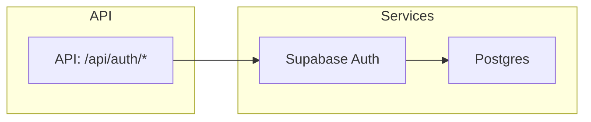

# 構造設計テンプレート（Structure Design）

## ヘッダ
- 機能: <機能名>
- タスクID: <TASK_ID>
- 参照仕様: <参照ファイル一覧>
- 作成者: <名前>
- 日付: YYYY-MM-DD

## 1. 要約
（1-2行で機能の目的とゴールを記載）

## 2. 要求—アーキテクチャ トレーサビリティマトリクス
- **注記（要件ID の付与ルール）**: 仕様に要件IDがない場合は `REQ-<FEATURE>-<NNN>`（例: `REQ-AUTH-001`）の形式で自動割当してください。必ず元の仕様の節番号/見出しを引用し、対応する行に書いてください。

| 仕様セクション | 要求ID | アーキテクチャID | 設計成果物 | ファイルパス | 備考 |
|---|---:|---|---|---|---|
| 例: 登録確認フロー | REQ-AUTH-001 | ARCH-AUTH-01 | モジュール図, API一覧 | `docs/ArchitectureDesign/auth-structure.md` |

- **注記**: アーキテクチャID は `ARCH-<SCOPE>-<NNN>` の形式でユニークに付与してください（例: `ARCH-AUTH-01`）。出力先ファイルは以下の標準パスを使用してください:  
  - 構造設計: `docs/ArchitectureDesign/<feature>-structure.md`  
  - 詳細設計: `docs/DetailDesign/<feature>-detailed.md` または `src/features/<feature>/design.md`（プロジェクト慣例に合わせる）

- **実装ファイル指示（追加要件）**: 構造設計には各アーキテクチャ要素ごとに「実装ファイルの推奨パス」(API route, service, schema, migration, unit test, E2E test, OpenAPI) を明記してください。例: `src/app/api/auth/register/route.ts`, `src/features/auth/schemas/register.ts`, `migrations/001_create_password_reset_tokens.sql`, `tests/auth/register.test.ts`。これにより、構造設計から実装までのトレーサビリティが明確になります。


## 3. 高レベルアーキテクチャ
- Mermaid モジュール図（例を示す）



## 4. 推奨ディレクトリ構成
```
src/features/auth/
  ├─ api/
  ├─ components/
  ├─ hooks/
  └─ tests/
```

## 5. 重要設計決定（ADR）
- 簡潔に設計決定と理由を列挙する（例: セッション管理はサーバ側 Cookie を採用）

## 6. 未解決の質問（設計確認用）
- ここに Product/Spec に確認が必要な事項を列挙する

## 7. 実装ファイル現状確認（必須）
- 構造設計には、各アーキテクチャ要素に対して「実装ファイルの推奨パス」とその**現状（存在有無・既存ファイルパス）**を明記してください。
- 例テーブル列: `アーキテクチャID | 推奨実装パス | 現状: 存在/未存在 | 既存ファイル (あればパス) | 備考`

## 8. 削除提案フロー（必要時）
- 古いファイルを削除する提案を行う場合は、次の情報を必須で添付してください:
  - 削除理由（冗長性・保守性/リファクタ理由）
  - 影響範囲（参照されるファイル・PR・CI/CD・デプロイ手順）
  - ロールバック手順と影響軽減案
  - 推奨レビュア（承認者）リスト
  - データ移行/バックアップ手順（DB 構造が関係する場合）
- 削除は **承認後にのみ**実行し、PR の説明に `BREAKING CHANGE` を明示して下さい。

## 9. 生成後の検証（必須）
- 構造設計と詳細設計を生成した後、以下の自動検証を実行してください（生成タスクの最後に実施）:
  1. `npm run validate-docs` を実行し、Markdown Preview Enhanced でエラーが出ないことを確認する。
  2. 参照した `SPEC_FILES` と `docs/seq/*` を解析し、仕様に記載された要件（REQ-...）が**すべて**構造設計（トレーサビリティマトリクス）と詳細設計に網羅されているかチェックする。出力は `coverage-report.md` として保存し、PR に添付すること。
  3. カバレッジ漏れ・レンダリングエラーがある場合は、設計を修正して再実行し、すべてパスするまでコミットしないこと。

## 7. 見積り & 優先度
- 各アーティファクトごとに概算人日と優先度を記載する

*このテンプレートは構造設計に特化しています。詳細設計は別ファイルで提供してください。*