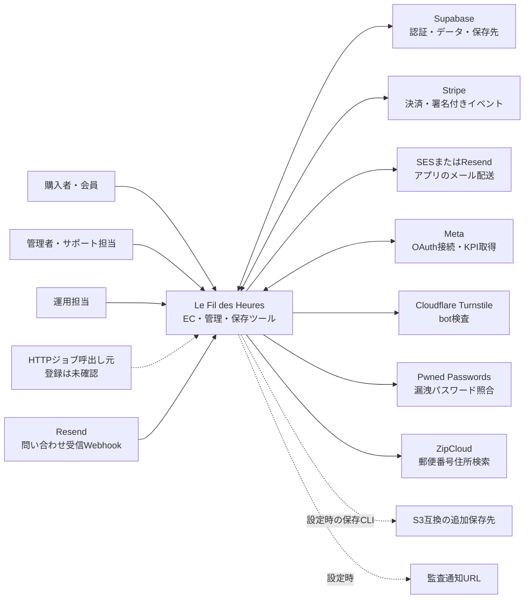

# システムコンテキスト

> 確認日: 2026-10-04 | 対象: Le Fil des HeuresのEC・管理・保存ツール | 根拠: リポジトリ内の実装

## 概要

購入者・会員と管理者が利用するシステムと、直接連携する外部サービスの境界を示す。対象システムにはWebアプリと別プロセスの法定保存CLIを含める。図は実装に存在する接続であり、本番配置や外部サービスの契約・稼働を表すものではない。内部構成は[システム構成](../03_BasicDesign/architecture/system-overview.md)、実行基盤は[デプロイ・運用構成](../06_Operations/deployment-topology.md)を参照する。

## 利用者と外部システム

矢印は要求・データ受渡しの関係で、通常の応答は省略する。破線は設定・呼出し基盤の確認が必要な経路。管理UIのadmin/supporter表示、DB ACL、JWT AAL2は別の制御であり、利用者の役割だけからAPI操作権限を保証しない。

## 接続の用途と実装根拠

| 接続 | 確認した用途・条件 | 実装根拠 |
| --- | --- | --- |
| 購入者・会員 | 商品・コンテンツ閲覧、検索、カート、ゲスト購入、会員認証・注文確認・問い合わせ | [画面一覧](../03_BasicDesign/ui/screen-list.md)、[ユースケース](../02_Requirements/use-cases.md) |
| 管理者・サポート担当 | 商品・コンテンツ・注文・会計・KPI・利用者権限。画面表示とAPI認可は別 | [管理画面](../../src/app/admin/page.tsx)、[管理認可](../../src/lib/auth/admin-rbac.ts) |
| 運用担当・HTTPジョブ | DB migration、キューworker、見回り、Meta同期、保存・復元CLI。自動起動の登録は未確認 | [運用構成](../06_Operations/deployment-topology.md) |
| Supabase | 公開キー/JWT/service-roleによるAuth・Postgres/RPC・Storage。Google OAuthの開始・コード交換もSupabase Authを使う。Auth配信メールの設定はアプリのMAIL_PROVIDERとは別 | [クライアント](../../src/lib/supabase/server.ts)、[OAuth](../../src/app/api/auth/oauth/start/route.ts)、[保存先](../../src/lib/legal-archive/supabase-storage.ts) |
| Stripe | Checkout、支払い現在値、返金、会計記録、Webhook受付。受付200と非同期業務処理の完了を区別 | [購入](../04_DetailDesign/sequence/checkout-payment.md)、[Webhook](../04_DetailDesign/sequence/stripe-webhooks.md) |
| アプリのメール配送 | MAIL_PROVIDERでSES/Resend選択、未指定のコード上の既定はSES。再設定・注文・通知等を送る | [選択](../../src/lib/mail.ts)、[SES](../../src/lib/mail/adapters/ses.ts)、[Resend](../../src/lib/mail/adapters/resend.ts) |
| 問い合わせ受信 | ResendからSvix形式の署名付きWebhookを受け、問い合わせへ相関付けする。送信用provider選択とは独立 | [受信API](../../src/app/api/contact/inbound/route.ts) |
| Meta | OAuth接続・管理KPIの手動/Cron同期。接続情報・設定と権限が必要 | [接続](../../src/app/api/admin/kpi/meta/connect/route.ts)、[Graph API](../../src/lib/meta/graph-client.ts)、[同期](../../src/lib/meta/sync-kpi.ts) |
| Turnstile | ブラウザwidgetとサーバーsiteverify。productionでsecret未設定なら検証拒否 | [ログインUI](../../src/components/LoginModal.tsx)、[検証](../../src/lib/turnstile.ts) |
| Pwned Passwords | SHA-1先頭5文字で登録・再設定パスワードを照合。サービス障害時の続行は呼出し側の条件 | [照合](../../src/lib/pwned-password.ts)、[登録](../../src/app/api/auth/register/route.ts) |
| ZipCloud | 郵便番号のメモリ/DB cache miss時に住所検索する | [住所検索](../../src/features/checkout/services/postal-code.service.ts) |
| S3互換保存先 | 保存CLIの追加保存先。bucket/regionの両方で生成、両方未設定なら生成しない、片方だけなら設定エラー | [保存CLI](../../scripts/legal-archive/run-daily.ts)、[S3 adapter](../../src/lib/legal-archive/s3-storage.ts) |
| 監査通知 | 設定された通知URLへ監査情報を送る任意経路 | [監査](../../src/lib/audit.ts) |

## ブラウザ側の外部境界

Google OAuth、Google Maps、SNS、配送追跡、外部画像はブラウザの遷移・埋込み・取得として扱う。Mapsリンクをサーバーの住所検索APIと混同しない。根拠は[OAuth](../04_DetailDesign/sequence/auth-oauth.md)、[店舗表示](../../src/features/stockist/components/PublicStockistGrid.tsx)、[Footer](../../src/components/Footer.tsx)、[配送追跡](../../src/lib/orders/shipping-carriers.ts)、[画像設定](../../next.config.ts)。ビルド時のフォント取得などは利用時の事業連携とは分け、配置構成で説明する。

## 形式と未確認事項

[C4 system context](https://c4model.com/diagrams/system-context)を参考に、対象システム・利用者・外部システムを示す境界図とした。各サービスの内部SQL・ネットワーク・本番設定を推測して描かない。Redis adapterは存在するが現在のアプリ呼出し経路の根拠がないため、稼働サービスとして追加しない。

本番配置先、実URL、メール/OAuth/Meta/ストレージの有効化、Cron登録、migration適用、保存実績は未確認。要求全体の充足は[要件一覧](../02_Requirements/requirements.md)と[テスト仕様](../05_Quality/tests/test-spec.md)で別に確認する。
