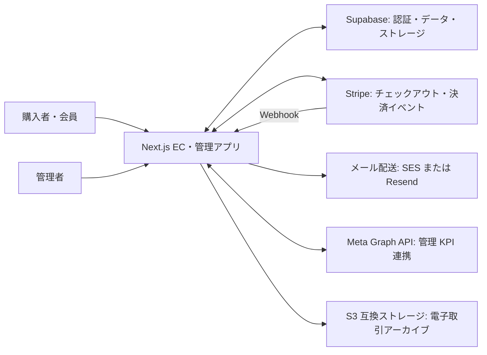

# システムコンテキスト

> 対象: Le Fil des Heures の EC サイトと管理機能。以下はリポジトリ内の実装から確認できる接続関係であり、稼働環境の構成や運用開始状況を示すものではない。

## 概要

購入者と管理者は Next.js アプリを利用する。アプリは Supabase、Stripe、メール配送サービス、Meta Graph API と連携する。電子取引の記録には、環境設定により S3 互換ストレージを使うコードもある。構成図は C4 のシステムコンテキスト図を参考にし、外部との境界を表す。

## 利用者と外部システム

| 接続 | このリポジトリで確認した用途 | 実装の根拠 |
| --- | --- | --- |
| 購入者・会員 → アプリ | 商品閲覧、カート、チェックアウト、会員操作 | [商品 API](../../src/app/api/items/%5Bid%5D/route.ts)、[カート API](../../src/app/api/cart/route.ts)、[チェックアウト](../../src/app/api/checkout/create-session/route.ts) |
| 管理者 → アプリ | 商品、注文、KPI 等の管理 | [管理画面](../../src/app/admin/page.tsx)、[商品管理 API](../../src/app/api/admin/items/route.ts)、[KPI API](../../src/app/api/admin/kpi/route.ts) |
| アプリ ↔ Supabase | サーバー側クライアントを介した認証・データアクセス、ストレージ利用 | [Supabase クライアント](../../src/lib/supabase/server.ts)、[証憑ストレージ](../../src/lib/legal-archive/supabase-storage.ts) |
| アプリ ↔ Stripe | Checkout Session の作成、署名検証を伴う Webhook の受信 | [セッション作成](../../src/app/api/checkout/create-session/route.ts)、[Webhook](../../src/app/api/webhook/stripe/route.ts) |
| アプリ → メール配送 | 設定値に応じて SES または Resend のアダプターを選択 | [メール配送の切替](../../src/lib/mail.ts)、[SES](../../src/lib/mail/adapters/ses.ts)、[Resend](../../src/lib/mail/adapters/resend.ts) |
| アプリ ↔ Meta Graph API | 管理者向け接続と KPI 同期で Graph API を呼び出す | [Graph クライアント](../../src/lib/meta/graph-client.ts)、[KPI 同期](../../src/app/api/cron/meta-kpi-sync/route.ts) |
| アプリ → S3 互換ストレージ | 電子取引アーカイブ用のストレージ実装。バケットとリージョンの設定がある場合に生成 | [S3 アダプター](../../src/lib/legal-archive/s3-storage.ts) |

## 境界と読み方

- 図はソースコードに存在する連携先を示す。デプロイ先、実際のメール事業者、S3 の有効化、外部サービスの契約状態はこの図から判定しない。
- Stripe の Webhook はアプリの受信 API に入る。処理・保存の詳細は [Webhook の実装](../../src/app/api/webhook/stripe/route.ts)を参照する。
- ユースケースと要件への対応は [ユースケース一覧](../02_Requirements/use-cases.md)と[要件定義書](../02_Requirements/requirements.md)を参照する。

## 図の形式

[C4 モデルのシステムコンテキスト図](https://c4model.com/diagrams/system-context)を形式上の参考とした。図の接続内容の根拠は上表のソースコードである。
