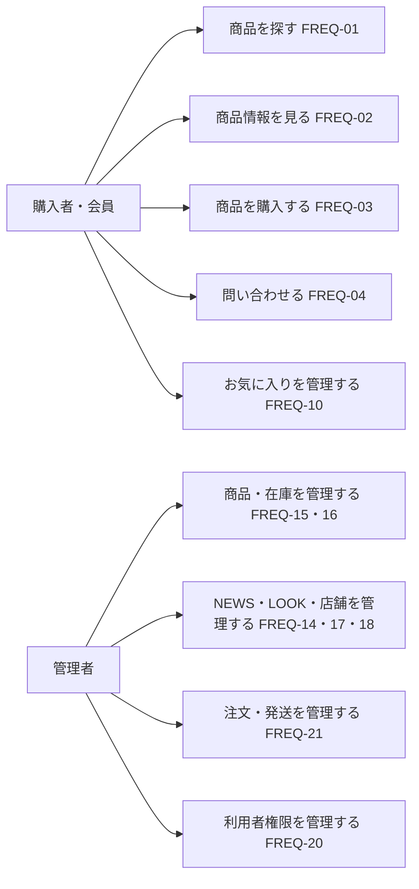

# ユースケース一覧

> 対象: 購入者・会員と管理者の主要な操作。要求IDは既存文書から引用し、この一覧では新しい要件を定義しない。

## 概要

利用者が達成したい目的と、対応する既存の要求を一覧にする。各行は要求の索引であり、実装完了や受け入れ判定を意味しない。詳細条件と受け付け基準は[要件定義書](requirements.md)、事業上の要求は[ステークホルダー要求](stakeholder-requirements.md)を参照する。

## ユースケース図

矢印は利用者が目的を開始する関係を示す。実際の画面間の遷移は[画面遷移図](../03_BasicDesign/ui/screen-flow.md)を参照する。
## 主要ユースケース

| 利用者 | 目的 | 既存の要求ID | 関連する入口の例 |
| --- | --- | --- | --- |
| 購入者 | 商品を検索する | `FREQ-01` | [検索ページ](../../src/app/search/page.tsx) |
| 購入者 | 商品情報を閲覧する | `FREQ-02` | [商品一覧](../../src/app/item/page.tsx)、[商品詳細](../../src/app/item/%5Bid%5D/page.tsx) |
| 購入者 | 商品を購入する | `FREQ-03` | [カート](../../src/app/cart/page.tsx)、[チェックアウト](../../src/app/checkout/page.tsx) |
| 購入者 | 問い合わせる | `FREQ-04` | [問い合わせページ](../../src/app/contact/page.tsx) |
| 購入者・会員 | 商品をお気に入りに登録する | `FREQ-10` | [ウィッシュリスト API](../../src/app/api/wishlist/route.ts) |
| 購入者 | 取り扱い店舗を確認する | `FREQ-13` | [店舗ページ](../../src/app/stockist/page.tsx) |
| 管理者 | News を管理する | `FREQ-14` | [News 管理 API](../../src/app/api/admin/news/route.ts) |
| 管理者 | Item を管理する | `FREQ-15` | [Item 管理 API](../../src/app/api/admin/items/route.ts) |
| 管理者 | Item の在庫を管理する | `FREQ-16` | [バリアント管理 API](../../src/app/api/admin/items/%5Bid%5D/variants/route.ts) |
| 管理者 | Look を管理する | `FREQ-17` | [Look 管理 API](../../src/app/api/admin/looks/route.ts) |
| 管理者 | Stockist を管理する | `FREQ-18` | [Stockist 管理 API](../../src/app/api/admin/stockists/route.ts) |
| 管理者 | KPI を確認・管理する | `FREQ-19` | [KPI 管理 API](../../src/app/api/admin/kpi/route.ts) |
| 管理者 | ユーザー権限を管理する | `FREQ-20` | [ユーザー管理 API](../../src/app/api/admin/users/route.ts) |
| 管理者 | 注文と発送状態を管理する | `FREQ-21` | [注文管理 API](../../src/app/api/admin/orders/route.ts)、[状態更新 API](../../src/app/api/admin/orders/%5Bid%5D/status/route.ts) |

## 適用範囲とトレーサビリティ

- 要求IDは[ステークホルダー要求](stakeholder-requirements.md)の要求定義表と[要件定義書](requirements.md)の冒頭の対応表で確認した。後続の個別節で同じ番号が別の文脈にも使われているため、番号だけでなく要求文も照合する。
- 入口はコード上の関連箇所を示す。要求全体の充足や本番環境での利用可否は、詳細要件とテスト結果で別途判断する。
- 返品、試着、予約注文、キャンセル、発送管理者の操作など、要求表にある他の目的はこの主要ユースケース表の対象外である。対応漏れを意味しない。
