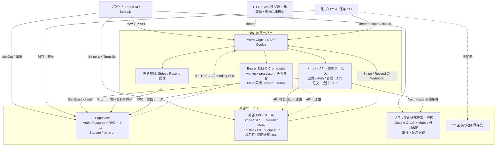
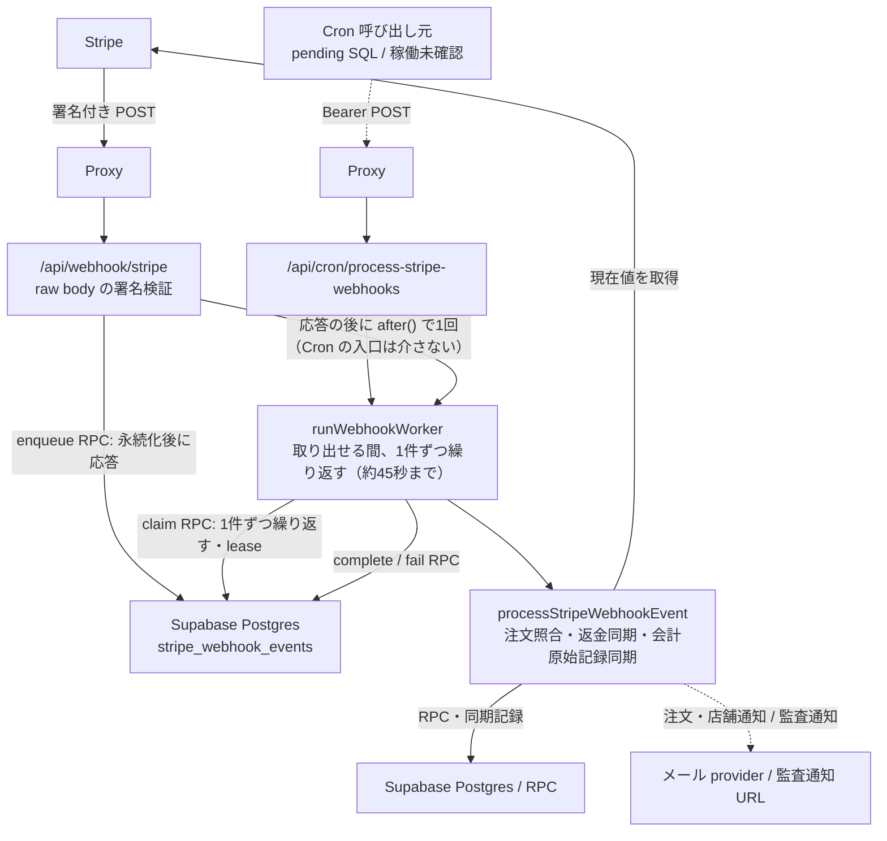
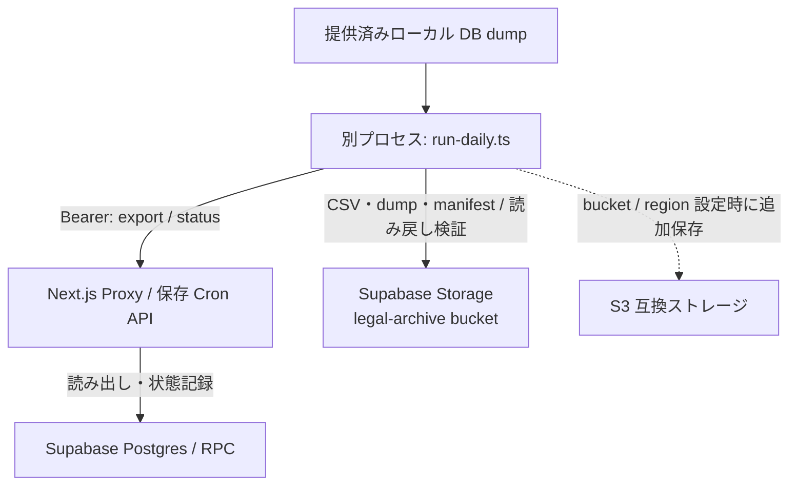

# システム構成（現行実装）

## 概要

確認日: 2026-10-03（「Stripe 非同期処理」の行と「Stripe Webhook の処理」の図は、2026-10-07 に確認し直した。「HTTP ジョブ登録」の行は、照合の登録が抜けていたので足し、同じ日に確認し直した）。対象ソース: `697836a1eb2b62e1a3257ce079ecf8f536e1cb06`（確認し直した行と図は `b54976d2`。「HTTP ジョブ登録」の行は、保留中の SQL 3本を `0781d3ff` で読んで確かめた）。

本書はリポジトリ内で確認した実装と呼び出し経路を示す。ブラウザ、Next.js サーバー、外部サービス、別プロセスの運用スクリプトを区別する。本番配置先、環境変数の値、外部サービスの有効化、適用済み migration、ジョブの稼働は未確認である。

## システム構成図

矢印は要求・処理の方向を示す（通常の応答は省略）。破線は設定・接続情報または別途ジョブ登録が必要な経路であり、稼働を意味しない。DB キューは Supabase 内の永続化先、worker は Next.js の Route Handler である。

外部サービスは機能別にまとめている。各経路の provider 選択・設定条件と実装ソースは後続の表を参照する。署名付きイベントと Cron の処理経路は次の図で示す。

### Stripe Webhook の処理

### 法定保存の実行境界

## 実装の根拠と条件

| 構成・経路 | 確認できる内容・条件 | ソース |
|---|---|---|
| 画面・サーバー | Next.js / React の依存、App Router ページ、同一 origin API 呼び出し。Proxy の入口処理と認証判定は別 | [package.json](../../../package.json)、[トップページ](../../../src/app/page.tsx)、[LoginContext](../../../src/contexts/LoginContext.tsx)、[Proxy](../../../src/proxy.ts) |
| Supabase クライアント | サーバーの匿名・利用者 JWT・service role と、ブラウザの公開キー用クライアント。ブラウザ SDK の確認済み呼び出しはログアウト | [server.ts](../../../src/lib/supabase/server.ts)、[client.ts](../../../src/lib/supabase/client.ts)、[LoginContext](../../../src/contexts/LoginContext.tsx) |
| Auth / Google OAuth | パスワード、メール OTP、TOTP、Google OAuth 開始・コード交換。Auth の OTP 配送設定はアプリのメール送信 provider から判断できない | [login](../../../src/app/api/auth/login/route.ts)、[OTP](../../../src/app/api/auth/otp/verify/route.ts)、[MFA](../../../src/app/api/auth/mfa/verify/route.ts)、[OAuth開始](../../../src/app/api/auth/oauth/start/route.ts)、[callback](../../../src/app/api/auth/oauth/callback/route.ts) |
| Stripe の決済・照合 | ブラウザの CheckoutProvider / PaymentElement、サーバーの Session 作成、Stripe 現在値による注文照合 | [checkout UI](../../../src/app/checkout/page.tsx)、[create-session](../../../src/app/api/checkout/create-session/route.ts)、[照合](../../../src/lib/stripe/checkout-payment-reconciler.ts)、[現在値取得](../../../src/lib/stripe/checkout-payment-reader.ts) |
| Stripe 非同期処理 | 署名検証後、13種のイベントだけを DB 永続化する（鍵と違うモードの知らせは保存しない）。応答の後に `after()` で worker を1回動かし、毎分の Cron 呼び出しも同じ worker を起動する。worker は、取り出せる知らせが無くなるか約45秒たつまで、1件ずつ claim して注文・返金・会計を同期し、完了 / 失敗を記録する。DB RPC が重複排除・lease・再試行（9回目の失敗で退避）を管理 | [入口](../../../src/app/api/webhook/stripe/route.ts)、[worker](../../../src/app/api/cron/process-stripe-webhooks/route.ts)、[繰り返し](../../../src/lib/stripe/webhook-drain.ts)、[processor](../../../src/lib/stripe/webhook-processor.ts)、[キュー migration](../../../supabase/migrations/20260925000303_add_stripe_webhook_queue.sql)、[退避 migration](../../../supabase/migrations/20261007030242_webhook_queue_dead_letter.sql) |
| メール | `MAIL_PROVIDER` による SES / Resend 選択（未指定時のコード上の既定は SES）。問い合わせの Resend / Svix 受信経路は別 | [送信選択](../../../src/lib/mail.ts)、[SES](../../../src/lib/mail/adapters/ses.ts)、[Resend](../../../src/lib/mail/adapters/resend.ts)、[受信](../../../src/app/api/contact/inbound/route.ts) |
| Meta KPI | OAuth 接続、手動 / Cron の Graph API 同期。アプリ設定・暗号化鍵・保存済み接続が必要。使用する KPI / Meta テーブルの DDL は旧 `migrations/` にあり、現行 `supabase/migrations/` での定義は確認できない（実 DB の有無は未確認） | [config](../../../src/lib/meta/config.ts)、[接続](../../../src/app/api/admin/kpi/meta/connect/route.ts)、[callback](../../../src/app/api/admin/kpi/meta/callback/route.ts)、[手動同期](../../../src/app/api/admin/kpi/meta/sync/route.ts)、[同期](../../../src/lib/meta/sync-kpi.ts)、[Graph client](../../../src/lib/meta/graph-client.ts)、[旧 KPI DDL](../../../migrations/063_create_admin_kpi_monthly_records.sql)、[旧 Meta DDL](../../../migrations/079_create_meta_kpi_integration.sql) |
| Bot・漏洩・住所検査 | Turnstile widget と siteverify（production で secret 未設定なら拒否）。HIBP へ SHA-1 の先頭5文字を送信。ZipCloud は郵便番号の DB / プロセス内キャッシュにない場合に照会 | [LoginModal](../../../src/components/LoginModal.tsx)、[Turnstile](../../../src/lib/turnstile.ts)、[登録 API](../../../src/app/api/auth/register/route.ts)、[HIBP](../../../src/lib/pwned-password.ts)、[郵便番号 API](../../../src/app/api/checkout/postal-code/route.ts)、[住所検索](../../../src/features/checkout/services/postal-code.service.ts) |
| Storage | 商品・NEWS・LOOK画像、`finance-receipts` の証憑保存・署名 URL 発行 | [商品画像](../../../src/app/api/admin/items/route.ts)、[NEWS画像](../../../src/lib/storage/news-images.ts)、[LOOK画像](../../../src/app/api/admin/looks/route.ts)、[証憑](../../../src/app/api/admin/kpi/cost-profit/receipt/route.ts) |
| 法定保存 | API は export / status のみ。別プロセスの CLI が CSV・既存 DB dump・manifest を Supabase Storage に保存し、S3 bucket / region 設定時は追加保存。この CLI に DB dump 生成処理はない | [run-daily](../../../scripts/legal-archive/run-daily.ts)、[export](../../../src/app/api/cron/legal-archive/export/route.ts)、[status](../../../src/app/api/cron/legal-archive/status/route.ts)、[Supabase保存](../../../src/lib/legal-archive/supabase-storage.ts)、[S3保存](../../../src/lib/legal-archive/s3-storage.ts)、[保存・検証](../../../src/lib/legal-archive/storage.ts) |
| 監査・rate limit | 監査は DB 保存、`ALERT_AUDIT_URL` 設定時はマスク済み記録を POST。rate limit は DB カウンター | [audit](../../../src/lib/audit.ts)、[rateLimit](../../../src/features/auth/middleware/rateLimit.ts)、[DBカウンター](../../../src/features/auth/ratelimit/index.ts) |
| 外部表示・リンク | Google Maps iframe / 検索、UI 見本の readdy.ai 画像、SNS・配送追跡リンク。Next Image の許可先には placehold.co / readdy.ai / Supabase がある。許可設定だけでは実際のアクセスを意味しない | [MapView](../../../src/components/ui/MapView/MapView.tsx)、[取扱店](../../../src/features/stockist/components/PublicStockistGrid.tsx)、[UI見本](../../../src/app/ui/page.tsx)、[共有](../../../src/components/ShareButtons.tsx)、[SNS](../../../src/lib/social.ts)、[配送](../../../src/lib/orders/shipping-carriers.ts)、[画像設定](../../../next.config.ts) |

## 要求・認可の境界

- Proxy は `/api` の POST / PUT / PATCH / DELETE で Origin / Referer を検査し、CSP 等を付与する。`/api/webhook`、`/api/contact/inbound`、`/api/cron` は除外対象で、各入口の署名または Bearer 検証を使用する。[Proxy](../../../src/proxy.ts)
- 認証の共通処理は Cookie / Bearer の JWT を `getClaims` で検証し、issuer / audience と `is_auth_session_active` RPC を確認する。管理権限の共通処理は DB の ACL と JWT の AAL2 を追加確認する。公開 API もあるため全要求へのログイン必須を意味しない。[認証](../../../src/lib/auth/authenticate.ts)、[RBAC](../../../src/lib/auth/admin-rbac.ts)、[公開商品API](../../../src/app/api/items/route.ts)
- service role の処理と利用者 JWT の処理はクライアントが分かれる。認可条件は Route Handler と共通関数で確認する。[クライアント生成](../../../src/lib/supabase/server.ts)、[証憑API](../../../src/app/api/admin/kpi/cost-profit/receipt/route.ts)

## ジョブ・配置と確認範囲

| 対象 | リポジトリの定義 | 未確認事項 |
|---|---|---|
| HTTP Cron | `CRON_SECRET`: [worker](../../../src/app/api/cron/process-stripe-webhooks/route.ts)、[注文見回り](../../../src/app/api/cron/expire-pending-orders/route.ts)、[Stripe照合](../../../src/app/api/cron/stripe-reconcile/route.ts)、[Meta同期](../../../src/app/api/cron/meta-kpi-sync/route.ts)。保存 export / status は `LEGAL_ARCHIVE_CRON_SECRET` | 呼び出し基盤・設定値・実行結果 |
| HTTP ジョブ登録 | [worker pending SQL](../../../supabase/pending/schedule_stripe_webhook_worker.sql): 毎分（`* * * * *`）。受け取り口も保存の後に worker を1回動かすので、毎分の起動は取りこぼしを拾う役目。[注文見回り pending SQL](../../../supabase/pending/schedule_expire_pending_orders.sql): 毎時。[Stripe 照合 pending SQL](../../../supabase/pending/schedule_stripe_reconcile.sql): 毎日 18:00 UTC（`0 18 * * *`）、POST。いずれも pg_cron / pg_net / Vault を使用。pending SQL は開店のときに `supabase/pending/` から当てる（[手順書](../../06_Operations/webhook-queue-operations.md)の1） | pending SQL の適用・登録。ファイルの存在は適用済みの証明ではない |
| DB 内ジョブ | migration の [未完了 draft 保持期限処理](../../../supabase/migrations/20260911235714_add_checkout_drafts_retention_job.sql)、[rate limit 保持期限処理](../../../supabase/migrations/20260913132437_add_rate_limit_counters_retention_job.sql) | migration の適用・ジョブ稼働 |
| 保存・復元確認 | [package.json](../../../package.json) の保存 / 復元確認コマンド。[verify-restore](../../../scripts/legal-archive/verify-restore.ts) は提供済みファイルと復元先 Postgres を照合 | 実行基盤・dump 作成元・復元の実施 |
| ビルド・配置 | 開発 / ビルド / 起動コマンド、[READMEのVercel手順](../../../README.md)、[layoutのnext/font/google](../../../src/app/layout.tsx) | 現在の配置先・ドメイン・リージョン・ビルド時の外部取得結果 |
| DB CI | [db-migrations.yml](../../../.github/workflows/db-migrations.yml): PR で `db push --dry-run`、対象 push / 手動実行で `db push`。対象は `supabase/migrations/` | GitHub Secrets・実行履歴・対象 DB・適用済み migration |

[Redis REST アダプタ](../../../src/lib/cache/redis-cache.ts) は存在するが、確認時点の `src/` に呼び出し元がないため稼働経路の図には含めていない。[Supabase ローカル設定](../../../supabase/config.toml) の Realtime / Studio / ローカル SMTP 等も、本番でのアプリ連携・稼働の根拠とはしていない。

関連: [ER図](../data/er.md)、[API一覧](../api/api-spec.md)、[認証シーケンス](../../04_DetailDesign/sequence/auth-login-mfa.md)、[注文・決済の状態](../../04_DetailDesign/states/order-payment.md)。
