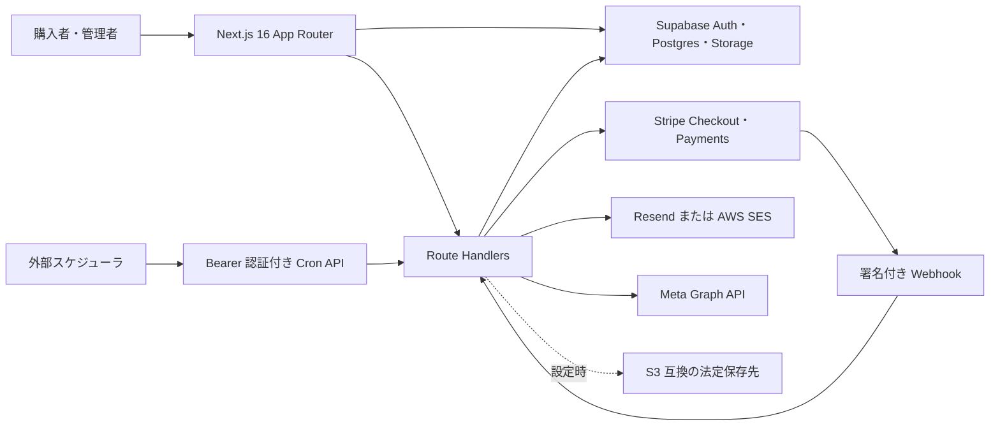

# システム構成（現行実装）

## 概要

この文書は、リポジトリ内で確認できる実装の境界と外部連携を示す。稼働中の本番環境、外部サービスの設定値、ジョブの登録状態は確認していない。

## 構成要素

| 要素 | 実装上の役割 | 根拠 |
|---|---|---|
| Next.js / React | 画面、Route Handler、Proxy | `package.json`、`src/app/`、`src/proxy.ts` |
| Supabase | 認証、Postgres、Storage。サーバー側には公開キー用と service role 用のクライアントがある | `src/lib/supabase/server.ts`、`supabase/config.toml` |
| Stripe | Checkout Session の作成、支払い照合、署名付き Webhook の受信 | `src/app/api/checkout/create-session/route.ts`、`src/app/api/webhook/stripe/route.ts` |
| メール | Resend と SES のアダプタ。受信返信は Resend/Svix 署名を検証する | `src/lib/mail/adapters/`、`src/app/api/contact/inbound/route.ts` |
| Meta | 管理 KPI の Graph API 同期 | `src/lib/meta/sync-kpi.ts` |
| 法定保存 | S3 クライアントを使った保存 | `src/lib/legal-archive/s3-storage.ts` |

ブラウザと API の認証は Supabase の JWT とセッション有効性を確認する。管理 API はさらに DB のロール・権限表と AAL2 を確認する。状態変更 API には Proxy の Origin 検査があり、署名で検証する Webhook と Bearer 認証の Cron などは例外となる。詳細は [認証シーケンス](../../04_DetailDesign/sequence/auth-login-mfa.md)と[API 一覧](../api/api-spec.md)を参照。

## 配置と運用の確認範囲

`package.json` には開発・ビルド・起動コマンドがあり、README には Vercel への配置手順がある。`.github/workflows/db-migrations.yml` は `supabase/migrations/` の変更時に Supabase CLI の `db push` を実行する構成である。これらはリポジトリ上の構成であり、現在の本番配置先や適用済み migration を証明しない。Cron の本番登録も未確認である。

関連: [ER 図](../data/er.md)、[注文・決済の状態](../../04_DetailDesign/states/order-payment.md)。
