# ER 図（現行リポジトリの実装）

## 概要

`supabase/migrations/` の基準スキーマと後続変更を時系列で確認し、定義された全テーブルと物理 FK を示す。主な対象は **59 テーブル（public 56、private 1、security 2）と 63 FK（public 起点 62、private 起点 1）**。加えて、現行コードが使うもののこの SQL 列に定義がない **3 テーブルと旧 SQL の 2 FK**、現行 SQL にある **1 ビュー** を第 6 節に記録する。`auth.users` は参照先の外部スキーマとして表示し、このテーブル数に含めない。

確認日: **2026-10-03**。ソース基準コミット: `697836a1eb2b62e1a3257ce079ecf8f536e1cb06`。基準は [20260901102912_remote_schema.sql](../../../supabase/migrations/20260901102912_remote_schema.sql)、最後の対象ファイルは [20260927100800_retire_legacy_order_rpcs.sql](../../../supabase/migrations/20260927100800_retire_legacy_order_rpcs.sql)。対象の 40 SQL ファイルが定義する構造を記録しており、本番 DB の適用状況は確認していない。

グループ C（2026-10-08）の [20261008055720_checkout_order_owner_binding.sql](../../../supabase/migrations/20261008055720_checkout_order_owner_binding.sql) は、`checkout_drafts` に列 `buyer_user_id` を 1 つ足し、トリガーを 2 つ足す（下書きの買い手の変更禁止、注文の持ち主の付け替え禁止）。テーブルと FK の数は変わらない。この移行は本番へ未適用で、上の件数の集計には含めない。内容は 2.4・5.1・5.2 に書く。

図は領域別に分割する。PK・FK と関係を読むための列だけを載せ、全列、CHECK、RLS、トリガー、RPC、Storage オブジェクトの一覧は SQL に委ねる。旧 `migrations/` と `supabase/pending/` は主な集計の基準に含めず、現行コードが依存する旧定義だけを補足する。

| 領域 | 内容 |
| --- | --- |
| 認証・権限・利用者データ | セッション、権限中間表、プロフィール、カート、お気に入り |
| 商品・LOOK・在庫・注文 | 商品バリアント、在庫台帳、注文と改訂、注文メール送信権 |
| 決済・会計・問い合わせ | Stripe 記録、証憑、固定資産、原価配賦、年度締め、問い合わせ |
| 独立したテーブル | KPI、監査、アーカイブ、コンテンツ、キャッシュ、レート制限 |

## 1. 凡例と関係の範囲

- エンティティ名は SQL テーブル名の大文字表記。`AUTH_USERS`、`PRIVATE_ORDER_EMAILS`、`SECURITY_*` 以外は `public` スキーマ。
- `PK` は主キー、`FK` は SQL の `REFERENCES`、`UK` は列単独の一意性。複合キー・式インデックスは後述の一覧に記載する。`NULL` は nullable、`NOT_NULL` は非 nullable。
- 親側 `||` は子行から必ず 1 親、`|o` は子行から 0 または 1 親。子側 `o{` は親行から 0 件以上、`o|` は親行から 0 または 1 件。FK は親行に子行の存在を要求しない。
- 実線は FK 列が子の PK を構成する関係、点線は PK を構成しない関係。**どちらも物理 FK** であり、アプリケーション上の関連を線で推測しない。
- 同じテーブルを複数の図に表示する場合がある。各 FK は 1 つの領域図に表示し、第 4 節で参照先、nullable、子件数、削除動作を確認できる。

## 2. 領域別 ER 図

### 2.1 認証・権限・プロフィール・カート

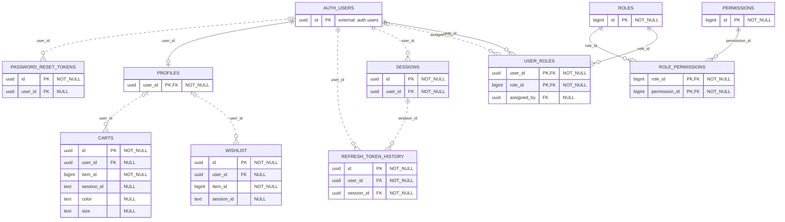

### 2.2 商品・バリアント・LOOK

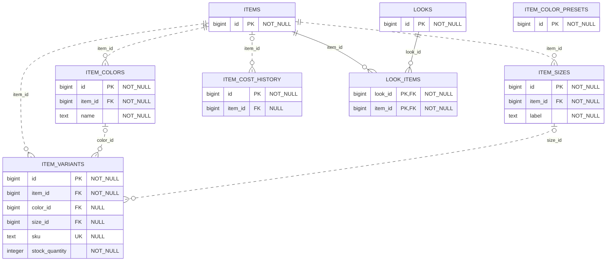

### 2.3 注文・改訂・在庫台帳・メール送信権

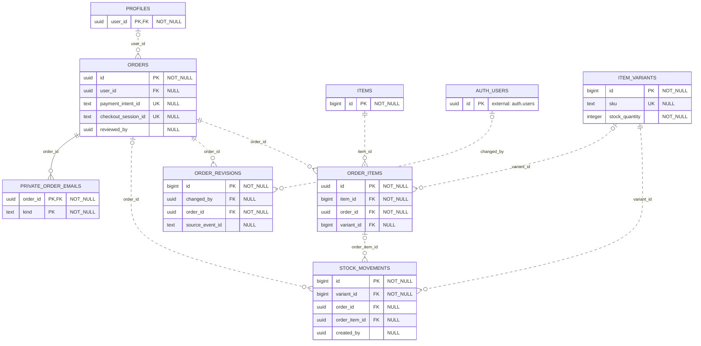

### 2.4 決済記録・Checkout 下書き

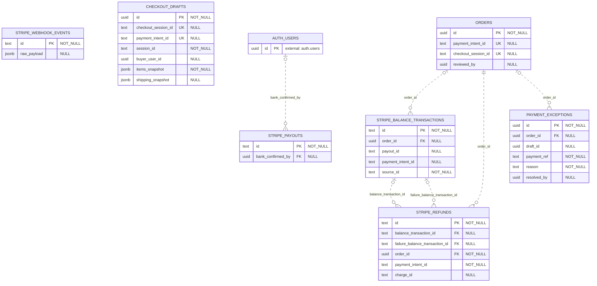

### 2.5 会計の業務関係

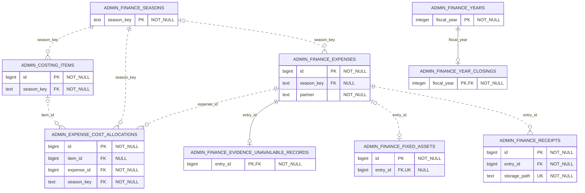

### 2.6 会計の実行者・確認者

#### 2.6.1 原価・取引・履歴の実行者

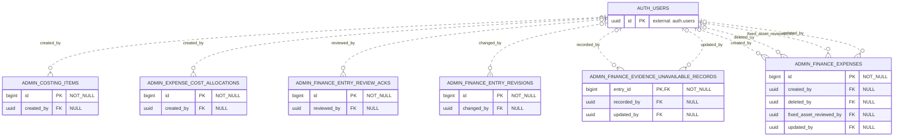

#### 2.6.2 テンプレート・固定資産・証憑・年度の実行者

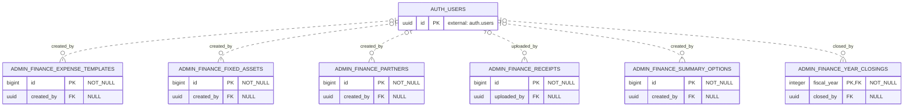

### 2.7 問い合わせ

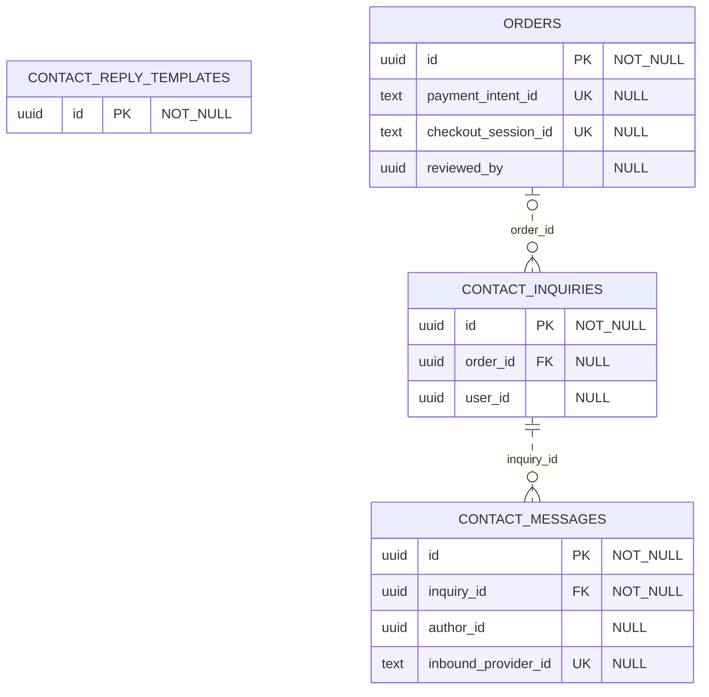

### 2.8 KPI・監査・保存・コンテンツ・補助データ

#### 2.8.1 KPI の記録・目標・資料

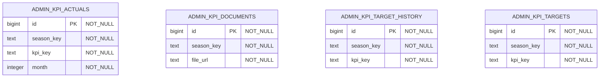

#### 2.8.2 監査・セキュリティ・アーカイブ

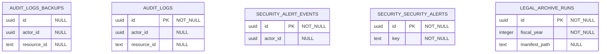

#### 2.8.3 コンテンツ・キャッシュ・レート制限

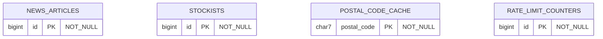

## 3. 全テーブルとキーの一覧

以下は 59 テーブルすべての定義元とキーの一覧。FK の有無は入出両方向で判定する。`audit_logs_backups.id` は主キーではなく nullable の通常列である。

### 3.1 認証・利用者

| テーブル | PK | PK 以外の一意性 | 物理 FK 接続 | 定義元 |
| --- | --- | --- | --- | --- |
| `public.profiles` | `(user_id)` | なし | 参照元 3 / 参照先 1 | [20260901102912:799](../../../supabase/migrations/20260901102912_remote_schema.sql#L799) |
| `public.sessions` | `(id)` | なし | 参照元 1 / 参照先 1 | [20260901102912:866](../../../supabase/migrations/20260901102912_remote_schema.sql#L866) |
| `public.refresh_token_history` | `(id)` | `(refresh_token_hash)` | 参照元 0 / 参照先 2 | [20260901102912:831](../../../supabase/migrations/20260901102912_remote_schema.sql#L831) |
| `public.password_reset_tokens` | `(id)` | `(token_hash)` | 参照元 0 / 参照先 1 | [20260901102912:759](../../../supabase/migrations/20260901102912_remote_schema.sql#L759) |
| `public.roles` | `(id)` | `(code)` | 参照元 2 / 参照先 0 | [20260901102912:854](../../../supabase/migrations/20260901102912_remote_schema.sql#L854) |
| `public.permissions` | `(id)` | `(code)` | 参照元 1 / 参照先 0 | [20260901102912:773](../../../supabase/migrations/20260901102912_remote_schema.sql#L773) |
| `public.user_roles` | `(user_id, role_id)` | なし | 参照元 0 / 参照先 3 | [20260901102912:1005](../../../supabase/migrations/20260901102912_remote_schema.sql#L1005) |
| `public.role_permissions` | `(role_id, permission_id)` | なし | 参照元 0 / 参照先 2 | [20260901102912:844](../../../supabase/migrations/20260901102912_remote_schema.sql#L844) |
| `public.carts` | `(id)` | `(COALESCE(user_id, UUIDゼロ), COALESCE(session_id, 空文字), item_id, COALESCE(color, 空文字), COALESCE(size, 空文字))` 式 UNIQUE | 参照元 0 / 参照先 1 | [20260901102912:444](../../../supabase/migrations/20260901102912_remote_schema.sql#L444) |
| `public.wishlist` | `(id)` | `(COALESCE(user_id, UUIDゼロ), COALESCE(session_id, 空文字), item_id)` 式 UNIQUE | 参照元 0 / 参照先 1 | [20260901102912:1018](../../../supabase/migrations/20260901102912_remote_schema.sql#L1018) |

### 3.2 商品・LOOK

| テーブル | PK | PK 以外の一意性 | 物理 FK 接続 | 定義元 |
| --- | --- | --- | --- | --- |
| `public.items` | `(id)` | なし | 参照元 6 / 参照先 0 | [20260901102912:572](../../../supabase/migrations/20260901102912_remote_schema.sql#L572) |
| `public.item_colors` | `(id)` | `(item_id, name)` | 参照元 1 / 参照先 1 | [20260919065336:7](../../../supabase/migrations/20260919065336_add_variant_inventory_tables.sql#L7) |
| `public.item_sizes` | `(id)` | `(item_id, label)` | 参照元 1 / 参照先 1 | [20260919065336:18](../../../supabase/migrations/20260919065336_add_variant_inventory_tables.sql#L18) |
| `public.item_variants` | `(id)` | `(sku)`; `(item_id, COALESCE(color_id, 0), COALESCE(size_id, 0))` 式 UNIQUE | 参照元 2 / 参照先 3 | [20260919065336:27](../../../supabase/migrations/20260919065336_add_variant_inventory_tables.sql#L27) |
| `public.item_cost_history` | `(id)` | なし | 参照元 0 / 参照先 1 | [20260901102912:557](../../../supabase/migrations/20260901102912_remote_schema.sql#L557) |
| `public.looks` | `(id)` | なし | 参照元 1 / 参照先 0 | [20260901102912:639](../../../supabase/migrations/20260901102912_remote_schema.sql#L639) |
| `public.look_items` | `(look_id, item_id)` | なし | 参照元 0 / 参照先 2 | [20260901102912:629](../../../supabase/migrations/20260901102912_remote_schema.sql#L629) |
| `public.item_color_presets` | `(id)` | `(name, hex)` | なし（独立） | [20260901102912:544](../../../supabase/migrations/20260901102912_remote_schema.sql#L544) |

### 3.3 注文・在庫台帳

| テーブル | PK | PK 以外の一意性 | 物理 FK 接続 | 定義元 |
| --- | --- | --- | --- | --- |
| `public.orders` | `(id)` | `(payment_intent_id)`; `(checkout_session_id)` | 参照元 8 / 参照先 1 | [20260901102912:718](../../../supabase/migrations/20260901102912_remote_schema.sql#L718) |
| `public.order_items` | `(id)` | なし | 参照元 1 / 参照先 3 | [20260901102912:677](../../../supabase/migrations/20260901102912_remote_schema.sql#L677) |
| `public.order_revisions` | `(id)` | なし | 参照元 0 / 参照先 2 | [20260901102912:698](../../../supabase/migrations/20260901102912_remote_schema.sql#L698) |
| `public.stock_movements` | `(id)` | なし | 参照元 0 / 参照先 3 | [20260919065355:6](../../../supabase/migrations/20260919065355_add_stock_movements.sql#L6) |
| `private.order_emails` | `(order_id, kind)` | なし | 参照元 0 / 参照先 1 | [20260920064241:17](../../../supabase/migrations/20260920064241_add_order_email_claims.sql#L17) |

### 3.4 決済・下書き

| テーブル | PK | PK 以外の一意性 | 物理 FK 接続 | 定義元 |
| --- | --- | --- | --- | --- |
| `public.stripe_balance_transactions` | `(id)` | なし | 参照元 2 / 参照先 1 | [20260901102912:907](../../../supabase/migrations/20260901102912_remote_schema.sql#L907) |
| `public.stripe_refunds` | `(id)` | なし | 参照元 0 / 参照先 3 | [20260901102912:963](../../../supabase/migrations/20260901102912_remote_schema.sql#L963) |
| `public.stripe_payouts` | `(id)` | なし | 参照元 0 / 参照先 1 | [20260901102912:934](../../../supabase/migrations/20260901102912_remote_schema.sql#L934) |
| `public.payment_exceptions` | `(id)` | `(payment_ref, reason)` | 参照元 0 / 参照先 1 | [20260927100500:6](../../../supabase/migrations/20260927100500_payment_exceptions.sql#L6) |
| `public.stripe_webhook_events` | `(id)` | なし | なし（独立） | [20260901102912:988](../../../supabase/migrations/20260901102912_remote_schema.sql#L988) |
| `public.checkout_drafts` | `(id)` | `(checkout_session_id)`; `(payment_intent_id)`; `(session_id, checkout_request_version, checkout_request_fingerprint)` 部分 UNIQUE（`status = created` かつ fingerprint 非 NULL） | なし（独立） | [20260901102912:461](../../../supabase/migrations/20260901102912_remote_schema.sql#L461)。列 `buyer_user_id` の追加: [20261008055720](../../../supabase/migrations/20261008055720_checkout_order_owner_binding.sql) |

### 3.5 会計

| テーブル | PK | PK 以外の一意性 | 物理 FK 接続 | 定義元 |
| --- | --- | --- | --- | --- |
| `public.admin_costing_items` | `(id)` | `(id, season_key)` | 参照元 1 / 参照先 2 | [20260901102912:39](../../../supabase/migrations/20260901102912_remote_schema.sql#L39) |
| `public.admin_expense_cost_allocations` | `(id)` | なし | 参照元 0 / 参照先 4 | [20260901102912:62](../../../supabase/migrations/20260901102912_remote_schema.sql#L62) |
| `public.admin_finance_entry_review_acks` | `(id)` | `(entry_ref, reason)` | 参照元 0 / 参照先 1 | [20260901102912:91](../../../supabase/migrations/20260901102912_remote_schema.sql#L91) |
| `public.admin_finance_entry_revisions` | `(id)` | なし | 参照元 0 / 参照先 1 | [20260901102912:108](../../../supabase/migrations/20260901102912_remote_schema.sql#L108) |
| `public.admin_finance_evidence_unavailable_records` | `(entry_id)` | なし | 参照元 0 / 参照先 3 | [20260901102912:123](../../../supabase/migrations/20260901102912_remote_schema.sql#L123) |
| `public.admin_finance_expense_templates` | `(id)` | `(name)` | 参照元 0 / 参照先 1 | [20260901102912:145](../../../supabase/migrations/20260901102912_remote_schema.sql#L145) |
| `public.admin_finance_expenses` | `(id)` | なし | 参照元 4 / 参照先 5 | [20260901102912:173](../../../supabase/migrations/20260901102912_remote_schema.sql#L173) |
| `public.admin_finance_fixed_assets` | `(id)` | `(entry_id)`（entry_id 非 NULL の部分 UNIQUE） | 参照元 0 / 参照先 2 | [20260901102912:209](../../../supabase/migrations/20260901102912_remote_schema.sql#L209) |
| `public.admin_finance_partners` | `(id)` | `(name)` | 参照元 0 / 参照先 1 | [20260901102912:240](../../../supabase/migrations/20260901102912_remote_schema.sql#L240) |
| `public.admin_finance_receipts` | `(id)` | `(storage_path)` | 参照元 0 / 参照先 2 | [20260901102912:254](../../../supabase/migrations/20260901102912_remote_schema.sql#L254) |
| `public.admin_finance_seasons` | `(season_key)` | なし | 参照元 3 / 参照先 0 | [20260901102912:274](../../../supabase/migrations/20260901102912_remote_schema.sql#L274) |
| `public.admin_finance_summary_options` | `(id)` | `(entry_type, normalized_name)` | 参照元 0 / 参照先 1 | [20260901102912:285](../../../supabase/migrations/20260901102912_remote_schema.sql#L285) |
| `public.admin_finance_year_closings` | `(fiscal_year)` | なし | 参照元 0 / 参照先 2 | [20260901102912:303](../../../supabase/migrations/20260901102912_remote_schema.sql#L303) |
| `public.admin_finance_years` | `(fiscal_year)` | なし | 参照元 1 / 参照先 0 | [20260901102912:322](../../../supabase/migrations/20260901102912_remote_schema.sql#L322) |

### 3.6 問い合わせ

| テーブル | PK | PK 以外の一意性 | 物理 FK 接続 | 定義元 |
| --- | --- | --- | --- | --- |
| `public.contact_inquiries` | `(id)` | なし | 参照元 1 / 参照先 1 | [20260901102912:488](../../../supabase/migrations/20260901102912_remote_schema.sql#L488) |
| `public.contact_messages` | `(id)` | `(inbound_provider_id)` | 参照元 0 / 参照先 1 | [20260901102912:511](../../../supabase/migrations/20260901102912_remote_schema.sql#L511) |
| `public.contact_reply_templates` | `(id)` | なし | なし（独立） | [20260901102912:529](../../../supabase/migrations/20260901102912_remote_schema.sql#L529) |

### 3.7 KPI・監査・保存・補助データ

| テーブル | PK | PK 以外の一意性 | 物理 FK 接続 | 定義元 |
| --- | --- | --- | --- | --- |
| `public.admin_kpi_actuals` | `(id)` | `(season_key, kpi_key, month)` | なし（独立） | [20260901102912:347](../../../supabase/migrations/20260901102912_remote_schema.sql#L347) |
| `public.admin_kpi_documents` | `(id)` | なし | なし（独立） | [20260901102912:363](../../../supabase/migrations/20260901102912_remote_schema.sql#L363) |
| `public.admin_kpi_target_history` | `(id)` | `(season_key, kpi_key)` | なし（独立） | [20260901102912:376](../../../supabase/migrations/20260901102912_remote_schema.sql#L376) |
| `public.admin_kpi_targets` | `(id)` | `(season_key, kpi_key)` | なし（独立） | [20260901102912:389](../../../supabase/migrations/20260901102912_remote_schema.sql#L389) |
| `public.audit_logs_backups` | **なし** | なし | なし（独立） | [20260901102912:407](../../../supabase/migrations/20260901102912_remote_schema.sql#L407) |
| `public.audit_logs` | `(id)` | なし | なし（独立） | [20260901102912:425](../../../supabase/migrations/20260901102912_remote_schema.sql#L425) |
| `public.legal_archive_runs` | `(id)` | `(archive_date, run_kind)` | なし（独立） | [20260901102912:605](../../../supabase/migrations/20260901102912_remote_schema.sql#L605) |
| `public.news_articles` | `(id)` | なし | なし（独立） | [20260901102912:658](../../../supabase/migrations/20260901102912_remote_schema.sql#L658) |
| `public.postal_code_cache` | `(postal_code)` | なし | なし（独立） | [20260901102912:785](../../../supabase/migrations/20260901102912_remote_schema.sql#L785) |
| `public.rate_limit_counters` | `(id)` | `(ip, endpoint, bucket)`（NULLS NOT DISTINCT） | なし（独立） | [20260901102912:816](../../../supabase/migrations/20260901102912_remote_schema.sql#L816) |
| `public.stockists` | `(id)` | なし | なし（独立） | [20260901102912:888](../../../supabase/migrations/20260901102912_remote_schema.sql#L888) |
| `security.alert_events` | `(id)` | なし | なし（独立） | [20260901102912:1030](../../../supabase/migrations/20260901102912_remote_schema.sql#L1030) |
| `security.security_alerts` | `(id)` | なし | なし（独立） | [20260901102912:1042](../../../supabase/migrations/20260901102912_remote_schema.sql#L1042) |

一意インデックスの定義: [固定資産 entry_id](../../../supabase/migrations/20260901102912_remote_schema.sql#L2815)、[カート](../../../supabase/migrations/20260901102912_remote_schema.sql#L2830)、[パスワードリセット token_hash](../../../supabase/migrations/20260901102912_remote_schema.sql#L2864)、[お気に入り](../../../supabase/migrations/20260901102912_remote_schema.sql#L2916)、[バリアントの組合せ](../../../supabase/migrations/20260919065336_add_variant_inventory_tables.sql#L41)、[Checkout の作成要求](../../../supabase/migrations/20260925000132_add_checkout_session_claim_rpcs.sql#L38)、[レート制限の NULL 一意性](../../../supabase/migrations/20260913132105_fix_rate_limit_counters_subject_counting.sql#L30)。

## 4. 全 FK の参照先・多重度・削除動作

各行は 1 つの物理 FK。`NULL可` は子の FK 列が NULL を許すか、`親あたりの子` はその FK 列の一意性で決まる上限を表す。`NO ACTION` は `ON DELETE` 未指定の定義。これはテーブル上の制約の一覧であり、トリガーによる追加制限やアプリケーションで実際に削除できるかは表していない。

### 4.1 認証・権限・プロフィール・カート

| 子テーブル.FK 列 | 参照先 | 型 / NULL可 | 親あたりの子 | ON DELETE | 定義元 |
| --- | --- | --- | --- | --- | --- |
| `public.password_reset_tokens.user_id` | `auth.users(id)` | `uuid` / 可 | 0..N | `CASCADE` | [20260901102912:2707](../../../supabase/migrations/20260901102912_remote_schema.sql#L2707) |
| `public.carts.user_id` | `public.profiles(user_id)` | `uuid` / 可 | 0..N | `CASCADE` | [20260901102912:2710](../../../supabase/migrations/20260901102912_remote_schema.sql#L2710) |
| `public.profiles.user_id` | `auth.users(id)` | `uuid` / 不可 | 0..1 | `CASCADE` | [20260901102912:2716](../../../supabase/migrations/20260901102912_remote_schema.sql#L2716) |
| `public.refresh_token_history.user_id` | `auth.users(id)` | `uuid` / 不可 | 0..N | `CASCADE` | [20260901102912:2719](../../../supabase/migrations/20260901102912_remote_schema.sql#L2719) |
| `public.role_permissions.permission_id` | `public.permissions(id)` | `bigint` / 不可 | 0..N | `CASCADE` | [20260901102912:2722](../../../supabase/migrations/20260901102912_remote_schema.sql#L2722) |
| `public.role_permissions.role_id` | `public.roles(id)` | `bigint` / 不可 | 0..N | `CASCADE` | [20260901102912:2725](../../../supabase/migrations/20260901102912_remote_schema.sql#L2725) |
| `public.refresh_token_history.session_id` | `public.sessions(id)` | `uuid` / 不可 | 0..N | `CASCADE` | [20260901102912:2728](../../../supabase/migrations/20260901102912_remote_schema.sql#L2728) |
| `public.sessions.user_id` | `auth.users(id)` | `uuid` / 不可 | 0..N | `CASCADE` | [20260901102912:2731](../../../supabase/migrations/20260901102912_remote_schema.sql#L2731) |
| `public.user_roles.assigned_by` | `auth.users(id)` | `uuid` / 可 | 0..N | `SET NULL` | [20260901102912:2750](../../../supabase/migrations/20260901102912_remote_schema.sql#L2750) |
| `public.user_roles.role_id` | `public.roles(id)` | `bigint` / 不可 | 0..N | `RESTRICT` | [20260901102912:2753](../../../supabase/migrations/20260901102912_remote_schema.sql#L2753) |
| `public.user_roles.user_id` | `auth.users(id)` | `uuid` / 不可 | 0..N | `CASCADE` | [20260901102912:2756](../../../supabase/migrations/20260901102912_remote_schema.sql#L2756) |
| `public.wishlist.user_id` | `public.profiles(user_id)` | `uuid` / 可 | 0..N | `CASCADE` | [20260901102912:2759](../../../supabase/migrations/20260901102912_remote_schema.sql#L2759) |

### 4.2 商品・バリアント・LOOK

| 子テーブル.FK 列 | 参照先 | 型 / NULL可 | 親あたりの子 | ON DELETE | 定義元 |
| --- | --- | --- | --- | --- | --- |
| `public.item_cost_history.item_id` | `public.items(id)` | `bigint` / 可 | 0..N | `CASCADE` | [20260901102912:2683](../../../supabase/migrations/20260901102912_remote_schema.sql#L2683) |
| `public.look_items.item_id` | `public.items(id)` | `bigint` / 不可 | 0..N | `CASCADE` | [20260901102912:2686](../../../supabase/migrations/20260901102912_remote_schema.sql#L2686) |
| `public.look_items.look_id` | `public.looks(id)` | `bigint` / 不可 | 0..N | `CASCADE` | [20260901102912:2689](../../../supabase/migrations/20260901102912_remote_schema.sql#L2689) |
| `public.item_colors.item_id` | `public.items(id)` | `bigint` / 不可 | 0..N | `CASCADE` | [20260919065336:9](../../../supabase/migrations/20260919065336_add_variant_inventory_tables.sql#L9) |
| `public.item_sizes.item_id` | `public.items(id)` | `bigint` / 不可 | 0..N | `CASCADE` | [20260919065336:20](../../../supabase/migrations/20260919065336_add_variant_inventory_tables.sql#L20) |
| `public.item_variants.item_id` | `public.items(id)` | `bigint` / 不可 | 0..N | `CASCADE` | [20260919065336:29](../../../supabase/migrations/20260919065336_add_variant_inventory_tables.sql#L29) |
| `public.item_variants.color_id` | `public.item_colors(id)` | `bigint` / 可 | 0..N | `RESTRICT` | [20260919065336:30](../../../supabase/migrations/20260919065336_add_variant_inventory_tables.sql#L30) |
| `public.item_variants.size_id` | `public.item_sizes(id)` | `bigint` / 可 | 0..N | `RESTRICT` | [20260919065336:31](../../../supabase/migrations/20260919065336_add_variant_inventory_tables.sql#L31) |

### 4.3 注文・改訂・在庫台帳・メール送信権

| 子テーブル.FK 列 | 参照先 | 型 / NULL可 | 親あたりの子 | ON DELETE | 定義元 |
| --- | --- | --- | --- | --- | --- |
| `public.order_items.item_id` | `public.items(id)` | `bigint` / 不可 | 0..N | `RESTRICT` | [20260901102912:2692](../../../supabase/migrations/20260901102912_remote_schema.sql#L2692) |
| `public.order_revisions.changed_by` | `auth.users(id)` | `uuid` / 可 | 0..N | `SET NULL` | [20260901102912:2695](../../../supabase/migrations/20260901102912_remote_schema.sql#L2695) |
| `public.order_items.order_id` | `public.orders(id)` | `uuid` / 不可 | 0..N | `CASCADE` | [20260901102912:2701](../../../supabase/migrations/20260901102912_remote_schema.sql#L2701) |
| `public.order_revisions.order_id` | `public.orders(id)` | `uuid` / 不可 | 0..N | `RESTRICT` | [20260901102912:2704](../../../supabase/migrations/20260901102912_remote_schema.sql#L2704) |
| `public.orders.user_id` | `public.profiles(user_id)` | `uuid` / 可 | 0..N | `SET NULL` | [20260901102912:2713](../../../supabase/migrations/20260901102912_remote_schema.sql#L2713) |
| `public.stock_movements.variant_id` | `public.item_variants(id)` | `bigint` / 不可 | 0..N | `RESTRICT` | [20260919065355:8](../../../supabase/migrations/20260919065355_add_stock_movements.sql#L8) |
| `public.stock_movements.order_id` | `public.orders(id)` | `uuid` / 可 | 0..N | `SET NULL` | [20260919065355:12](../../../supabase/migrations/20260919065355_add_stock_movements.sql#L12) |
| `public.stock_movements.order_item_id` | `public.order_items(id)` | `uuid` / 可 | 0..N | `SET NULL` | [20260919065355:13](../../../supabase/migrations/20260919065355_add_stock_movements.sql#L13) |
| `public.order_items.variant_id` | `public.item_variants(id)` | `bigint` / 可 | 0..N | `RESTRICT` | [20260919065442:10](../../../supabase/migrations/20260919065442_add_order_items_variant_columns.sql#L10) |
| `private.order_emails.order_id` | `public.orders(id)` | `uuid` / 不可 | 0..N | `CASCADE` | [20260920064241:18](../../../supabase/migrations/20260920064241_add_order_email_claims.sql#L18) |

### 4.4 決済記録・Checkout 下書き

| 子テーブル.FK 列 | 参照先 | 型 / NULL可 | 親あたりの子 | ON DELETE | 定義元 |
| --- | --- | --- | --- | --- | --- |
| `public.stripe_balance_transactions.order_id` | `public.orders(id)` | `uuid` / 可 | 0..N | `RESTRICT` | [20260901102912:2734](../../../supabase/migrations/20260901102912_remote_schema.sql#L2734) |
| `public.stripe_payouts.bank_confirmed_by` | `auth.users(id)` | `uuid` / 可 | 0..N | `RESTRICT` | [20260901102912:2737](../../../supabase/migrations/20260901102912_remote_schema.sql#L2737) |
| `public.stripe_refunds.balance_transaction_id` | `public.stripe_balance_transactions(id)` | `text` / 可 | 0..N | `RESTRICT` | [20260901102912:2740](../../../supabase/migrations/20260901102912_remote_schema.sql#L2740) |
| `public.stripe_refunds.failure_balance_transaction_id` | `public.stripe_balance_transactions(id)` | `text` / 可 | 0..N | `RESTRICT` | [20260901102912:2743](../../../supabase/migrations/20260901102912_remote_schema.sql#L2743) |
| `public.stripe_refunds.order_id` | `public.orders(id)` | `uuid` / 不可 | 0..N | `RESTRICT` | [20260901102912:2747](../../../supabase/migrations/20260901102912_remote_schema.sql#L2747) |
| `public.payment_exceptions.order_id` | `public.orders(id)` | `uuid` / 可 | 0..N | `NO ACTION` | [20260927100500:12](../../../supabase/migrations/20260927100500_payment_exceptions.sql#L12) |

### 4.5 会計の業務関係

| 子テーブル.FK 列 | 参照先 | 型 / NULL可 | 親あたりの子 | ON DELETE | 定義元 |
| --- | --- | --- | --- | --- | --- |
| `public.admin_expense_cost_allocations.item_id` | `public.admin_costing_items(id)` | `bigint` / 可 | 0..N | `RESTRICT` | [20260901102912:2611](../../../supabase/migrations/20260901102912_remote_schema.sql#L2611) |
| `public.admin_expense_cost_allocations.expense_id` | `public.admin_finance_expenses(id)` | `bigint` / 不可 | 0..N | `RESTRICT` | [20260901102912:2638](../../../supabase/migrations/20260901102912_remote_schema.sql#L2638) |
| `public.admin_finance_evidence_unavailable_records.entry_id` | `public.admin_finance_expenses(id)` | `bigint` / 不可 | 0..1 | `CASCADE` | [20260901102912:2641](../../../supabase/migrations/20260901102912_remote_schema.sql#L2641) |
| `public.admin_finance_fixed_assets.entry_id` | `public.admin_finance_expenses(id)` | `bigint` / 可 | 0..1 | `SET NULL` | [20260901102912:2650](../../../supabase/migrations/20260901102912_remote_schema.sql#L2650) |
| `public.admin_finance_receipts.entry_id` | `public.admin_finance_expenses(id)` | `bigint` / 不可 | 0..N | `CASCADE` | [20260901102912:2656](../../../supabase/migrations/20260901102912_remote_schema.sql#L2656) |
| `public.admin_costing_items.season_key` | `public.admin_finance_seasons(season_key)` | `text` / 不可 | 0..N | `RESTRICT` | [20260901102912:2662](../../../supabase/migrations/20260901102912_remote_schema.sql#L2662) |
| `public.admin_expense_cost_allocations.season_key` | `public.admin_finance_seasons(season_key)` | `text` / 不可 | 0..N | `RESTRICT` | [20260901102912:2665](../../../supabase/migrations/20260901102912_remote_schema.sql#L2665) |
| `public.admin_finance_expenses.season_key` | `public.admin_finance_seasons(season_key)` | `text` / 可 | 0..N | `SET NULL` | [20260901102912:2668](../../../supabase/migrations/20260901102912_remote_schema.sql#L2668) |
| `public.admin_finance_year_closings.fiscal_year` | `public.admin_finance_years(fiscal_year)` | `integer` / 不可 | 0..1 | `CASCADE` | [20260901102912:2677](../../../supabase/migrations/20260901102912_remote_schema.sql#L2677) |

### 4.6 会計の実行者・確認者

| 子テーブル.FK 列 | 参照先 | 型 / NULL可 | 親あたりの子 | ON DELETE | 定義元 |
| --- | --- | --- | --- | --- | --- |
| `public.admin_costing_items.created_by` | `auth.users(id)` | `uuid` / 可 | 0..N | `SET NULL` | [20260901102912:2605](../../../supabase/migrations/20260901102912_remote_schema.sql#L2605) |
| `public.admin_expense_cost_allocations.created_by` | `auth.users(id)` | `uuid` / 可 | 0..N | `SET NULL` | [20260901102912:2608](../../../supabase/migrations/20260901102912_remote_schema.sql#L2608) |
| `public.admin_finance_entry_review_acks.reviewed_by` | `auth.users(id)` | `uuid` / 可 | 0..N | `SET NULL` | [20260901102912:2614](../../../supabase/migrations/20260901102912_remote_schema.sql#L2614) |
| `public.admin_finance_entry_revisions.changed_by` | `auth.users(id)` | `uuid` / 可 | 0..N | `SET NULL` | [20260901102912:2617](../../../supabase/migrations/20260901102912_remote_schema.sql#L2617) |
| `public.admin_finance_evidence_unavailable_records.recorded_by` | `auth.users(id)` | `uuid` / 可 | 0..N | `SET NULL` | [20260901102912:2620](../../../supabase/migrations/20260901102912_remote_schema.sql#L2620) |
| `public.admin_finance_evidence_unavailable_records.updated_by` | `auth.users(id)` | `uuid` / 可 | 0..N | `SET NULL` | [20260901102912:2623](../../../supabase/migrations/20260901102912_remote_schema.sql#L2623) |
| `public.admin_finance_expense_templates.created_by` | `auth.users(id)` | `uuid` / 可 | 0..N | `SET NULL` | [20260901102912:2626](../../../supabase/migrations/20260901102912_remote_schema.sql#L2626) |
| `public.admin_finance_expenses.created_by` | `auth.users(id)` | `uuid` / 可 | 0..N | `SET NULL` | [20260901102912:2629](../../../supabase/migrations/20260901102912_remote_schema.sql#L2629) |
| `public.admin_finance_expenses.deleted_by` | `auth.users(id)` | `uuid` / 可 | 0..N | `SET NULL` | [20260901102912:2632](../../../supabase/migrations/20260901102912_remote_schema.sql#L2632) |
| `public.admin_finance_expenses.fixed_asset_reviewed_by` | `auth.users(id)` | `uuid` / 可 | 0..N | `SET NULL` | [20260901102912:2635](../../../supabase/migrations/20260901102912_remote_schema.sql#L2635) |
| `public.admin_finance_expenses.updated_by` | `auth.users(id)` | `uuid` / 可 | 0..N | `SET NULL` | [20260901102912:2644](../../../supabase/migrations/20260901102912_remote_schema.sql#L2644) |
| `public.admin_finance_fixed_assets.created_by` | `auth.users(id)` | `uuid` / 可 | 0..N | `SET NULL` | [20260901102912:2647](../../../supabase/migrations/20260901102912_remote_schema.sql#L2647) |
| `public.admin_finance_partners.created_by` | `auth.users(id)` | `uuid` / 可 | 0..N | `SET NULL` | [20260901102912:2653](../../../supabase/migrations/20260901102912_remote_schema.sql#L2653) |
| `public.admin_finance_receipts.uploaded_by` | `auth.users(id)` | `uuid` / 可 | 0..N | `SET NULL` | [20260901102912:2659](../../../supabase/migrations/20260901102912_remote_schema.sql#L2659) |
| `public.admin_finance_summary_options.created_by` | `auth.users(id)` | `uuid` / 可 | 0..N | `SET NULL` | [20260901102912:2671](../../../supabase/migrations/20260901102912_remote_schema.sql#L2671) |
| `public.admin_finance_year_closings.closed_by` | `auth.users(id)` | `uuid` / 可 | 0..N | `SET NULL` | [20260901102912:2674](../../../supabase/migrations/20260901102912_remote_schema.sql#L2674) |

### 4.7 問い合わせ

| 子テーブル.FK 列 | 参照先 | 型 / NULL可 | 親あたりの子 | ON DELETE | 定義元 |
| --- | --- | --- | --- | --- | --- |
| `public.contact_messages.inquiry_id` | `public.contact_inquiries(id)` | `uuid` / 不可 | 0..N | `CASCADE` | [20260901102912:2680](../../../supabase/migrations/20260901102912_remote_schema.sql#L2680) |
| `public.contact_inquiries.order_id` | `public.orders(id)` | `uuid` / 可 | 0..N | `SET NULL` | [20260901102912:2698](../../../supabase/migrations/20260901102912_remote_schema.sql#L2698) |

## 5. 物理 FK を持たない関連と現行変更

### 5.1 ID・名称・スナップショットの関連

次の値は他の記録を参照する用途でも SQL FK ではない。図の線には含めない。

| 列・記録 | SQL 上の構造 | 根拠 |
| --- | --- | --- |
| `carts.item_id`、`wishlist.item_id` | bigint の通常列。`items` への FK はない | [基準 SQL](../../../supabase/migrations/20260901102912_remote_schema.sql#L444) / [wishlist](../../../supabase/migrations/20260901102912_remote_schema.sql#L1018) |
| `carts`、`wishlist`、`orders`、`checkout_drafts` の `session_id` | text のアプリケーション用セッション識別子。`public.sessions.id` への FK はない | [カート](../../../supabase/migrations/20260901102912_remote_schema.sql#L444) / [下書き](../../../supabase/migrations/20260901102912_remote_schema.sql#L461) / [注文](../../../supabase/migrations/20260901102912_remote_schema.sql#L718) |
| `checkout_drafts.items_snapshot`、`shipping_snapshot` | JSONB。商品・利用者・注文への FK はない。下書き表に `order_id`、`user_id` 列はない（買い手は次の行の `buyer_user_id`） | [下書き定義](../../../supabase/migrations/20260901102912_remote_schema.sql#L461) |
| `checkout_drafts.buyer_user_id` | 「確認へ進む」でサーバーが確かめた会員の ID を持つ uuid の通常列。空はゲスト。`auth.users`・`profiles` への FK は付けない。会員を消した後も ID が残り、その会員として誰もログインできないので、「注文する」は必ず断られる側に倒れる。FK で空にすると、消した会員の下書きがゲストの下書きに変わり、ゲストとして注文できてしまう。下書きは 30 日で消えるので、残った ID は溜まらない | [グループ C の移行](../../../supabase/migrations/20261008055720_checkout_order_owner_binding.sql) |
| `orders` と `checkout_drafts` の Checkout Session / PaymentIntent ID | それぞれの表で一意性を持つ text。表間 FK や Stripe 側への DB FK はない | [基準下書き](../../../supabase/migrations/20260901102912_remote_schema.sql#L461) / [注文の一意性変更](../../../supabase/migrations/20260927100100_order_payment_columns.sql#L6) |
| `stripe_balance_transactions.payout_id`、`source_id`、各表の `payment_intent_id` / `charge_id` | Stripe 識別子の通常列。`payout_id` から `stripe_payouts.id` への FK はない | [決済記録](../../../supabase/migrations/20260901102912_remote_schema.sql#L907) |
| `payment_exceptions.draft_id`、`resolved_by`、`orders.reviewed_by`、`stock_movements.created_by` | UUID の通常列。`checkout_drafts` / `auth.users` への FK はない | [例外表](../../../supabase/migrations/20260927100500_payment_exceptions.sql#L6) / [注文変更](../../../supabase/migrations/20260927100100_order_payment_columns.sql#L23) / [在庫台帳の理由コメント](../../../supabase/migrations/20260919065355_add_stock_movements.sql#L15) |
| `admin_finance_entry_revisions.entry_id`、`admin_finance_entry_review_acks.entry_ref` | bigint / text の履歴参照。経費・注文への FK はない。実行者列の FK は別途存在する | [改訂](../../../supabase/migrations/20260901102912_remote_schema.sql#L108) / [確認記録](../../../supabase/migrations/20260901102912_remote_schema.sql#L91) |
| 経費・テンプレートの `partner` | 相手先名称の text。`admin_finance_partners` への FK はない | [経費](../../../supabase/migrations/20260901102912_remote_schema.sql#L173) / [テンプレート](../../../supabase/migrations/20260901102912_remote_schema.sql#L145) |
| KPI の `season_key` / `kpi_key`、`item_cost_history.season_key`、`legal_archive_runs.fiscal_year` | 通常列または複合一意キー。会計のシーズン・年度・KPI 表間の FK はない | [KPI](../../../supabase/migrations/20260901102912_remote_schema.sql#L347) / [商品原価履歴](../../../supabase/migrations/20260901102912_remote_schema.sql#L557) / [保存実行](../../../supabase/migrations/20260901102912_remote_schema.sql#L605) |
| 問い合わせの `user_id` / `author_id`、監査・セキュリティの `actor_id` / `resource_id` | 利用者・対象の記録用通常列。利用者や対象テーブルへの FK はない | [問い合わせ](../../../supabase/migrations/20260901102912_remote_schema.sql#L488) / [監査](../../../supabase/migrations/20260901102912_remote_schema.sql#L407) / [セキュリティ](../../../supabase/migrations/20260901102912_remote_schema.sql#L1030) |
| `admin_finance_receipts.storage_path`、KPI の `file_url`、アーカイブの `manifest_path`、画像 URL | パス・URL の通常列。`storage.objects` への FK はない | [証憑](../../../supabase/migrations/20260901102912_remote_schema.sql#L254) / [KPI ファイル](../../../supabase/migrations/20260901102912_remote_schema.sql#L363) / [アーカイブ](../../../supabase/migrations/20260901102912_remote_schema.sql#L605) |

### 5.2 最終構造の読み方

- `profiles.user_id`、`admin_finance_evidence_unavailable_records.entry_id`、`admin_finance_year_closings.fiscal_year` は PK と FK を兼ねるため、親から見て 0..1 件。`admin_finance_fixed_assets.entry_id` は nullable の部分 UNIQUE なので両側とも 0..1 の関係になる。
- `item_variants.color_id` / `size_id`、`order_items.variant_id`、`item_cost_history.item_id`、カート・お気に入りの `user_id`、注文の `user_id` は nullable。`stripe_refunds.order_id` は **非 nullable**。注文と返金の関係は必須の親として表示する。
- [order_items.item_id の型変更](../../../supabase/migrations/20260919065442_add_order_items_variant_columns.sql#L7)後の型は bigint。[items.stock_quantity は削除済み](../../../supabase/migrations/20260921121038_retire_item_stock_quantity.sql#L633)で、現行の在庫列は `item_variants.stock_quantity`。`items.colors` / `sizes` は SQL 上では残る。
- [orders.payment_intent_id は nullable 化](../../../supabase/migrations/20260927100100_order_payment_columns.sql#L6)され、`checkout_session_id` の UNIQUE が追加されている。どちらの Stripe ID も SQL FK ではない。
- [Checkout 要求識別子のマイグレーション](../../../supabase/migrations/20260925000132_add_checkout_session_claim_rpcs.sql#L3)には「保留中・互換段階」のコメントが残るが、現行 [create-session Route Handler](../../../src/app/api/checkout/create-session/route.ts#L368) は `claim_checkout_draft` を使用し、[識別子の列を取得](../../../src/app/api/checkout/create-session/route.ts#L714)する。本書はそのソース上の定義を記録し、デプロイ済みとの判定は行わない。
- [グループ C の移行](../../../supabase/migrations/20261008055720_checkout_order_owner_binding.sql)は、2 つのトリガーで持ち主の決まりを DB に置く。`checkout_drafts.buyer_user_id` は作った後に変えられない（`checkout_drafts_buyer_immutable`、例外 `CHECKOUT_DRAFT_BUYER_IMMUTABLE`）。`orders.user_id` は空から会員へだけ書け、会員から別の会員への付け替えは `ORDER_OWNER_IMMUTABLE` で断る（`orders_owner_immutable`。`SECURITY DEFINER` で `profiles` を見る）。会員から空への更新は、その会員の `profiles` の行が無い時、つまり会員を消して FK の `ON DELETE SET NULL` が空にする時だけ通る。
- 対象のマイグレーション列にはテーブルの DROP や FK の DROP / 差し替えはない。一方、CHECK、通常列、UNIQUE、RPC の変更はあるため、基準 SQL だけでは最終構造を表せない。

## 6. 現行コードの追加依存とビュー

### 6.1 現行マイグレーション列にない 3 テーブル

以下の 3 テーブルは現行の `.from()` 呼び出しに存在するが、`supabase/migrations/` の基準 SQL と後続変更には CREATE TABLE がない。定義は旧 `migrations/` に存在するため、**現行コードの依存と旧 SQL の構造**として示す。第 2〜4 節の 59 テーブル・63 FK には加算していない。実 DB に存在するか、旧 SQL のとおりの制約があるかは未確認である。

| 現行コードの参照テーブル | 旧 SQL の PK / UNIQUE | 旧 SQL の FK | 定義元 / 現行の参照元 |
| --- | --- | --- | --- |
| `admin_kpi_monthly_records` | bigint `id` PK、`(month_key, metric_key)` UNIQUE | なし | [063 の定義](../../../migrations/063_create_admin_kpi_monthly_records.sql#L10) / [月次記録 API](../../../src/app/api/admin/kpi/monthly-record/route.ts#L59) / [Meta 同期](../../../src/lib/meta/sync-kpi.ts#L206) |
| `public.admin_meta_kpi_connections` | uuid `id` PK、`provider` UNIQUE | nullable uuid `connected_by` → `auth.users(id)`、ON DELETE SET NULL | [079 の定義](../../../migrations/079_create_meta_kpi_integration.sql#L1) / [接続状態 API](../../../src/app/api/admin/kpi/meta/route.ts#L12) |
| `public.admin_meta_kpi_sync_runs` | uuid `id` PK | 非 nullable uuid `connection_id` → `public.admin_meta_kpi_connections(id)`、ON DELETE CASCADE | [079 の定義](../../../migrations/079_create_meta_kpi_integration.sql#L20) / [同期 API](../../../src/app/api/admin/kpi/meta/sync/route.ts#L23) |

063 の CREATE TABLE はスキーマを修飾していない。ここでは現行 Supabase クライアントが指定するテーブル名を記録する。079 は `public` を明示している。

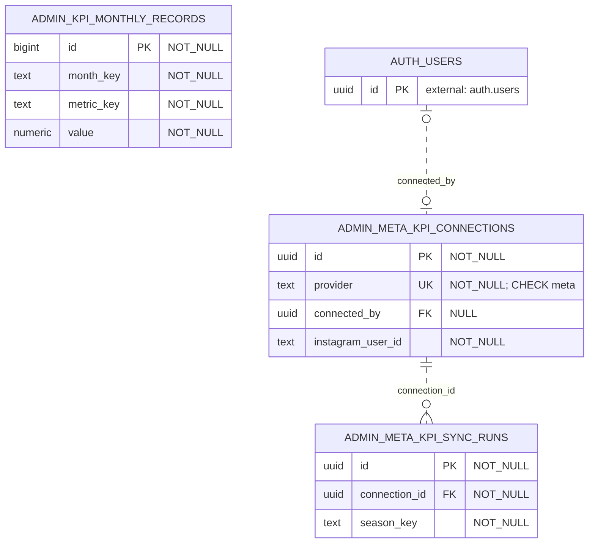

接続表の `connected_by` 自体に UNIQUE はないが、`provider` が `NOT NULL`、`CHECK (provider = 'meta')`、UNIQUE を同時に満たすため、旧 SQL 定義では接続表全体が最大 1 行になる。この制約により、利用者から接続への子件数も 0..1 としている。`season_key` はシーズン表への FK ではなく、Instagram/Facebook/広告アカウントの ID も外部サービス識別子の text である。

### 6.2 `public.variant_backorder_summary` ビュー

[ビューの定義](../../../supabase/migrations/20260919065518_add_variant_backorder_summary.sql#L5)は `public.order_items` の `fulfillment_type = 'backorder'` かつ `variant_id IS NOT NULL` の行を `variant_id` で集計し、`variant_id` と `sum(quantity)::integer AS backorder_quantity` を返す。`security_invoker = true` の通常ビューであり、独立したテーブル、PK、FK は持たない。現行 [商品バリアント API](../../../src/app/api/admin/items/[id]/variants/route.ts#L82) が参照する。

## 7. 関連ドキュメント

- [システム構成](../architecture/system-overview.md)
- [API](../api/api-spec.md)
- [注文・決済の状態遷移](../../04_DetailDesign/states/order-payment.md)
