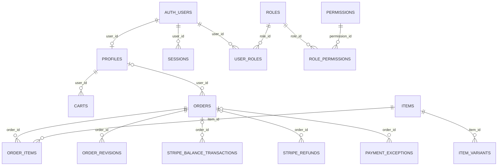

# 主要データの関係（現行実装）

## 概要

購入、認証、決済に関係する主要テーブルだけを示す。全列・全制約の定義ではない。全体の基準スキーマは `supabase/migrations/20260901102912_remote_schema.sql`、その後の変更は `supabase/migrations/` にある。図はリポジトリの SQL を基にしており、本番 DB の現状は未確認である。

`PROFILES` は `auth.users` に、`ORDERS` は任意の `profiles` 利用者に結び付く。ゲスト注文があるため、注文の利用者 FK は nullable である。`ORDER_ITEMS` は注文と商品を結ぶ。商品バリエーションと在庫移動は `20260919065336_add_variant_inventory_tables.sql` と `20260919065355_add_stock_movements.sql` で追加された。

決済は `orders` の Checkout Session ID / PaymentIntent ID と Stripe 側の参照を突き合わせる。`stripe_webhook_events` は受信イベントのキュー、`payment_exceptions` は照合例外の記録であり、どちらも通常の顧客向け注文行とは別である。例外表は RLS で直接のクライアントアクセスを拒否する（`20260927100500_payment_exceptions.sql`）。[状態遷移](../../04_DetailDesign/states/order-payment.md)を参照。

この図に含めない会計、KPI、コンテンツ、問い合わせ、法定保存などの表も基準スキーマに存在する。`migrations/` は旧来の SQL 群で、GitHub Actions が対象とする `supabase/migrations/` と区別する。
