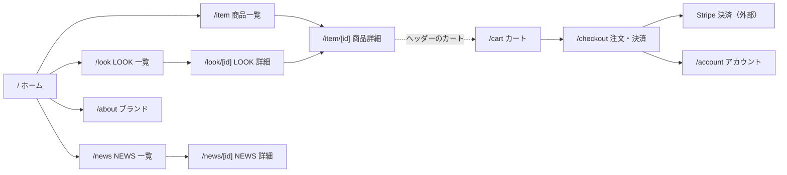
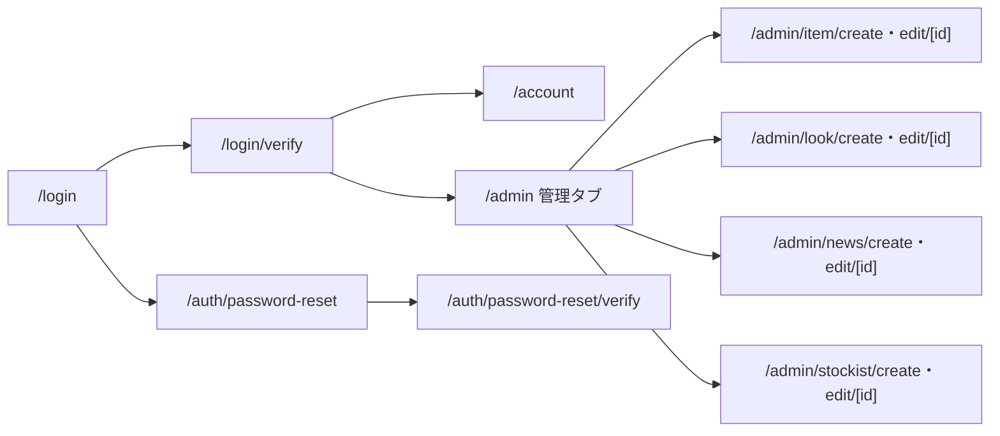

# 画面遷移図

> 状態: 実装で確認できる主要導線 | 確認日: 2026-10-01 | 対象: 公開サイト、購入、認証、管理入口

## 概要

主要な画面間の導線を示す。矢印はページリンクや画面内操作から確認できる遷移であり、すべての分岐や権限判定を表すものではない。商品・LOOK・NEWS の絞り込みは同じ一覧ルートのクエリ更新である。

## 公開サイトと購入

`/item`、`/look`、`/news` はヘッダーから直接開ける。ヘッダーには `/stockist`、`/contact`、`/search`、`/wishlist`、`/cart` への入口もある。`/cart` の注文概要から `/checkout` へ進む。外部決済後の注文状態は独立した「完了ページ」の有無ではなく、[注文・決済の状態設計](../../04_DetailDesign/states/order-payment.md)で扱う。

## 認証と管理

追加認証後の行き先は固定ではなく、`src/app/login/verify/VerifyOtpClient.tsx` の `resolvePostLoginPath()` と権限による。`/admin` 内の KPI・ACCOUNTING・ORDER などはタブ切替であり、上図では個別ページとして描いていない。認証の処理順序は[認証シーケンス](../../04_DetailDesign/sequence/auth-login-mfa.md)を参照する。

## 根拠と範囲

| 導線 | 主な根拠 |
| --- | --- |
| グローバルナビ | `src/components/Header.tsx` |
| 商品・LOOK・NEWS 一覧から詳細 | `src/features/items/components/PublicItemGrid.tsx`、`src/features/look/components/PublicLookGrid.tsx`、`src/features/news/components/PublicNewsGrid.tsx` |
| カートから決済 | `src/app/cart/_components/OrderSummary.tsx` |
| 認証後の遷移 | `src/app/login/page.tsx`、`src/app/login/verify/VerifyOtpClient.tsx` |
| 管理下位ページ | `src/app/admin/page.tsx`、`src/components/AdminSideNav.tsx` |

## 未確認事項

購入完了時の表示、外部決済の戻り方、権限ごとの全分岐は画面実測していない。図はソースから確認した主要導線に限定する。
