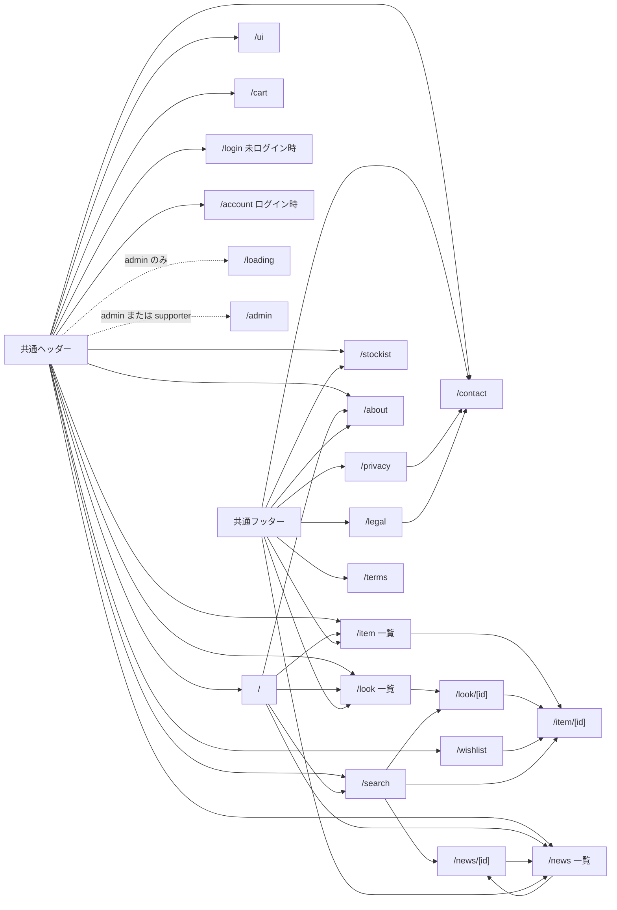
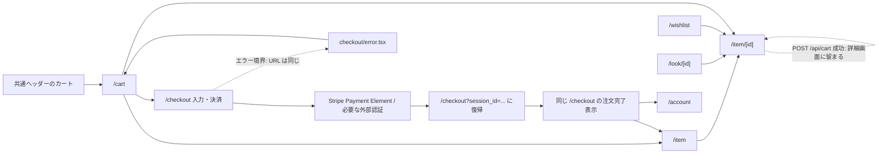
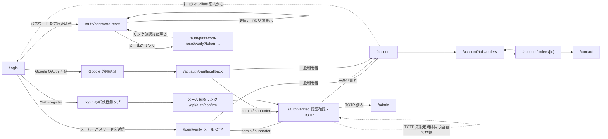
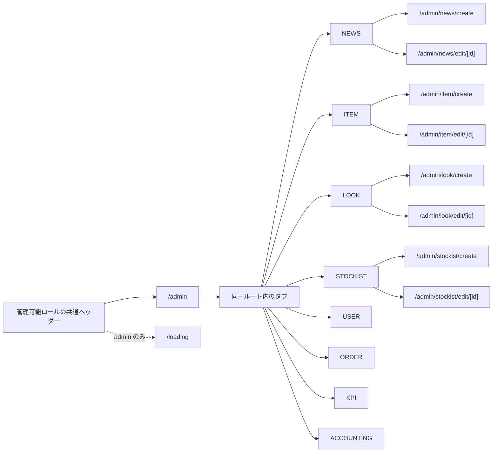

# 画面遷移図

> 状態: 現行コードで追跡した主要な画面遷移 | 確認日: 2026-10-03 | 対象: 顧客向け、認証、購入、管理

## 概要

共通ナビゲーションと利用者の主要な目的ごとに、実装で確認できる画面遷移を示す。矢印は画面リンク、自動遷移、または画面内操作後の結果を表し、外部 API の処理自体は画面として数えない。

## 共通ナビゲーションとコンテンツ閲覧

ニュース、商品、LOOK の絞り込みは `category` / `season` クエリを更新して同じ一覧画面に留まる。検索キーワードや結果種別も `/search` 内の表示状態である。お問い合わせの送信完了は `/contact` 内に表示する。前後の記事・LOOK の移動も同じ詳細ルート種別の間で行う。

## 商品選択から注文

商品詳細でのカート追加は `/api/cart` への送信で、成功後も `/item/[id]` に留まる。利用者は共通ヘッダーから `/cart` を開き、注文概要から `/checkout` に進む。Stripe の戻り先は `/checkout?session_id=...` で、決済照合後の完了表示も `/checkout` に含まれる。`checkout/error.tsx` は別ルートではなく、同じ URL に対する Next.js のエラー境界である。

## ログイン、新規登録、アカウント

`/login/verify` はメール OTP 用で、ログイン検証セッションが無ければ `/login` に戻る。特権ロールは `/auth/verified` で TOTP を登録または確認し、認証済みなら `/admin` へ進む。一般利用者の Google OAuth は API callback から `/account` へ、admin/supporter は `/auth/verified` へ戻る。各タブや成功・失敗表示の多くは同じ画面ルートの状態である。

`/auth/callback` という画面ルートも実装されているが、通常の Google OAuth フローは API callback を直接利用する。現行ソースでこの画面を標準導線として指定する呼び出し元は確認できていないため、上図の通常経路には含めていない。

## 管理

`/admin` のタブ切替は同じ画面内で行う。現行の表示タブは admin が8種類、supporter が `ORDER` のみである。`CONTACT` はタブ型に定義されているが `/admin` の表示配列には渡されない。新規作成・編集は NEWS、ITEM、LOOK、STOCKIST のタブから個別ルートへ進む。

`/admin/create-user` は画面ルートとフォームがあるものの、現行ソースから `/admin` を含む画面内リンクを確認できなかった。図では実装された導線として扱わない。`/admin` の画面表示、個別操作 API の認証・権限確認は別々に確認する。

## 根拠と図の範囲

| 導線 | 実装根拠 |
| --- | --- |
| 共通ヘッダー・フッター | [Header](../../../src/components/Header.tsx)、[Footer](../../../src/components/Footer.tsx) |
| 一覧から詳細・関連商品 | [公開商品一覧](../../../src/features/items/components/PublicItemGrid.tsx)、[公開LOOK一覧](../../../src/features/look/components/PublicLookGrid.tsx)、[公開NEWS一覧](../../../src/features/news/components/PublicNewsGrid.tsx) |
| カート・決済 | [商品詳細](../../../src/app/item/%5Bid%5D/ItemDetailClient.tsx)、[注文概要](../../../src/app/cart/_components/OrderSummary.tsx)、[チェックアウト](../../../src/app/checkout/page.tsx) |
| 認証 | [LoginContext](../../../src/contexts/LoginContext.tsx)、[OTP確認](../../../src/app/login/verify/VerifyOtpClient.tsx)、[OAuth callback API](../../../src/app/api/auth/oauth/callback/route.ts)、[認証確認画面](../../../src/app/auth/verified/page.tsx) |
| 管理 | [管理ページ](../../../src/app/admin/page.tsx)、[AdminTabs](../../../src/components/AdminTabs.tsx)、[AdminSideNav](../../../src/components/AdminSideNav.tsx) |

実際に読み込まれるページの確認、全エラー分岐、外部 OAuth/Stripe のサービス側画面、各ロール・機能フラグの組合せはこの静的な導線図の範囲外である。境界は画面一覧の[ルート一覧](screen-list.md)と、認証の[シーケンス図](../../04_DetailDesign/sequence/auth-login-mfa.md)、購入の[注文・決済状態図](../../04_DetailDesign/states/order-payment.md)を参照する。