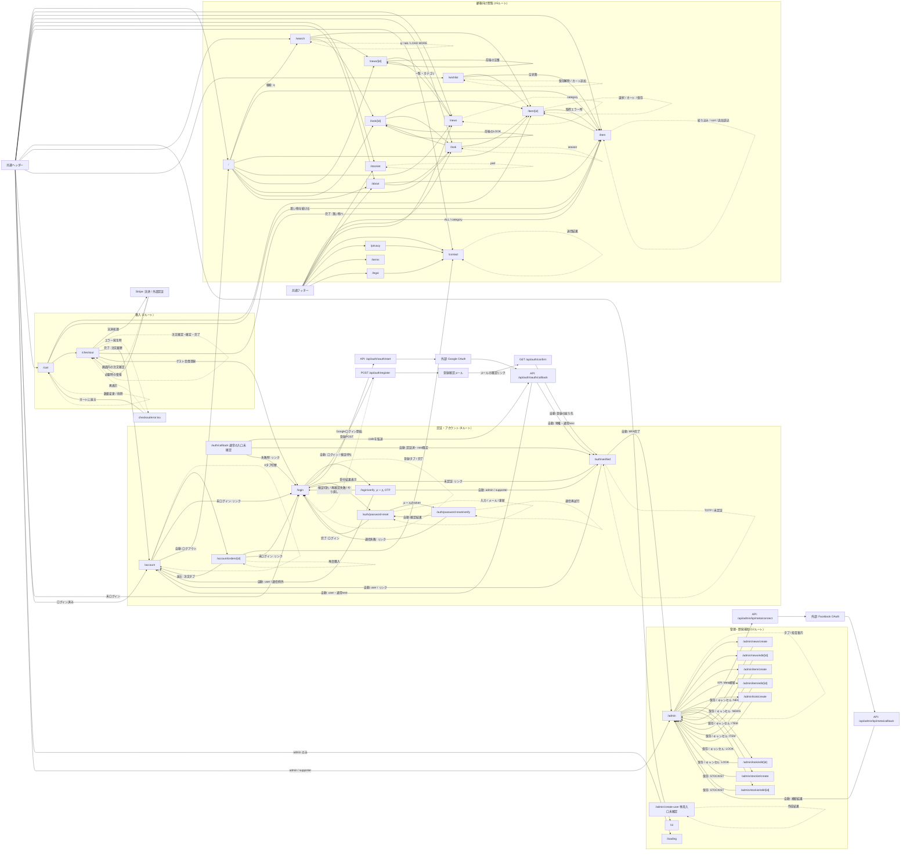

# 画面遷移図

> 状態: 全画面ルートと現行ソースの導線をレビュー | 確認日: 2026-10-03 | 対象: 37画面ルート

## 概要

[画面一覧](screen-list.md)の37ルートについて、ページと描画コンポーネントのリンク、自動遷移、認証・外部決済からの戻りを1つの図で示す。タブ、絞り込み、フォームの結果は同じルート内の状態として扱う。API、メール、外部サービス、エラー境界は画面ルート数に含めない。

## 図の読み方

- ラベルのない実線は画面リンク。ラベル付き実線はリンクの条件、自動遷移、または API・外部サービスを経由する処理を示す。
- 点線は同じルート内の状態・クエリ変更。詳細画面の前後移動・関連商品は `[id]` が変わるため実線で示す。
- 共通ヘッダーとフッターは [Providers](../../../src/contexts/Providers.tsx) が全ページに配置する。各画面から共通ナビゲーションへ戻る線を繰り返さず、共通ノードにリンクを集約する。
- ヘッダーの管理リンク表示条件と、遷移先ページ・操作 API の権限確認は別である。[画面一覧の表示条件](screen-list.md#画面表示と操作権限)を参照する。
- 図内の区分は所在を探すための `subgraph` であり、全体で1つの遷移図である。37ルートと条件付き導線を含むため、詳細は拡大表示と下の補足表で確認する。

## 全画面遷移図

## クエリ・条件付き導線の補足

| 導線 | 現行実装での扱い |
| --- | --- |
| 共通ナビゲーション | モバイルドロワーは NEWS・ITEM の `category`、LOOK の `season` を指定して一覧へ進む。フッターの商品カテゴリリンクも `/item?category=...`。ホームの取扱店セクションには `/stockist` への専用リンクはなく、共通ヘッダー・フッターから開く |
| 一覧・検索 | 商品の絞り込み、並び順、取扱店の `pref`、検索の `q`・`tab` は [画面一覧のクエリ表](screen-list.md#同じルート内の状態とクエリ)にまとめる。ホームから詳細へ進むカード・検索プレビューも図に含める |
| 登録メール確認 | 登録UIは `redirect_to=/auth/verified` を指定する。確認 API 自体の既定は `/account`。確認失敗でも指定先に戻り、その先で未認証案内になる場合がある |
| ログインOTP確認 | 成功後に `/api/auth/me` で認証・ロールを再確認する。一般利用者は `/account`、admin/supporterは `/auth/verified`。再確認が未認証なら `/login`、再確認の通信例外ならロールを問わず `/account`。OTP自体の検証エラーは確認画面に留まる |
| Google OAuth | 通常の `next=/auth/verified` の場合、一般利用者だけ `/account` へ戻す。別の戻り先が指定された場合は API の検証済み指定先を使う。API が JSON エラーを返す分岐をログイン画面への自動遷移として描かない |
| `/auth/callback` | src 内の通常の入口参照は未確認。ページ自体には `code` ありの API 転送、認証済みの `next` への遷移、失敗時のログインリンクがある。図の認証済み出口は `next` 既定値を示す |
| パスワード再設定 | 現行メールは直接 `/auth/password-reset/verify?token=...` を指定する。確認画面が `POST /api/auth/password-reset/link` を呼び、成功・期限切れ・token不在に応じて再設定画面へ戻る。別入口の同APIのGETも確認画面へ中継する |
| 決済 | Payment Element は `/checkout` に埋め込む。外部認証が不要なら同画面で注文確認へ進み、注文確定後に完了表示する。外部認証からの復帰は `?session_id=...` を照合して完了表示し、クエリを除去する。空カートでは同画面に案内を表示する |
| 購入完了・注文詳細 | 完了表示の注文履歴リンクは `/account`。注文詳細の戻るリンクは `/account?tab=orders`。ゲスト登録カードは `/login?tab=register&email=...` でメール初期値を渡す。再度購入はカート追加後も注文詳細に留まる |
| 注文商品の予約注文分岐 | [OrderItemRow](../../../src/features/account/components/OrderItemRow.tsx)には `itemId` があり `stockStatus=sold_out` の場合に `/contact?subject=予約注文：{商品名}` へ進む分岐がある。現行の注文詳細APIは `stockStatus` を返さないため、注文詳細での通常導線としては確認できない。contactはこのクエリから件名を初期入力しない |
| 管理タブ・フォーム | admin は8タブ、supporter は ORDER のみ。`/admin?tab=...` は初期タブを指定するが、サイドナビ操作は表示状態だけを変更する。ITEM・LOOK・NEWS は保存成功・キャンセルで戻り、STOCKIST は保存成功時に戻る |
| `/admin/create-user` | 専用の入口リンクは未確認。作成成功後も同画面に留まる。共通ナビゲーションは利用できる |
| Meta接続 | KPIの接続操作から外部OAuthへ進む。callbackは既定のAPIパスを環境設定で変更できる。通常の戻り先は `/admin?meta=connected` または `?meta=error&meta_reason=...` で、`tab` は付与しない |

## その他の外部リンク

認証・決済・Metaの戻りを伴う経路は上図に示した。次のリンクは別タブや端末機能を開くため、遷移先を表で示す。

| 起点 | 遷移先・条件 | 根拠 |
| --- | --- | --- |
| ヘッダーのドロワー・フッター | 設定されたSNS URLを別タブで開く。表示名からURLを推測せず `VISIBLE_SOCIAL_LINKS` の実値を使う | [Header](../../../src/components/Header.tsx)、[Footer](../../../src/components/Footer.tsx)、[social.ts](../../../src/lib/social.ts) |
| ホーム・取扱店の店舗カード | 住所から Google Maps 検索を別タブで開く。電話番号が表示されるカードは `tel:` リンク | [PublicStockistGrid](../../../src/features/stockist/components/PublicStockistGrid.tsx) |
| 注文詳細 | 配送業者と追跡番号がある場合に、配送業者の追跡URLを別タブで開く | [注文詳細](../../../src/app/account/orders/%5Bid%5D/page.tsx)、[shipping-carriers.ts](../../../src/lib/orders/shipping-carriers.ts) |
| 管理のACCOUNTING・固定資産詳細 | 添付証憑がある場合、閲覧APIが返す署名付きStorage URLを別タブで開く。取得失敗は同じ管理画面のメッセージ | [CostProfitSection](../../../src/components/CostProfitSection.tsx)、[証憑閲覧API](../../../src/app/api/admin/kpi/cost-profit/receipt/route.ts) |

## 実装根拠とレビュー範囲

| 対象 | 主な確認元 |
| --- | --- |
| 全37ルート・共通ナビゲーション | `src/app/**/page.tsx`、[Providers](../../../src/contexts/Providers.tsx)、[Header](../../../src/components/Header.tsx)、[Footer](../../../src/components/Footer.tsx) |
| ホーム・一覧・検索 | [ホーム](../../../src/app/page.tsx)、[公開商品一覧](../../../src/features/items/components/PublicItemGrid.tsx)、[公開LOOK一覧](../../../src/features/look/components/PublicLookGrid.tsx)、[公開NEWS一覧](../../../src/features/news/components/PublicNewsGrid.tsx)、[ホーム検索](../../../src/features/search/components/SearchHomePreview.tsx)、[検索画面](../../../src/features/search/components/SearchPageClient.tsx) |
| 詳細・保存・取扱店 | [商品詳細](../../../src/app/item/%5Bid%5D/ItemDetailClient.tsx)、[関連商品](../../../src/features/items/components/RelatedItems.tsx)、[LOOK詳細](../../../src/app/look/%5Bid%5D/page.tsx)、[NEWS詳細](../../../src/app/news/%5Bid%5D/page.tsx)、[保存一覧](../../../src/app/wishlist/page.tsx)、[取扱店](../../../src/features/stockist/components/PublicStockistGrid.tsx) |
| 購入 | [カート](../../../src/app/cart/page.tsx)、[注文概要](../../../src/app/cart/_components/OrderSummary.tsx)、[チェックアウト](../../../src/app/checkout/page.tsx)、[ゲスト登録案内](../../../src/features/checkout/components/GuestRegisterPrompt.tsx)、[エラー境界](../../../src/app/checkout/error.tsx) |
| 認証・再設定 | [LoginContext](../../../src/contexts/LoginContext.tsx)、[ログイン](../../../src/app/login/page.tsx)、[OTP確認](../../../src/app/login/verify/VerifyOtpClient.tsx)、[callback画面](../../../src/app/auth/callback/page.tsx)、[OAuth callback API](../../../src/app/api/auth/oauth/callback/route.ts)、[認証確認](../../../src/app/auth/verified/page.tsx)、[登録メール確認API](../../../src/app/api/auth/confirm/route.ts)、[再設定メールAPI](../../../src/app/api/auth/password-reset/request/route.ts)、[再設定リンク確認](../../../src/app/auth/password-reset/verify/VerifyClient.tsx) |
| アカウント | [アカウント](../../../src/app/account/page.tsx)、[注文詳細](../../../src/app/account/orders/%5Bid%5D/page.tsx)、[再度購入](../../../src/features/account/hooks/useReorder.ts) |
| 管理・開発補助 | [管理ページ](../../../src/app/admin/page.tsx)、[ITEMフォーム](../../../src/app/admin/item/ItemForm.tsx)、[LOOKフォーム](../../../src/app/admin/look/LookForm.tsx)、[NEWSフォーム](../../../src/app/admin/news/NewsForm.tsx)、[STOCKISTフォーム](../../../src/app/admin/stockist/StockistForm.tsx)、[ユーザー作成](../../../src/app/admin/create-user/page.tsx)、[UI](../../../src/app/ui/page.tsx)、[LOADING](../../../src/app/loading/page.tsx) |
| Meta | [接続UI](../../../src/components/MetaKpiConnection.tsx)、[接続API](../../../src/app/api/admin/kpi/meta/connect/route.ts)、[callback API](../../../src/app/api/admin/kpi/meta/callback/route.ts) |

今回のレビューはルート定義、描画されるコンポーネントの導線、関連APIの戻り先をソースで確認したもの。37ルートは図・画面一覧に各1件ずつ対応する。実環境の公開範囲、リンク先に実データが存在すること、全画面の実行時表示や外部サービス側の画面は実行検証していない。認証処理の詳細は[シーケンス図](../../04_DetailDesign/sequence/auth-login-mfa.md)、購入の状態は[注文・決済状態図](../../04_DetailDesign/states/order-payment.md)を参照する。
