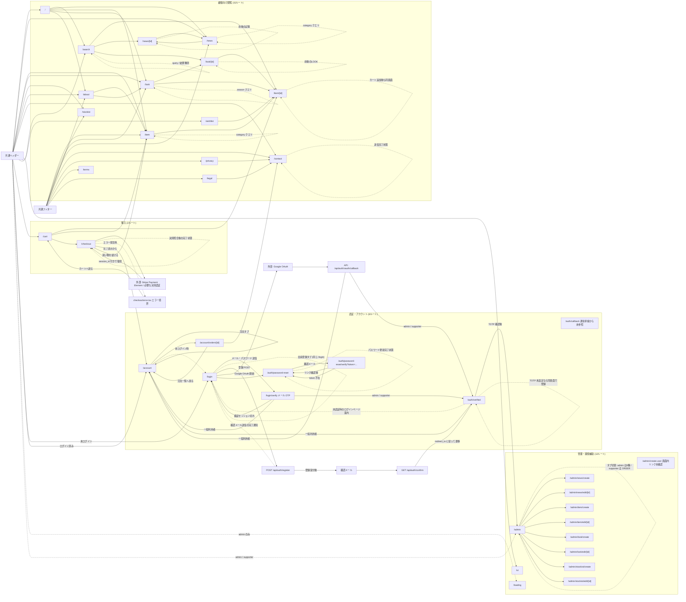

# 画面遷移図

> 状態: 現行コードで追跡した主要な画面遷移 | 確認日: 2026-10-03 | 対象: 顧客向け、認証、購入、管理

## 概要

共通ナビゲーションと利用者の主要な目的ごとに、実装で確認できる画面遷移を示す。矢印は画面リンク、自動遷移、または画面内操作後の結果を表し、外部 API の処理自体は画面として数えない。

## 全画面遷移図

実線は別ルートへの画面遷移、または API・外部サービスを経由する処理とその戻りを示す。点線は同一ルート内の状態変化、条件付き遷移、画面からの案内を示す。図は1つに統合し、内部の `subgraph` は37画面の所在を探しやすくするための区分である。外部サービスと API は画面ルートではないが、画面に戻る経路を示すために含めた。

商品詳細でのカート追加、お問い合わせ送信、パスワード更新、タブ切替、絞り込みは同じ画面に留まる。`/auth/callback` と `/admin/create-user` はルート実装があるが、通常フローからの呼び出し元・画面内リンクを確認できていないため、図の中で未接続として示した。管理タブの個別ルートへの移動、認証後のロール別遷移、決済後の同一 `/checkout` への復帰は、独立した図に分けずこの図にまとめている。
## 根拠と図の範囲

| 導線 | 実装根拠 |
| --- | --- |
| 共通ヘッダー・フッター | [Header](../../../src/components/Header.tsx)、[Footer](../../../src/components/Footer.tsx) |
| 一覧から詳細・関連商品 | [公開商品一覧](../../../src/features/items/components/PublicItemGrid.tsx)、[公開LOOK一覧](../../../src/features/look/components/PublicLookGrid.tsx)、[公開NEWS一覧](../../../src/features/news/components/PublicNewsGrid.tsx) |
| カート・決済 | [商品詳細](../../../src/app/item/%5Bid%5D/ItemDetailClient.tsx)、[注文概要](../../../src/app/cart/_components/OrderSummary.tsx)、[チェックアウト](../../../src/app/checkout/page.tsx) |
| 認証 | [LoginContext](../../../src/contexts/LoginContext.tsx)、[OTP確認](../../../src/app/login/verify/VerifyOtpClient.tsx)、[OAuth callback API](../../../src/app/api/auth/oauth/callback/route.ts)、[認証確認画面](../../../src/app/auth/verified/page.tsx) |
| 管理 | [管理ページ](../../../src/app/admin/page.tsx)、[AdminTabs](../../../src/components/AdminTabs.tsx)、[AdminSideNav](../../../src/components/AdminSideNav.tsx) |

実際に読み込まれるページの確認、全エラー分岐、外部 OAuth/Stripe のサービス側画面、各ロール・機能フラグの組合せはこの静的な導線図の範囲外である。境界は画面一覧の[ルート一覧](screen-list.md)と、認証の[シーケンス図](../../04_DetailDesign/sequence/auth-login-mfa.md)、購入の[注文・決済状態図](../../04_DetailDesign/states/order-payment.md)を参照する。
