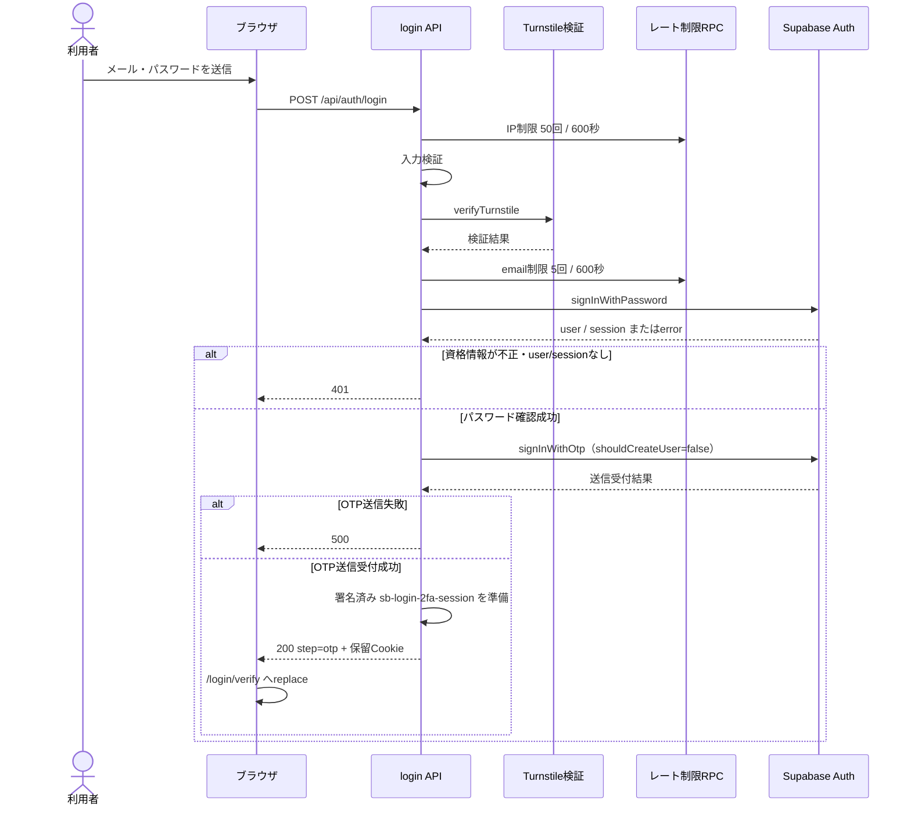
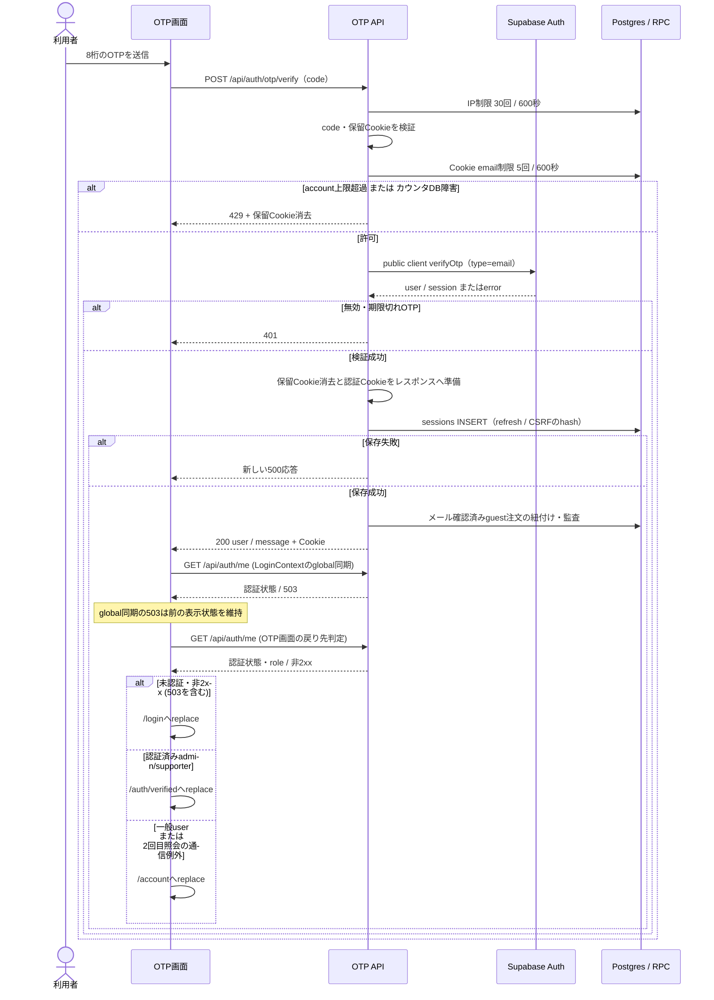
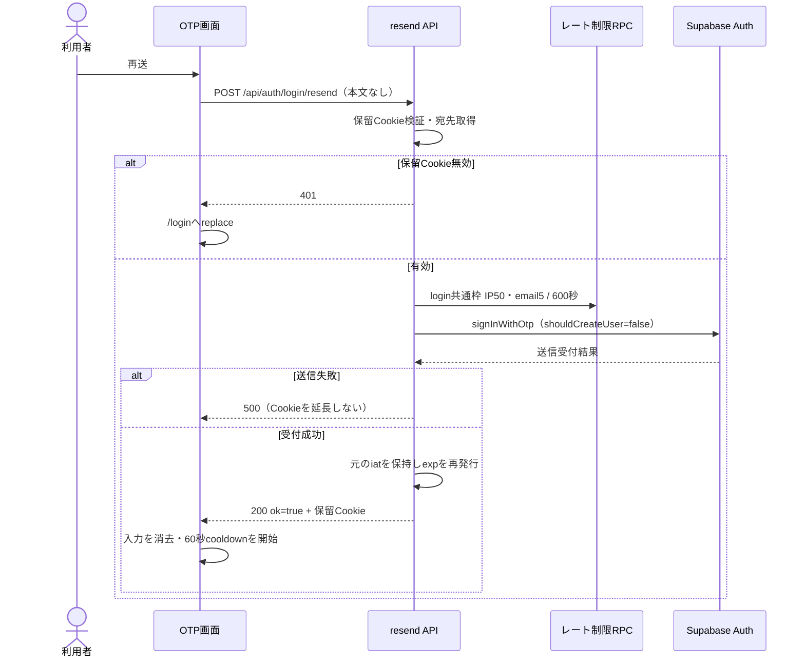
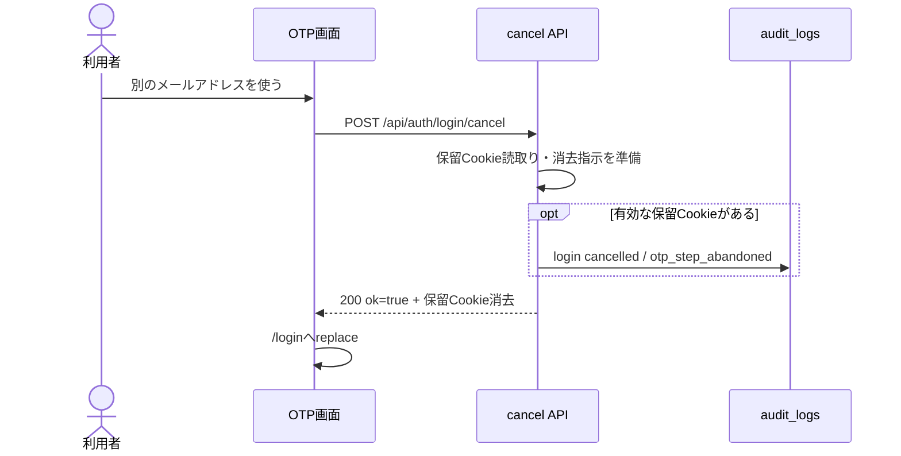
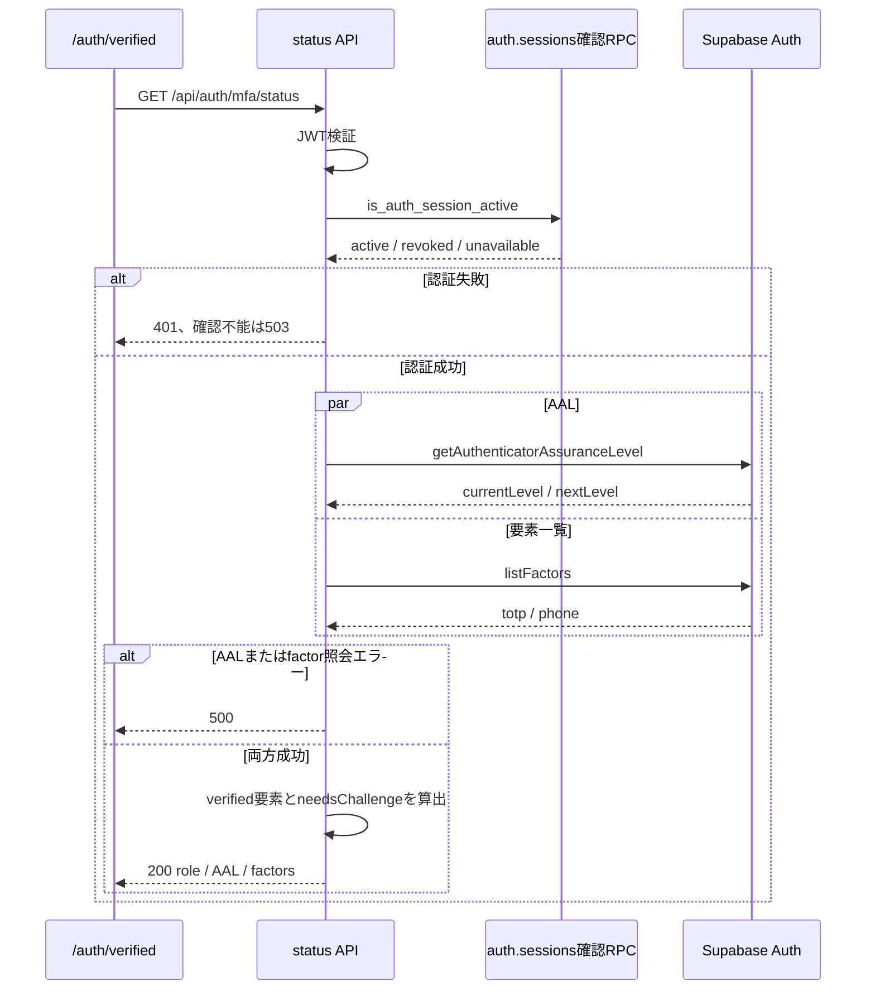
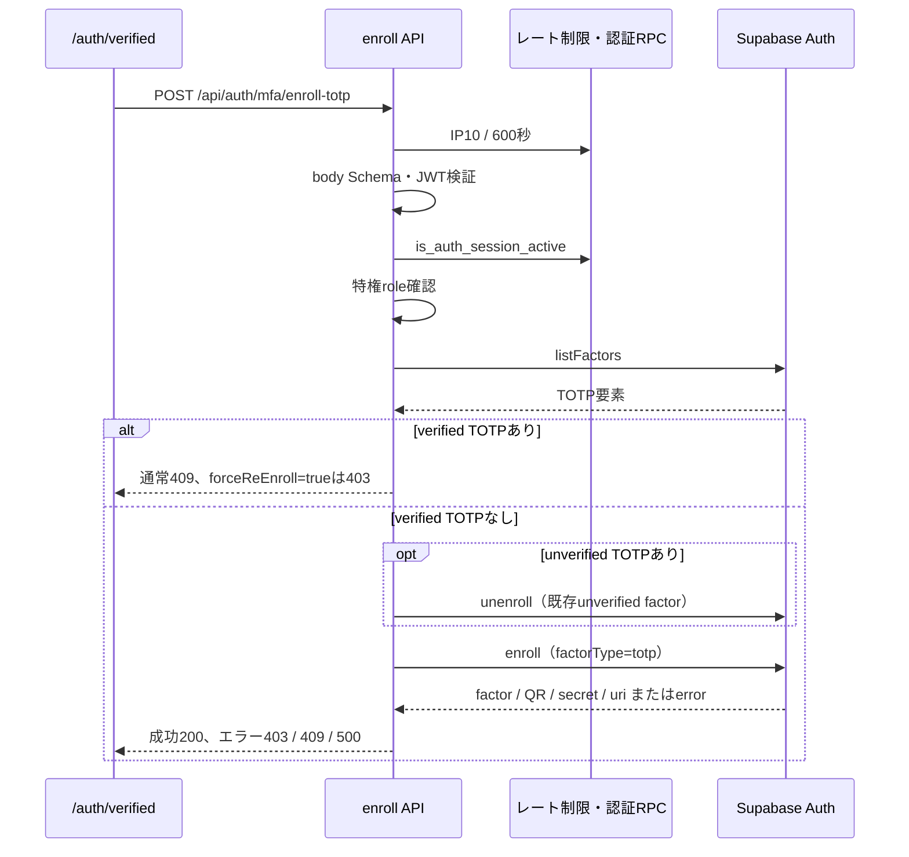
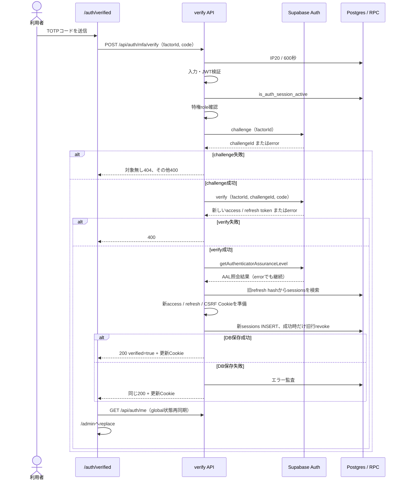

# ログイン・追加認証シーケンス

> 状態: 現行ソース照合済み | 確認日: 2026-10-04 | 対象: パスワード、メールOTP、特権TOTP

## 概要

メールログインはパスワード確認後にメールOTPを送り、OTP検証後に認証Cookieとセッション記録を作る。管理者・サポーターのTOTPは、その認証済みセッションをAAL2へ昇格する別の操作である。開始契機ごとに7つの図へ分ける。図IDと分割の基準は[記載方針](README.md)を参照する。

## 範囲と根拠

対応する既存資料は[LOGINのページ別要求表](../pages/14_login.md)、[ADMINのページ別設計](../pages/16_admin.md)、[要求定義](../../02_Requirements/requirements.md)。ページ別資料の過去の実装判定は、本書の現行処理の根拠にはしない。

| 対象 | 実コード参照 |
| --- | --- |
| パスワード、OTP検証 | [login API](../../../src/app/api/auth/login/route.ts) L9–88、[OTP API](../../../src/app/api/auth/otp/verify/route.ts) L9–133 |
| 再送、取消、保留Cookie | [resend API](../../../src/app/api/auth/login/resend/route.ts)、[cancel API](../../../src/app/api/auth/login/cancel/route.ts)、[保留Cookieサービス](../../../src/features/auth/services/login-2fa-session.ts) |
| TOTP | [status API](../../../src/app/api/auth/mfa/status/route.ts)、[enroll API](../../../src/app/api/auth/mfa/enroll-totp/route.ts)、[verify API](../../../src/app/api/auth/mfa/verify/route.ts) |
| セッション、認証ガード | [初回保存](../../../src/features/auth/services/register.ts)、[更新保存](../../../src/features/auth/services/session.ts)、[認証検証](../../../src/lib/auth/authenticate.ts)、[Cookie属性](../../../src/lib/cookie.ts) |
| 呼び出し元 | [LoginContext](../../../src/contexts/LoginContext.tsx)、[OTP画面](../../../src/app/login/verify/VerifyOtpClient.tsx)、[TOTP画面](../../../src/app/auth/verified/page.tsx) |

状態変更APIは[proxy](../../../src/proxy.ts)のOrigin／Referer検査を先に通る。不正なOriginは403。[rate limiter](../../../src/features/auth/middleware/rateLimit.ts)は上限超過を429、カウンタDB障害を503とし、いずれもRetry-Afterを返す。OTPのaccount枠はhelperの503も429へ変換する例外があり、SQ-AUTH-LOGIN-OTPに記す。詳細なAPI認可は[セッション・API認可](auth-session.md)を参照する。

## SQ-AUTH-LOGIN-PASSWORD: パスワード確認とOTP送信

開始契機はログインフォームの送信。事前条件はメール・パスワードと、設定時のTurnstile token。終了結果はOTP待ちCookieを持つ状態、またはエラー応答である。

この段階で独自のaccess／refresh Cookieとlocal `sessions`行は作らない。入力不正は400、Turnstile失敗は403。保留CookieはuserId・email・iat・expをHMAC SHA256で署名し、Max-Ageは300秒。検証ではexpと「発行から1800秒を超えたか」を確認する。メール到達はAPIの送信受付成功とは別で、今回確認していない。

## SQ-AUTH-LOGIN-OTP: メールOTPの検証

開始契機はOTP入力フォームの送信。事前条件は有効な保留Cookieとcode。APIは本文のemailを使わず、Cookieの宛先を使う。終了結果は200の認証完了、または検証・保存エラーである。

IP枠のカウンタDB障害はhelperの503をそのまま返す。account枠はhelperが返す429/503のどちらも新しい429へ変換し、Retry-Afterを引き継いで保留Cookieを消去する。helper呼出し自体の例外は各try/catchでログを残し、その枠の拒否応答を返さず後続へ進む。

OTP成功後のme照会は2回ある。LoginContextのglobal同期は503で前の表示を維持し、通信例外なら未認証表示にする。その後のOTP画面の戻り先判定は非2xx/未認証で/login、認証済み特権roleで/auth/verified、それ以外と通信例外で/accountとなる。

保留Cookie不在・改竄・期限切れは401。code Schemaはtrim後8文字で、UIは数字8桁を入力させる。保存に失敗すると、準備済みCookie付き200レスポンスを返さず、新しい500レスポンスを返す。ゲスト注文紐付けは失敗しても認証を止めない。[初回保存](../../../src/features/auth/services/register.ts)の順序は`session_id`→access→refresh→CSRFのCookie準備→hash計算→DB INSERTである。

## SQ-AUTH-LOGIN-RESEND: OTP再送

開始契機は再送ボタン。事前条件は有効な保留Cookie。終了結果は送信受付200と保留Cookie更新、またはエラーである。

再送もloginと同じカウンタ枠を消費する。UIは429でRetry-Afterに合わせ待機、503で一時障害表示、その他で送信失敗表示となる。UIの60秒待機はAPIの5回／600秒制限とは別である。

## SQ-AUTH-LOGIN-CANCEL: OTP待ちの取消

開始契機は「別のメールアドレス」の操作。事前条件は不要で、保留Cookie不在でも200を返す。終了結果はCookie消去指示とログイン画面への移動である。

API固有のレート制限はない。UIはfetchの通信例外を吸収して`/login`へ移動するため、通信失敗時のサーバーCookie消去までは保証されない。[loginページ](../../../src/app/login/page.tsx)は有効保留Cookieがあれば再び`/login/verify`へ送る。

## SQ-AUTH-MFA-STATUS: 追加認証状態の取得

開始契機は`/auth/verified`からの状態照会。事前条件は認証CookieまたはBearer。終了結果はverified factorsとAALの200、または認証・照会エラーである。

`needsChallenge`は特権role、verified factorあり、nextLevel=aal2、currentLevel≠aal2のすべてを満たす場合。照会失敗は500。statusは一般userも照会でき、enroll／verifyのroleガードとは異なる。

## SQ-AUTH-MFA-ENROLL: TOTPの登録

開始契機はTOTPセットアップ。UIは未登録時に自動で一度開始する。事前条件は認証済みadmin／supporter。終了結果はfactorId・QR・secret・uriの200、または登録エラーである。

実際の順序はIP制限→client生成→body Schema→認証→role→listFactors。bodyは`forceReEnroll`を受理する。Schema不正400、認証失敗401／生存確認不能503、一般user403、一覧失敗500、enrollのinsufficient_aalは403、name conflictは409。unenrollの戻り値は検査せずenrollへ進む。外側例外は500。

## SQ-AUTH-MFA-VERIFY: TOTP検証とAAL2昇格

開始契機はTOTPコード送信。事前条件は認証済みadmin／supporter、UUID factorId、数字6〜8桁code。終了結果は検証成功200と更新Cookie、またはエラーである。

実際の前段順序はIP制限→入力→client→認証→role。入力不正400、認証失敗401／生存確認不能503、一般user403。challengeの対象無しは404、その他challenge失敗は400、verify失敗は400。AAL照会失敗はログを残して継続する。DB保存失敗でもSupabaseが発行した新tokenを配る。保存処理のCookie準備自体に例外が起きた場合は、同じ200でも準備済みCookieの範囲が異なる。管理APIの利用には別途DB ACLとJWT aal2が必要である。外側例外は500。

## 関連テスト

今回、以下のテストは未実行。リンクは既存の検証観点を示す。

| 観点 | テスト |
| --- | --- |
| login・OTPと宛先・回数制限 | [login](../../../tests/integration/api/auth/login.test.ts)、[OTP](../../../tests/integration/api/auth/otp-verify.test.ts) |
| 再送・取消・署名期限 | [resend](../../../tests/integration/api/auth/login-resend.test.ts)、[cancel](../../../tests/integration/api/auth/login-cancel.test.ts)、[保留Cookie](../../../tests/unit/services/login-2fa-session.test.ts) |
| MFA後のCookie・DB失敗 | [MFA verify](../../../tests/integration/api/auth/mfa-verify.test.ts) |
| 画面ガード・再送表示 | [OTP専用画面](../../../e2e/FR-LOGIN-027-otp-dedicated-screen.spec.ts)、[OTP保護](../../../e2e/FR-LOGIN-028-otp-verify-hardening.spec.ts)、[再送エラー](../../../e2e/login-otp-resend-errors.spec.ts) |

## 未確認事項

Supabaseの実際のOTP有効期限、メールテンプレートと到達、実TOTPの登録・昇格、migration適用状況は未確認。Cookieの300秒を実環境のOTP設定の確認結果として扱わない。
