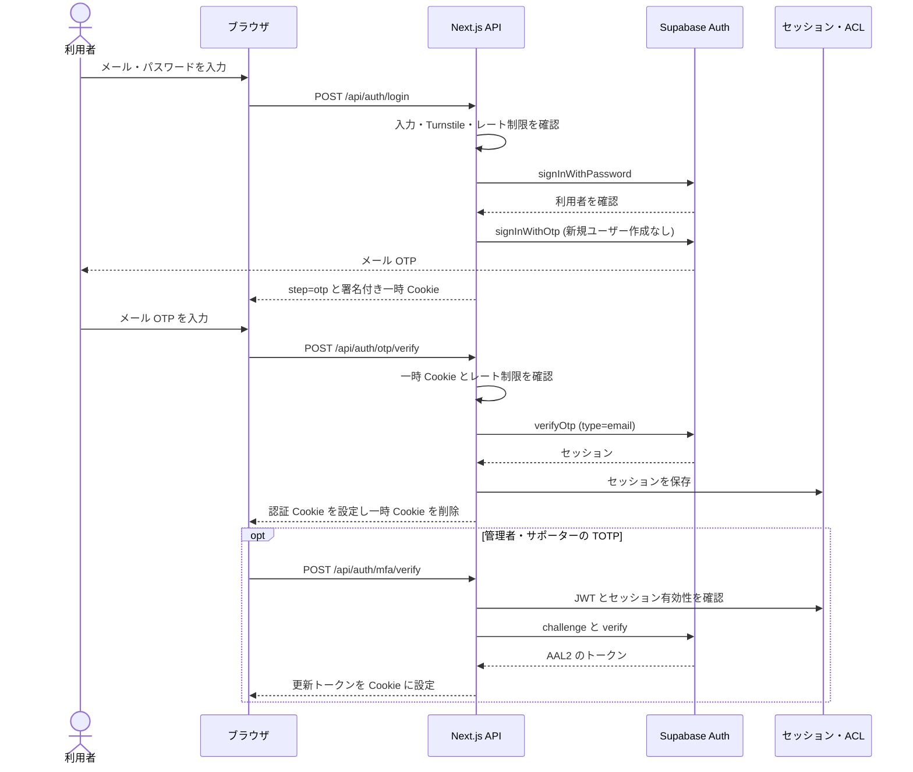

# ログイン・管理者 MFA シーケンス（現行実装）

## 概要

通常ログインはパスワード確認後にメール OTP を確認する二段階である。管理 API が要求する AAL2 は、認証済みセッションで TOTP を検証して得る別段階である。これらを一つの OTP として扱わない。

ログイン API は IP・アカウント別のレート制限と Turnstile を確認する。パスワードが正しくてもメール OTP 送信が失敗すれば正式なログイン完了として扱わない。OTP 検証には、リクエストに指定されたメールではなく、署名付き一時 Cookie のメールを使う。一時 Cookie がない場合と OTP が無効な場合は 401、アカウント制限時は 429 となる。根拠: `src/app/api/auth/login/route.ts`、`src/app/api/auth/otp/verify/route.ts`。

管理権限は TOTP の成功だけでは得られない。管理 API は JWT、Supabase Auth セッションの有効性、DB の ACL 権限、JWT の `aal2` を検査する。確認不能なセッションは 503、権限または AAL2 不足は 403。根拠: `src/lib/auth/authenticate.ts`、`src/lib/auth/admin-rbac.ts`。従来の `sequence/01_auth_seq.md` には現在のメール OTP 前提と異なる説明があるため、現行フローの根拠には使わない。

関連: [API 一覧](../../03_BasicDesign/api/api-spec.md)、[システム構成](../../03_BasicDesign/architecture/system-overview.md)。
