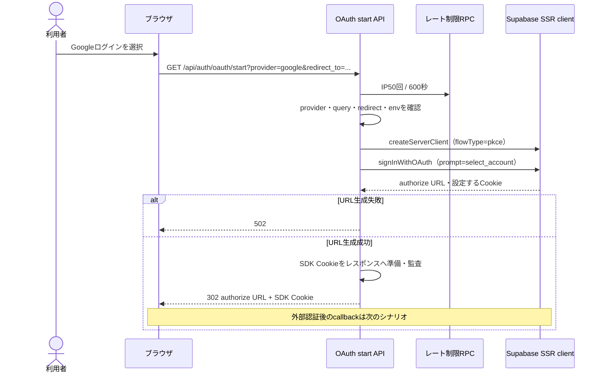
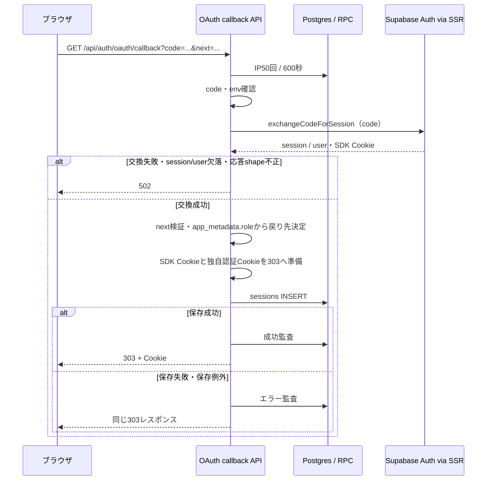

# Google OAuthシーケンス

> 状態: 現行ソース照合済み | 確認日: 2026-10-04 | 対象: Google開始・callback

## 概要

GoogleログインはSupabaseのPKCE対応SSR clientで開始し、callbackでcodeをsessionへ交換する。アプリ独自Cookieとlocal sessions保存は交換後に行う。開始要求とcallbackの到達を2つの図へ分ける。[記載方針](README.md)を参照する。

## 範囲と根拠

対応要件は[LOGINのページ別資料](../pages/14_login.md)と[要求定義](../../02_Requirements/requirements.md)を参照する。

| 対象 | 実コード参照 |
| --- | --- |
| ボタンからの開始 | [LoginContext](../../../src/contexts/LoginContext.tsx) L205–214 |
| OAuth開始 | [start API](../../../src/app/api/auth/oauth/start/route.ts) L43–128 |
| callback・role別redirect | [callback API](../../../src/app/api/auth/oauth/callback/route.ts) L58–176 |
| 共通保存・戻り先検証 | [初回保存](../../../src/features/auth/services/register.ts)、[redirect helper](../../../src/lib/redirect.ts)、[Cookie属性](../../../src/lib/cookie.ts) |
| 特権roleの後続画面 | [verifiedページ](../../../src/app/auth/verified/page.tsx)、[ログイン・TOTP](auth-login-mfa.md) |

## SQ-AUTH-OAUTH-START: Googleログインの開始

開始契機はGoogleボタン。事前条件はSupabase URL・anon keyの設定。終了結果はauthorize URLへの302、またはエラーである。

providerはgoogleのみ。欠落・未対応providerは400、env欠落500、例外500。redirect_toは相対パスを検査し、既定`/auth/verified`をcallbackの`next`へ入れる。SSRのCookie adapterで受けたCookie名・値・optionsをそのままレスポンスへ書く。302にはno-store／no-referrerを付ける。外部ログイン画面の表示・同意・成功は今回実行確認していない。

## SQ-AUTH-OAUTH-CALLBACK: code交換とセッション作成

開始契機はcallbackへのGET。事前条件はcodeとPKCEに必要なSDK Cookie。終了結果は戻り先への303、またはcode交換・入力エラーである。

queryのcode欠落は400、env欠落500、外側例外500。callbackはstateをアプリ独自DBから取得せず、SDKのPKCE交換を呼ぶ。

| 項目 | 現行処理 |
| --- | --- |
| 戻り先 | nextの既定は`/auth/verified`。一般userがこの既定先を要求した場合は`/account`、admin／supporterは指定された検証済みパス |
| 保存順序 | SDK Cookie準備→独自session_id/access/refresh/CSRF Cookie準備→local sessions INSERT |
| 保存失敗 | DB成功を保証せず、準備済み303とCookieを返す。初回保存のどの段階で失敗したかによりCookie準備の範囲が異なる |
| ログイン方式 | メールログインの保留Cookie・OTP APIは通らない。verifiedページに到達した場合のrole／既AAL2／エラー分岐は[追加認証画面の入口と出口](auth-login-mfa.md#追加認証画面の入口と出口)を参照する。特権roleでも指定戻り先が別のパスなら、このcallback自体はverifiedページへ強制しない |
| アプリ独自連携 | このstart/callbackにoauth_requests／oauth_accountsの照会・作成、link-proposal／link-confirmはない。Supabase側のアカウント連携方針は未確認 |
| guest注文 | callbackにはconfirm／OTPと同じguest注文引継ぎ呼出しがない |

## 関連テスト

今回、以下は未実行。

| 観点 | テスト |
| --- | --- |
| account chooser・未対応provider | [OAuth start](../../../tests/integration/api/auth/oauth-start.test.ts) |
| 交換失敗・role別redirect・保存失敗 | [OAuth callback](../../../tests/integration/api/auth/oauth-callback.test.ts) |
| Googleボタンの導線 | [Google E2E](../../../e2e/FR-LOGIN-002-google-oauth.spec.ts) |

## 未確認事項

Google／Supabaseのredirect許可設定、実PKCE交換、SDK Cookieの実名・分割、アカウント自動連携、プロバイダーtokenの保存状況は未確認。アプリで呼んでいない独自stateテーブルのTTLやJWKS検証を現行処理へ追加して記述しない。
