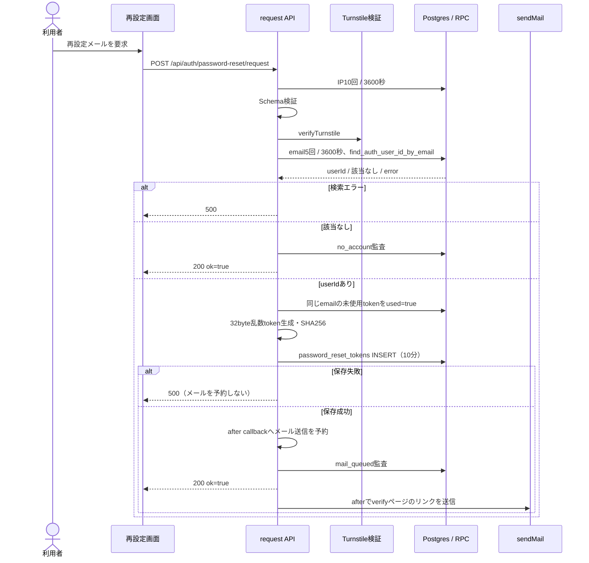
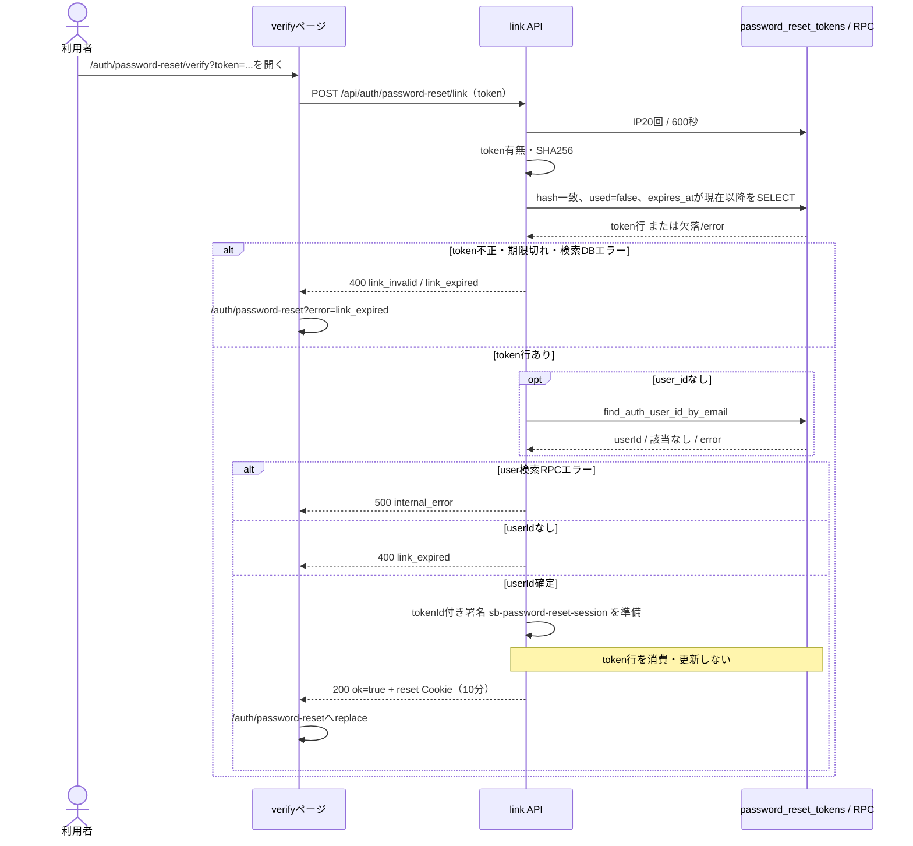
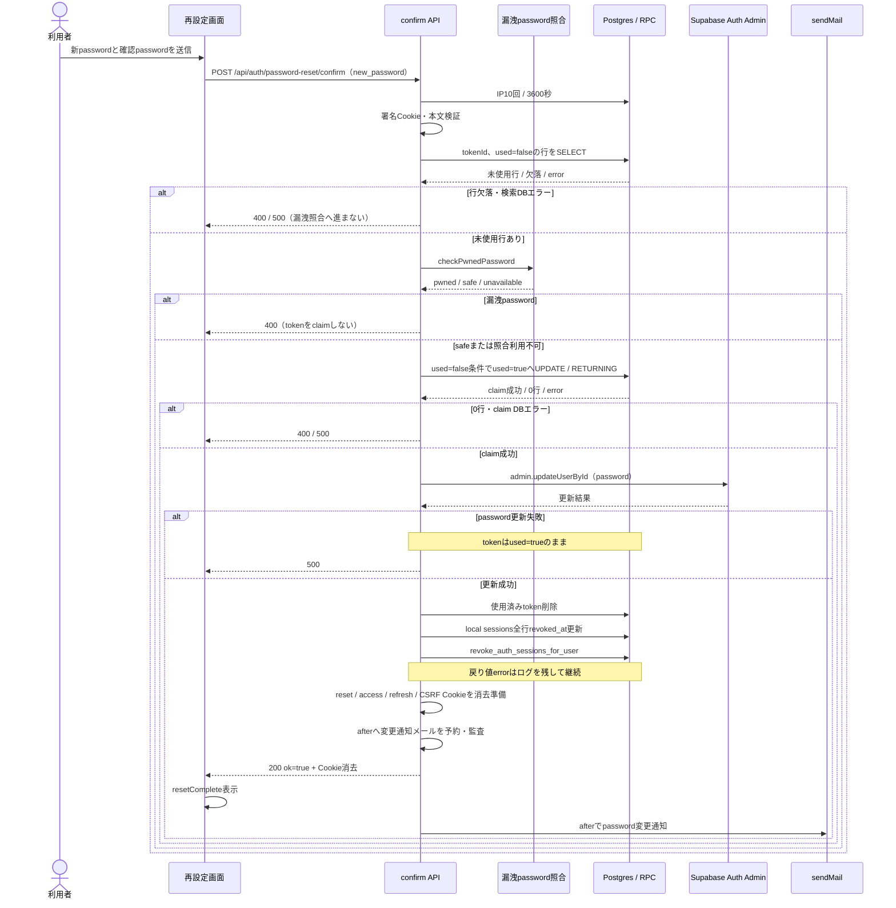
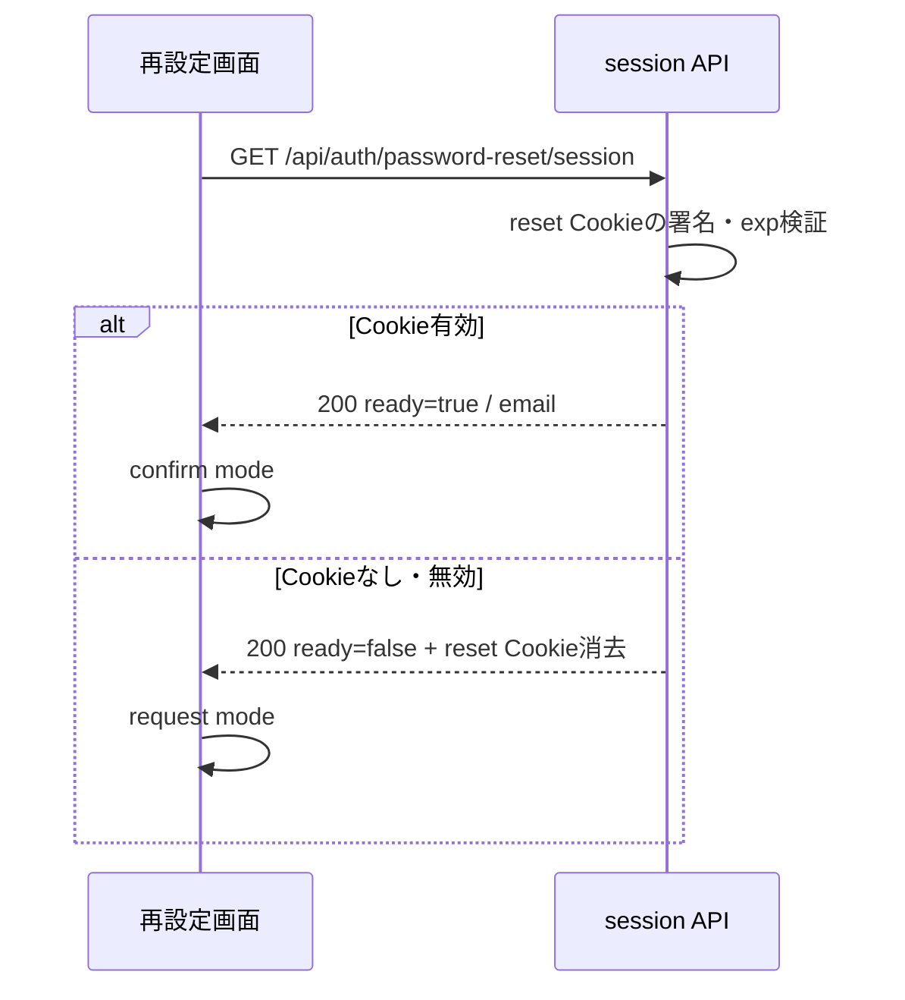

# パスワード再設定シーケンス

> 状態: 現行ソース照合済み | 確認日: 2026-10-04 | 対象: メール要求、リンク確認、再設定、画面再開

## 概要

再設定要求はランダムtokenのhashを10分の期限で保存し、メール送信をafter callbackへ予約する。リンク確認はtokenを消費せず、10分の署名Cookieを作る。confirmは未使用tokenをclaimしてからパスワードを更新する。4つの開始契機を分けて描く。[記載方針](README.md)を参照する。

## 範囲と根拠

既存要件は[LOGINのページ別要求表](../pages/14_login.md)と[要求定義](../../02_Requirements/requirements.md)を参照する。

| 対象 | 実コード参照 |
| --- | --- |
| 再設定メール | [request API](../../../src/app/api/auth/password-reset/request/route.ts) L15–137 |
| リンク・画面再開 | [link API](../../../src/app/api/auth/password-reset/link/route.ts)、[session API](../../../src/app/api/auth/password-reset/session/route.ts) |
| パスワード更新 | [confirm API](../../../src/app/api/auth/password-reset/confirm/route.ts) L30–189 |
| 署名Cookie・Schema | [reset session](../../../src/features/auth/services/password-reset-session.ts)、[Schema](../../../src/features/auth/schemas/password-reset.ts)、[Cookie](../../../src/lib/cookie.ts) |
| UI | [リンク確認](../../../src/app/auth/password-reset/verify/VerifyClient.tsx)、[再設定画面](../../../src/app/auth/password-reset/page.tsx) |
| DB定義・RPC | [migration](../../../supabase/migrations/20260901102912_remote_schema.sql) L759–771、L1705–1721、L2122–2137 |

POSTは[proxy](../../../src/proxy.ts)のOrigin検査が先行する。レート制限は[共通helper](../../../src/features/auth/middleware/rateLimit.ts)の429／503とRetry-Afterを返す。

## SQ-AUTH-RESET-REQUEST: 再設定メールの要求

開始契機はメールアドレスの送信または同じ画面の再送。事前条件はemailと、設定時のTurnstile token。終了結果はアカウント有無を区別しない200、または検証・保存エラーである。

入力Schema不正400、Turnstile失敗403、JSON解析を含む外側例外500。旧tokenの失効更新エラーはログに残して新規発行へ進むため、最新の1本だけが有効という保証はその更新の成功が条件になる。送信先は`/auth/password-reset/verify?token=...`。afterのメール送信失敗は返した200を変えない。UI再送は同じrequest APIを呼び、成功後60秒待機、再送429ではRetry-After（読めなければ3600秒）で待機する。

## SQ-AUTH-RESET-LINK: リンク確認と署名Cookieの発行

開始契機はメール内verifyページを開くこと。事前条件はraw token。終了結果は署名reset Cookieと再設定フォームへの移動、またはリンクエラーである。

legacyの`GET /api/auth/password-reset/link`はtokenを検証せず、tokenありならverifyページへ303、無しなら`/auth/password-reset?error=link_invalid`へ303を返す。GETでもPOSTでもtokenを消費しない。user検索RPC障害は500、user無しは400、外側例外は400。UIはPOSTのHTTPエラーを一律link_expiredへ送るが、通信例外なら画面内の再試行を表示する。

reset Cookieはpurpose・userId・email・tokenId・expをHMAC SHA256で署名し、HttpOnly／SameSite=Strict、10分。POSTのリンク検証はDBのexpires_atを見る。

## SQ-AUTH-RESET-CONFIRM: パスワード更新と全セッション失効

開始契機は新passwordフォームの送信。事前条件は有効なreset Cookieと`new_password`。終了結果は更新200、または検証・claim・更新エラーである。

| 分岐・境界 | 現行処理 |
| --- | --- |
| Cookie・未使用行欠落／本文不正 | 400。token lookupのDBエラーは500 |
| 時間判定 | confirmは署名Cookieのexpだけを見る。token行のexpires_atは再検査しない |
| 漏洩password | 400、tokenをclaimしない。照合サービス利用不可は監査して続行 |
| 同時confirm | used=false条件のUPDATEでclaimできた要求だけが更新へ進む。0行は400 |
| claim後のpassword更新失敗 | 500。tokenのused=trueを戻す処理はない |
| password更新後のtoken削除・セッション失効エラー | SDK戻り値のerrorはログを残し200を維持する。全端末失効の成功を200だけから判断しない |
| throwされた例外 | 外側catchの500。Cookie読取り・JSON解析・SDK呼出し等の例外もここへ進む。password更新後の例外でも既に済んだ更新を戻さない |
| 通知メール送信失敗 | ログのみ。password更新結果を変えない |

`revoke_auth_sessions_for_user`はauth.sessionsを削除するRPC。Cookieの`session_id`とOTP保留Cookieは、このconfirmの消去対象に含まれない。

## SQ-AUTH-RESET-RESUME: 再設定画面の再開

開始契機は`/auth/password-reset`表示・再読込み。事前条件は不要。終了結果はrequest modeまたはconfirm modeで、ここではtoken行の未消費を確認しない。

ready=trueはフォームを表示するためのCookie判定であり、confirmが成功する保証ではない。APIはDB照会を行わず、実際の未使用確認はconfirmにある。上図はCookie読取りが結果を返す経路である。署名秘密の未設定やCookie値のdecode例外には、このsession API内のcatchがないため、ready=falseの200へ変換する処理はない。

## 関連テスト

今回、以下は未実行。

| 観点 | テスト |
| --- | --- |
| hash・期限・列挙対策・link非消費・claim競合・更新失敗 | [password reset統合テスト](../../../tests/integration/api/auth/password-reset.test.ts) |
| 入力Schema | [reset Schema](../../../tests/unit/schemas/password-reset.test.ts) |
| リンク・画面導線 | [reset hardening](../../../e2e/FR-PWRESET-002-password-reset-hardening.spec.ts)、[resetリンク](../../../e2e/FR-LOGIN-003-password-reset-link.spec.ts) |

## 未確認事項

メール実到達・リンクスキャナの挙動、実Auth password更新、各RPCのmigration適用・失効結果は未確認。200の受付・更新結果と、afterメールや失効処理の成功を同一視しない。
