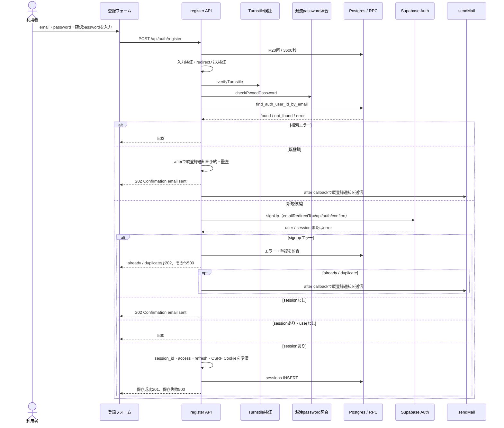
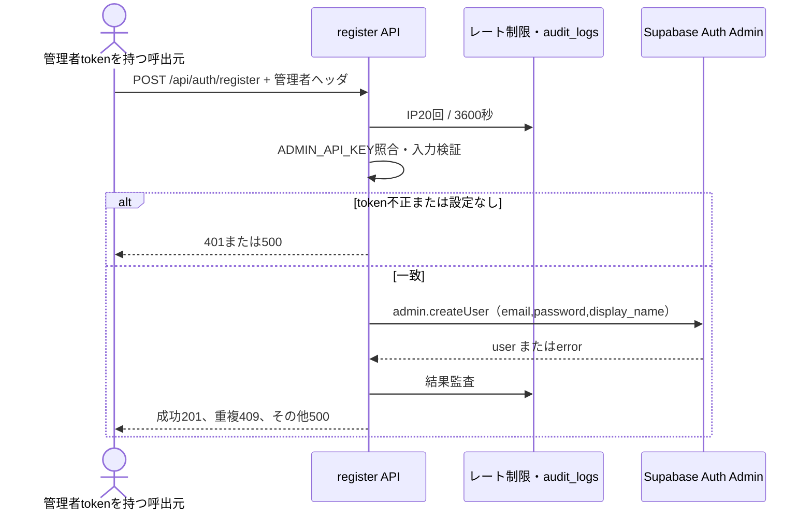
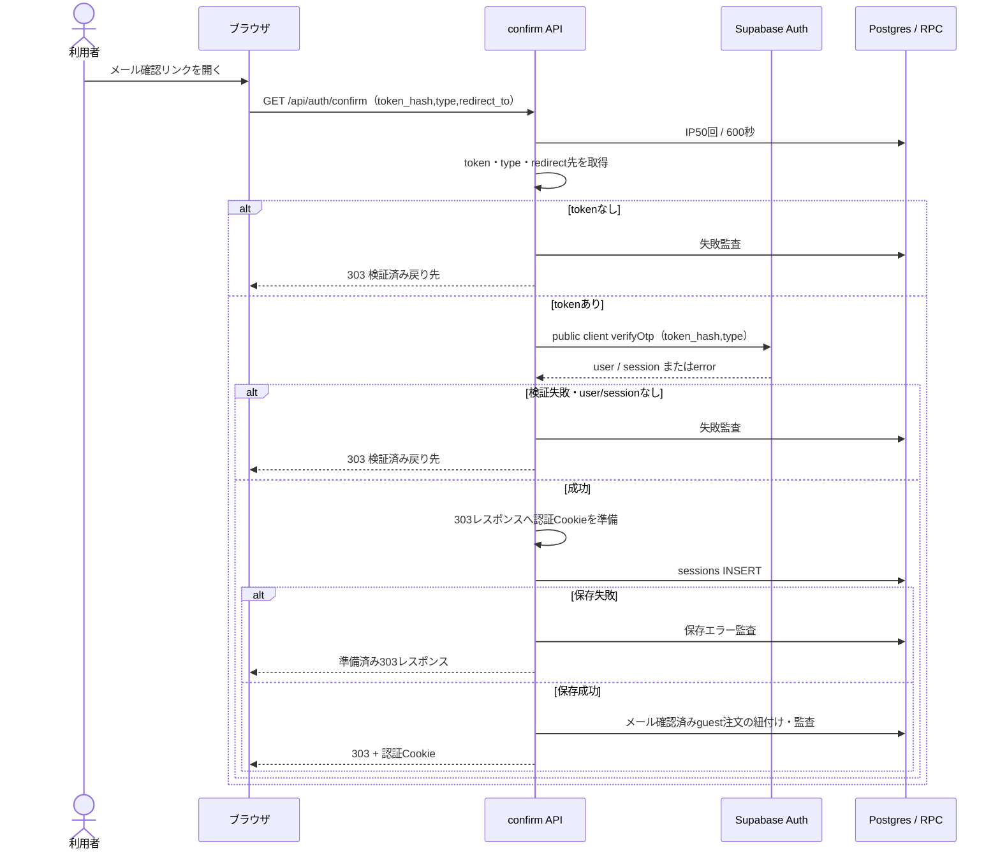

# 会員登録・確認シーケンス

> 状態: 現行ソース照合済み | 確認日: 2026-10-04 | 対象: 公開登録、管理者作成、メール確認

## 概要

公開登録は通常202で確認メールの受付を返し、既登録の場合も同じ応答を返す。メールリンクの確認はpublic clientでtoken_hashを検証し、認証Cookieを準備してからlocal sessionsを保存する。管理者ヘッダによる作成と確認メールの到達を別の開始契機として描く。[記載方針](README.md)を参照する。

## 範囲と根拠

既存要件は[LOGINのページ別要求表](../pages/14_login.md)と[要求定義](../../02_Requirements/requirements.md)を参照する。

| 対象 | 実コード参照 |
| --- | --- |
| 登録受付 | [register API](../../../src/app/api/auth/register/route.ts) L40–243、[Schema](../../../src/features/auth/schemas/register.ts) |
| メール確認 | [confirm API](../../../src/app/api/auth/confirm/route.ts) L27–110、[redirect検証](../../../src/lib/redirect.ts) |
| ユーザー検索 | [検索サービス](../../../src/features/auth/services/auth-admin-user.ts)、[migration](../../../supabase/migrations/20260901102912_remote_schema.sql) L1705–1721 |
| CookieとDB保存 | [初回保存](../../../src/features/auth/services/register.ts) L17–123、[Cookie](../../../src/lib/cookie.ts)、[ゲスト注文引継ぎ](../../../src/lib/orders/link-guest-orders.ts) |
| UI・監査 | [RegisterModal](../../../src/components/RegisterModal.tsx)、[LoginContext](../../../src/contexts/LoginContext.tsx)、[audit helper](../../../src/lib/audit.ts) |

POSTは[proxy](../../../src/proxy.ts)のOrigin検査を先に通る。register／confirmのレート制限は[共通helper](../../../src/features/auth/middleware/rateLimit.ts)で、429またはDB障害503とRetry-Afterを返す。

## SQ-AUTH-REGISTER-PUBLIC: 公開登録受付

開始契機は`/login`の会員登録フォーム送信。事前条件はemail・passwordと、設定時のTurnstile token。終了結果は202の受付、session付きsignupの201、またはエラーである。

登録UIは成功応答でメール送信案内を表示する。[RegisterModal](../../../src/components/RegisterModal.tsx)は16文字以上と確認password一致を確かめ、[共通Schema](../../../src/features/auth/schemas/common.ts)は16〜128文字を要求する。

公開signUpは[createClient](../../../src/lib/supabase/server.ts)をRequestなしで呼び、SSR clientのCookie adapterはnext/headersのCookie storeへ書く。インストール済み[SSR client](../../../node_modules/@supabase/ssr/dist/module/createServerClient.js)はPKCEとpersistSession=trueを設定し、[signUp](../../../node_modules/@supabase/auth-js/dist/module/GoTrueClient.js)はPKCE code verifierを作り、sessionが返った場合はSIGNED_INを通知する。[SSR storage](../../../node_modules/@supabase/ssr/dist/module/cookies.js)からadapterへ届くSDK Cookie書込みは、上図の独自201レスポンスへのCookie準備と別の経路である。独自保存失敗時に新しい500を返しても、Cookie storeへ行ったSDK Cookie書込みを取消す処理はない。実際のCookie名・分割・ブラウザへの反映は今回runtimeで確認していない。

| 分岐 | 応答・処理 |
| --- | --- |
| 入力不正／Turnstile失敗／漏洩password | 400／403／400で止まる |
| 漏洩照合サービス利用不可 | 監査して登録処理を続ける |
| signupでalready／duplicate | 既登録通知を予約して202。他のsignupエラーは500 |
| signupがsessionを返しuserなし | 500 |
| 初回保存失敗 | 新しい500レスポンスを返す。準備した201を返さない。SSR adapterのCookie store書込みとは別であり、SDK Cookieの取消を保証しない |
| 外側例外 | JSON解析を含む予期しない例外は500 |
| afterのメール送信失敗 | ログのみ。返した202は変えない |

session付きsignupの経路は、コードコメントではSupabaseのConfirm email OFF時と説明される。実際の設定は今回未確認で、公開登録が常に202とは断定しない。

## SQ-AUTH-REGISTER-ADMIN: 管理者ヘッダによる作成

開始契機は管理者token付きの登録API要求。事前条件は`x-admin-token`またはBearerと`ADMIN_API_KEY`の一致。終了結果は201のuser id/email、またはエラーである。

この分岐は公開登録のTurnstile・漏洩照合・signUpを通らず、独自認証Cookieを発行しない。管理者ヘッダが無い要求は公開登録として処理する。

## SQ-AUTH-REGISTER-CONFIRM: 確認リンクの検証

開始契機はメール確認先へのGET。事前条件はtoken_hash（またはtoken）と任意のtype／redirect_to。終了結果は検証済み戻り先への303。成功と失敗のHTTP redirectを区別せず、監査とCookieの有無に違いがある。

typeはsignup／email／magiclink／recoveryを受理し、不明値はsignupにする。戻り先の既定は`/account`、登録フォームは`/auth/verified`を指定する。303はno-store／no-referrerを設定する。保存失敗でも準備済みレスポンスを返すため、Cookie準備が進んだ範囲とDB保存は一致しない場合がある。予期しない例外も同じ戻り先への303で終わる。

ゲスト注文は確認済みemail・user_id NULLの行だけを紐付ける。紐付いた注文がある場合は、最新注文の配送先・氏名からprofilesの未設定住所・表示名も補完する。既存値は上書きしない。profile保存失敗でも注文の紐付けを戻さず、いずれのhelper失敗も認証を止めない。注文の紐付け失敗は次回OTPログインで再試行される。

登録フォームが指定する`/auth/verified`の到達後は、[追加認証画面の入口と出口](auth-login-mfa.md#追加認証画面の入口と出口)に従い、未認証表示、一般userの/account、特権roleのTOTP／管理画面へ分かれる。

## 関連テスト

今回、以下は未実行。

| 観点 | テスト |
| --- | --- |
| 登録応答・管理者分岐 | [register](../../../tests/integration/api/auth/register.test.ts) |
| 既登録の応答統一 | [register enumeration](../../../tests/integration/api/auth/register-enumeration.test.ts) |
| 確認token・redirect・保存失敗 | [confirm](../../../tests/integration/api/auth/confirm.test.ts) |
| Cookie属性 | [cookie flags](../../../tests/integration/api/auth/cookieFlags.test.ts) |

## 未確認事項

Supabase Confirm emailの実設定、確認メールテンプレート・tokenの有効期限・到達、管理者tokenの配布、migrationの適用は未確認。Supabase内部のuser作成SQLとメール送信順序は、本書のSDK呼出しから推測していない。
