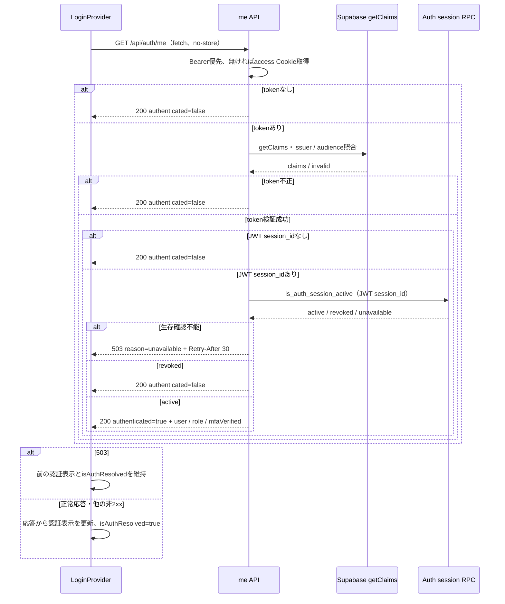
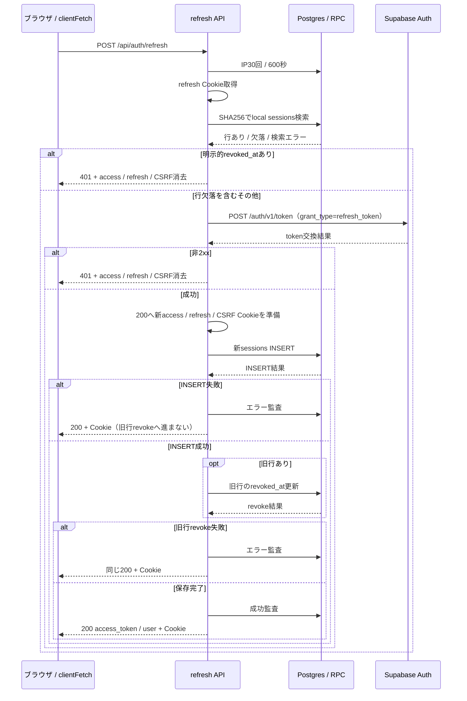
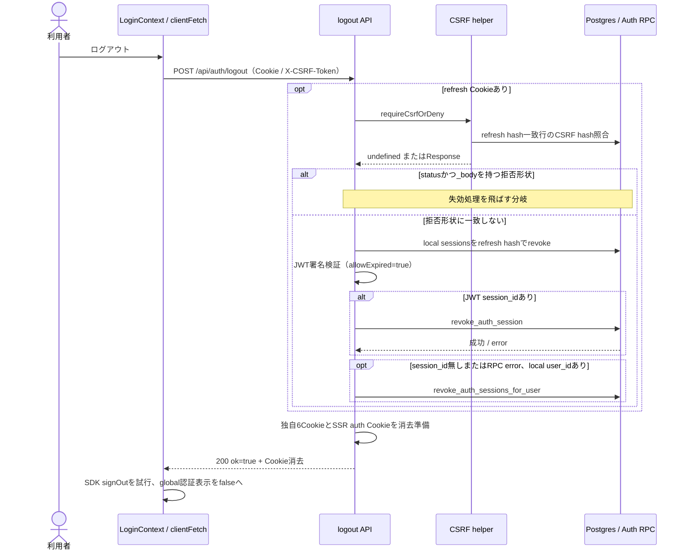
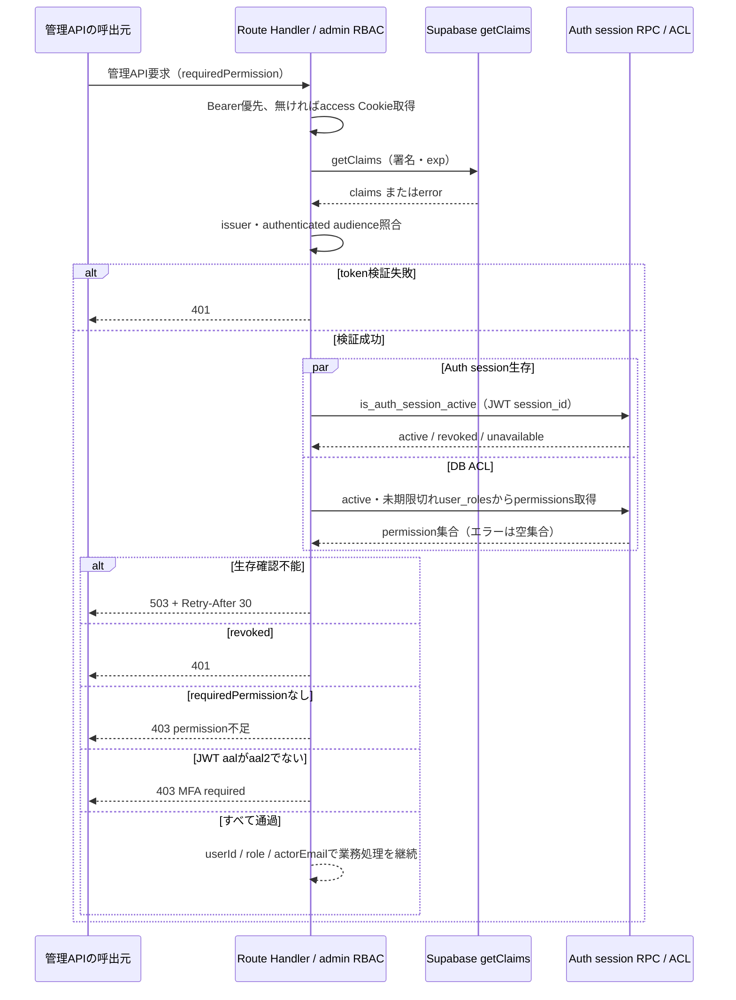

# セッション・API認可シーケンス

> 状態: 現行ソース照合済み | 確認日: 2026-10-04 | 対象: 初期認証表示、refresh、logout、管理API認可

## 概要

初期認証表示はme APIでJWTとAuth session生存を確認する。refreshはSupabaseのtoken交換後に新Cookieを準備し、新local sessions行を保存して旧行を失効させる。logoutはCookie消去とAuth session失効を試み、通常200を返す。管理API認可はJWT検証後にAuth session生存とDB ACLを並列照会し、生存→ACL→JWT aal2の順に結果を判定する。4つの開始契機を分けて描く。[記載方針](README.md)を参照する。

## 範囲と根拠

関連要件は[LOGINのページ別資料](../pages/14_login.md)、[ADMINのページ別設計](../pages/16_admin.md)、[要求定義](../../02_Requirements/requirements.md)を参照する。

| 対象 | 実コード参照 |
| --- | --- |
| refreshと更新保存 | [refresh API](../../../src/app/api/auth/refresh/route.ts) L18–135、[sessionサービス](../../../src/features/auth/services/session.ts) L20–124 |
| logoutとCSRF | [logout API](../../../src/app/api/auth/logout/route.ts) L21–172、[CSRF helper](../../../src/lib/csrfMiddleware.ts) |
| 認証とACL | [authenticate](../../../src/lib/auth/authenticate.ts) L87–195、[request token](../../../src/lib/auth/request-token.ts)、[admin RBAC](../../../src/lib/auth/admin-rbac.ts) L92–231 |
| DBとCookie | [migration](../../../supabase/migrations/20260901102912_remote_schema.sql) L866–886、L1861–1876、L2105–2137、[Cookie helper](../../../src/lib/cookie.ts) |
| 呼出元と認証表示 | [clientFetch](../../../src/lib/client-fetch.ts)、[LoginContext](../../../src/contexts/LoginContext.tsx)、[me API](../../../src/app/api/auth/me/route.ts) |

状態変更APIには[proxy](../../../src/proxy.ts)のOrigin／Referer検査が先行する。認証失敗時の標準応答はmissing／invalid／revokedが401、session生存確認不能が503とRetry-After: 30。me APIはmissing等を200 `{authenticated:false}`、生存確認helperがunavailableを返した場合を503にする。meの外側catchに到達した予期しない例外は200 `{authenticated:false}`になる。

## SQ-AUTH-SESSION-ME: 初期認証表示の同期

開始契機はLoginProviderの初期表示。事前条件は不要。終了結果はglobalの認証表示が解決済みになる状態、または503により初期の未解決状態を維持する状態である。OTP成功後・MFA成功後の明示的な再同期も同じ同期関数を使う。

APIの予期しない例外は200の未認証応答。UIの通信例外・JSONを読めない応答も未認証表示を確定する。認証成功のroleはJWTのapp_metadata.roleから読み、不明値はuser、mfaVerifiedはJWT aal=aal2である。global同期はclientFetchを使わず、meは期限切れtokenにも200を返すため、この同期自体からrefreshや401再送は起動しない。初回503ではisAuthResolved=falseのままで、すでに解決した後の503ではその表示を保つ。

`/auth/verified`が独自に行うme照会とrole別の画面出口は[追加認証画面の入口と出口](auth-login-mfa.md#追加認証画面の入口と出口)を参照する。

## SQ-AUTH-SESSION-REFRESH: token交換

開始契機はクライアントのsession更新要求。事前条件は`sb-refresh-token`。終了結果はtoken交換成功200とCookie、またはエラーである。

refresh Cookie欠落401、設定欠落／外側例外500、rate limit429／503。local検索のDBエラーはnullとなり、行欠落と同じく交換を続ける。Supabaseの非2xxは上流のstatusに関わらず401へ変換する。

| 保存・token処理 | 現行実装 |
| --- | --- |
| 更新Cookie | access／refresh／CSRFのMax-Ageは7日。JWT自体のexpとは別である |
| local sessions | 新行にrefresh hash、previous refresh hash、CSRF hash、quarantined=false、expires_at=7日後を保存。新行INSERT後に旧行をrevoke |
| 認可の根拠 | local sessionsは監査記録。API認証はJWTとauth.sessions生存RPCを使う。ただしrefreshは明示local revoked_atを拒否に使う |
| 再利用検出 | このrouteはcurrent_jti照合・リスク判定・quarantine通知・同時端末上限を行わない。Supabaseのtoken交換結果を使う |
| 部分成功 | 新token発行後のDB失敗でもCookie付き200を維持する。DB成功を200だけから判断しない |

`persistNewSession`はCookie準備の後にservice-role clientを生成する。INSERT失敗なら旧行を更新しない。INSERT成功後の旧行revoke失敗では新行が残り、rollbackする処理はない。Cookie準備自体の例外も同じ保存catchへ入るため、200時にすべてのCookie準備が完了したとは断定しない。

[clientFetch](../../../src/lib/client-fetch.ts)はGET／HEADの401だけを共有refresh成功後に1回再送する。状態変更はCSRF Cookieが無い場合に送信前refreshを試す。refresh401で30秒抑制と`auth:session-expired`通知、429でRetry-After／既定60秒、その他エラー・通信失敗で5秒抑制となる。LoginContextは失効通知で認証表示を落とし、meの503では前の表示状態を維持する。

## SQ-AUTH-SESSION-LOGOUT: Cookie消去と失効

開始契機はログアウト操作。事前条件は不要。refresh Cookieがある場合はCSRF helperを呼ぶ。終了結果は通常200とCookie消去指示で、失効RPCの成功は応答だけでは保証されない。

独自6Cookieは`session_id`、`sb-refresh-token`、`sb-access-token`、`sb-csrf-token`、`sb-login-2fa-session`、`sb-password-reset-session`。SSR Cookieは`sb-.*-auth-token`と`.数字`の分割Cookieを消去する。DB側例外はログを残してCookie消去に進み、外側例外は500。SDK signOut失敗はUIが吸収する。

local sessions更新の戻り値errorをrouteは検査しない。JWTで特定できずlocal user_idも無い場合は監査のみ、失効RPC errorはログ・監査に残し、200へ進む。API非2xxや通信例外ではLoginContextは失敗を返し、上図のglobal認証表示の解除を実行しない。clientFetchが送信前refreshを試す場合は、その結果がlogoutへ渡るCookieに影響する。

### CSRF拒否判定の実コード上の注意

`isCsrfDenyResponse`は`status`と`_body`の両プロパティを要求する。一方、CSRF helperは本物の`NextResponse.json`を返し、[logoutテスト](../../../tests/integration/api/auth/logout.test.ts)のmockだけが`_body`を付ける。インストール済み[NextResponse実装](../../../node_modules/next/dist/server/web/spec-extension/response.js)に`_body`の定義は見当たらない。したがって、図は判定条件をそのまま記し、「helperの403なら必ずサーバー失効を飛ばす」という保証にはしていない。今回runtimeでの検証・修正は行っていない。

CSRF helperはrefresh Cookie無しなら検査不要、ヘッダ欠落／hash不一致は403、例外は500。通常の戻り値はundefinedで、旧rotation用の型は残るが現在のhelperはrotationを返さない。

## SQ-AUTH-API-AUTHZ: 管理APIの認可

開始契機は`authorizeAdminPermission`を使う管理API要求。事前条件はaccess CookieまたはBearerと、そのAPIのrequiredPermission。終了結果は認可成功または401／403／503／500である。特定APIの業務更新は、この図の成功後に各routeが行う。

ACLはservice-roleで`user_roles → roles → role_permissions → permissions.code`を取得し、active=true、expires_at nullまたは未来で絞る。app_metadata.roleは応答・監査に載せる値で、管理権限を付与する根拠にはしない。ACL照会エラーは空集合のため403、認可処理の外側例外は内部詳細を出さない500。

`is_auth_session_active`はauth.sessionsのidの存在とnot_afterを確認する。`revoke_auth_session`と`revoke_auth_sessions_for_user`はauth.sessions行を削除する。[migration](../../../supabase/migrations/20260901102912_remote_schema.sql)ではRPCのEXECUTEをPUBLICから外しpostgres／service_roleへ与えている。ここでいうsession_idはJWT claimであり、ゲスト用の`session_id` Cookieとは異なる。

## 関連テスト

今回、以下は未実行。

| 観点 | テスト |
| --- | --- |
| refresh交換・拒否Cookie消去 | [refresh](../../../tests/integration/api/auth/refresh.test.ts) |
| 更新保存の順序・失敗 | [sessionサービス](../../../tests/unit/features/auth/services/session.test.ts) |
| logout200・DB失敗・SSR Cookie消去 | [logout](../../../tests/integration/api/auth/logout.test.ts) |
| 認証・503・ACL・AAL2 | [authenticate](../../../tests/unit/lib/auth/authenticate.test.ts)、[admin RBAC](../../../tests/unit/lib/auth/admin-rbac.test.ts)、[me](../../../tests/integration/api/auth/me.test.ts) |
| CSRF | [CSRF helper](../../../tests/unit/lib/csrf.middleware.test.ts) |

## 未確認事項

Supabaseの実access／refresh寿命、再利用検出設定、auth.sessionsの実失効、migration適用、実環境のCookieとCSRF拒否形状は未確認。local sessionsにcurrent_jti／quarantined列があることを、routeの再利用検出実装の証拠として扱わない。
