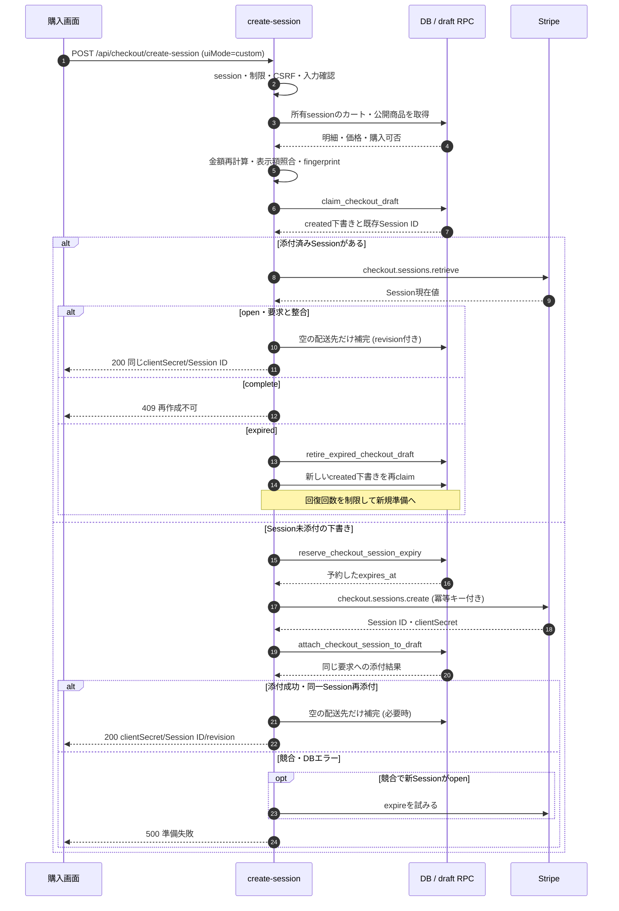
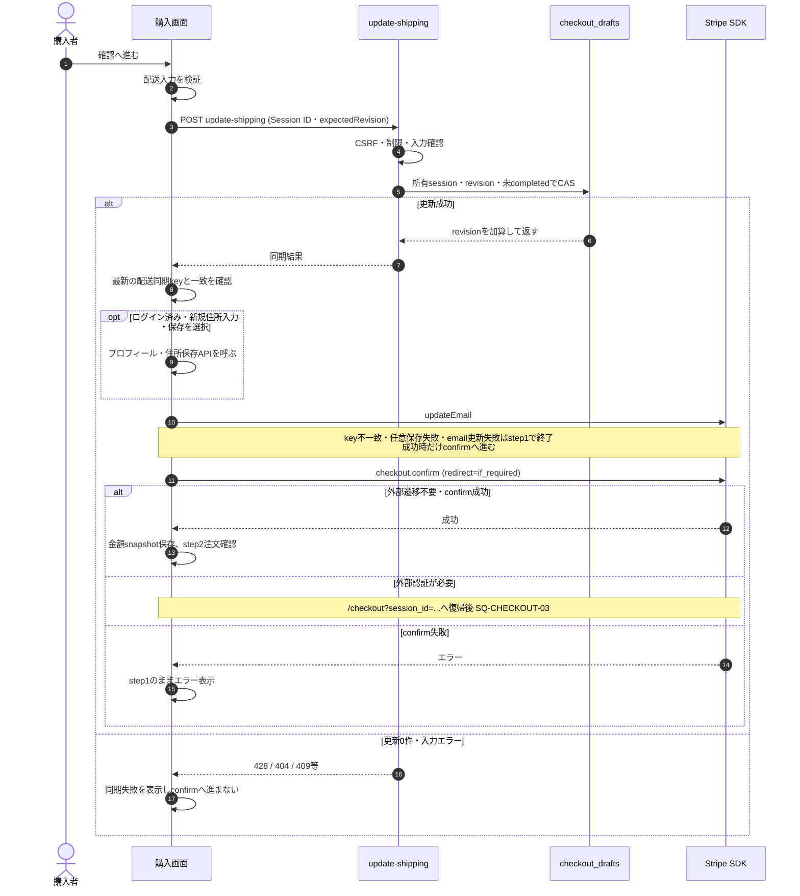
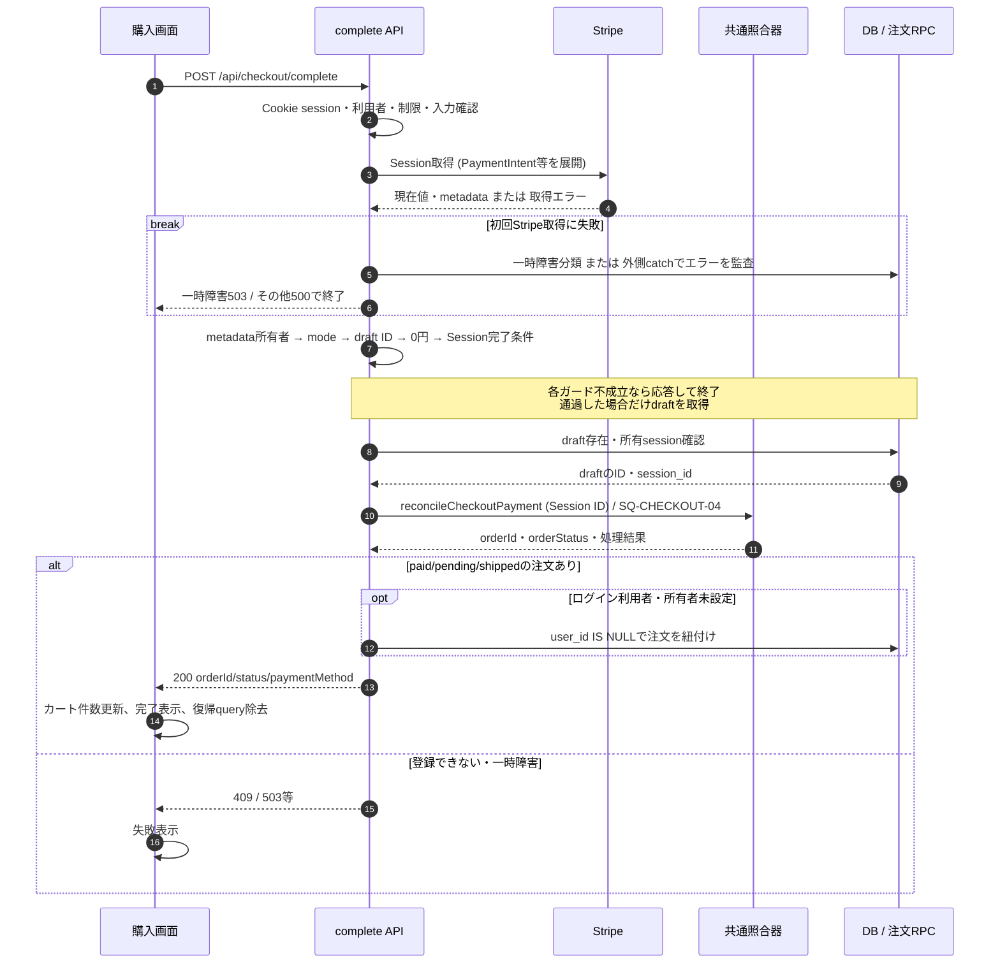
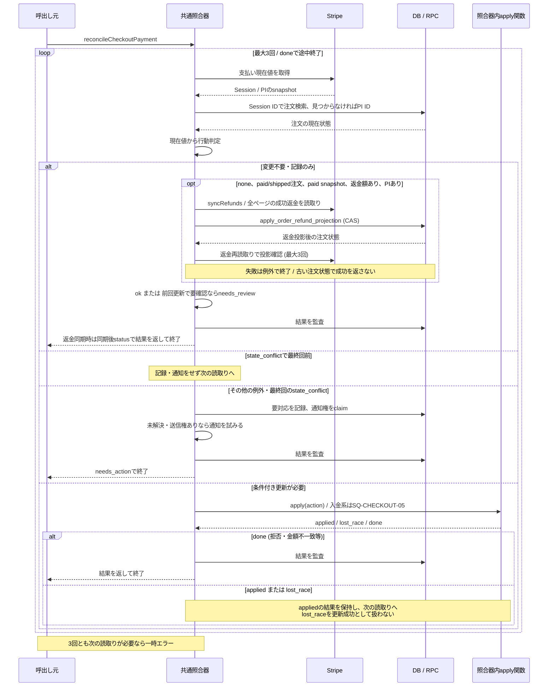
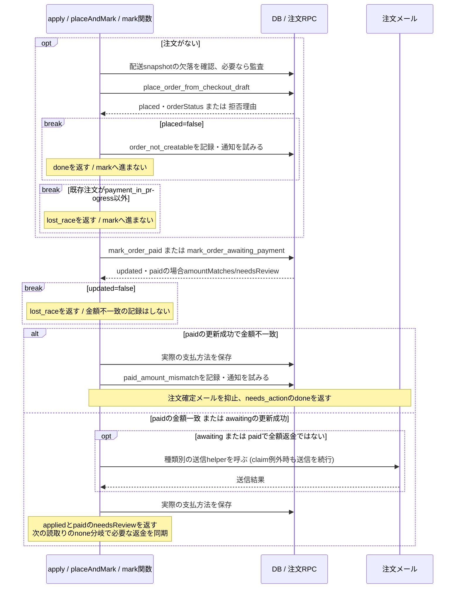

# 購入・決済照合シーケンス

> 状態: 現行ソース確認 | 確認日: 2026-10-04 | 対象: `/checkout`、Checkout Session、注文・在庫の照合

## 概要

現在の購入画面は、下書きとStripe Checkout Sessionを準備し、配送先を保存してからStripe決済を確定する。外部遷移が不要なら、その後に注文確認画面へ進み、注文確定操作でcomplete APIを呼ぶ。注文・在庫の作成はcomplete/Webhookが呼ぶ共通照合器が行う。表示の確認手順と、外部サービスで支払いが確定する順序を区別する。

## 範囲と根拠

対応: [CHECKOUT詳細設計](../pages/13_checkout.md)の購入・冪等性・配送revision・完了処理。粒度は[共通方針](README.md)、状態は[注文](../states/order-payment.md)と[下書き](../states/checkout-draft.md)。

| 略号 | 確認元 |
| --- | --- |
| UI | [checkout/page.tsx](../../../src/app/checkout/page.tsx) |
| Create | [create-session](../../../src/app/api/checkout/create-session/route.ts)、[draftサービス](../../../src/features/checkout/services/checkout-draft.service.ts) |
| Shipping | [update-shipping](../../../src/app/api/checkout/update-shipping/route.ts) |
| Complete | [complete](../../../src/app/api/checkout/complete/route.ts) |
| Reconcile | [照合器](../../../src/lib/stripe/checkout-payment-reconciler.ts)、[読取り](../../../src/lib/stripe/checkout-payment-reader.ts)、[判定](../../../src/lib/stripe/checkout-payment-decision.ts)、[DBアダプター](../../../src/lib/stripe/checkout-payment-reconciler-deps.ts) |
| RPC | [draft claim・attach・retire](../../../supabase/migrations/20260925000132_add_checkout_session_claim_rpcs.sql)、[期限予約](../../../supabase/migrations/20260927100600_checkout_session_expiry.sql)、[注文受付](../../../supabase/migrations/20260927100300_place_order_from_checkout_draft.sql)、[入金更新](../../../supabase/migrations/20260927100400_mark_order_payment_rpcs.sql) |

## SQ-CHECKOUT-01: 下書きとSessionの準備

開始は、カートの取得完了後、step=1、非空、clientSecret未取得の購入画面。事前条件はCookie `session_id`。正常終了ではcustom UI用のclientSecret・Session ID・shippingRevisionを受け取る。この段階で注文も在庫予約も作成しない。

expired分岐の後は、再claimの結果に応じてopen Session回復または新規準備を行う。図は初回と回復の要点を示し、回復の呼び出しを無限ループとして扱わない。

| 条件・例外 | 現行結果 |
| --- | --- |
| 商品欠落・購入不可 | prepareを拒否。数量不足だけでは拒否せず、注文受付時にstock/backorderを決める |
| 表示額とサーバー額の違い | 409 `checkout_amount_mismatch`。正の整数でない合計は400 |
| fingerprint | version、UI mode、origin、JPY、サーバー算出金額、canonical明細。配送先・支払方法を含まない |
| Session冪等キー | `checkout-session:create:v1:<draftId>:<expiresAt>`。draft claimは部分一意制約であり、Webhookのclaim token/leaseとは別 |
| Session作成期限 | DBに期限を予約してStripeへ渡す。既存の期限を再利用する条件は[下書き状態設計](../states/checkout-draft.md)に記載 |
| Stripe読取り失敗 | expiredとみなしてSessionを追加作成しない。取得の失敗として応答 |
| attachの競合とDBエラー | 競合は新しいopen Sessionをexpireする補償を試みる。DBエラーではexpireせず500。補償の成功を保証しない |
| 互換・hosted | v0/未設定draftのcustom再利用経路、hostedのURL応答もAPIにある。現在の購入画面はcustomを送る。[旧PaymentIntent API](../../../src/app/api/checkout/payment-intent/route.ts)はrate limit通過後に410を返す廃止入口。制限応答429/503が先行し得る |

## SQ-CHECKOUT-02: 配送先保存と決済確定

事前条件はSessionが準備済み、配送情報と支払情報が入力済み。step1の配送同期は同一タブで直列化し、入力が完全で変更ありなら500msのdebounceで送る。以下は利用者が「確認へ進む」を押したシナリオ。

| 条件 | 現行結果 |
| --- | --- |
| expectedRevisionなし | 428 `shipping_revision_required` |
| 更新0件 | 所有draftなしは404、draftありは409と現revision。completedのdraftもこの409経路 |
| 同一タブ・複数タブ | タブ内はPromise queueで同期を直列化。タブ間はDB revisionのCASで競合。409のrevisionを取り込み当該同期を失敗扱いとする |
| 古い入力への応答 | UIは古い要求の成功を最新の同期keyとして採用しない |
| 配送・メール・任意住所保存の失敗 | 決済confirm前の失敗は次の処理へ進まない。Sessionを作り直す動作ではない |
| 決済後の確認表示 | step2へ進む前にconfirmを呼ぶ。step2の「注文確定」で初めて決済を開始する図にはしない |

## SQ-CHECKOUT-03: complete APIと画面の完了

開始はstep2の注文確定、またはStripeからの `session_id` 付き復帰。復帰POSTはSession IDだけを送れる。completeは保存済み配送snapshotを使い、配送先の更新・revision確認をこのAPI内では行わない。

complete APIの正常終了はorderIdとpaid/pending/shippedの状態がある200。初回のSession取得もisTransientStripeErrorで分類し、一時障害なら503。それ以外の照合器外の例外は外側catchの500、照合器の一時エラーも503、注文を登録できない結果は409となる。配送先の入力欄をこのAPIで再保存することはない。

## SQ-CHECKOUT-04: 共通照合器の読取り・判定・再確認

開始はcomplete、Webhook worker、見回り、管理取消からの照合器呼出し。Session IDまたはPI IDが必要。図は読み直しの制御を表し、書込みの順序は次の部分シナリオへ分離する。正常終了はok/needs_review/needs_actionの結果であり、3回で終了条件に達しなければReconcileTransientError。

図の返却矢印はそこでループと関数を終了する。照合器はStripeへ書込みを行わず、必要なSession失効は呼出し元が先に行う。判定と解放RPCの遷移は[注文状態](../states/order-payment.md)、独立起動は[Webhookシーケンス](stripe-webhooks.md)を参照する。根拠は照合器の`reconcileCheckoutPayment`・`decide`・`apply`・`raiseException`とDBアダプター。

## SQ-CHECKOUT-05: 注文受付と入金状態の条件付き更新

SQ-CHECKOUT-04のapply内でpaidまたはawaitingの更新を選んだ部分シナリオ。事前条件は判定に必要なStripe snapshotがあり、注文なしならdraft・cart session・金額等も揃っていること。結果はapplied、競合のlost_race、要対応を記録して終了するdoneのいずれか。lost_raceなら呼出し元で再読取りし、この部分処理を続行しない。

`break`はその条件で部分シナリオを終了する。snapshot不足もunexpected_stateを記録してdoneとなり、placeへ進まない。入金更新が成立してから後続処理が例外になった場合、成立済みのRPCを一括で巻き戻す処理はない。根拠は照合器の`placeAndMark`・`markPaid`・`markAwaiting`。返金の投影は[注文管理](order-administration.md)へ分ける。

## 照合・例外・永続化の条件

| 項目 | 現行実装 |
| --- | --- |
| completeの外部・所有者ガード | Session metadataにsession_idがありCookieと違えば403。modeがpayment以外、draft IDなし、0円、未完了条件は400。draftの所有session違いも403 |
| 完了判定 | `payment_status=paid OR status=complete`のSessionを受け、照合結果にorderIdとpaid/pending/shippedの状態があれば200。`needs_action/needs_review`という結果名だけで常にエラーにする実装ではない |
| 返金が注文より先 | `paid`で`amountRefunded > 0 && amountRefunded >= amountReceived`なら注文なしでは`record_only(refunded_before_order)`。注文・在庫確保・注文メールを作らず、completeはorderIdなしの409。一部返金だけなら注文を作り、後続の照合で返金を同期する |
| 既存注文の返金 | 判定がnone、注文paid/shipped、snapshot paid、返金額>0、PIありの場合だけsyncRefundsを呼ぶ。入金更新直後の読み直しも対象。同期後statusを返し、全額返金によるcancelledならcompleteは409。record_only・返金0・cancelledには呼ばない。事前のPI/金額不一致は要対応分岐を優先する |
| 返金同期の失敗 | Stripe一時障害はstripe_unavailable、DB errorのcauseが一時障害ならdb_unavailable、最大3回の返金投影が未収束ならnot_convergedのReconcileTransientErrorへ変換。completeは503、workerはfail/retry。その他は元の例外を返す。成立済み注文RPCは巻き戻さない |
| 配送先 | completeのshippingは形式検証のみ。注文作成時はロックしたdraft.shipping_snapshotから写す。必須配送snapshot欠落は監査して注文作成を続ける |
| 新規受付 | Sessionで既存注文を確認、draftロック後にも確認。商品はID昇順でKEY SHARE、variantはID昇順でUPDATEロック。商品・金額等の拒否時はorder_not_creatableを記録し、自動返金はしない |
| 在庫 | 同variant数量を合算し、activeかつ足りるvariantだけstock、残りはbackorder。stock明細をpurchase台帳で確保。決済前のcreate-sessionでは予約しない |
| draftとカート | placeでdraft completed、入金RPCで対象snapshotのsource_cart_idと所有sessionが一致するカート行だけ削除 |
| paidの異常 | 金額・通貨不一致でもRPCはpaidに更新し、照合器が要対応を記録。再確保できないstock明細はpaid＋要確認。出荷ガードとは別に管理する |
| 競合・収束 | 更新0件や中間矛盾は読み直し。state_conflictが最終回まで続けば要対応を記録してneeds_actionを返す。最大3回の試行内でdoneに達せず、最終回がapplied/lost_raceで追加読取りを要する場合はReconcileTransientError(not_converged)。completeは一時エラーを503にする |
| 外部一時障害 | StripeConnectionError/StripeAPIError/StripeRateLimitError、または数値statusCodeが500以上/429なら一時障害。照合器の読取りはresource_missingをmissing分類。completeの初回Session取得も同じ一時障害判定で503を返す。初回取得のresource_missing・認証エラー・その他の非一時エラーは外側catchの500。入力・認証の問題を一時障害とみなして繰返さない |
| 注文メール | 設定・宛先が揃えば種類別claimを行う。RPCがfalseなら送らず、RPC error/例外は監査後に送信を続ける。送信失敗はclaimのreleaseを試みる。入金更新とメール到達・重複排除を同一視しない |
| 所有者紐付け | ログイン時のみ、user_id未設定条件で紐付け。失敗は成功応答を取り消さない |
| 画面再試行 | 通常確定・外部復帰とも失敗を表示。completeを自動pollするループは画面にない |
| 郵便番号の補助照会 | 7桁入力で[postal-code API](../../../src/app/api/checkout/postal-code/route.ts)をGET。IP60回/600秒、入力不正400、制限429/503、200(address/null)、上流例外502。[住所サービス](../../../src/features/checkout/services/postal-code.service.ts)はメモリ/DB cache、同一照会の共有、cache miss時のZipCloud照会を行う。UIは古い入力への応答を破棄し、補完できない場合も手入力を続けられる。draft保存や注文状態は変更しない。配送保存はSQ-CHECKOUT-02へ分ける |

金額・Session・PI照合の全判定は[状態図の判定表](../states/order-payment.md#stripe現在値の分類)へ集約する。

## 関連テスト

[Session claim](../../../tests/integration/db/checkout_session_claim.integration.test.ts)、[配送revision](../../../tests/integration/db/checkout_draft_shipping_revision.integration.test.ts)、[注文受付](../../../tests/integration/db/place_order_from_checkout_draft.integration.test.ts)、[読取り](../../../tests/unit/lib/stripe/checkout-payment-reader.test.ts)、[照合器](../../../tests/unit/lib/stripe/checkout-payment-reconciler.test.ts)、[入金更新](../../../tests/integration/db/mark_order_payment.integration.test.ts)、[完了と配送先E2E](../../../e2e/FR-CHECKOUT-005-006-009-checkout-postal-complete-idempotent.spec.ts)。関連する検証観点の参照であり、今回の実行成功証跡ではない。

## 未確認事項

本番のmigration適用、実際のStripe Session・PaymentIntent・動的支払方法、外部認証・メール到達、全競合の実行結果は未確認。SQLの「受付API(F)」コメントや廃止されたfinalize/PaymentIntent APIを、現行画面から呼ぶ経路として描かない。

照合基準は2026-10-04の作業ツリーで、`bbb18761`後の返金補正を含む。対象と検証結果は[レビュー記録](../../05_Quality/reviews/code/2026-10-04-sequence-state-review.md)を参照する。completeの外側500の監査はmessageと文字列codeを記録し、例外オブジェクトのdetails/hintを複写しない。
