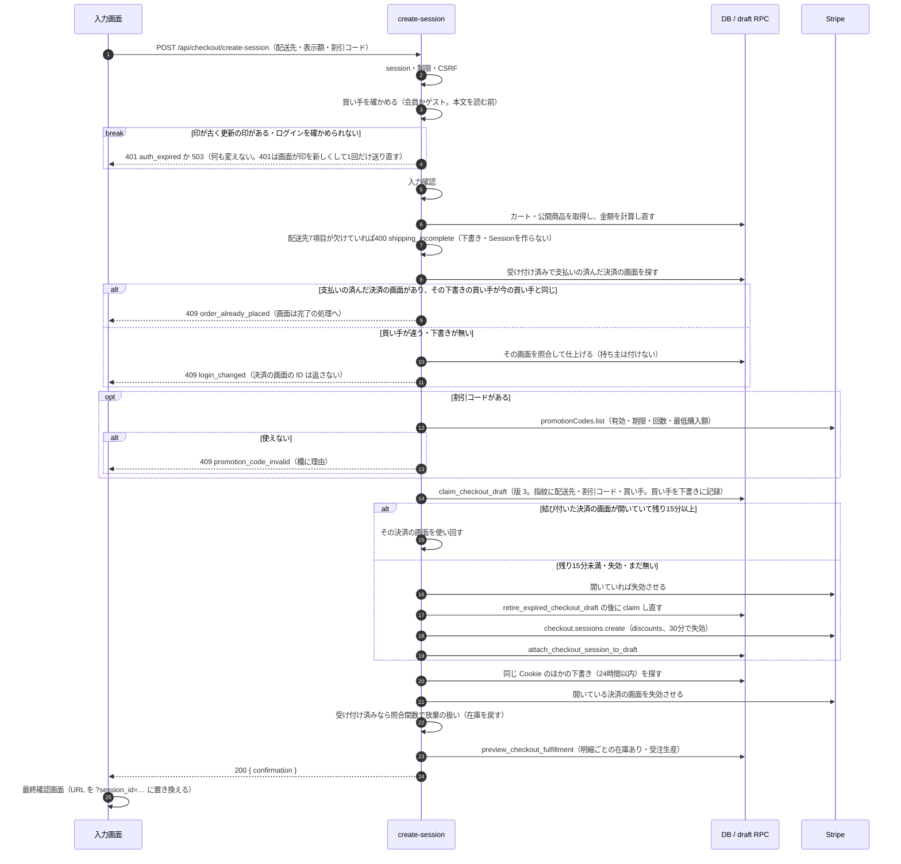
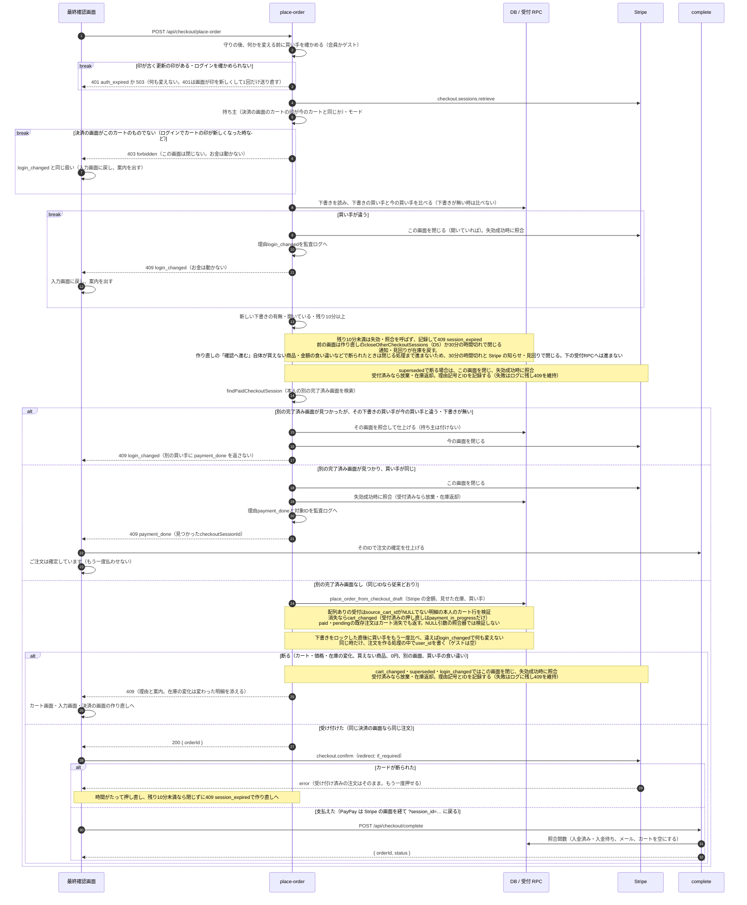
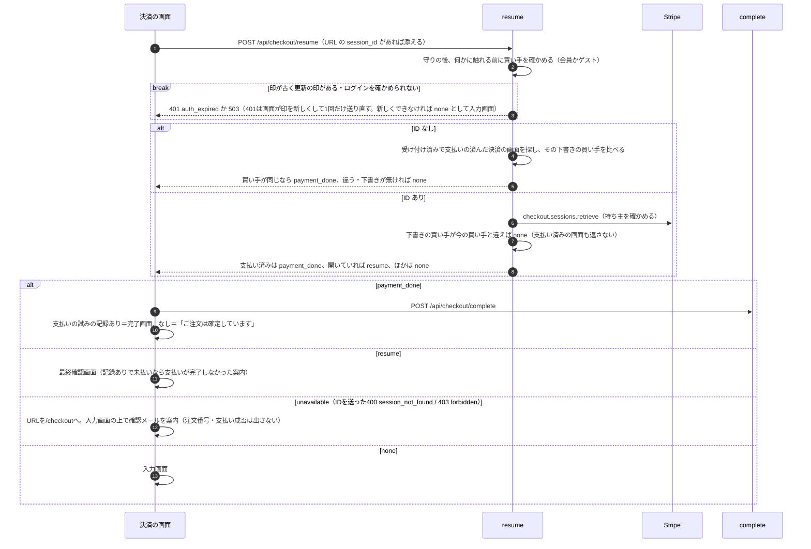
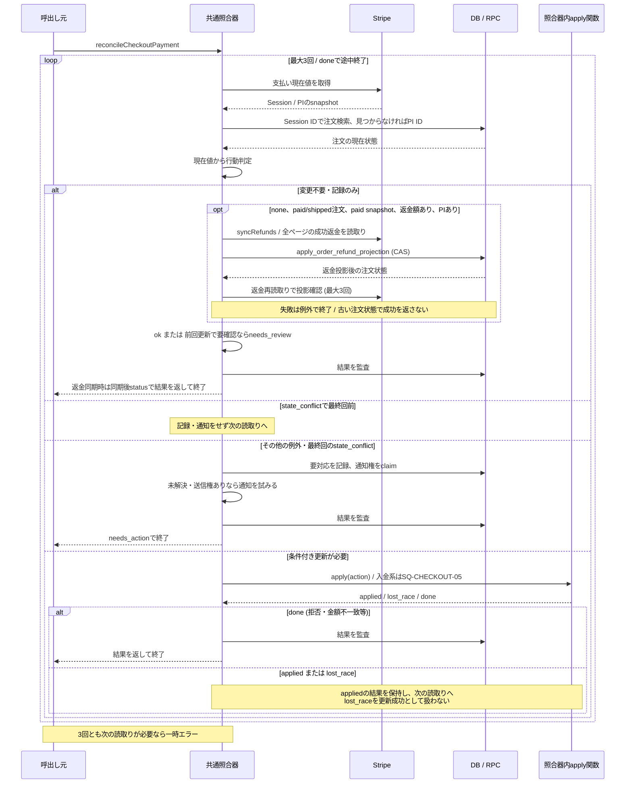
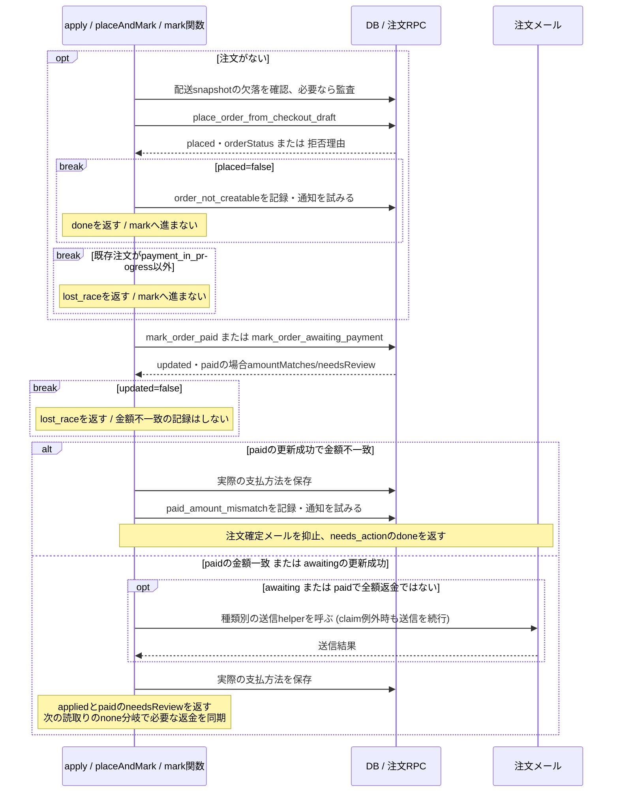

# 購入・決済照合シーケンス

> 状態: 現行ソース確認 | 確認日: 2026-10-07（買い手の確かめと比べはグループ C の変更を 2026-10-08 に反映） | 対象: `/checkout`、Checkout Session、注文・在庫の照合

## 概要

購入画面は、入力画面（お客様情報・配送先・割引コード）と最終確認画面に分かれる。「確認へ進む」でサーバーが下書きと Stripe Checkout Session（30分で失効。割引はサーバーが付ける）を作る。uiMode は custom のみ（既定 custom）、hosted は廃止し400。同じ Cookie のほかの決済の画面を閉じ、最終確認画面の内容を返す。配送先7項目が欠けていれば400 shipping_incompleteで断る。最終確認画面の「注文する」で、受け付け（注文と在庫の確保）→ 支払い → 完了の処理を一度に行う。受け付け時の注文作成・在庫の確保は place-order が受付 RPC で直接行う。その後の注文・在庫の状態の変更は complete、Webhook worker、見回り、管理取消が呼ぶ共通照合器が行う。create-session がほかの受付済みの決済の画面を失効させたときと、place-order が別の画面の payment_done・cart_changed（受付済みの押し直しを含む）・superseded で断った画面を失効させたときも、照合器を呼び、受け付け済みなら注文を放棄扱いにし、在庫を戻す。残り10分未満は閉じずに409 session_expiredを返して記録し、前の画面は作り直しのD5か30分の時間切れで閉じ、通知・見回りが在庫を戻す。作り直しの「確認へ進む」自体が買えない商品・金額の食い違いなどで断られたときは閉じる処理まで進まないため、30分の時間切れと Stripe の知らせ・見回りで閉じる。開き直したときは入り直しの入口が、どこから続けるかを返す。

注文の持ち主（グループ C）は、create-session・place-order・resume の3つの入口がサーバーでログインを確かめて決める。「確認へ進む」で下書きに買い手（会員の ID、ゲストは空）を記録し、「注文する」でもう一度確かめて下書きの買い手と比べる。同じ時だけ、受付 RPC が注文を作る処理の中で持ち主（`user_id`）を書く。違えば 409 `login_changed` で断る（決済の画面を閉じる。お金は動かない）。ログインはカートの印（`session_id` の Cookie）を新しくする（セッション固定への守り。今のカートは引き継がれない）ので、「確認へ進む」の後にログインして「注文する」を押すと、決済の画面は今のカートのものでなくなり、買い手を比べる前の確かめで 403 `forbidden` で断る（この 403 では決済の画面を閉じない。お金は動かない）。画面はこの 403 も `login_changed` と同じ扱いにする。買い手の比べ（409 `login_changed`）が直接効くのは、カートの印が残ったままログインだけが変わった時（ログインの Cookie の失効・消去、別の端末からのログアウト）。完了の処理と照合器は持ち主に触れない。

## 範囲と根拠

対応: [CHECKOUT詳細設計](../pages/13_checkout.md)の購入・冪等性・最終確認画面と受け付け・入り直し・完了処理。粒度は[共通方針](README.md)、状態は[注文](../states/order-payment.md)と[下書き](../states/checkout-draft.md)。

| 略号 | 確認元 |
| --- | --- |
| UI | [checkout/page.tsx](../../../src/app/checkout/page.tsx)、[最終確認画面](../../../src/app/checkout/_components/FinalConfirmationStep.tsx) |
| Buyer | [買い手の確かめ](../../../src/features/checkout/services/checkout-buyer.ts)（create-session・place-order・resume が、守りの直後に呼ぶ） |
| Create | [create-session](../../../src/app/api/checkout/create-session/route.ts)、[draftサービス](../../../src/features/checkout/services/checkout-draft.service.ts)、[最終確認画面の内容](../../../src/features/checkout/services/checkout-confirmation.service.ts)、[お届けの目安](../../../src/features/checkout/services/checkout-fulfillment.service.ts) |
| PlaceOrder | [place-order](../../../src/app/api/checkout/place-order/route.ts) |
| Resume | [resume](../../../src/app/api/checkout/resume/route.ts)、[決済の画面の後始末](../../../src/features/checkout/services/checkout-session-lifecycle.service.ts) |
| Promotion | [promotion-code](../../../src/app/api/checkout/promotion-code/route.ts)、[割引コードの確かめ](../../../src/features/checkout/services/promotion-code.service.ts) |
| Complete | [complete](../../../src/app/api/checkout/complete/route.ts) |
| Reconcile | [照合器](../../../src/lib/stripe/checkout-payment-reconciler.ts)、[読取り](../../../src/lib/stripe/checkout-payment-reader.ts)、[判定](../../../src/lib/stripe/checkout-payment-decision.ts)、[DBアダプター](../../../src/lib/stripe/checkout-payment-reconciler-deps.ts) |
| RPC | [draft claim・attach・retire](../../../supabase/migrations/20260925000132_add_checkout_session_claim_rpcs.sql)、[期限予約](../../../supabase/migrations/20260927100600_checkout_session_expiry.sql)、[注文受付](../../../supabase/migrations/20260927100300_place_order_from_checkout_draft.sql)、[入金更新](../../../supabase/migrations/20260927100400_mark_order_payment_rpcs.sql)、[最終確認画面の受け付け](../../../supabase/migrations/20261007133711_checkout_final_screen_place_order.sql)、[下書きの買い手と注文の持ち主](../../../supabase/migrations/20261008120000_checkout_order_owner_binding.sql) |

## SQ-CHECKOUT-01: 「確認へ進む」で決済の画面を作る

> FREQ-418 によりページを開いた時の作成を廃止した。下の図は現在の購入画面が使う custom の経路。uiMode は custom のみ、hosted は廃止して400。

開始は入力画面の「確認へ進む」。事前条件は Cookie `session_id` と、入力の検証が通ったこと。正常終了では最終確認画面の内容（`confirmation`）を受け取る。この段階で注文も在庫の確保も作らない。

| 条件・例外 | 結果 |
| --- | --- |
| 前処理（FREQ-366） | 住所の入力フォームを出していて「この配送先を保存する」が ON のときは、この呼び出しの前にプロフィール・住所帳へ保存する。失敗したときは呼ばず、入力画面に案内を出す |
| 商品欠落・購入不可 | 409 `out_of_stock` で拒否する。数量不足だけでは拒否せず、在庫あり・受注生産は「注文する」の受け付けで決める。表示額とサーバー額の違いは409 `checkout_amount_mismatch`、正の整数でない合計は400 |
| 要求の指紋 | 版3（グループ C）。UI mode、origin、JPY、サーバー算出金額、canonical明細、配送先、割引コードの識別子、買い手（会員の ID、ゲストは空）を含み、申告の支払方法は含まない。買い手が違えば別の下書きになり、買い手を記録していない古い版の下書きは使い回さない。冪等キーは `checkout-session:create:v3:<draftId>:<expiresAt>`。draft claimは部分一意制約であり、Webhookのclaim token/leaseとは別 |
| ログインの確かめ（グループ C） | CSRFの後、本文を読む前に[買い手の確かめ](../../../src/features/checkout/services/checkout-buyer.ts)を行う。印が古い・失効で更新の印（`sb-refresh-token` Cookie）がある時は401 `auth_expired`、DBの不調で生存確認ができない時は503。どちらも下書き・Stripeに触れる前に返すので、画面が送り直しても二重にならない。更新の印が無い古い印はゲストとして進む。会員の IDは検証済みの`claims.sub`だけを使う |
| 支払い済みの画面の買い手（グループ C） | 見つかった支払い済みの画面の下書きの買い手が今の買い手と違う・下書きが無い時は、その画面を照合して仕上げ（持ち主は付けない）、監査ログ（`reason:login_changed`）を残して409 `login_changed`で断る。別の買い手に決済の画面の ID を渡さない |
| Session作成期限 | DBに期限を予約してStripeへ渡す。既存の期限を再利用する条件は[下書き状態設計](../states/checkout-draft.md)に記載 |
| Stripe読取り失敗 | expiredとみなしてSessionを追加作成しない。取得の失敗として応答 |
| attachの競合とDBエラー | 競合は新しいopen Sessionをexpireする補償を試みる。DBエラーではexpireせず500。補償の成功を保証しない |
| hosted・旧API | uiModeはcustomのみ（既定custom）。hostedは廃止して400。[旧PaymentIntent API](../../../src/app/api/checkout/payment-intent/route.ts)はrate limit通過後に410を返す廃止入口。制限応答429/503が先行し得る |

## SQ-CHECKOUT-02: 「注文する」で受け付けて支払う

開始は最終確認画面の「注文する」。お客様から送るのは決済の画面の ID と、最終確認画面で「在庫あり」と見せた明細のバリアントだけ。金額はサーバーが Stripe から読み直す。前段の「確認へ進む」は custom のみで、配送先7項目を求め、欠落を400 shipping_incompleteで断る。別のブラウザでURLに戻った場合は SQ-CHECKOUT-03 の unavailable の案内へ進み、この受付へ進まない。

| 断りの理由 | 画面の動き |
| --- | --- |
| `stock_changed`・`item_unavailable`・`price_changed`・`cart_changed` | カート画面へ移し、案内を1回だけ出す（`sessionStorage` の `checkout:cart-notice`）。在庫の変化は、変わった明細の名前・色・サイズと「在庫あり → 受注生産」の印を添える |
| `zero_amount` | 入力画面へ戻し、案内を出す |
| `session_expired` | 「確認へ進む」と同じ処理で決済の画面を作り直し、最終確認画面の一番上に案内を出す。作り直しの応答を待つ間は、「変更」「戻る」「注文する」を押せない。作り直しが `out_of_stock` で断られたら、商品名入りのサーバー文を渡してカートへ移る（FREQ-424） |
| `superseded` | その画面のまま、一番上に案内を出す（別のタブで後から「確認へ進む」が押された） |
| `login_changed` | 入力画面へ戻し、ボタンの上に「ログインの状態が変わりました。もう一度「確認へ進む」を押してください。」を出す（押し直せる）。ログインの状態とカートを読み直し、入力欄の扱いを今のログインに合わせる（会員なら入力欄をその会員の内容で置き換える（C7）。ゲストなら今の入力を残す）。印を新しくできなかった401（`auth_expired`）と、決済の画面がこのカートのものでないという403（`forbidden`）も、同じ扱いにする |
| 403 `forbidden`（決済の画面がこのカートのものでない） | 「確認へ進む」の後にログインしてカートの印が新しくなった時など。`login_changed` と同じ扱い（同じ案内・入力画面へ戻す・読み直し）。サーバーは印の合わない要求で他人の決済の画面を閉じさせないため、この403では決済の画面を閉じない（30分の時間切れで閉じる）。画面からも閉じない。読み直すカートは新しい印のカートで、ゲストのカートは引き継がれていない |
| `payment_done` | 完了済み。同じCookieの別の画面が見つかった場合は応答のcheckoutSessionIdで完了の処理へ進み、「ご注文は確定しています」を出す |

受け付け・支払い・完了の処理の間は、「注文する」を押せない。完了の処理の中の照合は SQ-CHECKOUT-04・05。complete API は metadata の持ち主・mode・draft ID・0円・完了条件の順に確かめる（下の「照合・例外・永続化の条件」）。

## SQ-CHECKOUT-03: 開き直したとき（入り直し）

開始は /checkout を開いたとき（Stripe の画面からの戻り・読み込み直しを含む）。1回の読み込みで1回だけ問い合わせる（FREQ-378）。

| 条件 | 結果 |
| --- | --- |
| resume の失敗 | IDを送った400 session_not_found / 403 forbiddenだけは画面が`unavailable`として扱い、URLを`/checkout`に戻す。2列の外の常設LiveMessage（status、checkout-resume-notice）に「このブラウザではご注文の状態を表示できません。お支払いがお済みの場合は、ご注文確認のメールをお送りしています。」と出し、注文番号・支払い成否は出さない。通信の失敗・その他の失敗・ID無しは`none`として入力画面から始める |
| 買い手の食い違い（グループ C） | 決済の画面の下書きの買い手が今の買い手と違えば、開いている画面でも支払い済みでも`none`を返す。前の確認画面（品物・配送先）も支払い済みの知らせ（決済の画面の ID）も別の買い手に返さない。ID無しで見つかった支払い済みの画面も、下書きの買い手が違う・下書きが無ければ`none`。監査ログは残さず、回数の制限で守る |
| 完了画面 | 支払いの試みの記録（`sessionStorage` の `checkout:payment-attempt`）があれば通常の完了画面（見出し「Thank you for your order」・注文日つき）。無ければ入り直しの完了画面 |
| 入り直しの完了画面 | 見出し「ご注文は確定しています」に、注文番号とご注文の状態だけを出す。注文日は出さない（後日に開くことがあり、今日の日付がずれる）。ログイン客には注文の詳細への案内を付ける。完了の後も URL は `?session_id=…` のまま残し、読み込み直しても注文の状態を出す |
| 最終確認画面（resume） | 記録ありで未払いなら、支払いが完了しなかった案内（PayPay は「PayPay でのお支払いが完了しませんでした」）を一番上に出す。受け付け済みの注文があれば、お届けの目安は確保した結果（注文の明細）から出す |

## SQ-CHECKOUT-04: 共通照合器の読取り・判定・再確認

> FREQ-418・421 により、create-session と place-order の失効処理も照合器の呼出し元に加わった。

開始はcomplete、Webhook worker、見回り、管理取消、create-session（customでほかの受付済みの決済の画面を閉じ、失効に成功したとき）、place-order（別の画面のpayment_done・cart_changed・supersededで断った決済の画面を閉じ、失効に成功したとき）からの照合器呼出し。create-session と place-order は[決済の画面の後始末](../../../src/features/checkout/services/checkout-session-lifecycle.service.ts)の `reconcileCheckoutSession` を経由する。Session IDまたはPI IDが必要。図は読み直しの制御を表し、書込みの順序は次の部分シナリオへ分離する。正常終了はok/needs_review/needs_actionの結果であり、3回で終了条件に達しなければReconcileTransientError。

図の返却矢印はそこでループと関数を終了する。照合器はStripeへ書込みを行わず、必要なSession失効は呼出し元が先に行う。判定と解放RPCの遷移は[注文状態](../states/order-payment.md)、独立起動は[Webhookシーケンス](stripe-webhooks.md)を参照する。根拠は照合器の`reconcileCheckoutPayment`・`decide`・`apply`・`raiseException`とDBアダプター。

## SQ-CHECKOUT-05: 注文受付と入金状態の条件付き更新

SQ-CHECKOUT-04のapply内でpaidまたはawaitingの更新を選んだ部分シナリオ。事前条件は判定に必要なStripe snapshotがあり、注文なしならdraft・cart session・金額等も揃っていること。結果はapplied、競合のlost_race、要対応を記録して終了するdoneのいずれか。lost_raceなら呼出し元で再読取りし、この部分処理を続行しない。

`break`はその条件で部分シナリオを終了する。照合器の`place_order_from_checkout_draft`は買い手を渡さないので、この経路で作る注文の`user_id`は空（グループ C。持ち主は「注文する」の受け付けだけが書く）。snapshot不足もunexpected_stateを記録してdoneとなり、placeへ進まない。入金更新が成立してから後続処理が例外になった場合、成立済みのRPCを一括で巻き戻す処理はない。根拠は照合器の`placeAndMark`・`markPaid`・`markAwaiting`。返金の投影は[注文管理](order-administration.md)へ分ける。

## 照合・例外・永続化の条件

| 項目 | 現行実装 |
| --- | --- |
| completeの外部・所有者ガード | Session metadataにsession_idがありCookieと違えば403。modeがpayment以外、draft IDなし、0円、未完了条件は400。draftの所有session違いも403 |
| 完了判定 | `payment_status=paid OR status=complete`のSessionを受け、照合結果にorderIdとpaid/pending/shippedの状態があれば200。`needs_action/needs_review`という結果名だけで常にエラーにする実装ではない |
| 返金が注文より先 | `paid`で`amountRefunded > 0 && amountRefunded >= amountReceived`なら注文なしでは`record_only(refunded_before_order)`。注文・在庫確保・注文メールを作らず、completeはorderIdなしの409。一部返金だけなら注文を作り、後続の照合で返金を同期する |
| 既存注文の返金 | 判定がnone、注文paid/shipped、snapshot paid、返金額>0、PIありの場合だけsyncRefundsを呼ぶ。入金更新直後の読み直しも対象。同期後statusを返し、全額返金によるcancelledならcompleteは409。record_only・返金0・cancelledには呼ばない。事前のPI/金額不一致は要対応分岐を優先する |
| 返金同期の失敗 | Stripe一時障害はstripe_unavailable、DB errorのcauseが一時障害ならdb_unavailable、最大3回の返金投影が未収束ならnot_convergedのReconcileTransientErrorへ変換。completeは503、workerはfail/retry。その他は元の例外を返す。成立済み注文RPCは巻き戻さない |
| 配送先 | completeのshippingは形式検証のみ。注文作成時はロックしたdraft.shipping_snapshotから写す。必須配送snapshot欠落は監査して注文作成を続ける |
| 新規受付 | Sessionで既存注文を確認、draftロック後にも確認。商品はID昇順でKEY SHARE、variantはID昇順でUPDATEロック。商品・金額等の拒否時はorder_not_creatableを記録し、自動返金はしない。「注文する」の受け付け（place-order）は、最終確認画面で在庫ありと見せたバリアントを渡して呼び、source_cart_idがNULLでない明細の本人のカート行が消えていれば`cart_changed`、見せた後の価格の変化は`price_changed`、在庫ありから受注生産への変化は`stock_changed`で断る（注文も在庫の確保も作らず、下書きは`created`のまま）。この引数が無い呼び出し（照合器の予備処理）はカート行を検証せず、足りない明細を受注生産として受ける。「注文する」の受け付けは、下書きをロックした直後（既にある注文を返すより前）に下書きの買い手と引数の買い手を比べ、違えば`login_changed`で断る（何も変えない）。下書きが無い時や、下書きの Session・カートの印が要求と違う時は、既にある注文の持ち主と比べる。買い手だけを渡して配列を渡さない呼び間違いは`PLACE_ORDER_ARGUMENT_REQUIRED`（22023）で断る |
| 在庫 | 同variant数量を合算し、activeかつ足りるvariantだけstock、残りはbackorder。stock明細をpurchase台帳で確保。確保は注文を作る受付RPCの中で行い、通常は「注文する」の受け付け（支払いの前）。create-session（確認へ進む）では予約しない |
| draftとカート | placeでdraft completed、入金RPCで対象snapshotのsource_cart_idと所有sessionが一致するカート行だけ削除 |
| paidの異常 | 金額・通貨不一致でもRPCはpaidに更新し、照合器が要対応を記録。再確保できないstock明細はpaid＋要確認。出荷ガードとは別に管理する |
| 競合・収束 | 更新0件や中間矛盾は読み直し。state_conflictが最終回まで続けば要対応を記録してneeds_actionを返す。最大3回の試行内でdoneに達せず、最終回がapplied/lost_raceで追加読取りを要する場合はReconcileTransientError(not_converged)。completeは一時エラーを503にする |
| 外部一時障害 | StripeConnectionError/StripeAPIError/StripeRateLimitError、または数値statusCodeが500以上/429なら一時障害。照合器の読取りはresource_missingをmissing分類。completeの初回Session取得も同じ一時障害判定で503を返す。初回取得のresource_missing・認証エラー・その他の非一時エラーは外側catchの500。入力・認証の問題を一時障害とみなして繰返さない |
| 注文メール | 設定・宛先が揃えば種類別claimを行う。RPCがfalseなら送らず、RPC error/例外は監査後に送信を続ける。送信失敗はclaimのreleaseを試みる。入金更新とメール到達・重複排除を同一視しない |
| 注文の持ち主（グループ C） | 「注文する」の受け付け（place-order → 受付RPC）だけが、下書きの買い手と今の買い手が同じ時に`user_id`を書く（ゲストは空）。completeと照合器は書かない（完了での紐付けは廃止）。「注文する」を通らない支払い（Stripeの知らせ・見回り・完了の照合）で作る注文は持ち主が空で、メール確認済みのログインの時に`linkGuestOrdersByEmail`が同じメールでまとめる。DBは持ち主の付け替えを断る（空→会員は通る。会員→別の会員は`ORDER_OWNER_IMMUTABLE`。会員→空は会員を消した時だけ） |
| 画面再試行 | 通常確定・外部復帰とも失敗を表示。completeを自動pollするループは画面にない |
| 郵便番号の補助照会 | 7桁入力で[postal-code API](../../../src/app/api/checkout/postal-code/route.ts)をGET。IP60回/600秒、入力不正400、制限429/503、200(address/null)、上流例外502。[住所サービス](../../../src/features/checkout/services/postal-code.service.ts)はメモリ/DB cache、同一照会の共有、cache miss時のZipCloud照会を行う。UIは古い入力への応答を破棄し、補完できない場合も手入力を続けられる。draft保存や注文状態は変更しない。配送先の保存はSQ-CHECKOUT-01へ分ける |

金額・Session・PI照合の全判定は[状態図の判定表](../states/order-payment.md#stripe現在値の分類)へ集約する。

## 関連テスト

[Session claim](../../../tests/integration/db/checkout_session_claim.integration.test.ts)、[注文受付](../../../tests/integration/db/place_order_from_checkout_draft.integration.test.ts)、[在庫ありと見せた明細の受け付け](../../../tests/integration/db/place_order_shown_stock.integration.test.ts)、[受け付けの窓口](../../../tests/unit/api/checkout/place-order-route.test.ts)、[入り直しの入口](../../../tests/unit/api/checkout/resume-route.test.ts)、[割引コードの入口](../../../tests/unit/api/checkout/promotion-code-route.test.ts)、[読取り](../../../tests/unit/lib/stripe/checkout-payment-reader.test.ts)、[照合器](../../../tests/unit/lib/stripe/checkout-payment-reconciler.test.ts)、[入金更新](../../../tests/integration/db/mark_order_payment.integration.test.ts)、[完了と配送先E2E](../../../e2e/FR-CHECKOUT-005-006-009-checkout-postal-complete-idempotent.spec.ts)、[注文するで支払う E2E](../../../e2e/FR-CHECKOUT-036-place-order-payment.spec.ts)、[最終確認画面 E2E](../../../e2e/FR-CHECKOUT-037-final-confirmation-screen.spec.ts)、[在庫の変化とカート E2E](../../../e2e/FR-CHECKOUT-038-stock-change-to-cart.spec.ts)、[割引コード E2E](../../../e2e/FR-CHECKOUT-039-promotion-code-server.spec.ts)、[支払い後の入り直し E2E](../../../e2e/FR-CHECKOUT-040-reentry-after-payment.spec.ts)、[買い手の確かめ](../../../tests/unit/features/checkout/services/checkout-buyer.test.ts)、[下書きの買い手と注文の持ち主（DB 結合）](../../../tests/integration/db/checkout_order_owner_binding.integration.test.ts)、[確認へ進むの窓口](../../../tests/unit/api/checkout/create-session-route.test.ts)、[完了の窓口](../../../tests/unit/api/checkout/complete-route.test.ts)、[ログイン客の注文の持ち主 E2E](../../../e2e/FR-CHECKOUT-046-order-owner-binding.spec.ts)。関連する検証観点の参照であり、今回の実行成功証跡ではない。

## 未確認事項

本番のmigration適用（グループ F の `20261007133711` は 2026-10-07 に本番へ当て、関数の形と実行権を確かめた。グループ C の `20261008120000` は本番へ未適用で、push の後にユーザーの許可を得て当てる）、実際のStripe Session・PaymentIntent・動的支払方法、外部認証・メール到達、全競合の実行結果は未確認。SQLの「受付API(F)」コメントは、グループ F の `place-order`（SQ-CHECKOUT-02）として実装済み。廃止されたfinalize/PaymentIntent APIを、現行画面から呼ぶ経路として描かない。

照合全体の基準は2026-10-04の作業ツリーで、`bbb18761`後の返金補正を含む。SQ-CHECKOUT-01〜03は2026-10-07の作業ツリー（グループ F）から書いた。今回、SQ-CHECKOUT-01のcustom限定・配送先必須の検証、SQ-CHECKOUT-02の失効処理、SQ-CHECKOUT-04の呼出し元と、照合器の受付の予備処理・放棄時の在庫返却を現行コードで確認し直した。2026-10-04のレビュー対象と検証結果は[レビュー記録](../../05_Quality/reviews/code/2026-10-04-sequence-state-review.md)を参照する。completeの外側500の監査はmessageと文字列codeを記録し、例外オブジェクトのdetails/hintを複写しない。
