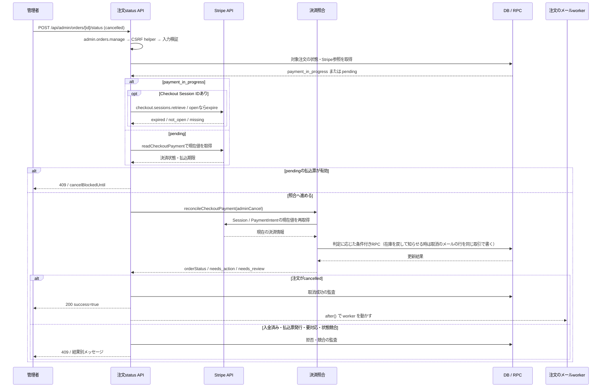
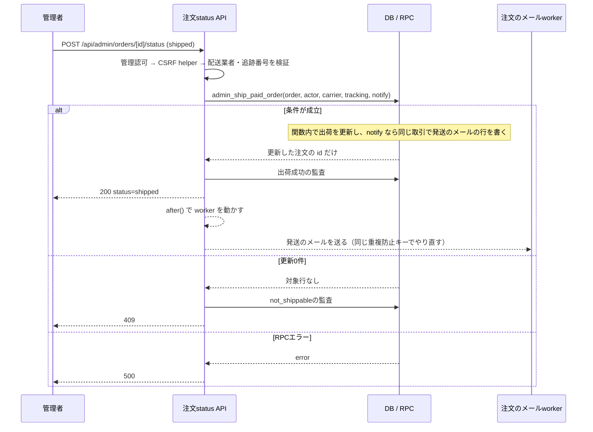
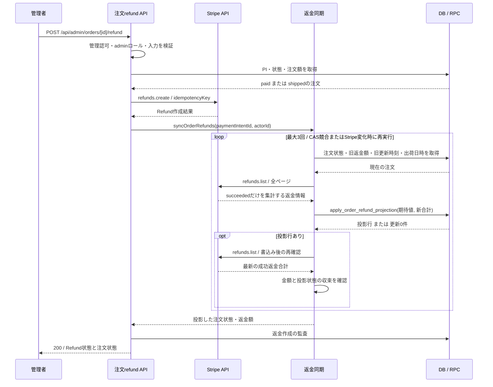
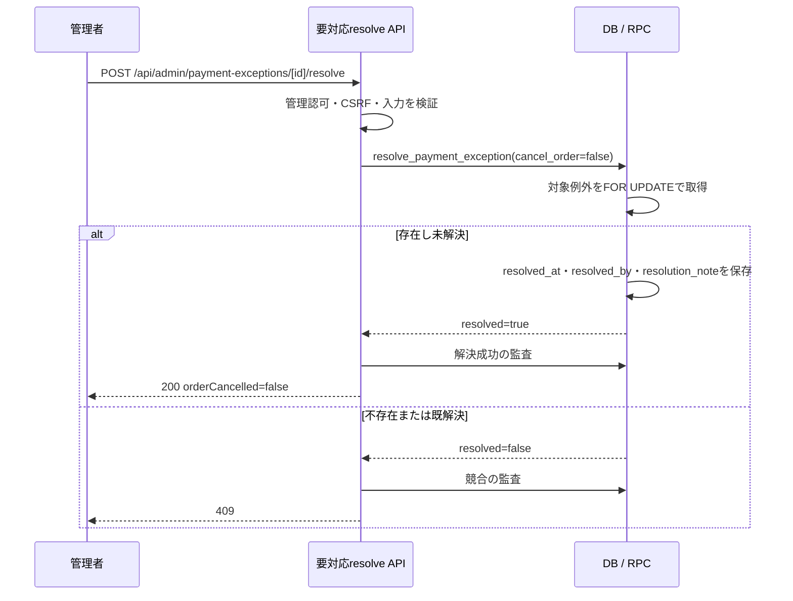
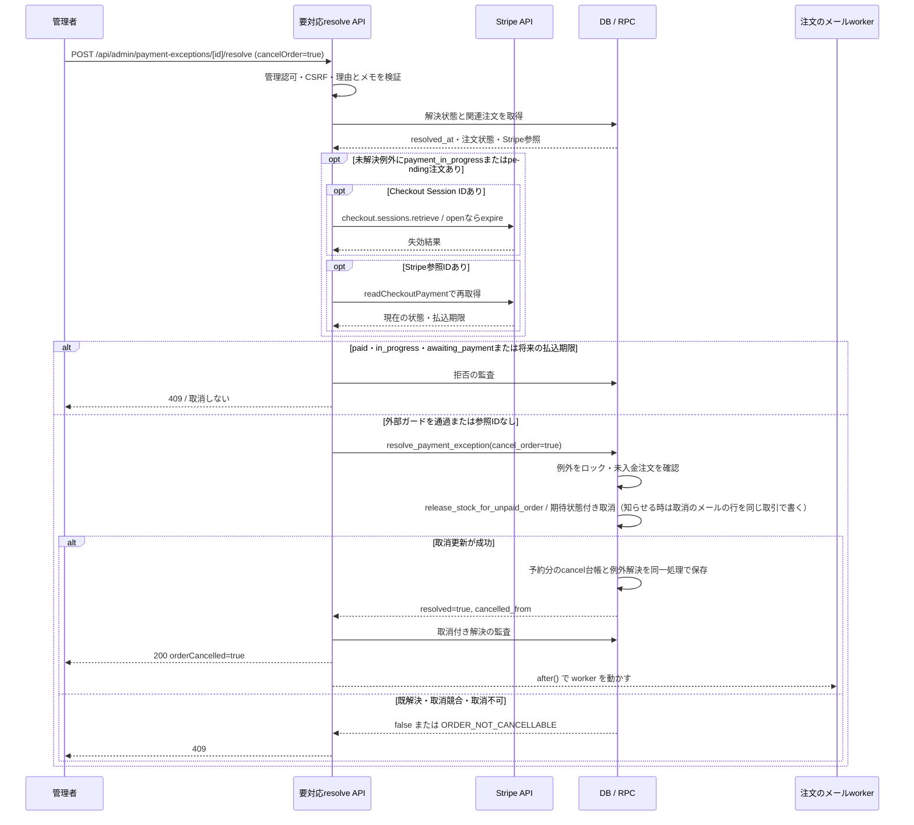

# 注文管理のシーケンス

> 状態: 現行ソース確認 | 確認日: 2026-10-04 | 対象: 未入金取消、出荷、管理返金、要対応の解決

## 概要

管理操作がAPIの認可、Stripeの確認、条件付きRPC、通知へ進む順序を示す。未入金注文の取消、成功返金による取消、要対応記録の解決は別の操作であり、保存結果も異なる。通常取消と取消付き解決ではStripeを確認するガードが異なるため、別シナリオとして記す。

図の粒度は[記載方針](README.md)、注文状態と独立属性は[注文・決済](../states/order-payment.md)、例外の状態は[決済の要対応](../states/payment-exception.md)を参照する。

## 範囲と根拠

対応領域は[ADMINの注文管理・要対応・要確認](../pages/16_admin.md)。管理者という参加者名は操作を行う利用者を示す。実際の許可条件は各APIの認可による。

| 境界・操作 | 実装根拠 |
| --- | --- |
| `POST /api/admin/orders/[id]/status`、取消・出荷 | [status API](../../../src/app/api/admin/orders/%5Bid%5D/status/route.ts) |
| `POST /api/admin/orders/[id]/refund`、`refunds.create` | [refund API](../../../src/app/api/admin/orders/%5Bid%5D/refund/route.ts) |
| `POST /api/admin/payment-exceptions/[id]/resolve` | [resolve API](../../../src/app/api/admin/payment-exceptions/%5Bid%5D/resolve/route.ts) |
| 管理認可 | [admin.orders.manage・セッション・AAL2確認](../../../src/lib/auth/admin-rbac.ts)。refund APIは追加でadminロールに限定。status/resolve APIは認可後に明示的なCSRF helperを呼ぶ |
| `checkout.sessions.retrieve/expire`と失効競合 | [Session失効](../../../src/lib/stripe/checkout-session-expiry.ts) |
| `checkout.sessions.retrieve/list`、`paymentIntents.retrieve`、照合判定・条件付き更新 | [Stripe読取り](../../../src/lib/stripe/checkout-payment-reader.ts)、[照合器](../../../src/lib/stripe/checkout-payment-reconciler.ts)、[判定表](../../../src/lib/stripe/checkout-payment-decision.ts)、[RPC接続](../../../src/lib/stripe/checkout-payment-reconciler-deps.ts) |
| 在庫解放と取消記録 | [注文IDによる在庫解放RPC](../../../supabase/migrations/20260927100200_release_stock_by_order.sql)、[台帳反映トリガー](../../../supabase/migrations/20260919065355_add_stock_movements.sql) |
| 出荷 | [移行 B の最新の発送RPC](../../../supabase/migrations/20261009120100_order_email_enqueue.sql)、[必須配送先判定](../../../supabase/migrations/20260925000218_add_order_state_transition_rpcs.sql) |
| 失敗注文の取消・例外解決 | [管理RPC](../../../supabase/migrations/20260927100500_payment_exceptions.sql)。取消メールの行を書く在庫解放関数は [移行 B](../../../supabase/migrations/20261009120100_order_email_enqueue.sql) |
| `refunds.list`、成功返金集計、CASと再確認 | [返金同期](../../../src/lib/stripe/order-refund-sync.ts)、[返金投影RPC](../../../supabase/migrations/20260925000218_add_order_state_transition_rpcs.sql) |
| 取消・出荷のメール | [送る予定の表](../../../supabase/migrations/20261009120000_order_email_outbox.sql)、[状態を変える関数](../../../supabase/migrations/20261009120100_order_email_enqueue.sql)、[worker](../../../src/lib/orders/email/order-email-worker.ts)、[中身](../../../src/lib/orders/email/order-email-compose.ts) |

status/resolve APIは管理認可の後、ID・本文の検証より先に`requireCsrfOrDeny`を呼び、戻り値がResponseならそのまま返して後続へ進まない。helperはrefresh Cookieがなければ検査不要として通し、Cookieがある場合のCSRFヘッダー欠落・hash不一致は403、例外は500。[CSRF helper](../../../src/lib/csrfMiddleware.ts)を参照。これはAPI独自のチェックであり、共通proxyのOrigin検査と別に行われる。

review APIも同じCSRF helperを呼ぶ。refund APIには明示的なCSRF helper呼出しがなく、共通[proxy](../../../src/proxy.ts)の状態変更APIに対するOrigin/Referer検査を通る。管理認可は検証済みJWT、セッションの有効性、DB ACLの対象権限、JWTの`aal2`を確認する。トークン不正・セッション失効は401、権限またはAAL2不足は403、セッション有効性を確認できない場合は503。refundの追加admin判定は検証済みJWTの`app_metadata.role`を使う。ACLのadmin権限だけでこの追加判定を代替する処理ではない。

### 関連する照会入口

| 入口 | 図・操作との対応と結果 | 根拠 |
| --- | --- | --- |
| `GET /api/admin/orders` | `admin.orders.read`とAAL2で注文一覧を読む。StripeのPIと未解決の金額不一致も参照し、canShip/canCancel/canRefund等の表示用属性を返す。状態変更はしない。操作時は各POSTが再検証する | [注文一覧](../../../src/app/api/admin/orders/route.ts) |
| `GET /api/admin/order-attention` | 同じread認可で未解決例外・未確認注文を各最大100件返し、件数も返す。canCancelOrderは注文状態に基づく表示用属性で、Stripeの取消ガード成功を示さない | [要対応・要確認一覧](../../../src/app/api/admin/order-attention/route.ts) |
| `GET /api/admin/orders/[id]/status` | 同じread認可でPOSTの説明とrequiredBodyを返す。対象注文の現在状態を取得・変更するAPIではない | [status API](../../../src/app/api/admin/orders/%5Bid%5D/status/route.ts) |
| `POST /api/cron/stripe-reconcile` | `CRON_SECRET`のBearer認証でPI・返金・会計・Payoutを照合する。管理認可とは別の入口で、返金不一致時には下記の共通投影も実行する | [照合API](../../../src/app/api/cron/stripe-reconcile/route.ts)、[Cron認証](../../../src/lib/cron/auth.ts)、[Webhook関連見回り](stripe-webhooks.md#関連する見回りとschedule) |

## SQ-ADMIN-01: 未入金注文の通常取消

目的は、未入金注文をStripeの現在値と突き合わせて取り消すこと。事前条件は管理認可・CSRF helper・入力検証を通り、対象がpayment_in_progressまたはpendingであること。終了結果は取消成功の200、取り消せない状態の409、一時的な確認失敗の503等。

### 例外と永続化

| 条件 | 結果・保存内容 |
| --- | --- |
| cancelled / paid / shipped / abandonedを先に取得 | cancelledは再度200。paid・shipped・abandonedは409で拒否し、通常取消のStripe確認へ進まない |
| failedを取得 | `admin_cancel_failed_order`へ分岐。actor・理由・必要なメモを保存してfailed→cancelled。追加在庫解放と取消メールなし。更新0件は409 |
| 有効な払込票 | pendingの事前読取りがawaiting_paymentなら409。時計が払込期限を過ぎたことだけで取り消さず、最後はStripeの状態を使う |
| Stripe確認中に入金・払込票発行 | 照合器がpaid/pendingへ合わせる場合がある。取消要求でも入金を優先し、APIは409を返す |
| 期限切れ・放棄とadminCancel | payment_in_progress/pendingを期待状態に、解放RPCがcancelledへ更新。purchase/cancel台帳の差から予約済み数量だけcancel台帳に戻す |
| 取消情報 | actor、reason、note、notifyCustomerを保存。otherなら空でないメモ、メモ500字以下。状態変更の履歴はorder_revisions |
| Stripe/DBの一時エラー / その他の例外 | 通常取消APIは503 / 500。成立済みのRPC更新まで一括で巻き戻す保証ではない |

照合器の条件付き更新0件は、Stripe・DBを読み直す契機であり取消成功ではない。最大3回で収束しない場合は一時エラー。根拠はstatus API、照合器、在庫解放RPC。

## SQ-ADMIN-02: 入金済み注文の出荷記録

目的は出荷情報を条件付きで保存し、通知を試みること。事前条件は管理認可・CSRF helper、配送業者・追跡番号の入力検証。終了結果はRPCで出荷記録が成立した200、条件不成立の409、RPC失敗の500。

RPCはpaid、shipped_atがNULL、氏名・メール・郵便番号・都道府県・市区町村・住所・電話の非空、未解決paid_amount_mismatchなしを条件にする。出荷日時・carrier・trackingを保存する。review_reasonの未確認自体は拒否条件に含まれない。`notifyCustomer` は真偽・既定 true。知らせる時は同じ取引で発送のメールの行を書き、返事の後に worker が送る。失敗はやり直し、送れなければ店へ知らせる。根拠は[管理RPC](../../../supabase/migrations/20261009120100_order_email_enqueue.sql)と[worker](../../../src/lib/orders/email/order-email-worker.ts)。

## SQ-ADMIN-03: 管理返金と成功返金の投影

目的はStripeへ返金を要求し、成功済み返金の最新合計を注文へ投影すること。事前条件はadmin.orders.manageに加えてadminロール、PI付きのpaid/shipped注文、正の返金額が指定される場合は注文額以下。終了結果は返金作成と投影結果の200。返金作成の応答だけで全額取消が確定するわけではない。

### 例外と永続化

| 条件 | 結果・保存内容 |
| --- | --- |
| 返金要求の冪等性 | APIは`admin-refund:注文ID:指定額またはfull`をキーにする。別の同額返金要求を識別する永続IDはこのAPIで作っていない |
| 返金要求の本文と金額 | amountは任意の正の整数で、指定時は注文総額以下を検査する。既返金額を引いた残額の事前検査は行わない。amount省略時はStripeへ未指定で渡す。JSON解析失敗は空objectとして扱い、既定reasonとamount未指定で進む。reasonは冪等キーに含まれない |
| pending / requires_action / failedのRefund | 成功返金合計へ加えない。新しいRefund作成と注文cancelledを同義にしない |
| 部分成功返金 / 全額成功返金 | 部分ならpaid/shipped維持。成功合計は注文額で上限化し、全額ならcancelledへ投影 |
| 返金再投影 | 全額返金由来cancelledで成功合計が減った場合、shipped_atありならshipped、なしならpaidへ戻す。旧返金額が全額未満の未入金由来cancelledは同期を行わず維持 |
| CAS | status・refunded_amount・payment_status_updated_atの旧値一致。更新0件、書込み後のStripe変化は再実行。3回で収束しなければ例外 |
| 保存範囲 | ordersの返金額・返金日時・支払状態更新時刻・statusと履歴。返金投影RPCはstock_movementsを変更せず、全額取消後も在庫を解放しない |
| Stripe作成後のDB同期失敗 | 既に作られたRefundをAPIが削除・巻き戻す処理はない。例外応答と外部返金結果を別に確認する必要がある |

同じ返金同期は[Webhookの返金イベント処理](stripe-webhooks.md)、[会計・返金照合](../../../src/app/api/cron/stripe-reconcile/route.ts)、[共通決済照合器](../../../src/lib/stripe/checkout-payment-reconciler.ts)からも呼ばれる。共通照合器ではnone判定、paid/shipped注文、Stripe paid、正の返金額、PIありの場合に同期し、返すorderStatusも同期後の値にする。注文作成・入金更新後の読み直しでもこの経路を通るため、先着して注文なしで省略された返金イベントの反映も補う。返金イベント内の額を加算する処理ではない。

注文なし・snapshotに下書きIDありで受取額全額が返金済みのpaidなら、判定表は`record_only:refunded_before_order`を選び注文を作らない。既存注文の入金更新で金額・通貨が一致する場合も、全額返金済みなら注文確認メールを送らず、後続の返金同期で取消へ投影する。共通照合器の返金接続はStripe・DBの一時エラーと返金投影の未収束を`ReconcileTransientError`へ分類する。管理取消経路では503、workerではfailと502、見回りでは個別失敗として扱う。根拠は[判定表](../../../src/lib/stripe/checkout-payment-decision.ts)、[返金接続](../../../src/lib/stripe/checkout-payment-reconciler-deps.ts)と各呼出し元。

共通同期でPIに対応する注文がなければOrderNotFoundForPaymentIntentErrorとなり、返金一覧と投影RPCへ進まない。Webhook processorはこの型だけを捕捉して監査後に後段処理へ進む。管理返金API・会計照合の呼出し元に同じ捕捉はない。差分の確認範囲は[Webhookの未確認事項](stripe-webhooks.md#未確認事項)を参照する。

## SQ-ADMIN-04: 要対応記録を解決済みにする

目的は人による対応完了の記録。事前条件は管理認可、CSRF検証、UUID・本文検証を通り、cancelOrder=falseであること。終了結果は解決済みの200、不存在・既解決等の409、RPC失敗の500。Stripe操作、返金、注文取消は実行しない。

解決済みの再検出は検出回数・最終時刻を更新するが未解決には戻さない。メモは任意で最大500字。未解決paid_amount_mismatchを解決すると出荷RPCのその拒否条件がなくなるが、解決記録自体はStripeの金額訂正をしない。根拠は[resolve API](../../../src/app/api/admin/payment-exceptions/%5Bid%5D/resolve/route.ts)と[例外RPC](../../../supabase/migrations/20260927100500_payment_exceptions.sql)。

## SQ-ADMIN-05: 未入金注文を取り消して要対応を解決する

目的は、関連する未入金注文の取消と要対応の解決を同一DB処理で記録すること。事前条件は管理認可・CSRF検証・入力検証、cancelOrder=true、取消理由と空でないメモ。終了結果は取消と解決の200、Stripeが入金可能・状態競合等なら409、一時的な外部確認失敗は503。

### 通常取消とのガード差と永続化

| 条件 | SQ-ADMIN-01 通常取消 | SQ-ADMIN-05 取消付き解決 |
| --- | --- | --- |
| 外部確認の対象 | payment_in_progressはSession失効後に照合。pendingは事前Stripe読取り後に照合 | 未解決例外の関連注文がpayment_in_progress/pendingなら、状態を問わずSession失効を先に試みて再読取り |
| 外部参照なし | 照合器の必須参照に達しなければ例外応答 | Stripe確認を省略し、DB RPCへ進める |
| 想定外・missing・0円完了等 | 注文ありなら照合器が要対応を記録し、取消APIは409となる場合がある | paid/in_progress/awaiting_paymentや将来の払込期限でなければ、DBの未入金条件に従い取消を試みる |
| 判断と更新主体 | Stripe現在値を照合器で分類して、必要な注文RPCを呼ぶ | APIの外部ガード後、resolve RPCがrelease RPCを呼び、取消成功時だけ例外を解決 |
| メモ | otherの場合に必須 | 取消理由にかかわらず必須 |
| 不存在・既解決・未入金以外 | 注文status APIの分岐と照合による | RPCが拒否。解決済み等の事前読取りではStripe操作を省略する |

APIが外部確認に失敗すればRPCへ進まない。DB側では例外行をロックし、関連注文がpayment_in_progress/pendingであることを確認する。在庫解放の条件付き更新0件なら例外を解決せずfalse。外部Stripe確認とDB更新は同一トランザクションには含まれない。根拠はresolve APIのcheckStripeBeforeCancel・refuseIfStripeMayTakeMoneyと、[resolve RPC](../../../supabase/migrations/20260927100500_payment_exceptions.sql)。

## 通知・履歴・要確認の別軸

| 項目 | 現行処理 |
| --- | --- |
| 取消・発送のメール | 取消・発送のメールは、状態を変える関数が同じ取引で送る予定の行を書き、worker が行の番号から作った重複防止キーで送る。失敗はやり直し、送れなければ店へ知らせる（FREQ-434・435） |
| 発送の選択 | `notifyCustomer`（真偽、既定 true）が false なら発送のメールの行を書かない（FREQ-438） |
| 履歴 | RPCがactor・理由を設定し、order_revisionsに変更前後・変更列等を記録する。返金ではrefund_update、状態変更ではstatus_update等として記録 |
| 要確認 | [review API](../../../src/app/api/admin/orders/%5Bid%5D/review/route.ts)は管理認可・CSRF後にmark_order_reviewed。review_reasonあり・reviewed_atなしを条件にreviewed_at/byを保存し、reasonを消さない。要対応resolveとは別操作 |
| API応答と外部副作用 | 先行RPCやStripeの成功後に後続処理が失敗する場合がある。応答コードだけから取消・返金・メールの全結果を判断しない |

根拠: [worker](../../../src/lib/orders/email/order-email-worker.ts)、[中身](../../../src/lib/orders/email/order-email-compose.ts)、[履歴トリガー](../../../supabase/migrations/20260925000218_add_order_state_transition_rpcs.sql)、[状態の履歴](../../../supabase/migrations/20261009120000_order_email_outbox.sql#L606)、[要確認RPC](../../../supabase/migrations/20260927100500_payment_exceptions.sql)。

## 関連テスト

| 観点 | 参照 |
| --- | --- |
| 出荷・通常取消・競合 | [status API](../../../tests/unit/api/admin/order-status-shipped.test.ts)、[在庫解放RPC](../../../tests/integration/db/release_stock_by_order.integration.test.ts) |
| 管理返金・成功返金のみの投影 | [refund API](../../../tests/unit/api/admin/order-refund-route.test.ts)、[返金同期](../../../tests/unit/lib/stripe/order-refund-sync.test.ts) |
| 解決・取消前のStripe確認・要確認 | [要対応API](../../../tests/unit/api/admin/order-attention-route.test.ts)、[例外RPC](../../../tests/integration/db/payment_exceptions.integration.test.ts) |
| 注文のメール | [中身](../../../tests/unit/lib/orders/email/order-email-compose.test.ts)、[worker](../../../tests/unit/lib/orders/email/order-email-worker.test.ts)、[送る予定の表](../../../tests/integration/db/order_email_outbox.integration.test.ts)、[行を書く関数](../../../tests/integration/db/order_email_enqueue.integration.test.ts) |

関連テストは今回実行していない。DBや外部決済を操作した成功証跡ではない。

## 未確認事項

本番のRPC・トリガー・権限適用、実際の管理者ACL、Stripeの入金・返金結果、外部確認とDB更新の競合、メール到達は未確認。[pendingの状態強制](../../../supabase/pending/harden_order_state_transitions.sql)は実適用を確認せずに有効と断定しない。SQLコメントの計画と現行APIの呼出し経路を区別する。

最終照合のコード基準はmasterの`bbb18761`と、2026-10-04の作業ツリーにある決済・返金ライブラリの未コミット変更。取消・出荷のCSRF前段ガードと、返金同期の呼出し元・全額返金の扱いを静的に確認した。今回、コードの実行テストと本番反映は確認していない。
