# 注文管理のシーケンス

> 返品の受け取りの数え方の直し 確認日: 2026-11-08。末尾の「返品の受け取りの品ごとの返金（FREQ-641 Task 1）」に、空きの単位を1列で使う数え方と `consult_quantity` の1項目を足した（I-1・N-1）。移行 `20261108120000` は手元で確認・本番は未適用（オーナーの許可待ち）。

> 返品の品ごとの返金 Task 1 確認日: 2026-11-06。受け取りで品ごとに今返す・相談するを選ぶ時の DB の中の流れを、末尾の「返品の受け取りの品ごとの返金（FREQ-641 Task 1）」に足した。移行 `20261106005536` は手元で確認・本番は 2026-11-06 に適用済み。窓口は Task 2、画面は Task 3 で実装済み。実測は[テスト仕様](../../05_Quality/tests/test-spec.md)を参照。

> G-4 Task 8 確認日: 2026-10-27。荷作り表・発送票の注文番号から注文の詳細へ移る流れ（SQ-ADMIN-15 の入口）を追記し、履歴の dialog（`OrderHistoryDialog`）の撤去と、G-1 から 410 だけを返していた旧い発送・仕上がりの窓口 6 ファイル・7 メソッドの削除を、各節の注記に反映した。単体のみ実測済み（jest・tsc・lint）。DB・ブラウザ・E2Eはcontroller担当。

> G-4 Task 7 確認日: 2026-10-26。旧い一覧の窓口 GET /api/admin/orders を削除し、一覧は GET /api/admin/order-items、要対応の欄の操作は一覧の頁（hook useOrderAttention）に移した。ORDER タブは注文一覧表への入口だけ。単体のみ実測済み（jest・tsc・lint）。DB・ブラウザ・E2Eはcontroller担当。

> G-4 Task 6 確認日: 2026-10-26。詳細の頁からの操作と読み直しの流れを末尾の SQ-ADMIN-15 に追加した。単体のみ実測済み（jest・tsc・lint）。DB・ブラウザ・E2Eはcontroller担当。

> G-4 Task 3 確認日: 2026-10-26。共有文書はPhase Bで反映済み。controller受領記録（g4t3a）: fresh reset後、実鍵のgroup_g4_postgrest_pathsを含むgroup_g*全51 suiteで1,616成功・0失敗・1 pending（G1_CLEANUP_SUITE=1で単独実行するG-1清掃の未起動）。 全件の確認は controller が後で実施。

> G-4 Task 2 確認日: 2026-10-26。初回（g4t2a）: controllerのfresh reset後、PostgREST anon/authenticated各200、group_g* 50 suite・1,606成功・0失敗・1 pending（G1_CLEANUP_SUITE=1専用清掃の未起動）。修正round 1後（g4t2b）: controllerのfresh reset・PostgREST anon/authenticated各200、group_g* 50 suite・1,611成功・0失敗・1 pending（G1_CLEANUP_SUITE=1専用清掃の未起動）。unit＋全DB integrationは19,935成功・既知stockist_rlsの2失敗のみ（新規失敗なし）、G-0清掃12/12。本番未適用。

> 状態: 現行ソース確認（発送の節はグループ E-1 の変更を 2026-10-10 に、返金・支払い済みのキャンセル・取り込みと見回り・自動の返金の節はグループ E-2 の変更を 2026-10-11 に、返品を作る・受け取る・額を決めて返金する節はグループ E-3 の変更を 2026-10-13 に反映） | 確認日: 2026-10-04 | 対象: 未入金取消、発送（一部の発送・仕上がり・取消を含む）、管理返金と支払い済みのキャンセル、Stripe の返金の取り込みと見回り、自動の返金、返品（作る・受け取る・額を決めて返金する）、要対応の解決

## 概要

管理操作がAPIの認可、Stripeの確認、条件付きRPC、通知へ進む順序を示す。未入金注文の取消、返金（支払い済みのキャンセルを含む）による取消、要対応記録の解決は別の操作であり、保存結果も異なる。通常取消と取消付き解決ではStripeを確認するガードが異なるため、別シナリオとして記す。返品（グループ E-3）は、作る・受け取る（今返金なら Stripe に頼む）・額を決めて返金するの3つを SQ-ADMIN-09〜11 に分けて記す。受け取りと返金は、E-2 の「記録を先に作り、Stripe に頼み、結果を書く」に乗る。E-3 段2の写真の確認と申し込み・承認・お断り・キャンセルの申し込みの解決は SQ-ADMIN-12〜14。

図の粒度は[記載方針](README.md)、注文状態と独立属性は[注文・決済](../states/order-payment.md)、例外の状態は[決済の要対応](../states/payment-exception.md)を参照する。

## 範囲と根拠

### 一覧・CSV・詳細・管理履歴の窓口（G-4 Task 3）

新しい3つの窓口と既存の管理履歴は `admin.orders.read` を最初に確認する。actorは認可結果の `userId` だけから渡し、応答は `Cache-Control: no-store`。DBのエラーはmessageとSQLSTATEが両方一致する時だけ固定の業務エラーにし、未知の失敗と不正な戻り値は固定の500にする。

| 窓口 | 処理と応答 |
| --- | --- |
| `GET /api/admin/order-items` | 認可→問合せ検証→`list_admin_order_item_rows`。20行、頁1〜100000。`data`は行/総行数/注文数/頁/`ordersCapped`/`ordersCap`を持つ。上限で切った空行も200。既存の返品とキャンセル申請の件数を添える |
| `GET /api/admin/order-items/export` | 認可→IP→actorの回数制限（`admin.orders.export`、20回/600秒）→問合せ検証→`export_admin_order_item_rows`→CSV→監査。GETなのでCSRF検証なし。`page`は受けず400。全行を1つのjsonbで受け取り、件数と配列長を照合する。20,000行超だけ422 |
| `GET /api/admin/orders/[id]` | 認可→UUID検証→core/旧一覧のsummary/発送/票リンク/配送の記録を並行読取。`data`に`summary`・`order`・`amounts`・状態別`rows`・`attention`・`permissions`・`fulfillments`・`slips`を返す。不在は`GROUP_G_ORDER_NOT_FOUND`の404 |
| `GET /api/admin/orders/[id]/history` | 既存の状態/メール/発送/返金/返品/申請の履歴に`itemStates`・`itemStatesTruncated`を追加。品物履歴だけ失敗した時は空配列と`itemStatesFailed: true`を添え、既存の履歴を返す |

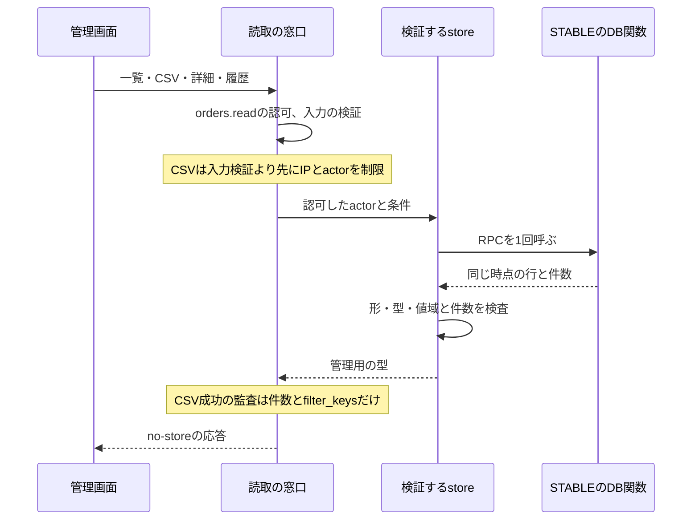
```mermaid
sequenceDiagram
    participant Caller as 管理画面
    participant Route as 読取の窓口
    participant Store as 検証するstore
    participant DB as STABLEのDB関数
    Caller->>Route: 一覧・CSV・詳細・履歴
    Route->>Route: orders.readの認可、入力の検証
    Note over Route: CSVは入力検証より先にIPとactorを制限
    Route->>Store: 認可したactorと条件
    Store->>DB: RPCを1回呼ぶ
    DB-->>Store: 同じ時点の行と件数
    Store->>Store: 形・型・値域と件数を検査
    Store-->>Route: 管理用の型
    Note over Route: CSV成功の監査は件数とfilter_keysだけ
    Route-->>Caller: no-storeの応答
```

CSVは画面と共通の12列、UTF-8 BOM、全セルの引用符、引用符の二重化、セル内改行の保持、末尾を含むCRLF。注文番号は`ORD-XXXXXXXX`、日付とファイル名は日本時間。文字セルの先頭`= + - @`・タブ・CR・LFには`'`を1つ足し、数値は整数のまま。監査の`admin.orders.export`は成功時に`row_count`・`order_count`・条件名だけの`filter_keys`を記録し、失敗時は固定の結果コードだけを記録する。検索語を残さない。

詳細の発送は既存`listOrderFulfillments`の公開欄と配送読取の配達時刻に、同じ票読取のMapから`slipId`・`slipNumber`を添えた9欄。票に属さない発送、`admin.shipping.read`不足、票の読取失敗では発送ごとの2欄はnullで、票一覧も不足/失敗時はnull。配送だけの読取失敗では各発送の`deliveredAt`をnullにして詳細は返す。補助読取の失敗ログは名前とcodeだけにし、票の権限不足は記録しない。品物履歴は301行目を検出して300行を返し、人のメールは同じ依頼内で1人1回だけ既存の解決関数から引く。理由の34値・商品名・自動判定・票/発注の参照・入替の相手と理由は純粋な共通関数で作る。

旧`GET /api/admin/orders`は、組立てを`buildAdminOrderSummaries`へ移した上でTask 7で削除した（移設した組立ての期待は旧集計の単体で確かめる）。5分のPaymentIntentキャッシュ、返金/返品/配送の要約、行数量、取消判定、住所不足を維持する。PIIを含みうる生のStripe例外は意図的に記録せず、固定の診断Errorにtype/codeだけを写す。HTTP/summary/キャッシュの値は保つ。客向けの応答とメールは変更せず、履歴の純粋な型への任意欄の追加だけを行う。

実装: [store](../../../src/lib/orders/admin-orders/admin-order-store.ts)、[CSV](../../../src/lib/orders/admin-orders/admin-order-csv.ts)、[旧集計](../../../src/lib/orders/admin-orders/admin-order-summary.ts)。検証: [store単体](../../../tests/unit/lib/orders/admin-orders/admin-order-store.test.ts)、[旧集計](../../../tests/unit/lib/orders/admin-orders/admin-order-summary.test.ts)、[管理履歴](../../../tests/unit/api/admin/order-history-route.test.ts)、[controller用PostgREST](../../../tests/integration/db/group_g4_postgrest_paths.integration.test.ts)。単体・型・lintとDB/PostgRESTの証明は別に扱う。

### 一覧・CSV材料・詳細・状態履歴の読取（G-4 Task 2）

[読取移行](../../../supabase/migrations/20261026054705_group_g4_orders_reads.sql) と [DB試験](../../../tests/integration/db/group_g4_reads.integration.test.ts) は作成済み、初回（g4t2a）: controllerのfresh reset後、PostgREST anon/authenticated各200、group_g* 50 suite・1,606成功・0失敗・1 pending（G1_CLEANUP_SUITE=1専用清掃の未起動）。修正round 1後（g4t2b）: controllerのfresh reset・PostgREST anon/authenticated各200、group_g* 50 suite・1,611成功・0失敗・1 pending（G1_CLEANUP_SUITE=1専用清掃の未起動）。unit＋全DB integrationは19,935成功・既知stockist_rlsの2失敗のみ（新規失敗なし）、G-0清掃12/12。本番未適用。ここで追加するのはDB読取だけで、窓口・CSV整形・詳細画面の移設は後続Task。既存の客向け投影・メール・G-1の状態投影は変更しない。

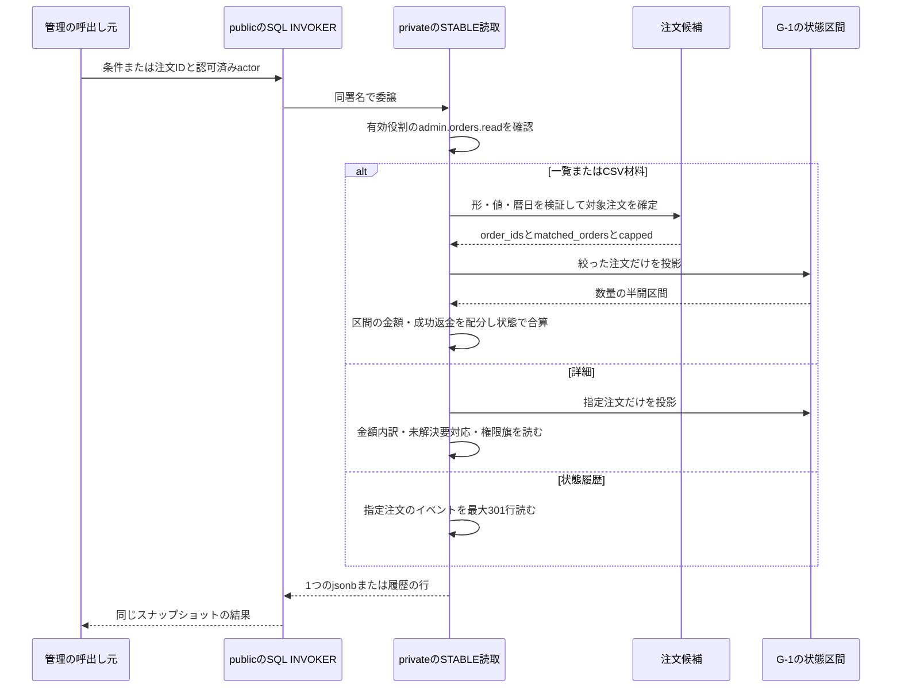
```mermaid
sequenceDiagram
    participant Caller as 管理の呼出し元
    participant RPC as publicのSQL INVOKER
    participant Core as privateのSTABLE読取
    participant Candidates as 注文候補
    participant Projection as G-1の状態区間
    Caller->>RPC: 条件または注文IDと認可済みactor
    RPC->>Core: 同署名で委譲
    Core->>Core: 有効役割のadmin.orders.readを確認
    alt 一覧またはCSV材料
        Core->>Candidates: 形・値・暦日を検証して対象注文を確定
        Candidates-->>Core: order_idsとmatched_ordersとcapped
        Core->>Projection: 絞った注文だけを投影
        Projection-->>Core: 数量の半開区間
        Core->>Core: 区間の金額・成功返金を配分し状態で合算
    else 詳細
        Core->>Projection: 指定注文だけを投影
        Core->>Core: 金額内訳・未解決要対応・権限旗を読む
    else 状態履歴
        Core->>Core: 指定注文のイベントを最大301行読む
    end
    Core-->>RPC: 1つのjsonbまたは履歴の行
    RPC-->>Caller: 同じスナップショットの結果
```

読取はadvisoryを取らず、外部I/Oと書込みを行わない。public/privateの4本ともservice_roleだけにEXECUTE、内部3本は呼出権限なし。actorは呼出し元の認可済みuserIdを渡す契約で、DBは毎回有効・期限内の全役割の権限の和集合を確認する。

| 読取 | 処理・限界 |
| --- | --- |
| `list_admin_order_item_rows(jsonb,integer,integer,uuid)` | 新しい5000注文までを候補にし、商品/色/サイズ/状態を行単位で絞る。ordersCapped・ordersCapは0行でも返す。totalRowsとtotalOrdersは頁で切る前。limit 1〜100、offset 0以上 |
| `export_admin_order_item_rows(jsonb,uuid)` | 一覧capと独立し全行を1つのjsonbで返す。rowCount・orderCount・rows。20000行超、または候補注文がcap超なら全件を断る。注文cap超では投影しない。needsAttention・blockedReasonsは含めない |
| `get_admin_order_detail(uuid,uuid)` | order（購入者・配送先を含む）・amounts・状態別rows・attention・permissions。payment_in_progress/abandonedはrowsが空。productNetはorder明細の正味額、行返金は成功商品返金だけ、送料と負を含む調整額は成功ヘッダから直接合算 |
| `list_admin_order_item_state_history(uuid,uuid)` | 注文の明細イベントだけをcreated_at DESC→idで最大301行。callerは300行に切り、301行目でtruncatedを判断する。actor NULLは自動。発送票と発注書には番号、allocation_swapには理由と相手注文IDを付ける |

絞り込みはdateFrom/dateTo（日本時間YYYY-MM-DD、開始≦終了）、orderNumber、customer、email、product、color、size、statuses（12状態から0〜12個）、attention（boolean）だけ。attention=trueは未解決の要対応がある注文だけに絞る。attention=falseと未指定は要対応による絞り込みをしない（一覧・CSV共通）。語はtrim後1〜200字、部分一致はILIKEでバックスラッシュ・%・_をエスケープする。注文IDが `^pi_[A-Za-z0-9_]{1,197}$` に大小を問わず合う時は決済IDの前方一致、それ以外はORD-を除いた16進とハイフンの注文UUID前方一致。商品条件は同じ明細が全条件に合う注文を候補にし、行でも同じ条件を当てる。要対応は未解決のpayment_exceptions、未確認review、発送の未解決attentionのどれか。

並びは注文日DESC→order_id→order_item_id→status_rank→最初の区間。rankはunpaid(1)からreturned(12)まで既存の管理用の定義順。商品額と返金の式・交換品の裁定は [データ設計](../../03_BasicDesign/data/er.md) のG4B節のとおり。処理中と失敗の返金は行に付けない。

capの試験設定は `app.group_g_list_cap_orders` と `app.group_g_export_cap_rows`。取引内SET LOCALで既定より下げる場合だけ効き、空・不正整数・0以下・上げる値は既定5000/20000として扱う。エラーは引数不正 `GROUP_G_ARGUMENT_INVALID / 22023`、権限なし `GROUP_G_FORBIDDEN / 42501`、詳細/履歴の注文不在 `GROUP_G_ORDER_NOT_FOUND / P0002`、CSV上限 `GROUP_G_EXPORT_TOO_LARGE / 22023`。検索語・顧客情報・生のDBエラーはログや報告へ出さない。

対応領域は[ADMINの注文管理・要対応・要確認](../pages/16_admin.md)。管理者という参加者名は操作を行う利用者を示す。実際の許可条件は各APIの認可による。

| 境界・操作 | 実装根拠 |
| --- | --- |
| `POST /api/admin/orders/[id]/status`、未入金の取消と支払い済みのキャンセル | [status API](../../../src/app/api/admin/orders/%5Bid%5D/status/route.ts) |
| `GET`・`POST /api/admin/orders/[id]/fulfillments`、発送の取消 `…/fulfillments/[fulfillmentId]/cancel` | G-4 Task 8 で route ごと撤去した（発送は発送票の窓口。[発送票の流れ](shipping.md)） |
| `POST /api/admin/orders/[id]/completions`、仕上がりの取消 `…/completions/[completionId]/cancel` | G-4 Task 8 で route ごと撤去した（手動の仕上がりは G-1 で終了。品物は在庫の入荷から FIFO で自動に割り当てる） |
| `GET`・`POST /api/admin/orders/[id]/refund`、返事待ちの確かめ直し `…/refund/confirm`、`refunds.create` | [refund API](../../../src/app/api/admin/orders/%5Bid%5D/refund/route.ts)、[確かめ直しAPI](../../../src/app/api/admin/orders/%5Bid%5D/refund/confirm/route.ts)、[返金の流れ](../../../src/lib/orders/refund/refund-service.ts)、[Stripe への頼み方](../../../src/lib/orders/refund/refund-stripe.ts) |
| `GET`・`POST /api/admin/orders/[id]/returns`、`GET …/returns/materials`、`POST /api/admin/returns/[returnId]/{receive,refund,cancel,reopen,close-missing,inspect,fee-payment,release-exchange}` | [返品の一覧と作る API](../../../src/app/api/admin/orders/%5Bid%5D/returns/route.ts)、[作る画面の材料 API](../../../src/app/api/admin/orders/%5Bid%5D/returns/materials/route.ts)、[受け取り API](../../../src/app/api/admin/returns/%5BreturnId%5D/receive/route.ts)、[額を決めて返金する API](../../../src/app/api/admin/returns/%5BreturnId%5D/refund/route.ts)、[返品の流れ](../../../src/lib/orders/returns/return-service.ts)、[返品の DB の呼び出し](../../../src/lib/orders/returns/return-store.ts) |
| `POST /api/admin/payment-exceptions/[id]/resolve` | [resolve API](../../../src/app/api/admin/payment-exceptions/%5Bid%5D/resolve/route.ts) |
| 管理認可 | [admin.orders.manage・admin.orders.refund・admin.orders.return・admin.settings.manage・セッション・AAL2確認](../../../src/lib/auth/admin-rbac.ts)。返金と確かめ直しは `admin.orders.refund`、支払い済みのキャンセルは `admin.orders.manage` と `admin.orders.refund` の両方（店長だけ）。返品の窓口は `admin.orders.return`（店長とサポート）で、返金に関わる操作（受け取りの今返金（お客様の申し込みで返送不要でない返品の計算どおりの場合を除く）・額の指定・送料・交換の選び直し、額を決めて返金する、手数料の受け取りの記録、支払いを待たずに送る）は `admin.orders.return` と `admin.orders.refund` の両方（店長だけ。グループ E-3）。サポートは、お客様の申し込みで返送不要でない返品の計算どおりの今返金だけ `admin.orders.return` で行える（グループ E-3 段2）。status/resolve/refund/refund confirm APIは認可後に明示的なCSRF helperを呼ぶ |
| `checkout.sessions.retrieve/expire`と失効競合 | [Session失効](../../../src/lib/stripe/checkout-session-expiry.ts) |
| `checkout.sessions.retrieve/list`、`paymentIntents.retrieve`、照合判定・条件付き更新 | [Stripe読取り](../../../src/lib/stripe/checkout-payment-reader.ts)、[照合器](../../../src/lib/stripe/checkout-payment-reconciler.ts)、[判定表](../../../src/lib/stripe/checkout-payment-decision.ts)、[RPC接続](../../../src/lib/stripe/checkout-payment-reconciler-deps.ts) |
| 在庫解放と取消記録 | [注文IDによる在庫解放RPC](../../../supabase/migrations/20260927100200_release_stock_by_order.sql)、[台帳反映トリガー](../../../supabase/migrations/20260919065355_add_stock_movements.sql) |
| 発送・仕上がり | [E-1 移行 A: 商品ごとの数と仕上がりの関数](../../../supabase/migrations/20261010120303_order_fulfillments.sql)、[E-1 移行 B: 発送・発送の取消の関数](../../../supabase/migrations/20261010122320_fulfillment_order_emails.sql)、[必須配送先判定](../../../supabase/migrations/20260925000218_add_order_state_transition_rpcs.sql) |
| 失敗注文の取消・例外解決 | [管理RPC](../../../supabase/migrations/20260927100500_payment_exceptions.sql)。取消メールの行を書く在庫解放関数は [移行 B](../../../supabase/migrations/20261009095736_order_email_enqueue.sql) |
| `refunds.list`（その支払いの返金を全ページ）、1件ずつの取り込みと読み直し、毎時の見回り、毎晩の照合 | [返金の取り込み](../../../src/lib/stripe/order-refund-sync.ts)、[毎時の見回り](../../../src/lib/orders/refund/refund-sweep.ts)、[毎晩の照合](../../../src/lib/stripe/reconcile-orders.ts) |
| 返金の記録・返金を始める関数・結果を書く関数・外からの返金の記録 | [E-2 移行 A: 表と数え方](../../../supabase/migrations/20261011222930_order_refund_records.sql)、[E-2 移行 B: 始める・材料](../../../supabase/migrations/20261011223147_order_refund_requests.sql)、[E-2 移行 C: 結果を書く・外からの返金・メールの行](../../../supabase/migrations/20261011223453_order_refund_results.sql) |
| 返品の記録・返品を作る関数・受け取り・額を決めて返金する関数 | [E-3 移行 A: 表と数え方](../../../supabase/migrations/20261012235910_order_return_records.sql)、[E-3 移行 B: 作る・取り消す・開き直す・届かないで終える・検品・手数料・読み出し](../../../supabase/migrations/20261013000456_order_return_actions.sql)、[E-3 移行 C: 受け取り・額を決めて返金・返金を始める本体の切り出し・メールの予定](../../../supabase/migrations/20261013001143_order_return_receipts.sql) |
| 自動の返金①②とショップの設定 | [決済照合器](../../../src/lib/stripe/checkout-payment-reconciler.ts)、[設定API](../../../src/app/api/admin/settings/shop/route.ts) |
| 取消・発送・返金のメール（発送は発送ごとに、返金は返金ごとに1通） | [送る予定の表](../../../supabase/migrations/20261009095633_order_email_outbox.sql)、[状態を変える関数](../../../supabase/migrations/20261009095736_order_email_enqueue.sql)、[発送ごとのメールの行](../../../supabase/migrations/20261010122320_fulfillment_order_emails.sql)、[返金ごとのメールの行](../../../supabase/migrations/20261011223453_order_refund_results.sql)、[worker](../../../src/lib/orders/email/order-email-worker.ts)、[中身](../../../src/lib/orders/email/order-email-compose.ts) |

status/resolve APIは管理認可の後、ID・本文の検証より先に`requireCsrfOrDeny`を呼び、戻り値がResponseならそのまま返して後続へ進まない。helperはrefresh Cookieがなければ検査不要として通し、Cookieがある場合のCSRFヘッダー欠落・hash不一致は403、例外は500。[CSRF helper](../../../src/lib/csrfMiddleware.ts)を参照。これはAPI独自のチェックであり、共通proxyのOrigin検査と別に行われる。発送・仕上がりのAPI（`fulfillments`・`completions`）は、管理認可（`admin.orders.manage`）→ CSRF helper → 回数の制限（送信元ごと・管理者ごと）→ 注文の番号の検証 → 本文の検証の順で、先に断った段階で後ろへ進まない（[メールの再送API](../../../src/app/api/admin/orders/%5Bid%5D/emails/resend/route.ts)と同じ形）。ただし発送の材料を読む `GET …/fulfillments` は、管理認可（`admin.orders.manage`）の後に注文の番号を検証するだけで、CSRF と回数の制限は通さない（読むだけで、状態を変えないため）。

review APIも同じCSRF helperを呼ぶ。refund API（返金と確かめ直し）とショップの設定のPUTも、E-2から同じCSRF helperを呼び、管理認可（`admin.orders.refund`・`admin.settings.manage`）→ CSRF helper → 回数の制限（送信元ごと・管理者ごと）→（注文の窓口だけ）注文の番号の検証 → 本文の検証の順で、先に断った段階で後ろへ進まない。支払い済みのキャンセルは、status APIの中で注文が`paid`と分かってから`admin.orders.refund`を確かめる（未入金の取消はサポートの人もできるまま）。管理認可は検証済みJWT、セッションの有効性、DB ACLの対象権限、JWTの`aal2`を確認する。トークン不正・セッション失効は401、権限またはAAL2不足は403、セッション有効性を確認できない場合は503。返金の権限は、検証済みJWTの`app_metadata.role`ではなく、DBの権限`admin.orders.refund`（店長の役割だけに付ける）で確かめる（グループE-2。以前の追加admin判定はやめた）。

返品の窓口（グループE-3）も同じ順に断る。管理認可（`admin.orders.return`。返金に関わる操作は`admin.orders.refund`も）→ CSRF helper → 回数の制限（送信元ごと・管理者ごと。作る・受け取る・額を決めて返金するは10分に30回、取消・開き直し・届かないで終える・検品・手数料の受け取りの記録・支払いを待たずに送るは10分に60回）→ 注文または返品の番号の検証 → 本文の検証。読む`GET …/returns`・`GET …/returns/materials`は、管理認可の後に注文の番号を検証するだけで、CSRFと回数の制限は通さない（読むだけで、状態を変えないため）。受け取りでは、`admin.orders.refund`を持たない人（サポート）の呼び出しを窓口が`_actor_can_refund = false`としてDBの関数へ渡す。額・送料・交換の選び直しは窓口が先に`RETURN_FORBIDDEN`で断り、今返金は窓口で断らずDBが決める（お客様の申し込み`source = 'customer_request'`で返送不要でない返品の計算どおりだけ許し、ほかは`RETURN_FORBIDDEN`）。DBの関数は呼んだ人の権限そのものは確かめない（E-1・E-2と同じ。サポートかどうかの印`_actor_can_refund`を信用する）。

### 関連する照会入口

| 入口 | 図・操作との対応と結果 | 根拠 |
| --- | --- | --- |
| `GET /api/admin/order-attention` | 同じread認可で未解決例外・未確認注文を各最大100件返し、件数も返す。canCancelOrderは注文状態に基づく表示用属性で、Stripeの取消ガード成功を示さない。「返金の失敗」の行には、「もう一度返金する」を出せるか（canRetryRefund。注文の返せる額が0より多い）と、細目（refundFailure: 返金の額・失敗の理由の言葉・確保し直せなかった商品と数。要対応の支払いの印で返金の記録を service_role で引く）を付ける | [要対応・要確認一覧](../../../src/app/api/admin/order-attention/route.ts) |
| `GET /api/admin/orders/[id]/status` | 同じread認可でPOSTの説明とrequiredBodyを返す。対象注文の現在状態を取得・変更するAPIではない | [status API](../../../src/app/api/admin/orders/%5Bid%5D/status/route.ts) |
| `GET /api/admin/orders/[id]/fulfillments` | `admin.orders.manage` で、発送と仕上がりの画面の材料（商品ごとの数・発送の一覧・発送できない理由）を service_role で読む。状態変更はしない。操作時は各POSTが再検証する | G-4 Task 8 で route ごと撤去した |
| `GET /api/admin/orders/[id]/refund` | `admin.orders.refund`で、返金の画面の材料（注文の金額・返せる額・商品ごとの数と割り振った割引・返事待ちの返金）をservice_roleで読む。状態変更はしない。操作時はPOSTが再検証する | [refund API](../../../src/app/api/admin/orders/%5Bid%5D/refund/route.ts) |
| `GET /api/admin/orders/[id]/returns` | `admin.orders.return` で、返品の画面の材料（返品の一覧と行ごとの進み具合・返金待ちの額の見込み・手数料・返せる額と送料・返品できる数の合計・要検品の設定）を service_role で読む。取消・お断りの返品も返すが、画面は出さない。返金の権限の有無（canRefund）も返す。状態変更はしない。操作時は各POSTが再検証する | [返品の一覧と作る API](../../../src/app/api/admin/orders/%5Bid%5D/returns/route.ts) |
| `GET /api/admin/orders/[id]/returns/materials` | `admin.orders.return` で、返品を作る画面の材料（発送ごとの品・返品できる数と期限・交換の色とサイズと在庫・理由ごとの設定・返送先の有無・使う手数料の設定）を service_role で読む。状態変更はしない。操作時はPOSTが再検証する | [作る画面の材料 API](../../../src/app/api/admin/orders/%5Bid%5D/returns/materials/route.ts) |
| `POST /api/cron/expire-pending-orders` | `CRON_SECRET`のBearer認証で未入金の注文を見回り、最後に、時間の予算が残っている時だけ、15分より前から返事待ちの返金を探して合わせる（SQ-ADMIN-07）。管理認可とは別の入口 | [見回りAPI](../../../src/app/api/cron/expire-pending-orders/route.ts)、[Cron認証](../../../src/lib/cron/auth.ts) |
| `POST /api/cron/stripe-reconcile` | `CRON_SECRET`のBearer認証でPI・会計・Payoutを照合し、返金は前の48時間に作られた返金の支払いと保留の返金の支払いを、知らせの取り込みと同じ手順で返金の記録に合わせる（SQ-ADMIN-07）。管理認可とは別の入口 | [照合API](../../../src/app/api/cron/stripe-reconcile/route.ts)、[Cron認証](../../../src/lib/cron/auth.ts)、[Webhook関連見回り](stripe-webhooks.md#関連する見回りとschedule) |

## SQ-ADMIN-01: 未入金注文の通常取消

目的は、未入金注文をStripeの現在値と突き合わせて取り消すこと。事前条件は管理認可・CSRF helper・入力検証を通り、対象がpayment_in_progressまたはpendingであること。終了結果は取消成功の200、取り消せない状態の409、一時的な確認失敗の503等。

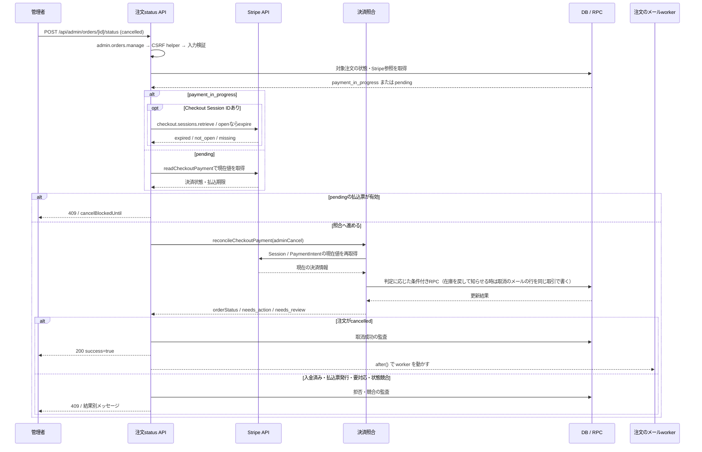
```mermaid
sequenceDiagram
    participant Admin as 管理者
    participant API as 注文status API
    participant Stripe as Stripe API
    participant Reconcile as 決済照合
    participant DB as DB / RPC
    participant Mail as 注文のメールworker
    Admin->>API: POST /api/admin/orders/[id]/status (cancelled)
    API->>API: admin.orders.manage → CSRF helper → 入力検証
    API->>DB: 対象注文の状態・Stripe参照を取得
    DB-->>API: payment_in_progress または pending
    alt payment_in_progress
        opt Checkout Session IDあり
            API->>Stripe: checkout.sessions.retrieve / openならexpire
            Stripe-->>API: expired / not_open / missing
        end
    else pending
        API->>Stripe: readCheckoutPaymentで現在値を取得
        Stripe-->>API: 決済状態・払込期限
    end
    alt pendingの払込票が有効
        API-->>Admin: 409 / cancelBlockedUntil
    else 照合へ進める
        API->>Reconcile: reconcileCheckoutPayment(adminCancel)
        Reconcile->>Stripe: Session / PaymentIntentの現在値を再取得
        Stripe-->>Reconcile: 現在の決済情報
        Reconcile->>DB: 判定に応じた条件付きRPC（在庫を戻して知らせる時は取消のメールの行を同じ取引で書く）
        DB-->>Reconcile: 更新結果
        Reconcile-->>API: orderStatus / needs_action / needs_review
        alt 注文がcancelled
            API->>DB: 取消成功の監査
            API-->>Admin: 200 success=true
            API-->>Mail: after() で worker を動かす
        else 入金済み・払込票発行・要対応・状態競合
            API->>DB: 拒否・競合の監査
            API-->>Admin: 409 / 結果別メッセージ
        end
    end
```

### 例外と永続化

| 条件 | 結果・保存内容 |
| --- | --- |
| cancelled / paid / shipped / abandonedを先に取得 | cancelledは再度200。shipped・abandonedは409で拒否し、通常取消のStripe確認へ進まない。paidは支払い済みのキャンセル（SQ-ADMIN-06。グループ E-2）へ回す |
| failedを取得 | `admin_cancel_failed_order`へ分岐。actor・理由・必要なメモを保存してfailed→cancelled。追加在庫解放と取消メールなし。更新0件は409 |
| 有効な払込票 | pendingの事前読取りがawaiting_paymentなら409。時計が払込期限を過ぎたことだけで取り消さず、最後はStripeの状態を使う |
| Stripe確認中に入金・払込票発行 | 照合器がpaid/pendingへ合わせる場合がある。取消要求でも入金を優先し、APIは409を返す |
| 期限切れ・放棄とadminCancel | payment_in_progress/pendingを期待状態に、解放RPCがcancelledへ更新。purchase/cancel台帳の差から予約済み数量だけcancel台帳に戻す |
| 取消情報 | actor、reason、note、notifyCustomerを保存。otherなら空でないメモ、メモ500字以下。状態変更の履歴はorder_revisions |
| Stripe/DBの一時エラー / その他の例外 | 通常取消APIは503 / 500。成立済みのRPC更新まで一括で巻き戻す保証ではない |

照合器の条件付き更新0件は、Stripe・DBを読み直す契機であり取消成功ではない。最大3回で収束しない場合は一時エラー。根拠はstatus API、照合器、在庫解放RPC。

## SQ-ADMIN-02: 入金済み注文の出荷記録（仕上がり・発送ごと・取消）

目的は、入金済みの注文の発送を商品と数ごとに1回ずつ記録し、受注生産の品の仕上がりを記録し、どちらも取り消せるようにすること。事前条件は管理認可（`admin.orders.manage`）・CSRF helper・回数の制限・入力の検証。終了結果は、記録が成立した200、条件不成立の404・409・400、RPC失敗の500。

> G-4 Task 8: この節の窓口（`GET`・`POST …/fulfillments`、`…/fulfillments/[fulfillmentId]/cancel`、`POST …/completions`、`…/completions/[completionId]/cancel`）は route ごと撤去した（G-1 で 410 だけを返す形にし、G-3 で発送を発送票へ移していた）。DB の旧い関数は `LEGACY_FULFILLMENT_DISABLED` / `MANUAL_COMPLETION_DISABLED` で拒否したまま。以下の図は撤去前の流れの記録で、今の発送は[発送票の流れ](shipping.md)。

### 発送を記録する

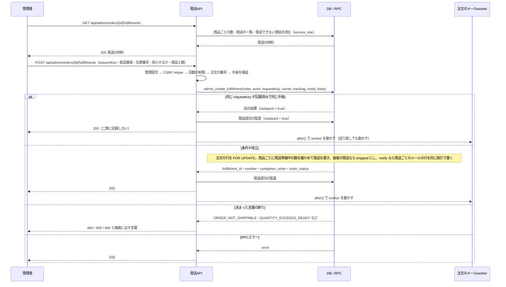
```mermaid
sequenceDiagram
    participant Admin as 管理者
    participant API as 発送API
    participant DB as DB / RPC
    participant Mail as 注文のメールworker
    Admin->>API: GET /api/admin/orders/[id]/fulfillments
    API->>DB: 商品ごとの数・発送の一覧・発送できない理由を読む（service_role）
    DB-->>API: 発送の材料
    API-->>Admin: 200 発送の材料
    Admin->>API: POST /api/admin/orders/[id]/fulfillments（requestKey・配送業者・伝票番号・知らせるか・商品と数）
    API->>API: 管理認可 → CSRF helper → 回数の制限 → 注文の番号 → 中身を検証
    API->>DB: admin_create_fulfillment(order, actor, requestKey, carrier, tracking, notify, lines)
    alt 同じ requestKey が記録済みで同じ中身
        DB-->>API: 前の結果（replayed = true）
        API->>DB: 発送成功の監査（replayed = true）
        API-->>Admin: 200（二重に記録しない）
        API-->>Mail: after() で worker を動かす（送り直しでも動かす）
    else 条件が成立
        Note over DB: 注文の行を FOR UPDATE。商品ごとに発送準備中の数を確かめて発送を書き、最後の発送なら shipped にし、notify なら発送ごとのメールの行を同じ取引で書く
        DB-->>API: fulfillment_id・number・completes_order・order_status
        API->>DB: 発送成功の監査
        API-->>Admin: 200
        API-->>Mail: after() で worker を動かす
    else 決まった言葉の断り
        DB-->>API: ORDER_NOT_SHIPPABLE・QUANTITY_EXCEEDS_READY など
        API-->>Admin: 404 / 409 / 400 と画面に出す言葉
    else RPCエラー
        DB-->>API: error
        API-->>Admin: 500
    end
```

### 仕上がりと取消

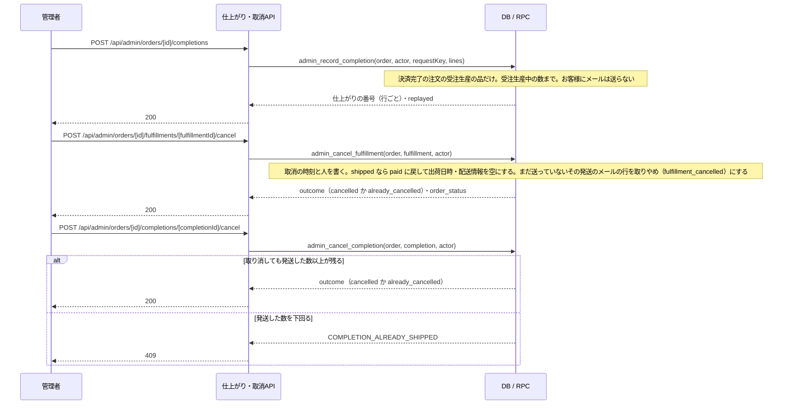
```mermaid
sequenceDiagram
    participant Admin as 管理者
    participant API as 仕上がり・取消API
    participant DB as DB / RPC
    Admin->>API: POST /api/admin/orders/[id]/completions
    API->>DB: admin_record_completion(order, actor, requestKey, lines)
    Note over DB: 決済完了の注文の受注生産の品だけ。受注生産中の数まで。お客様にメールは送らない
    DB-->>API: 仕上がりの番号（行ごと）・replayed
    API-->>Admin: 200
    Admin->>API: POST /api/admin/orders/[id]/fulfillments/[fulfillmentId]/cancel
    API->>DB: admin_cancel_fulfillment(order, fulfillment, actor)
    Note over DB: 取消の時刻と人を書く。shipped なら paid に戻して出荷日時・配送情報を空にする。まだ送っていないその発送のメールの行を取りやめ（fulfillment_cancelled）にする
    DB-->>API: outcome（cancelled か already_cancelled）・order_status
    API-->>Admin: 200
    Admin->>API: POST /api/admin/orders/[id]/completions/[completionId]/cancel
    API->>DB: admin_cancel_completion(order, completion, actor)
    alt 取り消しても発送した数以上が残る
        DB-->>API: outcome（cancelled か already_cancelled）
        API-->>Admin: 200
    else 発送した数を下回る
        DB-->>API: COMPLETION_ALREADY_SHIPPED
        API-->>Admin: 409
    end
```

### 発送の条件と永続化

| 条件 | 結果・保存内容 |
| --- | --- |
| 発送できない状態 | 決済完了でない・未発送が無い: `ORDER_NOT_SHIPPABLE`（409）。配送先の必須項目が足りない: `SHIPPING_ADDRESS_INCOMPLETE`（409）。未解決の paid_amount_mismatch: `PAYMENT_REVIEW_REQUIRED`（409）。review_reason の未確認自体は拒否条件に含まれない |
| 数の超過 | 注文に無い商品: `LINE_NOT_IN_ORDER`、発送準備中の数を超える数: `QUANTITY_EXCEEDS_READY`（どちらも窓口は 409 で、画面の言葉は同じ）。受注生産中の品は、仕上がりを記録するまで送れない。関数の確かめに重ねて、`shipped ≤ completed ≤ quantity` を破る書き込みはトリガーが `FULFILLMENT_BOUNDS_VIOLATED`（23514）で止める（この言葉は窓口の言葉の表に無いので、窓口は 500） |
| 同時の操作 | 注文の行の鍵で1つずつ進む。後の方は前の発送の後の数で確かめ、超える分は上の断りになる（同じ品を同時に送ると2回目は記録されない） |
| 重複防止キー | 同じキーで同じ中身は前の結果（`replayed`）、違う中身は `FULFILLMENT_REQUEST_MISMATCH`（409）。答えが分からない時、画面は同じキーで確かめ直す |
| 保存 | 発送（番号は注文ごとの最大＋1。取り消した番号は使い回さない）・発送の商品。全部を送った時だけ、注文の shipped・出荷日時・配送業者・追跡番号。注文の改訂の理由は `admin_create_fulfillment`・`admin_cancel_fulfillment` |
| メール | `notifyCustomer` が真の時だけ、その発送の発送メールの行を同じ取引で書く。返事の後に worker が送る。失敗はやり直し、送れなければ店へ知らせる |

仕上がりの記録は決済完了の注文だけ（`ORDER_NOT_IN_PRODUCTION`）、受注生産の品だけ（`LINE_NOT_IN_PRODUCTION`）、受注生産中の数まで（`QUANTITY_EXCEEDS_IN_PRODUCTION`）。根拠は [移行 A](../../../supabase/migrations/20261010120303_order_fulfillments.sql)、[移行 B](../../../supabase/migrations/20261010122320_fulfillment_order_emails.sql)、旧発送API（G-4 Task 8 で撤去）、[worker](../../../src/lib/orders/email/order-email-worker.ts)。

## SQ-ADMIN-03: 管理画面の返金（記録を先に作り、Stripe に頼み、結果を書く）

目的は、商品と数・送料を選んだ返金を1件の記録にして Stripe に頼み、Stripe が受け付けた結果で、在庫・メールの予定・要対応・注文の返金済みの額と状態を1回の取引で書くこと。事前条件は管理認可（`admin.orders.refund`）→ CSRF helper → 回数の制限（送信元ごと・管理者ごと、10分に30回）→ 注文の番号の検証 → 本文の検証を通ること。終了結果は、受け付けた200、DB の断りの400・404・409、Stripe の断りの422、答えが分からない502、DB の失敗の500。考え方は [グループ E-2 設計書](../../superpowers/specs/2026-10-11-refund-and-cancel-design.md) の 3 章。

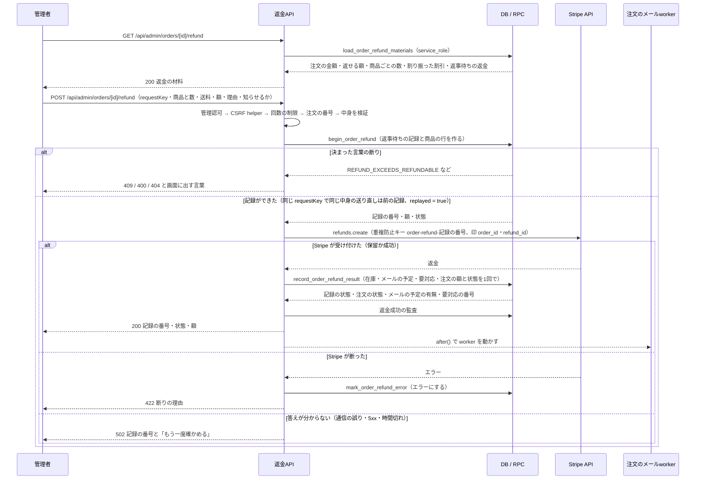
```mermaid
sequenceDiagram
    participant Admin as 管理者
    participant API as 返金API
    participant DB as DB / RPC
    participant Stripe as Stripe API
    participant Mail as 注文のメールworker
    Admin->>API: GET /api/admin/orders/[id]/refund
    API->>DB: load_order_refund_materials（service_role）
    DB-->>API: 注文の金額・返せる額・商品ごとの数・割り振った割引・返事待ちの返金
    API-->>Admin: 200 返金の材料
    Admin->>API: POST /api/admin/orders/[id]/refund（requestKey・商品と数・送料・額・理由・知らせるか）
    API->>API: 管理認可 → CSRF helper → 回数の制限 → 注文の番号 → 中身を検証
    API->>DB: begin_order_refund（返事待ちの記録と商品の行を作る）
    alt 決まった言葉の断り
        DB-->>API: REFUND_EXCEEDS_REFUNDABLE など
        API-->>Admin: 409 / 400 / 404 と画面に出す言葉
    else 記録ができた（同じ requestKey で同じ中身の送り直しは前の記録、replayed = true）
        DB-->>API: 記録の番号・額・状態
        API->>Stripe: refunds.create（重複防止キー order-refund-記録の番号、印 order_id・refund_id）
        alt Stripe が受け付けた（保留か成功）
            Stripe-->>API: 返金
            API->>DB: record_order_refund_result（在庫・メールの予定・要対応・注文の額と状態を1回で）
            DB-->>API: 記録の状態・注文の状態・メールの予定の有無・要対応の番号
            API->>DB: 返金成功の監査
            API-->>Admin: 200 記録の番号・状態・額
            API-->>Mail: after() で worker を動かす
        else Stripe が断った
            Stripe-->>API: エラー
            API->>DB: mark_order_refund_error（エラーにする）
            API-->>Admin: 422 断りの理由
        else 答えが分からない（通信の誤り・5xx・時間切れ）
            API-->>Admin: 502 記録の番号と「もう一度確かめる」
        end
    end
```

### 例外と永続化

| 条件 | 結果・保存内容 |
| --- | --- |
| 数と額の確かめ | 受け取った額（`orders.paid_amount`）から返事待ち・保留・成功の返金の合計を引いた額を超えると `REFUND_EXCEEDS_REFUNDABLE`（409）。送料は返せる送料まで（`REFUND_SHIPPING_EXCEEDS`）。発送前の返金は未発送の数まで（`REFUND_QUANTITY_EXCEEDS_UNSHIPPED`）、発送後の返金は発送後に返せる数まで（`REFUND_QUANTITY_EXCEEDS_SHIPPED`）。注文に無い商品は `REFUND_LINE_NOT_IN_ORDER` |
| 全額の決まり | 全額になるのに未発送の商品が全部入っていないと `REFUND_MUST_INCLUDE_UNSHIPPED`。1つも発送していない注文で残りの商品を全部返すのに、送料か返金額が全部でないと `REFUND_MUST_BE_FULL` |
| 同時の操作 | 注文の行の鍵で1つずつ進む。返金と発送を同時に押すと、後の方は前の結果の数で確かめられ、超える分は断られる（返金は `REFUND_QUANTITY_EXCEEDS_UNSHIPPED`、発送は `QUANTITY_EXCEEDS_READY`）。返事待ちの返金がある注文には別の返金を作れない（`AWAITING_REFUND_EXISTS`） |
| 二重防止 | 画面を開いた時に作る二重防止の番号。同じ番号で同じ中身は前の記録（`replayed`）、違う中身は `REFUND_REQUEST_MISMATCH`（409）。Stripe への重複防止キーは記録の番号から作る（`order-refund-{記録の番号}`）ので、同じ額の別の返金は別のキーになる（R-03）。送り直しで記録がもう保留・成功なら、Stripe を呼ばずに前の答え（`replayed: true`）を返し、エラー・失敗なら、Stripe を呼ばずに422を返す。返事待ちなら、下の「答えが分からない」の確かめ直しになる |
| Stripe が断った | 422。記録は「エラー」にする（返せる額に数えない）。同じ番号では二度目の頼みを受けないので、画面は直して新しい番号で送り直す |
| 答えが分からない | 502（記録は返事待ちのまま、記録の番号を返す）。画面は入力を止め、同じ番号で「もう一度確かめる」。作ってから23時間以内なら最初と同じ中身・同じ重複防止キーで頼み直し（支払いの種類が読めない時は Stripe を呼ばず、答えが分からない扱いにする）、超えていたら頼み直さず（Stripe は重複防止キーを24時間以上で消してよいため、時計のずれの余裕を置く）、Stripe の返金に付けた印（記録の番号）で探す。見つからなければ毎時の見回りがエラーにする。Stripe が重複防止キーの誤りと答えた時も、答えが分からない扱いにする（エラーにして返せる額を戻すと、二重の返金を許すため） |
| 保存（Stripe が受け付けた時） | 記録の状態（保留か成功）と Stripe の細目（口座の入力の期限・照会番号）。初めて保留か成功になった時の1回だけ、発送前・在庫の品の確保を外して台帳 `refund` で戻し（戻さない時は `refund` +n と `adjustment` −n の2行）、メールの予定を書く（残高不足の保留は成功した時）。注文の返金済みの額・返金日時・状態（[注文・決済の状態](../states/order-payment.md) の ST-ORDER-09・10・13・14） |
| 失敗した時 | 受け付けた返金が失敗になった時の1回だけ、確保を外した数を確保し直し、要対応「返金の失敗」を作って店へ知らせる。足りない数は返金の商品の行に残し、注文の要確認の理由が空か確認済みなら「在庫を確保できなかった注文」にして確認済みの印を外す（ほかの理由が開いている時は上書きしない）。お客様へは自動のメールを送らない |
| 権限 | 店長の役割（`admin.orders.refund`）だけ。サポートの人は断られる |
| 監査 | 返金の記録の番号・額・数・道・状態・実行した人だけ。お客様の名前・住所・メールとメモの本文は入れない。コンビニ払いの返金だけ、注文の連絡先のメールを Stripe の `instructions_email` に渡す（監査とログには入れない） |

根拠は [refund API](../../../src/app/api/admin/orders/%5Bid%5D/refund/route.ts)、[返金の流れ](../../../src/lib/orders/refund/refund-service.ts)、[Stripe への頼み方](../../../src/lib/orders/refund/refund-stripe.ts)、[E-2 移行 B](../../../supabase/migrations/20261011223147_order_refund_requests.sql)、[E-2 移行 C](../../../supabase/migrations/20261011223453_order_refund_results.sql)。同じ結果を書く関数は、支払い済みのキャンセル（SQ-ADMIN-06）、Stripe の返金の知らせの取り込み（SQ-ADMIN-07）、自動の返金（SQ-ADMIN-08）からも呼ばれる。

## SQ-ADMIN-04: 要対応記録を解決済みにする

目的は人による対応完了の記録。事前条件は管理認可、CSRF検証、UUID・本文検証を通り、cancelOrder=falseであること。終了結果は解決済みの200、返金の失敗でメモが空白なら400、不存在・既解決等の409、RPC失敗の500。Stripe操作、返金、注文取消は実行しない。

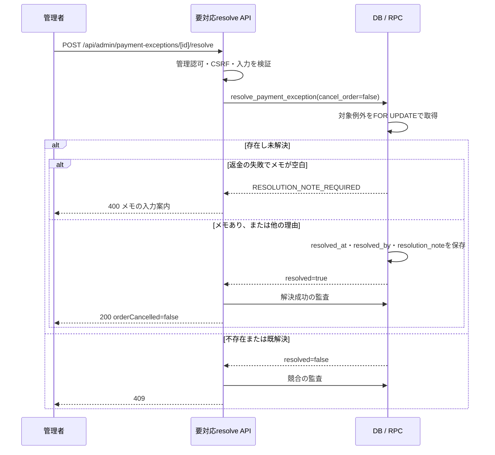
```mermaid
sequenceDiagram
    participant Admin as 管理者
    participant API as 要対応resolve API
    participant DB as DB / RPC
    Admin->>API: POST /api/admin/payment-exceptions/[id]/resolve
    API->>API: 管理認可・CSRF・入力を検証
    API->>DB: resolve_payment_exception(cancel_order=false)
    DB->>DB: 対象例外をFOR UPDATEで取得
    alt 存在し未解決
        alt 返金の失敗でメモが空白
            DB-->>API: RESOLUTION_NOTE_REQUIRED
            API-->>Admin: 400 メモの入力案内
        else メモあり、または他の理由
            DB->>DB: resolved_at・resolved_by・resolution_noteを保存
            DB-->>API: resolved=true
            API->>DB: 解決成功の監査
            API-->>Admin: 200 orderCancelled=false
        end
    else 不存在または既解決
        DB-->>API: resolved=false
        API->>DB: 競合の監査
        API-->>Admin: 409
    end
```

解決済みの再検出は検出回数・最終時刻を更新するが未解決には戻さない。メモは最大500字で、返金の失敗の手動解決だけ必須、ほかの理由は任意（FREQ-507）。返金の失敗では「メモ（必須・店内のみ）」と「返金の失敗を解決するときは、確かめた内容をメモに入力してください。」を表示し、空・空白だけでは送信できない。API は追加の読み取りをせず、RPC の `RESOLUTION_NOTE_REQUIRED` を400と同じ案内に変換する。解決済みの行への再送は従来どおり何も変更せず、自動解決のメモは任意のまま。未解決paid_amount_mismatchを解決すると発送の関数（`admin_create_fulfillment`）のその拒否条件（`PAYMENT_REVIEW_REQUIRED`）がなくなるが、解決記録自体はStripeの金額訂正をしない。根拠は[resolve API](../../../src/app/api/admin/payment-exceptions/%5Bid%5D/resolve/route.ts)と[例外RPC](../../../supabase/migrations/20261023061434_payment_exception_refund_failed_note.sql)。

## SQ-ADMIN-05: 未入金注文を取り消して要対応を解決する

目的は、関連する未入金注文の取消と要対応の解決を同一DB処理で記録すること。事前条件は管理認可・CSRF検証・入力検証、cancelOrder=true、取消理由と空でないメモ。終了結果は取消と解決の200、Stripeが入金可能・状態競合等なら409、一時的な外部確認失敗は503。

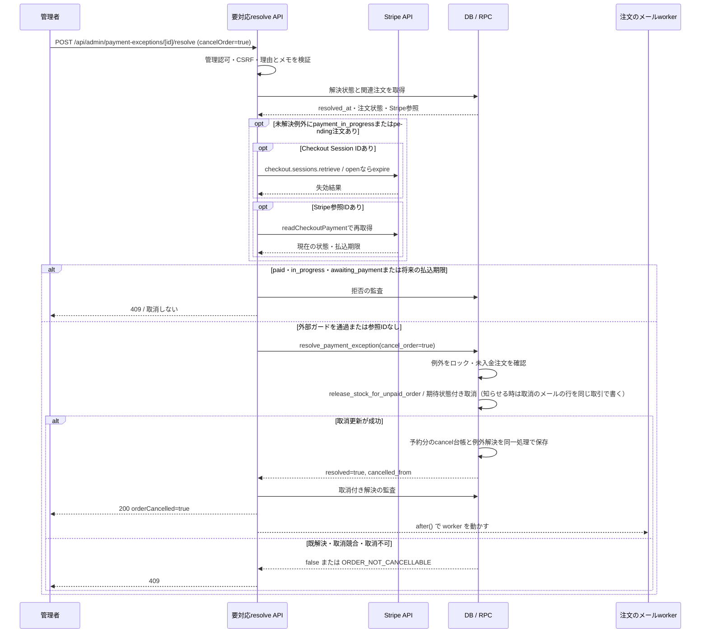
```mermaid
sequenceDiagram
    participant Admin as 管理者
    participant API as 要対応resolve API
    participant Stripe as Stripe API
    participant DB as DB / RPC
    participant Mail as 注文のメールworker
    Admin->>API: POST /api/admin/payment-exceptions/[id]/resolve (cancelOrder=true)
    API->>API: 管理認可・CSRF・理由とメモを検証
    API->>DB: 解決状態と関連注文を取得
    DB-->>API: resolved_at・注文状態・Stripe参照
    opt 未解決例外にpayment_in_progressまたはpending注文あり
        opt Checkout Session IDあり
            API->>Stripe: checkout.sessions.retrieve / openならexpire
            Stripe-->>API: 失効結果
        end
        opt Stripe参照IDあり
            API->>Stripe: readCheckoutPaymentで再取得
            Stripe-->>API: 現在の状態・払込期限
        end
    end
    alt paid・in_progress・awaiting_paymentまたは将来の払込期限
        API->>DB: 拒否の監査
        API-->>Admin: 409 / 取消しない
    else 外部ガードを通過または参照IDなし
        API->>DB: resolve_payment_exception(cancel_order=true)
        DB->>DB: 例外をロック・未入金注文を確認
        DB->>DB: release_stock_for_unpaid_order / 期待状態付き取消（知らせる時は取消のメールの行を同じ取引で書く）
        alt 取消更新が成功
            DB->>DB: 予約分のcancel台帳と例外解決を同一処理で保存
            DB-->>API: resolved=true, cancelled_from
            API->>DB: 取消付き解決の監査
            API-->>Admin: 200 orderCancelled=true
            API-->>Mail: after() で worker を動かす
        else 既解決・取消競合・取消不可
            DB-->>API: false または ORDER_NOT_CANCELLABLE
            API-->>Admin: 409
        end
    end
```

### 通常取消とのガード差と永続化

| 条件 | SQ-ADMIN-01 通常取消 | SQ-ADMIN-05 取消付き解決 |
| --- | --- | --- |
| 外部確認の対象 | payment_in_progressはSession失効後に照合。pendingは事前Stripe読取り後に照合 | 未解決例外の関連注文がpayment_in_progress/pendingなら、状態を問わずSession失効を先に試みて再読取り |
| 外部参照なし | 照合器の必須参照に達しなければ例外応答 | Stripe確認を省略し、DB RPCへ進める |
| 想定外・missing・0円完了等 | 注文ありなら照合器が要対応を記録し、取消APIは409となる場合がある | paid/in_progress/awaiting_paymentや将来の払込期限でなければ、DBの未入金条件に従い取消を試みる |
| 判断と更新主体 | Stripe現在値を照合器で分類して、必要な注文RPCを呼ぶ | APIの外部ガード後、resolve RPCがrelease RPCを呼び、取消成功時だけ例外を解決 |
| メモ | otherの場合に必須 | 取消理由にかかわらず必須 |
| 不存在・既解決・未入金以外 | 注文status APIの分岐と照合による | RPCが拒否。解決済み等の事前読取りではStripe操作を省略する |

APIが外部確認に失敗すればRPCへ進まない。DB側では例外行をロックし、関連注文がpayment_in_progress/pendingであることを確認する。在庫解放の条件付き更新0件なら例外を解決せずfalse。外部Stripe確認とDB更新は同一トランザクションには含まれない。根拠はresolve APIのcheckStripeBeforeCancel・refuseIfStripeMayTakeMoneyと、[resolve RPC](../../../supabase/migrations/20260927100500_payment_exceptions.sql)。

## SQ-ADMIN-06: 支払い済みの注文のキャンセル

目的は、支払い済みで1つも発送していない注文を、残りの商品全部と、送料（返せる送料と返せる額の小さい方）を返金してキャンセルすること。事前条件は管理認可（`admin.orders.manage`）→ CSRF helper → 注文を読んで `paid` と分かってから `admin.orders.refund` → 回数の制限（10分に30回）→ 本文の検証。未入金・失敗の注文の取消は SQ-ADMIN-01 のまま（サポートの人もできる）。終了結果は返金と同じ（200・400・404・409・422・502・500）。

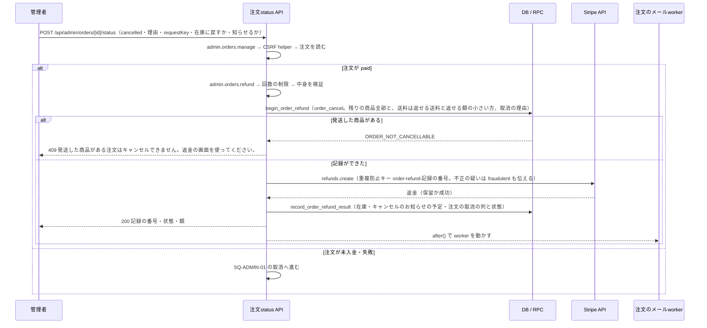
```mermaid
sequenceDiagram
    participant Admin as 管理者
    participant API as 注文status API
    participant DB as DB / RPC
    participant Stripe as Stripe API
    participant Mail as 注文のメールworker
    Admin->>API: POST /api/admin/orders/[id]/status（cancelled・理由・requestKey・在庫に戻すか・知らせるか）
    API->>API: admin.orders.manage → CSRF helper → 注文を読む
    alt 注文が paid
        API->>API: admin.orders.refund → 回数の制限 → 中身を検証
        API->>DB: begin_order_refund（order_cancel。残りの商品全部と、送料は返せる送料と返せる額の小さい方、取消の理由）
        alt 発送した商品がある
            DB-->>API: ORDER_NOT_CANCELLABLE
            API-->>Admin: 409 発送した商品がある注文はキャンセルできません。返金の画面を使ってください。
        else 記録ができた
            API->>Stripe: refunds.create（重複防止キー order-refund-記録の番号。不正の疑いは fraudulent も伝える）
            Stripe-->>API: 返金（保留か成功）
            API->>DB: record_order_refund_result（在庫・キャンセルのお知らせの予定・注文の取消の列と状態）
            API-->>Admin: 200 記録の番号・状態・額
            API-->>Mail: after() で worker を動かす
        end
    else 注文が未入金・失敗
        API->>API: SQ-ADMIN-01 の取消へ進む
    end
```

| 条件 | 結果・保存内容 |
| --- | --- |
| 中でやること | 残りの商品全部と、送料（返せる送料と返せる額の小さい方）を、`order_cancel` の返金1件で返す（前に一部を返金していれば、その残り。額は返せる額の全部）。商品の行は全部「発送前」で、在庫の品は「在庫に戻す」の選択で `cancel`（戻す）か `no_restock`（戻さない）、受注生産の品は `no_restock` |
| 注文の状態 | 返金が成功した時に `cancelled` にする（ST-ORDER-09。取消の理由・メモ・知らせるかを注文の取消の列に写す）。コンビニ払いで口座の入力を待つ間（保留）は `paid` のまま、進み具合を「キャンセルの手続き中」と出す |
| メール | 「お客様にキャンセルのお知らせを送る」が入っている時だけ、キャンセルのお知らせ（種類 `canceled`・書き分け `paid`）を返金ごとに1通。返金のお知らせは別に送らない。残高不足の保留は成功するまで待つ |
| 取消し直し | 取り消した後に返金が失敗して支払い済みに戻り、もう一度取り消すと2通目も届く（メールの行が返金ごとのため） |
| 理由「不正の疑い」 | Stripe にも不正の疑い（`fraudulent`）と伝える。お客様への文には理由を書かない（在庫切れとお客様の依頼の時だけ書く） |
| 権限 | 店長だけ（`admin.orders.manage` と `admin.orders.refund` の両方）。サポートの人は材料の読み込みで断られる |
| 同時の操作・答えが分からない時 | 注文の行の鍵で、返金・発送と1つずつ進む。二重防止の番号は画面を開いた時に作り、答えが分からない時は502（記録は返事待ちのまま）を返して、画面が同じ番号で「もう一度確かめる」（SQ-ADMIN-03 の表の「二重防止」「答えが分からない」） |
| 取消になった後の送り直し | カード・PayPay の返金は Stripe がその場で成功を返し、1回目の中で注文が `cancelled` になる。通信が切れて同じ二重防止の番号で送り直された時は、注文がもう `cancelled` でも、本文に null でない `requestKey` があれば支払い済みのキャンセルとして確かめ（返金の権限を確かめ、回数を数える）、DB が前の記録を返して `replayed: true` の答え（200）になる。この時、本文が不正なら（`requestKey` が UUID でない・`restock` が真偽値でない）、取消済みの200では返さず 400 `invalid_request` で断る。開いたままの別の画面から新しい番号で送った時は、DB が `ORDER_NOT_CANCELLABLE` で断る（409）。`requestKey` の無い（または null の）送り直し（未入金の取消）は今のまま |

根拠は [status API](../../../src/app/api/admin/orders/%5Bid%5D/status/route.ts)、[返金の流れ](../../../src/lib/orders/refund/refund-service.ts)、[E-2 移行 B](../../../supabase/migrations/20261011223147_order_refund_requests.sql)、[E-2 移行 C](../../../supabase/migrations/20261011223453_order_refund_results.sql)。

## SQ-ADMIN-07: Stripe の返金の取り込みと見回り

目的は、Stripe の画面で直接返した返金や、こちらの記録に結果を書く前に落ちた返金を、Stripe の今の返金の一覧から返金の記録に合わせること。知らせは合図にだけ使う（R-06）。事前条件は Stripe の署名（W）か、Cron の合言葉（J）。終了結果は、取り込みの完了、またはそろわずに失敗にして待ち行列のやり直しに任せること。

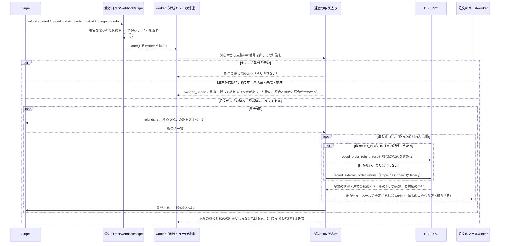
```mermaid
sequenceDiagram
    participant Stripe as Stripe
    participant Hook as 受け口 /api/webhook/stripe
    participant Worker as worker（永続キューの処理）
    participant Sync as 返金の取り込み
    participant DB as DB / RPC
    participant Mail as 注文のメールworker
    Stripe->>Hook: refund.created / refund.updated / refund.failed / charge.refunded
    Hook->>Hook: 署名を確かめて永続キューに保存し、2xxを返す
    Hook-->>Worker: after() で worker を動かす
    Worker->>Sync: 知らせから支払いの番号を出して取り込む
    alt 支払いの番号が無い
        Sync-->>Worker: 監査に残して終える（やり直さない）
    else 注文が支払い手続き中・未入金・失敗・放棄
        Sync-->>Worker: skipped_unpaid。監査に残して終える（入金が決まった後に、照合と毎晩の照合が合わせる）
    else 注文が支払い済み・発送済み・キャンセル
        loop 最大3回
            Sync->>Stripe: refunds.list（その支払いの返金を全ページ）
            Stripe-->>Sync: 返金の一覧
            loop 返金1件ずつ（作った時刻の古い順）
                alt 印 refund_id がこの注文の記録に当たる
                    Sync->>DB: record_order_refund_result（記録の状態を進める）
                else 印が無い、または合わない
                    Sync->>DB: record_external_order_refund（stripe_dashboard か legacy）
                end
                DB-->>Sync: 記録の状態・注文の状態・メールの予定の有無・要対応の番号
                Sync-->>Mail: 後の始末（メールの予定があれば worker、返金の失敗なら店へ知らせる）
            end
            Sync->>Stripe: 書いた後に一覧を読み直す
        end
        Sync-->>Worker: 返金の番号と状態の組が変わらなければ収束。3回でそろわなければ失敗
    end
```

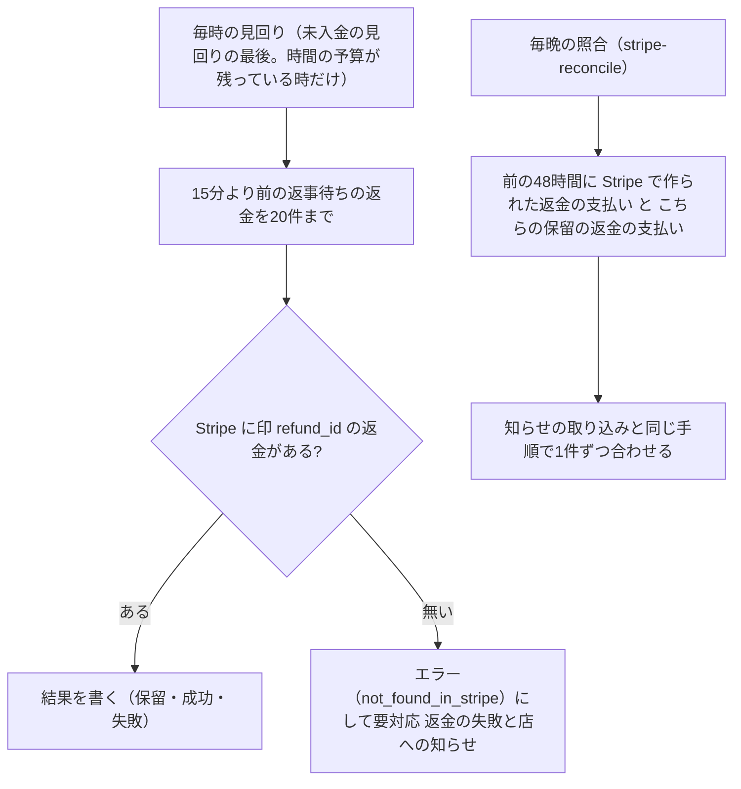
```mermaid
flowchart TD
  H["毎時の見回り（未入金の見回りの最後。時間の予算が残っている時だけ）"] --> A["15分より前の返事待ちの返金を20件まで"]
  A --> B{"Stripe に印 refund_id の返金がある?"}
  B -- "ある" --> C["結果を書く（保留・成功・失敗）"]
  B -- "無い" --> D["エラー（not_found_in_stripe）にして要対応 返金の失敗と店への知らせ"]
  N["毎晩の照合（stripe-reconcile）"] --> P["前の48時間に Stripe で作られた返金の支払い と こちらの保留の返金の支払い"]
  P --> Q["知らせの取り込みと同じ手順で1件ずつ合わせる"]
```

| 条件 | 結果・保存内容 |
| --- | --- |
| 支払いの番号が無い返金 | 取り込まない。監査 `checkout.webhook.refund_without_payment_intent` に残して終える（やり直さない。R-06）。会計の同期も飛ばす |
| 注文が無い | 今のとおり、監査に残し、失敗・取消の返金なら要対応にして店へ知らせる（注文が後から作られた時は、照合と毎晩の照合が合わせる） |
| 注文が支払い手続き中・未入金・失敗・放棄 | `skipped_unpaid`。監査 `checkout.webhook.refund_on_unpaid_order` に残して終える（やり直さない。R-06）。入金が決まった後に、照合と毎晩の照合が合わせる |
| 印 `refund_id` がこの注文の記録に当たる | その記録に Stripe の返金の番号と状態を書く（`record_order_refund_result`）。許さない移り方の知らせ（成功の後の保留など）は何もせず、今の値を返す。エラーにした記録に当たって、Stripe の返金が保留・成功になった時は、エラーの時の要対応「返金の失敗」（支払いの印は返金の記録の番号）が開いていればシステムが閉じる（ただし、その返金の発送前の行の商品が全部 s + rb ≤ q を保っている時だけ。エラーの間にその品を発送して崩れていれば、お客様に品と返金の両方が届くので、要対応を開いたまま残す）。受け付けずに失敗になった時は、同じ印（返金の記録の番号）で失敗の後始末の要対応を記録するので、エラーの時の要対応と同じ1行になり、店への知らせも1通になる。保留・成功を通った後に失敗になった時は、Stripe の返金の番号の印で新しい要対応を作り、店へ知らせる |
| 印が無い、または当たらない | 外からの返金として記録する（`record_external_order_refund`）。Stripe が返金を作った時刻が切り替えの時刻より前なら「前からの写し」（在庫もメールも動かさない）、後なら「Stripe の画面からの返金」。この返金で受け取った額に届く時は、未発送の商品を全部その返金の発送前の行に入れて在庫に戻し（送料は、行の有無に依らず返せる送料の全部。ただしその返金の額を超えない）、お客様に返金のお知らせを送る。印 `refund_id` があるのにこの注文の記録に当たらない時（uuid の形でない・別の注文の記録を指す・記録が無い）は、記録を作った時の1回だけ、監査 `stripe.refund.marker_unmatched` を残す（Stripe の返金の番号と印だけ。個人情報は入れない） |
| 書いた後の確かめ | Stripe の一覧を読み直し、返金の番号と状態の組が変わっていれば最大3回まで繰り返す。そろわなければ失敗にして、永続キューのやり直し（最大9回。その後は退避と店への知らせ。グループ B）に任せる |
| 後の始末 | メールの予定があれば worker を動かし、返金の失敗の要対応があれば店へ知らせる。始末が失敗しても取り込みは失敗にしない（記録はもう書けている。メールは worker が、店への知らせは毎時の見回りが送り直す） |
| 毎時の見回り | 未入金の見回り（`POST /api/cron/expire-pending-orders`）の最後に、時間の予算が残っている時だけ、15分より前から返事待ちの返金を20件まで、Stripe の印で探す。見つかれば結果を書き、無ければ「エラー」（`not_found_in_stripe`）にして要対応「返金の失敗」を作り、店へ知らせる（返金の結果の行が無いので、エラーにする関数が返した要対応の番号で直に送る）。支払いの番号が無い注文の記録も、同じ理由でエラーにする。エラーにした時は、その返金が数えていた発送前の行を数えなくなるので、未発送が戻る注文は発送済みから支払い済みに戻る（在庫・メール・失敗の後始末は動かさない） |
| 毎晩の照合 | `POST /api/cron/stripe-reconcile` で、前の48時間に Stripe で作られた返金の支払いと、こちらの保留の返金の支払いを集め、知らせの取り込みと同じ手順で1件ずつ合わせる。時間の予算に届いたら残りを次の夜に回す。作られてから48時間より後に成功から失敗に変わり、知らせも届かない返金は拾えない（Stripe は知らせを3日間送り直す）。成功した返金の合計を全部の支払いで比べる同期はやめた。会計の `stripe_refunds` への写しは今のまま続ける |
| 定期処理の登録 | 毎分・毎時・毎晩の3本は本番に未登録の間は動かない（開店前の設定。[全体の決定](../../superpowers/specs/2026-10-10-group-e-overview-design.md) の 8章）。登録するまで、見回りと照合は取りこぼしを拾わない |

根拠は [返金の取り込み](../../../src/lib/stripe/order-refund-sync.ts)、[Webhook の処理](../../../src/lib/stripe/webhook-processor.ts)、[毎時の見回り](../../../src/lib/orders/refund/refund-sweep.ts)、[毎晩の照合](../../../src/lib/stripe/reconcile-orders.ts)、[E-2 移行 C](../../../supabase/migrations/20261011223453_order_refund_results.sql)。キューと worker の仕組みは [Webhook のシーケンス](stripe-webhooks.md) を参照する。

## SQ-ADMIN-08: 自動の返金（取り消した注文への入金・支払額の違い）

目的は、決済の照合が見つけた2つの要対応のうち、取り消した注文への入金（①）と支払額の違い（②）を、ショップの設定がオンの時に自動で全額返金すること。事前条件は、照合がその要対応を初めて記録したこと（`is_new`。切り替えの前から記録のある要対応は初めてではないので効かない）。終了結果は、返金を受け付け、店への知らせを送れた後に要対応を自動で閉じる、または返金できない・知らせを送れない時に要対応を開いたまま残す。

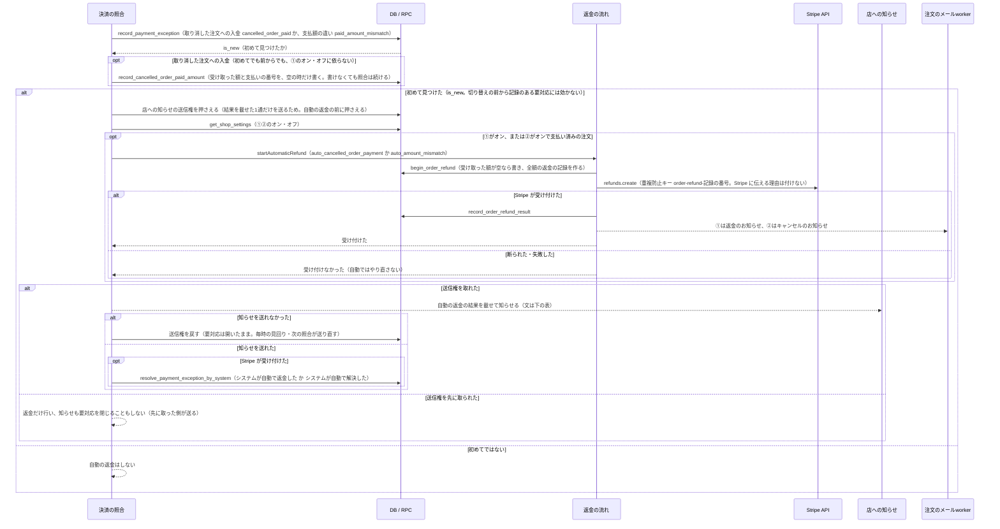
```mermaid
sequenceDiagram
    participant Rec as 決済の照合
    participant DB as DB / RPC
    participant Svc as 返金の流れ
    participant Stripe as Stripe API
    participant Shop as 店への知らせ
    participant Mail as 注文のメールworker
    Rec->>DB: record_payment_exception（取り消した注文への入金 cancelled_order_paid か、支払額の違い paid_amount_mismatch）
    DB-->>Rec: is_new（初めて見つけたか）
    opt 取り消した注文への入金（初めてでも前からでも、①のオン・オフに依らない）
        Rec->>DB: record_cancelled_order_paid_amount（受け取った額と支払いの番号を、空の時だけ書く。書けなくても照合は続ける）
    end
    alt 初めて見つけた（is_new。切り替えの前から記録のある要対応には効かない）
        Rec->>DB: 店への知らせの送信権を押さえる（結果を載せた1通だけを送るため。自動の返金の前に押さえる）
        Rec->>DB: get_shop_settings（①②のオン・オフ）
        opt ①がオン、または②がオンで支払い済みの注文
            Rec->>Svc: startAutomaticRefund（auto_cancelled_order_payment か auto_amount_mismatch）
            Svc->>DB: begin_order_refund（受け取った額が空なら書き、全額の返金の記録を作る）
            Svc->>Stripe: refunds.create（重複防止キー order-refund-記録の番号。Stripe に伝える理由は付けない）
            alt Stripe が受け付けた
                Svc->>DB: record_order_refund_result
                Svc-->>Mail: ①は返金のお知らせ、②はキャンセルのお知らせ
                Svc-->>Rec: 受け付けた
            else 断られた・失敗した
                Svc-->>Rec: 受け付けなかった（自動ではやり直さない）
            end
        end
        alt 送信権を取れた
            Rec-->>Shop: 自動の返金の結果を載せて知らせる（文は下の表）
            alt 知らせを送れなかった
                Rec->>DB: 送信権を戻す（要対応は開いたまま。毎時の見回り・次の照合が送り直す）
            else 知らせを送れた
                opt Stripe が受け付けた
                    Rec->>DB: resolve_payment_exception_by_system（システムが自動で返金した か システムが自動で解決した）
                end
            end
        else 送信権を先に取られた
            Rec-->>Rec: 返金だけ行い、知らせも要対応を閉じることもしない（先に取った側が送る）
        end
    else 初めてではない
        Rec-->>Rec: 自動の返金はしない
    end
```

| 自動の返金 | 動き |
| --- | --- |
| ① 取り消した注文への入金（既定オン） | 照合が要対応を記録するたびに（初めてでも前からでも、設定のオン・オフに依らず、自動の返金より先に）、受け取った額と支払いの番号を注文に書く（`record_cancelled_order_paid_amount`。取り消した注文で受け取った額が空の時だけ。書けなくても照合は続ける）。初めて記録した時で設定がオンなら、全額の返金を `auto_cancelled_order_payment` で作る（商品の行は無い。Stripe に伝える理由は付けない）。Stripe が受け付けたら、お客様に返金のお知らせ（このご注文はお支払いの前に取り消し済みである旨の文を入れる）を送り、店へ「自動で全額を返金しました。対応は要りません。」と知らせ、知らせを送れた後に要対応を「システムが自動で返金した」と記録して閉じる。断られた・失敗した時は、自動ではやり直さず、要対応を開いたまま店へ「自動の返金ができませんでした。管理画面の注文から返金してください。」と知らせる。設定がオフの時は「管理画面の注文から返金してください。」 |
| ② 支払額の違い（既定オフ） | 設定がオンで、注文が支払い済みで1つも発送していなければ、支払い済みの注文のキャンセルを `auto_amount_mismatch` で行う（残りの商品全部と、送料は返せる送料と返せる額の小さい方を返す。理由は「その他」、メモ「支払額の違いの自動の取消」、在庫に戻す、お客様に知らせる。Stripe に伝える理由は付けない）。Stripe が受け付けたら、店へ「自動で全額を返金し、注文を取り消しました。」と知らせ、知らせを送れた後に要対応を「システムが自動で解決した」と記録して閉じる。オフか取り消せなかった時は、店へ「管理画面で差額を返金するか、注文をキャンセルしてください。解決済みにするまで発送できません。」と知らせる |

自動の返金の共通の決まり（①②とも）:

- どちらも、照合が要対応を初めて記録した時だけ動き、失敗しても次の照合では動かし直さない（①の受け取った額の書き込みだけは、記録のたびに行う）
- 店への知らせの送信権は自動の返金の前に押さえ、同じ支払いの照合が同時に走っても、結果を載せた1通だけを送る
- 要対応を閉じるのは照合で、`resolve_payment_exception_by_system`（解決した人は空）を使い、店への知らせを送れた後に閉じる。閉じた要対応は、毎時の見回りの送り直しにも次の照合にも拾われないので、先に閉じて知らせを送れないと、店は返金（②は注文の取消）を知る手段を失う
- 知らせを送れなければ、送信権を戻して要対応を開いたまま残し、毎時の見回り・次の照合が送り直す。その時の文は自動の返金が無い時の文になるが、返金は済んでいて返せる額が0なので、管理画面に「返金」は出ず、二重の返金にはならない
- 送信権を先に取られた照合は、返金だけ行い、知らせも要対応を閉じることもしない（先に取った側の送信が失敗した時に送り直せるよう、開いたままにする）
- 自動の返金の部品が誤りを投げた時は、送信権を戻してから投げ直す（再試行の照合は、結果の無い知らせを送る）
- 自動の返金の記録と要対応は、注文と支払いで結び付く。設定は店長だけが変える（`admin.settings.manage`）

根拠は [決済照合器](../../../src/lib/stripe/checkout-payment-reconciler.ts)、[返金の流れ](../../../src/lib/orders/refund/refund-service.ts)、[店への知らせの文](../../../src/lib/orders/order-lifecycle-emails.ts)、[設定API](../../../src/app/api/admin/settings/shop/route.ts)、[E-2 移行 C](../../../supabase/migrations/20261011223453_order_refund_results.sql)。

## SQ-ADMIN-09: 返品を作る（お店が作る返品）

目的は、発送済みの品の返品（返す品・数・理由・解決（返金か、同じ商品の色・サイズの交換）・返送のしかた・手数料）をお店が記録すること。お客様の申し込みは段2で、段1の返品はお店が作り、作った時から受付中になる。事前条件は管理認可（`admin.orders.return`）→ CSRF helper → 回数の制限（送信元ごと・管理者ごと、10分に30回）→ 注文の番号の検証 → 本文の検証を通ること。終了結果は、作れた200、DB の断りの400・404・409、思いがけない失敗の500。考え方は [グループ E-3 設計書](../../superpowers/specs/2026-10-12-returns-design.md) の 5 章（お店が作る返品）。

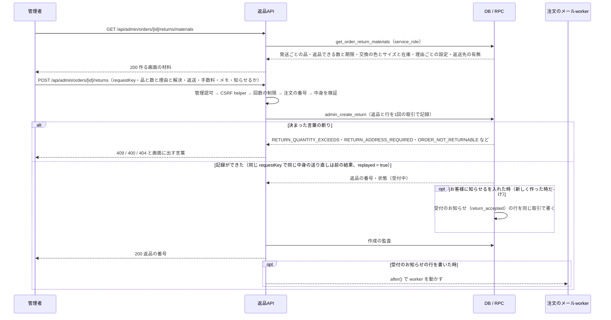
```mermaid
sequenceDiagram
    participant Admin as 管理者
    participant API as 返品API
    participant DB as DB / RPC
    participant Mail as 注文のメールworker
    Admin->>API: GET /api/admin/orders/[id]/returns/materials
    API->>DB: get_order_return_materials（service_role）
    DB-->>API: 発送ごとの品・返品できる数と期限・交換の色とサイズと在庫・理由ごとの設定・返送先の有無
    API-->>Admin: 200 作る画面の材料
    Admin->>API: POST /api/admin/orders/[id]/returns（requestKey・品と数と理由と解決・返送・手数料・メモ・知らせるか）
    API->>API: 管理認可 → CSRF helper → 回数の制限 → 注文の番号 → 中身を検証
    API->>DB: admin_create_return（返品と行を1回の取引で記録）
    alt 決まった言葉の断り
        DB-->>API: RETURN_QUANTITY_EXCEEDS・RETURN_ADDRESS_REQUIRED・ORDER_NOT_RETURNABLE など
        API-->>Admin: 409 / 400 / 404 と画面に出す言葉
    else 記録ができた（同じ requestKey で同じ中身の送り直しは前の結果、replayed = true）
        DB-->>API: 返品の番号・状態（受付中）
        opt お客様に知らせるを入れた時（新しく作った時だけ）
            DB->>DB: 受付のお知らせ（return_accepted）の行を同じ取引で書く
        end
        API->>DB: 作成の監査
        API-->>Admin: 200 返品の番号
        opt 受付のお知らせの行を書いた時
            API-->>Mail: after() で worker を動かす
        end
    end
```

### 例外と永続化

| 条件 | 結果・保存内容 |
| --- | --- |
| 数の確かめ | 返す数は、発送の行ごとの返品できる数まで（`RETURN_QUANTITY_EXCEEDS`）。注文の商品ごとの返品できる数（[注文・決済の状態](../states/order-payment.md) の「返品の記録と状態」）も同時に確かめる。取消・お断りの返品の数は数えない |
| 注文の状態 | 支払い済み・発送済み以外（取り消した注文を含む）は `ORDER_NOT_RETURNABLE` |
| 返送先 | ショップの設定の返送先（名前・郵便番号・住所・電話番号）が空だと `RETURN_ADDRESS_REQUIRED`。返送不要の返品も止める |
| 受付の期限 | 期限を過ぎた発送の品も作れる。画面に警告を出すだけ（段1はお店が作るため） |
| 交換と理由 | 交換の色・サイズは同じ商品の物だけ（`RETURN_EXCHANGE_VARIANT_INVALID`）。理由が「その他」の時は理由のメモが要る（`RETURN_REASON_NOTE_REQUIRED`）。手数料の入力は0以上の整数で、円の欄は1,000,000円まで、返品の手数料の割合は0〜100まで（`RETURN_FEE_INVALID`） |
| 二重防止 | 画面を開いた時に作る番号と、入力の指紋。違う中身は `RETURN_REQUEST_MISMATCH`（409） |
| 番号 | 返品の番号は、注文の行の鍵の中で「その注文の返品の数 + 1」にする（取消の返品も数える。表示は `{注文番号}-R{n}`） |
| 権限 | `admin.orders.return`（店長とサポート） |
| 保存 | 返品の記録（`order_returns`）と行（`order_return_lines`）。「お客様に知らせる」を入れた時だけ、受付のお知らせ（種類 `return_accepted`）の行を同じ取引で書く。在庫・注文の状態・返金は動かさない |
| 監査 | 返品の番号・数・状態・実行した人だけ（`admin.orders.return.create`）。宛先・氏名・住所・メッセージとメモの本文は入れない |

受け取りの前後の小さな操作は、どれも CSRF helper と回数の制限（10分に60回）を通り、お客様にメールを送らない。

| 操作 | 窓口 | 権限 | 起きること |
| --- | --- | --- | --- |
| 取消 | `POST …/returns/[returnId]/cancel` | `admin.orders.return` | 何も受け取る前の受付中だけ。取消にし、品はまた返品できる。処理した数が1点でもある返品は `RETURN_STATE_CONFLICT`（「届かない」で終えて開き直し、まだ何も受け取っていない返品は取り消せる） |
| 届かないで終える | `…/close-missing` | `admin.orders.return` | 残りを `missing` の受け取りの行にして返品を終える（届かない品は返金も交換もしない）。二重防止の番号つき |
| 開き直し | `…/reopen` | `admin.orders.return` | 完了した返品の「届かない」の品を、また受け取れるようにする（`missing_reopened`）。受け取り済みの品は変わらない。開き直しの後は、同じ注文のほかの受付中の返品をid の順（ふつうの返金と同じ）に `private.refresh_order_return_status` で確かめ直す（未処理の数が戻って上限が下がり、返金待ちが覆われた返品を受付中のまま残さないため。注文の鍵の下で行い、完了の返品は受付中に戻さない）。閉じた後にその品をふつうの返金で返していた時は、受け取っても返金待ちにならない（開き直して受け取った返金の品は、ふつうの返金の当て先として先に数えるため）。二重防止の番号つき |
| 検品を終える | `…/inspect` | `admin.orders.return` | 検品待ちの品を、戻す・戻さないに決める（一部でもよい）。戻す分だけ台帳 `return` の +n。二重防止の番号つき |
| 手数料の受け取りの記録 | `…/fee-payment` | `admin.orders.return` と `admin.orders.refund` | 手数料の受け取りを記録するか、`waive: true` で「いただかないで終える」。どちらも、その時の手数料の額を決着した額（`fee_settled_amount`）に移して `fee_due_amount` を0に戻し、お支払い待ちを終え、ほかに待ち物が無ければ返品が完了する |
| 支払いを待たずに送る | `…/release-exchange` | `admin.orders.return` と `admin.orders.refund` | 手数料をお支払い待ちのまま、交換の品を送れるようにする。返品は完了しない |

根拠は [返品の一覧と作る API](../../../src/app/api/admin/orders/%5Bid%5D/returns/route.ts)、[返品の流れ](../../../src/lib/orders/returns/return-service.ts)、[E-3 移行 A](../../../supabase/migrations/20261012235910_order_return_records.sql)、[E-3 移行 B](../../../supabase/migrations/20261013000456_order_return_actions.sql)。

## SQ-ADMIN-10: 返品の受け取り（品ごとの扱い・今返金・相談・交換・お返し）

目的は、届いた品を1点ずつ「在庫に戻す・戻さない・検品待ち・お返し」に決めて記録し、返金（今・額を相談してから）・交換の品の追加・お客様へのお知らせを、1回の取引で書くこと。返金は E-2 と同じ「記録を先に作り、Stripe に頼み、結果を書く」に乗る。事前条件は管理認可（`admin.orders.return`。今返金（お客様の申し込みで返送不要でない返品の計算どおりの場合を除く）・額の指定・送料・交換の選び直しは `admin.orders.refund` も）→ CSRF helper → 回数の制限（送信元ごと・管理者ごと、10分に30回）→ 返品の番号の検証 → 本文の検証を通ること。終了結果は、受け取れた200、DB の断りの400・403・404・409、Stripe の断りの422、答えが分からない502、思いがけない失敗の500。考え方は [グループ E-3 設計書](../../superpowers/specs/2026-10-12-returns-design.md) の 6 章。

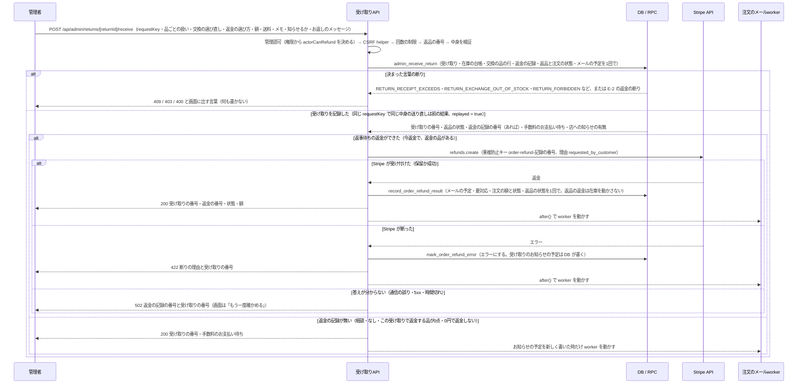
```mermaid
sequenceDiagram
    participant Admin as 管理者
    participant API as 受け取りAPI
    participant DB as DB / RPC
    participant Stripe as Stripe API
    participant Mail as 注文のメールworker
    Admin->>API: POST /api/admin/returns/[returnId]/receive（requestKey・品ごとの扱い・交換の選び直し・返金の選び方・額・送料・メモ・知らせるか・お返しのメッセージ）
    API->>API: 管理認可（権限から actorCanRefund を決める）→ CSRF helper → 回数の制限 → 返品の番号 → 中身を検証
    API->>DB: admin_receive_return（受け取り・在庫の台帳・交換の品の行・返金の記録・返品と注文の状態・メールの予定を1回で）
    alt 決まった言葉の断り
        DB-->>API: RETURN_RECEIPT_EXCEEDS・RETURN_EXCHANGE_OUT_OF_STOCK・RETURN_FORBIDDEN など、または E-2 の返金の断り
        API-->>Admin: 409 / 403 / 400 と画面に出す言葉（何も書かない）
    else 受け取りを記録した（同じ requestKey で同じ中身の送り直しは前の結果、replayed = true）
        DB-->>API: 受け取りの番号・返品の状態・返金の記録の番号（あれば）・手数料のお支払い待ち・店への知らせの有無
        alt 返事待ちの返金ができた（今返金で、返金の品がある）
            API->>Stripe: refunds.create（重複防止キー order-refund-記録の番号、理由 requested_by_customer）
            alt Stripe が受け付けた（保留か成功）
                Stripe-->>API: 返金
                API->>DB: record_order_refund_result（メールの予定・要対応・注文の額と状態・返品の状態を1回で。返品の返金は在庫を動かさない）
                API-->>Admin: 200 受け取りの番号・返金の番号・状態・額
                API-->>Mail: after() で worker を動かす
            else Stripe が断った
                Stripe-->>API: エラー
                API->>DB: mark_order_refund_error（エラーにする。受け取りのお知らせの予定は DB が書く）
                API-->>Admin: 422 断りの理由と受け取りの番号
                API-->>Mail: after() で worker を動かす
            else 答えが分からない（通信の誤り・5xx・時間切れ）
                API-->>Admin: 502 返金の記録の番号と受け取りの番号（画面は「もう一度確かめる」）
            end
        else 返金の記録が無い（相談・なし・この受け取りで返金する品が0点・0円で返金しない）
            API-->>Admin: 200 受け取りの番号・手数料のお支払い待ち
            API-->>Mail: お知らせの予定を新しく書いた時だけ worker を動かす
        end
    end
```

### 例外と永続化

| 条件 | 結果・保存内容 |
| --- | --- |
| 品ごとの扱い | 返品の行ごとに、届いた数を「在庫に戻す（`restocked`）・戻さない（`not_restocked`）・検品待ち（`pending_inspection`。設定で要検品を使う時だけ）・お返し（`sent_back`）」に分ける。残りの数を超えると `RETURN_RECEIPT_EXCEEDS`。一部だけ届いた時は受付中のまま残り、次は残りだけ受け取る。受け取りは取り消せない |
| 在庫 | 在庫に戻した分は台帳 `return` の +n（`stock_movements.return_id` に返品を残す）。受注生産で売った品も、戻すを選べばその色・サイズの在庫に足す。戻さない・お返し・届かないは動かさない。在庫から送る交換は台帳 `exchange` の −n で確保する |
| 返金の選び方 | `now`（今返金。サポートは source = customer_request かつ return_method が not_required でない返品の計算どおりだけ可。ほかは `RETURN_FORBIDDEN`）・`consult`（額を相談してから。返金待ちに残す）・`none`（返金の品が無い受け取り。返金の品を含むと `RETURN_ARGUMENT_INVALID`）。お店が作った返品・返送不要のサポートの受け取りは相談かなしだけで、返金待ちが残る返品は「返金待ち」になる。この受け取りで返金する品が0点（覆われた品だけ・交換だけ・お返しだけ）なら、選び方が今返金・相談でも、受け取りの記録の `refund_choice` は `none` で残す（入力の指紋は入力のまま作るので、同じ入力の送り直しは前の結果を返す。監査の記録は入力の値を書く） |
| 返金額 | 商品の額（E-2 の割り振り）− 手数料（最低0円）+ 送料の返金。店長は返せる額まで直せ、計算との差を `adjustment_amount` に残す（`RETURN_REFUND_AMOUNT_INVALID`）。0円になる時は返金の記録を作らず Stripe にも頼まず、`refund_waived` の受け取りの行で残す（答えは返金の番号なし・状態 `waived`）。お客様に返金のお知らせは出さず、受け取りのお知らせにその旨の一文を入れる。返金する数は数え方の本体で「この受け取りで返金待ちが増える数」として出し、0点の受け取りは、今返金でも返金の記録を作らず（返金の番号・額・状態は空。`waived` ではない）、受け取りだけを記録する。相談でも0点なら手数料の差し引き待ちを足さず、サポートでも店への知らせは予定しない。画面の見込みは覆いを見ないので、この場面では返金ありの見込みが出るが、記録は DB が正（受け入れた食い違い） |
| 交換の品 | 受け取った交換の数だけ、値段0の交換の品の行を足す。在庫が足りない時は、理由の設定「在庫の無い交換」で、作って送る（自動）、店長の選択（`exchangeOverrides`。作って送る・返金に変える）、または `RETURN_EXCHANGE_OUT_OF_STOCK`。同時に別のお客様が最後の1点を買っても、鍵の順番（注文 → 返品 → 返金 → 在庫）で在庫は0より小さくならない。注文が `shipped` なら `paid` に戻る（[注文・決済の状態](../states/order-payment.md) の ST-ORDER-15） |
| お返し | お客様へのメッセージ（必須。`RETURN_SENT_BACK_MESSAGE_REQUIRED`）・配送業者・伝票番号を受け取りの記録に残し、お知らせに必ず入れる。返金も交換もしない |
| メール | 返金のお知らせが出る受け取り（今返金を Stripe が受け付けた）は、返金のお知らせ（返品の書き分け。受け取りとお返しの文もここに入る）が1通。出ない受け取り（相談・なし・交換・返金が0円）は、受け取りの記録と同じ取引で「返品をお受け取りしました」（`return_received`）を予定し、全部をお返しする時は「品物をお返しします」（`return_sent_back`）を予定する。今返金が Stripe に受け付けられずエラーか失敗になった受け取りも返金のお知らせが出ないので、その結果を書く取引（`mark_order_refund_error`・`record_order_refund_result`）で、DB が「返品をお受け取りしました」を予定する（相談の時の一文つき）。サポートの受け取りで記録の選び方が consult になった時だけ、店への知らせ（`return_refund_pending_shop`）も1通予定する。どれも受け取りごとに1行（一意の索引）で、送り直しても2通にならない。「お客様に知らせる」を外すとお客様向けのメールは書かない（お返しを含む時は、メッセージを伝えるために外せない）。相談の一文は、受け取りの記録の選び方が相談の時と、今返金が Stripe に受け付けられずエラーか失敗になった時に入り、返金する品が0点の受け取り（記録が `none`）には入らない |
| 二重防止 | 同じ番号・同じ指紋は前の受け取りと返金の記録を返す（`replayed`）。違う中身は `RETURN_REQUEST_MISMATCH`。Stripe への重複防止キーは返金の記録の番号から作るので、通信が切れて押し直しても Stripe の返金は1件 |
| Stripe が断った・答えが分からない | E-2 の返金と同じ（SQ-ADMIN-03）。422 は返金の記録を「エラー」にし、502 は返事待ちのまま画面が「もう一度確かめる」。受け取りは記録済みなので、本文に受け取りの番号も付く。エラーになった返金で引いた手数料は、返品に戻す。受け取りは取り消さない |
| 保存（Stripe が受け付けた時） | SQ-ADMIN-03 と同じ。返品の返金は、結果を書く関数が返品の状態も確かめ直す。ふつうの返金（道が `return` 以外）の始め・結果・エラーの後も、その注文の受付中の返品の状態を確かめ直す（鍵の順は注文 → 返品 → 返金） |
| 権限 | `admin.orders.return`（店長とサポート）。今返金（お客様の申し込みで返送不要でない返品の計算どおりの場合を除く）・額の指定・送料・交換の選び直しは `admin.orders.refund` も（店長だけ） |
| 監査 | 返品・受け取り・返金の番号・数・額・状態・実行した人だけ（`admin.orders.return.receive`）。宛先・氏名・住所・メッセージとメモの本文は入れない |

根拠は [受け取り API](../../../src/app/api/admin/returns/%5BreturnId%5D/receive/route.ts)、[返品の流れ](../../../src/lib/orders/returns/return-service.ts)、[Stripe への頼み方](../../../src/lib/orders/refund/refund-stripe.ts)、[E-3 移行 C](../../../supabase/migrations/20261013001143_order_return_receipts.sql)。

## SQ-ADMIN-11: 額を決めて返金する（相談の後・サポートの受け取りの後・返金が失敗した後）

目的は、返金待ちの品（相談で受け取った品、サポートが受け取った品、返金が失敗した品）を、店長が額を決めて返すこと。事前条件は管理認可（`admin.orders.return` と `admin.orders.refund`）→ CSRF helper → 回数の制限（送信元ごと・管理者ごと、10分に30回）→ 返品の番号の検証 → 本文の検証を通ること。終了結果は、受け付けた200、返金しないで終えた200（`waived`）、DB の断りの400・404・409、Stripe の断りの422、答えが分からない502、思いがけない失敗の500。考え方は [グループ E-3 設計書](../../superpowers/specs/2026-10-12-returns-design.md) の 6-3。

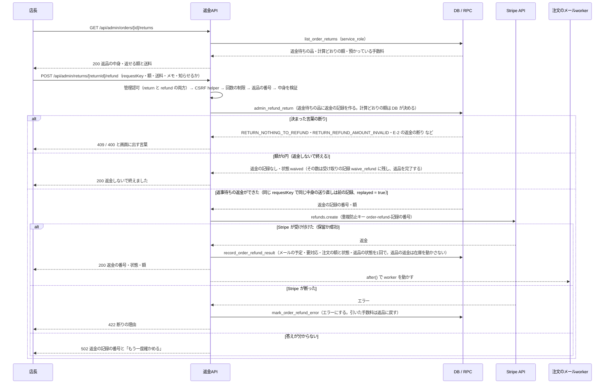
```mermaid
sequenceDiagram
    participant Admin as 店長
    participant API as 返金API
    participant DB as DB / RPC
    participant Stripe as Stripe API
    participant Mail as 注文のメールworker
    Admin->>API: GET /api/admin/orders/[id]/returns
    API->>DB: list_order_returns（service_role）
    DB-->>API: 返金待ちの品・計算どおりの額・預かっている手数料
    API-->>Admin: 200 返品の中身・返せる額と送料
    Admin->>API: POST /api/admin/returns/[returnId]/refund（requestKey・額・送料・メモ・知らせるか）
    API->>API: 管理認可（return と refund の両方）→ CSRF helper → 回数の制限 → 返品の番号 → 中身を検証
    API->>DB: admin_refund_return（返金待ちの品に返金の記録を作る。計算どおりの額は DB が決める）
    alt 決まった言葉の断り
        DB-->>API: RETURN_NOTHING_TO_REFUND・RETURN_REFUND_AMOUNT_INVALID・E-2 の返金の断り など
        API-->>Admin: 409 / 400 と画面に出す言葉
    else 額が0円（返金しないで終える）
        DB-->>API: 返金の記録なし・状態 waived（その数は受け取りの記録 waive_refund に残し、返品を完了する）
        API-->>Admin: 200 返金しないで終えました
    else 返事待ちの返金ができた（同じ requestKey で同じ中身の送り直しは前の記録、replayed = true）
        DB-->>API: 返金の記録の番号・額
        API->>Stripe: refunds.create（重複防止キー order-refund-記録の番号）
        alt Stripe が受け付けた（保留か成功）
            Stripe-->>API: 返金
            API->>DB: record_order_refund_result（メールの予定・要対応・注文の額と状態・返品の状態を1回で。返品の返金は在庫を動かさない）
            API-->>Admin: 200 返金の番号・状態・額
            API-->>Mail: after() で worker を動かす
        else Stripe が断った
            Stripe-->>API: エラー
            API->>DB: mark_order_refund_error（エラーにする。引いた手数料は返品に戻す）
            API-->>Admin: 422 断りの理由
        else 答えが分からない
            API-->>Admin: 502 返金の記録の番号と「もう一度確かめる」
        end
    end
```

### 例外と永続化

| 条件 | 結果・保存内容 |
| --- | --- |
| 額 | 「計算どおり」（額を送らない）は、返金待ちの品の商品の額（E-2 の割り振り）から、相談で預かっていた手数料（`fee_pending_deduction`）を引いた額（最低0円）+ 送料。店長は返せる額（受け取った額 − 返事待ち・保留・成功の返金の合計）まで直せる（`RETURN_REFUND_AMOUNT_INVALID`）。額0は返金しないで終える |
| 返金待ちの品が無い | `RETURN_NOTHING_TO_REFUND`（画面を開き直す） |
| 返金しないで終える | 返金の記録を作らず、Stripe にも頼まない。その数を受け取りの記録（`kind = 'waive_refund'`、行は `refund_waived`）に残し、返品を確かめ直して完了する。お客様にメールは送らない（額を相談した中でお店が伝える）。権限は今返金と同じ（店長） |
| 失敗した後の返し直し | 新しい二重防止の番号で、新しい返金の記録を作り、新しい記録の番号の重複防止キーで頼む（断られた記録のキーは使い回さない）。道は `return` のまま。要対応の「返金の失敗」の「もう一度返金する」は、返品の返金の時は注文の返品の画面を開く（ふつうの返金の画面では返金待ちの品を選べないため） |
| メール | Stripe が受け付けた時の1回だけ、返金のお知らせ（返品の書き分け。「ご返品いただいた商品のご返金です」の一文つき）を1通予定する。返金しないで終える時は出さない |
| 返品の状態 | 返金の記録を作った時点で返金待ちが無くなれば、返品は完了する。返金が失敗しても完了は戻らず、覆いが外れて「返金待ち」に戻る |
| 二重防止・Stripe が断った・答えが分からない | SQ-ADMIN-03・SQ-ADMIN-10 と同じ |
| 権限・監査 | `admin.orders.return` と `admin.orders.refund`（店長だけ）。監査は `admin.orders.return.refund`（返金・返品の番号・額・数・状態・実行した人だけ） |

根拠は [額を決めて返金する API](../../../src/app/api/admin/returns/%5BreturnId%5D/refund/route.ts)、[返品の流れ](../../../src/lib/orders/returns/return-service.ts)、[E-3 移行 C](../../../supabase/migrations/20261013001143_order_return_receipts.sql)。

## 通知・履歴・要確認の別軸

| 項目 | 現行処理 |
| --- | --- |
| 取消・発送のメール | 取消・発送のメールは、状態を変える関数が同じ取引で送る予定の行を書き、worker が行の番号から作った重複防止キーで送る。失敗はやり直し、送れなければ店へ知らせる（FREQ-434・435）。発送のメールは発送ごとに1行で、取り消した発送のまだ送っていない行は取りやめになる（FREQ-442・443）。返金のお知らせは返金ごとに1行、支払い済みのキャンセルのお知らせ（種類 `canceled`・書き分け `paid`）も返金ごとに1行で、結果を書く関数が Stripe の受け付けた時（残高不足の保留は成功した時）に1回だけ書く（FREQ-455・456） |
| 返品のメール | 返品のメールの予定の種類は4つ。受付のお知らせ（`return_accepted`。返品ごとに1行）、返品をお受け取りしました（`return_received`）・品物をお返しします（`return_sent_back`）・店への知らせ（`return_refund_pending_shop`。送り先は環境変数 `SHOP_ALERT_EMAIL`）は、受け取りごとに1行。ほかに、返金のお知らせの書き分け `return`（受け取りと一緒の返金・額を決めて返した返金）と、発送のお知らせの交換の一文がある。どれも状態を書く関数が同じ取引で行を書き、worker が送る。返品の4種類は履歴からの再送の対象にならない（`RESEND_NOT_ALLOWED`）（グループ E-3。FREQ-469） |
| 発送の選択 | `notifyCustomer`（真偽、既定 true）が false なら、その発送のメールの行を書かない（FREQ-438。グループ E-1 から発送ごとに選ぶ） |
| 履歴 | RPCがactor・理由を設定し、order_revisionsに変更前後・変更列等を記録する。返金ではrefund_update、状態変更ではstatus_update等として記録。状態が変わらない一部の発送・仕上がりとそれらの取消は、発送の表・仕上がりの表から読んで同じ履歴に並べる（グループ E-1）。返金は返金の記録（`order_refunds`）から読んで同じ履歴に並べ、失敗の確保し直しも1行にする（グループ E-2。FREQ-459）。返品は返品の記録・受け取りの記録・手数料の記録から読んで同じ履歴に並べる（返品を作った・返品の受け取り（細目つき）・「届かない」として終えた・検品を終えた・取り消した・開き直した・交換の品を足した・手数料の受け取りを記録した・いただかないことにした・支払いを待たずに送れるようにした・返金しないで終えた。返金の行の「どこから」は「返品（番号）」。グループ E-3。FREQ-474） |
| 要確認 | [review API](../../../src/app/api/admin/orders/%5Bid%5D/review/route.ts)は管理認可・CSRF後にmark_order_reviewed。review_reasonあり・reviewed_atなしを条件にreviewed_at/byを保存し、reasonを消さない。要対応resolveとは別操作 |
| 返金の失敗 | 返金が失敗になった時、結果を書く関数が要対応（理由 `refund_failed`）を作り、アプリが店へ1通メールする（今の要対応の知らせと同じ。送る前に送信権を押さえる）。キャンセルのお知らせを送っていた注文が支払い済みに戻った時は、その旨をメールに書く。お客様へは自動のメールを送らない。管理画面の要対応で「もう一度返金する」か、別の方法で返したら「解決済みにする」（FREQ-457）。失敗した返金が返品の返金の時は、「もう一度返金する」が注文の返品の画面を開き、そこの「額を決めて返金する」で返し直す（グループ E-3。SQ-ADMIN-11） |
| API応答と外部副作用 | 先行RPCやStripeの成功後に後続処理が失敗する場合がある。応答コードだけから取消・返金・メールの全結果を判断しない |

根拠: [worker](../../../src/lib/orders/email/order-email-worker.ts)、[中身](../../../src/lib/orders/email/order-email-compose.ts)、[履歴トリガー](../../../supabase/migrations/20260925000218_add_order_state_transition_rpcs.sql)、[状態の履歴](../../../supabase/migrations/20261009095633_order_email_outbox.sql#L606)、[要確認RPC](../../../supabase/migrations/20260927100500_payment_exceptions.sql)。

## 関連テスト

| 観点 | 参照 |
| --- | --- |
| 発送・仕上がり・取消・競合 | [発送・仕上がりのDB](../../../tests/integration/db/order_fulfillments.integration.test.ts)、[発送ごとのメールのDB](../../../tests/integration/db/fulfillment_order_emails.integration.test.ts)、[E2E 部分発送](../../../e2e/FR-ADMIN-116-packing-shipment-slips.spec.ts)、[E2E 発送の取消](../../../e2e/FR-ADMIN-117-shipment-slip-actions.spec.ts) |
| 通常取消・競合 | [在庫解放RPC](../../../tests/integration/db/release_stock_by_order.integration.test.ts) |
| 管理返金・確かめ直し・支払い済みのキャンセル | [refund API](../../../tests/unit/api/admin/order-refund-route.test.ts)、[返金を始めるDB](../../../tests/integration/db/order_refund_requests.integration.test.ts)、[E2E 返金の画面](../../../e2e/FR-ADMIN-074-refund-dialog.spec.ts)、[E2E 支払い済みのキャンセル](../../../e2e/FR-ADMIN-075-paid-order-cancel.spec.ts) |
| 結果の書き方・外からの返金・取り込みと見回り・自動の返金 | [返金の結果のDB](../../../tests/integration/db/order_refund_results.integration.test.ts)、[返金の取り込み](../../../tests/unit/lib/stripe/order-refund-sync.test.ts)、[E2E Stripe の画面からの返金](../../../e2e/FR-ADMIN-080-stripe-dashboard-refund.spec.ts)、[E2E 自動の返金①](../../../e2e/FR-CHECKOUT-051-auto-refund-cancelled-order.spec.ts) |
| 返品を作る・受け取る・額を決めて返金する | [返品の記録のDB](../../../tests/integration/db/order_return_records.integration.test.ts)、[返品の操作のDB](../../../tests/integration/db/order_return_actions.integration.test.ts)、[返品の受け取りのDB](../../../tests/integration/db/order_return_receipts.integration.test.ts)、[返品の窓口を通したDB](../../../tests/integration/db/return_postgrest.integration.test.ts)、[返品の流れ](../../../tests/unit/lib/orders/returns/return-service.test.ts)、[E2E 作る](../../../e2e/FR-ADMIN-084-return-create.spec.ts)、[E2E 受け取りと返金](../../../e2e/FR-ADMIN-085-return-receive-refund.spec.ts)、[E2E 相談と額を決めて返金](../../../e2e/FR-ADMIN-087-return-consult-refund.spec.ts)、[E2E 交換](../../../e2e/FR-ADMIN-088-return-exchange.spec.ts) |
| 解決・取消前のStripe確認・要確認 | [要対応API](../../../tests/unit/api/admin/order-attention-route.test.ts)、[例外RPC](../../../tests/integration/db/payment_exceptions.integration.test.ts) |
| 注文のメール | [中身](../../../tests/unit/lib/orders/email/order-email-compose.test.ts)、[worker](../../../tests/unit/lib/orders/email/order-email-worker.test.ts)、[送る予定の表](../../../tests/integration/db/order_email_outbox.integration.test.ts)、[行を書く関数](../../../tests/integration/db/order_email_enqueue.integration.test.ts)、[発送ごとのメール](../../../e2e/FR-ADMIN-120-combined-shipment-emails.spec.ts) |

関連テストは今回実行していない。DBや外部決済を操作した成功証跡ではない。

## 未確認事項

本番のRPC・トリガー・権限適用、実際の管理者ACL、Stripeの入金・返金結果、外部確認とDB更新の競合、メール到達は未確認。[pendingの状態強制](../../../supabase/pending/harden_order_state_transitions.sql)は実適用を確認せずに有効と断定しない。SQLコメントの計画と現行APIの呼出し経路を区別する。グループ E-2 の毎時の見回り・毎晩の照合は、定期処理が本番に登録されるまで動かず、Stripe の本番の受け口に返金の4つの知らせを入れたかも未確認（どちらも開店前の設定）。グループ E-3 の返品の移行 A〜C（`20261012235910`〜`20261013001143`）は、2026-10-13 に本番へ適用済み（20261012235910・20261013000456・20261013001143）。受け取りで今返金する道の Stripe のテストの場での実際の返金は、管理者の権限の行が手元の DB に無いため、窓口を差し替える E2E では行わず、Stripe を差し替えた単体の試験と DB 結合の試験で確かめている。

最終照合のコード基準はmasterの`bbb18761`と、2026-10-04の作業ツリーにある決済・返金ライブラリの未コミット変更。取消・出荷のCSRF前段ガードと、返金同期の呼出し元・全額返金の扱いを静的に確認した。今回、コードの実行テストと本番反映は確認していない。

## SQ-ADMIN-12: 写真を送って返品を申し込む（E-3 段2）

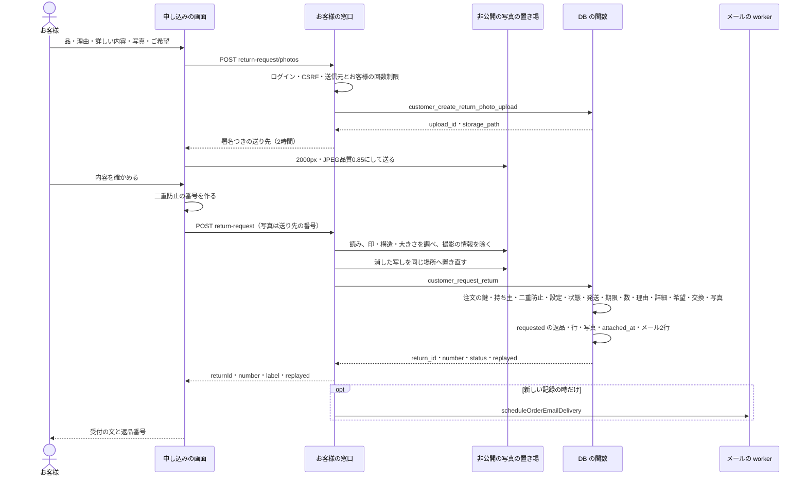
```mermaid
sequenceDiagram
  actor Customer as お客様
  participant UI as 申し込みの画面
  participant API as お客様の窓口
  participant Storage as 非公開の写真の置き場
  participant DB as DB の関数
  participant Worker as メールの worker
  Customer->>UI: 品・理由・詳しい内容・写真・ご希望
  UI->>API: POST return-request/photos
  API->>API: ログイン・CSRF・送信元とお客様の回数制限
  API->>DB: customer_create_return_photo_upload
  DB-->>API: upload_id・storage_path
  API-->>UI: 署名つきの送り先（2時間）
  UI->>Storage: 2000px・JPEG品質0.85にして送る
  Customer->>UI: 内容を確かめる
  UI->>UI: 二重防止の番号を作る
  UI->>API: POST return-request（写真は送り先の番号）
  API->>Storage: 読み、印・構造・大きさを調べ、撮影の情報を除く
  API->>Storage: 消した写しを同じ場所へ置き直す
  API->>DB: customer_request_return
  DB->>DB: 注文の鍵・持ち主・二重防止・設定・状態・発送・期限・数・理由・詳細・希望・交換・写真
  DB->>DB: requested の返品・行・写真・attached_at・メール2行
  DB-->>API: return_id・number・status・replayed
  API-->>UI: returnId・number・label・replayed
  opt 新しい記録の時だけ
    API->>Worker: scheduleOrderEmailDelivery
  end
  UI-->>Customer: 受付の文と返品番号
```

写真を確かめてから DB を呼ぶ。送り先は作成後23時間以内で、未使用の消去の1日と1時間あける。通信切れ・500番台は同じ番号・本文で確認し、同じ写真でも再確認できる。持ち主を先に確かめ、同じ指紋は前の返品・写真・予定のまま返す。違う本文は RETURN_REQUEST_MISMATCH。未知の理由・数量超過・期限切れ・不正な写真は DB も断る。

## SQ-ADMIN-13: 申し込みを承認・お断りする（E-3 段2）

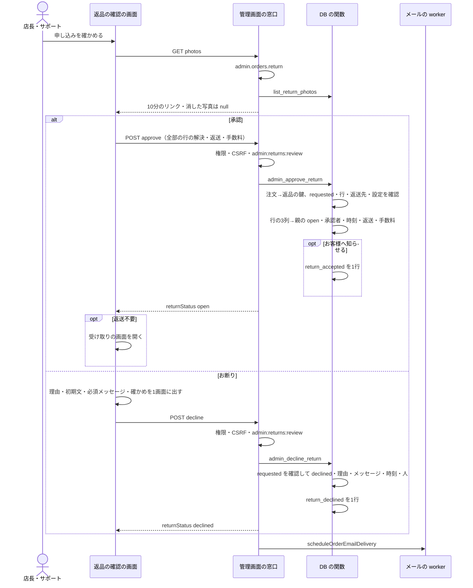
```mermaid
sequenceDiagram
  actor Staff as 店長・サポート
  participant UI as 返品の確認の画面
  participant API as 管理画面の窓口
  participant DB as DB の関数
  participant Worker as メールの worker
  Staff->>UI: 申し込みを確かめる
  UI->>API: GET photos
  API->>API: admin.orders.return
  API->>DB: list_return_photos
  API-->>UI: 10分のリンク・消した写真は null
  alt 承認
    UI->>API: POST approve（全部の行の解決・返送・手数料）
    API->>API: 権限・CSRF・admin:returns:review
    API->>DB: admin_approve_return
    DB->>DB: 注文→返品の鍵、requested・行・返送先・設定を確認
    DB->>DB: 行の3列→親の open・承認者・時刻・返送・手数料
    opt お客様へ知らせる
      DB->>DB: return_accepted を1行
    end
    API-->>UI: returnStatus open
    opt 返送不要
      UI->>UI: 受け取りの画面を開く
    end
  else お断り
    UI->>UI: 理由・初期文・必須メッセージ・確かめを1画面に出す
    UI->>API: POST decline
    API->>API: 権限・CSRF・admin:returns:review
    API->>DB: admin_decline_return
    DB->>DB: requested を確認して declined・理由・メッセージ・時刻・人
    DB->>DB: return_declined を1行
    API-->>UI: returnStatus declined
  end
  API->>Worker: scheduleOrderEmailDelivery
```

承認とお断りは状態で二重防止し、2回目は RETURN_STATE_CONFLICT。返品の数・理由・詳しい内容・ご希望は変えない。サポートの受け取りの今返金は、お客様の申し込みで返送不要でない返品だけ。窓口は now を DB に渡し、額・送料・上書きは403。DB は計算額と E-2 の不変条件を確認する。Stripe の返事が不明なら元の返金の番号・キー・本文で確認し、受け取りを重ねない。

## SQ-ADMIN-14: キャンセルを申し込み、品を外して解決する（E-3 段2）

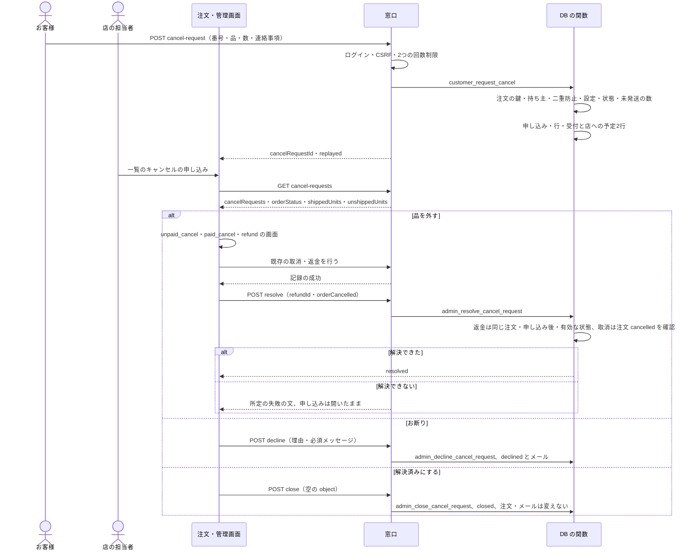
```mermaid
sequenceDiagram
  actor Customer as お客様
  actor Staff as 店の担当者
  participant UI as 注文・管理画面
  participant API as 窓口
  participant DB as DB の関数
  Customer->>API: POST cancel-request（番号・品・数・連絡事項）
  API->>API: ログイン・CSRF・2つの回数制限
  API->>DB: customer_request_cancel
  DB->>DB: 注文の鍵・持ち主・二重防止・設定・状態・未発送の数
  DB->>DB: 申し込み・行・受付と店への予定2行
  API-->>UI: cancelRequestId・replayed
  Staff->>UI: 一覧のキャンセルの申し込み
  UI->>API: GET cancel-requests
  API-->>UI: cancelRequests・orderStatus・shippedUnits・unshippedUnits
  alt 品を外す
    UI->>UI: unpaid_cancel・paid_cancel・refund の画面
    UI->>API: 既存の取消・返金を行う
    API-->>UI: 記録の成功
    UI->>API: POST resolve（refundId・orderCancelled）
    API->>DB: admin_resolve_cancel_request
    DB->>DB: 返金は同じ注文・申し込み後・有効な状態、取消は注文 cancelled を確認
    alt 解決できた
      DB-->>UI: resolved
    else 解決できない
      API-->>UI: 所定の失敗の文、申し込みは開いたまま
    end
  else お断り
    UI->>API: POST decline（理由・必須メッセージ）
    API->>DB: admin_decline_cancel_request、declined とメール
  else 解決済みにする
    UI->>API: POST close（空の object）
    API->>DB: admin_close_cancel_request、closed、注文・メールは変えない
  end
```

未入金の取消は注文全体。paid_cancel は店長だけで、発送0・申し込み数が全未発送と同じ時。他の支払い済みは返金の発送前の品へ申し込みを入れる。resolve の失敗で返金を再実行しない。最後の解決済みは人が確かめて閉じる。履歴は返品と同じ type: 'return' で、お客様の行の actorEmail とキャンセルの行の returnId は null。

E-3 段2は移行 D・E・F の順で先に DB を用意する。2026-10-21 に本番へ適用済み（20261020144439・20261020144842・20261020150415）。管理画面の E2E は窓口を差し替えるため、実際の Stripe の返金・本番の Storage と配達の通しの確認は開店前に残る。

## 配送の状態と処理（E-4 / FREQ-488〜497）

[配送の詳細設計](../../superpowers/specs/2026-10-21-delivery-status-design.md)・[実装計画](../../superpowers/plans/2026-10-21-delivery-status.md)を参照。以下は実装後の契約であり、既存の決定の本文は履歴として残す。

| 順序 | 番号の直し・手の配達済み・要対応の解決 |
| --- | --- |
| 1 | 履歴内のdialogでrequestKeyを作り、UUID・業者・番号または日付・notifyを送る。対応済みだけ本文は空object |
| 2 | admin.orders.manage → CSRF → IP → actorの制限。trackingとresolveは60回/600秒、deliveredは30回/600秒。入力をstrictに検証 |
| 3 | DB関数が注文 → 発送をlock。requestKeyと入力指紋を検証し、同じ入力なら元の結果、異なる入力なら409 |
| 4 | 同一取引で発送の現在値・追記の出来事/番号変更・登録の停止/新しい予定・要対応の閉鎖・メール予定を保存 |
| 5 | 監査と応答の後after()でメールworker、番号の直しでは追跡workerも起動。通信が切れて結果不明なら同じキーと本文で再確認 |
| 6 | 履歴と一覧を読み直す。取り消した発送は変更不可、配達済みへの手の再操作も拒否。配達済みの番号変更は警告して許可 |

番号の直しはnotifyをこの先にも反映し、オンならshipping_updateを直し1件につき1通。手の配達済みのメールは発送と操作の両notifyがオンの時だけ。同じ発送の作成を再送しても、変更済みの番号を元に戻さない。

設定の操作は店長が確認の件数をGETし、保存の直前に再GETして既存2トグルと鍵の有無を確かめる。読取失敗や鍵なしならONを送らない。返品 → 既存トグル → 配送の別取引の保存と部分監査を維持する。

### 番号の直しと手の配達済みの流れ

> G-4 Task 8: 伝票番号の訂正・手動の配達済みの旧い窓口（`…/fulfillments/[fulfillmentId]/tracking`・`/delivered`）は route ごと撤去した。履歴の dialog（`OrderHistoryDialog`）から操作する入口は G-1 Task 15 で削除済みで、今の流れは発送票の窓口（[発送票の流れ](shipping.md)）。以下の図は撤去前の記録。

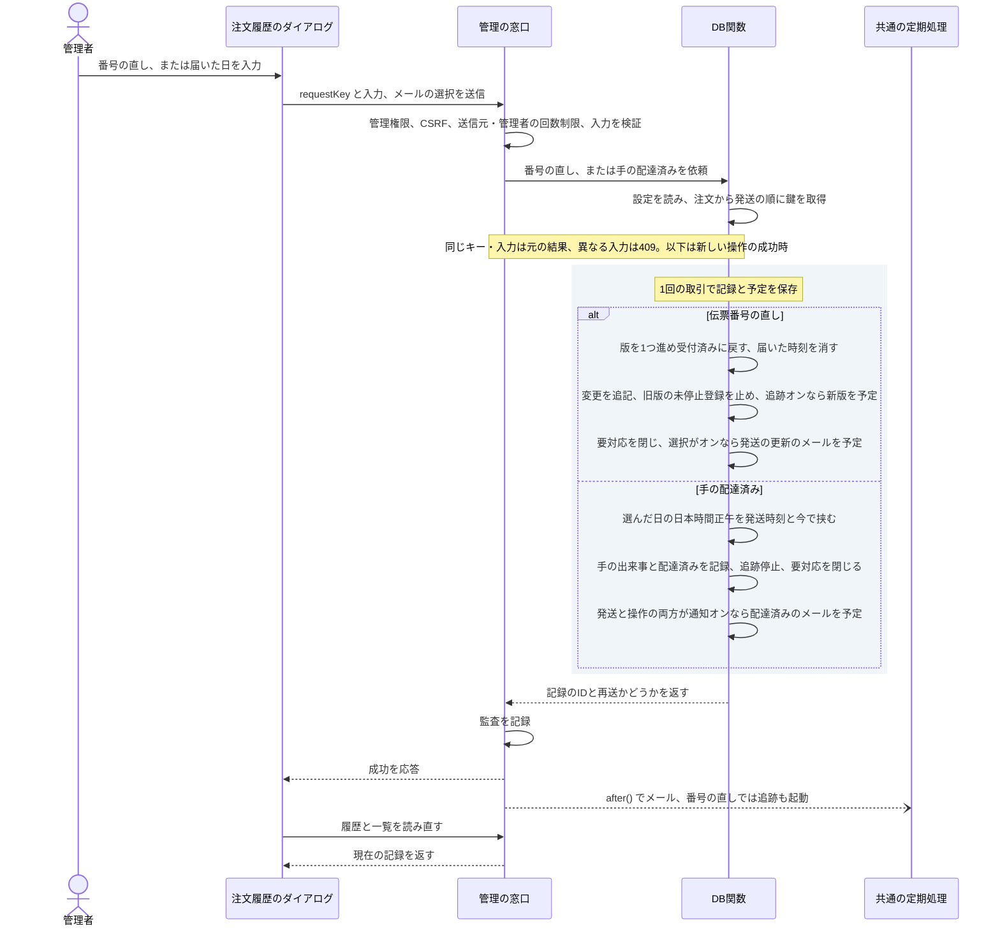
```mermaid
sequenceDiagram
  actor Admin as 管理者
  participant Dialog as 注文履歴のダイアログ
  participant Route as 管理の窓口
  participant DB as DB関数
  participant Worker as 共通の定期処理
  Admin->>Dialog: 番号の直し、または届いた日を入力
  Dialog->>Route: requestKey と入力、メールの選択を送信
  Route->>Route: 管理権限、CSRF、送信元・管理者の回数制限、入力を検証
  Route->>DB: 番号の直し、または手の配達済みを依頼
  DB->>DB: 設定を読み、注文から発送の順に鍵を取得
  Note over Route,DB: 同じキー・入力は元の結果、異なる入力は409。以下は新しい操作の成功時
  rect rgb(240, 245, 250)
    Note over DB: 1回の取引で記録と予定を保存
    alt 伝票番号の直し
      DB->>DB: 版を1つ進め受付済みに戻す、届いた時刻を消す
      DB->>DB: 変更を追記、旧版の未停止登録を止め、追跡オンなら新版を予定
      DB->>DB: 要対応を閉じ、選択がオンなら発送の更新のメールを予定
    else 手の配達済み
      DB->>DB: 選んだ日の日本時間正午を発送時刻と今で挟む
      DB->>DB: 手の出来事と配達済みを記録、追跡停止、要対応を閉じる
      DB->>DB: 発送と操作の両方が通知オンなら配達済みのメールを予定
    end
  end
  DB-->>Route: 記録のIDと再送かどうかを返す
  Route->>Route: 監査を記録
  Route-->>Dialog: 成功を応答
  Route--)Worker: after() でメール、番号の直しでは追跡も起動
  Dialog->>Route: 履歴と一覧を読み直す
  Route-->>Dialog: 現在の記録を返す
```

## 注文状況のメールと閲覧（E-5 / FREQ-498〜505）

[詳細設計](../../superpowers/specs/2026-10-22-order-status-page-design.md)・[実装計画](../../superpowers/plans/2026-10-22-order-status-page.md)・[ページ仕様](../pages/20_order_status.md)を参照。既存の管理の状態更新とメール予定の作成は変えず、新しい本文の用意からリンクを作る。

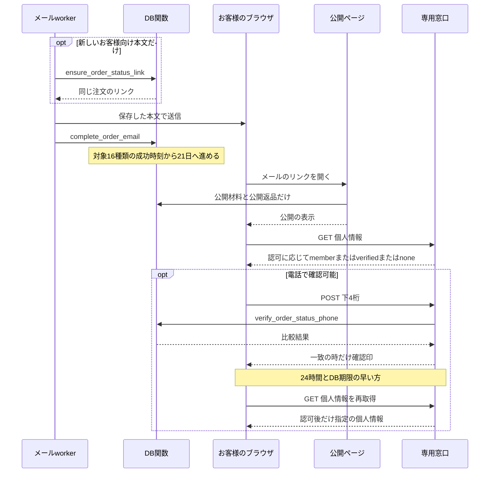
```mermaid
sequenceDiagram
  participant Worker as メールworker
  participant DB as DB関数
  participant User as お客様のブラウザ
  participant Page as 公開ページ
  participant API as 専用窓口
  opt 新しいお客様向け本文だけ
    Worker->>DB: ensure_order_status_link
    DB-->>Worker: 同じ注文のリンク
  end
  Worker->>User: 保存した本文で送信
  Worker->>DB: complete_order_email
  Note over DB: 対象16種類の成功時刻から21日へ進める
  User->>Page: メールのリンクを開く
  Page->>DB: 公開材料と公開返品だけ
  Page-->>User: 公開の表示
  User->>API: GET 個人情報
  API-->>User: 認可に応じてmemberまたはverifiedまたはnone
  opt 電話で確認可能
    User->>API: POST 下4桁
    API->>DB: verify_order_status_phone
    DB-->>API: 比較結果
    API-->>User: 一致の時だけ確認印
    Note over API,User: 24時間とDB期限の早い方
    User->>API: GET 個人情報を再取得
    API-->>User: 認可後だけ指定の個人情報
  end
```

送信期限の更新はlease一致の成功と同じ取引。保存済み本文ではリンク準備・本文再生成をせず、そのまま送る。個人情報の認可は有効な印が先で、無ければ持ち主の認証。公開ページではCookieを書かず、未認可の普通のゲストは200のnone。

## SQ-ADMIN-15: 注文の詳細からの操作と読み直し（G-4 Task 6 / FREQ-539・FREQ-523-AC-05）

確認日: 2026-10-26。`/admin/orders/[id]` の詳細の頁が、返金・未入金の取消・支払い済みのキャンセル・返品・キャンセルの申し込み・確認済み・割当の入替を呼び、**操作の後に詳細と履歴を読み直す**流れ。各操作の窓口・認可・CSRF・回数制限・DB・メールは今までのまま（SQ-ADMIN-03〜14）で、この節は画面側の順序だけを足す。旧 `/admin?tab=ORDER` の一覧の同じ操作は Task 7 まで残る。

```mermaid
sequenceDiagram
  actor Admin as 管理者
  participant Page as 詳細の頁
  participant API as 各操作の窓口
  participant Detail as GET /api/admin/orders/[id]
  participant Hist as GET /api/admin/orders/[id]/history

  Admin->>Page: 頁を開く（?open= があれば付く）
  Page->>Detail: 読む（no-store、番号つき）
  Detail-->>Page: 詳細（summary・permissions・rows・attention・fulfillments・slips）
  Page->>Hist: 履歴の欄が読む（itemStates を含む）
  opt ?open= の操作を出せる注文
    Page->>Page: 対応する dialog を開き、router.replace で query を消す
  end
  Admin->>Page: 操作（返金・取消・返品・申し込み・確認済み・入替）
  Page->>API: 今までの窓口へ今までの本文で送る
  alt 受理・成功
    API-->>Page: 結果
    opt 品を外した返金・取消（申し込みの解決待ち）
      Page->>API: POST /api/admin/cancel-requests/[id]/resolve（受理後だけ）
    end
    Page->>Detail: 読み直す（成功の知らせを添える）
    Page->>Hist: 履歴の欄も読み直す
  else 結果不明・dialog を閉じた
    Page->>Detail: 読み直す（知らせは出さない）
  else 断り
    API-->>Page: 固定の文（dialog の中、または頁の上）
  end
  alt 読み直しに失敗
    Detail-->>Page: 失敗
    Page-->>Admin: 前の詳細を残し、最新の状態を読み込めませんでした。／この画面の内容は最新ではありません。／読み込み直す
  end
```

- **最後に始めた読みだけを使う**: 読みごとに番号を付け、遅れて返った古い読みは詳細・古い印・知らせのどれも上書きしない。画面を離れた後に返った読みも捨てる。
- **古い印**: 読み直しに失敗した時だけ `stale` にして前の詳細を残す。操作の成功の知らせは出さない。読み直しに成功すれば外す。最初の読込の失敗は古い詳細がないので固定の失敗の文を出す。
- **申し込みの解決**: 品を外した返金・支払い済みのキャンセル・未入金の取消が**受理された後にだけ**解決の窓口を呼ぶ。解決だけが失敗した時は、返金・キャンセルは記録済みで申し込みが開いたままだと案内する（旧頁と同じ文）。dialog を閉じた・結果不明では解決しない。
- **入替**: dialog が候補を読み、`POST …/allocations/swap` を `useDeliverySubmission` で1回送る。結果不明は同じ要求番号と本文で「もう一度確かめる」。断られた時は dialog の中に固定の本文を出して入力を残し、詳細を読み直す。成功で dialog を閉じ、「割当を入れ替えました。」を出して詳細を読み直す。
- **旧頁との違い（意図したもの）**: (1) 成功後に一覧と要対応の欄ではなくこの注文の詳細と履歴を読み直す。断られた・失敗した操作の後にも詳細を読み直す（状態が変わっていた時に古い入口を残さない）。読み直しの先頭で前の知らせと頁の誤りの文を消す（旧頁の `fetchOrders` と同じ）ので、解決だけの失敗の案内のような誤りの文は、読み直しを始めた後に入れる。次の読み直し（申し込みの解決・返品・入替・「読み込み直す」）で古い誤りが成功の知らせと並ばない。(2) `readSafeOrderActionError` は 400・409 の短い日本語（制御文字なし、200字以下）だけを通す（旧頁は200字以下なら何でも通した）。(3) 取消の画面は旧頁と同じく、送信の成功後に申し込みの解決と読み直しを待たず（非同期で始めて）画面を閉じる。待つと遅い読込の間「処理中」のまま閉じられないため、閉じるのを止める守りは入れない。取消の通信が切れた時の文は旧頁と同じ（変えない）。

[詳細頁の部品の単体](../../../tests/unit/components/AdminOrderDetailSection.test.tsx)・[入替dialogの単体](../../../tests/unit/components/AllocationSwapDialog.test.tsx)で検証する。DB・実ブラウザ・E2Eはcontroller担当（未実行）。

**入口（G-4 Task 8）**: 詳細の頁へは、注文一覧表の行・要対応の欄に加えて、荷作り表の注文ID（`PackingSection`）と発送票の注文番号（`ShipmentSlipSection`。同梱する品物の表・追加の候補・発送票の確認の見出し・確定済みの票の「注文ごとの発送」の4か所）の Link（`/admin/orders/[id]`）から入る。荷作り表から注文の履歴を dialog で開く入口は撤去した。詳細の「発送」の欄からは、発送が属する発送票へ Link（`/admin/shipment-slips/[id]`）で戻れる。履歴は詳細の頁の「変更履歴」の欄（`OrderHistoryPanel`。`OrderHistoryDialog` から改名し、dialog の形を畳んだ）が `GET /api/admin/orders/[id]/history` を読み、画面の切り替えと再送の流れは変えない。

## SQ-ADMIN-16: 割引の予約・入金の確定・上限超過の要対応（H Task 7 / FREQ-549）

確認日: 2026-10-29。割引の使用（[redemption の状態](../states/discount-redemptions.md)）が、注文の受付・入金・未入金終了と**同じ取引で**動く順序と、遅れた入金を受けた時に要対応の欄へ 1 件だけ出る流れ。実装は [H4 移行](../../../supabase/migrations/20261029130300_group_h_discounts_acceptance.sql)。金額・在庫・FIFO・カートの削除・メールの順は今までのまま、割引の手順を足すだけ。

```mermaid
sequenceDiagram
  actor Buyer as お客様
  participant Route as POST /api/checkout/place-order
  participant Place as place_order_from_checkout_draft
  participant Rec as 照合（reconciler）
  participant Fb as place_reconciled_order_from_checkout_draft
  participant Paid as mark_order_paid / awaiting / release
  participant Admin as 管理者（/admin/orders#attention）

  Buyer->>Route: 注文する
  Route->>Place: Stripe の実額と Session
  Note over Place: G共通鍵 → H目録 → 本人鍵 → 割引id鍵 → G在庫の鍵
  Place->>Place: 固定draftの額・本人を照合し、入力codeと自動割引を再確認
  alt 入力codeが使えない
    Place-->>Route: rejection（discount_*）、注文・在庫・予約は0
    Route-->>Buyer: 409 入力へ戻す
  else 自動割引だけ条件を失った
    Place-->>Route: rejection=discount_automatic_changed
    Route->>Route: 古い未払いSessionを失効
    Route-->>Buyer: 200 reconfirmationRequired（新しい最終確認）
  else 受け付ける
    Place->>Place: 注文・在庫・割引の配分と1着の額・正額の使用予約（reserved）を同じ取引で書く
    Place-->>Route: 注文（payment_in_progress）
  end
  Rec->>Fb: 受付を通らない paid / awaiting_payment（実額と固定結果）
  Fb->>Fb: 現在の割引条件では拒否せず、注文・予約（reconciliation_fallback）を作る
  Paid->>Paid: 入金 settle(true): reserved/cancelled → confirmed（超過・fallback なら印）
  Paid->>Paid: 未入金終了 settle(false): reserved → cancelled（入金済みなら何もしない）
  Admin->>Admin: 割引の上限を超えた注文／割引の条件を確認する注文 → 確認済みにする（表示だけ閉じる）
```

- **業務拒否は書かない**: 入力 code の拒否は例外ではなく `rejection` 列で返し、注文・在庫 hold・使用・コピーを 1 行も作らない。自動割引だけが条件を失った時はコード側を変えず、route が古い Session を失効して新しい固定額の最終確認を表示する。失効に失敗したら古い clientSecret で決済させず 503。失効が実入金と競合したら再計算せず照合の注文を返す。
- **照合は拒否しない**: `place_reconciled_order_from_checkout_draft`（service_role のみ、状態は `paid` / `awaiting_payment`）は金額・通貨・所有者・固定 snapshot を保つが、現在の回数・1 人 1 回・期間・停止・割当・初回・着数では拒否しない。誤って `discount_*` が返ったら `discount_reconciliation_contract_violation` の一時エラーでキューが再試行し、既存の 9 回で dead になり運用警告へ残る（成功扱いにも無限再試行にもしない）。
- **確定と取消**: `mark_order_paid`・`record_cancelled_order_paid_amount` の実入金は `confirmed` へ、`release_stock_for_unpaid_order` の未入金終了は `cancelled` へ。入金済みの注文は取消・返金・返品で `confirmed` を戻さない。
- **要対応**: 上限・1 人 1 回・単発 code の超過は `discount_limit_exceeded`（「割引の上限を超えた注文」）、予約なし・取消後・fallback の回復は `discount_reconciliation_recovered`（「割引の条件を確認する注文」）。1 注文 1 件で、配送・支払いの要対応とは別の欄に出し、発送を止めない。「確認済みにする」は `POST /api/admin/order-attention/discounts/[orderId]/resolve`（`admin.orders.manage`）。

[Route](../../../tests/unit/api/checkout/place-order-route.test.ts)・[reconciler](../../../tests/unit/lib/stripe/checkout-payment-reconciler.test.ts)・[attention route](../../../tests/unit/api/admin/discount-attention-route.test.ts)・[画面](../../../tests/unit/components/AttentionInbox.test.tsx)の単体で検証する。DB・並行・E2E は controller 担当（未実行）。

## グループH Task 9: 安い単位からの返金・返品・状態別金額

通常返金・支払い済み取消・自動の支払額不一致取消は既存begin_order_refundから同じcoreへ進む。返品の即返金と相談後の返金も同じcoreを使う。G共通鍵→既存の在庫/注文/明細/返品/返金の行の鍵→H単位のclaimの順で扱い、割引の使用を復元しない。送料・手数料・調整額と在庫/FIFOは既存の処理を保つ。

coreは数量を確かめ、最安free（返品なら固定claim）の和を計算し、親のINSERT後に単位をclaimする。見込んだ額とclaimの和を照合してからorder_refund_lines.amountを保存する。外部返金も、残る未発送を行へ当てる従来条件の時だけ同じclaimを使い、数量不明の部分額はadjustmentのまま。結果pending/succeededは保持、failedとmark_order_refund_errorは同じ取引で解放する。同requestKeyは既存の返金と単位を再利用し、新しい要求で失敗した単位を再試行できる。

返品の承認/作成で最安単位を固定する。return_detail_jsonの数量別配列と待ち額を同じclaimとfreeから読み、他返品/返金の占有を除く。受取・返金画面と店へのメールはその配列/待ち額を使う。G-4は成功した発送前claimをcancelled、成功返品をreturned、進行中をGの対応する状態へ置く。残る単位を支払額降順・index昇順でstatus_rank/区間順の残る数へ置き、重複と数量不一致を拒む。状態数量・在庫は変えない。

同じ返品行でsent_back・missing・0円完了と返金・交換が混ざる時は、返金・交換に安いclaimを使い、返金しない完了分は高いclaimから解放する。受取を分けた順序と同時受取の行順に依存しない。17,000/20,000円の2着なら返品の返金は17,000円・調整0、解放した単位の後の通常返金は20,000円とする。

Hの17,000円→20,000円と総和37,000円、旧の18,500円・33/33/34、交換・送料・調整の分離を試験する。DB・実Stripe・メール配送の確認はcontrollerへ残す。

fix round 2: sent_back・missing・0円完了は受取記録と同じ取引で返品claimを解放し、G-1が認める通常返金の数量を保つ。error後の遅延成功は残る最安単位だけをclaimし、額または数量が合わなくても結果を記録して既存refund_failedの要対応を残す。G-4は注文ごとにG-1の区間と返品進捗を1回読み、希望先が埋まった単位をG-1の残る状態へ置く。分割発送のshipped/deliveredも双方を使う。画面は単位不足の見込みを停止して選び直せる表示にし、描画中に例外を投げない。DBが最終的な数量・金額を検証する。

## 返品の受け取りの品ごとの返金（FREQ-641 Task 1）

根拠は[設計書](../../superpowers/specs/2026-11-06-return-receive-per-item-design.md)の4〜6章。移行は [20261106005536_return_receive_per_item.sql](../../../supabase/migrations/20261106005536_return_receive_per_item.sql)。手元の DB で確認し、本番は 2026-11-06 に適用済み。

```mermaid
sequenceDiagram
    participant API as 受け取りの窓口
    participant R as private.admin_receive_return
    participant C as begin_order_refund_core
    participant H as H の単位（claim・release）
    API->>R: _units[].refund_choice（now・consult）と親（now・consult・mixed・none）
    R->>R: 入力の検査・指紋（選びが無い本文は H5 と同じ）・G 共通鍵・二重防止
    R->>R: 実効の明細（返金の品だけ選びを持つ）から親を導出して照合
    R->>R: 品ごとに T（全部）・N（今）・C（相談）を数え、G今・G相・手数料・上限を出す
    R->>R: 受け取りの記録・商品の扱い（選び付き）を追記（行ごとの trigger が H の release）
    alt 今返す品があり額が1円以上
        R->>C: 今返す品だけ（N）
        C->>H: slices（その受け取りの now の行・W0=max(B−N−C,0)）→ claim
        R->>H: release を1回（同じ取引・同じ鍵）
    else 今返す額が0円
        R->>R: 今返す品だけ refund_waived を追記（相談の品は返金待ちに残す）
    end
    R->>R: 手数料（不足は相談があれば差し引き待ち、無ければ受け取り待ち）・在庫・交換・知らせ
```

- 相談の品は返金待ちに残り、後の「額を決めて返金」（`admin_refund_return`）で返す。その時の当て先は、印が逆になった行（芯が返金済みと数えるのに、その行の単位がまだ返金に結ばれていない行）を先にし、自分の返せる単位、次に行の数までの空きの単位を使う（`private.group_h_return_refund_slices`）。
- 返金がエラーの後に成功へ戻る時（`record_group_g_refund_result`）は、同じ slices で同じ単位を取り直し、合わない時だけ H5 の順に戻す。その時も行の数量を超えて確保しない。取り直せなければ、遅れて届いた成功は記録し、`group_h_refund_unit_mismatch` を要対応の例外に残す（直し1）。
- 芯 `private.order_return_line_states_core` と公開の入口 `public.admin_receive_return` は変えない。
- G今・G相（上限）と、受け取りの記録がある返金の行の値段は、注文の商品ごとに空きの単位を1列に並べ、行の id の順に「自分の単位 → 残りの空きの単位」を取る（前の行が使った空きの単位を次の行で使わない。slices → claim と同じ順番）。G相は今すぐの後に数える。DB が返金待ちにした相談の点数を受け取りの記録 `consult_quantity` に書く（2026-11-08 の直し I-1・N-1、移行 [20261108120000_return_receive_unit_dedup.sql](../../../supabase/migrations/20261108120000_return_receive_unit_dedup.sql)。手元で確認・本番は未適用）。
