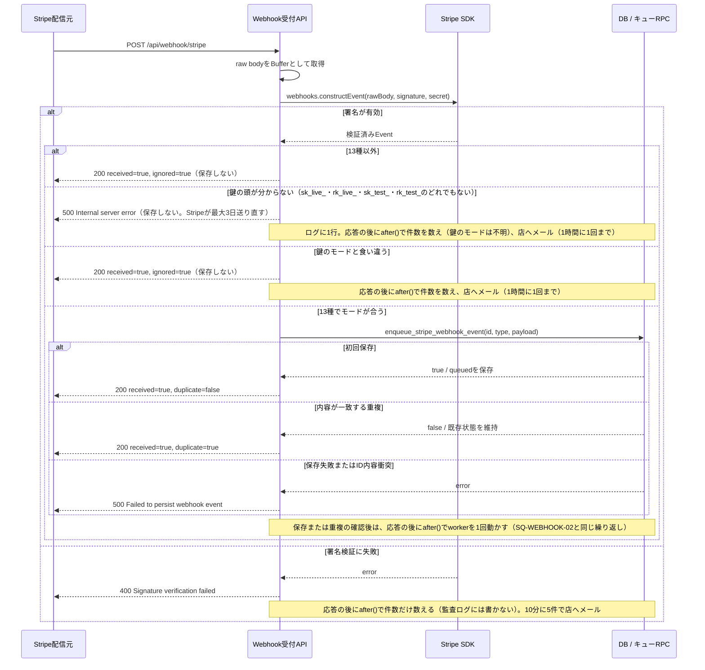

# Stripe Webhookの受付と非同期処理

> 状態: 現行ソース確認 | 確認日: 2026-10-07 | 対象: Webhook受付、イベントworker、決済見回り

## 概要

Stripe Webhookの受付は、署名を検証した13種のイベントのうち鍵と同じモードのものをDBへ保存して200を返し、その後に`after()`でworkerを1回動かす。注文・返金・会計の処理はworkerが行い、workerは毎分のCron APIからも起動する。受付応答、キューの処理完了、注文の入金済みはそれぞれ別の結果である。

図の分割・線種・根拠の扱いは[記載方針](README.md)に従う。状態値と再試行条件は[Webhookキュー](../states/stripe-webhook-queue.md)、注文照合は[購入・決済](checkout-payment.md)、返金投影は[注文管理](order-administration.md)を参照する。

## 範囲と根拠

対応領域は[CHECKOUTのWebhook](../pages/13_checkout.md)と[ADMINの決済管理](../pages/16_admin.md)。外部サービス内部の配信順序・処理と、本番のCron起動を実行済みとして描かない。

| 境界・操作 | 根拠 |
| --- | --- |
| `POST /api/webhook/stripe`、raw body、`webhooks.constructEvent`、13種とモードの判定、署名不正・モード違いの件数 | [Webhook受付](../../../src/app/api/webhook/stripe/route.ts)、[13種とモード](../../../src/lib/stripe/handled-webhook-events.ts)、[件数と知らせ](../../../src/lib/ops/webhook-receiver-signals.ts) |
| enqueue・claim・complete・fail RPC | [イベントサービス](../../../src/lib/stripe/webhook-events.ts)、[キュー定義](../../../supabase/migrations/20260925000303_add_stripe_webhook_queue.sql)、[再試行・退避の定義](../../../supabase/migrations/20261007030242_webhook_queue_dead_letter.sql) |
| `POST /api/cron/process-stripe-webhooks`、Bearer認証、payload検査、繰り返し | [worker](../../../src/app/api/cron/process-stripe-webhooks/route.ts)、[workerの起動](../../../src/lib/stripe/webhook-worker.ts)、[繰り返し](../../../src/lib/stripe/webhook-drain.ts)、[Cron認証](../../../src/lib/cron/auth.ts) |
| 決済・返金イベントの振り分け、会計同期、処理監査 | [イベント処理](../../../src/lib/stripe/webhook-processor.ts) |
| `checkout.sessions.retrieve/list`、`paymentIntents.retrieve`、注文RPC | [Stripe読取り](../../../src/lib/stripe/checkout-payment-reader.ts)、[照合器](../../../src/lib/stripe/checkout-payment-reconciler.ts)、[RPC接続](../../../src/lib/stripe/checkout-payment-reconciler-deps.ts) |
| `refunds.list`と`apply_order_refund_projection` | [返金同期](../../../src/lib/stripe/order-refund-sync.ts)、[返金RPC](../../../supabase/migrations/20260925000218_add_order_state_transition_rpcs.sql) |
| 会計原始記録のSDK読取りと保存 | [会計同期](../../../src/lib/stripe/accounting-sync.ts)、[DB接続](../../../src/lib/stripe/supabase-accounting-database.ts)、[保存処理](../../../src/lib/stripe/accounting-store.ts) |

## SQ-WEBHOOK-01: 署名検証済みイベントの受付

目的は、Stripeから受け取ったイベントを処理前に永続化すること。事前条件はWebhook secretとStripe秘密鍵が設定され、`stripe-signature`ヘッダーがあること。終了結果は保存または一致する重複の確認後の200、保存しない200（13種以外・鍵と食い違うモード）、または400・500（鍵の頭が分からないときの、保存しない500を含む）であり、注文処理の完了ではない。

### 例外と永続化

| 条件 | 応答・保存結果 |
| --- | --- |
| Webhook secretまたはStripe秘密鍵が未設定 | 500。enqueueへ進まない（Stripeが後で送り直す） |
| signature欠落 / 署名不一致 | 400。enqueueへ進まない。監査ログに1件ずつ書かず、`ops_alert_state`の件数だけを進める（10分に5件で店へメール。1時間に1回まで） |
| 13種以外 | 200 `ignored=true`。保存しない（ログに1行） |
| 鍵のモードと食い違う（`sk_live_`・`rk_live_`は本番、`sk_test_`・`rk_test_`はテスト） | 200 `ignored=true`。保存しない。件数を進めて店へメール（1時間に1回まで）。メールを送れなかったときも、次の要求では送り直さない |
| 鍵は設定されているが、頭が`sk_live_`・`rk_live_`・`sk_test_`・`rk_test_`のどれでもない（引用符つきで貼った・`pk_`の鍵など） | 500 `Internal server error`。保存しない（Stripeが最大3日送り直す。200だと知らせが失われる）。ログに`[webhook] STRIPE_SECRET_KEY has an unknown prefix`を1行出し、件数を進めて店へメール（鍵のモードは「不明」。1時間に1回まで。送れなかったときも、次の要求では送り直さない） |
| 初回enqueue | event ID・type・payload、`queued`、attempt_count=0、次の試行時刻を保存 |
| 同じevent IDの再送 | event type、data、account、livemodeを照合する。一致すれば既存キュー状態を変更せずfalse。配信メタデータ全体の完全一致は要求しない |
| 同じIDで内容が矛盾 | RPCがID衝突を拒否し、受付APIは500。既存行を上書きしない |
| 保存または重複確認の200の後 | `after()`で`runWebhookWorker`を1回動かす（約45秒まで。SQ-WEBHOOK-02）。失敗してもログに残すだけで、毎分のCronが拾う |

根拠は上記のWebhook受付とキューRPC。署名失敗は監査ログに書かず件数だけを数える。処理成功の監査はworker側で行う。

## SQ-WEBHOOK-02: workerによる処理

目的は、DBに保存されたイベントを順に取得し、対応する業務処理と完了記録を行うこと。開始契機は毎分の`POST /api/cron/process-stripe-webhooks`と、受付APIが保存の後に`after()`で動かす1回で、Cron APIの事前条件は`CRON_SECRET`（32文字以上）と一致するBearer認証。1回の起動は、取り出せるイベントが無くなるか約45秒たつまで続ける。1件の失敗は原因の記号を記録して次へ進む。終了結果は200 `{processed,failed,stoppedBy}`で、502はclaimのDB障害（`stoppedBy=claim_error`）だけである。

```mermaid
sequenceDiagram
    participant Cron as Cron呼出し元
    participant Worker as イベントworker API
    participant DB as DB / RPC
    participant Processor as イベント処理
    participant Stripe as Stripe API
    Cron->>Worker: POST /api/cron/process-stripe-webhooks
    Worker->>Worker: Bearer認証（CRON_SECRETは32文字以上）
    loop 取り出せる間（約45秒の予算まで。時間切れはstoppedBy=budget）
        Worker->>DB: claim_stripe_webhook_event()
        DB-->>Worker: 対象なし / payloadとclaim token / error
        alt claim RPCが失敗
            Note over Worker,DB: ループを止める（stoppedBy=claim_error）
        else 対象なし
            Note over Worker,DB: ループを止める（stoppedBy=empty）
        else 1件を取得
            Worker->>Worker: id・type・data.objectを検査
            alt 検査・業務処理・完了記録が成功
                Worker->>Processor: processStripeWebhookEvent(payload)
                alt CheckoutまたはPaymentIntent決済イベント
                    Processor->>Stripe: Session / PaymentIntentの現在値を取得
                    Stripe-->>Processor: 現在の決済情報
                    opt 注文作成・状態更新または要対応記録の判定
                        Processor->>DB: 照合判定に応じた条件付き注文RPC または 要対応記録
                        DB-->>Processor: 更新結果 または 要対応記録
                    end
                    opt none判定・paid/shipped注文・Stripe paid・返金額が正・PIあり
                        Processor->>Stripe: refunds.list / 全ページの成功返金を再取得
                        Stripe-->>Processor: 最新の成功返金合計
                        Processor->>DB: apply_order_refund_projection / CASと書込み後の再確認
                        DB-->>Processor: 同期後の注文状態
                    end
                else Refundまたはcharge.refunded
                    Processor->>DB: PaymentIntentの注文を検索
                    DB-->>Processor: 注文あり / 注文なし / DB error
                    alt 注文あり (維持対象のcancelledを除く)
                        Processor->>Stripe: refunds.list(payment_intent)
                        Stripe-->>Processor: 成功返金を集計する原始記録
                        Processor->>DB: apply_order_refund_projection(CAS)
                        DB-->>Processor: 返金額・注文状態の投影
                        Processor->>Stripe: refunds.list / 書込み後の再確認
                        Stripe-->>Processor: 最新の成功返金合計
                    else cancelledで旧返金額が注文額未満
                        Note over Processor,Stripe: 既存取消を維持し、一覧・投影を省略
                    else 注文なし
                        alt failed / canceled の返金、またはrefund.failed
                            Processor->>DB: Refund IDを参照にunexpected_stateを記録
                            Processor->>DB: 未解決なら店通知をclaimし送信を試みる
                            Processor->>DB: refund_without_orderをerror監査
                        else その他の返金 / charge.refunded
                            Processor->>DB: refund_without_orderをsuccess監査
                        end
                        Note over Processor,Stripe: 返金一覧・注文投影を省略し後段へ進む<br/>記録例外はworkerのfailへ
                    else DB照会エラー
                        Note over Worker,Processor: 例外で中断、workerのfail分岐へ
                    end
                else その他のイベント
                    Note over Processor: このswitchでは注文・返金を変更しない
                end
                opt 会計対象イベント
                    alt payment_intent.succeeded
                        Processor->>DB: PIに対応する注文を検索
                        alt 注文あり
                            Processor->>Stripe: PaymentIntent / Charge / BalanceTransactionをretrieve
                            Stripe-->>Processor: 会計原始記録
                            Processor->>DB: BalanceTransactionを保存
                        else 注文なし
                            Note over Processor,DB: unmatchedで正常終了、Stripe会計読取り・保存を省略
                        end
                    else refund.created / updated / failed
                        Processor->>Stripe: refunds.retrieve(refundId)
                        Stripe-->>Processor: Refund現在値
                        Processor->>DB: RefundのPIに対応する注文を検索
                        alt 注文あり
                            Processor->>Stripe: 存在する返金・失敗のBalanceTransactionをretrieve
                            Stripe-->>Processor: 会計原始記録
                            Processor->>DB: BalanceTransaction / Refundを保存
                        else 注文なし
                            Note over Processor,DB: unmatchedで正常終了、会計DB保存を省略
                        end
                    else Payout対象イベント
                        Processor->>Stripe: Payout / BalanceTransactionを取得
                        Stripe-->>Processor: 会計原始記録
                        Processor->>DB: 会計原始記録とPayoutを保存
                    end
                end
                Processor->>DB: logAudit(event_processing, success)
                DB-->>Processor: 監査呼出し完了
                Processor-->>Worker: 正常終了
                Worker->>DB: complete_stripe_webhook_event(id, token)
                DB-->>Worker: true / completed
                Note over Worker: processedを加算
            else 検査・業務処理・completeで例外
                Worker->>DB: fail_stripe_webhook_event(id, token, 原因の記号)
                DB-->>Worker: failedまたはdeadを保存 / 記録失敗（ログに残す）
                Note over Worker: failedを加算して次の1件へ
            end
        end
    end
    Worker->>DB: record_ops_heartbeat(webhook_worker)と点検（溜まり・退避・遅れを店へ）
    alt stoppedByがclaim_error
        Worker-->>Cron: 502
    else stoppedByがemptyまたはbudget
        Worker-->>Cron: 200 processed・failed・stoppedBy
    end
```

図の業務処理はイベント種別で選ぶ部分シナリオである。照合器は必要ならメール送信も試みる。個々のRPCと最大3回の読み直しは[注文状態](../states/order-payment.md)と[返金シーケンス](order-administration.md#sq-admin-03-管理返金と成功返金の投影)に記す。workerは、取り出せるイベントが無くなるか約45秒たつまで、同じ要求の中で続けて取得する。1件の失敗は記録して次へ進み、`claim_error`だけが繰り返しを止めて502になる。

### イベントと実行処理

| イベント | 注文・返金処理 | 会計処理 |
| --- | --- | --- |
| checkout.session.completed / async_payment_succeeded / async_payment_failed / expired | Session IDとevent IDを照合器へ。イベントの中の状態・金額から注文を直接更新しない。照合器のnone判定が条件を満たせば返金投影も実行 | この種類による会計同期なし |
| payment_intent.succeeded / payment_failed | PI IDとevent IDを照合器へ。payment_failedだけで在庫を解放しない。照合器のnone判定が条件を満たせば返金投影も実行 | succeededだけPaymentIntent会計同期。注文なしならunmatchedで保存を省略 |
| refund.created / updated / failed | PI IDで注文を検索。維持対象のcancelledを除き、注文ありならStripeの全返金を再読取りして投影。注文なしならイベント種別・参照IDを監査して投影を省略 | Refund会計同期の呼出しは続ける。Refundの現在値を取得して注文を再検索し、不在ならunmatchedで会計DB保存を省略 |
| charge.refunded | PI IDで注文を検索して返金投影（維持対象のcancelledを除く）。注文なしならイベント種別・参照IDを監査して投影を省略 | この種類による会計同期なし |
| payout.paid / failed / reconciliation_completed | 注文・返金switchでは処理なし | Payout会計同期 |
| その他 | 注文・返金処理なし | 会計switchの対象でなければ処理なし。監査後にキュー完了 |

根拠: [イベント処理のswitch](../../../src/lib/stripe/webhook-processor.ts)。会計SDKは[会計同期](../../../src/lib/stripe/accounting-sync.ts)でPaymentIntent・Charge・BalanceTransaction・Refund・Payoutを読む。

### 例外と永続化

| 条件 | workerの扱い・永続化 |
| --- | --- |
| Bearer不一致、`CRON_SECRET`未設定または32文字未満 / claim RPC失敗 | 401 / 502（`stoppedBy=claim_error`）。業務処理へ進まない |
| payload不正、返金イベントにPIなし、業務・会計例外 | 原因の記号つきでfailを試み、同じ要求の中で次のイベントへ進む（応答は200で、`failed`に数える）。fail記録そのものの失敗もログに残して次へ進む。先に成立した注文・会計更新を一括で巻き戻す処理ではない |
| PIに対応する注文なし | syncOrderRefundsがOrderNotFoundForPaymentIntentErrorを投げ、返金イベント処理だけがその型を捕捉する。refund_without_orderをイベント種別・参照IDで成功監査し、会計処理・通常監査・completeへ進む。後段が成功すればキューcompletedとなる |
| 既存取消の維持 | cancelledかつ旧refunded_amountがtotal_amount未満なら既存状態を返し、Stripe返金一覧・投影RPCを呼ばない。Webhookは後段会計・通常監査へ進む |
| 注文の検索DBエラー | 注文なしとは区別して例外を再throwする。返金一覧・会計同期へ進まずworkerがfailを試みる |
| needs_action / needs_review | 照合器が記録と必要な通知の試行を行い正常に返れば処理成功としcompleted。入金成功やメール送信成功の意味ではない |
| complete/failのtokenが一致しない | RPCはfalse。イベントサービスがclaim喪失の例外を投げる。前workerは新tokenの行を完了・失敗にできない |
| 再試行 | queued/failedは試行時刻到来でclaimできる。失敗した試行の回数をnとして、待機は2^(n-1)分（1・2・4…128分）。9回目の試行も失敗したら`dead`にして取り出さず、店へまとめて知らせる。processingは5分lease切れになると、次のclaimで1回の失敗（`lease_expired`）として数える |
| 監査要求 | workerは空ヘッダーのNextRequestを作る。CronのIP・User-AgentをStripe配信元のものとして記録しない |

注文なし返金の捕捉はWebhook processorにある。共通の返金同期関数自身が正常終了へ変える処理ではない。また、成功監査はpayment_exceptionsのresolved_atを更新せず、既存の要対応を自動解決しない。根拠は[handleRefundChanged](../../../src/lib/stripe/webhook-processor.ts)と[返金同期の注文検索](../../../src/lib/stripe/order-refund-sync.ts)。

返金イベントが注文作成より先に届き、注文なしとして完了した場合も、後続の決済照合が部分返金済みの注文を作成・入金済みにした後の読み直しで返金同期を実行する。注文なし・snapshotに下書きIDありでStripeの受取額全額が返金済みなら、`record_only:refunded_before_order`として注文を作らない。既存注文の入金更新で金額・通貨が一致する場合も、全額返金済みなら注文確認メールを抑止し、その後の返金同期で取消へ投影する。根拠は[判定表](../../../src/lib/stripe/checkout-payment-decision.ts)、[照合器](../../../src/lib/stripe/checkout-payment-reconciler.ts)、[返金接続と一時エラー分類](../../../src/lib/stripe/checkout-payment-reconciler-deps.ts)。

## 関連する見回りとschedule

| 処理 | 現行の範囲・制限 | 根拠 |
| --- | --- | --- |
| `POST /api/cron/expire-pending-orders` | Bearer認証後、checkout_session_created_atが30分超前のpayment_in_progressとpending全件を候補に取得。1回最大50件、各注文の開始前に45秒の時間予算を確認する（実行時間の厳密な上限ではない）。時間ごとに取得offsetを巡回。payment_in_progressでSession IDがある場合だけopen Sessionの失効を先に試み、各候補で同じ照合器を呼ぶ。1件失敗でも他を続行 | [見回りAPI](../../../src/app/api/cron/expire-pending-orders/route.ts)、[Session失効](../../../src/lib/stripe/checkout-session-expiry.ts) |
| 店向け要対応メールの再送 | 注文処理の中断フラグtimeBudgetExhaustedがfalseなら、未解決・未通知を最大20件取得し、送信権をclaimして再送を試みる。最後の注文処理後に経過時間を再検査する条件ではない | [見回りAPI](../../../src/app/api/cron/expire-pending-orders/route.ts)、[未送信取得](../../../src/lib/stripe/checkout-payment-reconciler-deps.ts) |
| 注文の無い支払いの拾い上げ | 上の注文処理と店向け再送の後、`timeBudgetExhausted`がfalseのときだけ、同じ45秒の予算の残りで動く（新しい照合の開始前に締切を確認する）。直近24時間に作られた完了済みCheckout Sessionのうち注文の無いもの（50件ずつ注文の有無を確かめる）を照合器へ渡し、照合器がその呼出しで注文を作ったときだけ、要確認「支払いから作った注文」（`recovered_from_payment`。在庫の要確認が先に付いていればそれを残す）を付ける。印は3回まで試し、付けられない注文は印なしのまま店向けメールに載せる。拾った注文は、その回の1通にまとめて店へ知らせる。読む範囲が毎回24時間で重なるので、予算切れや注文を作る前の失敗は次の回で拾い直す。注文の行を作った後の失敗は、その Session に注文があるので次の回は拾い直さない。1件失敗でも他を続行し、`failed`に数える | [見回りAPI](../../../src/app/api/cron/expire-pending-orders/route.ts)、[拾い上げ](../../../src/lib/stripe/orphan-payment-recovery.ts)、[店向けメール](../../../src/lib/ops/ops-alert-mail.ts) |
| 最後の成功の記録と点検 | 注文の無い支払いの拾い上げの直後（拾った注文の要約の読み込み・店へのメール・監査の行より前）に`order_sweep`の最後の成功を`ops_job_heartbeats`へ記録し、最後（応答の直前）にworkerと同じ点検（溜まり・退避・遅れを店へ）を行う。後続が遅くなって実行の上限（60秒）に届いても、成功の記録は残る。注文候補を読めず500を返すときは、失敗と原因の記号`db_unavailable`を記録してから点検して返す。記録や点検の失敗は応答を変えない。応答には`checkedSessions`・`recoveredOrders`・`recoveredOrdersNotified`を含める | [見回りAPI](../../../src/app/api/cron/expire-pending-orders/route.ts)、[点検](../../../src/lib/ops/ops-checks.ts)、[記録](../../../src/lib/ops/ops-store.ts) |
| workerのschedule案 | pending SQLには毎分のPOST（受付APIもその場で1回動かすので、毎分の起動は取りこぼしを拾う役目）、Vaultのapp_base_url・cron_secret参照を定義。登録・到達性・実起動は未確認 | [worker schedule](../../../supabase/pending/schedule_stripe_webhook_worker.sql) |
| 見回りのschedule案 | pending SQLには毎時0分のPOSTとVault参照を定義。ソース中の最長90分というコメントは、件数・時間制限下の無条件保証として扱わない | [見回りschedule](../../../supabase/pending/schedule_expire_pending_orders.sql) |
| 照合のschedule案 | pending SQL（`supabase/pending/schedule_stripe_reconcile.sql`）には毎日18:00 UTC（日本時間3:00）のPOSTとVault参照を定義。登録・到達性・実起動は未確認 | [保留中のSQL](../../../supabase/pending/README.md) |
| `POST /api/cron/stripe-reconcile` | Bearer認証（`CRON_SECRET`・32文字以上）後、succeeded PIを走査し、注文との返金額不一致なら返金同期。会計原始記録とPayoutも同期する。支払いごと・Payoutごとの失敗は原因の記号で受け止めて続行し、監査`stripe.reconcile`（注文の無い直近7日の支払いのIDを20件まで含む）と最後の成功を記録する。そのあと、直近7日の注文の無い成功の支払い（全額返金済みを除く）か支払い・Payoutごとの失敗があれば、1回の実行につき1通のメールで店へ知らせる（時間ごとの権利は取らない。送れなくても応答と記録は変えない）。実行の上限は300秒で、pg_netは60秒で待つのをやめる。Checkout決済状態を照合する上の見回りとは用途が異なる | [会計・返金照合API](../../../src/app/api/cron/stripe-reconcile/route.ts)、[照合処理](../../../src/lib/stripe/reconcile-orders.ts) |

見回りは個々の注文処理の例外を数えて続行し、部分失敗でも集計を200で返す。会計・返金照合は、注文なしのPIを未対応支払いとして集計する場合があるが、そのPIの会計同期は省略する。返金一覧取得・返金投影・PaymentIntent会計同期・Payout同期の例外は、支払いごと・Payoutごとに原因の記号つきで`errors`へ収集して続行し、200の集計に含める。注文をDBから読めないとき、またはStripeの一覧そのものを読めないときは全体の502になり、その回の残りを中断する（最後の失敗を記録する）。先行保存を巻き戻す処理ではない。根拠は上表の各APIと照合処理。

## 関連テスト

| 観点 | 参照 |
| --- | --- |
| 受付の署名・永続化・重複 | [durable ingress](../../../tests/unit/api/webhook/stripe-ingest.test.ts) |
| イベント振り分け・業務処理 | [processor](../../../tests/unit/api/webhook/stripe-route.test.ts) |
| claim・complete・failと競合 | [イベントサービス](../../../tests/unit/lib/stripe/webhook-events.test.ts)、[worker API](../../../tests/unit/api/cron/process-stripe-webhooks-route.test.ts)、[キューRPC](../../../tests/integration/db/stripe_webhook_queue.integration.test.ts) |
| 見回り・返金と会計照合 | [見回りAPI](../../../tests/unit/api/cron/expire-pending-orders-route.test.ts)、[stripe-reconcile API](../../../tests/unit/api/cron/stripe-reconcile-route.test.ts) |

関連テストは検証観点の参照であり、今回は実行していない。

## 未確認事項

本番のmigration適用、Stripe配信設定・実配信、キューの実データ、Cron登録・Vault値・HTTP到達性、メール到達、競合時の実行結果は未確認。pending SQLの記載を、本番で稼働している証拠として扱わない。

最終照合のコード基準はmasterの`bbb18761`と、2026-10-04の作業ツリーにある決済・返金ライブラリの未コミット変更。注文なし返金イベントの型限定catch、会計のunmatched分岐、共通照合器による返金同期まで静的に確認した。今回、そのコードの実行テストと本番反映は確認していない。

2026-10-07 に、Webhook受付・worker・見回り・照合の記述（グループ B で変えた部分）を、masterの`b54976d2`のソースで確認し直した。processorの振り分けと会計同期の記述は、上の基準のまま。そのあと、最終のレビューの直し（鍵の頭が分からないときの500、見回りの成功の記録の位置、照合の実行の上限300秒と見つかったことのメール）を、同じ日の作業ツリーのソースで確認して反映した。
