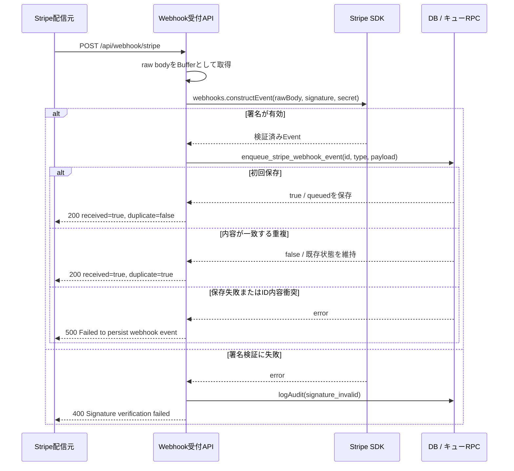
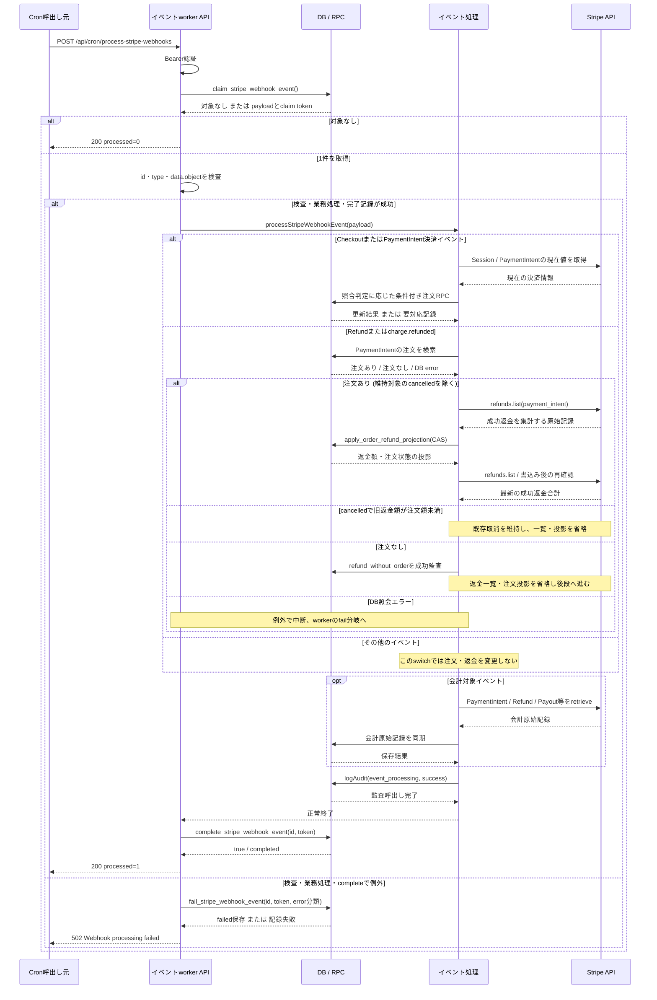

# Stripe Webhookの受付と非同期処理

> 状態: 現行ソース確認 | 確認日: 2026-10-04 | 対象: Webhook受付、イベントworker、決済見回り

## 概要

Stripe Webhookの受付は、署名を検証したイベントをDBへ保存して200を返す。注文・返金・会計の処理は別のCron APIが開始する。受付応答、キューの処理完了、注文の入金済みはそれぞれ別の結果である。

図の分割・線種・根拠の扱いは[記載方針](README.md)に従う。状態値と再試行条件は[Webhookキュー](../states/stripe-webhook-queue.md)、注文照合は[購入・決済](checkout-payment.md)、返金投影は[注文管理](order-administration.md)を参照する。

## 範囲と根拠

対応領域は[CHECKOUTのWebhook](../pages/13_checkout.md)と[ADMINの決済管理](../pages/16_admin.md)。外部サービス内部の配信順序・処理と、本番のCron起動を実行済みとして描かない。

| 境界・操作 | 根拠 |
| --- | --- |
| `POST /api/webhook/stripe`、raw body、`webhooks.constructEvent` | [Webhook受付](../../../src/app/api/webhook/stripe/route.ts) |
| enqueue・claim・complete・fail RPC | [イベントサービス](../../../src/lib/stripe/webhook-events.ts)、[キュー定義](../../../supabase/migrations/20260925000303_add_stripe_webhook_queue.sql) |
| `POST /api/cron/process-stripe-webhooks`、Bearer認証、payload検査 | [worker](../../../src/app/api/cron/process-stripe-webhooks/route.ts)、[Cron認証](../../../src/lib/legal-archive/cron-auth.ts) |
| 決済・返金イベントの振り分け、会計同期、処理監査 | [イベント処理](../../../src/lib/stripe/webhook-processor.ts) |
| `checkout.sessions.retrieve/list`、`paymentIntents.retrieve`、注文RPC | [Stripe読取り](../../../src/lib/stripe/checkout-payment-reader.ts)、[照合器](../../../src/lib/stripe/checkout-payment-reconciler.ts)、[RPC接続](../../../src/lib/stripe/checkout-payment-reconciler-deps.ts) |
| `refunds.list`と`apply_order_refund_projection` | [返金同期](../../../src/lib/stripe/order-refund-sync.ts)、[返金RPC](../../../supabase/migrations/20260925000218_add_order_state_transition_rpcs.sql) |
| 会計原始記録のSDK読取りと保存 | [会計同期](../../../src/lib/stripe/accounting-sync.ts)、[DB接続](../../../src/lib/stripe/supabase-accounting-database.ts)、[保存処理](../../../src/lib/stripe/accounting-store.ts) |

## SQ-WEBHOOK-01: 署名検証済みイベントの受付

目的は、Stripeから受け取ったイベントを処理前に永続化すること。事前条件はWebhook secretが設定され、`stripe-signature`ヘッダーがあること。終了結果は保存または一致する重複の確認後の200であり、注文処理の完了ではない。

### 例外と永続化

| 条件 | 応答・保存結果 |
| --- | --- |
| secret未設定 / signature欠落 | 500 / 400。enqueueへ進まない |
| 初回enqueue | event ID・type・payload、`queued`、attempt_count=0、次の試行時刻を保存 |
| 同じevent IDの再送 | event type、data、account、livemodeを照合する。一致すれば既存キュー状態を変更せずfalse。配信メタデータ全体の完全一致は要求しない |
| 同じIDで内容が矛盾 | RPCがID衝突を拒否し、受付APIは500。既存行を上書きしない |
| 受付200の後 | このRoute Handlerからworkerを直接起動しない。workerは別要求で開始する |

根拠は上記のWebhook受付とキューRPC。署名失敗の監査は受付APIが行い、処理成功の監査は次のworker側で行う。

## SQ-WEBHOOK-02: workerによる1件の処理

目的は、DBに保存されたイベントを取得し、対応する業務処理と完了記録を行うこと。開始契機は独立した`POST /api/cron/process-stripe-webhooks`で、事前条件は`CRON_SECRET`と一致するBearer認証。終了結果は対象なしの200、1件完了の200、または処理失敗の502である。

図の業務処理はイベント種別で選ぶ部分シナリオである。照合器は必要ならメール送信も試みる。個々のRPCと最大3回の読み直しは[注文状態](../states/order-payment.md)と[返金シーケンス](order-administration.md#sq-admin-03-管理返金と成功返金の投影)に記す。workerは別イベントを同じ要求内で連続取得しない。

### イベントと実行処理

| イベント | 注文・返金処理 | 会計処理 |
| --- | --- | --- |
| checkout.session.completed / async_payment_succeeded / async_payment_failed / expired | Session IDとevent IDを照合器へ。イベントの中の状態・金額から注文を直接更新しない | この種類による会計同期なし |
| payment_intent.succeeded / payment_failed | PI IDとevent IDを照合器へ。payment_failedだけで在庫を解放しない | succeededだけPaymentIntent会計同期 |
| refund.created / updated / failed | PI IDで注文を検索。維持対象のcancelledを除き、注文ありならStripeの全返金を再読取りして投影。注文なしならイベント種別・参照IDを監査して投影を省略 | 注文なしでもRefund会計同期を続ける |
| charge.refunded | PI IDで注文を検索して返金投影（維持対象のcancelledを除く）。注文なしならイベント種別・参照IDを監査して投影を省略 | この種類による会計同期なし |
| payout.paid / failed / reconciliation_completed | 注文・返金switchでは処理なし | Payout会計同期 |
| その他 | 注文・返金処理なし | 会計switchの対象でなければ処理なし。監査後にキュー完了 |

根拠: [イベント処理のswitch](../../../src/lib/stripe/webhook-processor.ts)。会計SDKは[会計同期](../../../src/lib/stripe/accounting-sync.ts)でPaymentIntent・Charge・BalanceTransaction・Refund・Payoutを読む。

### 例外と永続化

| 条件 | workerの扱い・永続化 |
| --- | --- |
| Bearer不一致 / claim RPC失敗 | 401 / 502。業務処理へ進まない |
| payload不正、返金イベントにPIなし、業務・会計例外 | failを試みて502。先に成立した注文・会計更新を一括で巻き戻す処理ではない |
| PIに対応する注文なし | syncOrderRefundsがOrderNotFoundForPaymentIntentErrorを投げ、返金イベント処理だけがその型を捕捉する。refund_without_orderをイベント種別・参照IDで成功監査し、会計処理・通常監査・completeへ進む。後段が成功すればキューcompletedとなる |
| 既存取消の維持 | cancelledかつ旧refunded_amountがtotal_amount未満なら既存状態を返し、Stripe返金一覧・投影RPCを呼ばない。Webhookは後段会計・通常監査へ進む |
| 注文の検索DBエラー | 注文なしとは区別して例外を再throwする。返金一覧・会計同期へ進まずworkerがfailを試みる |
| needs_action / needs_review | 照合器が記録・通知を済ませて正常に返れば処理成功としcompleted。入金成功の意味ではない |
| complete/failのtokenが一致しない | RPCはfalse。イベントサービスがclaim喪失の例外を投げる。前workerは新tokenの行を完了・失敗にできない |
| 再試行 | queued/failedは試行時刻到来、processingは5分lease切れで再claimできる。failの待機はmin(1800,30×attempt_count)秒。回数の固定上限なし |
| 監査要求 | workerは空ヘッダーのNextRequestを作る。CronのIP・User-AgentをStripe配信元のものとして記録しない |

注文なし返金の捕捉はWebhook processorにある。共通の返金同期関数自身が正常終了へ変える処理ではない。また、成功監査はpayment_exceptionsのresolved_atを更新せず、既存の要対応を自動解決しない。根拠は[handleRefundChanged](../../../src/lib/stripe/webhook-processor.ts)と[返金同期の注文検索](../../../src/lib/stripe/order-refund-sync.ts)。

## 関連する見回りとschedule

| 処理 | 現行の範囲・制限 | 根拠 |
| --- | --- | --- |
| `POST /api/cron/expire-pending-orders` | Bearer認証後、checkout_session_created_atが30分超前のpayment_in_progressとpending全件を候補に取得。1回最大50件、各注文の開始前に45秒の時間予算を確認する（実行時間の厳密な上限ではない）。時間ごとに取得offsetを巡回。payment_in_progressでSession IDがある場合だけopen Sessionの失効を先に試み、各候補で同じ照合器を呼ぶ。1件失敗でも他を続行 | [見回りAPI](../../../src/app/api/cron/expire-pending-orders/route.ts)、[Session失効](../../../src/lib/stripe/checkout-session-expiry.ts) |
| 店向け要対応メールの再送 | 注文処理の中断フラグtimeBudgetExhaustedがfalseなら、未解決・未通知を最大20件取得し、送信権をclaimして再送を試みる。最後の注文処理後に経過時間を再検査する条件ではない | [見回りAPI](../../../src/app/api/cron/expire-pending-orders/route.ts)、[未送信取得](../../../src/lib/stripe/checkout-payment-reconciler-deps.ts) |
| workerのschedule案 | pending SQLには10秒ごとのPOST、Vaultのapp_base_url・cron_secret参照を定義。登録・到達性・実起動は未確認 | [worker schedule](../../../supabase/pending/schedule_stripe_webhook_worker.sql) |
| 見回りのschedule案 | pending SQLには毎時0分のPOSTとVault参照を定義。ソース中の最長90分というコメントは、件数・時間制限下の無条件保証として扱わない | [見回りschedule](../../../supabase/pending/schedule_expire_pending_orders.sql) |
| `GET /api/cron/stripe-reconcile` | Bearer認証後、succeeded PIを走査し、注文との返金額不一致なら返金同期。会計原始記録とPayoutも同期する。Checkout決済状態を照合する上の見回りとは用途が異なる | [会計・返金照合API](../../../src/app/api/cron/stripe-reconcile/route.ts)、[照合処理](../../../src/lib/stripe/reconcile-orders.ts) |

## 関連テスト

| 観点 | 参照 |
| --- | --- |
| 受付の署名・永続化・重複 | [durable ingress](../../../tests/unit/api/webhook/stripe-ingest.test.ts) |
| イベント振り分け・業務処理 | [processor](../../../tests/unit/api/webhook/stripe-route.test.ts) |
| claim・complete・failと競合 | [イベントサービス](../../../tests/unit/lib/stripe/webhook-events.test.ts)、[worker API](../../../tests/unit/api/cron/process-stripe-webhooks-route.test.ts)、[キューRPC](../../../tests/integration/db/stripe_webhook_queue.integration.test.ts) |
| 見回り・返金と会計照合 | [見回りAPI](../../../tests/unit/api/cron/expire-pending-orders-route.test.ts)、[stripe-reconcile API](../../../tests/unit/api/cron/stripe-reconcile-route.test.ts) |

関連テストは検証観点の参照であり、今回は実行していない。

## 未確認事項

本番のmigration適用、Stripe配信設定・実配信、キューの実データ、Cron登録・Vault値・HTTP到達性、メール到達、競合時の実行結果は未確認。pending SQLの記載を、本番で稼働している証拠として扱わない。

最終照合のコード基準はmasterの`54b280ff`（2026-10-04）。注文なし返金イベントの型限定catchまで静的に確認した。今回、そのコードの実行テストと本番反映は確認していない。
