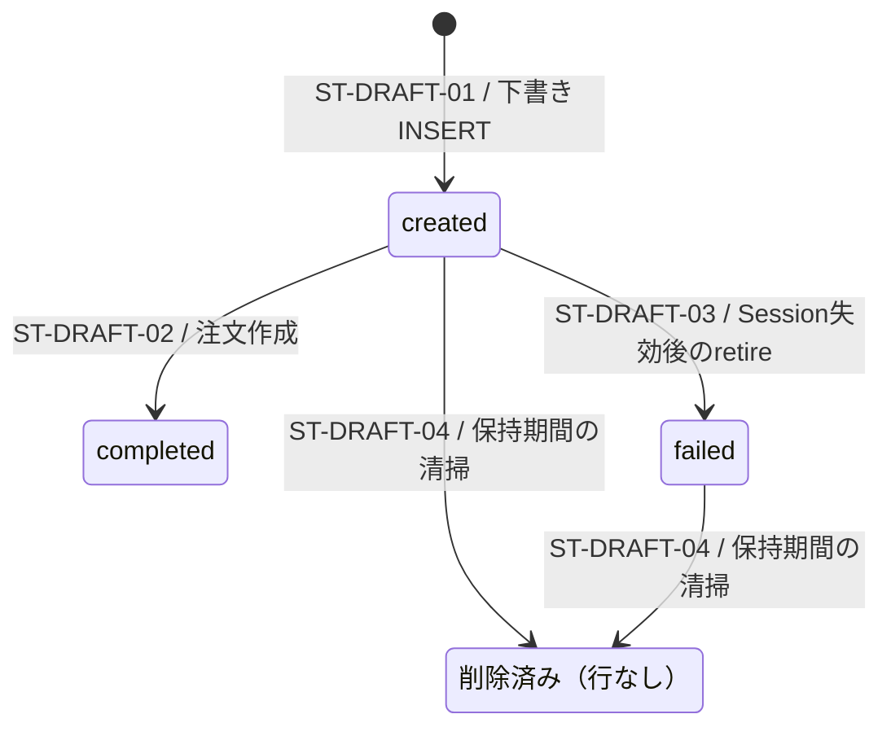

# 購入下書きの状態

> 状態: 現行ソース確認 | 確認日: 2026-10-04 | 対象: `checkout_drafts.status`

## 概要

購入下書きの状態値は `created`・`completed`・`failed`。`completed`は下書きから注文を作成した結果であり、Stripeの入金完了やブラウザの完了表示を意味しない。Checkout Sessionの作成claim、配送先の版番号、Sessionの期限は状態値とは別の属性である。

## 範囲と根拠

- 対応領域: [CHECKOUT詳細設計](../pages/13_checkout.md)、[購入シーケンス](../sequence/checkout-payment.md)。
- 状態制約: [remote schema](../../../supabase/migrations/20260901102912_remote_schema.sql)。
- 更新: [create-session](../../../src/app/api/checkout/create-session/route.ts)、[Session claim・下書き失効RPC](../../../supabase/migrations/20260925000132_add_checkout_session_claim_rpcs.sql)、[注文受付RPC](../../../supabase/migrations/20260927100300_place_order_from_checkout_draft.sql)。snapshotの型・入力正規化は[draftサービス](../../../src/features/checkout/services/checkout-draft.service.ts)。

## 状態定義と図

| 値・論理状態 | 意味 |
| --- | --- |
| `created` | 下書きが存在し、注文への変換が未完了。Session IDがあるかどうかは別属性 |
| `completed` | `place_order_from_checkout_draft`が注文と明細を作り、下書きを完了に更新した |
| `failed` | 作成済みSessionの失効を確認し、未完了の下書きをretireした |
| 削除済み | 清掃により行が存在しない論理状態。DBに `deleted` や `expired` を保存するわけではない |

## 遷移条件

| ID | 契機・ガード | 更新と副作用 | 根拠 |
| --- | --- | --- | --- |
| ST-DRAFT-01 | サーバーがカート内容と金額を計算し、下書きを作る | `status=created`、商品・金額・所有sessionのsnapshotを保存 | [create-session](../../../src/app/api/checkout/create-session/route.ts)、[claim RPC](../../../supabase/migrations/20260925000132_add_checkout_session_claim_rpcs.sql) |
| ST-DRAFT-02 | 照合器がStripeを `paid` または `awaiting_payment` と判定。受付RPCがdraft・金額・通貨・商品を検証し、既存注文の冪等経路でない新規作成に成功 | 注文を `payment_in_progress` で作成、明細と在庫台帳を保存、draftを `completed` に更新。その後の注文 `paid/pending` 更新は別RPC | [受付RPC](../../../supabase/migrations/20260927100300_place_order_from_checkout_draft.sql)、[照合器](../../../src/lib/stripe/checkout-payment-reconciler.ts) |
| ST-DRAFT-03 | create-sessionが既存Sessionを失効済みと確認。`retire_expired_checkout_draft`がdraft ID・所有session・Session ID・`created`、request version/fingerprintのNULLを含む一致を確認 | `status=failed`。既存のSession IDはNULLにしない。この下書きを作り直して再利用する遷移ではない | [create-session](../../../src/app/api/checkout/create-session/route.ts)、[retire RPC](../../../supabase/migrations/20260925000132_add_checkout_session_claim_rpcs.sql) |
| ST-DRAFT-04 | `created/failed`、`created_at`が30日より前 | 行をDELETE。`completed`はこの清掃の対象外 | [保持期間job](../../../supabase/migrations/20260911235714_add_checkout_drafts_retention_job.sql) |

## 独立属性と競合

| 属性・処理 | 現行の条件 |
| --- | --- |
| Session作成claim | `(session_id, version, fingerprint)`の部分一意制約で `created` の下書きを取得・作成する。Stripeの冪等キーでSessionを作り、同じdraft・所有session・version・fingerprintでattachする。Webhookキューのようなclaim token・leaseはこのdraft RPCにはない |
| Sessionの期限予約 | `reserve_checkout_session_expiry`は `created` かつSession未添付の場合に期限を予約する。既存期限が `now()+30分15秒` より先なら再利用し、そうでなければ `now()+30分30秒` に更新する。永久固定の期限ではない |
| 配送先revision | `update-shipping`は所有session・Session ID・期待revision・`status != completed`を条件にCAS更新する。状態遷移ではない |
| 注文受付の冪等性 | 同じCheckout Sessionの既存注文はそのIDを返す。RPCはdraftロック後にもSessionで再確認する。PI不一致の検出は照合器の別の処理。二重に明細・在庫確保を行う遷移として描かない |

根拠: [期限予約RPC](../../../supabase/migrations/20260927100600_checkout_session_expiry.sql)、[Session claim RPC](../../../supabase/migrations/20260925000132_add_checkout_session_claim_rpcs.sql)、[配送先revision](../../../supabase/migrations/20260916042338_add_checkout_draft_shipping_revision.sql)、[update-shipping](../../../src/app/api/checkout/update-shipping/route.ts)。

## 関連テスト

[Session claim](../../../tests/integration/db/checkout_session_claim.integration.test.ts)、[期限予約](../../../tests/integration/db/checkout_session_expiry.integration.test.ts)、[配送先revision](../../../tests/integration/db/checkout_draft_shipping_revision.integration.test.ts)、[注文受付](../../../tests/integration/db/place_order_from_checkout_draft.integration.test.ts)。参照したテストの今回のDB実行結果ではない。

## 未確認事項

本番の状態制約・保持jobの適用と実行、実データの保持期間は未確認。SQLコメントにある決済前の受付APIは現行 `src` の呼び出し元として確認できず、現行の注文作成は照合器からの呼び出しを根拠とした。
