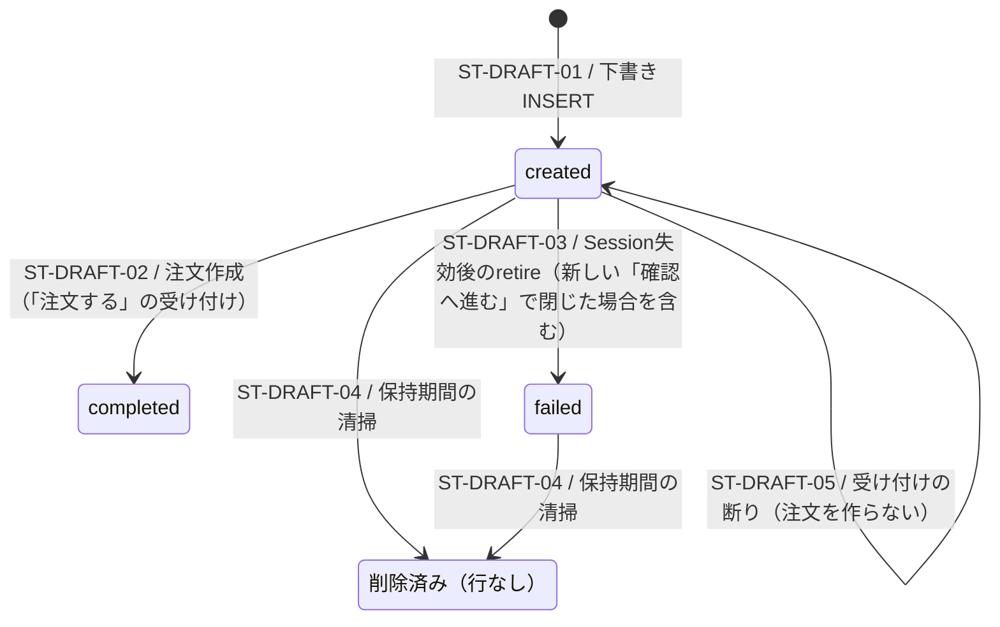

# 購入下書きの状態

> 状態: 現行ソース確認 | 確認日: 2026-10-07（下書きの買い手はグループ C の変更を 2026-10-08 に反映） | 対象: `checkout_drafts.status`、`checkout_drafts.buyer_user_id`

## 概要

購入下書きの状態値は `created`・`completed`・`failed`。`completed`は下書きから注文を作成した結果であり、Stripeの入金完了やブラウザの完了表示を意味しない。グループ F から、注文は最終確認画面の「注文する」の受け付けで支払いの前に作る（支払いの後に注文が無いときだけ、照合器が同じ受付RPCを呼ぶ）。Checkout Sessionの作成claim、Sessionの期限は状態値とは別の属性である。配送先は下書きを作る（claimする）ときに保存するだけで、後から更新する経路は無い。

グループ C から、下書きは「確認へ進む」の時の買い手（`buyer_user_id`。サーバーが確かめた会員の ID、ゲストは空）を持つ。買い手も下書きを作る（claimする）ときに書くだけで、作った後は変えられない。「注文する」で今の買い手と比べ、同じ時だけ注文の持ち主にする。買い手は状態値とは別の属性で、状態の遷移は変えない。

## 範囲と根拠

- 対応領域: [CHECKOUT詳細設計](../pages/13_checkout.md)、[購入シーケンス](../sequence/checkout-payment.md)。
- 状態制約: [remote schema](../../../supabase/migrations/20260901102912_remote_schema.sql)。
- 更新: [create-session](../../../src/app/api/checkout/create-session/route.ts)、[place-order](../../../src/app/api/checkout/place-order/route.ts)、[決済の画面の後始末](../../../src/features/checkout/services/checkout-session-lifecycle.service.ts)、[Session claim・下書き失効RPC](../../../supabase/migrations/20260925000132_add_checkout_session_claim_rpcs.sql)、[注文受付RPC](../../../supabase/migrations/20260927100300_place_order_from_checkout_draft.sql)、[最終確認画面の受け付け（引数を足した注文受付RPC）](../../../supabase/migrations/20261007133711_checkout_final_screen_place_order.sql)、[下書きの買い手・注文の持ち主・買い手の引数（claim と受付RPCの作り直し）](../../../supabase/migrations/20261008055720_checkout_order_owner_binding.sql)。買い手の確かめは[買い手の確かめ](../../../src/features/checkout/services/checkout-buyer.ts)。snapshotの型・入力正規化は[draftサービス](../../../src/features/checkout/services/checkout-draft.service.ts)。

## 状態定義と図

| 値・論理状態 | 意味 |
| --- | --- |
| `created` | 下書きが存在し、注文への変換が未完了。Session IDがあるかどうかは別属性 |
| `completed` | `place_order_from_checkout_draft`が注文と明細を作り、下書きを完了に更新した |
| `failed` | 作成済みSessionの失効を確認し、未完了の下書きをretireした |
| 削除済み | 清掃により行が存在しない論理状態。DBに `deleted` や `expired` を保存するわけではない |

## 遷移条件

| ID | 契機・ガード | 更新と副作用 | 根拠 |
| --- | --- | --- | --- |
| ST-DRAFT-01 | サーバーがカート内容と金額を計算し、下書きを作る | `status=created`、持ち主のカートから商品・金額・所有sessionのsnapshot、買い手（`buyer_user_id`。ゲストは空）、`cart_id` を保存。明細の写しには `source_cart_line_id`（`cart_lines.id`）を記録 | [create-session](../../../src/app/api/checkout/create-session/route.ts)、[claim RPC](../../../supabase/migrations/20260925000132_add_checkout_session_claim_rpcs.sql)、[claim RPC（買い手の引数を足した作り直し）](../../../supabase/migrations/20261008055720_checkout_order_owner_binding.sql)、[claim RPC（カートの引数を足した作り直し）](../../../supabase/migrations/20261008130100_cart_checkout_rpcs.sql) |
| ST-DRAFT-02 | 次のどちらか。(a) 最終確認画面の「注文する」: place-orderが決済の画面（開いている・未払い・残り10分以上・この下書きと結び付き・新しい下書きが無い）をStripeから読み直し、受付RPCを最終確認画面で在庫ありと見せたバリアントつきで呼ぶ（支払いの前。お金は動いていない）。(b) 支払いの後に注文が無い: 注文なし・snapshotに下書きIDと注文作成に必要な参照/金額属性ありで、照合器がStripeを `awaiting_payment`、または受取額全額の返金が未成立の `paid` と判定し、注文作成を選び、受付RPCを引数なしで呼ぶ。いずれも受付RPCがdraft・所有session・添付Sessionの一致、`created`、正の額、通貨、割引前合計、商品の存在・publishedを検証し、既存注文の冪等経路でない新規作成に成功 | 注文を `payment_in_progress` で作成、明細と賄えるvariantの在庫台帳を保存、draftを `completed` に更新し、割引額とPIを補う。その後の注文 `paid/pending` 更新は別RPC。部分返金済みのpaidは入金更新後の照合で返金投影する | [受付RPC](../../../supabase/migrations/20260927100300_place_order_from_checkout_draft.sql)、[受付RPC（引数追加）](../../../supabase/migrations/20261007133711_checkout_final_screen_place_order.sql)、[受付RPC（買い手の引数を足した作り直し）](../../../supabase/migrations/20261008055720_checkout_order_owner_binding.sql)、[place-order](../../../src/app/api/checkout/place-order/route.ts)、[照合器](../../../src/lib/stripe/checkout-payment-reconciler.ts)、[全額返金の判定](../../../src/lib/stripe/checkout-payment-decision.ts) |
| ST-DRAFT-03 | 次のどちらか。(a) create-sessionが、claimした下書きの既存Sessionを失効済みと確認、または開いていても残り15分未満で閉じた。(b) 新しい「確認へ進む」が、同じCookieのほかの下書き（24時間以内）の開いているSessionを閉じた。`created` の下書きなら、`retire_expired_checkout_draft`がdraft ID・所有session・Session ID・`created`、request version/fingerprintのNULLを含む一致を確認 | `status=failed`。既存のSession IDはNULLにしない。この下書きを作り直して再利用する遷移ではない。(b)で受け付け済みの下書き（`completed`）のSessionを閉じたときは、下書きを変えず、照合器が注文を放棄の扱いにして在庫を戻す | [create-session](../../../src/app/api/checkout/create-session/route.ts)、[決済の画面の後始末](../../../src/features/checkout/services/checkout-session-lifecycle.service.ts)、[retire RPC](../../../supabase/migrations/20260925000132_add_checkout_session_claim_rpcs.sql) |
| ST-DRAFT-04 | `created/failed`、`created_at`が30日より前 | 行をDELETE。`completed`はこの清掃の対象外 | [保持期間job](../../../supabase/migrations/20260911235714_add_checkout_drafts_retention_job.sql) |
| ST-DRAFT-05 | 「注文する」の受け付け（place-order）で、受付RPCが `zero_amount`・`currency_mismatch`・`amount_mismatch`・`item_unavailable`・`price_changed`・`stock_changed`・`login_changed` のどれかを返す。`price_changed`・`stock_changed`・`login_changed` は、引数（空の配列を含む）を渡したときだけ返る。空の配列でも価格の変化と買い手の食い違いを検査する。`NULL`（照合器の予備処理）はこの3つの検査を行わない。place-order がRPCの前に買い手の食い違い（409 `login_changed`）で断る場合も同じ | `status=created` のまま。注文も在庫の確保も作らず、下書きも書き換えない。画面はカート・入力画面・決済の画面の作り直しへ移す（`login_changed` は入力画面へ戻し、案内を出す）。`draft_not_found`（下書きが `created` でない・結び付きが違う）も状態を変えない | [place-order](../../../src/app/api/checkout/place-order/route.ts)、[受付RPC（引数追加）](../../../supabase/migrations/20261007133711_checkout_final_screen_place_order.sql)、[受付RPC（買い手の引数を足した作り直し）](../../../supabase/migrations/20261008055720_checkout_order_owner_binding.sql) |

## 独立属性と競合

| 属性・処理 | 現行の条件 |
| --- | --- |
| Session作成claim | `(session_id, version, fingerprint)`の部分一意制約で `created` の下書きを取得・作成する。版2（グループ F）は指紋に配送先と割引コードを、版3（グループ C）はさらに買い手を含むので、入力か買い手が変われば別の下書きになる。Stripeの冪等キーでSessionを作り、同じdraft・所有session・version・fingerprintでattachする。Webhookキューのようなclaim token・leaseはこのdraft RPCにはない |
| claimとattachの拒否 | claimは所有session長・正のversionと対応fingerprint・UIモード・origin形式・支払方法・jpy・金額の非負/正の合計・小計＋税＋送料の一致・非空の商品配列を検査する。再取得した行の金額・商品・UIモード・origin不一致も拒否する。attachはcreatedの行をロックし、Session未添付なら設定、同じIDなら既存値、別IDや所有条件不一致なら更新しない |
| Sessionの期限予約 | `reserve_checkout_session_expiry`は `created` かつSession未添付の場合に期限を予約する。既存期限が `now()+30分15秒` より先なら再利用し、そうでなければ `now()+30分30秒` に更新する。永久固定の期限ではない |
| 買い手（`buyer_user_id`。グループ C） | 「確認へ進む」の時にサーバーが確かめた会員の ID。ゲストは空。claimが新しい下書きを作るときに書き、後から変えられない（更新は `CHECKOUT_DRAFT_BUYER_IMMUTABLE` で断る）。指紋に買い手を含めるが、見分けの値で見つけた既存の下書きの買い手が引数と違えば、claimは `CHECKOUT_DRAFT_BUYER_MISMATCH` を投げる（二重の守り）。外部キーは付けない。会員を消した後も下書きには ID が残り、その会員として誰もログインできないので「注文する」は必ず断られる。外部キーで空にすると、消した会員の下書きがゲストの下書きに変わり、ゲストとして注文できてしまう。下書きは30日で消えるので、残った ID は溜まらない。状態の遷移ではない |
| カートと明細（FREQ-428〜432） | `cart_id` はカートを読んだ持ち主の `carts.id`（削除時SET NULL）。claimに `_cart_id` を渡し、既存下書きとの一致も検査する。`items_snapshot[].source_cart_line_id` は `cart_lines.id`。配列を渡す注文受付は、下書きのcart_idの明細が残っているかを検査し、cart_idが無い移行前の下書きもcart_changedで断る。照合器のNULL引数はこの検査をしない。支払い後はこのカートの購入明細だけ消す。根拠: [移行 B](../../../supabase/migrations/20261008130100_cart_checkout_rpcs.sql) |
| 購入不可明細（FREQ-430-REQ-05・AC-08） | 「確認へ進む」が取り扱い終了・非公開の明細を持ち主のカートから外して409 cart_updated（retryable:true）を返す場合、新しい下書き・Sessionを作らない。画面は外した商品の案内を出して読み直し、押し直すと残りの明細でST-DRAFT-01へ進む。割引コードの確かめはカートを変えない |
| 配送先 | 下書きを作る（claimする）ときに写しを保存するだけで、後から更新する経路は無い（`update-shipping`はグループ F で廃止）。指紋に含めるので、入力が変われば別の下書きになり、古い下書きの配送先は変わらない。`shipping_revision`の列は残るが、アプリは書かない。状態遷移ではない |
| 注文受付の冪等性 | 同じCheckout Sessionの既存注文はそのIDを返す。RPCはdraftロック後にもSessionで再確認する。PI不一致の検出は照合器の別の処理。二重に明細・在庫確保を行う遷移として描かない |
| 注文なし・全額返金済み | snapshotに下書きIDがあり、Stripeの返金額が正かつ受取額以上なら`record_only:refunded_before_order`。注文受付RPCを呼ばず、draftをcompletedへ変更しない。既存の要対応を自動解決する処理でもない |
| 状態を変えない書込み | 入金・払込票RPCは添付Sessionでdraftの欠けたPIを補い、照合器は支払方法を保存する。これらはstatusの遷移ではない。create-sessionの空配送先補完は、グループ F で消した |
| Session再取得の結果 | openで残り15分以上なら再利用する。completeなら409 `order_already_placed` としてretireしない。失効を確認したとき（残り15分未満で閉じて失効させた場合を含む）だけretire後に新しい行をclaimする。Stripe取得失敗・未知状態をexpiredと扱わず、failedへの更新や新規Session作成を進めない |

根拠: [期限予約RPC](../../../supabase/migrations/20260927100600_checkout_session_expiry.sql)、[Session claim RPC](../../../supabase/migrations/20260925000132_add_checkout_session_claim_rpcs.sql)、[配送先revisionの列](../../../supabase/migrations/20260916042338_add_checkout_draft_shipping_revision.sql)、[決済の画面の後始末](../../../src/features/checkout/services/checkout-session-lifecycle.service.ts)、[PI補完](../../../supabase/migrations/20260927100400_mark_order_payment_rpcs.sql)、[支払方法保存](../../../src/lib/stripe/checkout-payment-reconciler-deps.ts)。

## 関連テスト

[Session claim](../../../tests/integration/db/checkout_session_claim.integration.test.ts)、[期限予約](../../../tests/integration/db/checkout_session_expiry.integration.test.ts)、[配送先revision](../../../tests/integration/db/checkout_draft_shipping_revision.integration.test.ts)（列の条件付き更新の確認。アプリは今は使わない）、[注文受付](../../../tests/integration/db/place_order_from_checkout_draft.integration.test.ts)、[在庫ありと見せた明細の受け付け](../../../tests/integration/db/place_order_shown_stock.integration.test.ts)、[受け付けの窓口](../../../tests/unit/api/checkout/place-order-route.test.ts)、[下書きの買い手と注文の持ち主](../../../tests/integration/db/checkout_order_owner_binding.integration.test.ts)。参照したテストの今回のDB実行結果ではない。

## 未確認事項

本番の状態制約・保持jobの適用と実行、実データの保持期間は未確認。グループ F の移行（`20261007133711`）は 2026-10-07 に本番へ当てた。グループ C の移行（`20261008055720`）は 2026-10-08 に本番へ当てた。SQLコメントにある決済前の受付APIは、グループ F の `place-order`（最終確認画面の「注文する」）として実装済み。支払いの後に注文が無いときの作成は、引き続き照合器からの呼び出しを根拠とした。
