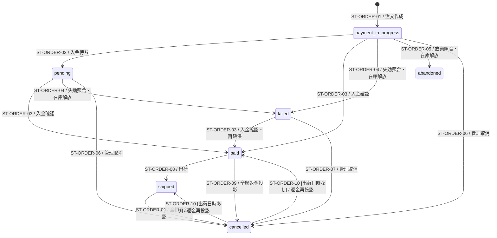

# 注文・決済の状態

> 状態: 現行ソース確認 | 確認日: 2026-10-04 | 対象: `orders.status`と決済・在庫の独立属性

## 概要

注文の状態値と、それを更新する照合・管理RPCを示す。Stripeの現在値、下書き、Webhookキュー、返金額、在庫確保、通知は別の対象・属性として扱う。現行アプリはStripeを入金済み・入金待ちと確認した照合処理から注文を作る。決済前に注文受付APIを呼ぶ経路は現在の `src` にはない。

## 範囲と根拠

対応領域は [CHECKOUT](../pages/13_checkout.md)と[ADMINの注文管理](../pages/16_admin.md)。[購入シーケンス](../sequence/checkout-payment.md)、[管理シーケンス](../sequence/order-administration.md)、[下書き](checkout-draft.md)、[キュー](stripe-webhook-queue.md)、[要対応記録](payment-exception.md)を関連モデルとする。

| 略号 | 実装根拠 |
| --- | --- |
| P | [注文受付RPC](../../../supabase/migrations/20260927100300_place_order_from_checkout_draft.sql) |
| M | [基の入金済み・入金待ちRPC](../../../supabase/migrations/20260927100400_mark_order_payment_rpcs.sql)。現行定義は D |
| L | [基の未入金の在庫解放RPC](../../../supabase/migrations/20260927100200_release_stock_by_order.sql)。現行定義は D |
| E | [要対応・管理取消RPC](../../../supabase/migrations/20260927100500_payment_exceptions.sql)。出荷とメールの行を書く処理は D |
| D | [グループ D の移行 B: 入金済み・入金待ち・在庫解放・発送と、同じ取引でのメールの行の作成](../../../supabase/migrations/20261009095736_order_email_enqueue.sql) |
| R | [返金投影RPC](../../../supabase/migrations/20260925000218_add_order_state_transition_rpcs.sql) |
| C | [照合器](../../../src/lib/stripe/checkout-payment-reconciler.ts)、[判定関数](../../../src/lib/stripe/checkout-payment-decision.ts)、[Stripe現在値の読取り](../../../src/lib/stripe/checkout-payment-reader.ts) |

## 状態定義

| DB値 | 意味・表示上の扱い |
| --- | --- |
| `payment_in_progress` | 注文を受付RPCで作成した初期状態。顧客の注文履歴・KPI対象から除外する値 |
| `pending` | Stripe現在値を入金待ちと照合した状態 |
| `paid` | Stripe現在値を入金済みと照合した状態。金額不一致や未確保在庫が残る場合もあり得る |
| `failed` | 未入金注文で払込票の失効等を照合し、確保在庫を解放した状態。遅れて入金した場合の回復経路がある |
| `abandoned` | 手続き未完了のCheckout期限切れを照合した状態。顧客履歴・KPI対象から除外する値 |
| `cancelled` | 人が未入金注文を取り消した場合、または成功返金の合計が注文額に到達した場合 |
| `shipped` | 管理出荷RPCで出荷情報を保存した状態 |

値の正本は[ORDER_STATUSES](../../../src/lib/orders/order-payment-types.ts)と[enum追加migration](../../../supabase/migrations/20260927100000_add_order_payment_statuses.sql)。管理画面の状態の表示名は [order-history.ts](../../../src/lib/orders/email/order-history.ts) の `ORDER_STATUS_LABELS` に揃える。表示ユーティリティの別名を新しいDB状態として追加しない。

## 状態遷移図

初期ノードは新規作成の条件付き経路。図は現在のアプリから呼ぶRPCによる遷移を示し、すべての直接SQL更新を強制するDBトリガーが適用済みとは宣言しない。状態の名前だけで終端を判断しない。

## 遷移条件と副作用

| ID | イベント・ガード | 更新・副作用 | 根拠 |
| --- | --- | --- | --- |
| ST-ORDER-01 | 注文なし、Stripe `paid/awaiting_payment`。paidは全額返金済みでないこと。draftがcreated、所有sessionと添付Sessionが一致、正の額、通貨と割引前合計が一致、商品が存在しpublished | payment_in_progressの注文と明細を作成。賄えるvariantのみstockとしpurchase台帳で確保、他はbackorder。draftをcompletedにする。ここではカートを消さない | P、C |
| ST-ORDER-02 | Stripe `awaiting_payment`、現在payment_in_progress、既存PIがあれば一致 | pending、PI補完、snapshotに含む所有sessionのカート行を削除、入金待ち注文メールの行を同じ取引で書く | D、C |
| ST-ORDER-03 | Stripe `paid`、期待状態がpayment_in_progress/pending/failedかつDB現在値一致、PI一致 | paid、PI補完、カート削除。stock明細で確保ゼロの分を再確保し、不足が残ればreview_reason。金額・通貨不一致でもpaidに更新後、要対応を記録して注文確定メールを抑止する。全額返金済みもpaidメールを抑止し、通知あり・金額一致なら注文確認メールの行を同じ取引で書く。金額一致なら後続のnone判定で返金を投影する | D、C |
| ST-ORDER-04 | Stripe `voucher_expired`、payment_in_progress/pending、通常照合 | failed、予約台帳の差から残る確保数量だけcancel台帳を追記、期限切れメールの行を同じ取引で書く | D、C |
| ST-ORDER-05 | Stripe `checkout_abandoned`、payment_in_progress、通常照合 | abandoned、同じ在庫解放。pendingからのabandonedはRPCでも拒否。放棄メールは送らない | D、C |
| ST-ORDER-06 | 管理取消: Session失効・再読取り後の期限切れ/放棄判定。要対応の取消付き解決: 外部支払可否確認後、関連注文がpayment_in_progress/pending | actor・理由必須、otherはメモ必須。期待状態付き更新、残る予約分だけ解放、取消情報を保存、指定時に取消メールの行を同じ取引で書く | D、E、[管理status API](../../../src/app/api/admin/orders/%5Bid%5D/status/route.ts)、[例外resolve API](../../../src/app/api/admin/payment-exceptions/%5Bid%5D/resolve/route.ts) |
| ST-ORDER-07 | actor・理由、otherならメモ。現在failed、メモ500字以下 | cancelled。追加の在庫解放と取消メールは行わない | E、管理status API |
| ST-ORDER-08 | admin.orders.manage、actor・配送業者・追跡番号、paid、未出荷、必須配送先が揃い、未解決paid_amount_mismatchがない | shipped、出荷日時・配送情報、`notifyCustomer` が true の時だけ発送メールの行を同じ取引で書く。review_reason未確認自体はこのRPCの拒否条件に含まれていない | D、管理status API |
| ST-ORDER-09 | Stripe全ページのsucceeded返金額を注文額で上限化し、合計が全額。旧status・返金額・更新時刻のCAS一致 | cancelled、返金額・返金日時・更新時刻を投影。返金RPCは在庫台帳を変更しない | R、[返金同期](../../../src/lib/stripe/order-refund-sync.ts) |
| ST-ORDER-10 | cancelledの旧返金額が全額、新たな成功返金額が全額未満、同じCAS条件 | shipped_atありならshipped、なしならpaid。未入金由来の取消（旧返金額が全額未満）は戻さない | R、返金同期 |

更新0件は成功した遷移ではない。照合器はStripeと注文を最大3回読み直す。state_conflictが最終回まで続けば要対応を記録してneeds_actionを返す。最大3回の試行内でdoneに達せず、最終回がapplied/lost_raceで追加読取りを要する場合はReconcileTransientError(not_converged)。管理APIの0件は409等の競合結果になる。

## Stripe現在値の分類

次はローカルの観測分類であり、Stripe自身の状態機械やDBのenumではない。イベントの種類と到着順だけで注文状態を更新しない。

| 観測分類 | 読取り条件 | 注文への判断 |
| --- | --- | --- |
| `in_progress` | Sessionがopen | 通常は変更なし。pending/paid/shippedとの組合せは矛盾記録 |
| `checkout_abandoned` | Sessionがexpired | payment_in_progressだけ放棄へ。注文なしなら新規注文を作らない |
| `zero_amount_complete` | Session complete、no_payment_required | 注文なしなら監査記録のみ、注文ありは金額の要対応 |
| `paid` | Session complete、PIあり、payment_status paidまたはPI succeeded。返金額は展開したlatest_charge.amount_refunded、受取額はPI.amount_received | 注文なしは全額返金済みなら記録のみ、一部返金なら新規作成。paid/shippedのnone判定でも返金額>0なら返金を同期し、同期後statusを返す。cancelledへの入金はStripe返金額が受取額未満なら要対応 |
| `awaiting_payment` | Session complete/unpaid、PI requires_action/processing | 新規作成またはpendingへ。既にpendingなら変更なし |
| `voucher_expired` | Session complete/unpaid、PI requires_payment_method/canceled | 未入金注文の在庫解放。注文なしなら何もしない |
| `missing` | Stripe resource_missing | 注文なしなら監査記録のみ、注文ありは要対応 |
| `not_applicable` | 対象外・分類不能 | 注文なしは記録のみ、注文ありは想定外状態の要対応 |

通常の `readCheckoutPayment` の分岐と、PIからSessionを逆引きする互換経路はCの読取り実装を根拠とする。外部サービス内部の自動遷移はこの図の対象外。

### 行動決定表と先行ガード

照合器は次の順で判定する。先行ガードに該当した場合、下の表より優先する。

1. 注文とsnapshotの両方にPI IDがあり不一致なら`state_conflict(payment_intent_mismatch)`。
2. 注文paid/shippedかつsnapshot paidで注文額/通貨と受取額/通貨が違えば`paid_amount_mismatch`。以前の要対応記録が失敗していても再検出する。
3. 注文なし・draft IDなしではmissing以外を`not_applicable(no_draft)`に置き換える。既存注文はdraft IDなしでも通常判定する。

| Stripe観測 | 注文なし | payment_in_progress | pending | paid / shipped | failed | abandoned | cancelled |
| --- | --- | --- | --- | --- | --- | --- | --- |
| paid | 全額返金済みなら記録のみ、それ以外は作成・paid | paidへ | paidへ | 変更なし・必要な返金同期 | paidへ再確保 | 状態矛盾 | 返金額>=受取額なら変更なし、それ以外は取消後入金の要対応 |
| awaiting_payment | 作成・pending | pendingへ | 変更なし | 状態矛盾 | 状態矛盾 | 状態矛盾 | 状態矛盾 |
| voucher_expired | 変更なし | failedへ | failedへ | 状態矛盾 | 変更なし | 変更なし | 変更なし |
| checkout_abandoned | 変更なし | abandonedへ | 状態矛盾 | 状態矛盾 | 変更なし | 変更なし | 変更なし |
| in_progress | 変更なし | 変更なし | 状態矛盾 | 状態矛盾 | 変更なし | 変更なし | 変更なし |
| zero_amount_complete | 記録のみ | 金額不一致 | 金額不一致 | 金額不一致 | 金額不一致 | 金額不一致 | 金額不一致 |
| missing | 記録のみ | Stripe対象なし | Stripe対象なし | Stripe対象なし | Stripe対象なし | Stripe対象なし | Stripe対象なし |
| not_applicable | 記録のみ | 想定外状態 | 想定外状態 | 想定外状態 | 想定外状態 | 想定外状態 | 想定外状態 |

「全額返金済み」は注文なしの作成判定とメール抑止では`amountRefunded > 0 && amountRefunded >= amountReceived`。既存cancelledの判定は実コード通り`amountRefunded >= amountReceived`で、返金>0を追加しない。作成なしの返金は監査note `refunded_before_order`だけで、新しい要対応理由や注文状態を追加しない。

通常のfailed/abandonedへの解放は`adminCancel`付きならcancelledへ置き換える。状態矛盾は最終回前なら再読取り、最終回なら`state_conflict`を記録。金額不一致、Stripe対象なし、想定外状態、取消後入金は、それぞれ`paid_amount_mismatch`、`stripe_object_missing`、`unexpected_state`、`cancelled_order_paid`の要対応となる。

返金同期は、none判定かつpaid/shipped注文・paid snapshot・返金額>0・PIありの場合に[返金同期](../../../src/lib/stripe/order-refund-sync.ts)を呼ぶ。成功Refundの全ページを注文額で上限化し、CASと再読取りを最大3回行う。全額ならST-ORDER-09、一部なら状態を維持して返金属性のみ更新する。返金0や既にcancelledの注文にはこの照合器から呼ばない。WebhookのRefund分岐、管理返金、会計照合からの直接呼出しは[注文管理](../sequence/order-administration.md)を参照する。

同期後のcancelledを古いpaid/shippedとして返さず、completeはorderIdなし・cancelledとも409。返金同期のStripe/DB一時障害や未収束は照合器の一時エラーとなり、成立済み入金更新を巻き戻さない。

## 独立属性と不変条件

- `refunded_amount`は成功返金の投影。部分返金はpaid/shippedを維持し、pending/failedのRefundは合計へ加えない。
- 在庫確保はstock_movementsのpurchase/cancel差で判断する。`stock_released`という列を仮定しない。未入金取消は解放、返金取消は台帳を変更しない。
- `review_reason/review_marked_at`は在庫確保不足等、`reviewed_at/reviewed_by`は手動確認。確認済みにしても理由は消さない。
- 金額不一致のpaid注文は[要対応](payment-exception.md)を解決するまで出荷RPCが拒否する。paidであることだけから出荷可能とは判断しない。
- 注文のメールは、状態を変える関数が同じ取引で `private.order_email_outbox` に行を書き、worker が送る（[グループ D 設計書](../../superpowers/specs/2026-10-09-order-email-outbox-design.md)）。
- 旧finalize RPC、PI IDで呼ぶ旧release RPCは[廃止migration](../../../supabase/migrations/20260927100800_retire_legacy_order_rpcs.sql)に含まれ、現行の正規経路として図示しない。

## 関連テスト

[状態値](../../../tests/unit/lib/orders/order-payment-types.test.ts)、[判定表](../../../tests/unit/lib/stripe/checkout-payment-decision.test.ts)、[照合器](../../../tests/unit/lib/stripe/checkout-payment-reconciler.test.ts)、[入金RPC](../../../tests/integration/db/mark_order_payment.integration.test.ts)、[在庫解放](../../../tests/integration/db/release_stock_by_order.integration.test.ts)、[返金同期](../../../tests/unit/lib/stripe/order-refund-sync.test.ts)、[出荷API](../../../tests/unit/api/admin/order-status-shipped.test.ts)。今回のDB・外部サービス実行成功証跡ではない。

## 未確認事項

本番migration適用、実際のStripe現在値、Cronの登録、実データによる全競合・遅延入金は未確認。`supabase/pending/`の状態遷移強制・schedule案を適用済みの事実として扱わない。ソース中の最大所要時間のコメントも、件数・時間制限がある見回りの無条件保証として記載しない。
