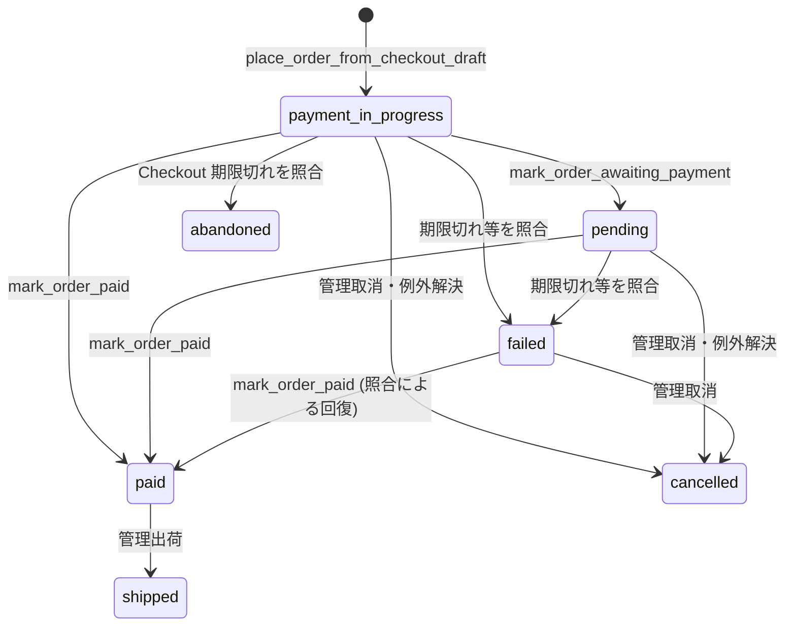

# 注文・決済の状態（現行実装）

## 概要

この図は現在の照合処理と RPC から確認できる主要遷移を示す。すべての管理操作や過去データの遷移を許す完全な状態機械ではない。Stripe の状態、DB の条件付き RPC、在庫処理を合わせて判断する。

`checkout_drafts` は `created` で始まり、`place_order_from_checkout_draft` が注文を `payment_in_progress` で作ったとき `completed` になる。同 RPC は既存注文を返す冪等経路と、draft・金額・通貨・商品状態を確認する拒否経路を持つ（`20260927100300_place_order_from_checkout_draft.sql`）。

`mark_order_awaiting_payment` は `payment_in_progress` だけを `pending` にし、`mark_order_paid` は呼び出し側の期待状態が `payment_in_progress`・`pending`・`failed` の場合に更新する。どちらも PaymentIntent の一致を確認する（`20260927100400_mark_order_payment_rpcs.sql`）。失敗、放棄、取消の判定は Stripe の観測値に基づく照合器にあり、結果によって在庫を解放する（`src/lib/stripe/checkout-payment-reconciler.ts`）。`failed → cancelled` と `paid → shipped` は管理用 RPC の条件付き更新（`20260927100500_payment_exceptions.sql`）。

Stripe Webhook は署名を検証して `stripe_webhook_events` に登録する。別の Cron API がイベントを claim して処理し、キュー状態は `queued`・`processing`・`completed`・`failed` を取る（`src/app/api/webhook/stripe/route.ts`、`src/app/api/cron/process-stripe-webhooks/route.ts`、`20260925000303_add_stripe_webhook_queue.sql`）。決済の不一致などは `payment_exceptions` に残す。実際の本番 Webhook 配信、Cron 登録、migration 適用状況は未確認である。

関連: [ER 図](../../03_BasicDesign/data/er.md)、[API 一覧](../../03_BasicDesign/api/api-spec.md)。
