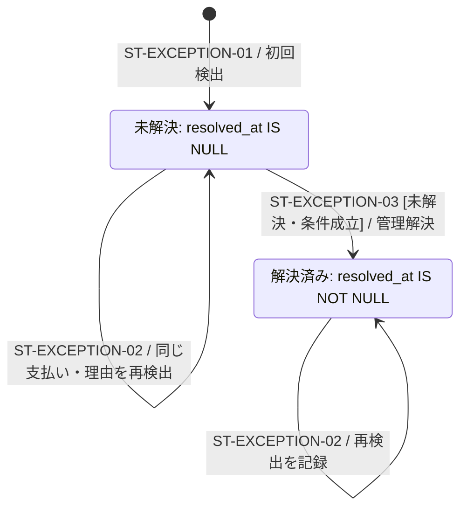

# 決済の要対応記録の状態

> 状態: 現行ソース確認 | 確認日: 2026-10-04 | 対象: `payment_exceptions`の解決状態

## 概要

要対応記録に `status` 列はない。`resolved_at IS NULL`を未解決、非NULLを解決済みとして扱う。同じ支払い・同じ理由は1行にまとめ、解決後の再検出でも未解決に戻さない。注文の要確認フラグと別の対象である。

## 範囲と根拠

対応領域: [ADMINの要対応・要確認](../pages/16_admin.md)、[注文管理シーケンス](../sequence/order-administration.md)。定義とRPCは[要対応migration](../../../supabase/migrations/20260927100500_payment_exceptions.sql)、検出は[照合器](../../../src/lib/stripe/checkout-payment-reconciler.ts)、解決は[resolve API](../../../src/app/api/admin/payment-exceptions/%5Bid%5D/resolve/route.ts)。

## 状態定義と図

## 遷移条件

| ID | 契機・ガード | 更新と結果 |
| --- | --- | --- |
| ST-EXCEPTION-01 | 照合器が要対応と判定、`(payment_ref, reason)`が未登録 | `record_payment_exception`がINSERT、最初と最後の検出時刻、検出回数1。`is_new=true` |
| ST-EXCEPTION-02 | 同じunique keyが存在 | 最後の検出時刻と回数を更新し、欠けていた参照IDを補う。`resolved_at`を消さず、解決済みかを返す |
| ST-EXCEPTION-03 | `admin.orders.manage`とAAL2を満たす利用者、actorあり、対象行が存在し未解決。resolve APIにadminロールだけの追加制限はない | RPCが対象をロックし `resolved_at/resolved_by/resolution_note`を更新。既に解決済みならfalse、APIは409 |

### 注文を取り消して解決する場合

`cancelOrder=true`では取消理由と空でないメモが必要。APIは必要な場合に既存Checkout Sessionの失効を試みてStripeを読み直す。`paid`・`in_progress`・`awaiting_payment`、または未来の払込期限がある場合は409で拒否する。Stripeの一時的な確認失敗時も取消へ進まない。関連注文にStripe参照IDがなければ、この外部確認は行わずRPCへ進む。

RPCは関連注文が `payment_in_progress/pending` であることを確認し、`release_stock_for_unpaid_order`の条件付き更新が成功した場合だけ、同じトランザクションで例外を解決する。取消成功後、notifyCustomer指定に応じて通知を試みる。単なる「解決済みにする」はStripe返金や注文取消を実行しない。

## 独立属性・不変条件

| 属性 | 状態との区別 |
| --- | --- |
| `reason` | `order_not_creatable`、`paid_amount_mismatch`、`cancelled_order_paid`、`state_conflict`、`unexpected_state`、`stripe_object_missing`。解決状態ではない |
| 通知 | `shop_notified_at/customer_notified_at`で送信権をclaimし、送信失敗ならNULLへ戻す。通知claim RPC自体の条件は各通知時刻がNULLであること。解決済みかの判定は呼び出し側の責務 |
| 要確認 | 注文の `review_reason/review_marked_at/reviewed_at/reviewed_by`。在庫確保不足などを記録する別属性。手動確認はreviewed_at/byを設定し、reasonを消さない。要対応行の解決とは別操作 |
| 再検出 | 解決済みを再度開くRPCはこの実装にない。新たな別理由なら別unique keyの行として記録する |

根拠: [状態値と理由](../../../src/lib/orders/order-payment-types.ts)、[DBと通知RPC](../../../supabase/migrations/20260927100500_payment_exceptions.sql)、[照合器](../../../src/lib/stripe/checkout-payment-reconciler.ts)。

## 関連テスト

[要対応API](../../../tests/unit/api/admin/order-attention-route.test.ts)、[照合器](../../../tests/unit/lib/stripe/checkout-payment-reconciler.test.ts)、[PostgREST照合](../../../tests/integration/db/reconciler_postgrest.integration.test.ts)。今回の実行成功証跡ではない。

## 未確認事項

本番の制約適用、実際の通知到達、管理者の対応履歴は未確認。「解決済み」は人の記録であり、Stripeの入金・返金結果の保証として扱わない。
