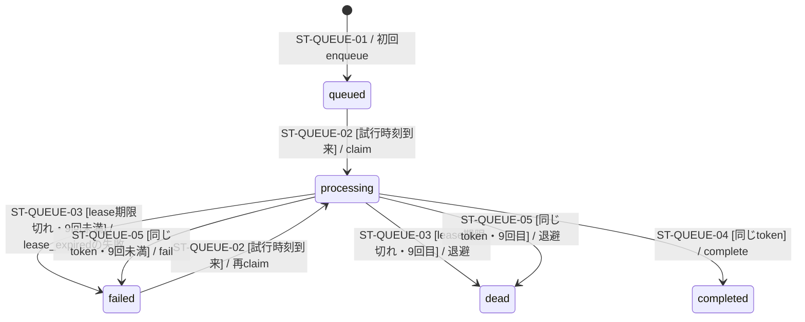

# Stripe Webhookキューの状態

> 状態: 現行ソース確認 | 確認日: 2026-10-07 | 対象: `stripe_webhook_events.processing_status`

## 概要

署名検証済みの13種のイベントを永続化して受付応答を返す。workerは毎分のCron起動と、受付APIが保存の後に`after()`で動かす1回のどちらでも、取り出せる Stripe のイベントが無くなるか35秒たつまで1件ずつ処理し、続いて注文のメールを10秒の予算で送る。その後に店への知らせの点検と配達の見回りが続く（入口の実行上限は60秒）。9回目の試行も失敗したイベントは`dead`にして取り出さず、店へ知らせる。キューの `completed` はイベントの処理完了であり、注文の入金成功ではない。要対応・要確認を記録して正常に戻った場合もイベント処理は完了する。

## 範囲と根拠

対応: [Webhookシーケンス](../sequence/stripe-webhooks.md)、[CHECKOUTのFR-CHECKOUT-009](../pages/13_checkout.md)。定義と遷移は[キューmigration](../../../supabase/migrations/20260925000303_add_stripe_webhook_queue.sql)と、再試行・待機・退避を定める[退避のmigration](../../../supabase/migrations/20261007030242_webhook_queue_dead_letter.sql)、呼び出し元は[イベントサービス](../../../src/lib/stripe/webhook-events.ts)、[Webhook受付](../../../src/app/api/webhook/stripe/route.ts)、[worker](../../../src/app/api/cron/process-stripe-webhooks/route.ts)、[workerの繰り返し](../../../src/lib/stripe/webhook-drain.ts)。

## 状態定義と図

| 状態 | 意味 |
| --- | --- |
| `queued` | 受付済み、未claim |
| `processing` | claim tokenを持つworkerの処理対象。5分のlease付き |
| `completed` | 同じclaim tokenで処理成功を記録した |
| `failed` | 同じclaim tokenで失敗を記録し、次の試行時刻まで待機。lease切れの失敗（`lease_expired`）も含む |
| `dead` | 9回目の試行も失敗して退避した終端。取り出さず、`dead_at`を記録する。店へまとめて知らせたら`dead_notified_at`を記録する |

## 遷移条件と副作用

| ID | 条件 | DBの更新・拒否 |
| --- | --- | --- |
| ST-QUEUE-01 | 署名が有効な初回 `event.id` | enqueue RPCがpayloadと `queued` を保存。同じIDでtype・data・account・livemodeが一致する重複はfalseを返し、既存状態を初期化しない。不一致はID衝突の例外となり受付500 |
| ST-QUEUE-02 | `queued/failed`かつ `next_attempt_at <= now()`、`raw_payload`あり | `FOR UPDATE SKIP LOCKED`で1行、`processing`へ更新、attempt_countを加算、tokenを生成、leaseを5分先へ |
| ST-QUEUE-03 | `processing`かつlease期限切れ（claim RPCの冒頭で検出） | 1回の失敗として数える。`attempt_count`が9未満なら`failed`（`last_error`は`lease_expired`、`next_attempt_at = now()+2^(attempt_count-1)分`）、9以上なら`dead`（`dead_at`を記録）。tokenとleaseを消すので、前workerのtokenによる後続complete/failは一致せず更新不可 |
| ST-QUEUE-04 | `processing`かつevent ID・claim tokenが一致 | `completed`。RPCがfalseならイベントサービスはclaim喪失として例外を投げる |
| ST-QUEUE-05 | `processing`かつevent ID・claim tokenが一致 | `attempt_count`が9未満なら`failed`、原因の記号（`last_error`）、`next_attempt_at = now()+2^(attempt_count-1)分`。9以上なら`dead`（`dead_at`を記録）。RPCがfalseならclaim喪失として例外 |

試行は最初の1回を含めて9回まで（`private.stripe_webhook_max_attempts()`）で、9回目も失敗したら`dead`になる。`dead`を戻す操作は作っていない（注文は見回りが、返金と会計は照合がStripeに合わせる）。payloadがない行はclaimしない。`failed`は再試行可能であり、図の終端ではない（終端は`completed`と`dead`）。claim時の行ロックとcomplete/fail時のtoken一致でキュー更新を制御する。lease期限だけではtokenを失わず、次のclaimがlease切れの行を失敗にするまでは、期限後も同じtokenでcomplete/failできる。処理中のlease延長や旧workerの停止は実装されていないため、失敗にされた後も旧workerの業務処理が進む場合がある。Stripeやメールの外部副作用を含む処理全体の排他・一括トランザクションではない。

## 処理結果との対応

workerは保存payloadのID・type・data.objectを検証し、処理関数が正常に戻ればcompleteする。処理例外またはcomplete例外は原因の記号つきでfailを試み、fail記録そのものが失敗してもログに残して次のイベントへ進む。1回の起動は、Stripe のclaim対象が無くなる（`empty`）か35秒の予算を使い切る（`budget`）まで続く。続いて注文のメールを10秒の予算で送り、その後に点検と配達の見回りを行い、応答は200 `{processed,failed,stoppedBy}`。claimのDB障害（`claim_error`）だけが502で、そこで繰り返しを止める。詳細は[シーケンス](../sequence/stripe-webhooks.md)。

payload検査は保存行とのID・type一致、dataがobjectであることと`object`キーの存在を確認する。`data.object`自体の型や各イベントの必須参照IDをすべて事前検証する処理ではなく、後段の業務処理が拒否する場合もある。claim返却値の形式が不正な場合はclaim失敗（`claim_error`）として502となり、その要求ではfailを呼ばない。検査に落ちた保存payloadは`invalid_payload`の失敗として数える。DBで既にprocessingとなった行は、lease期限後の次のclaimで失敗（`lease_expired`）として数えられ、待機の後に再claim対象となる（9回目なら`dead`）。

## 関連テスト

[キューRPC](../../../tests/integration/db/stripe_webhook_queue.integration.test.ts)、[イベントサービス](../../../tests/unit/lib/stripe/webhook-events.test.ts)、[Cron worker](../../../tests/unit/api/cron/process-stripe-webhooks-route.test.ts)。今回の実行成功証跡ではない。

## 未確認事項

本番のキューmigration適用と配信状況、Cronの登録・接続・実起動は未確認。`supabase/pending/`のschedule案を稼働済みの証拠として使わない。
