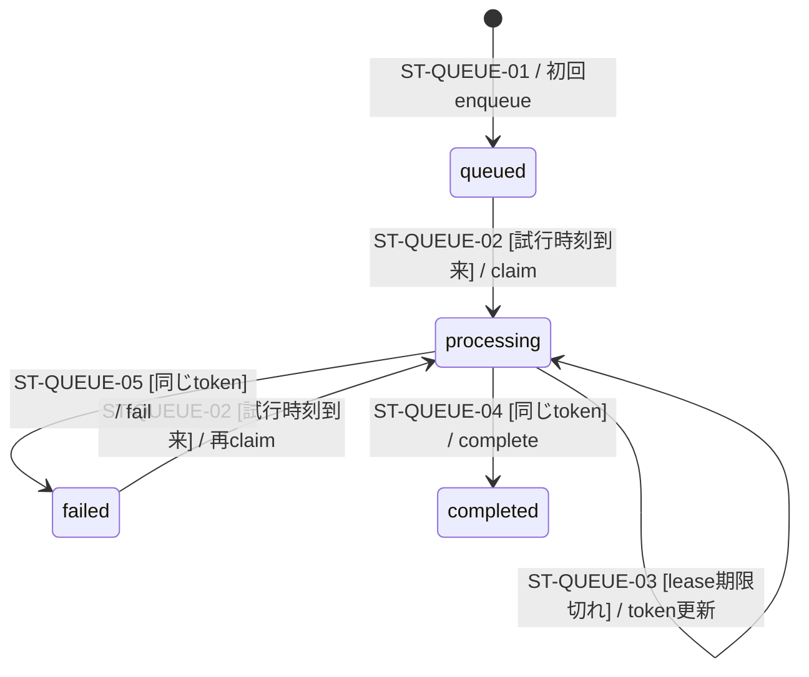

# Stripe Webhookキューの状態

> 状態: 現行ソース確認 | 確認日: 2026-10-04 | 対象: `stripe_webhook_events.processing_status`

## 概要

署名検証済みイベントを永続化して受付応答を返し、Cron workerが1回につき最大1件を処理する。キューの `completed` はイベントの処理完了であり、注文の入金成功ではない。要対応・要確認を記録して正常に戻った場合もイベント処理は完了する。

## 範囲と根拠

対応: [Webhookシーケンス](../sequence/stripe-webhooks.md)、[CHECKOUTのFR-CHECKOUT-009](../pages/13_checkout.md)。定義と遷移は[キューmigration](../../../supabase/migrations/20260925000303_add_stripe_webhook_queue.sql)、呼び出し元は[イベントサービス](../../../src/lib/stripe/webhook-events.ts)、[Webhook受付](../../../src/app/api/webhook/stripe/route.ts)、[worker](../../../src/app/api/cron/process-stripe-webhooks/route.ts)。

## 状態定義と図

| 状態 | 意味 |
| --- | --- |
| `queued` | 受付済み、未claim |
| `processing` | claim tokenを持つworkerの処理対象。5分のlease付き |
| `completed` | 同じclaim tokenで処理成功を記録した |
| `failed` | 同じclaim tokenで失敗を記録し、次の試行時刻まで待機 |

## 遷移条件と副作用

| ID | 条件 | DBの更新・拒否 |
| --- | --- | --- |
| ST-QUEUE-01 | 署名が有効な初回 `event.id` | enqueue RPCがpayloadと `queued` を保存。同じIDでtype・data・account・livemodeが一致する重複はfalseを返し、既存状態を初期化しない。不一致はID衝突の例外となり受付500 |
| ST-QUEUE-02 | `queued/failed`かつ `next_attempt_at <= now()`、`raw_payload`あり | `FOR UPDATE SKIP LOCKED`で1行、`processing`へ更新、attempt_countを加算、tokenを生成、leaseを5分先へ |
| ST-QUEUE-03 | `processing`かつlease期限切れ、payloadあり | 再claimでtokenを更新。前workerのtokenによる後続complete/failは一致しないため更新不可 |
| ST-QUEUE-04 | `processing`かつevent ID・claim tokenが一致 | `completed`。RPCがfalseならイベントサービスはclaim喪失として例外を投げる |
| ST-QUEUE-05 | `processing`かつevent ID・claim tokenが一致 | `failed`、エラー分類、`next_attempt_at = now()+min(1800, 30*attempt_count)秒`。RPCがfalseならclaim喪失として例外 |

実装に再試行回数の固定上限はない。payloadがない行はclaimしない。`failed`は再試行可能であり、図の終端ではない。claim時の行ロックとcomplete/fail時のtoken一致でキュー更新を制御する。lease期限だけではtokenを失わず、再claim前なら期限後も同じtokenでcomplete/failできる。処理中のlease延長や旧workerの停止は実装されていないため、再claim後も旧workerの業務処理が進む場合がある。Stripeやメールの外部副作用を含む処理全体の排他・一括トランザクションではない。

## 処理結果との対応

workerは保存payloadのID・type・data.objectを検証し、処理関数が正常に戻ればcompleteする。処理例外またはcomplete例外はfailを試みて502を返し、fail記録そのものが失敗しても502を返す。claim対象なしは200 `{processed:0}`。詳細は[シーケンス](../sequence/stripe-webhooks.md)。

payload検査は保存行とのID・type一致、dataがobjectであることと`object`キーの存在を確認する。`data.object`自体の型や各イベントの必須参照IDをすべて事前検証する処理ではなく、後段の業務処理が拒否する場合もある。claim返却値の形式が不正な場合はclaim失敗として502となり、その要求ではfailを呼ばない。DBで既にprocessingとなった行はlease期限後の再claim対象となる。

## 関連テスト

[キューRPC](../../../tests/integration/db/stripe_webhook_queue.integration.test.ts)、[イベントサービス](../../../tests/unit/lib/stripe/webhook-events.test.ts)、[Cron worker](../../../tests/unit/api/cron/process-stripe-webhooks-route.test.ts)。今回の実行成功証跡ではない。

## 未確認事項

本番のキューmigration適用と配信状況、Cronの登録・接続・実起動は未確認。`supabase/pending/`のschedule案を稼働済みの証拠として使わない。
