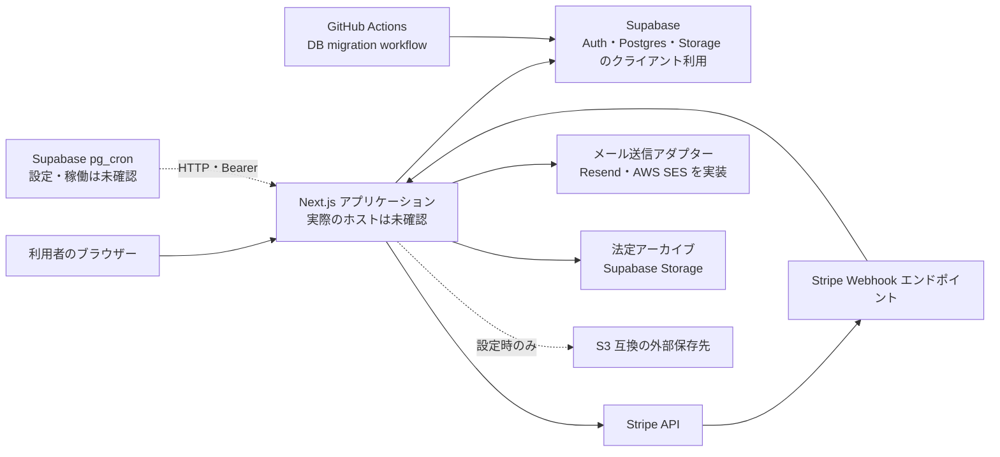

# 配置構成

## 概要

この図はリポジトリのコードとワークフローから確認できる連携経路を表す。アプリの本番ホスティング先、実際の環境変数、外部サービスの契約・稼働状態、ジョブの登録状況はこのリポジトリだけでは確認できない。`README.md` には Vercel デプロイ時の注意があるが、現在の配置先を確定する証拠ではない。

## 構成図

| 経路 | リポジトリで確認した根拠 | 稼働状況 |
| --- | --- | --- |
| アプリと Supabase | `@supabase/supabase-js`、`@supabase/ssr`、`src/lib/legal-archive/supabase-storage.ts` | 接続先と本番状態は未確認 |
| 決済 | `src/app/api/webhook/stripe/route.ts`、`src/app/api/checkout/`、`src/app/api/cron/stripe-reconcile/route.ts` | 本番 Webhook の登録・配信は未確認 |
| メール | `src/lib/mail/adapters/resend.ts`、`src/lib/mail/adapters/ses.ts` | どちらのアダプターが本番で選ばれるか未確認 |
| 外部アーカイブ | `src/lib/legal-archive/s3-storage.ts` | 必要な環境設定と保存実績は未確認 |
| DB 変更 | `.github/workflows/db-migrations.yml` は PR で dry run、push/workflow_dispatch で `supabase db push` を構成 | 実際の実行・適用履歴は未確認 |
| 定期処理 | `src/app/api/cron/`、README の pg_cron 設定手順 | 登録・実行・成功は未確認 |

## 運用上の参照先

| 目的 | 文書・設定 |
| --- | --- |
| DB マイグレーションと台帳 | `docs/06_Operations/db-migrations.md`、`.github/workflows/db-migrations.yml` |
| シークレットと Stripe 同期 | `docs/06_Operations/secrets.md`、`README.md` |
| 注文証憑の保存・復元確認 | `docs/06_Operations/legal-archive.md` |
| KPI 旧セットアップ手順 | `docs/06_Operations/kpi-migration-setup.md`。対象環境と現行 DB 手順との整合を確認してから使用する |

本番構成を確定する際は、ホスティング管理画面、GitHub Actions 実行履歴、Supabase の migration・cron・Storage の状態、Stripe の Webhook 設定、メール提供元の設定を別途照合する。
