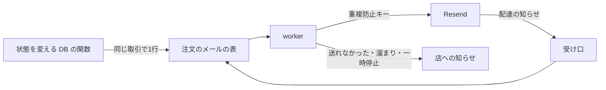

# 注文のメールの手順書

> 対象: お客様への注文のメール（注文確認・入金待ち・支払い期限切れ・取消・発送。発送は発送ごとに1通）の送信・やり直し・一時停止・配達の状態と、店への知らせ
> 設計: [グループ D 設計書](../superpowers/specs/2026-10-09-order-email-outbox-design.md)、Stripe の知らせと定期処理: [手順書](webhook-queue-operations.md)

---

## 概要

注文のメールは、注文の状態を変える DB の関数が「注文のメール」の表に1行書き、毎分の worker（Stripe の知らせの worker の続き）と、行を書いた窓口の返事の後の worker が送る。この手順書は、公開のときにやること、本番の Resend とつないだ通しの確かめ、店へ知らせのメールが届いたときの調べ方、配達の知らせの鍵の入れ替え、状態の確かめ方をまとめる。値（鍵・合言葉）はこの文書にもチャットにもコミットにも残さない。

| 場面 | 見る節 |
|---|---|
| 公開のとき | 1 |
| 本番の Resend とつないだ通しの確かめ | 2 |
| 店へ知らせのメールが届いた | 3 |
| 配達の知らせの鍵を入れ替える | 4 |
| 状態を確かめる | 5 |
| 配達の見回りが失敗する・上限を確かめる | 6 |
| 発送のメール（発送ごとに1通）・発送を取り消した時 | 7 |

| 仕組み | いつ | どこで |
|---|---|---|
| 送る | 毎分（Stripe の知らせの後に10秒まで）と、行を書いた窓口の返事の後 | `POST /api/cron/process-stripe-webhooks`・`after()` |
| 配達の状態 | Resend の知らせが届いたとき | `POST /api/webhook/resend-delivery` |
| 配達の見回り | 1時間ごと（毎分の worker の最後、店への知らせの点検の後） | Resend の API（Full access の鍵が要る） |
| 店への知らせの点検 | 毎分の worker と毎時の期限切れの見回り | `runOrderEmailOpsChecks`・`POST /api/cron/expire-pending-orders` |
| 本文の片付け | 毎日 4:40（19:40 UTC） | DB の中だけ（送信済みの本文は45日を過ぎた分を消し、受付済みの番号は3日） |



---

## 1. 公開のときにやること

### 1-1 本番の移行の順番と照合

移行は戻さない。直す時は前へ進める移行で直す。[移行 A](../../supabase/migrations/20261009095633_order_email_outbox.sql) を当ててから [移行 B](../../supabase/migrations/20261009095736_order_email_enqueue.sql) を当てる。B は古い `private.order_emails` の印を、送らない `legacy_suppressed` の行として移し、古い表を消す。古い表は B の後には無いので、種類ごとの件数は当てる前に控える。実際の順は次のとおり。

1. 当てる前に、入金待ちのまま残る試しの注文を、お客様に知らせない取消として片付けておく。有効な払込票は管理画面が409で断るので、期限切れの確定を待つか開発者に相談し、強制的に状態を書き換えない。
2. 当てる前に、古い表の種類ごとの件数と合計を控える（下の SQL の前半）。
3. A、B の順に当てる。
4. 当てた後に、新しい表の `legacy_suppressed` の行を種類ごとに数え、控えと照合する（下の SQL の後半）。公開前の試しの行を取りやめる 1-2 より前に行う。

照合は、Supabase のダッシュボード（本番のプロジェクト）→ SQL Editor で、次の読むだけの SQL を流す。種類ごとの件数と、合計8行・2注文が同じことを確かめる（8行・2注文は2026-10-09の確認値。違えば適用・公開を止めてユーザーへ知らせる）。

```sql
-- 当てる前（B の後はこの表は無い）。種類ごとの件数を控える
select kind, count(*) from private.order_emails group by kind order by kind;
select count(*) as rows, count(distinct order_id) as orders from private.order_emails;

-- A → B を当てた後。公開前の試しの行を取りやめるより前に照合する
select kind, count(*) from private.order_email_outbox
where last_error_code = 'legacy_suppressed' group by kind order by kind;
select count(*) as rows, count(distinct order_id) as orders from private.order_email_outbox
where last_error_code = 'legacy_suppressed';
```

### 1-2 公開前の送信待ちの確かめ

1-1 の移行と照合の後、`MAIL_PROVIDER` などの本番の環境変数を入れる前に、本番の `private.order_email_outbox` に溜まった送信待ち・送信中・やり直し待ちの行を確かめる。普段の開発で本番の DB につないだ `next dev` から決済・発送・取消を試すと、状態を変える DB の関数は同じ取引で送る予定の行を書く。開発の worker は環境の門で止まるため、行は残り、公開後の最初の worker が本物の Resend から試しの注文の宛先へ送ってしまう。実在の他人の宛先なら個人情報が届き、架空の宛先なら跳ね返りで送信の評価が下がる。

次の読むだけの SQL を、Supabase のダッシュボード（本番のプロジェクト）→ SQL Editor で流す。件数と、注文番号・種類・作った時刻だけを見る。宛先・件名・本文は出さない。

```sql
-- 送信待ち・送信中・やり直し待ちの件数
select status, count(*)
from private.order_email_outbox
where status in ('pending', 'sending', 'retry_wait')
group by status order by status;

-- 対象の一覧（注文番号は管理画面と同じ ORD-＋UUID の先頭8文字）
select 'ORD-' || upper(left(order_id::text, 8)) as order_number, kind, created_at
from private.order_email_outbox
where status in ('pending', 'sending', 'retry_wait')
order by created_at, seq;
```

公開前の試しの行があれば、上の件数と一覧をユーザーに見せ、取りやめる行について**明示の承認を得てから**、次の書き換えの SQL を同じ SQL Editor で流す。環境変数の設定・公開・worker の起動より先に行う。値の欄は承認された注文番号・種類・作った時刻だけに置き換え、承認されていない行は含めない。`sending` の担当の印と期限も消して表の制約を守り、本文を消す。変更の件数と返る一覧が承認したものと合うこと、上の読むだけの SQL で対象が残っていないことを確かめる。

```sql
-- 明示の承認を得た後だけ流す。VALUES には承認された行だけを並べる
with approved(order_number, kind, created_at) as (
  values ('<承認した注文番号>'::text, '<承認した種類>'::text, '<承認した作成時刻>'::timestamptz)
)
update private.order_email_outbox as e
set status = 'skipped', last_error_code = 'legacy_suppressed',
    subject = null, body_text = null, body_erased_at = now(), finished_at = now(),
    lease_token = null, lease_expires_at = null
from approved as a
where 'ORD-' || upper(left(e.order_id::text, 8)) = a.order_number
  and e.kind = a.kind and e.created_at = a.created_at
  and e.status in ('pending', 'sending', 'retry_wait')
returning 'ORD-' || upper(left(e.order_id::text, 8)) as order_number, e.kind, e.created_at;
```

移行を本番に当てた後から公開までは、本番の DB で注文の状態を変える試し（決済・発送・取消）をしない。移行の後に、入金待ちのまま残る試しの注文を初めて見つけた場合も、試しの取消で新しい行を増やさず、公開を止めてユーザーに知らせる（移行の前の片付けは 1-1）。

### 1-3 公開の設定

| 順 | やること | 誰が | 確かめ方 |
|---|---|---|---|
| 0 | 1-1 の移行の照合と、1-2 の公開前の送信待ちの確かめを済ませる。試しの行の取りやめは明示の承認の後だけ | ユーザーと Claude | 移行前後の種類別件数が同じ8行・2注文で、公開前の試しの送信待ちが残っていない |
| 1 | Vercel の環境変数 `MAIL_PROVIDER` を `resend`（小文字）にし、`RESEND_API_KEY`・`MAIL_FROM_ADDRESS`（確かめ済みのドメインのアドレス）・`SHOP_ALERT_EMAIL` を入れる。`RESEND_API_KEY` は Full access にする（送信専用の鍵だと、配達の見回りが「鍵の設定」で止まる。送信と Webhook は動く） | ユーザー | 5 の「送信の一時停止」で `paused` が false |
| 2 | Resend の管理画面の Webhooks で宛先 `<公開した URL>/api/webhook/resend-delivery` を作り、`email.delivered`・`email.delivery_delayed`・`email.bounced`・`email.complained`・`email.suppressed`・`email.failed` の6つを選ぶ。出た署名の鍵（`whsec_` で始まる）を Vercel の `RESEND_DELIVERY_WEBHOOK_SECRET` に入れて出し直す。お問い合わせの返信の宛先（`/api/contact/inbound`・`RESEND_WEBHOOK_SECRET`）とは別の宛先・別の鍵にする | ユーザー | Resend の管理画面で宛先が有効 |
| 3 | 2 の通しの確かめ | ユーザー（試しの注文）、Claude（確かめる） | 2 の表 |
| 4 | Vercel の「System Environment Variables を自動で公開」が有効なことを確かめる | ユーザー | `VERCEL_ENV` が実行時に見える。見えないと preview でも環境の門を通って動く |

- 本番の `MAIL_PROVIDER` は `resend`（小文字）を入れる。これは送り手を選ぶ設定の値で、秘密ではない。`resolveMailProvider` は大文字小文字まで完全一致で見るので、`Resend` と入れると送信を止め、店への知らせも届かない。ほかの送り手でも注文のメールは送らずに止める（重複防止キーの無い送り手で送らないため）。手元のメール受け（`local`）は手元の Supabase とだけ使い、ほかの DB と組み合わせると `config_provider` で一時停止する。
- 宛先を登録するまでの間も、読み取り権限のある鍵なら1時間ごとの見回りが配達の状態を拾う（6）。

### 環境の門

`orderEmailWorkerDisabledReason` は、`VERCEL_ENV` が設定されて production でない公開（preview・development）と、手元でない DB につないだ `next dev` を止める。この環境では送信（`runOrderEmailWorker`）・点検（`runOrderEmailOpsChecks`）・配達の見回り（`runOrderEmailDeliveryCheckIfDue`）は DB に触れず、心拍や知らせ済みの印も書かない。Resend の受け口（`POST /api/webhook/resend-delivery`）にはこの門は無い。

手元で `next build && next start` を本番の DB に向けない。この門は手元の本番ビルドを止めず、`MAIL_PROVIDER` が無いと既定の SES が選ばれて、本番の DB に `config_provider` の一時停止を書く。`VERCEL_ENV` が実行時に見えないと preview の判定もできないため、公開前に上の順4を確かめる。

## 2. 本番の Resend とつないだ通しの確かめ（公開の後・開店の前（お客様がいない時だけ））

公開の後・開店の前の、お客様がいない時だけ行う。1-3 の順1・2（環境変数と配達の知らせの宛先）を済ませた本番で、試しの注文の宛先を Resend の試し用の宛先にして、次を確かめる。試しの注文は確かめた後に取り消すか返金する。

あわせて、Resend の鍵（`RESEND_API_KEY`）を一時的に誤った値にし、試しの行で送信を試みる。ORDER タブの上に「お客様への注文のメールの送信を止めています」と原因が出ることを確かめる。正しい値に戻して出し直し、送る対象の1件を毎分の worker が試し、15分以内に自動で再開すること、状態を読み直すと帯が消えることを確かめる。worker が動く本番の実行環境で行う（preview・development は環境の門で止まる）。結果を下の欄に残す。開店後のお客様のいる環境では行わない。

| 宛先 | 確かめること |
|---|---|
| `delivered@resend.dev` | 管理画面の履歴に「配達済み」 |
| `bounced@resend.dev` | 「届かなかった」と「注意」、1時間以内に店へ「届かなかった注文のメール」 |
| `complained@resend.dev` | 「迷惑メールにされた」と「注意」、店への知らせ |
| `suppressed@resend.dev` | 「送信先が止められている」と「注意」、店への知らせ |

| 日付 | 宛先 | 結果 | 確かめた人 |
|---|---|---|---|
| （まだ） | | | |

## 3. 店へ知らせのメールが届いたとき

知らせは種類ごとに1時間に1回まで。お客様の氏名・住所・メールアドレスは入れず、注文番号と原因だけを書く。

### 送れなかった

件名「【要対応】送れなかった注文のメール（N件）」。やり直しても送れなかったか、このメールだけの問題で送らなかった。

1. 管理画面の ORDER タブで、その注文の「履歴」を開き、原因を見る。
2. 原因が「宛先の形が不正」なら、お客様のメールアドレスの誤りを疑い、ほかの手段（電話など）でお客様に確かめる。
3. 直せる原因なら、「お客様へ再送」で送り直す。

原因が `idempotency_conflict`（同じ送信の印で中身が違う）なら、[送信の一時停止の節の送信元を変える時の注意](#送信の一時停止)を確かめる。送信元の変更などで、同じキーの前の試行と中身が違うと Resend が409を返し、やり直さず「送れなかった」にする。前の試行が送られていないか Resend の記録を照合し、開発者に連絡する。必要な再送は新しい行・新しいキーになる。

### 届かなかった

件名「【要確認】届かなかった注文のメール（N件）」。Resend が送った後に、相手のメールの会社で届かなかった・止められた。

| 状態 | 意味 | やること |
|---|---|---|
| 届かなかった | 宛先が無い・受け取りの拒否 | 宛先の誤りを疑い、ほかの手段でお客様に確かめる |
| 迷惑メールにされた | お客様が迷惑メールと報告した | 再送しない。必要ならほかの手段で連絡する |
| 送信先が止められている | 前に届かなかった宛先で、Resend が送らない | 宛先の誤りを疑う。Resend の管理画面の Suppressions を確かめる |
| 送信サービスで送れなかった | Resend の中で送れなかった | Resend の管理画面のそのメールの記録を確かめる |

### 送信の一時停止

店主が気づく道は、管理画面の ORDER タブの上に出る「お客様への注文のメールの送信を止めています」の帯である。帯は止めている時だけ出て、原因と再開の案内を示す（E2E `FR-ADMIN-067`）。止まった時の店への知らせのメールも、止まった原因と同じ送信の道（同じ鍵・送信元・上限）を通るので届かない。

件名「【要対応】注文のメールの送信を止めています」。鍵・送信元のドメイン・送り手・送信の上限の問題で、送信全体を止めている。メールは消えずに残り、直ると試した1件が送れた時点で自動で再開する（15分ごと。1日の上限は日本時間 9時の後）。

一時停止を書き直しても、`quota_daily` 以外は「次に1件試す時刻」（`next_probe_at`）を延ばさない。`quota_daily` だけは次の UTC 0時（日本時間 9時）に決め直す。

| 原因 | 直し方 |
|---|---|
| 送信の鍵の設定 | Vercel の `RESEND_API_KEY` が Resend の有効な鍵か確かめ、入れ直して出し直す |
| 送信元のドメインの設定 | Resend の管理画面で送信元のドメインの確かめ（DNS）が通っているか、`MAIL_FROM_ADDRESS` がそのドメインか確かめる |
| 送信サービスの設定 | `MAIL_PROVIDER` が `resend`（小文字）か、`MAIL_FROM_ADDRESS` が入っているか確かめる。`resolveMailProvider` は完全一致なので、`Resend` は誤りで全部止まり、店への知らせも届かない |
| 1日の送信の上限・1か月の送信の上限 | Resend の利用の上限を確かめ、必要なら上のプランにする |

注文の「履歴」の上の表示と、5 の「送信の一時停止」でも確かめる。

Resend の重複防止キーは24時間だけ効く。一時停止や待つ時間の指示（`Retry-After`、最大1日）で24時間を越えて送り直すと、前の試行が Resend に届いていた場合に2通目になりうる。長い一時停止の後は、管理画面の履歴で送信済みでない行を確かめ、必要に応じて Resend の記録も照合する。

送信待ち・やり直し待ちの行があるうちに送信元（`MAIL_FROM_ADDRESS`）を変えると、前の試行の中身と違うため Resend が409を返し、やり直さず「送れなかった」（`idempotency_conflict`）になることがある。前の試行が送られていないか Resend の記録を照合し、開発者に連絡する。必要な手の再送は新しい行・新しいキーになる。送信元を変える前に待ちの行を確かめる。

### 溜まり

件名「【要確認】注文のメールの送信が遅れています」。書いてから15分以上送れていないメールがある。

1. 5 の「送信の一時停止」で止まっていないか確かめる（止まっていれば上の節）。
2. 5 の「最後の成功」で `order_email_worker` が新しいか確かめる（古ければ次の節）。
3. 原因が「送信サービスの一時的な失敗」「送信の回数の制限」なら、やり直しで送れるのを待つ（通常は約4時間。待つ時間の指示や一時停止で延びる場合は、上の24時間の注意も確かめる）。

### worker の停止

件名「【要確認】定期処理が止まっています（注文のメールの送信）」。注文のメールの worker が15分以上成功していない。[Stripe の知らせの手順書](webhook-queue-operations.md)の「定期処理が止まったとき」に沿って、毎分の定期処理（`process-stripe-webhooks`）の実行の記録と応答を確かめる。

### 原因の記号

| 記号 | 名前 | 扱い |
|---|---|---|
| `provider_unavailable` | 送信サービスの一時的な失敗 | やり直す |
| `rate_limited` | 送信の回数の制限 | 待つ時間の指示に従ってやり直す |
| `network_error` | 通信の失敗・送信の8秒の待機切れ | 同じ重複防止キーでやり直す（24時間の注意は上の節） |
| `db_unavailable` | データベースの一時的な失敗 | やり直す |
| `lease_expired` | 処理の中断 | やり直す（同じ重複防止キーの24時間の有効期間内は2通目にならない） |
| `unexpected_error` | 想定外の失敗 | やり直す |
| `config_api_key`・`config_sender_domain`・`config_provider`・`quota_daily`・`quota_monthly` | 設定の問題 | 送信全体を止める |
| `invalid_message` | 宛先の形が不正 | 送れなかった |
| `idempotency_conflict` | 同じ送信の印で中身が違う | やり直さず送れなかった。前の試行を Resend の記録で照合し、開発者に連絡。必要な手の再送は新しい行・新しいキー（[送れなかった](#送れなかった)） |
| `source_missing` | 注文の情報が足りない | 送れなかった（開発者に連絡） |
| `superseded` | 注文の状態が変わったため | 取りやめ |
| `no_recipient` | 宛先が無い | 取りやめ |
| `legacy_suppressed` | 移行前の注文のため | 取りやめ（移行で移した印、または明示の承認で取りやめた公開前の試しの行） |
| `fulfillment_cancelled` | 発送の取消 | 取りやめ（その発送のまだ送っていない発送のメール。送った後に取り消しても、お客様に取消のメールは行かない。必要なら店からお客様に連絡する） |

## 4. 配達の知らせの鍵の入れ替え

1. Resend の管理画面で、その宛先の署名の鍵を作り直す（古い鍵も24時間は署名に並ぶ）。
2. 24時間のうちに、新しい鍵を Vercel の `RESEND_DELIVERY_WEBHOOK_SECRET` に入れて出し直す（受け口は並んだ署名のどれか1つが合えば通す）。
3. 出し直した後、Resend の管理画面でその宛先の配達の記録が成功（200）になっているのを確かめる。

## 5. 状態を確かめる（本番は読むだけ）

この節の SQL は、Supabase のダッシュボード（本番のプロジェクト）→ SQL Editor で流す。読むだけの SQL だけを流し、書き込みの文は流さない。アプリのログは、Vercel → このプロジェクトの Logs で見る。

```sql
-- 状態ごとの件数
select status, count(*) from private.order_email_outbox group by status order by status;

-- 送信の一時停止
select * from public.get_order_email_send_state();

-- 注文のメールの worker と配達の見回りの最後の成功・失敗
select * from public.get_ops_heartbeats() where job like 'order_email%';

-- 15分以上送れていないメール
select * from public.get_order_email_backlog(900);
```

## 6. 配達の見回りの権限と上限

配達の見回りは毎分の worker の最後、店への知らせの点検の後に、1時間に1回だけ動く。心拍（`order_email_delivery_check`）は Resend を読む前に書くので、途中で止まっても次の分に繰り返さない。見回りで見つけた不達は次の分の点検で店へ知らせる。

Resend の読み取りの権限が要る。`RESEND_API_KEY` が送信専用の鍵だと、読み取り対象のある毎時の見回りが `config_api_key` で失敗する。店への知らせは無く、心拍に残るだけなので、5 の「最後の成功・失敗」を確かめる。Full access の鍵にするか、受け口の `RESEND_DELIVERY_WEBHOOK_SECRET` を登録して配達の知らせを受ける。送信専用の鍵でも送信と受け口は動く。

| 上限 | 決まり |
|---|---|
| 1回の時間枠 | 8秒（`DELIVERY_CHECK_BUDGET_MS`） |
| 読む間 | 1秒（`DELIVERY_CHECK_READ_INTERVAL_MS`） |
| 1件の待機 | 5秒（`DELIVERY_CHECK_READ_TIMEOUT_MS`）。通信自体は中断せず、遅れて返った結果は使わない |
| 読む件数 | 最大50件。送ってから3日以内で状態が無い・配達の遅れのメールだけ |

古い順に取得した対象を、Resend を読む前に混ぜる。先頭の状態が決まらないメールだけが毎回の時間枠を使わず、後ろのメールも読めるようにする。

8秒は次の読み取りを始める前に確認する時間枠で、開始済みの読み取りと DB の処理を含む厳密な実行上限ではない。回数の制限・通信の不調・待機切れはその回をやめ、次の1時間に回す。読めた0件で失敗がある時は `provider_unavailable` を心拍に残す。Resend の最後の状態が `opened`・`clicked` のメールは配達済みとして扱う。

送信の1回の待機も8秒（`ORDER_EMAIL_SEND_TIMEOUT_MS`）で打ち切り、`network_error` の一時的な失敗として同じ重複防止キーでやり直す。重複防止キーの24時間の限りは3を参照する。

## 7. 発送のメールは発送ごとに1通（グループ E-1）

2026-10-10 から、発送のメールは注文ではなく発送ごとに1通送る（[グループ E-1 設計書](../superpowers/specs/2026-10-10-partial-fulfillment-design.md) の 8 章）。在庫の品を先に送り、受注生産の品を後から送ると、メールも2通になる。

| 決まり | 内容 |
| --- | --- |
| 行を書く時 | 発送の関数（`admin_create_fulfillment`）が、発送の画面の「お客様に発送のメールを送る」が入っている時だけ、同じ取引で発送のメールの行を1つ書く。行は発送の番号（`fulfillment_id`）を持つ。外した発送には行を書かない |
| 本文 | その発送の商品と数・配送業者・追跡番号・追跡のリンク。値段は書かない。未発送の品が残る発送だけに「残りの商品は、準備ができ次第お送りします。」を書く。この判断は発送した時点で決め（この発送で全部を送ったか＝`completes_order`）、あとで再送しても変えない |
| 再送 | 管理画面の注文の「履歴」の「発送（n回目）のメール」から、発送ごとに再送する。取り消した発送のメールは再送できない（決済完了・発送済みの注文で、発送が取り消されていない時だけ） |
| 発送を取り消した時 | まだ送っていないその発送のメール（送る前・やり直し待ち）は取りやめ（`fulfillment_cancelled`）になる。送っている途中の行は、worker が中身を作る時に取消を見て取りやめる。すでに送ったメールはそのまま。お客様には取消のメールを送らない（店からお客様に連絡する） |

### 7-1 公開前の送信待ちの確かめ

移行 A・B（グループ E-1）を本番に当てた後も、1-2 と同じく、公開前に本番で発送を試さない。試すと、発送ごとのメールの行が本番に溜まり、公開後の最初の worker が試しの注文の宛先へ送ってしまう。次の読むだけの SQL を、Supabase のダッシュボード（本番のプロジェクト）→ SQL Editor で流して、発送のメールの行を数える。

```sql
-- 発送のメールの行。発送ごとに1行で、全部が発送の番号を持つ（with_fulfillment が rows と同じ）
select status, count(*) as rows, count(fulfillment_id) as with_fulfillment
from private.order_email_outbox
where kind = 'shipped'
group by status order by status;

-- 取りやめた発送のメール（理由は fulfillment_cancelled）
select 'ORD-' || upper(left(order_id::text, 8)) as order_number, created_at
from private.order_email_outbox
where kind = 'shipped' and last_error_code = 'fulfillment_cancelled'
order by created_at;
```
