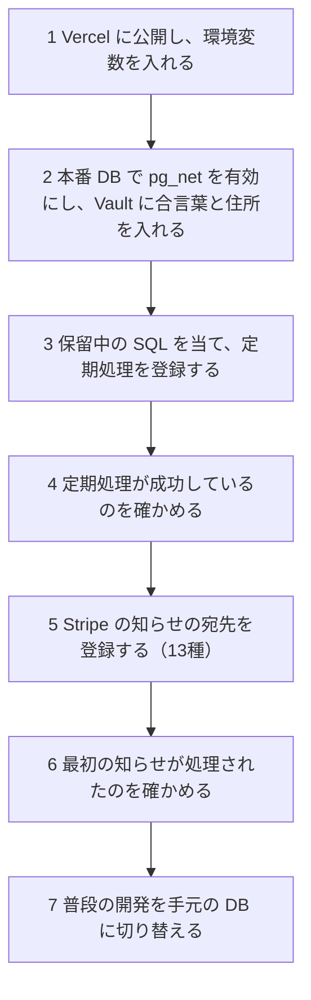

# Stripe の知らせのキューと定期処理の手順書

> 対象: Stripe の知らせ（Webhook）の受け取り口・キュー・worker、毎時の見回り、毎晩の照合、店への知らせ
> 設計: [グループ B 設計書](../superpowers/specs/2026-10-05-webhook-queue-operations-design.md)、保留中の SQL: [supabase/pending/README.md](../../supabase/pending/README.md)

---

## 概要

開店のときに定期処理を登録する順番、合言葉の入れ替え、Stripe の購読の設定、店へ知らせのメールが届いたときの調べ方をまとめる。値（合言葉・鍵）はこの文書にもチャットにもコミットにも残さない。

| 場面 | 見る節 |
|---|---|
| 開店のとき | 1 |
| `CRON_SECRET` を入れ替える | 2 |
| Stripe の署名の合言葉を入れ替える | 3 |
| Stripe の知らせの購読を設定する | 4 |
| 店へ知らせのメールが届いた | 5 |
| 状態を確かめる | 6 |

| 定期処理 | 時刻（日本時間・UTC） | 入口 |
|---|---|---|
| worker | 毎分 | POST `/api/cron/process-stripe-webhooks` |
| 見回り | 毎時0分 | POST `/api/cron/expire-pending-orders` |
| 照合 | 毎日 3:00（18:00 UTC） | POST `/api/cron/stripe-reconcile` |
| 実行の記録の掃除 | 毎日 4:00（19:00 UTC） | DB の中だけ（7日を残す） |

---

## 1. 開店のときの順番



| 順 | やること | 誰が | 確かめ方 |
|---|---|---|---|
| 1 | Vercel に公開し、環境変数を入れる。`CRON_SECRET` は32文字以上のランダムな値（例: `node -e "console.log(require('crypto').randomBytes(32).toString('base64url'))"`）。`SHOP_ALERT_EMAIL`・`MAIL_FROM_ADDRESS`・`STRIPE_SECRET_KEY`（本番の鍵）も入れる | ユーザー | 公開した URL で画面が開く |
| 2 | 本番 DB で `create extension if not exists pg_net with schema extensions;` を流し、Vault に `cron_secret`（Vercel の `CRON_SECRET` と同じ値）と `app_base_url`（公開した URL。末尾の `/` は付けずに入れる）を入れる | 合言葉はユーザー、それ以外は Claude（許可を得て） | `select name from vault.decrypted_secrets where name in ('cron_secret', 'app_base_url');` が2行 |
| 3 | `supabase/pending/` の `schedule_stripe_webhook_worker.sql`・`schedule_expire_pending_orders.sql`・`schedule_stripe_reconcile.sql` を、新しい version の移行にして当てる（`supabase/pending/README.md` の手順） | Claude（許可を得て） | `select jobname, schedule, active from cron.job order by jobname;` に、`cron-job-run-details-retention`（掃除。移行で登録済み）・`expire-pending-orders`・`process-stripe-webhooks`・`stripe-reconcile` の4つが `active` で並ぶ。保持期限の別のジョブ（`checkout-drafts-retention`・`rate-limit-counters-retention`）が並んでいてもよい |
| 4 | 定期処理が成功しているのを確かめる | Claude | 6 の SQL。worker は数分後に、`cron.job_run_details` の `status` が `succeeded`、`net._http_response` の `status_code` が200。見回りは次の毎時0分の後、照合は次の 18:00 UTC の後に、`ops_job_heartbeats` の `order_sweep`・`stripe_reconcile` に成功の時刻が入る。掃除は次の 19:00 UTC の後に、`cron.job_run_details` で確かめる |
| 5 | Stripe の管理画面で知らせの宛先（`<公開した URL>/api/webhook/stripe`）を作り、4 の13種を購読し、署名の合言葉を Vercel の `STRIPE_WEBHOOK_SECRET` に入れて出し直す | ユーザー | Stripe の管理画面で宛先が有効 |
| 6 | 最初の知らせ（テストの決済など）が処理されたのを確かめる | Claude | `stripe_webhook_events` の新しい行が `completed` |
| 7 | 普段の開発を手元の DB に切り替える（設計書 第7章） | Claude とユーザー | `npm run dev` の画面が手元の見本データを出す |

- 3・4 を 5 より先にする。worker が動いているのを確かめてから、受け取り口を開ける（R-07）。
- `ops_job_heartbeats` の `webhook_worker` は、定期処理だけでなく、受け取り口が保存の後に動かす worker（`after()`）も更新する。定期処理が動いている証拠にならないので、4 の確かめには使わない。
- 一度も成功していない定期処理は、遅れの知らせの対象にならない。4 の確かめを省かない。

## 2. `CRON_SECRET` の入れ替え

対象は worker・見回り・照合・Meta の同期の入口。法令アーカイブの入口は別の合言葉（`LEGAL_ARCHIVE_CRON_SECRET`）を使うので、この手順の対象外。

入れ替えの間の数分は、定期処理が401で断られる。見回り（毎時0分）の直後に行う。

1. 新しい値を作る（32文字以上。短いと全部の入口が断る）。
2. Vercel の `CRON_SECRET` を更新し、出し直す。
3. 本番 DB の Vault を更新する: `select vault.update_secret((select id from vault.secrets where name = 'cron_secret'), '<新しい値>');`（値はその場で入れ、どこにも残さない）
4. 次の worker の実行（1分以内）の応答が200になるのを、6 の `net._http_response` で確かめる。401のままなら、アプリのログに出る理由（`CRON_SECRET is shorter than 32 characters`・`Authorization header does not match CRON_SECRET` など）を見る。

## 3. Stripe の署名の合言葉の入れ替え

1. Stripe の管理画面で、宛先の署名の合言葉を入れ替える（古い合言葉も最大24時間は通る）。
2. その間に Vercel の `STRIPE_WEBHOOK_SECRET` を新しい値にして出し直す。
3. 署名不正の知らせ（5）が来ないこと、`stripe_webhook_events` に新しい行が `completed` で入ることを確かめる。

## 4. Stripe の知らせの購読（13種）

受け取り口は次の13種だけを保存する（`src/lib/stripe/handled-webhook-events.ts`）。ほかの種類は保存せずに200を返す。Stripe の宛先も同じ13種を購読する。

`checkout.session.completed`・`checkout.session.async_payment_succeeded`・`checkout.session.async_payment_failed`・`checkout.session.expired`・`payment_intent.succeeded`・`payment_intent.payment_failed`・`refund.created`・`refund.updated`・`refund.failed`・`charge.refunded`・`payout.paid`・`payout.failed`・`payout.reconciliation_completed`

本番の鍵（`sk_live_`・`rk_live_`）のアプリには本番の宛先、テストの鍵（`sk_test_`・`rk_test_`）のアプリにはテストの宛先をつなぐ。食い違うと「モード違い」の知らせが届き、その知らせは処理されない。鍵の頭がこの4つのどれでもないときも、同じくモード違いとして扱い、保存せずに知らせる。

受け取り口は、`STRIPE_WEBHOOK_SECRET` と `STRIPE_SECRET_KEY` のどちらかが未設定だと500を返す。Stripe が後で送り直す。

## 5. 店へ知らせのメールが届いたとき

宛先は `SHOP_ALERT_EMAIL`。同じ種類は1時間に1回まで（支払いから作った注文は見回り1回につき1通）。署名不正とモード違いは受け取り口が送る。送れなかったときも、次の不正な要求では送り直さず、次に試すのは1時間後になる。溜まり・退避・遅れは、送れなかったとき、次の点検（worker と見回りの実行の終わり）でまた試す。

アプリや DB ごと止まったときは、知らせのメールは出ない（外からの見張りは入れていない）。

知らせごとの見出しは、メールの本文が名前で指している（`src/lib/ops/ops-alert-mail.ts`。支払いから作った注文のメールを除く）。見出しの名前を変えるときは、メールの文も直す。

### 知らせが溜まったとき

- 件名: 【要確認】Stripe の知らせの処理が遅れています
- 何が起きたか: 受け取ってから15分以上たって完了していない知らせがある。メールには、状態ごとの件数・いちばん古い受け取りの時刻・原因の記号が出る
- やること: 定期処理（worker）が動いているかを、次の順に確かめる

1. 6 の SQL で、worker の実行の記録（`cron.job_run_details`）と応答（`net._http_response`）を見る。`ops_job_heartbeats` の `webhook_worker` は、定期処理だけでなく、受け取り口が保存の後に動かす worker（`after()`）も更新する。定期処理が動いている証拠にならないので、これで判断しない。
2. 応答の `status_code` で切り分ける。worker（POST `/api/cron/process-stripe-webhooks`）は1回の呼び出しで、取り出せる知らせが無くなるか約45秒（アプリの実行上限は60秒）たつまで、1件ずつ処理する。失敗した知らせは原因の記号つきで記録して次へ進み、応答は200 `{processed, failed, stoppedBy}` になる。
   - 401: 合言葉が合っていない。2 に従う
   - 502: DB から知らせを取り出せなかった（`stoppedBy` が `claim_error`）。worker が DB からキューを読めないので、Supabase のプロジェクトの状態を確かめる
   - 404・そのほかの5xx・`timed_out`（応答が返らないとき。`error_msg` に理由が入る）: アプリの公開を確かめる
3. 応答が200のまま溜まっているときは、メールの「やり直し待ち」に付く原因の記号（下の表）を見る。個々の知らせが失敗している。9回試しても失敗すると退避になり、「退避の知らせが来たとき」のメールが届く。

### 退避の知らせが来たとき

- 件名: 【要対応】処理を止めた Stripe の知らせ（N件）
- 何が起きたか: 9回試しても処理できず、退避した（これ以上やり直さない）
- やること: メールの原因の記号（下の表）を見る。注文の状態は毎時の見回りが、返金と会計は毎晩の照合が Stripe に合わせるので、知らせのやり直しは要らない。同じ原因が続くときは開発者へ。退避した知らせの一覧は 6 の SQL

### 定期処理が止まったとき

- 件名: 【要確認】定期処理が止まっています（毎時の見回り）
  - 何が起きたか: 見回りが2時間以上成功していない
  - やること: 6 の SQL で `expire-pending-orders` の実行の記録と応答を見る。応答の見方（401・5xx・`timed_out`）は「知らせが溜まったとき」と同じ
- 件名: 【要確認】定期処理が止まっています（毎晩の照合）
  - 何が起きたか: 照合が25時間以上成功していない
  - やること: 6 の SQL で `stripe-reconcile` の実行の記録と応答、`ops_job_heartbeats` の `last_error_code` を見る。応答の見方（401・5xx・`timed_out`）は「知らせが溜まったとき」と同じ

### 署名不正の知らせが来たとき

- 件名: 【要確認】署名の合わない Stripe の知らせが届いています
- 何が起きたか: 10分に5件以上、署名の合わない要求を断った
- やること: Vercel の `STRIPE_WEBHOOK_SECRET` と Stripe の宛先の合言葉が同じかを確かめる（入れ替えの途中なら 3）。同じなら外からの偽の知らせを断っているだけで、対応は要らない

### モード違いの知らせが来たとき

- 件名: 【要対応】Stripe の本番とテストの知らせが混ざっています
- 何が起きたか: 鍵と違うモードの知らせが届いた（処理していない）
- やること: メールの「届いた知らせ」と「このアプリの鍵」を見て、Stripe の宛先と `STRIPE_SECRET_KEY`・`STRIPE_WEBHOOK_SECRET` の組み合わせを直す（4）。「このアプリの鍵」が「不明」のときは、`STRIPE_SECRET_KEY` の頭が `sk_live_`・`rk_live_`・`sk_test_`・`rk_test_` のどれでもない

### 支払いから作った注文の知らせが来たとき

- 件名: 【要確認】支払いから作った注文（N件）
- 何が起きたか: Stripe に支払いがあったのに注文が無く、見回りが注文を作った
- やること: 管理画面の ORDER タブの「要対応・要確認」で注文を確かめ、お客様へ注文の内容を確認する。確認したら「確認済みにする」。メールが届かなかった回も、印の付いた注文は管理画面に出る。メールの行に「要確認の印を付けられませんでした」とある注文は管理画面に出ないので、メールの注文番号から探す

原因の記号は、「知らせが溜まったとき」と「退避の知らせが来たとき」のメールの「原因」、`stripe_webhook_events` の `last_error`、照合の応答の `errors[].reason` に出る。

| 原因の記号 | 意味 |
|---|---|
| `stripe_unavailable` | Stripe の通信の失敗・5xx・回数制限 |
| `db_unavailable` | DB の接続・タイムアウト・デッドロック |
| `not_converged` | 書いた後の読み直しが3回で収まらない |
| `lease_expired` | 処理の途中で担当の期限（5分）が切れた |
| `invalid_payload` | 保存した知らせの中身が壊れている |
| `unexpected_error` | 上のどれにも当たらない（開発者へ） |

## 6. 状態を確かめる（本番は読むだけ）

```sql
-- 定期処理の登録
select jobid, jobname, schedule, active from cron.job order by jobname;

-- 直近の実行の記録（7日を残して毎日消える）
select j.jobname, d.status, d.return_message, d.start_time
from cron.job_run_details d join cron.job j using (jobid)
order by d.start_time desc limit 20;

-- アプリの応答（pg_net。既定で6時間残る）
select id, status_code, timed_out, error_msg, created
from net._http_response order by created desc limit 20;

-- 定期処理ごとの最後の成功・失敗（webhook_worker は受け取り口が動かした worker でも更新される）
select job, last_succeeded_at, last_failed_at, last_error_code
from public.ops_job_heartbeats order by job;

-- キューの状態ごとの件数と、いちばん古い受け取り
select processing_status, count(*), min(received_at) as oldest_received_at
from public.stripe_webhook_events group by processing_status order by processing_status;

-- 退避した知らせ
select id as event_id, event_type, last_error, attempt_count, received_at, dead_at, dead_notified_at
from public.stripe_webhook_events where processing_status = 'dead'
order by dead_at desc limit 50;
```
