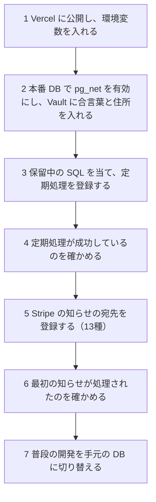

# Stripe の知らせのキューと定期処理の手順書

> 対象: Stripe の知らせ（Webhook）の受け取り口・キュー・worker、毎時の見回り、毎晩の照合、店への知らせ
> 設計: [グループ B 設計書](../superpowers/specs/2026-10-05-webhook-queue-operations-design.md)、保留中の SQL: [supabase/pending/README.md](../../supabase/pending/README.md)

---

## 概要

開店のときに定期処理を登録する順番、合言葉の入れ替え、Stripe の購読の設定、店へ知らせのメールが届いたときの調べ方をまとめる。値（合言葉・鍵）はこの文書にもチャットにもコミットにも残さない。

| 場面 | 見る節 |
|---|---|
| 開店のとき | 1 |
| `CRON_SECRET` を入れ替える | 2 |
| Stripe の署名の合言葉を入れ替える | 3 |
| Stripe の知らせの購読を設定する | 4 |
| 店へ知らせのメールが届いた | 5 |
| 状態を確かめる | 6 |

| 定期処理 | 時刻（日本時間・UTC） | 入口 |
|---|---|---|
| worker | 毎分 | POST `/api/cron/process-stripe-webhooks` |
| 見回り | 毎時0分 | POST `/api/cron/expire-pending-orders` |
| 照合 | 毎日 3:00（18:00 UTC） | POST `/api/cron/stripe-reconcile` |
| 実行の記録の掃除 | 毎日 4:00（19:00 UTC） | DB の中だけ（7日を残す） |

---

## 1. 開店のときの順番



| 順 | やること | 誰が | 確かめ方 |
|---|---|---|---|
| 1 | Vercel に公開し、環境変数を入れる。`CRON_SECRET` は32文字以上のランダムな値（例: `node -e "console.log(require('crypto').randomBytes(32).toString('base64url'))"`）。`SHOP_ALERT_EMAIL`・`MAIL_FROM_ADDRESS`・`STRIPE_SECRET_KEY`（本番の鍵）も入れる。知らせのメールを送る設定（`MAIL_PROVIDER`。未指定のときの既定は `ses` で、AWS の鍵と `AWS_REGION`。`resend` なら `RESEND_API_KEY`）も入れる | ユーザー | 公開した URL で画面が開く。Vercel の環境変数に、`SHOP_ALERT_EMAIL`・`MAIL_FROM_ADDRESS` とメールを送る設定が入っている（無いと、知らせのメールは送られず、アプリのログに警告が出るだけになる） |
| 2 | 本番 DB で `create extension if not exists pg_net with schema extensions;` を流し、Vault に `cron_secret`（Vercel の `CRON_SECRET` と同じ値）と `app_base_url`（公開した URL。末尾の `/` は付けずに入れる）を入れる | 合言葉はユーザー（Vault の画面で入れる）、それ以外は Claude（許可を得て） | `select name from vault.decrypted_secrets where name in ('cron_secret', 'app_base_url');` が2行 |
| 3 | `supabase/pending/` の `schedule_stripe_webhook_worker.sql`・`schedule_expire_pending_orders.sql`・`schedule_stripe_reconcile.sql` を、新しい version の移行にして当てる（`supabase/pending/README.md` の手順） | Claude（許可を得て） | `select jobname, schedule, active from cron.job order by jobname;` に、`cron-job-run-details-retention`（掃除。移行で登録済み）・`expire-pending-orders`・`process-stripe-webhooks`・`stripe-reconcile` の4つが `active` で並ぶ。保持期限の別のジョブ（`checkout-drafts-retention`・`rate-limit-counters-retention`）が並んでいてもよい |
| 4 | 定期処理が成功しているのを確かめる | Claude | 6 の「実行の記録と、その直後の応答」の SQL（`jobname` を変えて使う）。worker は数分後に、`process-stripe-webhooks` の `status` が `succeeded`、応答の `status_code` が200。見回りは次の毎時0分の後、照合は次の 18:00 UTC の後に、`expire-pending-orders`・`stripe-reconcile` の実行の記録と応答（応答は実行から6時間以内に見る）、そして `ops_job_heartbeats` の `order_sweep`・`stripe_reconcile` の成功の時刻で確かめる。掃除は次の 19:00 UTC の後に、6 の「定期処理ごとの実行の記録」の SQL（`cron-job-run-details-retention`。URL を呼ばないので応答は無い）で確かめる |
| 5 | Stripe の管理画面で知らせの宛先（`<公開した URL>/api/webhook/stripe`）を作り、4 の13種を購読し、署名の合言葉を Vercel の `STRIPE_WEBHOOK_SECRET` に入れて出し直す | ユーザー | Stripe の管理画面で宛先が有効 |
| 6 | 最初の知らせが処理されたのを確かめる。本番の鍵ではテストカードが使えず、テストモードの知らせは本番の宛先に届かない。少額の本番の決済を1回して、確かめた後に返金する | ユーザー（決済と返金）、Claude（確かめる） | `stripe_webhook_events` の新しい行（決済の知らせ。返金したら返金の知らせも）が `completed` |
| 7 | 普段の開発を手元の DB に切り替える（設計書 第7章） | Claude とユーザー | `npm run dev` の画面が手元の見本データを出す |

- 3・4 を 5 より先にする。worker が動いているのを確かめてから、受け取り口を開ける（R-07）。
- `ops_job_heartbeats` の `webhook_worker` は、定期処理だけでなく、受け取り口が保存の後に動かす worker（`after()`）も更新する。定期処理が動いている証拠にならないので、4 の確かめには使わない。
- 一度も成功していない定期処理は、遅れの知らせの対象にならない。4 の確かめを省かない。

## 2. `CRON_SECRET` の入れ替え

対象は worker・見回り・照合・Meta の同期の入口。法令アーカイブの入口は別の合言葉（`LEGAL_ARCHIVE_CRON_SECRET`）を使うので、この手順の対象外。

入れ替えの間の数分は、定期処理が401で断られる。見回り（毎時0分）の直後に行う。

1. 新しい値を作る（32文字以上。短いと全部の入口が断る）。
2. Vercel の `CRON_SECRET` を更新し、出し直す。
3. 本番 DB の Vault の `cron_secret` を、ユーザーが更新する（Claude は値を扱わない）。Supabase のダッシュボードの Vault の画面で、`cron_secret` の値を新しい値に変える。SQL Editor で `select vault.update_secret((select id from vault.secrets where name = 'cron_secret'), '<新しい値>');` を流す場合は、SQL Editor が問い合わせの文を保存するので、流した直後に、保存された問い合わせを削除する。値はどこにも残さない。
4. 次の worker の実行（1分以内）の応答が200になるのを、6 の `net._http_response` で確かめる。401のままなら、アプリのログ（Vercel → このプロジェクトの Logs）に出る理由を見る。`CRON_SECRET is shorter than 32 characters`（32文字未満）・`Authorization header does not match CRON_SECRET`（Vault の値と合わない）・`CRON_SECRET is not configured`（Vercel に未設定）・`Missing Authorization header`（合言葉のヘッダーが無い）。

## 3. Stripe の署名の合言葉の入れ替え

1. Stripe の管理画面で、宛先の署名の合言葉を入れ替える（古い合言葉も最大24時間は通る）。入れ替えの画面で、古い合言葉の失効は24時間後を選ぶ。すぐに失効させると、古い合言葉と新しい合言葉が重なる期間が無く、Vercel を直すまでの間に届く知らせがすべて署名不正になる。
2. その間に Vercel の `STRIPE_WEBHOOK_SECRET` を新しい値にして出し直す。
3. 署名不正の知らせ（5）が来ないこと、`stripe_webhook_events` に新しい行が `completed` で入ることを確かめる。

## 4. Stripe の知らせの購読（13種）

受け取り口は次の13種だけを保存する（`src/lib/stripe/handled-webhook-events.ts`）。ほかの種類は保存せずに200を返す。Stripe の宛先も同じ13種を購読する。

`checkout.session.completed`・`checkout.session.async_payment_succeeded`・`checkout.session.async_payment_failed`・`checkout.session.expired`・`payment_intent.succeeded`・`payment_intent.payment_failed`・`refund.created`・`refund.updated`・`refund.failed`・`charge.refunded`・`payout.paid`・`payout.failed`・`payout.reconciliation_completed`

本番の鍵（`sk_live_`・`rk_live_`）のアプリには本番の宛先、テストの鍵（`sk_test_`・`rk_test_`）のアプリにはテストの宛先をつなぐ。食い違うと「モード違い」の知らせが届き、その知らせは処理されない。鍵の頭がこの4つのどれでもないときも、同じくモード違いとして扱い、保存せずに知らせる。

受け取り口は、`STRIPE_WEBHOOK_SECRET` と `STRIPE_SECRET_KEY` のどちらかが未設定だと500を返す。Stripe が後で送り直す。

## 5. 店へ知らせのメールが届いたとき

宛先は `SHOP_ALERT_EMAIL`。同じ種類は1時間に1回まで（支払いから作った注文は見回り1回につき1通）。署名不正とモード違いは受け取り口が送る。送れなかったときも、次の不正な要求では送り直さず、次に試すのは1時間後になる。溜まり・退避・遅れは、送れなかったとき、次の点検（worker と見回りの実行の終わり）でまた試す。

アプリや DB ごと止まったときは、知らせのメールは出ない（外からの見張りは入れていない）。pg_cron や pg_net だけが止まったときも、点検は受け取り口が保存の後に動かす worker（`after()`）の中でしか動かないので、Stripe の知らせが1通も届かない間は、遅れの知らせのメールも出ない。

メールが届かないときは、`SHOP_ALERT_EMAIL`・`MAIL_FROM_ADDRESS`・メールを送る設定（1 の手順1）が Vercel に入っているかと、アプリのログ（Vercel → このプロジェクトの Logs）の `[ops-alert] SHOP_ALERT_EMAIL or MAIL_FROM_ADDRESS is not configured`（宛先か送り元が未設定）・`[ops-alert] send failed`（送信に失敗）を見る。未設定のときは、メールを送らずにログへ警告を出すだけになる。

知らせごとの見出しは、メールの本文が名前で指している（`src/lib/ops/ops-alert-mail.ts`。支払いから作った注文のメールと、末尾の「原因の記号」を除く）。見出しの名前を変えるときは、メールの文も直す。

### 知らせが溜まったとき

- 件名: 【要確認】Stripe の知らせの処理が遅れています
- 何が起きたか: 受け取ってから15分以上たって完了していない知らせがある。メールには、状態ごとの件数・いちばん古い受け取りの時刻・原因の記号が出る
- やること: 定期処理（worker）が動いているかを、次の順に確かめる

1. 6 の「実行の記録と、その直後の応答」の SQL（`jobname` を `process-stripe-webhooks` にする）で、worker の実行の記録と応答を見る。`ops_job_heartbeats` の `webhook_worker` は、定期処理だけでなく、受け取り口が保存の後に動かす worker（`after()`）も更新する。定期処理が動いている証拠にならないので、これで判断しない。
2. 応答の `status_code` で切り分ける。worker（POST `/api/cron/process-stripe-webhooks`）は1回の呼び出しで、取り出せる知らせが無くなるか約45秒（アプリの実行上限は60秒）たつまで、1件ずつ処理する。失敗した知らせは原因の記号つきで記録して次へ進み、応答は200 `{processed, failed, stoppedBy}` になる。
   - 401: 合言葉が合っていない。2 に従う。アプリのログに `[cron] … unauthorized`（合言葉を断ったときにアプリが出す行）が出ていないのに401なら、アプリではなく、Vercel のデプロイの保護が返している。`app_base_url` が本番のドメインでなく、プレビューやデプロイごとの URL のときに起きる。本番のドメインを入れる
   - 3xx: `app_base_url` が別の URL へ転送されている。転送先の、最終の本番の URL を入れる
   - 502: DB から知らせを取り出せなかった（`stoppedBy` が `claim_error`）。worker が DB からキューを読めないので、Supabase のプロジェクトの状態を確かめる
   - 404・そのほかの5xx・`timed_out`（応答が返らないとき。`error_msg` に理由が入る）: アプリの公開を確かめる
   - 応答の行が無く、実行の記録の `status` が `failed`: ジョブが、送る前に止まった。たいていは Vault の `cron_secret` か `app_base_url` が無い（`return_message` に `vault secrets (app_base_url / cron_secret) are missing`（Vault の秘密が無い）と出る）。1 の手順2の確かめに戻る
3. 応答が200のまま溜まっているときは、メールの「やり直し待ち」に付く原因の記号（下の「原因の記号」の表）を見る。個々の知らせが失敗している。9回試しても失敗すると退避になり、「退避の知らせが来たとき」のメールが届く。

### 退避の知らせが来たとき

- 件名: 【要対応】処理を止めた Stripe の知らせ（N件）
- 何が起きたか: 9回試しても処理できず、退避した（これ以上やり直さない）
- やること: メールの原因の記号（下の「原因の記号」の表）を見る。注文の状態は毎時の見回りが、返金と会計は毎晩の照合が Stripe に合わせるので、知らせのやり直しは要らない。同じ原因が続くときは開発者へ。退避した知らせの一覧は 6 の「退避した知らせ」の SQL

### 定期処理が止まったとき

- 件名: 【要確認】定期処理が止まっています（毎時の見回り）
  - 何が起きたか: 見回りが2時間以上成功していない
  - やること: 6 の「実行の記録と、その直後の応答」の SQL（`jobname` を `expire-pending-orders` にする）で、実行の記録と応答を見る。401・3xx・応答の行が無く実行の記録が `failed` のときは、「知らせが溜まったとき」の 2 と同じ。500 は、注文を DB から読めなかったとき（`ops_job_heartbeats` の `order_sweep` の `last_error_code` が `db_unavailable`）なので、Supabase のプロジェクトの状態を確かめる。`last_error_code` がそれ以外の500、404・そのほかの5xx・`timed_out` は、アプリの公開とログを確かめる
- 件名: 【要確認】定期処理が止まっています（毎晩の照合）
  - 何が起きたか: 照合が25時間以上成功していない
  - やること: 6 の「実行の記録と、その直後の応答」の SQL（`jobname` を `stripe-reconcile` にする）で実行の記録を見て、`ops_job_heartbeats` の `stripe_reconcile` の `last_error_code`（原因の記号）を見る。照合の応答は6時間で消えるので、止まったと知らされた時点では残っていない。応答を見るには、次の実行（18:00 UTC）の後6時間以内に見る。401・3xx・実行の記録が `failed` のときは、「知らせが溜まったとき」の 2 と同じ。502 は、注文を DB から読めなかったか、Stripe の支払い・Payout の一覧を読めなかったとき（`last_error_code` が `db_unavailable`・`stripe_unavailable` など）。404・そのほかの5xx・`timed_out` は、アプリの公開とログを確かめる

### 署名不正の知らせが来たとき

- 件名: 【要確認】署名の合わない Stripe の知らせが届いています
- 何が起きたか: 10分に5件以上、署名の合わない要求を断った
- やること: Vercel の `STRIPE_WEBHOOK_SECRET` と Stripe の宛先の合言葉が同じかを確かめる（入れ替えの途中なら 3）。同じなら外からの偽の知らせを断っているだけで、対応は要らない

### モード違いの知らせが来たとき

- 件名: 【要対応】Stripe の本番とテストの知らせが混ざっています
- 何が起きたか: 鍵と違うモードの知らせが届いた（処理していない）
- やること: メールの「届いた知らせ」と「このアプリの鍵」を見て、Stripe の宛先と `STRIPE_SECRET_KEY`・`STRIPE_WEBHOOK_SECRET` の組み合わせを直す（4）。「このアプリの鍵」が「不明」のときは、`STRIPE_SECRET_KEY` の頭が `sk_live_`・`rk_live_`・`sk_test_`・`rk_test_` のどれでもない

### 支払いから作った注文の知らせが来たとき

- 件名: 【要確認】支払いから作った注文（N件）
- 何が起きたか: Stripe に支払いがあったのに注文が無く、見回りが注文を作った
- やること: 管理画面の ORDER タブの「要対応・要確認」で注文を確かめ、お客様へ注文の内容を確認する。確認したら「確認済みにする」。メールが届かなかった回も、印の付いた注文は「要対応・要確認」に出る。メールの行に「要確認の印を付けられませんでした」とある注文は、ORDER タブの注文一覧には出るが、「要対応・要確認」には出ないので、メールの注文番号から注文一覧で探す

### 原因の記号

次の記号が、「知らせが溜まったとき」と「退避の知らせが来たとき」のメールの「原因」、`stripe_webhook_events` の `last_error`、照合の応答の `errors[].reason` に出る。

| 原因の記号 | 意味 |
|---|---|
| `stripe_unavailable` | Stripe の通信の失敗・5xx・回数制限 |
| `db_unavailable` | DB の接続・タイムアウト・デッドロック |
| `not_converged` | 書いた後の読み直しが3回で収まらない |
| `lease_expired` | 処理の途中で担当の期限（5分）が切れた |
| `invalid_payload` | 保存した知らせの中身が壊れている |
| `unexpected_error` | 上のどれにも当たらない（開発者へ） |

## 6. 状態を確かめる（本番は読むだけ）

この節の SQL は、Supabase のダッシュボード（本番のプロジェクト）→ SQL Editor で流す。読むだけの SQL だけを流し、書き込みの文は流さない。アプリのログは、Vercel → このプロジェクトの Logs で見る。

```sql
-- 定期処理の登録
select jobid, jobname, schedule, active from cron.job order by jobname;

-- 直近の実行の記録（全部。worker が毎分動くので、見回り・照合・掃除は埋もれやすい。下の「定期処理ごと」を使う）
select j.jobname, d.status, d.return_message, d.start_time
from cron.job_run_details d join cron.job j using (jobid)
order by d.start_time desc limit 20;

-- 定期処理ごとの実行の記録（7日を残して毎日消える）。jobname を変えて使う
-- （process-stripe-webhooks・expire-pending-orders・stripe-reconcile・cron-job-run-details-retention）
select d.start_time, d.status, d.return_message
from cron.job_run_details d join cron.job j using (jobid)
where j.jobname = 'stripe-reconcile'
order by d.start_time desc limit 10;

-- アプリの応答（pg_net。既定で6時間残る）。どの定期処理への応答かを示す列は無い
select id, status_code, timed_out, error_msg, created
from net._http_response order by created desc limit 20;

-- 実行の記録と、その直後の応答（本文つき）。jobname を変えて使う。応答は6時間で消える
select d.start_time, d.status, r.status_code, r.timed_out, r.error_msg, r.content
from cron.job_run_details d
join cron.job j using (jobid)
left join net._http_response r
  on r.created >= d.start_time and r.created < d.start_time + interval '90 seconds'
where j.jobname = 'stripe-reconcile'
order by d.start_time desc limit 10;

-- 定期処理ごとの最後の成功・失敗（webhook_worker は受け取り口が動かした worker でも更新される）
select job, last_succeeded_at, last_failed_at, last_error_code
from public.ops_job_heartbeats order by job;

-- キューの状態ごとの件数と、いちばん古い受け取り
select processing_status, count(*), min(received_at) as oldest_received_at
from public.stripe_webhook_events group by processing_status order by processing_status;

-- 退避した知らせ
select id as event_id, event_type, last_error, attempt_count, received_at, dead_at, dead_notified_at
from public.stripe_webhook_events where processing_status = 'dead'
order by dead_at desc limit 50;
```

応答の見方:

- 応答の表には、呼び出し先の列が無い。上の「実行の記録と、その直後の応答」は、実行の `start_time` の後、約1分半以内（pg_net は最長60秒待つ）の `created` を持つ行を、その実行の応答として並べる。
- 同じ時刻に複数の定期処理が動く（毎時0分は worker と見回り、18:00 UTC は照合も）。応答の行が複数並んだときは、`content`（応答の本文）で見分ける。worker は `processed`・`failed`・`stoppedBy`、見回りは `candidateCount`、照合は `data`（失敗のときは `Reconciliation failed`＝照合の失敗）を含む。401の本文は、どれも `Unauthorized`（認可されていない）。
- 応答は6時間で消える。照合は1日に1回なので、応答を見るのは実行の後6時間以内。それより後は、実行の記録（7日残る）と `ops_job_heartbeats` で見る。
