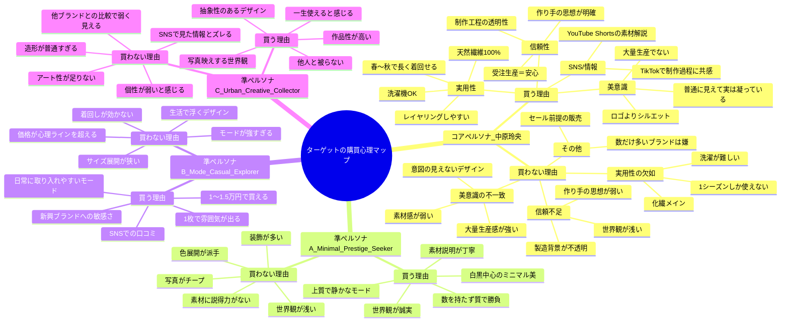

## ブランド名「Le Fil des Heures（ル　フィル　デ　ザール）」

## ブランドフォント「Didot」

- ✅ 高コントラストで「糸」の繊細さを表現（例: 「l」「f」の縦線が髪の毛より細い）。
- ✅ フランス発祥の書体で、ブランド名のフランス語感を強調。

## KeyColor

- Absolute Black (#000000)
- Graphite Grey (#474747)
- Optical White (#ffffff)

## コンセプト「時を紡ぐニュートラルモードな日常着」

## あなたのブランドの立ち位置

- VOAAOV より洗練されている
- Graphpaper より構造的
- ssstein より日常に寄り添い
- YOKE よりニュートラル
- HYKE よりミニマル
- CLANE より中性的

## ブランドの格

### 🎯 需要の核（絶対に外してはいけない）

- 長く使える服が欲しい
- 天然繊維×洗える
- ミニマル・モード
- 大量生産に疲れた層
- 作り手の思想に金を払いたい層

### 🚀 供給の核（差別化ポイント）

- 天然繊維100%（ケア性まで担保）
- SS/AWのルック固定（季節に左右されない）
- 受注生産で無駄ゼロ
- ユニセックス
- デザイン性の高さ

### 📡 届け方の核（マーケティング）

- TikTok：製作過程・理念・素材
- Instagram：ルック・世界観
- note/blog：透明性
- EC直販：予約中心
- ポップアップは戦略的に

## ペルソナ

### ペルソナ候補

- 古着＋デザイン思考（インディペンデント層）
- ミニマル高品質層（長く着たい層）
- 環境意識（サステナブル層）

### 🎯 コアペルソナ（ブランドのメインターゲット）

#### 👤 名前（仮）

中原 玲央（なかはら れお） / 35歳 / デザイン職

#### 1️⃣ 基本プロフィール

- 年齢：35歳
- 性別：男女どちらでもフィットするが、ユニセックス寄り世界観
- 年収：650〜900万円
- 居住地：首都圏（中目黒／吉祥寺／清澄白河）
- 職業：デザイナー／エンジニア／リサーチャー／編集系などクリエイティブ寄り
- 生活スタイル：
  - 所持服は少ない（クローゼットが狭くても美しく保ちたい）
  - 服は“数より質”
  - 毎日同じような服でいいが、シルエットと素材感には異常にこだわる

#### 2️⃣ 価値観（購入判断基準）

- この層の購買基準は “美意識 × 実用性 × 信頼” の三軸で成り立つ。

###### ✔ 美意識

- ロゴより シルエット
- デザインに「意図」と「思想」がある服を好む
- “普通に見えて実は凝っている” ものが刺さる
- 大量生産品は避ける

###### ✔ 実用性

- 天然繊維100%であることに価値を感じる
- 洗濯機OKは必須
- 自宅と職場で温度差があるためレイヤリングしやすい服を好む
- シーズン問わず着られるほうが嬉しい

###### ✔ 信頼性

- 作り手の思想・製造工程・透明性にお金を払う
- “なぜこの服を作ったか” を必ず知りたい
- 大量生産でないことに意味を感じる
- 受注生産の方がむしろ良い（共感→安心→購入に直結）

#### 3️⃣ 行動特性（SNS・購買）

###### ✔ SNSでの行動

- Instagram → 世界観・ルックをチェック
- TikTok → 製作過程のストーリーが刺さる
- YouTube Shorts → 素材解説やシルエット比較をよく見る
- 口コミは重視しないが “思想が伝わる動画” を見れば一気に買うモードに入る

###### ✔ 購買行動

- 1つのセットアップで春〜秋まで着回す
- 高くても「長く着れるならOK」
- 価格耐性は高い（5〜10万円のセットアップでも納得）
- ファストファッションはほぼ買わない
- セールに興味ない
- 自社ECのみ販売はむしろ“安心感”になる

##### 4️⃣ ペルソナの“刺さる言葉”

この層が最も反応する言語は次の3つ：

【1】「長く着られるデザイナー服」
→ “美意識と実用性の両立” が最大の興味ポイント

【2】「天然繊維100%で洗える」
→ 実用要素が整うことで高単価が正当化される

【3】「思想のある服」
→ 作り手の世界観と背景ストーリーで購買理由が完成する

##### 5️⃣ ペルソナの悩み

- 「量はいらない。少数精鋭で揃えたい」
- 「ミニマルブランドは素材が物足りない」
- 「デザイナーズはケア性が悪い」
- 「ユニクロは便利だが深みがない」

→ あなたのブランドが“全ての未解決領域”を埋める

##### 6️⃣ コアペルソナの結論

“上質で、長く着られて、思想のある服が欲しいクリエイティブ層”
これがあなたの主戦場。

価格耐性があり、世界観にも共鳴し、受注生産をポジティブに捉える。
最も再現性高く売上が立つ 高LTVの優良顧客層。

### 🎯 追加の準ペルソナ（3タイプ）

#### 準ペルソナ A：Minimal Prestige Seeker（静かに洗練を求めるミニマリスト高感度層）

##### ■ 基本情報

- 31歳・女性・東京（中目黒在住）
- 企画職／UXデザイナー
- 年収550〜650万円

##### ■ 特徴

- 服は「数を持たず質で勝負」
- 本当に好きなブランドしか買わない
- シンプル＋上質＋微モードが刺さる
- カラーは白・黒・グレー・ネイビー中心
- インスタは保存機能を使いまくるタイプ

##### ■ 購買心理

- 「不必要なデザインは嫌、だけど空気感のあるプロダクトなら買う」
- 丁寧な世界観・誠実さ・素材説明に価値を感じる

##### ■ ブランドからの刺さりポイント

- 余計な装飾がなく、静かで強い世界観
- ブランドストーリーよりプロダクト重視
- 素材・シルエットの正確な情報が好き

#### 準ペルソナ B：Mode Casual Explorer（ほどよいモードを日常取り入れたい層）

##### ■ 基本情報

25歳・女性・大阪
アパレル店員
年収320〜400万円

##### ■ 特徴

モードが好きだけど、日常で浮かないものを求める
ハイブランドのような「強すぎるモード」は避ける
友人のSNSで流れてくる新興ブランドにすぐ反応
韓国モードを参考にすることも多い

##### ■ 購買心理

「価格は1〜1.5万円が心理的上限」
「取り入れやすさ」「着回し」が重要
全身の雰囲気が良くなる“雰囲気アイテム”を欲しがる

##### ■ ブランドからの刺さりポイント

派手でないが、日常にモード感が足せるデザイン
1枚で“こなれる”ミニマルモード
1万円台のプロダクトが存在すること

#### 準ペルソナ C：Urban Creative Collector（デザイン・表現に価値を感じる都市型クリエイター）

##### ■ 基本情報

29歳・女性・福岡
フォトグラファー／映像クリエイター
年収400〜550万円（案件ベース）

##### ■ 特徴

ミニマルも好きだが「空気を纏うデザイン」が特に好み
他人と被らないものを求めるが、奇抜さは避けたい
シンプル＋抽象的な造形美にグッとくる
アクセサリーや形の良いバッグで個性を出すタイプ

##### ■ 購買心理

写真映え・世界観を重視して選ぶ
「一生使える」「作品性がある」に弱い
SNSで新ブランドを見つけるのが得意

##### ■ ブランドからの刺さりポイント

ブランドの世界観・写真の空気感
エッジが効いた抽象的モチーフ（＝今回のOロゴは特に刺さる）
“アート寄り”なプロダクト

### 価格

#### ターゲットPSM分析（感度 × 行動 × 心理）

-想定ターゲット:28–38歳 / 都市型感性層 / 年収450–900万

#### トップス

| 指標     | 価格帯            | 意味         |
| -------- | ----------------- | ------------ |
| 安すぎる | 14,800            | 品質不安     |
| 妥当     | **22,000–26,000** | 購入意欲最大 |
| 高い     | 29,800            | 迷い始め     |
| 高すぎ   | 34,800            | 購入停止     |

#### ボトムス

| 指標   | 価格帯            | 意味     |
| ------ | ----------------- | -------- |
| 安すぎ | 19,800            | 品質不安 |
| 妥当   | **32,000–36,000** | CV最大   |
| 高い   | 39,800            | 検討層   |
| 高すぎ | 44,800            | 離脱     |

#### アウター

| 指標   | 価格帯            | 意味     |
| ------ | ----------------- | -------- |
| 安すぎ | 39,800            | 品質不安 |
| 妥当   | **55,000–65,000** | CV最大   |
| 高い   | 69,800            | 検討層   |
| 高すぎ | 74,800            | 離脱     |

#### まとめ

- トップスは22,000–26,000円が最も購入されやすい価格帯
- ボトムスは32,000–36,000円が最も購入されやすい価格帯
- アウターは55,000–65,000円が最も購入されやすい価格帯
- 価格が高すぎると購入意欲が大きく減少する
