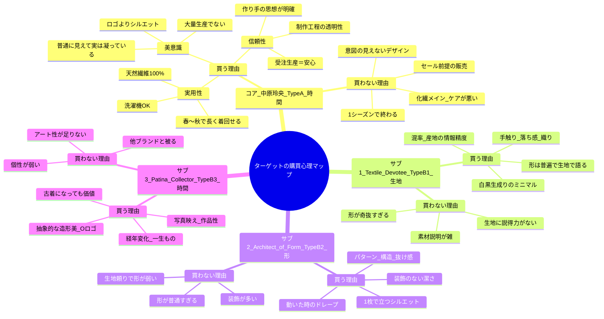

# Brand Constitution — Le Fil des Heures

ブランドの意思決定を一貫して支える憲法。「哲学 → 信念 → 設計原則 → 商品 → 事業 → 顧客 → 価格」が一本の線でつながるように構成する。

## ブランド・アイデンティティ

### ブランド名「Le Fil des Heures（ル　フィル　デ　ザール）」

### ブランドフォント「Didot」

- ✅ 高コントラストで「糸」の繊細さを表現（例: 「l」「f」の縦線が髪の毛より細い）。
- ✅ フランス発祥の書体で、ブランド名のフランス語感を強調。

### KeyColor

- Absolute Black (#000000)
- Graphite Grey (#474747)
- Optical White (#ffffff)

### コンセプト「時を紡ぐニュートラルモードな日常着」

---

## 1. Brand Essence（ブランドの本質）

### Philosophy

Le Fil des Heures は、
時間を超えて選ばれ続ける服をつくるブランドです。

私たちは流行を否定しません。

しかし、
流行だけで終わる服はつくりません。

時間が経っても、
何度袖を通しても、
美しいと思えること。

新品でも、
数年後でも、
古着屋に並んでいても、
また手に取りたいと思えること。

それが私たちの考える
「価値の続く服」です。

そのために、
シルエット、生地、縫製、素材、そして生産方法まで、
すべてを一つの思想のもとで設計します。

### 「時間」とブランド名の意味

- ブランド名 Le Fil des Heures は「時間の糸＝時を紡ぐ」を意味する。
- ただし、つくるのは「時間をテーマにした服」ではない。**「時間というフィルターを通しても価値が落ちない服」＝時に耐えられる服**である。
- この違いは大きい。だからこそ、シルエット・生地・縫製・国内生産・天然繊維・受注生産のすべてが一つの思想で繋がる。

### ブランドの立ち位置

- VOAAOV より洗練されている
- Graphpaper より構造的
- ssstein より日常に寄り添い
- YOKE よりニュートラル
- HYKE よりミニマル
- CLANE より中性的

## 2. Market Insight（市場への問題意識）

今の市場では、

- 化学繊維が増えた
- 軽さが優先
- コスト優先
- 大量生産
- シーズンごとに消費

その結果、

> **服本来の魅力である「生地」と「形」が後回しになっている。**

ここが一番伝えたいこと。

加えて、買い手側には次の妥協が常態化している。

- シルエットは魅力的でも素材に納得できない。
- 素材は素晴らしくても形に納得できない。
- 両方満足すると極端に高価になる。

私たちは、その妥協をなくしたい。

## 3. Brand Belief（ブランドの信念）

### 良い服とは何か

- 「時間というフィルターを通しても価値が落ちない服」。
- ゴールは**「古着屋に並んでいても手に取られる服」**。普通のブランドは「今売れる服」を目指すが、私たちは「10年後でも価値がある服」を目指す。
- このゴールがあるから、受注生産・天然繊維・国内生産・タイムレスのすべてが説明できる。

### ブランドの3つの軸（時間 × 形 × 生地）

ブランド名は「時間」を表すが、商品の思想は「形 × 生地」。ブランドは3つの軸で成り立つ。

- **時間** — 長く着る／経年変化／古着になっても残る
- **形** — シルエット／構造／パターン
- **生地** — 天然素材／織り／質感

### 優先順位

一番の購入理由は環境配慮ではなく「服としての完成度」。まずシルエット、次に生地。
環境のためではない。まず服として最高であること。その結果、環境にもいい。この順番を崩さない。

1. シルエット
2. 生地
3. 着心地
4. 長く着られる
5. 天然繊維
6. 受注生産
7. 国内生産

## 4. Design Principles（デザイン原則）

### デザイン思想

体型をある程度選ぶ服であることを許容する。サイズ設計はコアターゲットの体型に最適化し、肥満体型はターゲットから外す。
そのうえで、立った姿だけでなく、歩き・座り・動く姿まで、どの角度から見ても美しく、動きやすいこと。
太すぎず細すぎず、オーバーサイズ全盛でもスリム全盛でも自然に馴染むサイズ感を狙う。スリムに合うサイズ感やシルエット、オーバーサイズに合うボックスシルエットなど、コーディネートに合わせた形を提案し、着用したときの美しさを表現する。何度着ても飽きないシルエットを目指す。

### 01. Silhouette First

最初に設計するのはシルエット。
どの角度から見ても美しく、立った姿だけではなく、歩き・座り・動く姿まで美しく見えること。

### 02. Timeless Balance

極端なトレンドに依存しない。
オーバーサイズ全盛でも、スリム全盛でも、その時代に自然に馴染む適切なサイズバランスを追求する。

### 03. Fabric as Design

生地は素材ではなくデザインの一部。

- 質感
- 厚み
- 落ち感
- 織り
- 経年変化

すべてがシルエットを完成させる要素。

### 04. Function Follows Daily Life

美しいだけでは終わらない。
動きやすく、着やすく、長く着続けられること。

### 05. Form Before Decoration

装飾ではなく、形そのものが美しい服。

## 5. Product Architecture（商品設計思想）

### Collection Philosophy

Le Fil des Heures では、普遍的なアイテムを土台としながら、「シルエット」と「生地」によって服本来の面白さを提案する。

商品は大きく4つに分類される。

| Type | 形 × 生地 | 位置づけ |
| --- | --- | --- |
| **Type A** | 普遍的な形 × 普遍的な生地 | 最高品質の日常着。完成されたベーシック。 |
| **Type B-1** | 普遍的な形 × 特徴的な生地 | 素材の魅力を楽しむ服。 |
| **Type B-2** | 特徴的な形 × 普遍的な生地 | シルエットそのものを楽しむ服。 |
| **Type B-3** | 特徴的な形 × 特徴的な生地 | ブランドの象徴となる作品。 |

比率：**Type A 約20% / Type B（B-1・B-2・B-3）約80%**。

## 6. Business Principles（事業原則）

最高の服を作るための手段。「天然繊維だから偉い」ではなく「最高の服を作るために天然繊維を選ぶ」。この順番は変えない。

- **天然繊維** — 天然繊維100%（ケア性まで担保）。化学繊維は自然に分解されず、海の生き物や鳥など多くの生物に影響を与えている。天然繊維で作ることで生物にも優しい。ただしこれは結果であり、出発点ではない。
- **国内生産** — 職人の技術を将来へ引き継ぐ。失うのは一瞬だが、一から作り直すのは大変だから、なくさない。
- **受注生産** — 必要な人に必要な分だけ。無駄ゼロ。
- **SS/AW コレクションの考え方** — シーズンは提案するが、購入や着用を縛らない。SS/AW コレクションは発表するが、販売終了を設けず、いつでも購入できるタイムレスコレクションとする（季節を提案し、季節を制限しない）。
- **ユニセックス** — 古着屋やセレクトショップに並んでいても、男女問わず手に取ってもらえる普遍的なデザイン。

### 届け方（マーケティング）

- TikTok：製作過程・理念・素材
- Instagram：ルック・世界観
- note/blog：透明性
- EC直販：予約中心
- ポップアップは戦略的に

## 7. Customer（ターゲット・ペルソナ）

### 需要の核（絶対に外してはいけない）

- 長く使える服が欲しい
- 天然繊維×洗える
- ミニマル・モード
- 大量生産に疲れた層
- 作り手の思想に金を払いたい層

### 感情設計（Emotion Design）

本当に売れるブランドは「感情」まで設計する。私たちは商品スペックではなく、**顧客の心の声のタイムライン**を設計し、その一つひとつを Design Principles と作りで裏付ける。

| フェーズ | 顧客の心の声 | それを生む設計 | 検証指標 |
| --- | --- | --- | --- |
| 認知（SNS・古着屋・店頭） | 「なんだろう、この空気感」 | 世界観・写真・Didot・ニュートラルカラー | 保存率／プロフィール遷移 |
| 商品を見た瞬間 | 「綺麗だ」 | 05 Form Before Decoration（装飾でなく形） | 詳細PV／滞在時間 |
| 試着した瞬間 | 「思っていた以上にシルエットがいい」 | 01 Silhouette First | 試着→購入率 |
| 着て歩いた瞬間 | 「歩いた時が一番綺麗だ」 | 01 動く姿の美／03 落ち感 | UGC・口コミ |
| 購入直後 | 「毎日着たい」 | 04 Function Follows Daily Life／着心地 | 着用頻度 |
| 半年後 | 「やっぱり買ってよかった」 | 03 経年変化／縫製／天然繊維のケア性 | リピート率 |
| 5年後 | 「まだ着ている」 | 02 Timeless Balance／縫製／国内生産 | LTV／複数年着用 |
| 古着屋で再会 | 「あ、このブランドだ」 | ブランドのゴール（10年後も価値が続く） | 二次流通での認知・残価 |

この感情曲線の頂点は「歩いた時が一番綺麗だ」と「あ、このブランドだ」。前者は商品力（Silhouette First）の証明、後者はブランドのゴールの証明。両端が成立すれば、価格・受注・天然繊維はすべて後から納得される。

### ペルソナ候補

- 古着＋デザイン思考（インディペンデント層）
- ミニマル高品質層（長く着たい層）
- 環境意識（サステナブル層）

### 🎯 コアペルソナ（メインターゲット）

#### 👤 中原 玲央（なかはら れお）/ 35歳 / 男性（中性的）/ デザイン職

- **惹かれるType：A（完成された普遍）＋ 時間軸**

##### ■ 基本プロフィール

- 35歳／中性的な男性。ユニセックスの世界観にフィット
- 年収：650〜900万円
- 居住地：首都圏（中目黒／吉祥寺／清澄白河）
- 職業：デザイナー／エンジニア／リサーチャー／編集系などクリエイティブ寄り
- 所持服は少なく「数より質」。毎日同じような服でいいが、シルエットと素材感には異常にこだわる

##### ■ 価値観（美意識 × 実用性 × 信頼）

- 美意識：ロゴよりシルエット。意図と思想のある服。「普通に見えて実は凝っている」が刺さる
- 実用性：天然繊維100%・洗濯機OK・レイヤリングしやすい・シーズン問わず着られる
- 信頼性：作り手の思想・製造工程・透明性に金を払う。「なぜ作ったか」を知りたい。受注生産はむしろ安心

##### ■ 行動特性

- Instagramで世界観、TikTokで製作過程、YouTube Shortsで素材・シルエット比較を見る
- 思想が伝わる動画を見れば一気に買うモードに入る
- 1セットアップで春〜秋を着回す。セール・ファストファッションに興味なし

##### ■ 刺さる言葉

- 「長く着られるデザイナー服」／「天然繊維100%で洗える」／「思想のある服」

##### ■ 悩み

- 量はいらない少数精鋭で揃えたい／ミニマルは素材が弱い／デザイナーズはケアが悪い／ユニクロは深みがない

##### ■ 価格適合・感情のピーク

- 価格適合：トップス22–26k・上下5〜6万円のセットアップに耐性。Type A を軸に複数年着回す
- 感情のピーク：購入直後「毎日着たい」→ 半年後「やっぱり買ってよかった」（普遍の完成度で日常を支える）

##### ■ 結論

上質で、長く着られて、思想のある服が欲しいクリエイティブ層。価格耐性が高く受注生産をポジティブに捉える、最も再現性高く売上が立つ高LTVの主戦場。

### 🎯 サブペルソナ（プロダクト3タイプに対応 / 全員が正価で買える層）

#### サブ1：Textile Devotee — 生地で選ぶ人（Type B-1 / 生地軸）

##### ■ 基本情報

- 33歳・女性・東京（蔵前／谷中）
- テキスタイル／インテリア／編集
- 年収550〜700万円

##### ■ 特徴・購買心理

- 手触り・落ち感・織り・混率で判断。素材のうんちくを読む。色は白・黒・生成り中心
- 「形は普遍でいい。生地で語ってほしい」。素材説明の精度に金を払う

##### ■ Type・価格適合・感情のピーク

- 惹かれるType：B-1（普遍的な形 × 特徴的な生地）
- 価格適合：生地への支払い耐性が高い。トップス24–26kが妥当
- 感情のピーク：試着「この生地、空気をまとう」／半年後「育ってきた」

#### サブ2：Architect of Form — シルエットで選ぶ人（Type B-2 / 形軸）

##### ■ 基本情報

- 30歳・男性・大阪／東京
- 建築／グラフィック／プロダクトデザイン
- 年収500〜700万円

##### ■ 特徴・購買心理

- パターン・構造・抜け感で見る。動いたときのドレープを評価。装飾を嫌う
- 「生地は無難でいい。最高の形が欲しい」。1枚で立つシルエットを求める

##### ■ Type・価格適合・感情のピーク

- 惹かれるType：B-2（特徴的な形 × 普遍的な生地）
- 価格適合：形に金を払う。トップス24–26k／ボトムス32–36k
- 感情のピーク：「歩いた時が一番綺麗だ」（＝感情設計の頂点）

#### サブ3：Patina Collector — 作品性・時間で選ぶ人（Type B-3 / 時間軸）

##### ■ 基本情報

- 36歳・女性・京都／福岡
- フォトグラファー／ギャラリー／映像クリエイター
- 年収500〜700万円（案件ベース）

##### ■ 特徴・購買心理

- 一生もの・経年変化・古着になっても価値、に弱い。抽象的な造形美が好み、Oロゴが刺さる
- 他人と被りたくないが奇抜は避ける。「作品として持ちたい」。写真映え・世界観を重視

##### ■ Type・価格適合・感情のピーク

- 惹かれるType：B-3（特徴的な形 × 特徴的な生地＝ブランドの象徴作品）
- 価格適合：作品性で最上限を許容（B-3価格28–29.8k）
- 感情のピーク：5年後「まだ着ている」／古着屋「あ、このブランドだ」

### LTV・購入パターン（価格接続）

各ペルソナの年間購入を Pricing の価格帯（トップス22–26k／ボトムス32–36k／アウター55–65k／セットアップ54–62k）に接続した想定値。

| ペルソナ | 主購入Type | 年間の購入構成 | 年間支出（概算） | 想定継続 | 推定LTV | 価格接続メモ |
| --- | --- | --- | --- | --- | --- | --- |
| **コア（中原玲央）** | A | 上下セットアップ1 + トップス2 + アウター隔年 | 約13〜14万円 | 8〜10年 | **約100〜130万円** | セットアップ提案がLTVの核。最大LTV層 |
| **サブ1（Textile Devotee）** | B-1 | トップス2 + ボトムス1（生地重視） | 約8〜9万円 | 6〜8年 | 約55〜70万円 | 生地ストーリーで上位B-1へ単価上昇 |
| **サブ2（Architect of Form）** | B-2 | ボトムス1 + トップス1 + アウター隔年 | 約8〜10万円 | 7〜9年 | 約65〜85万円 | 形が出るアウター・ボトムスが単価ドライバ |
| **サブ3（Patina Collector）** | B-3 | 象徴作品1〜2点（少数精鋭） | 約5〜8万円 | 10年以上 | 約60〜90万円＋二次流通残価 | 点数最少・単価最高。古着市場の残価がブランド資産を担保 |

- **LTV最大はコア**（セットアップ反復）。事業の主柱。
- **サブ3はLTV額より「残価＝ブランド価値の証明」で貢献**。古着市場で価値が落ちないことが、他3ペルソナの「10年後も価値がある」という確信を裏付ける。

### Emotional Timeline（4ペルソナ × Stage 0–10）

ブランドが設計する感情の旅。共通の「届けたい感情」を軸に、各ペルソナが自分の軸（時間／生地／形／作品）で同じ旅を異なる入口から体験する。頂点は Stage 4（試着＝動いた時の美）、証明は Stage 9（古着屋）。

| Stage | ブランドが届けたい感情（共通） | コア（普遍・時間） | サブ1（生地） | サブ2（形） | サブ3（作品） |
| --- | --- | --- | --- | --- | --- |
| **0 まだ知らない** | こんな考え方のブランドがあったんだ | 毎年買うが満たされない。長く着たい服が少ない | 生地が微妙な服ばかりで満たされない | 形が普通な服ばかりで満たされない | 一生ものに出会えない |
| **1 知る** | 流行じゃなく“服”を作っている | 派手じゃないのに止まる | 生地の写真に目が止まる | シルエットの抜けに目が止まる | 世界観の静けさに惹かれる |
| **2 理解する** | このブランドは一貫している | 全部に理由があり繋がっている | 素材選定の理由に納得 | パターン・構造の思想に納得 | 思想と作品性の一貫に納得 |
| **3 商品を見る** | シンプルなのに記憶に残る | 普通に見えて実は凝っている | 生地が面白い | シルエットが普通じゃない | 抽象的な造形に惹かれる |
| **4 試着する** | 鏡より、動いた時の方が美しい | 思った以上に普遍が美しい・着心地もいい | 生地が肌で空気をまとう | 歩いた時のドレープが一番美しい | 作品を纏う感覚 |
| **5 購入する** | これは消費じゃない | 価格でなく価値で納得 | 生地への対価として納得 | 形への対価として納得 | 作品として手に入れた |
| **6 着始める** | 着るたびに良さが分かる | 意外と合わせやすい・毎日着たい | 肌離れがよく毎日触れたい | どのコーデでも1枚で立つ | 写真に撮りたくなる |
| **7 半年** | 時間が価値を増やしている | 馴染んで新品より好き | 生地が育ち柔らかく＝最大の喜び | 体が覚え形が決まる | 経年の表情が出てきた |
| **8 数年** | 流行ではなく、自分の服になった | 流行が変わっても着る | 生地の風合いが一層 | 形が古びない | 作品として完成に近づく |
| **9 古着屋** | 時間が、この服の価値を証明している | まだ綺麗・まだ欲しい | 生地の経年が価値を証明 | 形が時代を超える | あ、このブランドだ（残価＝価値の証明） |
| **10 次の世代** | 服ではなく、時間を受け継いでいる | 譲っても、また着たい | 生地が次世代でも生きる | 形が普遍として残る | 作品として受け継ぐ |

## 8. Pricing（価格戦略）

### 価格哲学

- **セールをしない。** 値引きは思想と信頼を毀損する。価格は最初から適正に置く。
- **受注生産だから値引き前提の上乗せをしない。** 過剰在庫が出ないため、最初から正価で出せる。
- **価格も思想の一部。** 安さで選ばせない。価格は「服としての完成度」と「長く着られる時間」への対価。

### PSM分析の前提

- **想定ターゲット**：28–38歳／都市型感性層／年収450–900万円（コアは650–900万円）。
- **方法論**：本PSMは市場アンケート（Van Westendorp 4設問）ではなく、ペルソナの価格耐性・競合ポジション（Graphpaper／YOKE／HYKE帯）・天然繊維100%×国内×受注の原価感から構造的に導いた**想定値**。本格運用前に実調査での検証を推奨。
- **レンズ**：各 Type は主購入ペルソナの価格感度で評価する（A＝コア／B-1＝サブ1・生地／B-2＝サブ2・形／B-3＝サブ3・作品）。
- **指標の意味**：安すぎ＝品質不安／妥当＝購入意欲最大（CV最大）／高い＝検討・迷い／高すぎ＝購入停止・離脱。単位は円。

### アイテム × Type 別 PSM

#### Type A：完成された普遍（レンズ＝コア／中原玲央）

普遍の基準価格。安すぎると「天然繊維100%・国内・受注」の品質が疑われる。反復購入されるため妥当ゾーンを厚く。

| アイテム | 安すぎ | 妥当（CV最大） | 高い | 高すぎ |
| --- | --- | --- | --- | --- |
| Tシャツ | 8,800 | **13,000–16,000** | 17,800 | 21,000 |
| シャツ | 14,800 | **22,000–26,000** | 29,800 | 34,800 |
| ニット | 18,800 | **28,000–34,000** | 38,800 | 44,800 |
| ボトムス | 19,800 | **30,000–36,000** | 39,800 | 46,800 |
| アウター | 39,800 | **55,000–66,000** | 72,800 | 84,800 |

#### Type B-1：普遍的な形 × 特徴的な生地（レンズ＝サブ1／Textile Devotee）

生地への支払い耐性が高く、上限（高すぎ）が他より伸びる。生地原価が直接効くニット・シャツで妥当が上振れ。

| アイテム | 安すぎ | 妥当（CV最大） | 高い | 高すぎ |
| --- | --- | --- | --- | --- |
| Tシャツ | 11,800 | **15,000–18,000** | 20,800 | 24,800 |
| シャツ | 16,800 | **25,000–30,000** | 33,800 | 39,800 |
| ニット | 21,800 | **33,000–40,000** | 44,800 | 51,800 |
| ボトムス | 22,800 | **34,000–41,000** | 45,800 | 52,800 |
| アウター | 44,800 | **63,000–76,000** | 82,800 | 96,800 |

#### Type B-2：特徴的な形 × 普遍的な生地（レンズ＝サブ2／Architect of Form）

形が出るアイテム（アウター・ボトムス・シャツ）でプレミアムが大きい。Tシャツは形の差が出にくく上げ幅は控えめ。

| アイテム | 安すぎ | 妥当（CV最大） | 高い | 高すぎ |
| --- | --- | --- | --- | --- |
| Tシャツ | 10,800 | **14,000–17,000** | 19,800 | 23,000 |
| シャツ | 16,800 | **25,000–30,000** | 33,800 | 39,800 |
| ニット | 20,800 | **31,000–38,000** | 42,800 | 49,800 |
| ボトムス | 23,800 | **35,000–43,000** | 47,800 | 54,800 |
| アウター | 46,800 | **65,000–80,000** | 86,800 | 99,800 |

#### Type B-3：特徴的な形 × 特徴的な生地＝象徴作品（レンズ＝サブ3／Patina Collector）

少数精鋭・作品性で最上限を許容。点で売る前提。アウターは1点物として10万円超まで成立。

| アイテム | 安すぎ | 妥当（CV最大） | 高い | 高すぎ |
| --- | --- | --- | --- | --- |
| Tシャツ | 13,800 | **17,000–21,000** | 24,800 | 29,800 |
| シャツ | 19,800 | **29,000–35,000** | 39,800 | 46,800 |
| ニット | 24,800 | **38,000–46,000** | 51,800 | 59,800 |
| ボトムス | 27,800 | **41,000–49,000** | 54,800 | 62,800 |
| アウター | 54,800 | **78,000–95,000** | 105,800 | 120,000 |

#### 推奨上代マトリクス（妥当ゾーン中央値＝推奨価格）

| アイテム | Type A | Type B-1 | Type B-2 | Type B-3 |
| --- | --- | --- | --- | --- |
| Tシャツ | 14,800 | 16,800 | 15,800 | 18,800 |
| シャツ | 24,000 | 27,800 | 27,800 | 32,000 |
| ニット | 31,000 | 36,000 | 34,800 | 42,000 |
| ボトムス | 33,000 | 37,800 | 39,000 | 45,000 |
| アウター | 60,000 | 69,800 | 72,800 | 86,800 |

- **縦の論理**：同一アイテムでも A → B-1/B-2 → B-3 で段階的に上がる。生地で遊ぶ B-1 はニット・シャツで、形で遊ぶ B-2 はアウター・ボトムスで相対的に高い。
- **横の論理**：Tシャツ < シャツ < ボトムス < ニット < アウター の順で価格が上がる（ニットは素材原価でシャツ・ボトムスを上回る）。
- **Type内の置き方**：A＝妥当の下〜中（反復購入の基準）、B-1/B-2＝妥当の中〜上、B-3＝妥当の上〜「高い」手前（作品として点で売る）。各セルとも「高すぎ（離脱）」を超えない。
- **例外**：B-3 アウターのみ、作品ラインとして10万円超を許容。

### セットアップ価格

コアペルソナは「1セットアップで春〜秋を着回す」「5〜10万円のセットアップに価格耐性がある」。

- シャツ + ボトムス（Type A）＝ おおむね **52,000–62,000円**（5〜6万円台）。耐性レンジ内。
- + アウターのフルセットで **11〜13万円**（複数年着用が前提）。
- セット購入は「値引き」ではなく「コーディネートの完成度提案」で見せる（セールしない原則と整合）。

### 価格の正当化ロジック（着用コスト）

「高い」のではなく「長い」。価格を着用年数で割り、1回あたりのコストで価値を語る。

- 例：50,000円のボトムスを5年・週1着用 → 約260回 → **1回あたり約190円**。
- これがペルソナの「高くても長く着れるならOK」と直結する。Brand Belief（10年後も価値が続く）が価格の最終的な裏付け。

### 低予算層（1〜1.5万円上限）の扱い

- ペルソナ再設計の決定として、心理的上限が1〜1.5万円の低予算層は**ターゲットから外す**。全ペルソナを正価（トップス22k〜）で買える層に統一した。
- 天然繊維100%・受注生産・国内生産という核では、1万円台の価格帯は構造的に成立しないため。
- この層との接点は「世界観のファン化（SNS・古着での認知）」に留め、コア価格は下げない。将来、端材活用の小物やセカンドラインを検討する余地としてのみ保持する。
