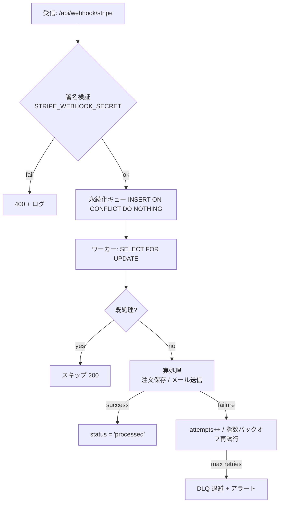

# 1.13 チェックアウトページ（CHECKOUT）詳細設計

## 機能要件対応表

| 要件ID | 要件内容 | 実装ID | 実装対象ファイル | 実装概要 | 実装ステータス |
|--------|----------|--------|----------------|----------|--------------|
| FR-CHECKOUT-001 | チェックアウトは Stripe の `CheckoutProvider` と `PaymentElement` を使用しカード・PayPay・コンビニ決済を提供する | IMPL-CHECKOUT-001 | `src/app/checkout/page.tsx`, `src/app/api/checkout/route.ts` | `CheckoutProvider` + `PaymentElement` を実装。paymentMethodTypes でカード・PayPay・コンビニを設定 | 済 |
| FR-CHECKOUT-002 | クレジットカード情報の入力・保持は Stripe Elements に委譲しサーバサイドはカード番号を一切保存しない | IMPL-CHECKOUT-002 | `src/app/checkout/page.tsx` | Stripe Elements ホスト型 UI を使用、PCI DSS 準拠。自サーバへのカードデータ送信なし | 済 |
| FR-CHECKOUT-003 | 注文サマリーに小計・税・送料・合計を明示する | IMPL-CHECKOUT-003 | `src/app/checkout/page.tsx` | 小計・消費税（10%）・配送料・合計を表示 | 済 |
| FR-CHECKOUT-004 | 住所入力フォームの各フィールドにバリデーションメッセージと `aria-describedby` を実装しユーザーが誤入力を確認できるようにする | IMPL-CHECKOUT-004 | `src/app/checkout/page.tsx`, `src/components/ui/TextField.tsx` | フィールド別バリデーション、`errorText`、`aria-describedby`、`aria-invalid` を実装 | 済 |
| FR-CHECKOUT-005 | 郵便番号入力に自動補完機能を実装し `GET /api/checkout/postal-code` で住所を取得してフォームに反映する | IMPL-CHECKOUT-005 | `src/app/checkout/page.tsx`, `src/app/api/checkout/postal-code/route.ts` | `useEffect` + `latestPostalLookupRef` でレース防止。郵便番号7桁入力で市区町村・都道府県を自動補完 | 済 |
| FR-CHECKOUT-006 | 決済完了時に確認メールを送信し画面に完了メッセージを表示する | IMPL-CHECKOUT-006 | `src/app/checkout/page.tsx` | `onComplete` コールバックで「確認メールをお送りしました」テキストを表示。実際のメール送信は Webhook 側で処理 | 済 |
| FR-CHECKOUT-007 | 決済確定前に在庫チェックを行い枯渇時はエラーメッセージと代替案を表示する | IMPL-CHECKOUT-007 | `src/app/api/checkout/create-session/route.ts`, `src/app/checkout/page.tsx` | `stock_quantity` を参照した在庫チェックを追加し、409 と在庫切れメッセージを返却・表示 | 済 |
| FR-CHECKOUT-008 | 決済エラー発生時は明確なメッセージと再試行導線を表示する | IMPL-CHECKOUT-008 | `src/app/checkout/page.tsx` | `checkoutError` の表示に加え、「再試行する」ボタンで決済セッション再作成を実装 | 済 |
| FR-CHECKOUT-009 | Stripe Webhook の冪等性を実装しネットワーク障害や再送による二重注文を防ぐ | IMPL-CHECKOUT-009 | `src/app/checkout/page.tsx`, `src/app/api/webhook/stripe/route.ts` | クライアント側 `processedCallback` とサーバ側 `stripe_webhook_events` upsert、および `payment_intent_id` 重複防止を実装 | 済 |
| FR-CHECKOUT-010 | 郵便番号 API に `postal_code_cache` テーブルを利用しキャッシュ済みの住所は外部 API を再呼び出しせず返す | IMPL-CHECKOUT-010 | `src/app/api/checkout/postal-code/route.ts`, `migrations/024_create_postal_code_cache.sql` | `postal_code_cache` テーブルへの SELECT + キャッシュミス時に外部 API 問い合わせ後に INSERT | 済 |
| FR-CHECKOUT-011 | 消費税の自動計算と詳細な税率表示（WONT） | — | — | 現フェーズ対象外 | 未 |

---

## 実装タスク管理 (CHECKOUT-01)

**タスクID**: CHECKOUT-01  
**ステータス**: 一部未実装「況」あり  
**元ファイル**: `docs/tasks/04_checkout_ticket.md`

### Stripe 実装チェックリスト

| 要件ID | 要件内容 | 実装ID | 実装対象ファイル | 実装概要 | 実装ステータス |
|--------|----------|--------|----------------|----------|--------------|
| CHECKOUT-01-001 | Stripe セッション作成実装 | IMPL-CHECKOUT-SESSION-01 | `src/app/api/checkout/route.ts` | Stripe セッション作成実装済み | 済 |
| CHECKOUT-01-002 | Payment Element + PaymentIntent 初期化 API | IMPL-CHECKOUT-PI-01 | `src/app/api/checkout/route.ts` | PaymentIntent 初期化 API 実装済み | 済 |
| CHECKOUT-01-003 | `POST /api/checkout/complete`（カード/銀行振込/代金引換） | IMPL-CHECKOUT-COMPLETE-01 | `src/app/api/checkout/complete/route.ts` | 決済完了 API 実装済み | 済 |
| CHECKOUT-01-004 | Webhook 受信と署名検証 | IMPL-CHECKOUT-WEBHOOK-01 | `src/app/api/checkout/webhook/route.ts` | Stripe 署名検証付き Webhook 実装済み | 済 |
| CHECKOUT-01-005 | 注文確定ロジック（orders/order_items 保存、カートクリア） | IMPL-CHECKOUT-ORDER-01 | `src/app/api/checkout/webhook/route.ts`, `migrations/025_create_orders.sql` | 注文保存 + カートクリア実装済み | 済 |
| CHECKOUT-01-006 | 郵便番号住所自動補完（同一オリジン API + `postal_code_cache`） | IMPL-CHECKOUT-POSTAL-01 | `src/app/api/checkout/postal-code/route.ts` | キャッシュ付き郵便番号補完実装済み | 済 |
| CHECKOUT-01-007 | Payment Element Accordion UI + Appearance API | IMPL-CHECKOUT-UI-01 | `src/app/checkout/page.tsx` | Accordion UI + Appearance API 実装済み | 済 |
| CHECKOUT-01-008 | Checkout Sessions API（custom UI モード） | IMPL-CHECKOUT-SESSION-02 | `src/app/api/checkout/route.ts` | custom UI モード実装済み | 済 |
| CHECKOUT-01-009 | `metadata`（注文ID/カートID）を Stripe セッションに付与 | IMPL-CHECKOUT-META-01 | `src/app/api/checkout/route.ts` | metadata 付与実装済み | 済 |
| CHECKOUT-01-010 | Dynamic Payment Methods（Stripe 最適表示） | IMPL-CHECKOUT-DPM-01 | `src/app/api/checkout/route.ts` | 未実装 | 未 |
| CHECKOUT-01-011 | Stripe SDK バージョン確認・アップデート | IMPL-CHECKOUT-SDK-01 | `package.json` | 未確認 | 未 |
| CHECKOUT-01-012 | Payment Element の iframe 非埋め込み確認 | IMPL-CHECKOUT-IFRAME-01 | `src/app/checkout/page.tsx` | 未確認 | 未 |
| CHECKOUT-01-013 | Dashboard 支払い方法確認・Payment Method Rules | — | Stripe Dashboard 設定 | 未確認 | 未 |

### 依存関係

- Stripe: `STRIPE_SECRET_KEY`, `STRIPE_WEBHOOK_SECRET` は環境変数管理
- メール送信サービス: Webhook 側で SendGrid 実装（型紙未作成、要実装）

---

## 外部連携 実装タスク管理 (INTEG-01)

**タスクID**: INTEG-01  
**ステータス**: 一部実装済み  
**元ファイル**: `docs/tasks/09_integrations_ticket.md`

### チェックリスト

| 要件ID | 要件内容 | 実装ID | 実装対象ファイル | 実装概要 | 実装ステータス |
|--------|----------|--------|----------------|----------|--------------|
| INTEG-01-001 | Stripe 統合 + Webhook 署名検証 | IMPL-INTEG-STRIPE-01 | `src/app/api/checkout/webhook/route.ts` | Stripe 統合 + 署名検証実装済み | 済 |
| INTEG-01-002 | 管理画面 ORDER 向け Stripe Refund API（`POST /api/admin/orders/:id/refund`） | IMPL-INTEG-REFUND-01 | `src/app/api/admin/orders/[id]/refund/route.ts` | 返金 API 実装済み | 済 |
| INTEG-01-003 | SendGrid テンプレート連携 | IMPL-INTEG-EMAIL-01 | `src/features/notifications/services/email.ts` | 未実装 | 未 |
| INTEG-01-004 | 配送 API 初期連携（ラベル発行・追跡） | IMPL-INTEG-SHIPPING-01 | `src/features/shipping/` | 未実装 | 未 |

### 実装ノート

- 各種シークレットは `.env.local` で管理。本番は Vercel Environment Variables に設定
- Webhook の冪等性: クライアント側 `processedCallback` フラグに加え、サーバ側で `stripe_webhook_events` への upsert と `payment_intent_id` の重複注文防止を実装

---

## データモデル（CHECKOUT-DATA）

```sql
-- 注文テーブル
orders (
  id          uuid         PRIMARY KEY DEFAULT gen_random_uuid(),
  user_id     uuid         NULL REFERENCES users(id) ON DELETE SET NULL,  -- ゲスト注文は NULL
  items       jsonb        NOT NULL,            -- [{sku_id, qty, unit_price}]
  total_amount integer     NOT NULL,            -- JPY 整数（最小単位）
  currency    text         NOT NULL DEFAULT 'jpy',
  status      text         NOT NULL CHECK (status IN ('pending','paid','failed','refunded','cancelled')),
  created_at  timestamptz  NOT NULL DEFAULT now()
)
```

> **注意**: 金額（`total_amount`）は必ずサーバ側で再計算して検証する。クライアント送信値は参照のみとして利用しない。

---

## Stripe Webhook 冪等性設計（CHECKOUT-WEBHOOK）

### 処理フロー



### 冪等性テーブル

```sql
processed_events (
  id              uuid         PRIMARY KEY DEFAULT gen_random_uuid(),
  provider        text         NOT NULL,                    -- 'stripe'
  event_id        text         NOT NULL UNIQUE,             -- evt_1AbCdeF
  idempotency_key text,                                     -- 'stripe:event:<event_id>'
  payload         jsonb,
  status          text         NOT NULL CHECK (status IN ('pending','processing','processed','failed'))
                               DEFAULT 'pending',
  attempts        integer      NOT NULL DEFAULT 0,
  created_at      timestamptz  NOT NULL DEFAULT now(),
  processed_at    timestamptz  NULL
)
```

処理手順（疑似コード）:

1. 受信 → `STRIPE_WEBHOOK_SECRET` で署名検証（失敗は即 400）
2. `INSERT INTO processed_events … ON CONFLICT (event_id) DO NOTHING` で永続化
3. ワーカーが `SELECT … FOR UPDATE` で行ロック取得・`status = 'processing'` に更新
4. 実処理成功 → `status = 'processed'`, `processed_at = now()`
5. 実処理失敗 → `attempts++`、指数バックオフで再エンキュー。上限超過で DLQ へ退避しアラート通知

---

## API 仕様（CHECKOUT-API）

| エンドポイント | メソッド | 概要 | 認証 | 主なレスポンス |
|---|---|---|---|---|
| `/api/checkout/create-session` | POST | カート内容から Stripe セッションを作成 | 任意（ゲスト/会員） | `{ sessionId, clientSecret }` |
| `/api/checkout/complete` | POST | Webhook/サーバ確認後に注文を確定 | 任意 | `{ orderId, status }` |
| `/api/webhook/stripe` | POST | Stripe Webhook 受信・署名検証・冪等処理 | Stripe 署名 | `200` or `400` |

> **決済成功率目標**: 99% 以上。支払失敗時は注文を `failed` ステータスに更新し、ユーザへ再試行導線を提示すること。

---

## イベントスキーマ管理（INTEG-EVENT）

| バージョン | 方針 |
|---|---|
| `v1` | 現行スキーマ。破壊的変更は禁止 |
| `v2` 以降 | 新バージョンを追加し、旧バージョンは deprecation スケジュールを公開後、十分な猶予期間を設けて廃止 |

- 後方互換性: 新フィールド追加は `v1` に許可（オプション）。型変更・フィールド削除は新バージョン必須。
- スキーマは OpenAPI / JSON Schema で管理し、CI で diff を自動検出する。

---

## API バージョニング方針（INTEG-APIVER）

- バージョンは URL パス（`/api/v1/items`）または `Accept: application/vnd.api+json;version=1` ヘッダーで明示する。
- 非互換変更は新バージョンとして追加し、旧バージョンは **最低 6 か月** の deprecation 期間を設けて廃止する。
- 廃止予定の API は `Deprecation` / `Sunset` レスポンスヘッダーで通知する。

---

## シークレットローテーション方針（INTEG-SECRETS）

| シークレット種別 | ローテーション周期 | 緊急時 |
|---|---|---|
| `STRIPE_SECRET_KEY` | 90 日 | 漏洩疑い発生後 1 時間以内 |
| `STRIPE_WEBHOOK_SECRET` | 90 日 | 漏洩疑い発生後 1 時間以内 |
| Supabase サービスキー | 90 日 | 漏洩疑い発生後 1 時間以内 |

- ローテーション手順: Secrets Manager に新バージョン登録 → CI/CD で新 Secret を取得 → ローリングデプロイ → Health Check 確認 → 旧 Secret 無効化 → 監査ログ記録。
