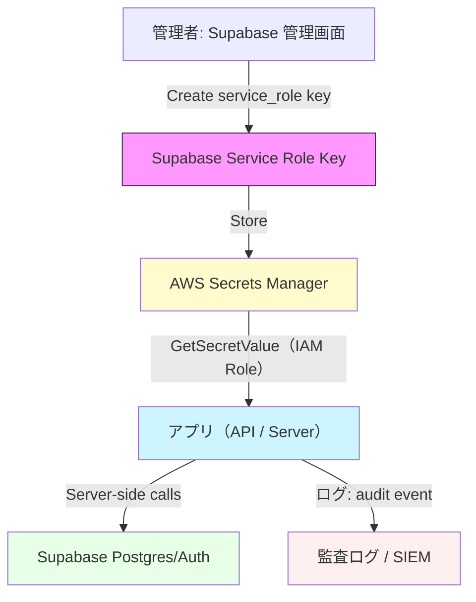
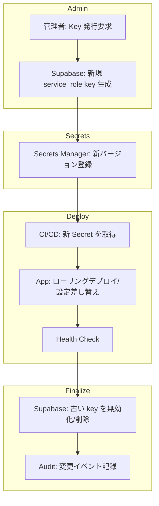
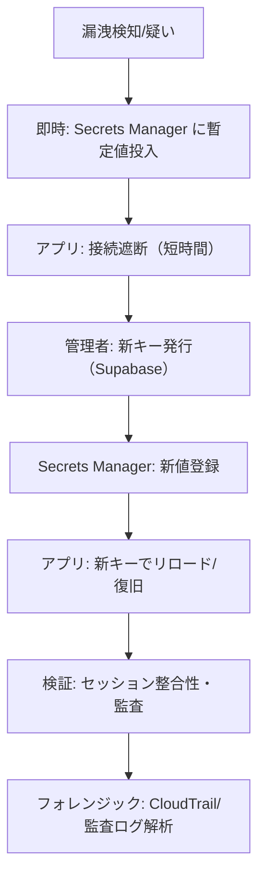
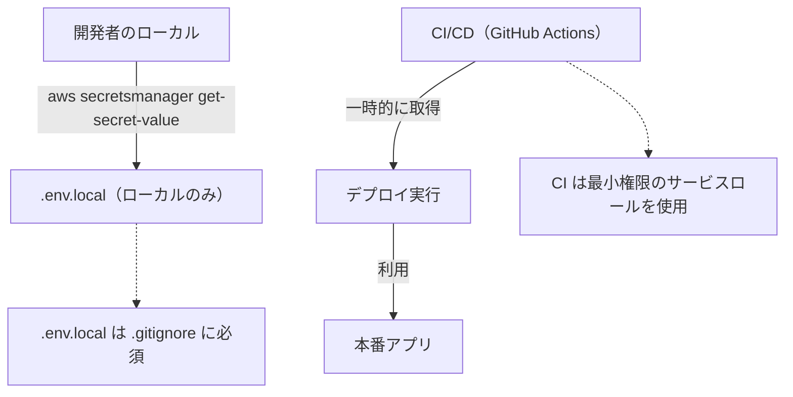
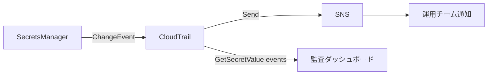

# 非機能要件・監視基盤 詳細設計

## 機能要件対応表

| 要件ID | 要件内容 | 実装ID | 実装対象ファイル | 実装概要 | 実装ステータス |
|--------|----------|--------|----------------|----------|--------------|
| NFR-PERF-001 | 主要 API の P95 レスポンスタイムは 200ms 以内とする | — | — | 未計測（ベンチマーク未整備） | 未 |
| NFR-PERF-002 | LCP（Largest Contentful Paint）の P95 は 2.5 秒以内とする | — | — | Core Web Vitals 未計測 | 未 |
| NFR-AVAIL-001 | サービス可用性 SLO 99.5% 以上をドキュメント化し監視する | — | — | SLO 未定義 | 未 |
| NFR-CI-001 | CI パイプラインに Unit/Integration/Contract/E2E テストの必須チェックを組み込む | — | `.github/workflows/` | lint.yml は実装済み。テスト品質ゲートは未設定 | 一部済 |
| NFR-CI-002 | アクセシビリティ自動チェック（axe 等）を CI に統合する | — | — | 未実装 | 未 |
| NFR-DR-001 | バックアップ/DR 手順と復旧検証スケジュールを整備する | — | `docs/ops/` | 未整備 | 未 |
| NFR-MON-001 | RUM + サーバメトリクス（P95/P99・エラー率・決済失敗率）を監視ダッシュボードで可視化する | — | — | 未実装 | 未 |
| NFR-MON-002 | OpenTelemetry でトレース/メトリクス基盤を初期設定する | — | — | 未実装 | 未 |
| NFR-MON-003 | デプロイ後スモークチェックを自動化し閾値超過でロールバックをトリガーする | — | — | 未実装 | 未 |
| NFR-OPS-001 | ランブック（障害対応手順書）とアラート設定を整備する | — | `docs/ops/` | 未整備 | 未 |

---

## 実装タスク管理 (NONFUNC-01)

**タスクID**: NONFUNC-01  
**ステータス**: 未着手  
**元ファイル**: `docs/tasks/06_nonfunctional_ticket.md`

### チェックリスト

| 要件ID | 要件内容 | 実装ID | 実装対象ファイル | 実装概要 | 実装ステータス |
|--------|----------|--------|----------------|----------|--------------|
| NONFUNC-01-001 | SLO ドキュメント化（API P95 < 200ms, LCP P95 < 2.5s） | — | `docs/ops/slo.md` | 未整備 | 未 |
| NONFUNC-01-002 | CI 品質ゲート設定（Unit/Integration/Contract/E2E 必須） | — | `.github/workflows/` | 未設定 | 未 |
| NONFUNC-01-003 | ベンチマーク実行とレポート | — | `tests/perf/` | 未実装 | 未 |

### バックアップ/DR

- Supabase 自動バックアップ: Supabase Pro プランで Point-in-Time Recovery が利用可能
- DR 手順書: `docs/ops/` 配下に作成予定

---

## 実装タスク管理 (MON-01)

**タスクID**: MON-01  
**ステータス**: 未着手  
**元ファイル**: `docs/tasks/10_monitoring_and_ops_ticket.md`

### チェックリスト

| 要件ID | 要件内容 | 実装ID | 実装対象ファイル | 実装概要 | 実装ステータス |
|--------|----------|--------|----------------|----------|--------------|
| MON-01-001 | APM / RUM 導入 | — | — | 未実装 | 未 |
| MON-01-002 | CI パイプライン整備（Lint → Unit → Integration → Contract → E2E） | — | `.github/workflows/` | lint.yml のみ存在 | 未 |
| MON-01-003 | ランブック / アラート設定 | — | `docs/ops/runbook.md` | 未整備 | 未 |
| MON-01-004 | 自動ロールバック / デプロイ戦略（Canary / Blue-Green） | — | `.github/workflows/` | 未実装 | 未 |

### 現状の CI 構成

| 要件ID | 要件内容 | 実装ID | 実装対象ファイル | 実装概要 | 実装ステータス |
|--------|----------|--------|----------------|----------|--------------|
| MON-01-CI-001 | ESLint による静的解析 | IMPL-CI-LINT-01 | `.github/workflows/lint.yml` | ESLint 静的解析ワークフロー実装済み | 済 |
| MON-01-CI-002 | 監査ログ定期クリーンアップ | IMPL-CI-CLEANUP-01 | `.github/workflows/cleanup-audit-logs.yml` | 監査ログ cleanup ワークフロー実装済み | 済 |
| MON-01-CI-003 | ユニット/統合テスト CI ワークフロー | IMPL-CI-TEST-01 | `.github/workflows/test.yml` | 未作成 | 未 |

### 監視アーキテクチャ候補

- **APM**: Vercel Analytics（フロントエンド）/ Sentry（エラートラッキング）
- **メトリクス**: Prometheus + Grafana または Datadog
- **トレース**: OpenTelemetry → Jaeger / Zipkin
- **RUM**: Vercel Speed Insights or web-vitals ライブラリ

---

## Supabase Service Role Key 運用フロー

> 元ファイル: `docs/4_DetailDesign/supabase-service-role-key-rotation-diagrams.md`

### 1) 秘密作成と利用フロー



### 2) 正常ローテーションフロー



### 3) 緊急ローテーション（漏洩疑い）



### 4) 開発 / CI の扱い



### 5) 監査・アラート設計



### 備考
- Mermaid 図は Markdown Preview Enhanced (MPE) で表示してください。
- 図の色やノードは運用チームの好みに合わせて調整可能です。

---

## CI 品質ゲート（QA-CI）

| テスト種別 | 実行タイミング | 合格基準 |
|---|---|---|
| Lint | PR 毎 | エラー 0 件 |
| Unit Test | PR 毎 | カバレッジ ≥ 80%（重要モジュール ≥ 90%） |
| Integration Test | PR 毎 | 全ケース成功 |
| Contract Test (外部 API) | PR 毎 | Stripe / 配送 / メール の全契約テスト成功 |
| E2E Test | マージ前 or ステージング | 購入フロー・Webhook・管理画面パス 全グリーン |
| Security Scan (SAST / Dependency) | PR 毎 | Critical 0 件、High は審査チケット必須 |

- PR マージ条件: Lint + Unit + Integration + Contract がすべて成功していること。
- E2E はマージ前またはマージ直後のステージング環境での成功を推奨する。
- Security: Critical 問題なし、High は解決計画のチケットが存在すること。

---

## アラート閾値一覧（ALERT-THRESHOLDS）

| メトリクス | 警告しきい値 | 重大しきい値 | 対応 |
|---|---|---|---|
| API P95 レイテンシ | > 200ms が 5 分継続 | > 500ms が 2 分継続 | PagerDuty トリアージ |
| API P99 レイテンシ | — | > 1s が 2 分継続 | PagerDuty 重大 |
| ページ表示 LCP (P95) | > 2.5s | > 5s | Slack 通知 |
| エラー率（全 API） | > 1% が 5 分継続 | > 5% が 1 分継続 | PagerDuty |
| 決済失敗率 | > 2% が 1 時間 | > 5% が即時 | オンコール + Slack |
| Webhook 処理失敗率 | > 1% が 1 時間継続 | — | Slack 通知 |
| バックグラウンドキュー長 | 通常値の 2 倍超 | — | Slack 通知 |
| カート放棄率 | 日次 +10% 変化 | — | 日次レポートで確認 |

---

## トレース命名規則（TRACE-NAMING）

命名フォーマット: `{component}.{resource}.{operation}`

| 種別 | フォーマット | 例 |
|---|---|---|
| HTTP ハンドラ | `api.<resource>.<method>` | `api.items.getList` |
| バックグラウンド処理 | `worker.<domain>.<action>` | `worker.checkout.processPayment` |
| バッチ/Cron | `cron.<domain>.<action>` | `cron.inventory.reconcile` |

- 小文字ドット区切りを使用する。
- 各リクエストに `trace-id` を付与し、ログ・メトリクスと結合して可観測性を確保する。

---

## CI/CD パイプライン設計（OPS-CICD）

```
Lint → Unit Test → Integration Test → Contract Test → E2E Test → Canary Deploy → Blue-Green 昇格
```

| ステージ | トリガー | ブロッキング | 環境 |
|---|---|---|---|
| Lint | PR 毎 | Yes | — |
| Unit Test | PR 毎 | Yes | — |
| Integration Test | PR 毎 | Yes | — |
| Contract Test | PR 毎 | Yes | Staging |
| E2E Test | マージ時 | Recommended | Staging |
| Canary Deploy | マージ後 | Yes(自動ロールバック) | Production 5% |
| Blue-Green 昇格 | Canary 通過後 | — | Production 100% |

**自動ロールバック条件**: Canary 期間中にエラー率が閾値（> 1% が 5 分継続）を超えた場合に自動ロールバックをトリガーする。

---

## ログ保存期間（OPS-LOG）

| 区分 | 保存期間 | 用途 |
|---|---|---|
| 高解像度ログ | 30 日 | 障害調査・即時検索 |
| 集計ログ | 1 年 | トレンド分析・監査 |
| 監査ログ（管理操作） | 7 年 | コンプライアンス・法規制 |

- 構造化ログ（JSON Lines）を採用し、ログローテーションで圧縮・アーカイブする。
- 監査ログは WORM ストレージまたはハッシュ署名で改ざん防止を実施する。

---

## ランブック（OPS-RUNBOOK）

### インシデント対応フロー

1. **検知**: アラート受信（PagerDuty / Slack）→ オンコール担当がトリアージ開始
2. **影響範囲特定**: エラー率・レイテンシ・決済失敗率を Dashboard で確認
3. **ロールバック/フェイルオーバー**: 自動ロールバックが未発動の場合は手動でトリガー
4. **通知**: ステークホルダーへのステータス報告（Slack #incidents チャンネル）
5. **ポストモーテム**: 解決後 48 時間以内に原因分析・再発防止策を文書化

### 定期チェックリスト

| 頻度 | チェック項目 |
|---|---|
| 日次 | 未処理注文確認、決済失敗率確認、DLQ 件数確認 |
| 週次 | バックアップ・リストア確認、脆弱性スキャン結果確認 |
| 月次 | SLO 達成状況レビュー、シークレットローテーション確認 |
