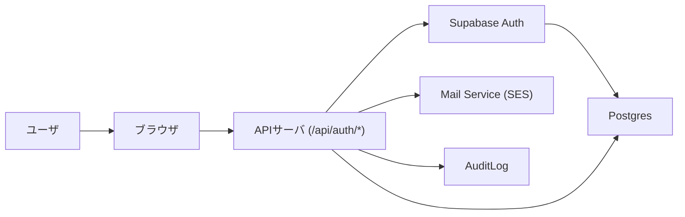

# 認証 (Auth) — 構造設計（初稿）

## 概要
このドキュメントは `docs/specs/01_auth.md` と `docs/seq/01_auth_seq.md` を元に、認証ドメインの**構造設計（要求—アーキテクチャのトレーサビリティ）**をまとめたものです。構造設計に合意後、詳細設計（API/DB/セキュリティ）を `docs/DetailDesign/auth-detailed.md` または `src/features/auth/design.md` にて作成します。

## 参照ファイル
- `docs/specs/01_auth.md`
- `docs/seq/01_auth_seq.md`

## 1. 要求抽出（要件ID を付与）
以下は仕様から抽出した主要要求（自動割当：`REQ-AUTH-XXX`）です。各要求は該当箇所を引用しています。

- REQ-AUTH-001 — 新規登録（Register）: `docs/specs/01_auth.md` §4.1（メール登録、確認メール、/api/auth/confirm による自動ログイン、トークンワンタイム化）
- REQ-AUTH-002 — ログイン（Login）: `docs/specs/01_auth.md` §4.2（メール+パスワード、レート制御、監査ログ）
- REQ-AUTH-003 — リフレッシュ（Refresh）: `docs/specs/01_auth.md` §4.3（JTI ローテーション、再利用検出）
- REQ-AUTH-004 — パスワードリセット（Password Reset）: `docs/specs/01_auth.md` §4.4（トークン寿命 1h、ワンタイム）
- REQ-AUTH-005 — ログアウト / セッション管理: `docs/specs/01_auth.md` §4.3（logout, revoke sessions, 同時セッション上限）
- REQ-AUTH-006 — OAuth (Google) 基本フロー: `docs/specs/01_auth.md` §4.5
- REQ-AUTH-007 — CSRF 対策/クッキー設計: `docs/specs/01_auth.md` §5（ダブルサブミット、Cookie フラグ）
- REQ-AUTH-008 — 監査ログと保持ポリシー: `docs/specs/01_auth.md` §10
- REQ-AUTH-009 — レート制限・不正検出: `docs/specs/01_auth.md` §5
- REQ-AUTH-010 — 環境変数・シークレット管理: `docs/specs/01_auth.md` §3

## 2. 要求 → アーキテクチャID マッピング（実装ファイル例付き）
| 要求ID | 要求（短） | アーキテクチャID | アーキテクチャ要素（説明） | 実装ファイル（推奨例） |
|---|---|---:|---|---|
| REQ-AUTH-001 | 新規登録/確認 | ARCH-AUTH-01 | 登録 API, `/api/auth/register`, `/api/auth/confirm`, 確認メールフロー | `src/app/api/auth/register/route.ts`, `src/app/api/auth/confirm/route.ts`, `src/features/auth/services/register.ts`, `src/features/auth/schemas/register.ts`, `tests/auth/register.test.ts`, `e2e/auth/register.spec.ts` |
| REQ-AUTH-002 | ログイン | ARCH-AUTH-02 | 認証 API `/api/auth/login`, レート/監査ログ連携 | `src/app/api/auth/login/route.ts`, `src/features/auth/services/auth.ts`, `src/features/auth/schemas/login.ts`, `tests/auth/login.test.ts`, `e2e/auth/login.spec.ts` |
| REQ-AUTH-003 | リフレッシュ | ARCH-AUTH-03 | `/api/auth/refresh`, JTI 管理, sessions テーブル設計 | `src/app/api/auth/refresh/route.ts`, `src/features/auth/services/refresh.ts`, `migrations/00XX_add_session_jti.sql`, `src/features/auth/schemas/refresh.ts`, `tests/auth/refresh.test.ts` |
| REQ-AUTH-004 | パスワード再設定 | ARCH-AUTH-04 | `password_reset_tokens` 管理、メール送信、confirm エンドポイント | `src/app/api/auth/password-reset/request/route.ts`, `src/app/api/auth/password-reset/confirm/route.ts`, `migrations/00XX_create_password_reset_tokens.sql`, `src/features/auth/schemas/password-reset.ts`, `tests/auth/password-reset.test.ts` |
| REQ-AUTH-005 | ログアウト/セッション | ARCH-AUTH-05 | `POST /api/auth/logout`, `POST /api/auth/revoke-user-sessions` | `src/app/api/auth/logout/route.ts`, `src/app/api/admin/revoke-user-sessions/route.ts`, `src/features/auth/services/session.ts`, `tests/auth/logout.test.ts` |
| REQ-AUTH-006 | OAuth | ARCH-AUTH-06 | OAuth コールバック、外部プロバイダリンク、state/PKCE 管理、oauth_requests テーブル、cleanup ジョブ、Admin unlink/re-link | `src/app/api/auth/oauth/start/route.ts`, `src/app/api/auth/oauth/callback/route.ts`, `src/app/api/auth/oauth/link-proposal/route.ts`, `src/app/api/auth/oauth/link-confirm/route.ts`, `src/app/api/auth/oauth/unlink/route.ts` `src/features/auth/oauth/handlers.ts`, `migrations/00XX_create_oauth_requests.sql`, `src/workers/oauth_cleanup_job.ts`, `tests/auth/oauth.*.test.ts` |
| REQ-AUTH-007 | CSRF / Cookie | ARCH-AUTH-07 | CSRF ダブルサブミット設計、Cookie ポリシー | `src/lib/csrf.ts`, `src/lib/cookie.ts`, `src/features/auth/hooks/useCsrf.ts`, `tests/lib/csrf.test.ts` |
| REQ-AUTH-008 | 監査ログ | ARCH-AUTH-08 | JSON Lines 監査ログ, 保持/アクセス制御 | `src/lib/audit.ts`, `migrations/00XX_create_audit_logs.sql`, `docs/ops/audit.md`, `tests/lib/audit.test.ts` |
| REQ-AUTH-009 | レート制限 | ARCH-AUTH-09 | IP/エンドポイント/バケットカウンタ（Postgres 保存）、Cloudflare Turnstile 連携 | `src/features/auth/ratelimit/index.ts`, `src/lib/middleware/rateLimit.ts`, `migrations/005_create_rate_limit_counters.sql`, `tests/integration/db/rate_limit_counters.integration.test.ts` |
| REQ-AUTH-010 | シークレット管理 | ARCH-AUTH-10 | SUPABASE_SERVICE_ROLE_KEY の運用（初期: 手動） | `docs/ops/secrets.md` (現行: 手動更新手順を適用。将来的に `docs/seq/supabase-service-role-key-rotation-diagrams.md` に従った自動ローテーションへ移行予定) |

> 注: 上表のアーキテクチャID はユニークで、詳細設計（`docs/DetailDesign/auth-detailed.md`）の各セクションは対応する ARCH-ID を参照して記述します。

## 3. 高レベルアーキテクチャ図


## 4. 推奨ディレクトリ構成
```
src/features/auth/
  ├─ api/
  │   ├─ register/
  │   ├─ confirm/
  │   ├─ login/
  │   ├─ refresh/
  │   ├─ logout/
  │   └─ password-reset/
  ├─ services/  # business logic services (e.g., register.ts, auth.ts)
  ├─ lib/  # csrf, jwt helpers
  ├─ schemas/  # Zod schemas
  └─ tests/

docs/ArchitectureDesign/
  └─ auth-structure.md
docs/DetailDesign/
  └─ auth-detailed.md
```

## 5. 実装ファイルの現状（存在チェック）
| アーキテクチャID | 推奨実装パス | 現状 | 既存ファイルパス | 備考 |
|---|---|---|---|---|
| ARCH-AUTH-01 | `src/app/api/auth/register/route.ts` | 未存在 | - | 代替: `src/app/api/auth/register/route.ts` を新規作成（現在 `register` route は既に存在しますかを確認済） |
| ARCH-AUTH-01 | `src/app/api/auth/confirm/route.ts` | 未存在 | - | 代替: `src/app/api/auth/confirm/route.ts` を新規作成 |
| ARCH-AUTH-02 | `src/app/api/auth/login/route.ts` | 存在 | `src/app/api/auth/login/route.ts` | 既に実装済、レビューとテストの追加を推奨 |
| ARCH-AUTH-03 | `src/app/api/auth/refresh/route.ts` | 存在 | `src/app/api/auth/refresh/route.ts` | 既に実装済、JTI ローテーションロジックの確認を推奨 |
| ARCH-AUTH-04 | `src/app/api/auth/password-reset/request/route.ts` | 存在 | `src/app/api/auth/password-reset/request/route.ts` | 既に実装済（DB token table exists） |
| ARCH-AUTH-04 | `src/app/api/auth/password-reset/confirm/route.ts` | 存在 | `src/app/api/auth/password-reset/confirm/route.ts` | 既に実装済、トークン無効化ロジックを再確認 |
| ARCH-AUTH-05 | `src/app/api/auth/logout/route.ts` | 存在 | `src/app/api/auth/logout/route.ts` | 既に実装済 |
| ARCH-AUTH-05 | `src/app/api/admin/revoke-user-sessions/route.ts` | 未存在 | - | 新規作成推奨（管理API） |
| ARCH-AUTH-06 | `src/app/api/auth/oauth/callback/route.ts` | 未存在 | - | OAuth は別タスクで実装予定 |
| ARCH-AUTH-07 | `src/lib/csrf.ts` | 未存在 | - | CSRF util の実装を推奨 |
| ARCH-AUTH-08 | `src/lib/audit.ts` | 存在 | `src/lib/audit.ts` | 既に実装済（監査ログの実装箇所） |
| ARCH-AUTH-09 | `src/features/auth/ratelimit/index.ts` | 未存在 | - | Postgres ベースのカウンタ実装を推奨 |
| ARCH-AUTH-10 | `docs/ops/secrets.md` | 存在 | `docs/ops/secrets.md` | シークレット方針文書は存在（要更新/承認） |

> 注: 上表はワークスペースをスキャンして自動作成しました。実装の上でファイルの重複や配置変更・削除を提案する場合は、必ず `削除提案フロー` に従ってください。

## 6. 削除提案
- 既存コード（例: 不要なヘルパ、重複実装）が見つかった場合は、同様のフローで削除/統合を提案してください。

## 5. 重要設計決定（ADR: 要約）
- セッション管理はサーバ側 Cookie を採用（HttpOnly, Secure, SameSite=Lax）。
- Refresh トークンは DB にハッシュ保存し、JTI を sessions.current_jti に保存してローテーション。再利用検出は quarantine → 通知 → 必要に応じ全セッション失効。

## 6. 未解決の質問（確認が必要な事項）
- SUPABASE_SERVICE_ROLE_KEY の保管/アクセス承認フローはどのチームで保持・承認するか？（運用担当）
- OAuth での既存アカウント衝突時のポリシー（自動マージ vs 別口座）を確定してください

### ユーザーテーブル方針（決定: 2026-02-01）
- **決定**: `auth.users` を認証のソース・オブ・トゥルース（source-of-truth）とし、アプリ側のプロフィール情報は `public.profiles` テーブル（`user_id` -> `auth.users.id`）に格納します。`migrations/002_create_profiles.sql` を追加し、`public.users` のデータを移行して `public.users` は `public.users_deprecated` にリネームして保持しました。

## 7. 次のアクション
1. ここに記載した構造設計に対してレビュー（コメント/承認）してください。  
2. 承認を得たら、ARCH-IDs を参照して `docs/DetailDesign/auth-detailed.md` を作成します（OpenAPI / SQL / TS / テストケース を含む）。

---
*作成: SDD Agent (初稿) — 確認待ち*