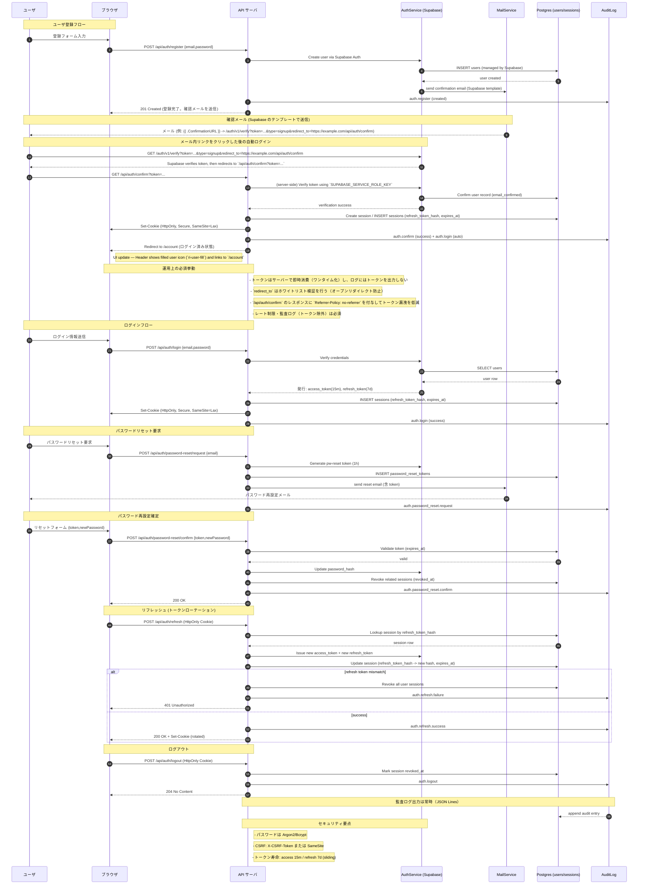

# 認証 (Auth) シーケンス図 — Mermaid

以下は `docs/specs/01_auth.md` の主要フロー（登録・ログイン・パスワードリセット・リフレッシュ・ログアウト）を示す Mermaid シーケンス図です。

```mermaid
sequenceDiagram
    autonumber
    participant User as ユーザ
    participant Browser as ブラウザ
    participant API as API サーバ
    participant Auth as AuthService (Supabase)
    participant Mail as MailService
    participant DB as Postgres (users/sessions)
    participant Audit as AuditLog

    Note over User,Browser: ユーザ登録フロー
    User->>Browser: 登録フォーム入力
    Browser->>API: POST /api/auth/register {email,password}
    API->>Auth: Create user via Supabase Auth
    Auth->>DB: INSERT users (managed by Supabase)
    DB-->>Auth: user created
    Auth->>Mail: send confirmation email (Supabase template)
    API->>Audit: auth.register (created)
    API-->>Browser: 201 Created (登録完了。確認メールを送信)

    Note over Mail,User: 確認メール (Supabase のテンプレートで送信)
    Mail-->>User: メール (例: {{ .ConfirmationURL }} -> /auth/v1/verify?token=...&type=signup&redirect_to=https://example.com/api/auth/confirm)

    Note over User,Auth: メール内リンクをクリックした後の自動ログイン
    User->>Auth: GET /auth/v1/verify?token=...&type=signup&redirect_to=https://example.com/api/auth/confirm
    Auth-->>User: Supabase verifies token, then redirects to `/api/auth/confirm?token=...`
    User->>API: GET /api/auth/confirm?token=...
    API->>Auth: (server-side) Verify token using `SUPABASE_SERVICE_ROLE_KEY`
    Auth->>DB: Confirm user record (email_confirmed)
    Auth-->>API: verification success
    API->>DB: Create session / INSERT sessions (refresh_token_hash, expires_at)
    API->>Browser: Set-Cookie (HttpOnly, Secure, SameSite=Lax)
    API->>Audit: auth.confirm (success) + auth.login (auto)
    API-->>Browser: Redirect to /account (ログイン済み状態)
    Note right of Browser: UI update — Header shows filled user icon (`ri-user-fill`) and links to `/account`
    Note over API,Browser: 運用上の必須挙動
    Note right of API: - トークンはサーバーで即時消費（ワンタイム化）し、ログにはトークンを出力しない
    Note right of API: - `redirect_to` はホワイトリスト検証を行う（オープンリダイレクト防止）
    Note right of API: - `/api/auth/confirm` のレスポンスに `Referrer-Policy: no-referrer` を付与してトークン漏洩を低減
    Note right of API: - レート制限・監査ログ（トークン除外）は必須

    Note over User,API: ログインフロー
    User->>Browser: ログイン情報送信
    Browser->>API: POST /api/auth/login {email,password}
    API->>Auth: Verify credentials
    Auth->>DB: SELECT users
    DB-->>Auth: user row
    Auth-->>API: 発行: access_token(15m), refresh_token(7d)
    API->>DB: INSERT sessions (refresh_token_hash, expires_at)
    API->>Browser: Set-Cookie (HttpOnly, Secure, SameSite=Lax)
    API->>Audit: auth.login (success)

    Note over User,API: パスワードリセット要求
    User->>Browser: パスワードリセット要求
    Browser->>API: POST /api/auth/password-reset/request {email}
    API->>Auth: Generate pw-reset token (1h)
    API->>DB: INSERT password_reset_tokens
    API->>Mail: send reset email (含 token)
    Mail-->>User: パスワード再設定メール
    API->>Audit: auth.password_reset.request

    Note over User,API: パスワード再設定確定
    User->>Browser: リセットフォーム (token,newPassword)
    Browser->>API: POST /api/auth/password-reset/confirm {token,newPassword}
    API->>DB: Validate token (expires_at)
    DB-->>API: valid
    API->>Auth: Update password_hash
    API->>DB: Revoke related sessions (revoked_at)
    API->>Audit: auth.password_reset.confirm
    API-->>Browser: 200 OK

    Note over Browser,API: リフレッシュ (トークンローテーション)
    Browser->>API: POST /api/auth/refresh (HttpOnly Cookie)
    API->>DB: Lookup session by refresh_token_hash
    DB-->>API: session row
    API->>Auth: Issue new access_token + new refresh_token
    API->>DB: Update session (refresh_token_hash -> new hash, expires_at)
    alt refresh token mismatch
        API->>DB: Revoke all user sessions
        API->>Audit: auth.refresh.failure
        API-->>Browser: 401 Unauthorized
    else success
        API->>Audit: auth.refresh.success
        API-->>Browser: 200 OK + Set-Cookie (rotated)
    end

    Note over Browser,API: ログアウト
    Browser->>API: POST /api/auth/logout (HttpOnly Cookie)
    API->>DB: Mark session revoked_at
    API->>Audit: auth.logout
    API-->>Browser: 204 No Content

    Note over API,Audit: 監査ログ出力は常時（JSON Lines）
    Audit-->>DB: append audit entry

    Note over API,Auth: セキュリティ要点
    Note right of API: - パスワードは Argon2/Bcrypt
    Note right of API: - CSRF: X-CSRF-Token または SameSite
    Note right of API: - トークン寿命: access 15m / refresh 7d (sliding)

```