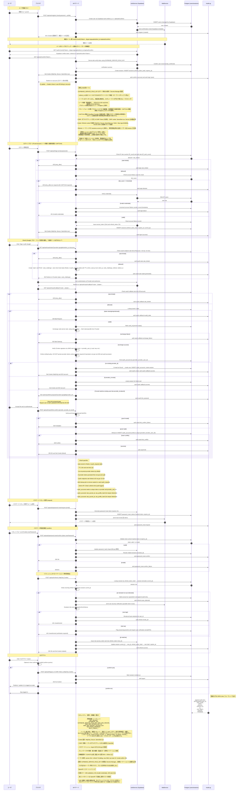

# 認証 (Auth) シーケンス図 — Mermaid

以下は `docs/specs/01_auth.md` の主要フローと運用・非機能要件を網羅した Mermaid シーケンス図です。

```mermaid
sequenceDiagram
    autonumber
    participant User as ユーザ
    participant Browser as ブラウザ
    participant API as API サーバ
    participant Auth as AuthService (Supabase)
    participant Mail as MailService
    participant DB as Postgres (users/sessions)
    participant Audit as AuditLog

    Note over User,Browser: ユーザ登録フロー
    User->>Browser: 登録フォーム入力
    Browser->>API: POST /api/auth/register {email,password,...profile}
    API->>Auth: Create user via Supabase Auth (redirect_to => /api/auth/confirm)
    Auth->>DB: INSERT users (managed by Supabase)
    DB-->>Auth: user created
    Auth->>Mail: send confirmation email (Supabase template)
    API->>Audit: auth.register (created)
    API-->>Browser: 201 Created (登録完了。確認メールを送信)

    Note over Mail,User: 確認メール (例: /auth/v1/verify?token=...&type=signup&redirect_to=/api/auth/confirm)
    Mail-->>User: 確認メール送信

    Note over User,Auth: メール内リンクをクリック -> 自動ログイン（サーバ側確認）
    User->>Auth: GET /auth/v1/verify?token=...&type=signup&redirect_to=/api/auth/confirm
    Auth-->>User: Supabase verifies token, redirects to /api/auth/confirm?token=...
    User->>API: GET /api/auth/confirm?token=...
    API->>Auth: Server-side verify token using SUPABASE_SERVICE_ROLE_KEY
    Auth->>DB: Confirm user record (email_confirmed)
    Auth-->>API: verification success
    API->>DB: Create session / INSERT sessions (refresh_token_hash, expires_at)
    API->>Browser: Set-Cookie (HttpOnly, Secure, SameSite=Lax)
    API->>Audit: auth.confirm (success) and auth.login (auto)
    API-->>Browser: Redirect to /account (ログイン済み状態)
    Note right of Browser: UI update — Header shows ri-user-fill linking to /account

    Note right of API: 運用上の必須ルール:
    Note right of API: - SUPABASE_SERVICE_ROLE_KEY はサーバ側のみ保持（Secrets Manager 推奨）
    Note right of API: - redirect_to は自ドメインのパスのみをホワイトリストで検証（オープンリダイレクト防止）
    Note right of API: - トークンはワンタイム化し、検証後は無効化。ログにトークンを平文で残さない（マスキング）
    Note right of API: - レート制限（実装要件）: 一般 API IP=100 req/10min、<br>認証系 IP=50 req/10min、<br>アカウント失敗は別途カウント（Postgres に保存）
    Note right of API: - ブルートフォース対策: アカウントとIP の二軸制御、失敗閾値で段階的遅延・CAPTCHA 発動<br>（実装: Postgres にカウンタを保持）。
    Note right of API: - CAPTCHA 実装: Cloudflare Turnstile を優先採用。登録/パスワード再設定は常時表示、<br>ログインは連続失敗や異常検出時の適応型で表示する。
    Note right of API: - CSRF: ダブルサブミット方式 (X-CSRF-Token) を採用。CSRF cookie: SameSite=Lax, Secure は本番必須
    Note right of API: - Cookie: Refresh cookie を推奨 (HttpOnly, Secure, SameSite=Lax, Path=/, Max-Age=604800)。<br>Access token は短期メモリで管理
    Note right of API: - Refresh トークン: JTI を sessions.current_jti に保存し、再利用検出時は当該ユーザーの全 session を失効
    Note right of API: - 同時セッション: On(デフォルト有効), 上限 5。<br>超過時は最古を削除するローテーション方式。<br>管理画面で有効/無効、上限値の変更を可能にする。
    Note right of API: - 監査ログ: 認証イベントは 1 年保持、管理操作は 3〜7 年。<br>IP はハッシュ化/マスク、RBAC によるアクセス制御を必須化

    Note over User,API: ログインフロー (IP and Account レート制御 / 段階的遅延 / CAPTCHA)
    User->>Browser: ログイン情報送信
    Browser->>API: POST /api/auth/login {email,password}
    API->>DB: Check IP rate counter (IP_count) and auth-rate (IP_auth_count)
    DB-->>API: allowed / rate_limited
    alt rate limited
        API->>Browser: 429 {retry_after}
        API->>Audit: auth.login.rate_limited
    else allowed
        API->>DB: Check account failure count for email
        DB-->>API: fail_count
        alt fail_count >= threshold
            API->>Browser: 429 {retry_after} (or respond with CAPTCHA required)
            API->>Audit: auth.login.blocked
        else
            API->>Auth: Verify credentials
            Auth->>DB: SELECT users
            DB-->>Auth: user row
            alt invalid credentials
                API->>DB: Increment account failure counter, record timestamp
                API->>Audit: auth.login.failure
                API-->>Browser: 401 (invalid credentials)
            else valid
                API->>DB: Reset account failure counter
                Auth-->>API: Issue access_token (15m) and refresh_token (7d)
                API->>DB: INSERT sessions (refresh_token_hash, expires_at, current_jti)
                API->>Browser: Set-Cookie (HttpOnly, Secure, SameSite=Lax)
                API->>Audit: auth.login (success)
            end
        end
    end

    Note over User,API: OAuth (Google) フロー（リンク提案を優先、**自動マージは行わない**）
    User->>Browser: Click "Sign in with Google"
    Browser->>API: GET /api/auth/oauth/start?provider=google&redirect_to=/account
    API->>DB: Check oauth endpoint rate limit (IP/account - 50 req / 10 min)
    alt rate limited
        API->>Browser: 429 {retry_after}
        API->>Audit: auth.oauth.start.rate_limited
    else allowed
        API->>API: Create `state` and PKCE `code_challenge`, store short-lived state (Redis or oauth_requests table) with TTL (10m), used_at null, client_ip, code_challenge_method, redirect_to
        API->>Audit: auth.oauth.start (state generated)
        API-->>Browser: 302 Redirect to Provider (state, code_challenge)
    end
    Browser->>Auth: User authenticates at Provider and authorizes
    Auth-->>Browser: Redirect to /api/auth/oauth/callback?code=...&state=...
    Browser->>API: GET /api/auth/oauth/callback?code=...&state=...
    API->>DB: Check oauth callback rate limit (IP/account)
    alt rate limited
        API->>Browser: 429 {retry_after}
        API->>Audit: auth.oauth.callback.rate_limited
    else allowed
        API->>DB: Lookup stored `state`
        alt state missing/expired/used
            API->>Audit: auth.oauth.callback.invalid_state
            API->>Browser: 400 Bad Request
        else valid
            API->>DB: Mark used_at (prevent replay)
            API->>API: Exchange code (server-side, using code_verifier) → fetch tokens/profile from Provider
            alt exchange failure
                API->>Audit: auth.oauth.callback.exchange_failure
                API->>Browser: 502 Bad Gateway
            else exchange success
                API->>API: Verify ID token signature via JWKS and claims (sub == provider_user_id, aud, exp, etc.)
                API->>API: Enforce default policy: DO NOT persist provider tokens unless explicitly required (if persisted, encrypt via KMS and audit accesses)
                API->>DB: Find oauth_accounts by (provider, provider_user_id)
            end
            alt no existing provider_id
                API->>DB: if email not found → create user, INSERT oauth_accounts, create session
                API->>Audit: auth.oauth.create, auth.oauth.callback.success
                API->>Browser: Set-Cookie (HttpOnly) and 302 /account
            else if provider_id exists
                API->>DB: create session for linked user
                API->>Audit: auth.oauth.callback.success
                API->>Browser: Set-Cookie and 302 /account
            else if email matches existing user (but provider_id absent)
                API->>Browser: 302 /auth/oauth/link-proposal?provider=google&provider_id=...
                API->>Audit: auth.oauth.link_proposal
                Note right of Browser: Show link proposal page. <br>Require user re-auth: password OR email link OR 2FA
                User->>Browser: Accept link and re-authenticate
                Browser->>API: POST /api/auth/oauth/link-confirm {provider, provider_id, proof}
                API->>API: Verify proof (password/email link/2FA)
                alt proof invalid
                    API->>Audit: auth.oauth.link_confirm_failure
                    API->>Browser: 403 Forbidden
                else proof valid
                    API->>DB: Attempt to INSERT oauth_accounts (enforce unique (provider, provider_user_id))
                    alt insert conflict
                        API->>Audit: auth.oauth.link_conflict
                        API->>Browser: 409 Conflict
                    else success
                        API->>Audit: auth.oauth.link
                        API->>Browser: 200 OK and Set-Cookie (linked)
                    end
                end
            end
        end
    end
    Note right of API: OAuth specifics
    Note right of API: - state stored in Redis or oauth_requests table
    Note right of API: - TTL 10m and one-time use
    Note right of API: - do not persist provider tokens by default
    Note right of API: - if provider tokens persisted then encrypt and audit
    Note right of API: - oauth endpoints rate-limited at 50 req per 10 min
    Note right of API: - Add cleanup job to remove expired or used oauth_requests
    Note right of API: - Admin API: OAuth unlink/re-link (audit logged)
    Note right of API: - oauth_accounts needs a unique index on provider and provider_user_id
    Note right of API: - oauth_accounts: last_synced_at, raw_profile_hash (for tamper detection)
    Note right of API: - oauth_accounts: last_synced_at, raw_profile_hash (for tamper detection)

    Note over User,API: パスワードリセット要求 (request)
    User->>Browser: パスワードリセット要求フォーム送信
    Browser->>API: POST /api/auth/password-reset/request {email}
    API->>Auth: Generate password reset token (expires 1h)
    API->>DB: INSERT password_reset_tokens (hashed token, expires_at)
    API->>Mail: send reset email (含 token)
    Mail-->>User: パスワード再設定メール送信
    API->>Audit: auth.password_reset.request

    Note over User,API: パスワード再設定確定 (confirm)
    User->>Browser: リセットフォーム入力 (token,newPassword)
    Browser->>API: POST /api/auth/password-reset/confirm {token,newPassword}
    API->>DB: Validate token (check hashed token & expires_at)
    DB-->>API: token valid / or invalid
    alt valid
        API->>Auth: Update password_hash (Argon2/Bcrypt 推奨)
        API->>DB: Revoke related sessions (revoked_at)
        API->>Audit: auth.password_reset.confirm
        API-->>Browser: 200 OK
    else invalid
        API->>Audit: auth.password_reset.confirm_failure
        API-->>Browser: 400/401
    end

    Note over Browser,API: リフレッシュ (JTI ローテーション / 再利用検出)
    Browser->>API: POST /api/auth/refresh (HttpOnly Cookie)
    API->>DB: Lookup session by refresh_token_hash → session (includes current_jti)
    DB-->>API: session row
    API->>API: Verify incoming refresh JTI matches session.current_jti
    alt jti mismatch (re-use detected)
        API->>DB: Mark account as 'quarantine' and append audit entry
        API->>Audit: auth.refresh.reuse_detected
        API->>Mail: send user security notification (possible token reuse)
        API->>API: Evaluate risk score (IP/location/time/history)
        alt risk high
            API->>DB: Revoke all user sessions for user_id
            API->>Audit: auth.refresh.revoke_all
            API-->>Browser: 401 Unauthorized
        else risk low
            API->>DB: Flag session/quarantine and require user verification (email/2FA)
            API-->>Browser: 401 Unauthorized (verification required)
        end
    else jti matches
        API->>Auth: Issue new access_token and new refresh_token (new_jti)
        API->>DB: Update session current_jti → new_jti, refresh_token_hash → new hash, expires_at
        API->>Audit: auth.refresh.success
        API-->>Browser: 200 OK and Set-Cookie (rotated)
    end

    Note over User,API: ログアウト
    User->>Browser: Click "ログアウト" button
    Browser->>Browser: Optional: show confirmation modal (confirm=yes/no)
    alt confirm=yes
        Browser->>API: POST /api/auth/logout { X-CSRF-Token } (HttpOnly Cookie)
        API->>DB: Mark session revoked_at
        API->>Audit: auth.logout
        API-->>Browser: 204 No Content
        Browser->>User: Redirect / update UI to logged-out state
    else confirm=no
        Browser->>User: Stay logged in
    end

    Note right of Audit: 監査ログは JSON Lines フォーマットで出力
    Audit-->>DB: append audit entry  <br> {id,timestamp,actor_id,<br>actor_email,<br>action,<br>resource,<br>resource_id,<br>ip,<br>user_agent,<br>outcome,<br>metadata}

    Note right of API: セキュリティ・運用・非機能（要点）
    Note right of API: - 環境変数 / シークレット:<br>JWT_SECRET, <br>SUPABASE_URL, <br>SUPABASE_SERVICE_ROLE_KEY, AWS_SES_REGION, <br>AWS_SES_ACCESS_KEY_ID, <br>AWS_SES_SECRET_ACCESS_KEY, <br>SES_FROM_ADDRESS, <br>NEXT_PUBLIC_*
    Note right of API: - トークン取り扱い（確認/リセット）: 受信した `token` はサーバ側で即時検証・消費し、<br>Set-Cookie 発行後にクリーンな URL へ 302/303 リダイレクトしてクエリにトークンを残さない。<br>レスポンスには `Cache-Control: no-store` と `Referrer-Policy: no-referrer` を付与し、<br>トークンはログに保存しない（マスキング）ことを必須化する。
    Note right of API: - Cookie 設計: HttpOnly, Secure, SameSite=Lax
    Note right of API: - CSRF: 同期トークン/ダブルサブミットまたは適切な SameSite
    Note right of API: - パスワードハッシュ: Argon2 または Bcrypt を推奨
    Note right of API: - ネットワーク/IP 制限・最小権限・監査ログ・即時ローテーション体制
    Note right of API: - 非機能要件: TLS/HSTS 必須, 認証 API 応答 95% < 200ms など
    Note right of API: - トークン寿命: access 15m / refresh 7d (sliding, max 30d) / pw-reset 1h / email-confirm 24h
    Note right of API: - 運用: SUPABASE_SERVICE_ROLE_KEY の保管は Secrets Manager。定期ローテーションと自動化必須
    Note right of API: - ログ出力はトークン等をマスク。クエリ文字列をそのまま保存しない

    Note right of API: OpenAPI / エラーハンドリング
    Note right of API: - 共通エラー: 400 (validation), 401 (invalid credentials), 429 (rate limit)
    Note right of API: - 各エンドポイントは OpenAPI で定義し契約テストを推奨
    Note right of API: - E2E 自動化: 本番公開前必須。今スプリントで CI スモークテストを導入し、<br>次スプリントでメールリンク等を含む主要フローの自動 E2E を追加する。

```