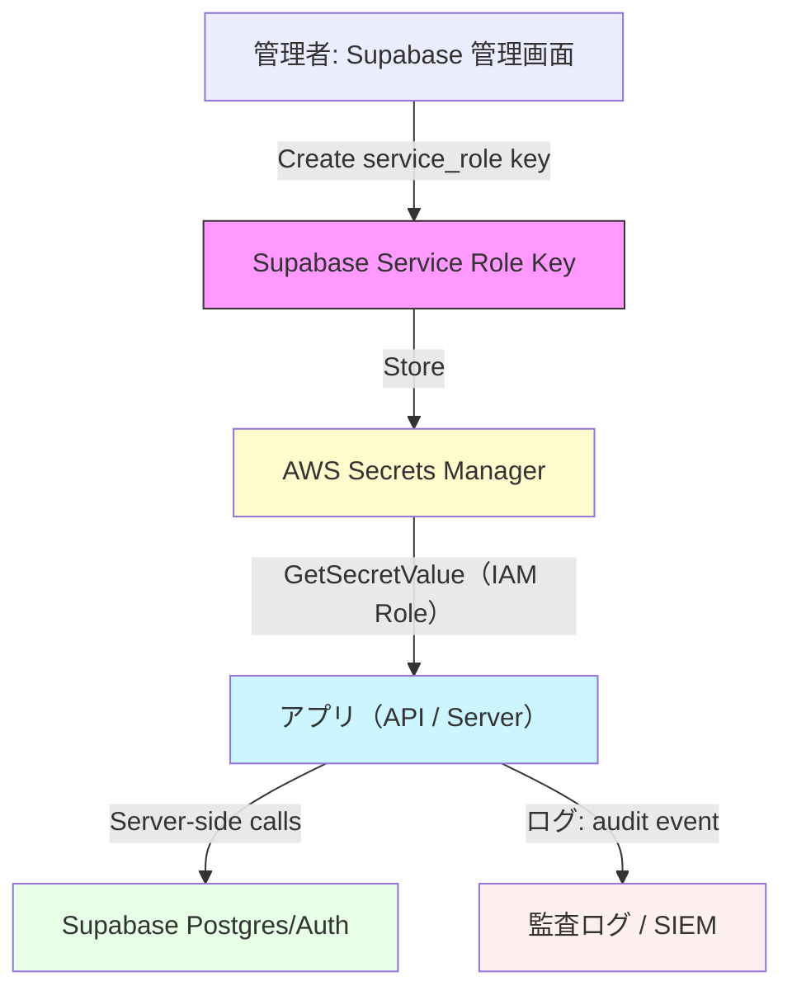
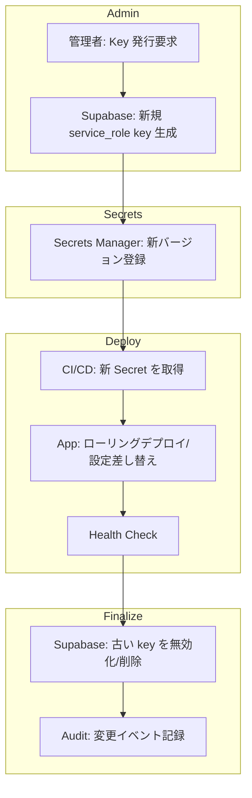
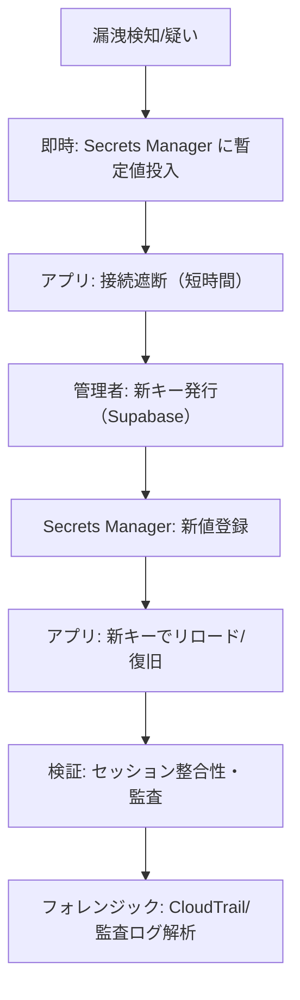
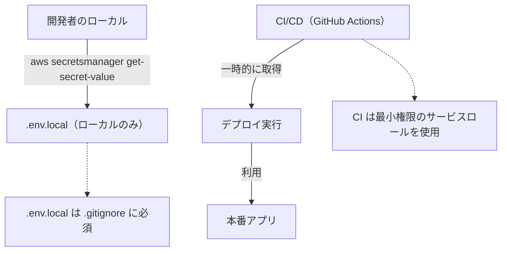
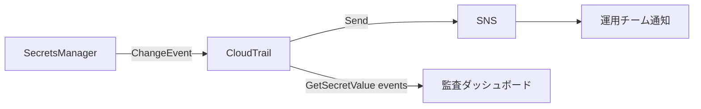

# SUPABASE_SERVICE_ROLE_KEY — 運用フロー図

このファイルは `SUPABASE_SERVICE_ROLE_KEY` の日常運用・ローテーション・緊急対応をイメージできる Mermaid 図を収めた Markdown ドキュメントです。

注: Markdown Preview Enhanced (MPE) で表示する場合、Mermaid のコードフェンスは次の形式で記述してください: \`\`\`mermaid

---

## 1) 秘密作成と利用フロー

---

## 2) 正常ローテーションフロー

---

## 3) 緊急ローテーション（漏洩疑い）

---

## 4) 開発 / CI の扱い

---

## 5) 監査・アラート設計

---

## ファイル場所
- `docs/seq/supabase-service-role-key-rotation-diagrams.md`

---

## 備考
- MPE (Markdown Preview Enhanced) はコードフェンスで `mermaid` をサポートしています。上記ファイルは MPE で読み込んで表示してください。
- 図の色やノードは運用チームの好みに合わせて調整可能です。
