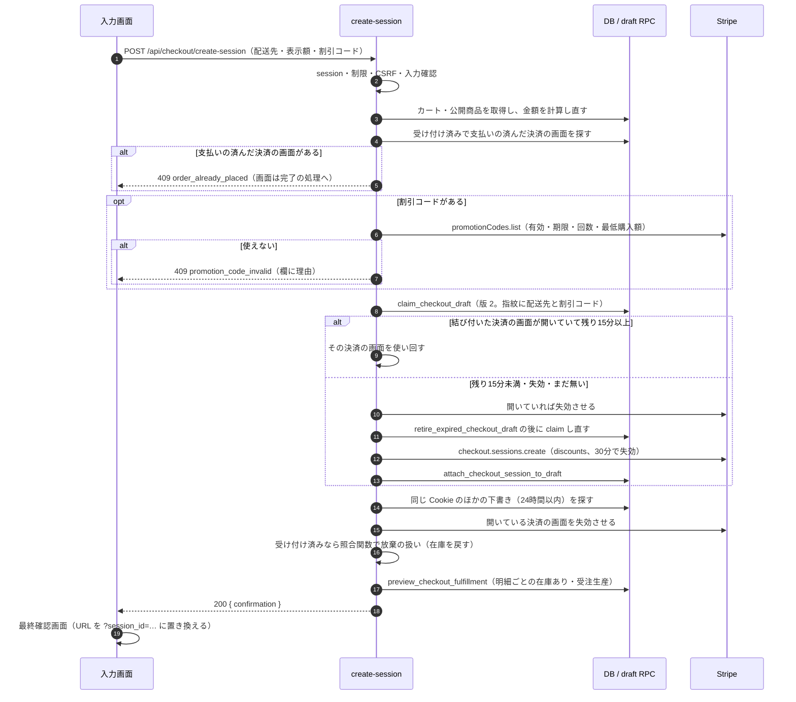
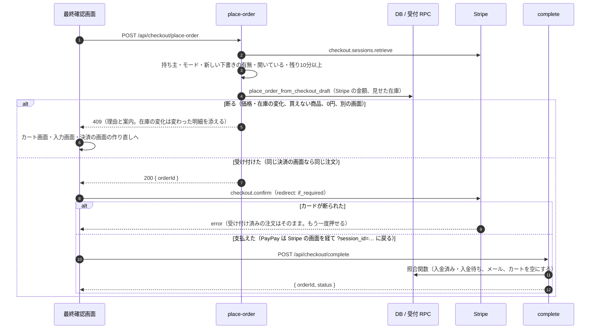
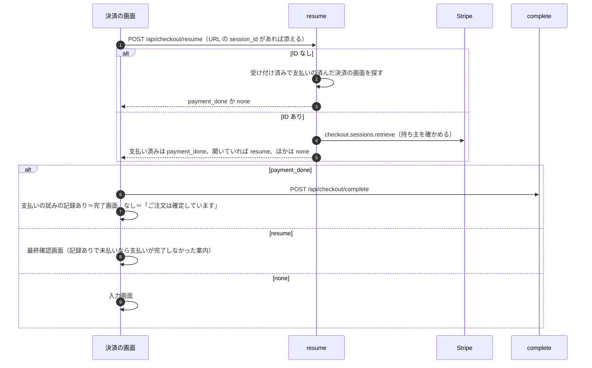
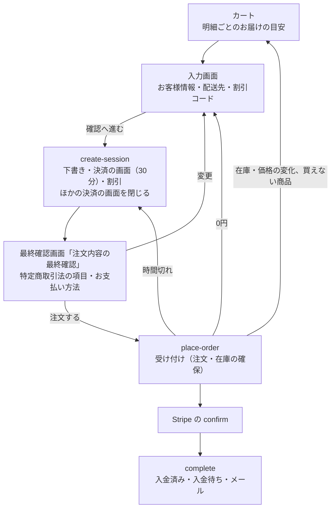

# 支払いを「注文する」で行う（グループ F）実装計画

> 2026-10-08追記（FREQ-428〜432）: 本計画の `source_cart_id` は、移行前の下書きの写し・旧コード、またはその置き換え対象を説明するために残す過去の記録。現行の下書きの明細参照は `source_cart_line_id`（`cart_lines.id`）、所有カートは `checkout_drafts.cart_id`。実装時の契約は [カートとお気に入りの引き継ぎ設計](../specs/2026-10-08-cart-wishlist-carryover-design.md)を参照する。

> **For agentic workers:** REQUIRED SUB-SKILL: Use superpowers:subagent-driven-development (recommended) or superpowers:executing-plans to implement this plan task-by-task. Steps use checkbox (`- [ ]`) syntax for tracking.

**Goal:** 支払いを最終確認画面の「注文する」に移す。「確認へ進む」でサーバーが下書きから決済の画面（Stripe の Checkout Session）を作り、「注文する」でサーバーが注文を受け付けて在庫を確保し、その場で支払う。確認画面での戻る・読み込み直し・入り直しで二重に払えないようにし、在庫の変化はお金が動く前に示す。

**Architecture:** DB に明細ごとのお届けの目安を返す関数を足し、受付 RPC に「最終確認画面で在庫ありと見せたバリアント」の引数を足す（見せた後の変化は理由コードで断る）。サーバーには割引コードの確かめ、受け付け、入り直しの3つの入口を足し、「確認へ進む」の入口（create-session）は割引をサーバーで付け、前の決済の画面を閉じ、最終確認画面に要るものを返す。画面は、入力画面から Stripe の部品を外し、最終確認画面の部品（Stripe の入力部品・特定商取引法の項目・「注文する」）を別のファイルにする。

**Tech Stack:** Next.js 16 App Router、TypeScript、React 19、Supabase（Postgres 17、SECURITY DEFINER RPC）、Stripe（stripe 20.4.1、API `2026-02-25.clover`、Checkout Sessions の `ui_mode: "custom"`、`@stripe/react-stripe-js/checkout` の `CheckoutProvider`・`PaymentElement`・`useCheckout`）、Jest（ts-jest・Testing Library）＋`pg`、Playwright

**Spec:** [docs/superpowers/specs/2026-10-07-checkout-place-order-payment-design.md](../specs/2026-10-07-checkout-place-order-payment-design.md)（ユーザー承認 2026-10-07）

## Global Constraints

- 画面の流れ: 入力画面（お客様情報・配送先・割引コード）→「確認へ進む」→ 最終確認画面（表題「注文内容の最終確認」）→「注文する」。入力画面に Stripe の部品（`CheckoutProvider`・`PaymentElement`）を置かない。決済の画面はページを開いた時ではなく「確認へ進む」で作る
- 決済の画面は作成から30分で失効する（今の `reserve_checkout_session_expiry` の30分30秒のまま）。受け付けは残り10分以上のときだけ（`ACCEPT_MIN_REMAINING_SECONDS = 600`）。「確認へ進む」で開いている決済の画面を使い回すのは残り15分以上のときだけ（`REUSE_MIN_REMAINING_SECONDS = 900`。本計画の決め事 D4）
- 割引は「確認へ進む」でサーバーが `discounts: [{ promotion_code }]` で付ける。`allow_promotion_codes` は使わない。最終確認画面では割引コードを変えられない
- 受付 RPC `place_order_from_checkout_draft` に `_shown_in_stock_variant_ids bigint[] DEFAULT NULL` を足す。NULL（照合の見回りの予備処理）は今までどおり。配列（受け付けの窓口）のときだけ `price_changed`・`stock_changed` で断る。関数は `SECURITY DEFINER`＋`SET search_path = ''`＋完全修飾名、`PUBLIC`・`anon`・`authenticated` から EXECUTE を剥がし `service_role` だけに与える。移行は `BEGIN;`〜`COMMIT;` で囲み、冪等に書く
- 在庫の決め方は明細ごと・同じバリアントの数量の合計で比べる（グループ A の受付 RPC の `covered` と同じ）。足りれば `stock`（在庫あり）、足りなければ `backorder`（受注生産）
- 画面の文言（設計書のとおり。一字も変えない）:
  - 表題: `注文内容の最終確認`／申し込みのボタン: `注文する`
  - 支払いの時期: カード `ご注文時にお支払いが確定します`／PayPay `ご注文時に PayPay の画面でお支払いが確定します`／コンビニ `ご注文から7日以内に、発行される払込番号でお支払いください。期限までにお支払いが確認できないときは、ご注文をキャンセルします`
  - 引渡しの時期（最終確認画面）: 在庫あり `ご注文（コンビニはご入金）の確認後、3〜7営業日で発送`／受注生産 `発送まで数週間〜2か月以上（目安）`
  - お届けの目安（カート）: `在庫あり・3〜7営業日で発送`／`受注生産・数週間〜2か月以上`
  - 返品: `ご注文後のお客様都合による返品・交換・キャンセルはお受けできません。初期不良・誤送は、商品到着後7日以内にご連絡ください。詳しくは特定商取引法の表記をご覧ください`（`/legal` への案内つき）
  - 在庫の変化（カートの上）: `在庫の状況が変わりました。次の商品は受注生産になります（発送まで数週間〜2か月以上）`／行の印: `在庫あり → 受注生産`
  - 断る理由: `ご注文いただけない商品が含まれています`・`商品の価格が変わりました。内容をご確認ください`・`このご注文は合計が0円になるため、お受けできません`・`時間がたったため、お支払い情報をもう一度入力してください`・`別の画面で手続きが進んでいます。画面を読み込み直してください`
  - 割引コード: `このコードでは合計が0円になるため使えません`（ほかの理由は本計画の決め事 D6）
  - PayPay を取りやめて戻った: `PayPay でのお支払いが完了しませんでした`
  - 支払いの後の入り直し: `ご注文は確定しています`
- 新しい入口（`/api/checkout/promotion-code`・`/api/checkout/place-order`・`/api/checkout/resume`）は、`session_id` Cookie の持ち主の下書き・決済の画面だけを扱い、`requireCsrfOrDeny`（ログイン客）と IP・セッション単位の回数の制限を通す。送信元の確かめは `src/proxy.ts`（除外リスト方式）が全 POST に掛けるので、入口側では足さない。監査ログには理由の記号だけを残し、お客様の名前・住所・メールアドレス・カードの情報を残さない
- モードは `stripeKeyLivemode(process.env.STRIPE_SECRET_KEY)`（`src/lib/stripe/handled-webhook-events.ts`）で決める
- 画面と機能の変更は、実装と同じタスクで `docs/02_Requirements/requirements.md` に FREQ 行を足す。番号は `grep -oE "FREQ-[0-9]+" docs/02_Requirements/requirements.md | sort -t- -k2 -n | tail -1` の次（本計画の FREQ-417〜421 は目安）。E2E の番号も `ls e2e | grep FR-CHECKOUT- | sort -V | tail -1` と `ls e2e | grep FR-CART- | sort -V | tail -1` で確かめる（本計画の FR-CHECKOUT-036〜040・FR-CART-022 は目安）
- E2E は本番ビルド（`next build && next start`）・手元の Supabase（`npm run db:start`・`npx supabase db reset`）で、mobile（390px）・tablet（768px）・desktop（1280px）の3つの画面幅で流す。流す前に3000番に何も無いことを `Get-NetTCPConnection -LocalPort 3000 -State Listen -ErrorAction SilentlyContinue` で確かめる
- DB 結合テストは、`npx supabase db reset` の後に、フォルダ全体を `--runInBand` で流す（`npx jest tests/integration/db --runInBand`）
- 本番 DB へは、Task 16 の後、ユーザーの push の後で許可を得て Supabase MCP の `apply_migration` で当てる。当てた後、ファイル名を本番の台帳の version に直す（`docs/06_Operations/db-migrations.md`）。`supabase/pending/` は触らない
- 実装は Codex（`--model gpt-6.1-sol`、コミットしない）。controller がタスクのファイルだけを名指しでコミットし、レビューは Opus。master に直接コミットし、push しない。`--no-verify` を使わない。コミットメッセージは日本語の Conventional Commits、末尾に `Co-Authored-By: Claude Opus 5.5 <noreply@anthropic.com>`
- 返答・文書・コメントは日本語。コードのコメントは周りに合わせる（理由を書く。何をしているかの繰り返しは書かない）

## Review Focus

本計画のタスクのテストで直接は確かめていないが、使う人が最も踏みやすい入力と状態。各行のテストは括弧内のタスクに足してある。

1. **「注文する」を続けて2回押す・処理中にもう一度押す**: ボタンは処理中に押せず、受け付けは同じ決済の画面なら同じ注文を返す（Task 10 の「処理中は注文するを押せない」、Task 7 の「同じ決済の画面の2回目は同じ注文を返す」）
2. **PayPay の画面で取りやめて当店に戻る**: 最終確認画面に戻り、`PayPay でのお支払いが完了しませんでした` が出て、もう一度選べる（Task 11 の「PayPay から取りやめて戻ると最終確認画面に案内が出る」）
3. **最終確認画面で長く放置してから「注文する」を押す**: 決済の画面を作り直し、`時間がたったため、お支払い情報をもう一度入力してください` を出す。前の受け付けは放棄の扱いになる（Task 7 の「残り10分未満なら決済の画面を閉じて照合し…」、Task 11 の「受け付けで時間切れを断られたら、決済の画面を作り直して案内を出す」、Task 12 の FR-CHECKOUT-040）
4. **割引コードを適用した後にカートを減らし、最低購入額を下回ってから「確認へ進む」**: 決済の画面を作らず、割引コードの欄に理由が出る（Task 6 の「確認へ進むで割引コードが使えなくなっていれば 409」、Task 11 の「確認へ進むで割引コードが断られたら欄に理由を出す」）
5. **支払いの後に、完了画面を読み込み直す・最終確認画面の URL を開き直す**: 支払いの入力欄は出ず、`ご注文は確定しています` と注文番号・状態が出る（Task 11 の「支払いの後に入り直すと…」、Task 12 の FR-CHECKOUT-040）

---

## 本計画の決め事（設計書の書いていないところ）

設計書が決めていない実装の細部を、次のとおり決めた。レビューはこれも基準にする。

| ID | 決め事 | 理由 |
|---|---|---|
| D1 | 受付 RPC の新しい引数の既定は `NULL`。NULL は「引数が無い」（見回り）、配列は「受け付けの窓口から」。空の配列でも価格の変化は確かめる | 設計書 6-2 の「既定は空」を「渡さない」と読む。空の配列（在庫ありの明細が無い）と区別できる |
| D2 | 「価格が変わった」（設計書 6-3）は受付 RPC が `price_changed` で返す。下書きの写しの単価と今の商品の価格を比べる。引数が NULL のときは確かめない | 商品の行のロックの後に同じ取引の中で確かめられる。お金が動いた後（見回り）は注文を作るのが先 |
| D3 | 明細ごとのお届けの目安は、新しい関数 `preview_checkout_fulfillment(jsonb)` が受付 RPC と同じ規則で返す。カート・「確認へ進む」・入り直し・受け付けで断ったときの案内がこれを使う | 規則を1か所に置く。在庫の数はお客様のブラウザに出さない |
| D4 | 「確認へ進む」の要求の版を 2 に上げ、要求の指紋に割引コードと配送先を含める。入力が同じなら同じ下書き・同じ決済の画面を返す（残り15分以上のとき）。入力が変われば新しい下書き・決済の画面を作る。旧版（v0）の下書きの使い回しの経路と、配送先の後からの同期（`/api/checkout/update-shipping`）は消す | 決済の画面は「確認へ進む」の時点の入力の写しになる。旧版の決済の画面はブラウザから割引コードを付けられるので使い回さない。使い回した画面で受け付けられる時間（残り10分）を確保する |
| D5 | 前の決済の画面を閉じる対象は、同じ Cookie のセッションの、24時間以内の、作成中または受け付け済みの下書きの決済の画面（新しいものから10件）。閉じたのが受け付け済みの下書きなら、その場で照合関数を呼んで放棄の扱いにする（失敗しても Stripe の知らせと見回りが仕上げる）。作成中の下書きは退役させる | 設計書 2-2・8。在庫をすぐ戻す。閉じた後に同じ画面を何度も Stripe に問い合わせない |
| D6 | 割引コードの確かめの理由と文言: 見つからない・止まっている・顧客や初回限定の条件つき・商品の限定つき・円で使えない → `このコードは使えません`、期限切れ → `このコードは有効期限が切れています`、回数の上限 → `このコードは利用回数の上限に達しています`、最低購入額 → `このコードは ¥{金額} 以上のご注文で使えます`、0円 → `このコードでは合計が0円になるため使えません` | 顧客を作らないので、顧客の条件は確かめられない（H で自前の確かめを足す）。その場で作る商品には商品の限定が当たらない |
| D7 | 入力画面の割引後の金額は、定額は `min(定額, 合計)`、定率は `Math.round(合計 × 率 / 100)` で計算する。最終確認画面は Stripe の金額を出し、こちらが最終 | 設計書第3章。端数の扱いが Stripe と1円ずれても、最終確認画面で正しい金額を見てから申し込む |
| D8 | 最終確認画面に出す明細・配送先・割引コードは、サーバーが下書きと決済の画面から返す（`CheckoutConfirmation`）。カートの中身は使わない。割引コードの文字は決済の画面の metadata `promotion_code` に残す | 申し込む内容＝決済の画面の中身を見せる。入り直しでも同じものを出せる |
| D9 | 最終確認画面と完了画面の URL を `/checkout?session_id=<決済の画面の ID>` にする（Stripe の戻り先と同じ形。履歴を増やさないよう置き換える）。この URL を開くと入り直しの入口が状態を返し、開いていれば最終確認画面、支払い済みなら完了の処理、失効なら入力画面にする。URL に ID が無くても、受け付け済みで支払いが済んだ決済の画面があれば完了の処理をする | 設計書 2-5。読み込み直し・PayPay の戻り・戻るの操作を1つの入口で扱う |
| D10 | 「注文する」の直前に `sessionStorage` に支払いの試み（決済の画面の ID と選んだ方法）を残し、画面の中で `confirm` が終われば消す。戻ってきたときに残っていれば、支払い済みなら通常の完了画面、未払いなら「PayPay でのお支払いが完了しませんでした」（PayPay 以外は `お支払いが完了しませんでした。もう一度お試しください`）。残っていなければ、支払い済みは `ご注文は確定しています` の画面 | 戻り先が「支払った直後」か「後からの入り直し」かを分ける |
| D11 | 受け付けで断ったときにカート画面へ渡す内容は `sessionStorage` の `checkout:cart-notice` に入れ、カート画面が1回だけ読んで消す | 在庫の変化の案内（変わった明細）をカート画面に渡す。URL に商品名を載せない |
| D12 | 断る理由の `amount_mismatch`・`currency_mismatch` は「価格が変わった」、`draft_not_found` は「別の画面で手続きが進んでいます」として案内する | どれもお金は動いていない。下書きと決済の画面が合わないのは、別のタブで作り直された場合だけ |
| D13 | 完了画面の注文番号は `toOrderNumber`（`ORD-XXXXXXXX`）で出し、状態（`入金済み`／`お支払い待ち`）を足す | 設計書 2-5 の「注文番号と状態」。メールと同じ番号にする |
| D14 | 完了画面の「配送について」の文言を、最終確認画面の引渡しの時期（在庫あり3〜7営業日・受注生産 数週間〜2か月以上）に合わせる | 今の「2-5営業日以内に発送」は、申し込みの直前に見せた引渡しの時期と食い違う |

---

## File Structure

| ファイル | 責務 |
|---|---|
| `supabase/migrations/20261008000000_checkout_final_screen_place_order.sql`（新規） | お届けの目安の関数、受付 RPC の作り直し（D1〜D3） |
| `src/lib/orders/order-payment-types.ts` | 受付 RPC の理由コードに `stock_changed`・`price_changed` を足す |
| `src/features/checkout/services/checkout-fulfillment.service.ts`（新規） | お届けの目安の関数の呼び出し |
| `src/features/checkout/utils/fulfillment-labels.ts`（新規） | お届けの目安の文言（カート・最終確認画面） |
| `src/features/checkout/services/promotion-code.service.ts`（新規） | 割引コードの確かめと割引後の金額（D6・D7） |
| `src/features/checkout/services/checkout-route-guard.ts`（新規） | 新しい入口の共通の守り（Cookie・回数の制限・CSRF） |
| `src/features/checkout/services/checkout-cart.service.ts`（新規） | カートとサーバーの金額の読み出し（割引コードの入口が使う） |
| `src/features/checkout/services/checkout-confirmation.service.ts`（新規） | 最終確認画面に渡す内容（D8） |
| `src/features/checkout/services/checkout-session-lifecycle.service.ts`（新規） | 支払い済みの決済の画面を探す（D9）、前の決済の画面を閉じる（D5） |
| `src/app/api/checkout/promotion-code/route.ts`（新規） | 割引コードの「適用」 |
| `src/app/api/checkout/create-session/route.ts` | 「確認へ進む」（D4・D5・割引・最終確認画面の内容） |
| `src/app/api/checkout/place-order/route.ts`（新規） | 「注文する」の受け付け（設計書第6章） |
| `src/app/api/checkout/resume/route.ts`（新規） | 入り直し（D9） |
| `src/app/api/checkout/update-shipping/route.ts`（削除） | D4 で使わなくなる |
| `src/app/api/cart/route.ts`・`src/app/api/cart/[id]/route.ts` | カートの明細にお届けの目安を足す |
| `src/features/checkout/utils/cart-notice.ts`（新規） | カート画面への案内の受け渡し（D11） |
| `src/app/cart/page.tsx`・`src/app/cart/_components/CartItemRow.tsx`・`src/app/cart/_hooks/useCartItems.ts` | お届けの目安、在庫の変化の案内と行の印 |
| `src/app/checkout/_lib/checkout-api.ts`（新規） | 画面から呼ぶ入口の型と呼び出し |
| `src/app/checkout/_lib/payment-attempt.ts`（新規） | 支払いの試みの記録（D10） |
| `src/app/checkout/_components/PromoCodeField.tsx`（新規） | 入力画面の割引コード |
| `src/app/checkout/_components/FinalConfirmationStep.tsx`（新規） | 最終確認画面（Stripe の部品・特定商取引法の項目・「注文する」） |
| `src/app/checkout/page.tsx` | 入力画面・画面の切り替え・入り直し・完了画面 |
| `src/lib/orders/order-confirmation-email.ts` | 確定メールの明細に、受け付けで決まったお届けの目安を添える（設計書 5-3） |
| `e2e/checkout-flow-helpers.ts`（新規）、`e2e/FR-CHECKOUT-036`〜`040`（新規）、`e2e/FR-CART-022`（新規）、古い流れの決済の E2E | 新しい流れの E2E と、古い流れの E2E の書き直し |
| `docs/02_Requirements/requirements.md`、`docs/04_DetailDesign/pages/13_checkout.md` ほか | FREQ-417〜421、置き換えた FREQ の注記、詳細設計・API の一覧・レビュー台帳 |

---
### Task 1: お届けの目安の関数と、受付 RPC の作り直し（DB）

設計書 5-1・5-3・6-2、決め事 D1〜D3。

**Files:**
- Create: `supabase/migrations/20261008000000_checkout_final_screen_place_order.sql`
- Create: `tests/integration/db/place_order_shown_stock.integration.test.ts`
- Modify: `src/lib/orders/order-payment-types.ts`（`PLACE_ORDER_REJECTIONS`）

**Interfaces:**
- Consumes: `public.resolve_checkout_item_variants(jsonb)`（`20260921035818_wire_variant_stock_on_order.sql`）、今の受付 RPC（`20260927100300_place_order_from_checkout_draft.sql`）
- Produces（DB）:
  - `public.preview_checkout_fulfillment(_items_snapshot jsonb) RETURNS TABLE (line_no integer, item_id bigint, color text, size text, quantity integer, variant_id bigint, fulfillment text)`。`fulfillment` は `'stock'` か `'backorder'`。`line_no` は渡した配列の順（1始まり）。`service_role` だけが実行できる
  - `public.place_order_from_checkout_draft(_draft_id uuid, _checkout_session_id text, _cart_session_id text, _stripe_amount_total integer, _stripe_amount_discount integer, _stripe_currency text, _checkout_session_created_at timestamptz, _payment_intent_id text DEFAULT NULL, _shown_in_stock_variant_ids bigint[] DEFAULT NULL) RETURNS TABLE (order_id uuid, order_status public.order_status, created boolean, rejection text)`。理由コードに `'price_changed'`・`'stock_changed'` が増える
- Produces（TS）: `PLACE_ORDER_REJECTIONS` に `'price_changed'`・`'stock_changed'`

- [ ] **Step 1: DB 結合テストを書く**

`tests/integration/db/place_order_shown_stock.integration.test.ts` を作る:

```ts
/** @jest-environment node */
import { describeLocalDb, type PgClient } from './helpers/local-db';
import {
  PRICE,
  createCatalogFixture,
  createDraft,
  movementsOf,
  variantStock,
} from './helpers/order-fixtures';

/**
 * 最終確認画面の「注文する」の受け付け（グループ F 設計書 5-3・6-2、計画の決め事 D1〜D3）。
 * 在庫ありと見せたバリアントが受注生産に変わっていれば、注文も在庫の確保も作らずに stock_changed を返す。
 * 引数を渡さない呼び出し（照合の見回りの予備処理）は今までどおり注文を作る。
 */
jest.setTimeout(30000);

const SESSION_CREATED_AT = '2026-10-08T01:00:00.000Z';

type DraftRef = { draftId: string; checkoutSessionId: string; cartSessionId: string; totalAmount: number };

function placeWithShown(db: PgClient, draft: DraftRef, shownInStockVariantIds: number[]) {
  return db.query(
    `select order_id, order_status::text as order_status, created, rejection
     from public.place_order_from_checkout_draft(
       _draft_id => $1::uuid,
       _checkout_session_id => $2::text,
       _cart_session_id => $3::text,
       _stripe_amount_total => $4::integer,
       _stripe_amount_discount => 0,
       _stripe_currency => 'jpy',
       _checkout_session_created_at => $5::timestamptz,
       _payment_intent_id => null,
       _shown_in_stock_variant_ids => $6::bigint[])`,
    [draft.draftId, draft.checkoutSessionId, draft.cartSessionId, draft.totalAmount, SESSION_CREATED_AT, shownInStockVariantIds],
  );
}

/** 引数を8つだけ渡す今の呼び出し方（照合の見回りの予備処理と同じ） */
function placeWithoutShown(db: PgClient, draft: DraftRef) {
  return db.query(
    `select order_id, order_status::text as order_status, created, rejection
     from public.place_order_from_checkout_draft(
       $1::uuid, $2::text, $3::text, $4::integer, 0, 'jpy', $5::timestamptz, null::text)`,
    [draft.draftId, draft.checkoutSessionId, draft.cartSessionId, draft.totalAmount, SESSION_CREATED_AT],
  );
}

async function orderCount(db: PgClient, checkoutSessionId: string): Promise<number> {
  const res = await db.query('select count(*)::int as n from public.orders where checkout_session_id = $1', [
    checkoutSessionId,
  ]);
  return res.rows[0].n;
}

async function draftStatus(db: PgClient, draftId: string): Promise<string> {
  const res = await db.query('select status from public.checkout_drafts where id = $1', [draftId]);
  return res.rows[0].status;
}

async function fulfillmentTypes(db: PgClient, orderId: string): Promise<string[]> {
  const res = await db.query(
    'select fulfillment_type from public.order_items where order_id = $1 order by fulfillment_type',
    [orderId],
  );
  return res.rows.map((row: { fulfillment_type: string }) => row.fulfillment_type);
}

function preview(db: PgClient, lines: Array<Record<string, unknown>>) {
  return db.query(
    `select line_no, item_id, color, size, quantity, variant_id, fulfillment
     from public.preview_checkout_fulfillment($1::jsonb)`,
    [JSON.stringify(lines)],
  );
}

describeLocalDb('integration: お届けの目安の関数', (db) => {
  test('数量の分の在庫があれば stock、足りなければ backorder。渡した順に line_no を振る', async () => {
    const fx = await createCatalogFixture(db(), { stock: 2 });

    const res = await preview(db(), [{ item_id: fx.itemId, color: fx.colorName, size: fx.sizeLabel, quantity: 2 }]);
    const short = await preview(db(), [{ item_id: fx.itemId, color: fx.colorName, size: fx.sizeLabel, quantity: 3 }]);

    expect(res.rows).toEqual([
      {
        line_no: 1,
        item_id: String(fx.itemId),
        color: fx.colorName,
        size: fx.sizeLabel,
        quantity: 2,
        variant_id: String(fx.variantId),
        fulfillment: 'stock',
      },
    ]);
    expect(short.rows[0].fulfillment).toBe('backorder');
  });

  test('同じバリアントの明細は数量を合わせて比べる（受付 RPC と同じ規則）', async () => {
    const fx = await createCatalogFixture(db(), { stock: 2 });

    const res = await preview(db(), [
      { item_id: fx.itemId, color: fx.colorName, size: fx.sizeLabel, quantity: 1 },
      { item_id: fx.itemId, color: fx.colorName, size: fx.sizeLabel, quantity: 2 },
    ]);

    expect(res.rows.map((row: { line_no: number; fulfillment: string }) => [row.line_no, row.fulfillment])).toEqual([
      [1, 'backorder'],
      [2, 'backorder'],
    ]);
  });

  test('止めたバリアント・見つからない色は backorder（バリアントが無ければ variant_id は null）', async () => {
    const inactive = await createCatalogFixture(db(), { stock: 5, isActive: false });
    const fx = await createCatalogFixture(db(), { stock: 5 });

    const res = await preview(db(), [
      { item_id: inactive.itemId, color: inactive.colorName, size: inactive.sizeLabel, quantity: 1 },
      { item_id: fx.itemId, color: 'NO-SUCH-COLOR', size: fx.sizeLabel, quantity: 1 },
    ]);

    expect(res.rows[0]).toMatchObject({ variant_id: String(inactive.variantId), fulfillment: 'backorder' });
    expect(res.rows[1]).toMatchObject({ variant_id: null, fulfillment: 'backorder' });
  });

  test('anon と authenticated は実行できない', async () => {
    const res = await db().query(
      `select has_function_privilege('anon', 'public.preview_checkout_fulfillment(jsonb)', 'EXECUTE') as anon,
              has_function_privilege('authenticated', 'public.preview_checkout_fulfillment(jsonb)', 'EXECUTE') as authed,
              has_function_privilege('service_role', 'public.preview_checkout_fulfillment(jsonb)', 'EXECUTE') as service`,
    );
    expect(res.rows[0]).toEqual({ anon: false, authed: false, service: true });
  });
});

describeLocalDb('integration: 受付 RPC の在庫と価格の確かめ', (db) => {
  test('在庫ありと見せたバリアントの在庫が足りなければ stock_changed。注文も在庫の確保も作らず、下書きは作成中のまま', async () => {
    const fx = await createCatalogFixture(db(), { stock: 1 });
    const draft = await createDraft(db(), { itemId: fx.itemId, quantity: 2 });

    const res = await placeWithShown(db(), draft, [fx.variantId]);

    expect(res.rows[0]).toEqual({ order_id: null, order_status: null, created: false, rejection: 'stock_changed' });
    expect(await orderCount(db(), draft.checkoutSessionId)).toBe(0);
    expect(await movementsOf(db(), fx.variantId)).toEqual([{ delta: 1, reason: 'restock' }]);
    expect(await variantStock(db(), fx.variantId)).toBe(1);
    expect(await draftStatus(db(), draft.draftId)).toBe('created');
  });

  test('在庫ありと見せたバリアントの在庫が足りれば、今までどおり在庫で受け付ける', async () => {
    const fx = await createCatalogFixture(db(), { stock: 2 });
    const draft = await createDraft(db(), { itemId: fx.itemId, quantity: 2 });

    const res = await placeWithShown(db(), draft, [fx.variantId]);

    expect(res.rows[0]).toMatchObject({ order_status: 'payment_in_progress', created: true, rejection: null });
    expect(await fulfillmentTypes(db(), res.rows[0].order_id)).toEqual(['stock']);
    expect(await variantStock(db(), fx.variantId)).toBe(0);
  });

  test('受注生産と見せた明細（空の配列）は、在庫が足りなくても受注生産で受け付ける', async () => {
    const fx = await createCatalogFixture(db(), { stock: 1 });
    const draft = await createDraft(db(), { itemId: fx.itemId, quantity: 2 });

    const res = await placeWithShown(db(), draft, []);

    expect(res.rows[0]).toMatchObject({ order_status: 'payment_in_progress', created: true, rejection: null });
    expect(await fulfillmentTypes(db(), res.rows[0].order_id)).toEqual(['backorder']);
    expect(await variantStock(db(), fx.variantId)).toBe(1);
  });

  test('下書きに無いバリアントを送られても無視する（在庫の確保はサーバーが決める）', async () => {
    const fx = await createCatalogFixture(db(), { stock: 1 });
    const other = await createCatalogFixture(db(), { stock: 0 });
    const draft = await createDraft(db(), { itemId: fx.itemId, quantity: 1 });

    const res = await placeWithShown(db(), draft, [other.variantId, 999999999]);

    expect(res.rows[0]).toMatchObject({ created: true, rejection: null });
    expect(await fulfillmentTypes(db(), res.rows[0].order_id)).toEqual(['stock']);
  });

  test('受注生産の予定だった明細に在庫が入っていれば、止めずに在庫で受け付ける', async () => {
    const fx = await createCatalogFixture(db(), { stock: 3 });
    const draft = await createDraft(db(), { itemId: fx.itemId, quantity: 2 });

    const res = await placeWithShown(db(), draft, []);

    expect(res.rows[0]).toMatchObject({ created: true, rejection: null });
    expect(await fulfillmentTypes(db(), res.rows[0].order_id)).toEqual(['stock']);
    expect(await variantStock(db(), fx.variantId)).toBe(1);
  });

  test('確認の後に商品の価格が変わっていれば price_changed。注文は作らない', async () => {
    const fx = await createCatalogFixture(db(), { stock: 5 });
    const draft = await createDraft(db(), { itemId: fx.itemId, quantity: 1 });
    await db().query('update public.items set price = $1 where id = $2', [PRICE + 1000, fx.itemId]);

    const res = await placeWithShown(db(), draft, [fx.variantId]);

    expect(res.rows[0]).toEqual({ order_id: null, order_status: null, created: false, rejection: 'price_changed' });
    expect(await orderCount(db(), draft.checkoutSessionId)).toBe(0);
    expect(await variantStock(db(), fx.variantId)).toBe(5);
  });

  test('引数を渡さない呼び出し（見回り）は、在庫が足りなくても価格が変わっていても今までどおり注文を作る', async () => {
    const fx = await createCatalogFixture(db(), { stock: 1 });
    const draft = await createDraft(db(), { itemId: fx.itemId, quantity: 2 });
    await db().query('update public.items set price = $1 where id = $2', [PRICE + 1000, fx.itemId]);

    const res = await placeWithoutShown(db(), draft);

    expect(res.rows[0]).toMatchObject({ order_status: 'payment_in_progress', created: true, rejection: null });
    expect(await fulfillmentTypes(db(), res.rows[0].order_id)).toEqual(['backorder']);
  });

  test('受け付け済みの決済の画面なら、在庫が変わっていても同じ注文を返す（二重の申し込み）', async () => {
    const fx = await createCatalogFixture(db(), { stock: 2 });
    const draft = await createDraft(db(), { itemId: fx.itemId, quantity: 2 });

    const first = await placeWithShown(db(), draft, [fx.variantId]);
    const second = await placeWithShown(db(), draft, [fx.variantId]);

    expect(second.rows[0]).toEqual({
      order_id: first.rows[0].order_id,
      order_status: 'payment_in_progress',
      created: false,
      rejection: null,
    });
    expect(await orderCount(db(), draft.checkoutSessionId)).toBe(1);
  });

  test('新しい形だけが残り、anon と authenticated は実行できない', async () => {
    const res = await db().query(
      `select p.oid::regprocedure::text as signature,
              has_function_privilege('anon', p.oid, 'EXECUTE') as anon,
              has_function_privilege('authenticated', p.oid, 'EXECUTE') as authed,
              has_function_privilege('service_role', p.oid, 'EXECUTE') as service
       from pg_proc p
       join pg_namespace n on n.oid = p.pronamespace
       where n.nspname = 'public' and p.proname = 'place_order_from_checkout_draft'`,
    );
    expect(res.rows).toEqual([
      {
        signature:
          'place_order_from_checkout_draft(uuid,text,text,integer,integer,text,timestamp with time zone,text,bigint[])',
        anon: false,
        authed: false,
        service: true,
      },
    ]);
  });
});
```

- [ ] **Step 2: テストが落ちることを確かめる**

Run: `npx supabase db reset; npx jest tests/integration/db/place_order_shown_stock.integration.test.ts --runInBand`
Expected: FAIL（`function public.preview_checkout_fulfillment(unknown) does not exist`、`function public.place_order_from_checkout_draft(... _shown_in_stock_variant_ids ...) does not exist` など）

- [ ] **Step 3: 移行を書く**

`supabase/migrations/20261008000000_checkout_final_screen_place_order.sql` を作る:

```sql
-- 最終確認画面の「注文する」で受け付ける（グループ F 設計書 5・6-2、計画の決め事 D1〜D3）。
--
-- 1. 明細ごとのお届けの目安（在庫あり／受注生産）を、受付 RPC と同じ規則で返す関数を足す。
--    カート画面・「確認へ進む」・入り直し・受け付けで断ったときの案内が使う。在庫の数そのものは返さない。
-- 2. 受付 RPC に、最終確認画面で「在庫あり」と見せたバリアントを受け取る引数を足す。
--    引数があるとき（受け付けの窓口。お金はまだ動いていない）は、確認の後に価格が変わった商品や、
--    在庫ありと見せた後に受注生産へ変わった明細があれば、注文も在庫の確保も作らずに理由コードを返す。
--    引数が無いとき（照合の見回りの予備処理。お金は動いた後）は今までどおり注文を作る。
--    引数が変わるので古い定義を消してから作る。名前付きの引数・8つの位置引数で呼ぶ今の呼び出しはそのまま動く。

BEGIN;

CREATE OR REPLACE FUNCTION public.preview_checkout_fulfillment(_items_snapshot jsonb)
RETURNS TABLE (
  line_no integer,
  item_id bigint,
  color text,
  size text,
  quantity integer,
  variant_id bigint,
  fulfillment text
)
LANGUAGE sql
STABLE
SET search_path = ''
AS $$
  WITH resolved AS (
    SELECT r.line_no, r.item_id, r.color, r.size, r.quantity, r.variant_id
    FROM public.resolve_checkout_item_variants(_items_snapshot) AS r
  ),
  needed AS (
    SELECT r.variant_id, pg_catalog.sum(r.quantity)::integer AS quantity
    FROM resolved AS r
    WHERE r.variant_id IS NOT NULL
    GROUP BY r.variant_id
  ),
  covered AS (
    SELECT n.variant_id
    FROM needed AS n
    JOIN public.item_variants AS v ON v.id = n.variant_id
    WHERE v.is_active
      AND v.stock_quantity >= n.quantity
  )
  SELECT r.line_no,
         r.item_id,
         r.color,
         r.size,
         r.quantity,
         r.variant_id,
         CASE
           WHEN r.variant_id IS NOT NULL
            AND EXISTS (SELECT 1 FROM covered AS c WHERE c.variant_id = r.variant_id)
           THEN 'stock'
           ELSE 'backorder'
         END
  FROM resolved AS r
  ORDER BY r.line_no;
$$;

REVOKE ALL ON FUNCTION public.preview_checkout_fulfillment(jsonb) FROM PUBLIC, anon, authenticated;
GRANT EXECUTE ON FUNCTION public.preview_checkout_fulfillment(jsonb) TO service_role;

DROP FUNCTION IF EXISTS public.place_order_from_checkout_draft(
  uuid, text, text, integer, integer, text, timestamptz, text
);

CREATE OR REPLACE FUNCTION public.place_order_from_checkout_draft(
  _draft_id uuid,
  _checkout_session_id text,
  _cart_session_id text,
  _stripe_amount_total integer,
  _stripe_amount_discount integer,
  _stripe_currency text,
  _checkout_session_created_at timestamptz,
  _payment_intent_id text DEFAULT NULL,
  _shown_in_stock_variant_ids bigint[] DEFAULT NULL
)
RETURNS TABLE (order_id uuid, order_status public.order_status, created boolean, rejection text)
LANGUAGE plpgsql
SECURITY DEFINER
SET search_path = ''
AS $$
#variable_conflict use_column
DECLARE
  draft_row public.checkout_drafts%ROWTYPE;
  existing_id uuid;
  existing_status public.order_status;
  inserted_id uuid;
BEGIN
  IF _draft_id IS NULL
     OR NULLIF(pg_catalog.btrim(_checkout_session_id), '') IS NULL
     OR NULLIF(pg_catalog.btrim(_cart_session_id), '') IS NULL
     OR _stripe_amount_total IS NULL
     OR _stripe_amount_discount IS NULL
     OR _stripe_amount_discount < 0
     OR NULLIF(pg_catalog.btrim(_stripe_currency), '') IS NULL
     OR _checkout_session_created_at IS NULL THEN
    RAISE EXCEPTION 'PLACE_ORDER_ARGUMENT_REQUIRED' USING ERRCODE = '22023';
  END IF;

  -- 同じ Session の注文が既にあれば、それを返す。在庫を二重に確保しない。
  SELECT o.id, o.status
  INTO existing_id, existing_status
  FROM public.orders AS o
  WHERE o.checkout_session_id = _checkout_session_id;

  IF existing_id IS NOT NULL THEN
    RETURN QUERY SELECT existing_id, existing_status, false, NULL::text;
    RETURN;
  END IF;

  SELECT d.*
  INTO draft_row
  FROM public.checkout_drafts AS d
  WHERE d.id = _draft_id
  FOR UPDATE;

  -- ロックを待つ間に、並行した受付が同じ Session の注文を作っていれば、それを返す。
  SELECT o.id, o.status
  INTO existing_id, existing_status
  FROM public.orders AS o
  WHERE o.checkout_session_id = _checkout_session_id;

  IF existing_id IS NOT NULL THEN
    RETURN QUERY SELECT existing_id, existing_status, false, NULL::text;
    RETURN;
  END IF;

  IF draft_row.id IS NULL
     OR draft_row.session_id IS DISTINCT FROM _cart_session_id
     OR draft_row.checkout_session_id IS DISTINCT FROM _checkout_session_id
     OR draft_row.status IS DISTINCT FROM 'created' THEN
    RETURN QUERY SELECT NULL::uuid, NULL::public.order_status, false, 'draft_not_found'::text;
    RETURN;
  END IF;

  -- 0円の注文は受け付けない（FREQ-389）。
  IF _stripe_amount_total <= 0 THEN
    RETURN QUERY SELECT NULL::uuid, NULL::public.order_status, false, 'zero_amount'::text;
    RETURN;
  END IF;

  IF pg_catalog.lower(draft_row.currency) <> pg_catalog.lower(_stripe_currency) THEN
    RETURN QUERY SELECT NULL::uuid, NULL::public.order_status, false, 'currency_mismatch'::text;
    RETURN;
  END IF;

  -- 割引前どうしで比べる。今の下書きは割引前の合計を持ち、古い下書きは割引後の合計と割引額の組を
  -- 持つ。どちらも「合計 + 割引額」は割引前の額になる。
  IF draft_row.total_amount + COALESCE(draft_row.discount_amount, 0)
     <> _stripe_amount_total + _stripe_amount_discount THEN
    RETURN QUERY SELECT NULL::uuid, NULL::public.order_status, false, 'amount_mismatch'::text;
    RETURN;
  END IF;

  -- 商品行を id の昇順で FOR KEY SHARE でロックする（R-42）。
  -- FOR KEY SHARE と衝突するのは FOR UPDATE（削除など）だけ。カートの数量変更（FOR SHARE）とも
  -- 商品の非公開（キー以外の UPDATE）とも衝突しないので、ロック順が逆でもデッドロックしない。
  PERFORM 1
  FROM public.items AS i
  WHERE i.id IN (
    SELECT DISTINCT (e.value->>'item_id')::bigint
    FROM pg_catalog.jsonb_array_elements(draft_row.items_snapshot) AS e(value)
  )
  ORDER BY i.id
  FOR KEY SHARE;

  IF EXISTS (
    SELECT 1
    FROM pg_catalog.jsonb_array_elements(draft_row.items_snapshot) AS e(value)
    LEFT JOIN public.items AS i ON i.id = (e.value->>'item_id')::bigint
    WHERE i.id IS NULL OR i.status IS DISTINCT FROM 'published'
  ) THEN
    RETURN QUERY SELECT NULL::uuid, NULL::public.order_status, false, 'item_unavailable'::text;
    RETURN;
  END IF;

  -- バリアントを id の昇順でロックする（商品の次。在庫を戻す処理・入金済みにする処理と同じ順）。
  PERFORM 1
  FROM public.item_variants AS v
  WHERE v.id IN (
    SELECT r.variant_id
    FROM public.resolve_checkout_item_variants(draft_row.items_snapshot) AS r
    WHERE r.variant_id IS NOT NULL
  )
  ORDER BY v.id
  FOR UPDATE;

  -- 受け付けの窓口から呼ばれたとき（最終確認画面で見せた内容がある）だけ、見せた後の変化を確かめる。
  -- お金はまだ動いていないので、変わっていれば注文を作らずに画面で知らせる（設計書 5-3・6-3）。
  -- 引数が無いとき（照合の見回りの予備処理）はお金が動いた後なので、今までどおり注文を作る。
  IF _shown_in_stock_variant_ids IS NOT NULL THEN
    IF EXISTS (
      SELECT 1
      FROM pg_catalog.jsonb_array_elements(draft_row.items_snapshot) AS e(value)
      JOIN public.items AS i ON i.id = (e.value->>'item_id')::bigint
      WHERE i.price IS DISTINCT FROM (e.value->>'item_price')::integer
    ) THEN
      RETURN QUERY SELECT NULL::uuid, NULL::public.order_status, false, 'price_changed'::text;
      RETURN;
    END IF;

    IF EXISTS (
      SELECT 1
      FROM public.preview_checkout_fulfillment(draft_row.items_snapshot) AS p
      WHERE p.variant_id = ANY (_shown_in_stock_variant_ids)
        AND p.fulfillment = 'backorder'
    ) THEN
      RETURN QUERY SELECT NULL::uuid, NULL::public.order_status, false, 'stock_changed'::text;
      RETURN;
    END IF;
  END IF;

  BEGIN
    INSERT INTO public.orders (
      session_id,
      checkout_session_id,
      payment_intent_id,
      status,
      subtotal_amount,
      shipping_amount,
      discount_amount,
      total_amount,
      currency,
      shipping_email,
      shipping_full_name,
      shipping_postal_code,
      shipping_prefecture,
      shipping_city,
      shipping_address,
      shipping_building,
      shipping_phone,
      shipping_kana,
      checkout_session_created_at
    ) VALUES (
      draft_row.session_id,
      _checkout_session_id,
      _payment_intent_id,
      'payment_in_progress'::public.order_status,
      draft_row.subtotal_amount,
      draft_row.shipping_amount,
      _stripe_amount_discount,
      _stripe_amount_total,
      draft_row.currency,
      draft_row.shipping_snapshot->>'email',
      draft_row.shipping_snapshot->>'fullName',
      draft_row.shipping_snapshot->>'postalCode',
      draft_row.shipping_snapshot->>'prefecture',
      draft_row.shipping_snapshot->>'city',
      draft_row.shipping_snapshot->>'address',
      draft_row.shipping_snapshot->>'building',
      draft_row.shipping_snapshot->>'phone',
      draft_row.shipping_snapshot->>'kanaName',
      _checkout_session_created_at
    )
    RETURNING id INTO inserted_id;
  EXCEPTION
    WHEN unique_violation THEN
      SELECT o.id, o.status
      INTO existing_id, existing_status
      FROM public.orders AS o
      WHERE o.checkout_session_id = _checkout_session_id;
      IF existing_id IS NOT NULL THEN
        RETURN QUERY SELECT existing_id, existing_status, false, NULL::text;
        RETURN;
      END IF;
      RAISE;
  END;

  -- 明細を写しから作り、在庫で賄える明細だけ確保する（今の確定 RPC と同じ規則）。
  WITH resolved AS (
    SELECT * FROM public.resolve_checkout_item_variants(draft_row.items_snapshot)
  ),
  needed AS (
    SELECT r.variant_id, pg_catalog.sum(r.quantity)::integer AS quantity
    FROM resolved AS r
    WHERE r.variant_id IS NOT NULL
    GROUP BY r.variant_id
  ),
  covered AS (
    SELECT n.variant_id
    FROM needed AS n
    JOIN public.item_variants AS v ON v.id = n.variant_id
    WHERE v.is_active
      AND v.stock_quantity >= n.quantity
  ),
  inserted_items AS (
    INSERT INTO public.order_items (
      order_id, item_id, item_name, item_price, item_image_url, color, size,
      quantity, line_total, variant_id, fulfillment_type
    )
    SELECT inserted_id,
           r.item_id,
           r.item_name,
           r.item_price,
           r.item_image_url,
           r.color,
           r.size,
           r.quantity,
           r.line_total,
           r.variant_id,
           CASE
             WHEN r.variant_id IS NOT NULL
              AND EXISTS (SELECT 1 FROM covered AS c WHERE c.variant_id = r.variant_id)
             THEN 'stock'
             ELSE 'backorder'
           END
    FROM resolved AS r
    ORDER BY r.line_no
    RETURNING id, variant_id, quantity, fulfillment_type
  )
  INSERT INTO public.stock_movements (variant_id, delta, reason, order_id, order_item_id)
  SELECT i.variant_id, -i.quantity, 'purchase', inserted_id, i.id
  FROM inserted_items AS i
  WHERE i.fulfillment_type = 'stock'
    AND i.quantity > 0
  ORDER BY i.variant_id, i.id;

  -- 下書きは受付済みにする。割引額だけを書き戻し、合計は割引前のまま残す（R-26）。
  -- カートは消さない。支払いが済んだ時点で入金済み・入金待ちにする RPC が消す。
  UPDATE public.checkout_drafts AS d
  SET status = 'completed',
      discount_amount = _stripe_amount_discount,
      payment_intent_id = COALESCE(d.payment_intent_id, _payment_intent_id)
  WHERE d.id = _draft_id;

  RETURN QUERY SELECT inserted_id, 'payment_in_progress'::public.order_status, true, NULL::text;
END;
$$;

REVOKE ALL ON FUNCTION public.place_order_from_checkout_draft(
  uuid, text, text, integer, integer, text, timestamptz, text, bigint[]
) FROM PUBLIC, anon, authenticated;
GRANT EXECUTE ON FUNCTION public.place_order_from_checkout_draft(
  uuid, text, text, integer, integer, text, timestamptz, text, bigint[]
) TO service_role;

NOTIFY pgrst, 'reload schema';

COMMIT;
```

- [ ] **Step 4: 理由コードを足す**

`src/lib/orders/order-payment-types.ts` の

```ts
/** 受付 RPC が返す理由コード（設計書 4-3） */
export const PLACE_ORDER_REJECTIONS = [
  'draft_not_found',
  'item_unavailable',
  'amount_mismatch',
  'currency_mismatch',
  'zero_amount',
] as const;
```

を次に置き換える:

```ts
/**
 * 受付 RPC が返す理由コード（グループ A 設計書 4-3）。
 * price_changed・stock_changed は受け付けの窓口から呼んだときだけ返る（グループ F 設計書 6-2）。
 */
export const PLACE_ORDER_REJECTIONS = [
  'draft_not_found',
  'item_unavailable',
  'amount_mismatch',
  'currency_mismatch',
  'zero_amount',
  'price_changed',
  'stock_changed',
] as const;
```

- [ ] **Step 5: テストが通ることを確かめる**

Run: `npx supabase db reset; npx jest tests/integration/db --runInBand`
Expected: PASS（新しいファイルを含め、フォルダ全体が通る。`place_order_from_checkout_draft.integration.test.ts`・`reconciler_postgrest.integration.test.ts` など今の受付 RPC のテストもそのまま通る）

Run: `npx jest tests/unit/migrations tests/unit/lib/orders tests/unit/lib/stripe`
Expected: PASS（`security-definer-search-path-guard.test.ts` が新しい移行の関数の見出しを確かめる）

- [ ] **Step 6: コミット**

```bash
git add supabase/migrations/20261008000000_checkout_final_screen_place_order.sql tests/integration/db/place_order_shown_stock.integration.test.ts src/lib/orders/order-payment-types.ts
git commit -m "feat(db): 最終確認画面で見せた在庫と価格の変化を受け付けで断る"
```

---

### Task 2: お届けの目安の読み出しと文言

設計書 5-1・5-2・第4章、決め事 D3。

**Files:**
- Create: `src/features/checkout/services/checkout-fulfillment.service.ts`
- Create: `src/features/checkout/utils/fulfillment-labels.ts`
- Test: `tests/unit/features/checkout/services/checkout-fulfillment.service.test.ts`

**Interfaces:**
- Consumes: `public.preview_checkout_fulfillment(jsonb)`（Task 1）
- Produces:
  - `type Fulfillment = 'stock' | 'backorder'`
  - `type FulfillmentQueryLine = { item_id: number; color: string | null; size: string | null; quantity: number }`
  - `type FulfillmentPreviewLine = { lineNo: number; itemId: number; color: string | null; size: string | null; quantity: number; variantId: number | null; fulfillment: Fulfillment }`
  - `type RpcClient = { rpc(fn: string, args?: Record<string, unknown>): PromiseLike<{ data: unknown; error: unknown }> }`
  - `previewFulfillment(client: RpcClient, lines: FulfillmentQueryLine[]): Promise<FulfillmentPreviewLine[]>`（空の配列なら DB を呼ばずに空を返す。DB の失敗は投げる）
  - `CART_FULFILLMENT_LABELS`・`FINAL_FULFILLMENT_LABELS`・`FULFILLMENT_HEADINGS`（どれも `Record<Fulfillment, string>`）

- [ ] **Step 1: 失敗するテストを書く**

`tests/unit/features/checkout/services/checkout-fulfillment.service.test.ts` を作る:

```ts
import { previewFulfillment } from '@/features/checkout/services/checkout-fulfillment.service';
import {
  CART_FULFILLMENT_LABELS,
  FINAL_FULFILLMENT_LABELS,
  FULFILLMENT_HEADINGS,
} from '@/features/checkout/utils/fulfillment-labels';

describe('previewFulfillment', () => {
  test('明細を関数に渡し、行を画面で使う形にそろえる（数は number、バリアントが無ければ null）', async () => {
    const rpc = jest.fn().mockResolvedValue({
      data: [
        { line_no: 1, item_id: '10', color: 'BLACK', size: 'M', quantity: 2, variant_id: '55', fulfillment: 'stock' },
        { line_no: 2, item_id: '11', color: null, size: null, quantity: 1, variant_id: null, fulfillment: 'backorder' },
      ],
      error: null,
    });

    const lines = await previewFulfillment({ rpc }, [
      { item_id: 10, color: 'BLACK', size: 'M', quantity: 2 },
      { item_id: 11, color: null, size: null, quantity: 1 },
    ]);

    expect(rpc).toHaveBeenCalledWith('preview_checkout_fulfillment', {
      _items_snapshot: [
        { item_id: 10, color: 'BLACK', size: 'M', quantity: 2 },
        { item_id: 11, color: null, size: null, quantity: 1 },
      ],
    });
    expect(lines).toEqual([
      { lineNo: 1, itemId: 10, color: 'BLACK', size: 'M', quantity: 2, variantId: 55, fulfillment: 'stock' },
      { lineNo: 2, itemId: 11, color: null, size: null, quantity: 1, variantId: null, fulfillment: 'backorder' },
    ]);
  });

  test('知らない値は受注生産として扱う（在庫ありと誤って見せない）', async () => {
    const rpc = jest.fn().mockResolvedValue({
      data: [{ line_no: 1, item_id: 10, color: null, size: null, quantity: 1, variant_id: 5, fulfillment: 'unknown' }],
      error: null,
    });

    const lines = await previewFulfillment({ rpc }, [{ item_id: 10, color: null, size: null, quantity: 1 }]);

    expect(lines[0].fulfillment).toBe('backorder');
  });

  test('明細が無ければ DB を呼ばない', async () => {
    const rpc = jest.fn();

    await expect(previewFulfillment({ rpc }, [])).resolves.toEqual([]);
    expect(rpc).not.toHaveBeenCalled();
  });

  test('DB の失敗は投げる', async () => {
    const rpc = jest.fn().mockResolvedValue({ data: null, error: { message: 'boom' } });

    await expect(
      previewFulfillment({ rpc }, [{ item_id: 10, color: null, size: null, quantity: 1 }]),
    ).rejects.toEqual({ message: 'boom' });
  });
});

describe('お届けの目安の文言（設計書 5-2・第4章）', () => {
  test('カートと最終確認画面の文言', () => {
    expect(CART_FULFILLMENT_LABELS).toEqual({
      stock: '在庫あり・3〜7営業日で発送',
      backorder: '受注生産・数週間〜2か月以上',
    });
    expect(FULFILLMENT_HEADINGS).toEqual({ stock: '在庫あり', backorder: '受注生産' });
    expect(FINAL_FULFILLMENT_LABELS).toEqual({
      stock: 'ご注文（コンビニはご入金）の確認後、3〜7営業日で発送',
      backorder: '発送まで数週間〜2か月以上（目安）',
    });
  });
});
```

- [ ] **Step 2: テストが落ちることを確かめる**

Run: `npx jest tests/unit/features/checkout/services/checkout-fulfillment.service.test.ts`
Expected: FAIL（`Cannot find module '@/features/checkout/services/checkout-fulfillment.service'`）

- [ ] **Step 3: 実装する**

`src/features/checkout/services/checkout-fulfillment.service.ts`:

```ts
/** 明細ごとのお届けの目安。在庫で賄えるなら stock（在庫あり）、賄えなければ backorder（受注生産） */
export type Fulfillment = 'stock' | 'backorder';

/** 目安を問い合わせる1行。カートの行からも下書きの写しからも作れる */
export type FulfillmentQueryLine = {
  item_id: number;
  color: string | null;
  size: string | null;
  quantity: number;
};

export type FulfillmentPreviewLine = {
  /** 渡した順（1始まり） */
  lineNo: number;
  itemId: number;
  color: string | null;
  size: string | null;
  quantity: number;
  variantId: number | null;
  fulfillment: Fulfillment;
};

/** service_role の Supabase クライアントの rpc だけを使う（テストで差し替えやすくする） */
export type RpcClient = {
  rpc(fn: string, args?: Record<string, unknown>): PromiseLike<{ data: unknown; error: unknown }>;
};

type PreviewRow = {
  line_no: number | string;
  item_id: number | string;
  color: string | null;
  size: string | null;
  quantity: number | string;
  variant_id: number | string | null;
  fulfillment: string;
};

/**
 * 明細ごとのお届けの目安を、受付 RPC と同じ規則で読む（グループ F 設計書 5-1、計画の決め事 D3）。
 * 同じバリアントの明細は数量を合わせて在庫と比べる。在庫の数そのものは返さない。
 * DB の関数は service_role だけが実行できる。
 */
export async function previewFulfillment(
  client: RpcClient,
  lines: FulfillmentQueryLine[],
): Promise<FulfillmentPreviewLine[]> {
  if (lines.length === 0) {
    return [];
  }

  const { data, error } = await client.rpc('preview_checkout_fulfillment', {
    _items_snapshot: lines.map((line) => ({
      item_id: line.item_id,
      color: line.color,
      size: line.size,
      quantity: line.quantity,
    })),
  });

  if (error) {
    throw error;
  }

  return ((data ?? []) as PreviewRow[]).map((row) => ({
    lineNo: Number(row.line_no),
    itemId: Number(row.item_id),
    color: row.color,
    size: row.size,
    quantity: Number(row.quantity),
    variantId: row.variant_id === null ? null : Number(row.variant_id),
    // 知らない値で「在庫あり」と見せると、お届けが遅れることを伝えられない
    fulfillment: row.fulfillment === 'stock' ? 'stock' : 'backorder',
  }));
}
```

`src/features/checkout/utils/fulfillment-labels.ts`:

```ts
import type { Fulfillment } from '@/features/checkout/services/checkout-fulfillment.service';

/** カートの明細ごとのお届けの目安（グループ F 設計書 5-2） */
export const CART_FULFILLMENT_LABELS: Record<Fulfillment, string> = {
  stock: '在庫あり・3〜7営業日で発送',
  backorder: '受注生産・数週間〜2か月以上',
};

/** 最終確認画面の引渡しの時期の見出し（グループ F 設計書 第4章） */
export const FULFILLMENT_HEADINGS: Record<Fulfillment, string> = {
  stock: '在庫あり',
  backorder: '受注生産',
};

/** 最終確認画面の引渡しの時期（グループ F 設計書 第4章）。見出しは FULFILLMENT_HEADINGS */
export const FINAL_FULFILLMENT_LABELS: Record<Fulfillment, string> = {
  stock: 'ご注文（コンビニはご入金）の確認後、3〜7営業日で発送',
  backorder: '発送まで数週間〜2か月以上（目安）',
};
```

- [ ] **Step 4: テストが通ることを確かめる**

Run: `npx jest tests/unit/features/checkout/services/checkout-fulfillment.service.test.ts`
Expected: PASS

- [ ] **Step 5: コミット**

```bash
git add src/features/checkout/services/checkout-fulfillment.service.ts src/features/checkout/utils/fulfillment-labels.ts tests/unit/features/checkout/services/checkout-fulfillment.service.test.ts
git commit -m "feat(checkout): 明細ごとのお届けの目安を読み出す"
```

---

### Task 3: 割引コードの確かめ

設計書第3章、決め事 D6・D7。

**Files:**
- Create: `src/features/checkout/services/promotion-code.service.ts`
- Test: `tests/unit/features/checkout/services/promotion-code.service.test.ts`

**Interfaces:**
- Consumes: Stripe の `promotionCodes.list`（API `2026-02-25.clover` では、クーポンは `promotion_code.promotion.coupon`）
- Produces:
  - `PROMOTION_CODE_PATTERN: RegExp`（`/^[A-Za-z0-9-]{1,64}$/`。Stripe のコードに使える文字）
  - `type PromotionCodeRejection = 'not_found' | 'not_applicable' | 'expired' | 'redemption_limit' | 'minimum_amount' | 'zero_total'`
  - `type PromotionCodeCheck = { ok: true; promotionCodeId: string; code: string; discountAmount: number; totalAfterDiscount: number } | { ok: false; reason: PromotionCodeRejection; message: string }`
  - `type PromotionCodeClient = { promotionCodes: { list(params: Stripe.PromotionCodeListParams): Promise<{ data: Stripe.PromotionCode[] }> } }`
  - `checkPromotionCode(stripe: PromotionCodeClient, params: { code: string; preDiscountTotal: number; now: Date }): Promise<PromotionCodeCheck>`（通貨は円だけ。Stripe の失敗は投げる）

- [ ] **Step 1: 失敗するテストを書く**

`tests/unit/features/checkout/services/promotion-code.service.test.ts` を作る:

```ts
import type Stripe from 'stripe';
import {
  PROMOTION_CODE_PATTERN,
  checkPromotionCode,
} from '@/features/checkout/services/promotion-code.service';

const NOW = new Date('2026-10-08T00:00:00.000Z');
const NOW_SECONDS = Math.floor(NOW.getTime() / 1000);

function coupon(overrides: Partial<Stripe.Coupon> = {}): Stripe.Coupon {
  return {
    id: 'coupon_1',
    object: 'coupon',
    amount_off: null,
    currency: null,
    percent_off: 10,
    valid: true,
    max_redemptions: null,
    times_redeemed: 0,
    redeem_by: null,
    duration: 'once',
    ...overrides,
  } as Stripe.Coupon;
}

function promotionCode(overrides: Partial<Stripe.PromotionCode> = {}, couponOverrides: Partial<Stripe.Coupon> = {}) {
  return {
    id: 'promo_1',
    object: 'promotion_code',
    active: true,
    code: 'WELCOME10',
    created: NOW_SECONDS - 100,
    customer: null,
    customer_account: null,
    expires_at: null,
    livemode: false,
    max_redemptions: null,
    metadata: {},
    promotion: { type: 'coupon', coupon: coupon(couponOverrides) },
    restrictions: {
      first_time_transaction: false,
      minimum_amount: null,
      minimum_amount_currency: null,
    },
    times_redeemed: 0,
    ...overrides,
  } as Stripe.PromotionCode;
}

function stripeReturning(codes: Stripe.PromotionCode[]) {
  const list = jest.fn().mockResolvedValue({ data: codes });
  return { client: { promotionCodes: { list } }, list };
}

describe('checkPromotionCode', () => {
  test('有効な定率のコードは、割引額と割引後の合計を返す。Stripe には有効なコードだけを1件、クーポンを展開して問い合わせる', async () => {
    const { client, list } = stripeReturning([promotionCode()]);

    const result = await checkPromotionCode(client, { code: 'welcome10', preDiscountTotal: 12345, now: NOW });

    expect(list).toHaveBeenCalledWith({
      code: 'welcome10',
      active: true,
      limit: 1,
      expand: ['data.promotion.coupon'],
    });
    expect(result).toEqual({
      ok: true,
      promotionCodeId: 'promo_1',
      code: 'WELCOME10',
      discountAmount: 1235,
      totalAfterDiscount: 11110,
    });
  });

  test('定額のコードは合計を超えて引かない', async () => {
    const { client } = stripeReturning([promotionCode({}, { percent_off: null, amount_off: 1000, currency: 'jpy' })]);

    const result = await checkPromotionCode(client, { code: 'OFF1000', preDiscountTotal: 5000, now: NOW });

    expect(result).toMatchObject({ ok: true, discountAmount: 1000, totalAfterDiscount: 4000 });
  });

  test('合計が0円になるコードは断る（R-28）', async () => {
    const { client } = stripeReturning([promotionCode({}, { percent_off: 100 })]);

    const result = await checkPromotionCode(client, { code: 'FREE', preDiscountTotal: 5000, now: NOW });

    expect(result).toEqual({ ok: false, reason: 'zero_total', message: 'このコードでは合計が0円になるため使えません' });
  });

  test('定額が合計以上でも0円として断る', async () => {
    const { client } = stripeReturning([promotionCode({}, { percent_off: null, amount_off: 6000, currency: 'jpy' })]);

    const result = await checkPromotionCode(client, { code: 'BIG', preDiscountTotal: 5000, now: NOW });

    expect(result).toMatchObject({ ok: false, reason: 'zero_total' });
  });

  test('見つからないコードは断る', async () => {
    const { client } = stripeReturning([]);

    const result = await checkPromotionCode(client, { code: 'NOPE', preDiscountTotal: 5000, now: NOW });

    expect(result).toEqual({ ok: false, reason: 'not_found', message: 'このコードは使えません' });
  });

  test('期限の切れたコード（コード・クーポンのどちらでも）は断る', async () => {
    const byCode = stripeReturning([promotionCode({ expires_at: NOW_SECONDS - 1 })]);
    const byCoupon = stripeReturning([promotionCode({}, { redeem_by: NOW_SECONDS - 1 })]);

    await expect(checkPromotionCode(byCode.client, { code: 'OLD', preDiscountTotal: 5000, now: NOW })).resolves.toEqual({
      ok: false,
      reason: 'expired',
      message: 'このコードは有効期限が切れています',
    });
    await expect(
      checkPromotionCode(byCoupon.client, { code: 'OLD', preDiscountTotal: 5000, now: NOW }),
    ).resolves.toMatchObject({ ok: false, reason: 'expired' });
  });

  test('使える回数を使い切ったコード（コード・クーポンのどちらでも）は断る', async () => {
    const byCode = stripeReturning([promotionCode({ max_redemptions: 3, times_redeemed: 3 })]);
    const byCoupon = stripeReturning([promotionCode({}, { max_redemptions: 1, times_redeemed: 1 })]);

    await expect(checkPromotionCode(byCode.client, { code: 'MAX', preDiscountTotal: 5000, now: NOW })).resolves.toEqual({
      ok: false,
      reason: 'redemption_limit',
      message: 'このコードは利用回数の上限に達しています',
    });
    await expect(
      checkPromotionCode(byCoupon.client, { code: 'MAX', preDiscountTotal: 5000, now: NOW }),
    ).resolves.toMatchObject({ ok: false, reason: 'redemption_limit' });
  });

  test('最低購入額に届かなければ、その額を添えて断る', async () => {
    const { client } = stripeReturning([
      promotionCode({
        restrictions: { first_time_transaction: false, minimum_amount: 10000, minimum_amount_currency: 'jpy' },
      }),
    ]);

    const result = await checkPromotionCode(client, { code: 'MIN', preDiscountTotal: 9999, now: NOW });

    expect(result).toEqual({
      ok: false,
      reason: 'minimum_amount',
      message: 'このコードは ¥10,000 以上のご注文で使えます',
    });
  });

  test('最低購入額は円の通貨ごとの設定も見る', async () => {
    const { client } = stripeReturning([
      promotionCode({
        restrictions: {
          first_time_transaction: false,
          minimum_amount: null,
          minimum_amount_currency: null,
          currency_options: { jpy: { minimum_amount: 8000 } },
        },
      }),
    ]);

    await expect(
      checkPromotionCode(client, { code: 'MIN', preDiscountTotal: 7999, now: NOW }),
    ).resolves.toMatchObject({ ok: false, reason: 'minimum_amount' });
    await expect(
      checkPromotionCode(client, { code: 'MIN', preDiscountTotal: 8000, now: NOW }),
    ).resolves.toMatchObject({ ok: true });
  });

  test('顧客・初回限定の条件、商品の限定、円で使えない定額は、確かめられないので断る（決め事 D6）', async () => {
    const cases = [
      promotionCode({ customer: 'cus_1' }),
      promotionCode({
        restrictions: { first_time_transaction: true, minimum_amount: null, minimum_amount_currency: null },
      }),
      promotionCode({}, { applies_to: { products: ['prod_1'] } }),
      promotionCode({}, { percent_off: null, amount_off: 10, currency: 'usd' }),
      promotionCode({}, { valid: false }),
    ];

    for (const code of cases) {
      const { client } = stripeReturning([code]);
      await expect(
        checkPromotionCode(client, { code: 'X', preDiscountTotal: 5000, now: NOW }),
      ).resolves.toEqual({ ok: false, reason: 'not_applicable', message: 'このコードは使えません' });
    }
  });

  test('円の通貨ごとの定額があれば、それを使う', async () => {
    const { client } = stripeReturning([
      promotionCode({}, { percent_off: null, amount_off: 10, currency: 'usd', currency_options: { jpy: { amount_off: 500 } } }),
    ]);

    await expect(
      checkPromotionCode(client, { code: 'MULTI', preDiscountTotal: 5000, now: NOW }),
    ).resolves.toMatchObject({ ok: true, discountAmount: 500, totalAfterDiscount: 4500 });
  });

  test('コードに使える文字だけを通す', () => {
    expect(PROMOTION_CODE_PATTERN.test('WELCOME-10')).toBe(true);
    expect(PROMOTION_CODE_PATTERN.test('a'.repeat(64))).toBe(true);
    expect(PROMOTION_CODE_PATTERN.test('a'.repeat(65))).toBe(false);
    expect(PROMOTION_CODE_PATTERN.test('SALE 10')).toBe(false);
    expect(PROMOTION_CODE_PATTERN.test('')).toBe(false);
  });
});
```

- [ ] **Step 2: テストが落ちることを確かめる**

Run: `npx jest tests/unit/features/checkout/services/promotion-code.service.test.ts`
Expected: FAIL（`Cannot find module '@/features/checkout/services/promotion-code.service'`）

- [ ] **Step 3: 実装する**

`src/features/checkout/services/promotion-code.service.ts`:

```ts
import type Stripe from 'stripe';

/** Stripe のプロモーションコードに使える文字（英数字とハイフン） */
export const PROMOTION_CODE_PATTERN = /^[A-Za-z0-9-]{1,64}$/;

export type PromotionCodeRejection =
  | 'not_found'
  | 'not_applicable'
  | 'expired'
  | 'redemption_limit'
  | 'minimum_amount'
  | 'zero_total';

export type PromotionCodeCheck =
  | {
      ok: true;
      promotionCodeId: string;
      /** Stripe に登録された表記（入力の大文字・小文字は問わない） */
      code: string;
      discountAmount: number;
      totalAfterDiscount: number;
    }
  | { ok: false; reason: PromotionCodeRejection; message: string };

export type PromotionCodeClient = {
  promotionCodes: {
    list(params: Stripe.PromotionCodeListParams): Promise<{ data: Stripe.PromotionCode[] }>;
  };
};

const CURRENCY = 'jpy';

const MESSAGES: Record<Exclude<PromotionCodeRejection, 'minimum_amount'>, string> = {
  not_found: 'このコードは使えません',
  not_applicable: 'このコードは使えません',
  expired: 'このコードは有効期限が切れています',
  redemption_limit: 'このコードは利用回数の上限に達しています',
  zero_total: 'このコードでは合計が0円になるため使えません',
};

function reject(reason: Exclude<PromotionCodeRejection, 'minimum_amount'>): PromotionCodeCheck {
  return { ok: false, reason, message: MESSAGES[reason] };
}

function minimumAmountOf(code: Stripe.PromotionCode): number | null {
  const byCurrency = code.restrictions.currency_options?.[CURRENCY]?.minimum_amount;
  if (typeof byCurrency === 'number') {
    return byCurrency;
  }
  if (code.restrictions.minimum_amount !== null && code.restrictions.minimum_amount_currency?.toLowerCase() === CURRENCY) {
    return code.restrictions.minimum_amount;
  }
  return null;
}

/** 円で引ける定額。定額のクーポンでなければ undefined、円で使えなければ null */
function amountOffInYen(coupon: Stripe.Coupon): number | null | undefined {
  if (coupon.amount_off === null) {
    return undefined;
  }
  if (coupon.currency?.toLowerCase() === CURRENCY) {
    return coupon.amount_off;
  }
  return coupon.currency_options?.[CURRENCY]?.amount_off ?? null;
}

/**
 * 割引コードを、今のカートの割引前の合計で確かめる（グループ F 設計書第3章、計画の決め事 D6・D7）。
 *
 * 顧客を作らないので、顧客・初回限定の条件があるコードは確かめられず、断る（H で自前の確かめを足す）。
 * 決済の画面の明細はその場で作る商品なので、商品を限ったクーポンは当たらない。
 * 割引後の金額は目安で、最終確認画面は Stripe の金額を出す。
 */
export async function checkPromotionCode(
  stripe: PromotionCodeClient,
  params: { code: string; preDiscountTotal: number; now: Date },
): Promise<PromotionCodeCheck> {
  const list = await stripe.promotionCodes.list({
    code: params.code,
    active: true,
    limit: 1,
    expand: ['data.promotion.coupon'],
  });
  const promotion = list.data[0];
  const coupon = promotion && typeof promotion.promotion?.coupon === 'object' ? promotion.promotion.coupon : null;
  if (!promotion || !coupon) {
    return reject('not_found');
  }

  const nowSeconds = Math.floor(params.now.getTime() / 1000);
  if (
    (promotion.expires_at !== null && promotion.expires_at <= nowSeconds) ||
    (coupon.redeem_by !== null && coupon.redeem_by <= nowSeconds)
  ) {
    return reject('expired');
  }

  if (
    (promotion.max_redemptions !== null && promotion.times_redeemed >= promotion.max_redemptions) ||
    (coupon.max_redemptions !== null && coupon.times_redeemed >= coupon.max_redemptions)
  ) {
    return reject('redemption_limit');
  }

  if (
    !coupon.valid ||
    promotion.customer !== null ||
    promotion.customer_account !== null ||
    promotion.restrictions.first_time_transaction ||
    (coupon.applies_to?.products?.length ?? 0) > 0
  ) {
    return reject('not_applicable');
  }

  const minimum = minimumAmountOf(promotion);
  if (minimum !== null && params.preDiscountTotal < minimum) {
    return {
      ok: false,
      reason: 'minimum_amount',
      message: `このコードは ¥${minimum.toLocaleString('ja-JP')} 以上のご注文で使えます`,
    };
  }

  const amountOff = amountOffInYen(coupon);
  let discountAmount: number;
  if (amountOff === null) {
    return reject('not_applicable');
  } else if (amountOff !== undefined) {
    discountAmount = Math.min(amountOff, params.preDiscountTotal);
  } else if (coupon.percent_off !== null) {
    discountAmount = Math.min(params.preDiscountTotal, Math.round((params.preDiscountTotal * coupon.percent_off) / 100));
  } else {
    return reject('not_applicable');
  }

  const totalAfterDiscount = params.preDiscountTotal - discountAmount;
  if (totalAfterDiscount <= 0) {
    return reject('zero_total');
  }

  return { ok: true, promotionCodeId: promotion.id, code: promotion.code, discountAmount, totalAfterDiscount };
}
```

- [ ] **Step 4: テストが通ることを確かめる**

Run: `npx jest tests/unit/features/checkout/services/promotion-code.service.test.ts`
Expected: PASS（定率10%・12,345円は `Math.round(1234.5)` で 1,235 円）

- [ ] **Step 5: コミット**

```bash
git add src/features/checkout/services/promotion-code.service.ts tests/unit/features/checkout/services/promotion-code.service.test.ts
git commit -m "feat(checkout): 割引コードをサーバーで確かめる"
```

---

### Task 4: 新しい入口の共通の守りと、割引コードの「適用」の入口

設計書第3章・6-1、決め事 D6・D7。

**Files:**
- Create: `src/features/checkout/services/checkout-route-guard.ts`
- Create: `src/features/checkout/services/checkout-cart.service.ts`
- Create: `src/app/api/checkout/promotion-code/route.ts`
- Test: `tests/unit/features/checkout/services/checkout-route-guard.test.ts`
- Test: `tests/unit/api/checkout/promotion-code-route.test.ts`

**Interfaces:**
- Consumes: `checkPromotionCode`・`PROMOTION_CODE_PATTERN`（Task 3）、`enforceRateLimit`（`@/features/auth/middleware/rateLimit`）、`requireCsrfOrDeny`（`@/lib/csrfMiddleware`）、`collectInventoryIssues`・`buildInventoryConflictBody`（`@/features/cart/services/cart-stock`）、`calculateCheckoutAmountsFromCartRows`（`checkout-pricing.service`）
- Produces:
  - `type CheckoutRateLimit = { endpoint: string; limit: number; windowSeconds: number }`
  - `type CheckoutGuardConfig = { ipLimits: readonly CheckoutRateLimit[]; sessionLimit: CheckoutRateLimit }`
  - `type CheckoutGuardResult = { ok: true; sessionId: string; clientIp: string | null; userAgent: string | null; finish(response: NextResponse): NextResponse } | { ok: false; response: Response }`
  - `guardCheckoutPost(req: NextRequest, config: CheckoutGuardConfig): Promise<CheckoutGuardResult>`
  - `PROMOTION_CODE_GUARD`・`PLACE_ORDER_GUARD`・`RESUME_GUARD`（`CheckoutGuardConfig`）
  - `resolveCheckoutIpLimitMultiplier(): number`（Task 6 で create-session もこれを使う）
  - `getClientIp(request: NextRequest): string | null`
  - `type CheckoutCartLoad = { kind: 'empty' } | { kind: 'unavailable'; body: ReturnType<typeof buildInventoryConflictBody> } | { kind: 'ok'; cartRows: CheckoutCartSnapshotRow[]; itemMap: Map<number, CheckoutItemSnapshotRow>; amounts: CheckoutDisplayedAmounts }`
  - `loadCheckoutCart(supabase: SupabaseClient, sessionId: string): Promise<CheckoutCartLoad>`（DB の失敗は投げる）
  - `POST /api/checkout/promotion-code` 要求 `{ code: string }` → 200 `{ code, subtotalAmount, shippingAmount, discountAmount, totalAmount }`／422 `{ error: 'promotion_code_invalid', reason, message }`／409（買えない商品。`buildInventoryConflictBody` の形）／400 `{ error: 'invalid_request' | 'cart_empty', message }`／500 `{ error: 'promotion_code_failed', message }`

- [ ] **Step 1: 共通の守りの失敗するテストを書く**

`tests/unit/features/checkout/services/checkout-route-guard.test.ts` を作る:

```ts
/** @jest-environment node */
import { NextRequest, NextResponse } from 'next/server';

const mockEnforceRateLimit = jest.fn();
jest.mock('@/features/auth/middleware/rateLimit', () => ({
  enforceRateLimit: (...args: unknown[]) => mockEnforceRateLimit(...args),
}));

const mockRequireCsrfOrDeny = jest.fn();
jest.mock('@/lib/csrfMiddleware', () => ({
  requireCsrfOrDeny: () => mockRequireCsrfOrDeny(),
}));

import {
  guardCheckoutPost,
  resolveCheckoutIpLimitMultiplier,
  type CheckoutGuardConfig,
} from '@/features/checkout/services/checkout-route-guard';

const CONFIG: CheckoutGuardConfig = {
  ipLimits: [
    { endpoint: 'checkout:test:ip-10s', limit: 10, windowSeconds: 10 },
    { endpoint: 'checkout:test:ip-10m', limit: 60, windowSeconds: 600 },
  ],
  sessionLimit: { endpoint: 'checkout:test', limit: 10, windowSeconds: 60 },
};

function makeRequest(sessionId: string | null = 'sess-abc'): NextRequest {
  const headers: Record<string, string> = { 'content-type': 'application/json', 'x-forwarded-for': '203.0.113.5, 10.0.0.1' };
  if (sessionId) headers.cookie = `session_id=${sessionId}`;
  return new NextRequest('http://localhost/api/checkout/test', { method: 'POST', headers, body: '{}' });
}

describe('guardCheckoutPost', () => {
  const ORIGINAL_ENV = process.env;

  beforeEach(() => {
    jest.clearAllMocks();
    process.env = { ...ORIGINAL_ENV };
    delete process.env.E2E_CREATE_SESSION_IP_LIMIT_MULTIPLIER;
    delete process.env.VERCEL;
    mockEnforceRateLimit.mockResolvedValue(undefined);
    mockRequireCsrfOrDeny.mockResolvedValue(undefined);
  });

  afterAll(() => {
    process.env = ORIGINAL_ENV;
  });

  test('session_id Cookie が無ければ 400', async () => {
    const result = await guardCheckoutPost(makeRequest(null), CONFIG);

    expect(result.ok).toBe(false);
    if (result.ok) return;
    expect(result.response.status).toBe(400);
    expect(mockEnforceRateLimit).not.toHaveBeenCalled();
  });

  test('IP 単位を時間枠ごとに数え、その後にセッション単位を数える', async () => {
    const result = await guardCheckoutPost(makeRequest(), CONFIG);

    expect(result.ok).toBe(true);
    expect(mockEnforceRateLimit.mock.calls.map((call) => call[0].endpoint)).toEqual([
      'checkout:test:ip-10s',
      'checkout:test:ip-10m',
      'checkout:test',
    ]);
    expect(mockEnforceRateLimit.mock.calls[0][0]).toMatchObject({ limit: 10, windowSeconds: 10 });
    expect(mockEnforceRateLimit.mock.calls[2][0]).toMatchObject({ limit: 10, windowSeconds: 60, subject: 'sess-abc' });
    if (!result.ok) return;
    expect(result.sessionId).toBe('sess-abc');
    expect(result.clientIp).toBe('203.0.113.5');
  });

  test('上限に達したら 429 で、時間をおいて試すよう案内する（Retry-After を引き継ぐ）', async () => {
    mockEnforceRateLimit.mockResolvedValueOnce(
      new Response(JSON.stringify({ error: 'Too many requests' }), { status: 429, headers: { 'Retry-After': '7' } }),
    );

    const result = await guardCheckoutPost(makeRequest(), CONFIG);

    expect(result.ok).toBe(false);
    if (result.ok) return;
    expect(result.response.status).toBe(429);
    expect(result.response.headers.get('Retry-After')).toBe('7');
    await expect(result.response.json()).resolves.toEqual({
      error: 'rate_limited',
      message: 'アクセスが集中しているため、手続きを一時的に止めています。少し時間をおいてから、もう一度お試しください。',
      retryable: true,
    });
  });

  test('回数制限を判定できない応答（503）はそのまま返す', async () => {
    const unavailable = new Response(null, { status: 503 });
    mockEnforceRateLimit.mockResolvedValueOnce(unavailable);

    const result = await guardCheckoutPost(makeRequest(), CONFIG);

    expect(result.ok).toBe(false);
    if (result.ok) return;
    expect(result.response).toBe(unavailable);
  });

  test('CSRF で断られたら、その状態・本文・ヘッダーで返す', async () => {
    mockRequireCsrfOrDeny.mockResolvedValue({
      status: 403,
      _body: { error: 'csrf' },
      headers: { 'x-csrf-reason': 'missing' },
    });

    const result = await guardCheckoutPost(makeRequest(), CONFIG);

    expect(result.ok).toBe(false);
    if (result.ok) return;
    expect(result.response.status).toBe(403);
    expect(result.response.headers.get('x-csrf-reason')).toBe('missing');
    await expect(result.response.json()).resolves.toEqual({ error: 'csrf' });
  });

  test('CSRF の合言葉が入れ替わったら、応答に新しい Cookie を付ける', async () => {
    mockRequireCsrfOrDeny.mockResolvedValue({ rotatedCsrfToken: 'rotated-token' });

    const result = await guardCheckoutPost(makeRequest(), CONFIG);

    expect(result.ok).toBe(true);
    if (!result.ok) return;
    const response = result.finish(NextResponse.json({ ok: true }));
    expect(response.headers.get('set-cookie')).toContain('rotated-token');
  });

  test('E2E サーバーでは倍率で IP 単位だけを引き上げる。Vercel では倍率を無視し、倍率は30倍まで', async () => {
    process.env.E2E_CREATE_SESSION_IP_LIMIT_MULTIPLIER = '5';
    await guardCheckoutPost(makeRequest(), CONFIG);
    expect(mockEnforceRateLimit.mock.calls[0][0].limit).toBe(50);
    expect(mockEnforceRateLimit.mock.calls[2][0].limit).toBe(10);

    process.env.E2E_CREATE_SESSION_IP_LIMIT_MULTIPLIER = '1000';
    expect(resolveCheckoutIpLimitMultiplier()).toBe(30);

    process.env.VERCEL = '1';
    expect(resolveCheckoutIpLimitMultiplier()).toBe(1);
  });
});
```

- [ ] **Step 2: 割引コードの入口の失敗するテストを書く**

`tests/unit/api/checkout/promotion-code-route.test.ts` を作る:

```ts
/** @jest-environment node */
import { NextRequest, NextResponse } from 'next/server';

const mockGuard = jest.fn();
jest.mock('@/features/checkout/services/checkout-route-guard', () => ({
  PROMOTION_CODE_GUARD: { ipLimits: [], sessionLimit: { endpoint: 'x', limit: 1, windowSeconds: 1 } },
  guardCheckoutPost: (...args: unknown[]) => mockGuard(...args),
}));

const mockLoadCheckoutCart = jest.fn();
jest.mock('@/features/checkout/services/checkout-cart.service', () => ({
  loadCheckoutCart: (...args: unknown[]) => mockLoadCheckoutCart(...args),
}));

const mockCheckPromotionCode = jest.fn();
jest.mock('@/features/checkout/services/promotion-code.service', () => ({
  ...jest.requireActual('@/features/checkout/services/promotion-code.service'),
  checkPromotionCode: (...args: unknown[]) => mockCheckPromotionCode(...args),
}));

const mockStripe = { promotionCodes: { list: jest.fn() } };
jest.mock('@/lib/stripe/server', () => ({ getStripeServerClient: () => mockStripe }));

const mockLogAudit = jest.fn().mockResolvedValue(undefined);
jest.mock('@/lib/audit', () => ({ logAudit: (...args: unknown[]) => mockLogAudit(...args) }));

jest.mock('@supabase/supabase-js', () => ({ createClient: jest.fn().mockReturnValue({}) }));

import { POST } from '@/app/api/checkout/promotion-code/route';

function makeRequest(body: unknown): NextRequest {
  return new NextRequest('http://localhost/api/checkout/promotion-code', {
    method: 'POST',
    headers: { 'content-type': 'application/json' },
    body: JSON.stringify(body),
  });
}

const OK_CART = {
  kind: 'ok',
  cartRows: [{ id: 'cart-1', item_id: 1, quantity: 1, color: 'BLACK', size: 'M' }],
  itemMap: new Map(),
  amounts: { subtotalAmount: 5000, taxAmount: 0, shippingAmount: 0, totalAmount: 5000 },
};

describe('POST /api/checkout/promotion-code', () => {
  beforeEach(() => {
    jest.clearAllMocks();
    mockGuard.mockResolvedValue({
      ok: true,
      sessionId: 'sess-abc',
      clientIp: '203.0.113.5',
      userAgent: 'jest',
      finish: (response: NextResponse) => response,
    });
    mockLoadCheckoutCart.mockResolvedValue(OK_CART);
  });

  test('守りで断られたら、その応答を返す', async () => {
    const denied = new Response(null, { status: 429 });
    mockGuard.mockResolvedValue({ ok: false, response: denied });

    const res = await POST(makeRequest({ code: 'WELCOME10' }));

    expect(res).toBe(denied);
    expect(mockLoadCheckoutCart).not.toHaveBeenCalled();
  });

  test('コードに使えない文字があれば 400', async () => {
    const res = await POST(makeRequest({ code: 'SALE 10' }));

    expect(res.status).toBe(400);
    await expect(res.json()).resolves.toMatchObject({ error: 'invalid_request' });
    expect(mockCheckPromotionCode).not.toHaveBeenCalled();
  });

  test('カートが空なら 400', async () => {
    mockLoadCheckoutCart.mockResolvedValue({ kind: 'empty' });

    const res = await POST(makeRequest({ code: 'WELCOME10' }));

    expect(res.status).toBe(400);
    await expect(res.json()).resolves.toMatchObject({ error: 'cart_empty' });
  });

  test('買えない商品があれば 409 で、その案内を返す', async () => {
    mockLoadCheckoutCart.mockResolvedValue({
      kind: 'unavailable',
      body: { error: 'out_of_stock', message: '以下の商品は現在購入できません: A', items: [] },
    });

    const res = await POST(makeRequest({ code: 'WELCOME10' }));

    expect(res.status).toBe(409);
    await expect(res.json()).resolves.toMatchObject({ error: 'out_of_stock' });
  });

  test('サーバーの割引前の合計で確かめ、使えれば割引後の金額を返す', async () => {
    mockCheckPromotionCode.mockResolvedValue({
      ok: true,
      promotionCodeId: 'promo_1',
      code: 'WELCOME10',
      discountAmount: 500,
      totalAfterDiscount: 4500,
    });

    const res = await POST(makeRequest({ code: ' welcome10 ' }));

    expect(mockLoadCheckoutCart).toHaveBeenCalledWith(expect.anything(), 'sess-abc');
    expect(mockCheckPromotionCode).toHaveBeenCalledWith(mockStripe, {
      code: 'welcome10',
      preDiscountTotal: 5000,
      now: expect.any(Date),
    });
    expect(res.status).toBe(200);
    await expect(res.json()).resolves.toEqual({
      code: 'WELCOME10',
      subtotalAmount: 5000,
      shippingAmount: 0,
      discountAmount: 500,
      totalAmount: 4500,
    });
  });

  test('使えなければ 422 で理由の文言を返し、監査ログには理由の記号だけを残す', async () => {
    mockCheckPromotionCode.mockResolvedValue({
      ok: false,
      reason: 'zero_total',
      message: 'このコードでは合計が0円になるため使えません',
    });

    const res = await POST(makeRequest({ code: 'FREE' }));

    expect(res.status).toBe(422);
    await expect(res.json()).resolves.toEqual({
      error: 'promotion_code_invalid',
      reason: 'zero_total',
      message: 'このコードでは合計が0円になるため使えません',
    });
    expect(mockLogAudit).toHaveBeenCalledWith(
      expect.objectContaining({
        action: 'checkout.promotion_code.check',
        outcome: 'failure',
        metadata: { session_id: 'sess-abc', reason: 'zero_total' },
      }),
    );
  });

  test('Stripe に問い合わせられなければ 500 で、時間をおいて試すよう案内する', async () => {
    mockCheckPromotionCode.mockRejectedValue(new Error('stripe down'));

    const res = await POST(makeRequest({ code: 'WELCOME10' }));

    expect(res.status).toBe(500);
    await expect(res.json()).resolves.toEqual({
      error: 'promotion_code_failed',
      message: '割引コードを確かめられませんでした。少し時間をおいてから、もう一度お試しください。',
    });
  });
});
```

- [ ] **Step 3: テストが落ちることを確かめる**

Run: `npx jest tests/unit/features/checkout/services/checkout-route-guard.test.ts tests/unit/api/checkout/promotion-code-route.test.ts`
Expected: FAIL（`Cannot find module '@/features/checkout/services/checkout-route-guard'` など）

- [ ] **Step 4: 共通の守りを実装する**

`src/features/checkout/services/checkout-route-guard.ts`:

```ts
import { NextRequest, NextResponse } from 'next/server';
import { cookieOptionsForCsrf, csrfCookieName } from '@/lib/cookie';

export type CheckoutRateLimit = { endpoint: string; limit: number; windowSeconds: number };

export type CheckoutGuardConfig = {
  /** IP 単位の上限。時間枠ごとに数え直すので、キーは時間枠ごとに分ける */
  ipLimits: readonly CheckoutRateLimit[];
  /** session_id Cookie 単位の上限（Cookie を捨てれば回避できるので、1つのブラウザでの連打を止めるためのもの） */
  sessionLimit: CheckoutRateLimit;
};

export type CheckoutGuardResult =
  | {
      ok: true;
      sessionId: string;
      clientIp: string | null;
      userAgent: string | null;
      /** CSRF の合言葉が入れ替わったときに、応答へ新しい Cookie を付ける */
      finish(response: NextResponse): NextResponse;
    }
  | { ok: false; response: Response };

/** 割引コードの「適用」。コードの総当たりを止めるため、create-session と同じ上限にする */
export const PROMOTION_CODE_GUARD: CheckoutGuardConfig = {
  ipLimits: [
    { endpoint: 'checkout:promotion-code:ip-10s', limit: 10, windowSeconds: 10 },
    { endpoint: 'checkout:promotion-code:ip-10m', limit: 60, windowSeconds: 600 },
  ],
  sessionLimit: { endpoint: 'checkout:promotion-code', limit: 10, windowSeconds: 60 },
};

/** 「注文する」の受け付け */
export const PLACE_ORDER_GUARD: CheckoutGuardConfig = {
  ipLimits: [
    { endpoint: 'checkout:place-order:ip-10s', limit: 10, windowSeconds: 10 },
    { endpoint: 'checkout:place-order:ip-10m', limit: 60, windowSeconds: 600 },
  ],
  sessionLimit: { endpoint: 'checkout:place-order', limit: 10, windowSeconds: 60 },
};

/** 入り直し。決済の画面を開くたびに呼ぶので、ほかより緩める */
export const RESUME_GUARD: CheckoutGuardConfig = {
  ipLimits: [
    { endpoint: 'checkout:resume:ip-10s', limit: 20, windowSeconds: 10 },
    { endpoint: 'checkout:resume:ip-10m', limit: 120, windowSeconds: 600 },
  ],
  sessionLimit: { endpoint: 'checkout:resume', limit: 20, windowSeconds: 60 },
};

// E2E はすべてのリクエストが 127.0.0.1 から来るので、本番の上限では足りない。
// scripts/e2e-server.mjs が起動するサーバーだけ、この倍率で IP 単位の上限を引き上げる（FREQ-362）。
const IP_LIMIT_MULTIPLIER_ENV = 'E2E_CREATE_SESSION_IP_LIMIT_MULTIPLIER';
const IP_LIMIT_MULTIPLIER_MAX = 30;
const RATE_LIMITED_MESSAGE =
  'アクセスが集中しているため、手続きを一時的に止めています。少し時間をおいてから、もう一度お試しください。';

/**
 * E2E 用の倍率を決める（FREQ-362）。
 *
 * 引き上げは Vercel 以外（手元の E2E サーバー）でだけ効かせる。E2E は next start で動くので
 * NODE_ENV では区別できない。Vercel に誤って環境変数を設定しても本番の上限は緩めず、
 * 倍率にも上限を設ける。
 */
export function resolveCheckoutIpLimitMultiplier(): number {
  const raw = process.env[IP_LIMIT_MULTIPLIER_ENV];
  if (process.env.VERCEL === '1' || !raw || !/^[0-9]+$/.test(raw)) {
    return 1;
  }

  return Math.min(Math.max(Number(raw), 1), IP_LIMIT_MULTIPLIER_MAX);
}

export function getClientIp(request: NextRequest): string | null {
  const forwardedFor = request.headers.get('x-forwarded-for');
  if (forwardedFor) {
    return forwardedFor.split(',')[0]?.trim() ?? null;
  }

  return request.headers.get('x-real-ip');
}

type CsrfDenyResponse = {
  status: number;
  _body: unknown;
  headers?: Headers | Record<string, string>;
};

function isCsrfDenyResponse(value: unknown): value is CsrfDenyResponse {
  return typeof value === 'object' && value !== null && 'status' in value && '_body' in value;
}

function hasRotatedCsrfToken(value: unknown): value is { rotatedCsrfToken: string } {
  return typeof value === 'object' && value !== null && 'rotatedCsrfToken' in value;
}

function toCsrfDenyResponse(csrfResult: CsrfDenyResponse): Response {
  const response = NextResponse.json(csrfResult._body, { status: csrfResult.status });
  if (csrfResult.headers instanceof Headers) {
    csrfResult.headers.forEach((value, name) => response.headers.set(name, value));
  } else if (csrfResult.headers) {
    for (const [name, value] of Object.entries(csrfResult.headers)) {
      response.headers.set(name, value);
    }
  }
  return response;
}

/**
 * 上限到達（429）を、時間をおいて試すよう案内する応答に置き換える。
 * 回数制限を判定できなかった応答（503）は上限到達ではないので、そのまま返す。
 */
function toRateLimitedResponse(limited: Response): Response {
  if (limited.status !== 429) {
    return limited;
  }

  const retryAfter = limited.headers?.get?.('Retry-After');
  return NextResponse.json(
    { error: 'rate_limited', message: RATE_LIMITED_MESSAGE, retryable: true },
    { status: 429, headers: retryAfter ? { 'Retry-After': retryAfter } : undefined },
  );
}

/**
 * 決済の新しい入口（割引コード・受け付け・入り直し）の共通の守り（グループ F 設計書 6-1）。
 *
 * ゲスト購入を受ける公開の入口なので、推測できない session_id Cookie でお客様を分け、
 * IP とセッションの二段で回数を数え、ログイン客には CSRF の合言葉を求める。
 * 送信元（Origin）の確かめは src/proxy.ts が /api の全 POST に掛ける。
 */
export async function guardCheckoutPost(req: NextRequest, config: CheckoutGuardConfig): Promise<CheckoutGuardResult> {
  const sessionId = req.cookies.get('session_id')?.value;
  if (!sessionId) {
    return { ok: false, response: NextResponse.json({ error: 'session_not_found' }, { status: 400 }) };
  }

  const { enforceRateLimit } = await import('@/features/auth/middleware/rateLimit');
  const multiplier = resolveCheckoutIpLimitMultiplier();
  for (const { endpoint, limit, windowSeconds } of config.ipLimits) {
    const limited = await enforceRateLimit({ request: req, endpoint, limit: limit * multiplier, windowSeconds });
    if (limited) {
      return { ok: false, response: toRateLimitedResponse(limited) };
    }
  }

  const bySession = await enforceRateLimit({
    request: req,
    endpoint: config.sessionLimit.endpoint,
    limit: config.sessionLimit.limit,
    windowSeconds: config.sessionLimit.windowSeconds,
    subject: sessionId,
  });
  if (bySession) {
    return { ok: false, response: toRateLimitedResponse(bySession) };
  }

  const { requireCsrfOrDeny } = await import('@/lib/csrfMiddleware');
  const csrfResult = await requireCsrfOrDeny();
  if (isCsrfDenyResponse(csrfResult)) {
    return { ok: false, response: toCsrfDenyResponse(csrfResult) };
  }

  return {
    ok: true,
    sessionId,
    clientIp: getClientIp(req),
    userAgent: req.headers.get('user-agent'),
    finish(response) {
      if (hasRotatedCsrfToken(csrfResult)) {
        response.cookies.set({ name: csrfCookieName, value: csrfResult.rotatedCsrfToken, ...cookieOptionsForCsrf(0) });
      }
      return response;
    },
  };
}
```

- [ ] **Step 5: カートの読み出しを実装する**

`src/features/checkout/services/checkout-cart.service.ts`:

```ts
import type { SupabaseClient } from '@supabase/supabase-js';
import { buildInventoryConflictBody, collectInventoryIssues } from '@/features/cart/services/cart-stock';
import type {
  CheckoutCartSnapshotRow,
  CheckoutItemSnapshotRow,
} from '@/features/checkout/services/checkout-draft.service';
import {
  calculateCheckoutAmountsFromCartRows,
  type CheckoutDisplayedAmounts,
} from '@/features/checkout/services/checkout-pricing.service';

export type CheckoutCartLoad =
  | { kind: 'empty' }
  | { kind: 'unavailable'; body: ReturnType<typeof buildInventoryConflictBody> }
  | {
      kind: 'ok';
      cartRows: CheckoutCartSnapshotRow[];
      itemMap: Map<number, CheckoutItemSnapshotRow>;
      amounts: CheckoutDisplayedAmounts;
    };

/**
 * カートと、サーバーが計算した割引前の金額を読む（create-session と同じ読み方・同じ規則）。
 * 非公開・削除された商品があれば買えない（FREQ-401）。DB の失敗は投げる。
 */
export async function loadCheckoutCart(supabase: SupabaseClient, sessionId: string): Promise<CheckoutCartLoad> {
  const { data: cartData, error: cartError } = await supabase
    .from('carts')
    .select('id, item_id, quantity, color, size')
    .eq('session_id', sessionId);
  if (cartError) {
    throw cartError;
  }
  if (!cartData || cartData.length === 0) {
    return { kind: 'empty' };
  }

  const cartRows = cartData as CheckoutCartSnapshotRow[];
  const { data: itemsData, error: itemsError } = await supabase
    .from('items')
    .select('id, name, price, image_url, status')
    .in(
      'id',
      cartRows.map((row) => row.item_id),
    )
    .eq('status', 'published');
  if (itemsError) {
    throw itemsError;
  }

  const items = (itemsData ?? []) as CheckoutItemSnapshotRow[];
  const issues = collectInventoryIssues(cartRows, items);
  if (issues.length > 0) {
    return { kind: 'unavailable', body: buildInventoryConflictBody(issues, 'out_of_stock') };
  }

  const itemMap = new Map<number, CheckoutItemSnapshotRow>(items.map((item) => [item.id, item]));
  return { kind: 'ok', cartRows, itemMap, amounts: calculateCheckoutAmountsFromCartRows(cartRows, itemMap) };
}
```

- [ ] **Step 6: 割引コードの入口を実装する**

`src/app/api/checkout/promotion-code/route.ts`:

```ts
import { NextRequest, NextResponse } from 'next/server';
import { createClient } from '@supabase/supabase-js';
import { z } from 'zod';
import { getStripeServerClient } from '@/lib/stripe/server';
import { logAudit } from '@/lib/audit';
import { loadCheckoutCart } from '@/features/checkout/services/checkout-cart.service';
import { PROMOTION_CODE_GUARD, guardCheckoutPost } from '@/features/checkout/services/checkout-route-guard';
import { PROMOTION_CODE_PATTERN, checkPromotionCode } from '@/features/checkout/services/promotion-code.service';

const supabase = createClient(process.env.NEXT_PUBLIC_SUPABASE_URL!, process.env.SUPABASE_SERVICE_ROLE_KEY!);

const requestSchema = z.object({ code: z.string().trim().regex(PROMOTION_CODE_PATTERN) }).strict();

const FAILED_MESSAGE = '割引コードを確かめられませんでした。少し時間をおいてから、もう一度お試しください。';

// PUBLIC: ゲスト購入を許可する公開 Route。守りは guardCheckoutPost（Cookie・回数の制限・CSRF）。
// 割引コードの「適用」（グループ F 設計書第3章）。サーバーが Stripe に問い合わせ、今のカートで使えるかを確かめる。
// 決済の画面にコードを付けるのは「確認へ進む」（create-session）で、ここは確かめと割引後の金額の目安だけ。
export async function POST(req: NextRequest) {
  const guard = await guardCheckoutPost(req, PROMOTION_CODE_GUARD);
  if (!guard.ok) {
    return guard.response;
  }

  const audit = async (
    outcome: 'success' | 'failure' | 'error',
    detail: string,
    metadata: Record<string, unknown> = {},
  ) => {
    try {
      await logAudit({
        action: 'checkout.promotion_code.check',
        outcome,
        detail,
        ip: guard.clientIp,
        user_agent: guard.userAgent,
        metadata: { session_id: guard.sessionId, ...metadata },
      });
    } catch (logError) {
      console.error('Failed to log promotion code audit:', logError);
    }
  };

  try {
    const parsed = requestSchema.safeParse(await req.json().catch(() => null));
    if (!parsed.success) {
      return guard.finish(
        NextResponse.json({ error: 'invalid_request', message: 'このコードは使えません' }, { status: 400 }),
      );
    }

    const cart = await loadCheckoutCart(supabase, guard.sessionId);
    if (cart.kind === 'empty') {
      return guard.finish(
        NextResponse.json({ error: 'cart_empty', message: 'ご購入いただける商品がありません。' }, { status: 400 }),
      );
    }
    if (cart.kind === 'unavailable') {
      return guard.finish(NextResponse.json(cart.body, { status: 409 }));
    }

    const result = await checkPromotionCode(getStripeServerClient(), {
      code: parsed.data.code,
      preDiscountTotal: cart.amounts.totalAmount,
      now: new Date(),
    });
    if (!result.ok) {
      await audit('failure', 'Promotion code rejected', { reason: result.reason });
      return guard.finish(
        NextResponse.json(
          { error: 'promotion_code_invalid', reason: result.reason, message: result.message },
          { status: 422 },
        ),
      );
    }

    await audit('success', 'Promotion code accepted', { promotion_code_id: result.promotionCodeId });
    return guard.finish(
      NextResponse.json({
        code: result.code,
        subtotalAmount: cart.amounts.subtotalAmount,
        shippingAmount: cart.amounts.shippingAmount,
        discountAmount: result.discountAmount,
        totalAmount: result.totalAfterDiscount,
      }),
    );
  } catch (error) {
    console.error('Promotion code check error:', error);
    await audit('error', 'Promotion code check failed', {
      error_message: error instanceof Error ? error.message : 'Unknown error',
    });
    return guard.finish(NextResponse.json({ error: 'promotion_code_failed', message: FAILED_MESSAGE }, { status: 500 }));
  }
}
```

- [ ] **Step 7: テストが通ることを確かめる**

Run: `npx jest tests/unit/features/checkout/services/checkout-route-guard.test.ts tests/unit/api/checkout/promotion-code-route.test.ts`
Expected: PASS

Run: `npx tsc --noEmit -p tsconfig.json`
Expected: エラーなし

- [ ] **Step 8: コミット**

```bash
git add src/features/checkout/services/checkout-route-guard.ts src/features/checkout/services/checkout-cart.service.ts src/app/api/checkout/promotion-code/route.ts tests/unit/features/checkout/services/checkout-route-guard.test.ts tests/unit/api/checkout/promotion-code-route.test.ts
git commit -m "feat(checkout): 割引コードの適用をサーバーで確かめる入口を足す"
```

---

### Task 5: 最終確認画面の内容と、決済の画面の後始末

設計書 2-2・2-3・2-5・8、決め事 D5・D8・D9。

**Files:**
- Create: `src/features/checkout/services/checkout-confirmation.service.ts`
- Create: `src/features/checkout/services/checkout-session-lifecycle.service.ts`
- Test: `tests/unit/features/checkout/services/checkout-confirmation.service.test.ts`
- Test: `tests/unit/features/checkout/services/checkout-session-lifecycle.service.test.ts`

**Interfaces:**
- Consumes: `previewFulfillment`・`Fulfillment`（Task 2）、`expireOpenCheckoutSession`（`@/lib/stripe/checkout-session-expiry`）、`reconcileCheckoutPayment`・`createDefaultReconcilerDeps`、`retire_expired_checkout_draft` RPC
- Produces:
  - `type CheckoutConfirmationLine = { itemId: number; name: string; price: number; imageUrl: string | null; color: string | null; size: string | null; quantity: number; variantId: number | null; fulfillment: Fulfillment }`
  - `type CheckoutConfirmation = { checkoutSessionId: string; clientSecret: string; shipping: CheckoutShippingSnapshot; lines: CheckoutConfirmationLine[]; promotionCode: string | null }`
  - `buildCheckoutConfirmation(deps: { supabase: SupabaseClient; signImageUrl(raw: string | null): Promise<string | null> }, params: { checkoutSessionId: string; clientSecret: string; itemsSnapshot: CheckoutDraftItemSnapshot[]; shippingSnapshot: CheckoutShippingSnapshot | null; promotionCode: string | null; acceptedOrderId: string | null }): Promise<CheckoutConfirmation>`
  - `findPaidCheckoutSession(deps: { supabase: SupabaseClient; stripe: Stripe }, cartSessionId: string, now?: Date): Promise<string | null>`
  - `closeOtherCheckoutSessions(deps: { supabase: SupabaseClient; stripe: Stripe; reconcile(checkoutSessionId: string): Promise<unknown>; logFailure(detail: string, metadata: Record<string, unknown>): Promise<void> }, params: { cartSessionId: string; keepCheckoutSessionId: string }, now?: Date): Promise<void>`（投げない）
  - `reconcileCheckoutSession(checkoutSessionId: string): Promise<void>`（照合関数を既定の依存で呼ぶ。読み込みは呼んだときだけ）

- [ ] **Step 1: 最終確認画面の内容の失敗するテストを書く**

`tests/unit/features/checkout/services/checkout-confirmation.service.test.ts` を作る:

```ts
import type { SupabaseClient } from '@supabase/supabase-js';

const mockPreviewFulfillment = jest.fn();
jest.mock('@/features/checkout/services/checkout-fulfillment.service', () => ({
  previewFulfillment: (...args: unknown[]) => mockPreviewFulfillment(...args),
}));

import { buildCheckoutConfirmation } from '@/features/checkout/services/checkout-confirmation.service';
import type { CheckoutDraftItemSnapshot } from '@/features/checkout/services/checkout-draft.service';

const ITEMS: CheckoutDraftItemSnapshot[] = [
  {
    source_cart_id: 'cart-1',
    item_id: 1,
    item_name: 'シャツ',
    item_price: 12000,
    item_image_url: 'items/1.png',
    color: 'BLACK',
    size: 'M',
    quantity: 2,
    line_total: 24000,
  },
  {
    source_cart_id: 'cart-2',
    item_id: 2,
    item_name: 'パンツ',
    item_price: 18000,
    item_image_url: null,
    color: null,
    size: null,
    quantity: 1,
    line_total: 18000,
  },
];

const SHIPPING = {
  email: 'a@example.com',
  fullName: '山田 花子',
  kanaName: 'ヤマダ ハナコ',
  postalCode: '1500001',
  prefecture: '東京都',
  city: '渋谷区',
  address: '神宮前1-1-1',
  building: null,
  phone: '0311112222',
};

function orderItemsClient(rows: unknown[]) {
  const eq = jest.fn().mockResolvedValue({ data: rows, error: null });
  const select = jest.fn().mockReturnValue({ eq });
  const from = jest.fn().mockReturnValue({ select });
  return { client: { from } as unknown as SupabaseClient, from, select, eq };
}

const signImageUrl = jest.fn(async (raw: string | null) => (raw ? `https://signed.example/${raw}` : null));

describe('buildCheckoutConfirmation', () => {
  beforeEach(() => {
    jest.clearAllMocks();
  });

  test('受け付け前は、下書きの写しをその時点の在庫で目安づけし、画像に署名して返す', async () => {
    const { client, from } = orderItemsClient([]);
    mockPreviewFulfillment.mockResolvedValue([
      { lineNo: 1, itemId: 1, color: 'BLACK', size: 'M', quantity: 2, variantId: 11, fulfillment: 'stock' },
      { lineNo: 2, itemId: 2, color: null, size: null, quantity: 1, variantId: 22, fulfillment: 'backorder' },
    ]);

    const confirmation = await buildCheckoutConfirmation(
      { supabase: client, signImageUrl },
      {
        checkoutSessionId: 'cs_test_1',
        clientSecret: 'cs_test_1_secret',
        itemsSnapshot: ITEMS,
        shippingSnapshot: SHIPPING,
        promotionCode: 'WELCOME10',
        acceptedOrderId: null,
      },
    );

    expect(mockPreviewFulfillment).toHaveBeenCalledWith(client, [
      { item_id: 1, color: 'BLACK', size: 'M', quantity: 2 },
      { item_id: 2, color: null, size: null, quantity: 1 },
    ]);
    expect(from).not.toHaveBeenCalled();
    expect(confirmation).toEqual({
      checkoutSessionId: 'cs_test_1',
      clientSecret: 'cs_test_1_secret',
      shipping: SHIPPING,
      promotionCode: 'WELCOME10',
      lines: [
        {
          itemId: 1,
          name: 'シャツ',
          price: 12000,
          imageUrl: 'https://signed.example/items/1.png',
          color: 'BLACK',
          size: 'M',
          quantity: 2,
          variantId: 11,
          fulfillment: 'stock',
        },
        {
          itemId: 2,
          name: 'パンツ',
          price: 18000,
          imageUrl: null,
          color: null,
          size: null,
          quantity: 1,
          variantId: 22,
          fulfillment: 'backorder',
        },
      ],
    });
  });

  test('受け付け済みなら、確保した結果（注文の明細）で目安づけし、在庫を読み直さない', async () => {
    const { client, from, select, eq } = orderItemsClient([
      { item_id: 2, color: null, size: null, variant_id: 22, fulfillment_type: 'stock' },
      { item_id: 1, color: 'BLACK', size: 'M', variant_id: 11, fulfillment_type: 'backorder' },
    ]);

    const confirmation = await buildCheckoutConfirmation(
      { supabase: client, signImageUrl },
      {
        checkoutSessionId: 'cs_test_1',
        clientSecret: 'cs_test_1_secret',
        itemsSnapshot: ITEMS,
        shippingSnapshot: SHIPPING,
        promotionCode: null,
        acceptedOrderId: 'order-1',
      },
    );

    expect(mockPreviewFulfillment).not.toHaveBeenCalled();
    expect(from).toHaveBeenCalledWith('order_items');
    expect(select).toHaveBeenCalledWith('item_id, color, size, variant_id, fulfillment_type');
    expect(eq).toHaveBeenCalledWith('order_id', 'order-1');
    expect(confirmation.lines.map((line) => [line.itemId, line.variantId, line.fulfillment])).toEqual([
      [1, 11, 'backorder'],
      [2, 22, 'stock'],
    ]);
  });

  test('目安の分からない明細は受注生産、配送先が無ければ空の配送先にする', async () => {
    const { client } = orderItemsClient([]);
    mockPreviewFulfillment.mockResolvedValue([]);

    const confirmation = await buildCheckoutConfirmation(
      { supabase: client, signImageUrl },
      {
        checkoutSessionId: 'cs_test_1',
        clientSecret: 'secret',
        itemsSnapshot: [ITEMS[0]],
        shippingSnapshot: null,
        promotionCode: null,
        acceptedOrderId: null,
      },
    );

    expect(confirmation.lines[0]).toMatchObject({ variantId: null, fulfillment: 'backorder' });
    expect(confirmation.shipping).toEqual({
      email: null,
      fullName: null,
      kanaName: null,
      postalCode: null,
      prefecture: null,
      city: null,
      address: null,
      building: null,
      phone: null,
    });
  });

  test('注文の明細を読めなければ投げる', async () => {
    const eq = jest.fn().mockResolvedValue({ data: null, error: { message: 'boom' } });
    const client = { from: () => ({ select: () => ({ eq }) }) } as unknown as SupabaseClient;

    await expect(
      buildCheckoutConfirmation(
        { supabase: client, signImageUrl },
        {
          checkoutSessionId: 'cs',
          clientSecret: 's',
          itemsSnapshot: ITEMS,
          shippingSnapshot: SHIPPING,
          promotionCode: null,
          acceptedOrderId: 'order-1',
        },
      ),
    ).rejects.toEqual({ message: 'boom' });
  });
});
```

- [ ] **Step 2: 後始末の失敗するテストを書く**

`tests/unit/features/checkout/services/checkout-session-lifecycle.service.test.ts` を作る:

```ts
import type Stripe from 'stripe';
import type { SupabaseClient } from '@supabase/supabase-js';

const mockExpireOpenCheckoutSession = jest.fn();
jest.mock('@/lib/stripe/checkout-session-expiry', () => ({
  expireOpenCheckoutSession: (...args: unknown[]) => mockExpireOpenCheckoutSession(...args),
}));

import {
  closeOtherCheckoutSessions,
  findPaidCheckoutSession,
} from '@/features/checkout/services/checkout-session-lifecycle.service';

const NOW = new Date('2026-10-08T03:00:00.000Z');

/** select から limit まで、呼んだ順に記録して最後に結果を返す PostgREST の鎖 */
function queryChain(result: { data: unknown; error: unknown }) {
  const calls: Array<[string, unknown[]]> = [];
  const chain: Record<string, unknown> = {};
  for (const method of ['select', 'eq', 'in', 'not', 'neq', 'gte', 'or', 'order', 'limit']) {
    chain[method] = (...args: unknown[]) => {
      calls.push([method, args]);
      return chain;
    };
  }
  chain.then = (resolve: (value: unknown) => unknown, reject: (reason: unknown) => unknown) =>
    Promise.resolve(result).then(resolve, reject);
  return { chain, calls };
}

function supabaseWith(result: { data: unknown; error: unknown }) {
  const { chain, calls } = queryChain(result);
  const from = jest.fn().mockReturnValue(chain);
  const rpc = jest.fn().mockResolvedValue({ data: true, error: null });
  return { client: { from, rpc } as unknown as SupabaseClient, from, rpc, calls };
}

describe('findPaidCheckoutSession', () => {
  test('このカートの受け付け済みの注文（24時間以内・新しい順に3件）から、支払いの済んだ決済の画面を返す', async () => {
    const { client, from, calls } = supabaseWith({
      data: [{ checkout_session_id: 'cs_open' }, { checkout_session_id: 'cs_paid' }],
      error: null,
    });
    const retrieve = jest
      .fn()
      .mockResolvedValueOnce({ id: 'cs_open', status: 'open' })
      .mockResolvedValueOnce({ id: 'cs_paid', status: 'complete' });
    const stripe = { checkout: { sessions: { retrieve } } } as unknown as Stripe;

    await expect(findPaidCheckoutSession({ supabase: client, stripe }, 'sess-abc', NOW)).resolves.toBe('cs_paid');

    expect(from).toHaveBeenCalledWith('orders');
    expect(calls).toEqual([
      ['select', ['checkout_session_id']],
      ['eq', ['session_id', 'sess-abc']],
      ['eq', ['status', 'payment_in_progress']],
      ['not', ['checkout_session_id', 'is', null]],
      ['gte', ['created_at', '2026-10-07T03:00:00.000Z']],
      ['order', ['created_at', { ascending: false }]],
      ['limit', [3]],
    ]);
  });

  test('支払いの済んだものが無ければ null', async () => {
    const { client } = supabaseWith({ data: [{ checkout_session_id: 'cs_open' }], error: null });
    const retrieve = jest.fn().mockResolvedValue({ id: 'cs_open', status: 'open' });
    const stripe = { checkout: { sessions: { retrieve } } } as unknown as Stripe;

    await expect(findPaidCheckoutSession({ supabase: client, stripe }, 'sess-abc', NOW)).resolves.toBeNull();
  });

  test('DB の失敗は投げる', async () => {
    const { client } = supabaseWith({ data: null, error: { message: 'boom' } });
    const stripe = { checkout: { sessions: { retrieve: jest.fn() } } } as unknown as Stripe;

    await expect(findPaidCheckoutSession({ supabase: client, stripe }, 'sess-abc', NOW)).rejects.toEqual({
      message: 'boom',
    });
  });
});

describe('closeOtherCheckoutSessions', () => {
  const stripe = {} as Stripe;

  beforeEach(() => {
    jest.clearAllMocks();
  });

  function deps(client: SupabaseClient) {
    return {
      supabase: client,
      stripe,
      reconcile: jest.fn().mockResolvedValue(undefined),
      logFailure: jest.fn().mockResolvedValue(undefined),
    };
  }

  test('同じセッションの、残している画面以外の決済の画面を探す（24時間以内・まだ失効していない・新しい順に10件）', async () => {
    const { client, from, calls } = supabaseWith({ data: [], error: null });

    await closeOtherCheckoutSessions(deps(client), { cartSessionId: 'sess-abc', keepCheckoutSessionId: 'cs_keep' }, NOW);

    expect(from).toHaveBeenCalledWith('checkout_drafts');
    expect(calls).toEqual([
      ['select', ['id, status, checkout_session_id, checkout_request_version, checkout_request_fingerprint']],
      ['eq', ['session_id', 'sess-abc']],
      ['in', ['status', ['created', 'completed']]],
      ['not', ['checkout_session_id', 'is', null]],
      ['neq', ['checkout_session_id', 'cs_keep']],
      ['gte', ['created_at', '2026-10-07T03:00:00.000Z']],
      ['or', ['checkout_session_expires_at.is.null,checkout_session_expires_at.gt.2026-10-08T03:00:00.000Z']],
      ['order', ['created_at', { ascending: false }]],
      ['limit', [10]],
    ]);
  });

  test('受け付け済みの下書きの画面を閉じたら、照合関数で放棄の扱いにする。閉じていなければ照合しない', async () => {
    const { client } = supabaseWith({
      data: [
        { id: 'd1', status: 'completed', checkout_session_id: 'cs_accepted', checkout_request_version: 2, checkout_request_fingerprint: 'v2:a' },
        { id: 'd2', status: 'completed', checkout_session_id: 'cs_paid', checkout_request_version: 2, checkout_request_fingerprint: 'v2:b' },
      ],
      error: null,
    });
    mockExpireOpenCheckoutSession.mockResolvedValueOnce('expired').mockResolvedValueOnce('not_open');
    const d = deps(client);

    await closeOtherCheckoutSessions(d, { cartSessionId: 'sess-abc', keepCheckoutSessionId: 'cs_keep' }, NOW);

    expect(mockExpireOpenCheckoutSession.mock.calls.map((call) => call[1])).toEqual(['cs_accepted', 'cs_paid']);
    expect(d.reconcile).toHaveBeenCalledTimes(1);
    expect(d.reconcile).toHaveBeenCalledWith('cs_accepted');
  });

  test('作成中の下書きの画面を閉じたら下書きを退役させる。閉じていなければ（支払いが済んだなど）触らない', async () => {
    const { client, rpc } = supabaseWith({
      data: [
        { id: 'd1', status: 'created', checkout_session_id: 'cs_a', checkout_request_version: 2, checkout_request_fingerprint: 'v2:a' },
        { id: 'd2', status: 'created', checkout_session_id: 'cs_b', checkout_request_version: 2, checkout_request_fingerprint: 'v2:b' },
      ],
      error: null,
    });
    mockExpireOpenCheckoutSession.mockResolvedValueOnce('expired').mockResolvedValueOnce('not_open');
    const d = deps(client);

    await closeOtherCheckoutSessions(d, { cartSessionId: 'sess-abc', keepCheckoutSessionId: 'cs_keep' }, NOW);

    expect(rpc).toHaveBeenCalledTimes(1);
    expect(rpc).toHaveBeenCalledWith('retire_expired_checkout_draft', {
      _draft_id: 'd1',
      _session_id: 'sess-abc',
      _checkout_session_id: 'cs_a',
      _request_version: 2,
      _request_fingerprint: 'v2:a',
    });
    expect(d.reconcile).not.toHaveBeenCalled();
  });

  test('1件で失敗しても残りを続け、失敗は理由だけ残す。投げない', async () => {
    const { client } = supabaseWith({
      data: [
        { id: 'd1', status: 'completed', checkout_session_id: 'cs_fail', checkout_request_version: 2, checkout_request_fingerprint: 'v2:a' },
        { id: 'd2', status: 'completed', checkout_session_id: 'cs_ok', checkout_request_version: 2, checkout_request_fingerprint: 'v2:b' },
      ],
      error: null,
    });
    mockExpireOpenCheckoutSession.mockRejectedValueOnce(new Error('stripe down')).mockResolvedValueOnce('expired');
    const d = deps(client);

    await expect(
      closeOtherCheckoutSessions(d, { cartSessionId: 'sess-abc', keepCheckoutSessionId: 'cs_keep' }, NOW),
    ).resolves.toBeUndefined();

    expect(d.logFailure).toHaveBeenCalledWith('Failed to close other checkout session', {
      draft_id: 'd1',
      checkout_session_id: 'cs_fail',
    });
    expect(d.reconcile).toHaveBeenCalledWith('cs_ok');
  });

  test('一覧を読めなければ残して終わる。投げない', async () => {
    const { client } = supabaseWith({ data: null, error: { message: 'boom', code: '57014' } });
    const d = deps(client);

    await expect(
      closeOtherCheckoutSessions(d, { cartSessionId: 'sess-abc', keepCheckoutSessionId: 'cs_keep' }, NOW),
    ).resolves.toBeUndefined();

    expect(d.logFailure).toHaveBeenCalledWith('Failed to list other checkout sessions', { error_code: '57014' });
    expect(mockExpireOpenCheckoutSession).not.toHaveBeenCalled();
  });
});
```

- [ ] **Step 3: テストが落ちることを確かめる**

Run: `npx jest tests/unit/features/checkout/services/checkout-confirmation.service.test.ts tests/unit/features/checkout/services/checkout-session-lifecycle.service.test.ts`
Expected: FAIL（`Cannot find module ...checkout-confirmation.service` など）

- [ ] **Step 4: 最終確認画面の内容を実装する**

`src/features/checkout/services/checkout-confirmation.service.ts`:

```ts
import type { SupabaseClient } from '@supabase/supabase-js';
import type {
  CheckoutDraftItemSnapshot,
  CheckoutShippingSnapshot,
} from '@/features/checkout/services/checkout-draft.service';
import { previewFulfillment, type Fulfillment } from '@/features/checkout/services/checkout-fulfillment.service';

export type CheckoutConfirmationLine = {
  itemId: number;
  name: string;
  /** 税込みの単価（決済の画面の明細と同じ） */
  price: number;
  imageUrl: string | null;
  color: string | null;
  size: string | null;
  quantity: number;
  variantId: number | null;
  fulfillment: Fulfillment;
};

/** 最終確認画面に出す内容。決済の画面（Stripe の Checkout Session）の中身と同じものを見せる */
export type CheckoutConfirmation = {
  checkoutSessionId: string;
  clientSecret: string;
  shipping: CheckoutShippingSnapshot;
  lines: CheckoutConfirmationLine[];
  promotionCode: string | null;
};

const EMPTY_SHIPPING: CheckoutShippingSnapshot = {
  email: null,
  fullName: null,
  kanaName: null,
  postalCode: null,
  prefecture: null,
  city: null,
  address: null,
  building: null,
  phone: null,
};

type OrderItemFulfillmentRow = {
  item_id: number | string;
  color: string | null;
  size: string | null;
  variant_id: number | string | null;
  fulfillment_type: string;
};

function lineKey(itemId: number, color: string | null, size: string | null): string {
  return `${itemId}|${color ?? ''}|${size ?? ''}`;
}

/**
 * 最終確認画面に出す内容を作る（グループ F 設計書 2-3、計画の決め事 D8）。
 *
 * 明細・配送先は下書きの写し（決済の画面の中身と同じ）から作り、カートの今の中身は使わない。
 * お届けの目安は、受け付け済みなら確保した結果（注文の明細）、まだならその時点の在庫で決める。
 * 受け付けの後は在庫が確保の分だけ減っているので、読み直すと在庫ありの明細を受注生産と見せてしまう。
 */
export async function buildCheckoutConfirmation(
  deps: { supabase: SupabaseClient; signImageUrl(raw: string | null): Promise<string | null> },
  params: {
    checkoutSessionId: string;
    clientSecret: string;
    itemsSnapshot: CheckoutDraftItemSnapshot[];
    shippingSnapshot: CheckoutShippingSnapshot | null;
    promotionCode: string | null;
    acceptedOrderId: string | null;
  },
): Promise<CheckoutConfirmation> {
  const fulfillmentByKey = new Map<string, { variantId: number | null; fulfillment: Fulfillment }>();

  if (params.acceptedOrderId) {
    const { data, error } = await deps.supabase
      .from('order_items')
      .select('item_id, color, size, variant_id, fulfillment_type')
      .eq('order_id', params.acceptedOrderId);
    if (error) {
      throw error;
    }
    for (const row of (data ?? []) as OrderItemFulfillmentRow[]) {
      fulfillmentByKey.set(lineKey(Number(row.item_id), row.color, row.size), {
        variantId: row.variant_id === null ? null : Number(row.variant_id),
        fulfillment: row.fulfillment_type === 'stock' ? 'stock' : 'backorder',
      });
    }
  } else {
    const preview = await previewFulfillment(
      deps.supabase,
      params.itemsSnapshot.map((item) => ({
        item_id: item.item_id,
        color: item.color,
        size: item.size,
        quantity: item.quantity,
      })),
    );
    for (const line of preview) {
      fulfillmentByKey.set(lineKey(line.itemId, line.color, line.size), {
        variantId: line.variantId,
        fulfillment: line.fulfillment,
      });
    }
  }

  const lines = await Promise.all(
    params.itemsSnapshot.map(async (item): Promise<CheckoutConfirmationLine> => {
      const fulfillment = fulfillmentByKey.get(lineKey(item.item_id, item.color, item.size));
      return {
        itemId: item.item_id,
        name: item.item_name,
        price: item.item_price,
        imageUrl: await deps.signImageUrl(item.item_image_url),
        color: item.color,
        size: item.size,
        quantity: item.quantity,
        variantId: fulfillment?.variantId ?? null,
        // 分からない明細を「在庫あり」と見せると、お届けが遅れることを伝えられない
        fulfillment: fulfillment?.fulfillment ?? 'backorder',
      };
    }),
  );

  return {
    checkoutSessionId: params.checkoutSessionId,
    clientSecret: params.clientSecret,
    shipping: params.shippingSnapshot ?? EMPTY_SHIPPING,
    lines,
    promotionCode: params.promotionCode,
  };
}
```

- [ ] **Step 5: 後始末を実装する**

`src/features/checkout/services/checkout-session-lifecycle.service.ts`:

```ts
import type Stripe from 'stripe';
import type { SupabaseClient } from '@supabase/supabase-js';
import { expireOpenCheckoutSession } from '@/lib/stripe/checkout-session-expiry';

/** 探す範囲。決済の画面は30分で失効するので、1日あれば開いているものは必ず入る */
const LOOKBACK_MS = 24 * 60 * 60 * 1000;
/** 「確認へ進む」1回で閉じる数の上限（Stripe への問い合わせを抑える） */
const CLOSE_LIMIT = 10;

type DraftToClose = {
  id: string;
  status: 'created' | 'completed';
  checkout_session_id: string;
  checkout_request_version: number | null;
  checkout_request_fingerprint: string | null;
};

/**
 * このカート（Cookie のセッション）で、受け付け済みのまま支払いが済んだ決済の画面を探す（設計書 2-5、R-56）。
 *
 * 支払いの後に完了の処理が届かなかった（画面の通信が切れた）お客様が入り直したとき、新しい決済の画面を
 * 作らせず、注文の確定を仕上げて状態を見せるために使う。DB・Stripe の失敗は投げる。
 */
export async function findPaidCheckoutSession(
  deps: { supabase: SupabaseClient; stripe: Stripe },
  cartSessionId: string,
  now: Date = new Date(),
): Promise<string | null> {
  const { data, error } = await deps.supabase
    .from('orders')
    .select('checkout_session_id')
    .eq('session_id', cartSessionId)
    .eq('status', 'payment_in_progress')
    .not('checkout_session_id', 'is', null)
    .gte('created_at', new Date(now.getTime() - LOOKBACK_MS).toISOString())
    .order('created_at', { ascending: false })
    .limit(3);
  if (error) {
    throw error;
  }

  for (const row of (data ?? []) as Array<{ checkout_session_id: string }>) {
    const session = await deps.stripe.checkout.sessions.retrieve(row.checkout_session_id);
    if (session.status === 'complete') {
      return session.id;
    }
  }
  return null;
}

/**
 * 照合関数を既定の依存で呼ぶ。メールなどの部品を入口の読み込みに巻き込まないよう、呼んだときに読み込む。
 */
export async function reconcileCheckoutSession(checkoutSessionId: string): Promise<void> {
  const [{ reconcileCheckoutPayment }, { createDefaultReconcilerDeps }] = await Promise.all([
    import('@/lib/stripe/checkout-payment-reconciler'),
    import('@/lib/stripe/checkout-payment-reconciler-deps'),
  ]);
  await reconcileCheckoutPayment(await createDefaultReconcilerDeps(), { checkoutSessionId });
}

/**
 * 同じ Cookie のセッションで開いている、ほかの決済の画面を閉じる（設計書 2-2・8、計画の決め事 D5）。
 *
 * - 受け付け済みの下書きの画面を閉じたら、照合関数で注文を放棄の扱いにして在庫をすぐ戻す
 * - 作成中の下書きの画面を閉じたら、下書きを退役させる（次に同じ画面を問い合わせ直さない）
 * - 閉じられなかった画面（支払いが済んだ・もう失効していた）は触らない。注文と在庫は照合関数が合わせる
 *
 * 失敗しても「確認へ進む」は止めない。Stripe の知らせ（checkout.session.expired）と毎時の見回りが仕上げる。
 */
export async function closeOtherCheckoutSessions(
  deps: {
    supabase: SupabaseClient;
    stripe: Stripe;
    reconcile(checkoutSessionId: string): Promise<unknown>;
    logFailure(detail: string, metadata: Record<string, unknown>): Promise<void>;
  },
  params: { cartSessionId: string; keepCheckoutSessionId: string },
  now: Date = new Date(),
): Promise<void> {
  const nowIso = now.toISOString();
  const { data, error } = await deps.supabase
    .from('checkout_drafts')
    .select('id, status, checkout_session_id, checkout_request_version, checkout_request_fingerprint')
    .eq('session_id', params.cartSessionId)
    .in('status', ['created', 'completed'])
    .not('checkout_session_id', 'is', null)
    .neq('checkout_session_id', params.keepCheckoutSessionId)
    .gte('created_at', new Date(now.getTime() - LOOKBACK_MS).toISOString())
    .or(`checkout_session_expires_at.is.null,checkout_session_expires_at.gt.${nowIso}`)
    .order('created_at', { ascending: false })
    .limit(CLOSE_LIMIT);

  if (error) {
    const code = (error as { code?: unknown }).code;
    await deps.logFailure('Failed to list other checkout sessions', {
      error_code: typeof code === 'string' ? code : null,
    });
    return;
  }

  for (const draft of (data ?? []) as DraftToClose[]) {
    try {
      const result = await expireOpenCheckoutSession(deps.stripe, draft.checkout_session_id);
      if (result !== 'expired') {
        continue;
      }
      if (draft.status === 'completed') {
        await deps.reconcile(draft.checkout_session_id);
        continue;
      }
      await deps.supabase.rpc('retire_expired_checkout_draft', {
        _draft_id: draft.id,
        _session_id: params.cartSessionId,
        _checkout_session_id: draft.checkout_session_id,
        _request_version: draft.checkout_request_version,
        _request_fingerprint: draft.checkout_request_fingerprint,
      });
    } catch {
      await deps.logFailure('Failed to close other checkout session', {
        draft_id: draft.id,
        checkout_session_id: draft.checkout_session_id,
      });
    }
  }
}
```

- [ ] **Step 6: テストが通ることを確かめる**

Run: `npx jest tests/unit/features/checkout/services/checkout-confirmation.service.test.ts tests/unit/features/checkout/services/checkout-session-lifecycle.service.test.ts`
Expected: PASS

Run: `npx tsc --noEmit -p tsconfig.json`
Expected: エラーなし（`previewFulfillment(deps.supabase, …)` は `SupabaseClient` を `RpcClient` として受ける。型が合わなければ、`RpcClient` の `rpc` の引数を `args?: any` に広げて合わせる。呼び出し側でキャストしない）

- [ ] **Step 7: コミット**

```bash
git add src/features/checkout/services/checkout-confirmation.service.ts src/features/checkout/services/checkout-session-lifecycle.service.ts tests/unit/features/checkout/services/checkout-confirmation.service.test.ts tests/unit/features/checkout/services/checkout-session-lifecycle.service.test.ts
git commit -m "feat(checkout): 最終確認画面の内容と、前の決済の画面の後始末を足す"
```

---

### Task 6: 「確認へ進む」で決済の画面を作る（create-session）

設計書 2-2・2-5・第3章・8、決め事 D4・D5・D8・D9。

**Files:**
- Modify: `src/app/api/checkout/create-session/route.ts`
- Modify: `tests/unit/api/checkout/create-session-route.test.ts`

**Interfaces:**
- Consumes: `checkPromotionCode`・`PROMOTION_CODE_PATTERN`・`PromotionCodeCheck`（Task 3）、`resolveCheckoutIpLimitMultiplier`（Task 4）、`buildCheckoutConfirmation`・`CheckoutConfirmation`・`findPaidCheckoutSession`・`closeOtherCheckoutSessions`・`reconcileCheckoutSession`（Task 5）、`expireOpenCheckoutSession`、`signItemImageUrl`
- Produces（`POST /api/checkout/create-session`）:
  - 要求に `promotionCode?: string`（`PROMOTION_CODE_PATTERN`）を足す
  - custom の成功: 200 `{ confirmation: CheckoutConfirmation }`（`clientSecret`・`checkoutSessionId`・`shippingRevision` を直に返すのはやめる）
  - 割引コードが使えない: 409 `{ error: 'promotion_code_invalid', reason, message, retryable: false }`
  - 支払いの済んだ決済の画面がある: 409 `{ error: 'order_already_placed', checkoutSessionId, message: 'ご注文は確定しています。', retryable: false }`（今の `checkout_session_complete` の409は無くなる）
  - 要求の版は 2（`checkout_request_version = 2`、指紋は `v2:<64桁>`、冪等キーは `checkout-session:create:v2:…`）

- [ ] **Step 1: テストを新しい動きに合わせて直す（まだ落ちる）**

`tests/unit/api/checkout/create-session-route.test.ts` を次のとおり直す。

(1) `const mockRpc = jest.fn();` の行の直後に、次を足す:

```ts
const mockFindPaidCheckoutSession = jest.fn();
const mockCloseOtherCheckoutSessions = jest.fn();
jest.mock("@/features/checkout/services/checkout-session-lifecycle.service", () => ({
  findPaidCheckoutSession: (...args: unknown[]) => mockFindPaidCheckoutSession(...args),
  closeOtherCheckoutSessions: (...args: unknown[]) => mockCloseOtherCheckoutSessions(...args),
  reconcileCheckoutSession: jest.fn(),
}));

const mockBuildCheckoutConfirmation = jest.fn();
jest.mock("@/features/checkout/services/checkout-confirmation.service", () => ({
  buildCheckoutConfirmation: (...args: unknown[]) => mockBuildCheckoutConfirmation(...args),
}));

const mockCheckPromotionCode = jest.fn();
jest.mock("@/features/checkout/services/promotion-code.service", () => ({
  ...jest.requireActual("@/features/checkout/services/promotion-code.service"),
  checkPromotionCode: (...args: unknown[]) => mockCheckPromotionCode(...args),
}));

const mockExpireOpenCheckoutSession = jest.fn();
jest.mock("@/lib/stripe/checkout-session-expiry", () => ({
  expireOpenCheckoutSession: (...args: unknown[]) => mockExpireOpenCheckoutSession(...args),
}));

jest.mock("@/lib/storage/item-images", () => ({
  signItemImageUrl: async (_client: unknown, raw: string | null) => raw,
}));

/** 開いている決済の画面の失効時刻（使い回せる残り時間がある） */
function openSessionExpiresAt(remainingSeconds = 1800): number {
  return Math.floor(Date.now() / 1000) + remainingSeconds;
}
```

(2) `makeClaimedDraft` の既定の版を 2 にする。次の2行を

```ts
    checkout_request_version: params._request_version ?? 1,
    checkout_request_fingerprint:
      params._request_fingerprint ?? "v1:" + "a".repeat(64),
```

次に置き換える:

```ts
    checkout_request_version: params._request_version ?? 2,
    checkout_request_fingerprint:
      params._request_fingerprint ?? "v2:" + "a".repeat(64),
```

(3) 最初の `describe("POST /api/checkout/create-session", () => {` の `beforeEach` の中、`mockExpire.mockResolvedValue({ id: "cs_test", status: "expired" });` の行の直後に、次を足す:

```ts
    mockFindPaidCheckoutSession.mockResolvedValue(null);
    mockCloseOtherCheckoutSessions.mockResolvedValue(undefined);
    mockExpireOpenCheckoutSession.mockResolvedValue("expired");
    mockCheckPromotionCode.mockReset();
    mockBuildCheckoutConfirmation.mockImplementation(
      async (_deps: unknown, params: Record<string, unknown>) => ({
        checkoutSessionId: params.checkoutSessionId,
        clientSecret: params.clientSecret,
        shipping: params.shippingSnapshot,
        lines: [],
        promotionCode: params.promotionCode,
      }),
    );
```

(4) 版の期待値を直す:
- `"%s は原子的に draft を claim し、draft 固有の Stripe 冪等キーを送る"` の `_request_version: 1,` を `_request_version: 2,` に、`/^v1:[0-9a-f]{64}$/` を `/^v2:[0-9a-f]{64}$/` に、`"checkout-session:create:v1:draft-123:1790001830"` を `"checkout-session:create:v2:draft-123:1790001830"` に
- `"同じcheckout要求の再送は同じdraftとStripe冪等キーへ収束する"` の2つの `"checkout-session:create:v1:draft-123:1790001830"` を `"checkout-session:create:v2:draft-123:1790001830"` に
- `"異なるStripe Session IDとのCAS競合では後発のopen Sessionを失効する"` の `"checkout-session:expire-orphan:v1:draft-123:cs_orphan"` を `"checkout-session:expire-orphan:v2:draft-123:cs_orphan"` に

(5) 次のテストを消す（決め事 D4 で、版番号つきの配送先の同期と、旧版の下書きの使い回しの経路を消すため）:
- `it("新規セッションの応答にも配送先の版番号（0）を返す（FREQ-365）", …)`
- `it("配送先と申告支払方法が競合しても同じfingerprintとStripeパラメータを使う", …)`（(7) の新しいテストに置き換える）
- `it("hosted でもプロモーションコードを受け付ける", …)` と、その直前のコメント（`/** 生成経路で挙動を分けない（FREQ-397）。…*/`）
- `it("同一カートの created draft があれば Stripe セッションを再利用する", …)` から `it("expiredでも下書き退役CASが競合したら新規Sessionを作らない", …)` までの14本（どれも `mockReusableDraft` で旧版の下書きを返すテスト）

あわせて、使わなくなる `mockReusableDraft`・`mockReusableDraftEq1`・`mockReusableDraftEq2`・`mockReusableDraftNot`・`mockReusableDraftOr`・`makeReusableDraftQueryTail`・`mockDraftUpdate`・`draftUpdateEqCalls`・`mockShippingUpdateResult`・`makeDraftUpdateChain`・`DraftUpdateChain` を消し、`beforeEach` の `draftUpdateEqCalls = [];`・`mockShippingUpdateResult = …;` の行と、`mockFrom` の `checkout_drafts` の分岐を次に置き換える:

```ts
      if (table === "checkout_drafts") {
        return {
          insert: mockDraftInsert,
          delete: jest.fn().mockReturnValue({
            eq: mockDraftDeleteEq,
          }),
        };
      }
```

(6) `it.each([["custom"], ["hosted"]] as const)("claim済みのopen %s SessionはStripe作成を再実行せず回収する", …)` を次に置き換える:

```ts
  it.each([["custom"], ["hosted"]] as const)(
    "claim済みのopen %s Sessionは、残り15分以上ならStripe作成を再実行せず回収する",
    async (uiMode) => {
      mockClaimResult = {
        data: [
          makeClaimedDraft(
            {},
            {
              checkout_session_id: "cs_existing_claim",
              checkout_ui_mode: uiMode,
            },
          ),
        ],
        error: null,
      };
      mockRetrieve.mockResolvedValue({
        id: "cs_existing_claim",
        status: "open",
        expires_at: openSessionExpiresAt(),
        client_secret: "secret_existing_claim",
        url: "https://checkout.stripe.com/pay/cs_existing_claim",
      });

      const res = (await POST(makeRequest({ uiMode }))) as unknown as {
        status: number;
        body: Record<string, unknown>;
      };

      expect(res.status).toBe(200);
      expect(mockCreate).not.toHaveBeenCalled();
      expect(mockExpireOpenCheckoutSession).not.toHaveBeenCalled();
      expect(res.body).toEqual(
        uiMode === "custom"
          ? {
              confirmation: {
                checkoutSessionId: "cs_existing_claim",
                clientSecret: "secret_existing_claim",
                shipping: null,
                lines: [],
                promotionCode: null,
              },
            }
          : { url: "https://checkout.stripe.com/pay/cs_existing_claim" },
      );
    },
  );
```

(7) 最初の `describe` の最後のテスト（`it("失効時刻を下書きに決められなければ Session を作らない", …)`）の後に、次を足す:

```ts
  // 決め事 D4: 決済の画面は「確認へ進む」の時点の入力の写し。申告の支払方法は指紋に入れない
  it("申告の支払方法が違っても同じ指紋、配送先が違えば別の指紋になる", async () => {
    mockCreate.mockResolvedValue({ id: "cs_test", status: "open", client_secret: "cs_secret" });
    const shipping = {
      email: "a@example.com",
      fullName: "山田 花子",
      kanaName: "ヤマダ ハナコ",
      postalCode: "1500001",
      prefecture: "東京都",
      city: "渋谷区",
      address: "神宮前1-1-1",
      phone: "0311112222",
    };

    await POST(makeRequest({ uiMode: "custom", paymentMethod: "stripe_card", shipping }));
    await POST(makeRequest({ uiMode: "custom", paymentMethod: "stripe_paypay", shipping }));
    await POST(
      makeRequest({ uiMode: "custom", paymentMethod: "stripe_card", shipping: { ...shipping, address: "神宮前2-2-2" } }),
    );

    const fingerprints = mockRpc.mock.calls
      .filter(([functionName]) => functionName === "claim_checkout_draft")
      .map(([, params]) => (params as Record<string, unknown>)._request_fingerprint);
    expect(fingerprints[0]).toBe(fingerprints[1]);
    expect(fingerprints[2]).not.toBe(fingerprints[0]);
  });

  it.each([["custom"], ["hosted"]] as const)(
    "%s でも allow_promotion_codes を送らない（割引はサーバーが付ける）",
    async (uiMode) => {
      mockCreate.mockResolvedValue({
        id: "cs_test",
        url: "https://checkout.stripe.com/pay/cs_test",
        client_secret: "cs_secret",
      });

      await POST(makeRequest({ uiMode }));

      const params = mockCreate.mock.calls[0][0] as Record<string, unknown>;
      expect(params.allow_promotion_codes).toBeUndefined();
      expect(params.discounts).toBeUndefined();
    },
  );

  it("割引コードはサーバーの割引前の合計で確かめ、discounts で付け、metadata にコードを残す", async () => {
    mockCheckPromotionCode.mockResolvedValue({
      ok: true,
      promotionCodeId: "promo_1",
      code: "WELCOME10",
      discountAmount: 500,
      totalAfterDiscount: 4500,
    });
    mockCreate.mockResolvedValue({ id: "cs_new", status: "open", client_secret: "secret_new" });

    const res = (await POST(makeRequest({ uiMode: "custom", promotionCode: "welcome10" }))) as unknown as {
      status: number;
      body: { confirmation: Record<string, unknown> };
    };

    expect(mockCheckPromotionCode).toHaveBeenCalledWith(expect.anything(), {
      code: "welcome10",
      preDiscountTotal: 5000,
      now: expect.any(Date),
    });
    const params = mockCreate.mock.calls[0][0] as Record<string, unknown>;
    expect(params.discounts).toEqual([{ promotion_code: "promo_1" }]);
    expect(params.metadata).toEqual(expect.objectContaining({ promotion_code: "WELCOME10" }));
    expect(res.status).toBe(200);
    expect(res.body.confirmation.promotionCode).toBe("WELCOME10");
  });

  it("割引コードが違えば別の指紋になる（同じ下書き・同じ決済の画面を使い回さない）", async () => {
    mockCheckPromotionCode.mockResolvedValue({
      ok: true,
      promotionCodeId: "promo_1",
      code: "WELCOME10",
      discountAmount: 500,
      totalAfterDiscount: 4500,
    });
    mockCreate.mockResolvedValue({ id: "cs_new", status: "open", client_secret: "secret_new" });

    await POST(makeRequest({ uiMode: "custom" }));
    await POST(makeRequest({ uiMode: "custom", promotionCode: "WELCOME10" }));

    const fingerprints = mockRpc.mock.calls
      .filter(([functionName]) => functionName === "claim_checkout_draft")
      .map(([, params]) => (params as Record<string, unknown>)._request_fingerprint);
    expect(fingerprints[0]).not.toBe(fingerprints[1]);
  });

  it("割引コードが使えなくなっていれば 409 で理由を返し、下書きも決済の画面も作らない", async () => {
    mockCheckPromotionCode.mockResolvedValue({
      ok: false,
      reason: "minimum_amount",
      message: "このコードは ¥10,000 以上のご注文で使えます",
    });

    const res = (await POST(makeRequest({ uiMode: "custom", promotionCode: "MIN10000" }))) as unknown as {
      status: number;
      body: Record<string, unknown>;
    };

    expect(res.status).toBe(409);
    expect(res.body).toEqual({
      error: "promotion_code_invalid",
      reason: "minimum_amount",
      message: "このコードは ¥10,000 以上のご注文で使えます",
      retryable: false,
    });
    expect(mockRpc).not.toHaveBeenCalledWith("claim_checkout_draft", expect.anything());
    expect(mockCreate).not.toHaveBeenCalled();
  });

  it("受け付け済みで支払いの済んだ決済の画面があれば、作らずに 409 order_already_placed", async () => {
    mockFindPaidCheckoutSession.mockResolvedValue("cs_paid");

    const res = (await POST(makeRequest({ uiMode: "custom" }))) as unknown as {
      status: number;
      body: Record<string, unknown>;
    };

    expect(mockFindPaidCheckoutSession).toHaveBeenCalledWith(expect.anything(), "sess-abc");
    expect(res.status).toBe(409);
    expect(res.body).toEqual({
      error: "order_already_placed",
      checkoutSessionId: "cs_paid",
      message: "ご注文は確定しています。",
      retryable: false,
    });
    expect(mockRpc).not.toHaveBeenCalledWith("claim_checkout_draft", expect.anything());
    expect(mockCreate).not.toHaveBeenCalled();
  });

  it("claim した下書きの決済の画面が complete なら 409 order_already_placed（やり直せない 409 は返さない）", async () => {
    mockRpc.mockImplementationOnce(async () => ({
      data: [makeClaimedDraft({}, { checkout_session_id: "cs_done" })],
      error: null,
    }));
    mockRetrieve.mockResolvedValue({ id: "cs_done", status: "complete" });

    const res = (await POST(makeRequest({ uiMode: "custom" }))) as unknown as {
      status: number;
      body: Record<string, unknown>;
    };

    expect(res.status).toBe(409);
    expect(res.body).toMatchObject({ error: "order_already_placed", checkoutSessionId: "cs_done" });
    expect(mockCreate).not.toHaveBeenCalled();
  });

  it("claim した下書きの決済の画面が残り15分未満なら、閉じて退役させ、新しい決済の画面を作る", async () => {
    mockRpc.mockImplementationOnce(async () => ({
      data: [makeClaimedDraft({}, { checkout_session_id: "cs_old" })],
      error: null,
    }));
    mockRetrieve.mockResolvedValue({
      id: "cs_old",
      status: "open",
      expires_at: openSessionExpiresAt(14 * 60),
      client_secret: "secret_old",
    });
    mockCreate.mockResolvedValue({ id: "cs_new", status: "open", client_secret: "secret_new" });

    const res = (await POST(makeRequest({ uiMode: "custom" }))) as unknown as {
      status: number;
      body: { confirmation: Record<string, unknown> };
    };

    expect(mockExpireOpenCheckoutSession).toHaveBeenCalledWith(expect.anything(), "cs_old");
    expect(mockRpc).toHaveBeenCalledWith(
      "retire_expired_checkout_draft",
      expect.objectContaining({ _checkout_session_id: "cs_old" }),
    );
    expect(mockCreate).toHaveBeenCalledTimes(1);
    expect(res.status).toBe(200);
    expect(res.body.confirmation).toMatchObject({ checkoutSessionId: "cs_new", clientSecret: "secret_new" });
  });

  it("claim した下書きの決済の画面が expired なら、閉じずに退役させて作り直す", async () => {
    mockRpc.mockImplementationOnce(async () => ({
      data: [makeClaimedDraft({}, { checkout_session_id: "cs_expired" })],
      error: null,
    }));
    mockRetrieve.mockResolvedValue({ id: "cs_expired", status: "expired" });
    mockCreate.mockResolvedValue({ id: "cs_new", status: "open", client_secret: "secret_new" });

    const res = (await POST(makeRequest({ uiMode: "custom" }))) as unknown as { status: number };

    expect(mockExpireOpenCheckoutSession).not.toHaveBeenCalled();
    expect(mockRpc).toHaveBeenCalledWith(
      "retire_expired_checkout_draft",
      expect.objectContaining({ _checkout_session_id: "cs_expired" }),
    );
    expect(mockCreate).toHaveBeenCalledTimes(1);
    expect(res.status).toBe(200);
  });

  it("決済の画面を作ったら、同じセッションのほかの決済の画面を閉じ、下書きから最終確認画面の内容を作って返す", async () => {
    const items = [
      {
        source_cart_id: "cart-1",
        item_id: 1,
        item_name: "テスト商品",
        item_price: 5000,
        item_image_url: null,
        color: "BLACK",
        size: "M",
        quantity: 1,
        line_total: 5000,
      },
    ];
    mockRpc.mockImplementationOnce(async (_name: string, params: Record<string, unknown>) => ({
      data: [makeClaimedDraft(params, { items_snapshot: items })],
      error: null,
    }));
    mockCreate.mockResolvedValue({ id: "cs_new", status: "open", client_secret: "secret_new" });

    const res = (await POST(makeRequest({ uiMode: "custom" }))) as unknown as {
      status: number;
      body: Record<string, unknown>;
    };

    expect(mockCloseOtherCheckoutSessions).toHaveBeenCalledWith(
      expect.objectContaining({ reconcile: expect.any(Function), logFailure: expect.any(Function) }),
      { cartSessionId: "sess-abc", keepCheckoutSessionId: "cs_new" },
    );
    expect(mockBuildCheckoutConfirmation).toHaveBeenCalledWith(
      expect.objectContaining({ signImageUrl: expect.any(Function) }),
      expect.objectContaining({
        checkoutSessionId: "cs_new",
        clientSecret: "secret_new",
        itemsSnapshot: items,
        promotionCode: null,
        acceptedOrderId: null,
      }),
    );
    expect(res.status).toBe(200);
    expect(Object.keys(res.body)).toEqual(["confirmation"]);
  });
```

- [ ] **Step 2: テストが落ちることを確かめる**

Run: `npx jest tests/unit/api/checkout/create-session-route.test.ts`
Expected: FAIL（版が 1 のまま、`confirmation` を返さない、`allow_promotion_codes` を送る など）

- [ ] **Step 3: 入口を直す**

`src/app/api/checkout/create-session/route.ts` を次のとおり直す。

(1) import を直す。

```ts
import {
  buildShippingSnapshot,
  checkoutShippingSchema,
  hasShippingAddress,
  STRIPE_CHECKOUT_PAYMENT_METHODS,
  type CheckoutDraftItemSnapshot,
  type CheckoutCartSnapshotRow,
  type CheckoutShippingSnapshot,
  type CheckoutItemSnapshotRow,
} from "@/features/checkout/services/checkout-draft.service";
```

を次に置き換える（`hasShippingAddress` は使わなくなる）:

```ts
import {
  buildShippingSnapshot,
  checkoutShippingSchema,
  STRIPE_CHECKOUT_PAYMENT_METHODS,
  type CheckoutDraftItemSnapshot,
  type CheckoutCartSnapshotRow,
  type CheckoutShippingSnapshot,
  type CheckoutItemSnapshotRow,
} from "@/features/checkout/services/checkout-draft.service";
```

`import { getRequestOrigin } from "@/lib/redirect";` の行の直後に、次を足す:

```ts
import { expireOpenCheckoutSession } from "@/lib/stripe/checkout-session-expiry";
import { signItemImageUrl } from "@/lib/storage/item-images";
import {
  PROMOTION_CODE_PATTERN,
  checkPromotionCode,
  type PromotionCodeCheck,
} from "@/features/checkout/services/promotion-code.service";
import { buildCheckoutConfirmation } from "@/features/checkout/services/checkout-confirmation.service";
import {
  closeOtherCheckoutSessions,
  findPaidCheckoutSession,
  reconcileCheckoutSession,
} from "@/features/checkout/services/checkout-session-lifecycle.service";
import { resolveCheckoutIpLimitMultiplier } from "@/features/checkout/services/checkout-route-guard";
```

(2) 要求の形に割引コードを足す。

```ts
const createSessionSchema = z.object({
  paymentMethod: z.enum(STRIPE_CHECKOUT_PAYMENT_METHODS).optional(),
  uiMode: z.enum(["hosted", "custom"]).default("hosted"),
  shipping: checkoutShippingSchema,
  displayedAmounts: checkoutDisplayedAmountsSchema,
});
```

を次に置き換える:

```ts
const createSessionSchema = z.object({
  paymentMethod: z.enum(STRIPE_CHECKOUT_PAYMENT_METHODS).optional(),
  uiMode: z.enum(["hosted", "custom"]).default("hosted"),
  shipping: checkoutShippingSchema,
  displayedAmounts: checkoutDisplayedAmountsSchema,
  // 入力画面で「適用」したコード。ここでもう一度確かめてから決済の画面に付ける（設計書第3章）
  promotionCode: z.string().trim().regex(PROMOTION_CODE_PATTERN).optional(),
});
```

(3) 要求の版と指紋を直す（決め事 D4）。

```ts
const CHECKOUT_REQUEST_VERSION = 1;
```

を次に置き換える:

```ts
// 版 2（グループ F）: 決済の画面を「確認へ進む」で作り、割引はサーバーが付ける。
// 割引コードと配送先を指紋に含め、入力が同じときだけ同じ下書き・決済の画面にする（計画の決め事 D4）。
const CHECKOUT_REQUEST_VERSION = 2;

/** 開いている決済の画面を使い回すのに要る残り時間（受け付けの10分＋最終確認画面での5分。決め事 D4） */
const REUSE_MIN_REMAINING_SECONDS = 15 * 60;

function hasReusableTimeLeft(session: Stripe.Checkout.Session): boolean {
  return (
    typeof session.expires_at === "number" &&
    session.expires_at - Math.floor(Date.now() / 1000) >= REUSE_MIN_REMAINING_SECONDS
  );
}

/** 支払いの済んだ決済の画面がある（設計書 2-5）。画面は注文の確定を仕上げて状態を見せる */
function orderAlreadyPlacedResponse(checkoutSessionId: string): NextResponse {
  return NextResponse.json(
    {
      error: "order_already_placed",
      checkoutSessionId,
      message: "ご注文は確定しています。",
      retryable: false,
    },
    { status: 409 },
  );
}
```

`buildCheckoutRequestFingerprint` を次に置き換える:

```ts
function buildCheckoutRequestFingerprint(params: {
  uiMode: "custom" | "hosted";
  origin: string;
  subtotalAmount: number;
  taxAmount: number;
  shippingAmount: number;
  totalAmount: number;
  itemsSnapshot: CheckoutDraftItemSnapshot[];
  shippingSnapshot: CheckoutShippingSnapshot;
  promotionCodeId: string | null;
}): string {
  const canonical = JSON.stringify({
    version: CHECKOUT_REQUEST_VERSION,
    uiMode: params.uiMode,
    origin: params.origin,
    currency: "jpy",
    subtotalAmount: params.subtotalAmount,
    taxAmount: params.taxAmount,
    shippingAmount: params.shippingAmount,
    totalAmount: params.totalAmount,
    itemsSnapshot: params.itemsSnapshot,
    shippingSnapshot: params.shippingSnapshot,
    promotionCodeId: params.promotionCodeId,
  });

  return `v${CHECKOUT_REQUEST_VERSION}:${createHash("sha256").update(canonical).digest("hex")}`;
}
```

(4) 使わなくなる関数・定数を消す（決め事 D4）:
- `isSameCheckoutContent`（旧版の Session の使い回しの判定）とその上の説明のコメント
- `fillShippingSnapshotIfEmpty`
- `CREATE_SESSION_IP_LIMIT_MULTIPLIER_ENV`・`CREATE_SESSION_IP_LIMIT_MULTIPLIER_MAX` とその上の E2E のコメント、`resolveCreateSessionIpLimitMultiplier`（とその説明のコメント）

`POST` の中の

```ts
    const ipLimitMultiplier = resolveCreateSessionIpLimitMultiplier();
```

を次に置き換える:

```ts
    const ipLimitMultiplier = resolveCheckoutIpLimitMultiplier();
```

(5) 要求の値に割引コードを足す。

```ts
    const { paymentMethod, shipping, uiMode, displayedAmounts } = parsed.data;
```

を次に置き換える:

```ts
    const { paymentMethod, shipping, uiMode, displayedAmounts, promotionCode } = parsed.data;
```

(6) 金額の確かめの後に、支払い済みの画面の確かめと割引コードの確かめを入れる。

```ts
    if (!Number.isInteger(totalAmount) || totalAmount <= 0) {
      return NextResponse.json(
        { error: "Invalid total amount" },
        { status: 400 },
      );
    }
```

の直後に、次を足す:

```ts
    const stripe = getStripeServerClient();

    // 受け付け済みで支払いの済んだ決済の画面があれば、新しい決済の画面を作らない（設計書 2-5、R-56）。
    // 二重に払わせないため。画面は注文の確定を仕上げて「ご注文は確定しています」を出す。
    const paidCheckoutSessionId = await findPaidCheckoutSession({ supabase, stripe }, sessionId);
    if (paidCheckoutSessionId) {
      return applyRotatedCsrfCookie(orderAlreadyPlacedResponse(paidCheckoutSessionId), csrfResult);
    }

    let promotion: Extract<PromotionCodeCheck, { ok: true }> | null = null;
    if (promotionCode) {
      const checked = await checkPromotionCode(stripe, {
        code: promotionCode,
        preDiscountTotal: totalAmount,
        now: new Date(),
      });
      if (!checked.ok) {
        try {
          await logAudit({
            action: "checkout.session.create",
            outcome: "failure",
            detail: "Promotion code rejected",
            ip: clientIp,
            user_agent: userAgent,
            metadata: { session_id: sessionId, reason: checked.reason },
          });
        } catch (logAuditError) {
          console.error("Failed to log promotion code rejection:", logAuditError);
        }
        return applyRotatedCsrfCookie(
          NextResponse.json(
            {
              error: "promotion_code_invalid",
              reason: checked.reason,
              message: checked.message,
              retryable: false,
            },
            { status: 409 },
          ),
          csrfResult,
        );
      }
      promotion = checked;
    }

    // 最終確認画面の内容を返す前に、同じセッションのほかの決済の画面を閉じる（設計書 2-2・8、決め事 D5）。
    const respondWithConfirmation = async (
      draft: ClaimedCheckoutDraftRow,
      checkoutSessionId: string,
      clientSecret: string,
    ): Promise<NextResponse> => {
      await closeOtherCheckoutSessions(
        {
          supabase,
          stripe,
          reconcile: reconcileCheckoutSession,
          logFailure: async (detail, metadata) => {
            try {
              await logAudit({
                action: "checkout.session.create",
                outcome: "error",
                detail,
                ip: clientIp,
                user_agent: userAgent,
                metadata: { session_id: sessionId, ...metadata },
              });
            } catch (logAuditError) {
              console.error("Failed to log closing other checkout sessions:", logAuditError);
            }
          },
        },
        { cartSessionId: sessionId, keepCheckoutSessionId: checkoutSessionId },
      );
      const confirmation = await buildCheckoutConfirmation(
        { supabase, signImageUrl: (raw) => signItemImageUrl(supabase, raw) },
        {
          checkoutSessionId,
          clientSecret,
          itemsSnapshot: draft.items_snapshot ?? [],
          shippingSnapshot: draft.shipping_snapshot,
          promotionCode: promotion?.code ?? null,
          acceptedOrderId: null,
        },
      );
      return applyRotatedCsrfCookie(NextResponse.json({ confirmation }), csrfResult);
    };
```

(7) 指紋に割引コードと配送先を入れる。

```ts
    const requestFingerprint = buildCheckoutRequestFingerprint({
      uiMode,
      origin: checkoutOrigin,
      subtotalAmount,
      taxAmount,
      shippingAmount,
      totalAmount,
      itemsSnapshot,
    });

    const stripe = getStripeServerClient();
```

を次に置き換える（`stripe` は (6) で先に作る）:

```ts
    const requestFingerprint = buildCheckoutRequestFingerprint({
      uiMode,
      origin: checkoutOrigin,
      subtotalAmount,
      taxAmount,
      shippingAmount,
      totalAmount,
      itemsSnapshot,
      shippingSnapshot,
      promotionCodeId: promotion?.promotionCodeId ?? null,
    });
```

(8) 旧版の下書きを先に回収する部分（`// 互換期間中の旧draftを先に回収する。…` のコメントから、`if (uiMode === "custom") { … }` の閉じ括弧まで）を丸ごと消す。

(9) claim した下書きの回収の繰り返しを、次に置き換える。`for (` から、繰り返しの後の `if (createdDraft.checkout_session_id) { throw new Error("Failed to recover the claimed Checkout Session"); }` の直前までが対象:

```ts
    // RPCの原子的claimとStripeの冪等キーの間で応答が失われても、
    // draftに確定済みのSessionを取得して同じものを返す。
    for (
      let recoveryAttempt = 0;
      recoveryAttempt < 2 && createdDraft.checkout_session_id;
      recoveryAttempt += 1
    ) {
      const existingSession = await stripe.checkout.sessions.retrieve(
        createdDraft.checkout_session_id,
      );

      if (
        existingSession.ui_mode &&
        existingSession.ui_mode !== createdDraft.checkout_ui_mode
      ) {
        throw new Error("Claimed Checkout Session UI mode does not match");
      }

      if (existingSession.status === "open" && hasReusableTimeLeft(existingSession)) {
        if (
          createdDraft.checkout_ui_mode === "custom" &&
          existingSession.client_secret
        ) {
          try {
            await logAudit({
              action: "checkout.session.create",
              outcome: "success",
              detail: "Recovered claimed Stripe checkout session (custom UI)",
              ip: clientIp,
              user_agent: userAgent,
              metadata: {
                session_id: sessionId,
                draft_id: createdDraft.id,
                checkout_session_id: existingSession.id,
                ui_mode: "custom",
                reused: true,
              },
            });
          } catch (logAuditError) {
            console.error(
              "Failed to log audit for recovered checkout session:",
              logAuditError,
            );
          }

          return await respondWithConfirmation(
            createdDraft,
            existingSession.id,
            existingSession.client_secret,
          );
        }

        if (createdDraft.checkout_ui_mode === "hosted" && existingSession.url) {
          return applyRotatedCsrfCookie(
            NextResponse.json({ url: existingSession.url }),
            csrfResult,
          );
        }

        throw new Error(
          "Claimed Checkout Session is open without its required response field",
        );
      }

      if (existingSession.status === "complete") {
        return applyRotatedCsrfCookie(
          orderAlreadyPlacedResponse(existingSession.id),
          csrfResult,
        );
      }

      if (existingSession.status === "open") {
        // 受け付けに要る時間が残らない画面は閉じ、退役させて作り直す（決め事 D4）。
        // 閉じる間に支払いが済むなど状態が変われば、次の回で読み直す。
        if ((await expireOpenCheckoutSession(stripe, existingSession.id)) !== "expired") {
          continue;
        }
      } else if (existingSession.status !== "expired") {
        throw new Error("Claimed Checkout Session has an unknown status");
      }

      const retired = await retireExpiredDraft({
        draftId: createdDraft.id,
        sessionId,
        checkoutSessionId: existingSession.id,
        requestVersion: createdDraft.checkout_request_version,
        requestFingerprint: createdDraft.checkout_request_fingerprint,
      });
      if (!retired) {
        throw new Error("Expired checkout draft retirement conflicted");
      }
      createdDraft = await claimCheckoutDraft(claimParams);
    }
```

(10) 決済の画面の作り方を直す。`commonSessionParams` を次に置き換える:

```ts
    const commonSessionParams = {
      mode: "payment" as const,
      line_items: lineItems,
      client_reference_id: createdDraft.id,
      expires_at: checkoutSessionExpiresAt,
      // 割引はサーバーが確かめたコードだけを付ける。お客様のブラウザからは付けさせない（設計書第3章）
      ...(promotion ? { discounts: [{ promotion_code: promotion.promotionCodeId }] } : {}),
      metadata: {
        draft_id: createdDraft.id,
        session_id: createdDraft.session_id,
        selected_payment_method: selectedPaymentMethod,
        // 最終確認画面と入り直しで、付けたコードを見せる（決め事 D8）
        ...(promotion ? { promotion_code: promotion.code } : {}),
      },
      payment_intent_data: {
        metadata: {
          draft_id: createdDraft.id,
          session_id: createdDraft.session_id,
          selected_payment_method: selectedPaymentMethod,
        },
      },
      customer_email: createdDraft.shipping_snapshot?.email ?? undefined,
      payment_method_options: {
        konbini: { expires_after_days: KONBINI_PAYMENT_DAYS },
      },
    } satisfies Stripe.Checkout.SessionCreateParams;
```

(11) 作った後の応答を直す。

```ts
    let shippingRevision = Number(createdDraft.shipping_revision ?? 0);
    if (createdDraft.checkout_ui_mode === "custom") {
      shippingRevision = await fillShippingSnapshotIfEmpty({
        draft: createdDraft,
        sessionId,
        shippingSnapshot,
      });
    }

```

を消す。後ろの custom の応答

```ts
      return applyRotatedCsrfCookie(
        NextResponse.json({
          clientSecret: session.client_secret,
          checkoutSessionId: session.id,
          shippingRevision,
        }),
        csrfResult,
      );
```

を次に置き換える:

```ts
      return await respondWithConfirmation(createdDraft, session.id, session.client_secret);
```

- [ ] **Step 4: テストが通ることを確かめる**

Run: `npx jest tests/unit/api/checkout/create-session-route.test.ts`
Expected: PASS

Run: `npx tsc --noEmit -p tsconfig.json`
Expected: エラーなし（画面 `src/app/checkout/page.tsx` はまだ古い応答の形を読むが、`response.json()` の結果に型を当てているだけなので型の誤りにはならない。画面は Task 11 で直す。それまで手元の画面の決済は動かない）

- [ ] **Step 5: コミット**

```bash
git add src/app/api/checkout/create-session/route.ts tests/unit/api/checkout/create-session-route.test.ts
git commit -m "feat(checkout): 確認へ進むで割引をサーバーが付けた決済の画面を作る"
```

---

### Task 7: 「注文する」の受け付けの入口（place-order）

設計書 2-4・5-3・6-1・6-3・8、決め事 D12。

**Files:**
- Create: `src/app/api/checkout/place-order/route.ts`
- Modify: `src/features/checkout/services/checkout-route-guard.ts`（`CHECKOUT_SESSION_ID_PATTERN` を足す）
- Test: `tests/unit/api/checkout/place-order-route.test.ts`

**Interfaces:**
- Consumes: `guardCheckoutPost`・`PLACE_ORDER_GUARD`（Task 4）、`previewFulfillment`（Task 2）、`reconcileCheckoutSession`（Task 5）、受付 RPC（Task 1）、`expireOpenCheckoutSession`、`stripeKeyLivemode`、`getDraftIdFromStripeMetadata`
- Produces:
  - `CHECKOUT_SESSION_ID_PATTERN = /^cs_(test|live)_[A-Za-z0-9]+$/`（`checkout-route-guard.ts`。Task 8 も使う）
  - `POST /api/checkout/place-order` 要求 `{ checkoutSessionId: string; inStockVariantIds: number[] }`（`inStockVariantIds` は最終確認画面で「在庫あり」と見せた明細のバリアント。100件まで）
    - 200 `{ orderId: string; orderStatus: 'payment_in_progress' }`（同じ決済の画面なら同じ注文）
    - 409 `{ error: 'stock_changed'; message; changedLines: Array<{ itemId: number; name: string; color: string | null; size: string | null }> }`
    - 409 `{ error: 'item_unavailable' | 'price_changed' | 'zero_amount' | 'session_expired' | 'superseded'; message }`
    - 409 `{ error: 'payment_done'; checkoutSessionId }`（もう支払いが済んでいる）
    - 403 `{ error: 'forbidden' }`／400 `{ error: 'invalid_request' }`／500 `{ error: 'place_order_failed'; message }`

- [ ] **Step 1: 失敗するテストを書く**

`tests/unit/api/checkout/place-order-route.test.ts` を作る:

```ts
/** @jest-environment node */
import { NextRequest, NextResponse } from 'next/server';

const mockGuard = jest.fn();
jest.mock('@/features/checkout/services/checkout-route-guard', () => ({
  ...jest.requireActual('@/features/checkout/services/checkout-route-guard'),
  guardCheckoutPost: (...args: unknown[]) => mockGuard(...args),
}));

const mockRetrieve = jest.fn();
jest.mock('@/lib/stripe/server', () => ({
  getStripeServerClient: () => ({ checkout: { sessions: { retrieve: mockRetrieve } } }),
}));

const mockExpireOpenCheckoutSession = jest.fn();
jest.mock('@/lib/stripe/checkout-session-expiry', () => ({
  expireOpenCheckoutSession: (...args: unknown[]) => mockExpireOpenCheckoutSession(...args),
}));

const mockReconcileCheckoutSession = jest.fn();
jest.mock('@/features/checkout/services/checkout-session-lifecycle.service', () => ({
  reconcileCheckoutSession: (...args: unknown[]) => mockReconcileCheckoutSession(...args),
}));

const mockPreviewFulfillment = jest.fn();
jest.mock('@/features/checkout/services/checkout-fulfillment.service', () => ({
  previewFulfillment: (...args: unknown[]) => mockPreviewFulfillment(...args),
}));

const mockLogAudit = jest.fn().mockResolvedValue(undefined);
jest.mock('@/lib/audit', () => ({ logAudit: (...args: unknown[]) => mockLogAudit(...args) }));

/** checkout_drafts への問い合わせ。maybeSingle は下書きの読み出し、await は新しい下書きの有無 */
let mockDraftResult: { data: unknown; error: unknown } = { data: null, error: null };
let mockNewerDraftResult: { data: unknown; error: unknown } = { data: [], error: null };
const mockDraftQueries: Array<Array<[string, unknown[]]>> = [];
function mockDraftsChain() {
  const calls: Array<[string, unknown[]]> = [];
  mockDraftQueries.push(calls);
  const chain: Record<string, unknown> = {};
  for (const method of ['select', 'eq', 'gt', 'not', 'neq', 'limit']) {
    chain[method] = (...args: unknown[]) => {
      calls.push([method, args]);
      return chain;
    };
  }
  chain.maybeSingle = () => Promise.resolve(mockDraftResult);
  chain.then = (resolve: (value: unknown) => unknown, reject: (reason: unknown) => unknown) =>
    Promise.resolve(mockNewerDraftResult).then(resolve, reject);
  return chain;
}
const mockRpc = jest.fn();
jest.mock('@supabase/supabase-js', () => ({
  createClient: () => ({
    from: () => mockDraftsChain(),
    rpc: (...args: unknown[]) => mockRpc(...args),
  }),
}));

import { POST } from '@/app/api/checkout/place-order/route';

const ITEMS = [
  {
    source_cart_id: 'cart-1',
    item_id: 1,
    item_name: 'シャツ',
    item_price: 5000,
    item_image_url: null,
    color: 'BLACK',
    size: 'M',
    quantity: 1,
    line_total: 5000,
  },
  {
    source_cart_id: 'cart-2',
    item_id: 2,
    item_name: 'パンツ',
    item_price: 8000,
    item_image_url: null,
    color: 'NAVY',
    size: 'L',
    quantity: 2,
    line_total: 16000,
  },
];

const DRAFT = {
  id: 'draft-1',
  session_id: 'sess-abc',
  checkout_session_id: 'cs_test_abc',
  created_at: '2026-10-08T01:00:00.000Z',
  items_snapshot: ITEMS,
};

function openSession(overrides: Record<string, unknown> = {}) {
  return {
    id: 'cs_test_abc',
    status: 'open',
    payment_status: 'unpaid',
    livemode: false,
    expires_at: Math.floor(Date.now() / 1000) + 25 * 60,
    created: 1791000000,
    amount_total: 21000,
    currency: 'jpy',
    total_details: { amount_discount: 0, amount_shipping: 0, amount_tax: 0 },
    payment_intent: null,
    metadata: { draft_id: 'draft-1', session_id: 'sess-abc' },
    ...overrides,
  };
}

function makeRequest(body: unknown): NextRequest {
  return new NextRequest('http://localhost/api/checkout/place-order', {
    method: 'POST',
    headers: { 'content-type': 'application/json' },
    body: JSON.stringify(body),
  });
}

const VALID_BODY = { checkoutSessionId: 'cs_test_abc', inStockVariantIds: [11] };

describe('POST /api/checkout/place-order', () => {
  const ORIGINAL_KEY = process.env.STRIPE_SECRET_KEY;

  beforeEach(() => {
    jest.clearAllMocks();
    mockDraftQueries.length = 0;
    process.env.STRIPE_SECRET_KEY = 'sk_test_dummy';
    mockGuard.mockResolvedValue({
      ok: true,
      sessionId: 'sess-abc',
      clientIp: '203.0.113.5',
      userAgent: 'jest',
      finish: (response: NextResponse) => response,
    });
    mockRetrieve.mockResolvedValue(openSession());
    mockDraftResult = { data: DRAFT, error: null };
    mockNewerDraftResult = { data: [], error: null };
    mockRpc.mockResolvedValue({
      data: [{ order_id: 'order-1', order_status: 'payment_in_progress', created: true, rejection: null }],
      error: null,
    });
    mockExpireOpenCheckoutSession.mockResolvedValue('expired');
    mockReconcileCheckoutSession.mockResolvedValue(undefined);
  });

  afterAll(() => {
    process.env.STRIPE_SECRET_KEY = ORIGINAL_KEY;
  });

  test('守りで断られたら、その応答を返す', async () => {
    const denied = new Response(null, { status: 429 });
    mockGuard.mockResolvedValue({ ok: false, response: denied });

    await expect(POST(makeRequest(VALID_BODY))).resolves.toBe(denied);
    expect(mockRetrieve).not.toHaveBeenCalled();
  });

  test.each([
    [{ checkoutSessionId: 'not-a-session', inStockVariantIds: [] }],
    [{ checkoutSessionId: 'cs_test_abc' }],
    [{ checkoutSessionId: 'cs_test_abc', inStockVariantIds: [0] }],
    [{ checkoutSessionId: 'cs_test_abc', inStockVariantIds: Array.from({ length: 101 }, (_, i) => i + 1) }],
    [{ checkoutSessionId: 'cs_test_abc', inStockVariantIds: [], amount: 1 }],
  ])('要求の形が違えば 400（%j）', async (body) => {
    const res = await POST(makeRequest(body));

    expect(res.status).toBe(400);
    expect(mockRetrieve).not.toHaveBeenCalled();
  });

  test('ほかのお客様の決済の画面なら 403。受け付けない', async () => {
    mockRetrieve.mockResolvedValue(openSession({ metadata: { draft_id: 'draft-1', session_id: 'sess-other' } }));

    const res = await POST(makeRequest(VALID_BODY));

    expect(res.status).toBe(403);
    expect(mockRpc).not.toHaveBeenCalled();
    expect(mockLogAudit).toHaveBeenCalledWith(
      expect.objectContaining({
        action: 'checkout.place_order',
        outcome: 'failure',
        metadata: expect.objectContaining({ reason: 'not_owner' }),
      }),
    );
  });

  test('決済の画面のモードが鍵と合わなければ 500。受け付けない', async () => {
    mockRetrieve.mockResolvedValue(openSession({ livemode: true }));

    const res = await POST(makeRequest(VALID_BODY));

    expect(res.status).toBe(500);
    expect(mockRpc).not.toHaveBeenCalled();
  });

  test('もう支払いが済んでいれば 409 payment_done（画面は完了の処理へ進む）', async () => {
    mockRetrieve.mockResolvedValue(openSession({ status: 'complete', payment_status: 'paid' }));

    const res = await POST(makeRequest(VALID_BODY));

    expect(res.status).toBe(409);
    await expect(res.json()).resolves.toEqual({ error: 'payment_done', checkoutSessionId: 'cs_test_abc' });
    expect(mockRpc).not.toHaveBeenCalled();
  });

  test('後から別のタブで「確認へ進む」を押していれば、別の画面で進んでいると断る', async () => {
    mockNewerDraftResult = { data: [{ id: 'draft-2' }], error: null };

    const res = await POST(makeRequest(VALID_BODY));

    expect(res.status).toBe(409);
    await expect(res.json()).resolves.toEqual({
      error: 'superseded',
      message: '別の画面で手続きが進んでいます。画面を読み込み直してください',
    });
    expect(mockDraftQueries[1]).toEqual([
      ['select', ['id']],
      ['eq', ['session_id', 'sess-abc']],
      ['gt', ['created_at', '2026-10-08T01:00:00.000Z']],
      ['not', ['checkout_session_id', 'is', null]],
      ['neq', ['checkout_session_id', 'cs_test_abc']],
      ['limit', [1]],
    ]);
    expect(mockRpc).not.toHaveBeenCalled();
  });

  test('下書きが見つからない・結び付きが違えば、別の画面で進んでいると断る', async () => {
    mockDraftResult = { data: { ...DRAFT, checkout_session_id: 'cs_test_other' }, error: null };

    const res = await POST(makeRequest(VALID_BODY));

    expect(res.status).toBe(409);
    await expect(res.json()).resolves.toMatchObject({ error: 'superseded' });
  });

  test('決済の画面が失効していれば、時間切れとして断る', async () => {
    mockRetrieve.mockResolvedValue(openSession({ status: 'expired' }));

    const res = await POST(makeRequest(VALID_BODY));

    expect(res.status).toBe(409);
    await expect(res.json()).resolves.toEqual({
      error: 'session_expired',
      message: '時間がたったため、お支払い情報をもう一度入力してください',
    });
    expect(mockExpireOpenCheckoutSession).not.toHaveBeenCalled();
  });

  test('残り10分未満なら決済の画面を閉じて照合し（受け付け済みなら放棄）、時間切れとして断る', async () => {
    mockRetrieve.mockResolvedValue(openSession({ expires_at: Math.floor(Date.now() / 1000) + 9 * 60 }));

    const res = await POST(makeRequest(VALID_BODY));

    expect(mockExpireOpenCheckoutSession).toHaveBeenCalledWith(expect.anything(), 'cs_test_abc');
    expect(mockReconcileCheckoutSession).toHaveBeenCalledWith('cs_test_abc');
    expect(res.status).toBe(409);
    await expect(res.json()).resolves.toMatchObject({ error: 'session_expired' });
    expect(mockRpc).not.toHaveBeenCalled();
  });

  test('受け付けたら、Stripe の金額と最終確認画面で在庫ありと見せたバリアントで受付 RPC を呼び、注文を返す', async () => {
    mockRetrieve.mockResolvedValue(
      openSession({ amount_total: 19000, total_details: { amount_discount: 2000, amount_shipping: 0, amount_tax: 0 } }),
    );

    const res = await POST(makeRequest({ checkoutSessionId: 'cs_test_abc', inStockVariantIds: [11, 22] }));

    expect(mockRpc).toHaveBeenCalledWith('place_order_from_checkout_draft', {
      _draft_id: 'draft-1',
      _checkout_session_id: 'cs_test_abc',
      _cart_session_id: 'sess-abc',
      _stripe_amount_total: 19000,
      _stripe_amount_discount: 2000,
      _stripe_currency: 'jpy',
      _checkout_session_created_at: new Date(1791000000 * 1000).toISOString(),
      _payment_intent_id: null,
      _shown_in_stock_variant_ids: [11, 22],
    });
    expect(res.status).toBe(200);
    await expect(res.json()).resolves.toEqual({ orderId: 'order-1', orderStatus: 'payment_in_progress' });
    expect(mockLogAudit).toHaveBeenCalledWith(
      expect.objectContaining({
        action: 'checkout.place_order',
        outcome: 'success',
        metadata: {
          session_id: 'sess-abc',
          checkout_session_id: 'cs_test_abc',
          draft_id: 'draft-1',
          order_id: 'order-1',
          created: true,
        },
      }),
    );
  });

  test('同じ決済の画面の2回目は同じ注文を返す（二度押し）', async () => {
    mockRpc.mockResolvedValue({
      data: [{ order_id: 'order-1', order_status: 'payment_in_progress', created: false, rejection: null }],
      error: null,
    });

    const res = await POST(makeRequest(VALID_BODY));

    expect(res.status).toBe(200);
    await expect(res.json()).resolves.toEqual({ orderId: 'order-1', orderStatus: 'payment_in_progress' });
  });

  test('在庫ありと見せた明細が受注生産に変わっていれば、その明細だけを添えて断る', async () => {
    mockRpc.mockResolvedValue({
      data: [{ order_id: null, order_status: null, created: false, rejection: 'stock_changed' }],
      error: null,
    });
    mockPreviewFulfillment.mockResolvedValue([
      { lineNo: 1, itemId: 1, color: 'BLACK', size: 'M', quantity: 1, variantId: 11, fulfillment: 'stock' },
      { lineNo: 2, itemId: 2, color: 'NAVY', size: 'L', quantity: 2, variantId: 22, fulfillment: 'backorder' },
    ]);

    const res = await POST(makeRequest({ checkoutSessionId: 'cs_test_abc', inStockVariantIds: [11, 22] }));

    expect(mockPreviewFulfillment).toHaveBeenCalledWith(expect.anything(), [
      { item_id: 1, color: 'BLACK', size: 'M', quantity: 1 },
      { item_id: 2, color: 'NAVY', size: 'L', quantity: 2 },
    ]);
    expect(res.status).toBe(409);
    await expect(res.json()).resolves.toEqual({
      error: 'stock_changed',
      message: '在庫の状況が変わりました。次の商品は受注生産になります（発送まで数週間〜2か月以上）',
      changedLines: [{ itemId: 2, name: 'パンツ', color: 'NAVY', size: 'L' }],
    });
  });

  test.each([
    ['item_unavailable', 'item_unavailable', 'ご注文いただけない商品が含まれています'],
    ['price_changed', 'price_changed', '商品の価格が変わりました。内容をご確認ください'],
    ['amount_mismatch', 'price_changed', '商品の価格が変わりました。内容をご確認ください'],
    ['currency_mismatch', 'price_changed', '商品の価格が変わりました。内容をご確認ください'],
    ['zero_amount', 'zero_amount', 'このご注文は合計が0円になるため、お受けできません'],
    ['draft_not_found', 'superseded', '別の画面で手続きが進んでいます。画面を読み込み直してください'],
  ])('受付 RPC の %s は %s として案内する（決め事 D12）', async (rejection, error, message) => {
    mockRpc.mockResolvedValue({
      data: [{ order_id: null, order_status: null, created: false, rejection }],
      error: null,
    });

    const res = await POST(makeRequest(VALID_BODY));

    expect(res.status).toBe(409);
    await expect(res.json()).resolves.toEqual({ error, message });
    expect(mockLogAudit).toHaveBeenCalledWith(
      expect.objectContaining({
        outcome: 'failure',
        metadata: expect.objectContaining({ reason: error, rpc_rejection: rejection }),
      }),
    );
  });

  test('受付 RPC が失敗したら 500 で、時間をおいて試すよう案内する', async () => {
    mockRpc.mockResolvedValue({ data: null, error: { message: 'boom' } });

    const res = await POST(makeRequest(VALID_BODY));

    expect(res.status).toBe(500);
    await expect(res.json()).resolves.toEqual({
      error: 'place_order_failed',
      message: 'ご注文を受け付けられませんでした。少し時間をおいてから、もう一度お試しください。',
    });
  });
});
```

- [ ] **Step 2: テストが落ちることを確かめる**

Run: `npx jest tests/unit/api/checkout/place-order-route.test.ts`
Expected: FAIL（`Cannot find module '@/app/api/checkout/place-order/route'`）

- [ ] **Step 3: 決済の画面の ID の形を足す**

`src/features/checkout/services/checkout-route-guard.ts` の `export type CheckoutRateLimit = …` の行の前に、次を足す:

```ts
/** Stripe の Checkout Session の ID（受け付け・入り直しの要求で受け取る） */
export const CHECKOUT_SESSION_ID_PATTERN = /^cs_(test|live)_[A-Za-z0-9]+$/;
```

`tests/unit/features/checkout/services/checkout-route-guard.test.ts` の import に `CHECKOUT_SESSION_ID_PATTERN` を足し、`describe('guardCheckoutPost', …)` の後に次を足す:

```ts
describe('CHECKOUT_SESSION_ID_PATTERN', () => {
  test('Stripe の Checkout Session の ID だけを通す', () => {
    expect(CHECKOUT_SESSION_ID_PATTERN.test('cs_test_a1B2c3')).toBe(true);
    expect(CHECKOUT_SESSION_ID_PATTERN.test('cs_live_a1B2c3')).toBe(true);
    expect(CHECKOUT_SESSION_ID_PATTERN.test('pi_test_a1B2c3')).toBe(false);
    expect(CHECKOUT_SESSION_ID_PATTERN.test('cs_test_a1/../b')).toBe(false);
  });
});
```

- [ ] **Step 4: 入口を実装する**

`src/app/api/checkout/place-order/route.ts`:

```ts
import { NextRequest, NextResponse } from 'next/server';
import { createClient } from '@supabase/supabase-js';
import { z } from 'zod';
import { getStripeServerClient } from '@/lib/stripe/server';
import { stripeKeyLivemode } from '@/lib/stripe/handled-webhook-events';
import { expireOpenCheckoutSession } from '@/lib/stripe/checkout-session-expiry';
import { logAudit } from '@/lib/audit';
import type { OrderStatus, PlaceOrderRejection } from '@/lib/orders/order-payment-types';
import {
  getDraftIdFromStripeMetadata,
  type CheckoutDraftItemSnapshot,
} from '@/features/checkout/services/checkout-draft.service';
import { previewFulfillment } from '@/features/checkout/services/checkout-fulfillment.service';
import {
  CHECKOUT_SESSION_ID_PATTERN,
  PLACE_ORDER_GUARD,
  guardCheckoutPost,
} from '@/features/checkout/services/checkout-route-guard';
import { reconcileCheckoutSession } from '@/features/checkout/services/checkout-session-lifecycle.service';

const supabase = createClient(process.env.NEXT_PUBLIC_SUPABASE_URL!, process.env.SUPABASE_SERVICE_ROLE_KEY!);

/** 受け付けに要る決済の画面の残り時間（設計書 6-1）。受け付けた後に時間切れで支払えなくならないように */
const ACCEPT_MIN_REMAINING_SECONDS = 10 * 60;

const requestSchema = z
  .object({
    checkoutSessionId: z.string().regex(CHECKOUT_SESSION_ID_PATTERN),
    // 最終確認画面で「在庫あり」と見せた明細のバリアント。偽って送られても、在庫の確保はサーバーが決める
    inStockVariantIds: z.array(z.number().int().positive()).max(100),
  })
  .strict();

type RejectionCode = 'stock_changed' | 'item_unavailable' | 'price_changed' | 'zero_amount' | 'session_expired' | 'superseded';

/** 断ったときの案内（設計書 5-3・6-3）。どれもお金は動いていない */
const REJECTION_MESSAGES: Record<RejectionCode, string> = {
  stock_changed: '在庫の状況が変わりました。次の商品は受注生産になります（発送まで数週間〜2か月以上）',
  item_unavailable: 'ご注文いただけない商品が含まれています',
  price_changed: '商品の価格が変わりました。内容をご確認ください',
  zero_amount: 'このご注文は合計が0円になるため、お受けできません',
  session_expired: '時間がたったため、お支払い情報をもう一度入力してください',
  superseded: '別の画面で手続きが進んでいます。画面を読み込み直してください',
};

/** 受付 RPC の理由コードを、画面の案内の理由に読み替える（決め事 D12） */
const REJECTION_BY_RPC: Record<PlaceOrderRejection, RejectionCode> = {
  draft_not_found: 'superseded',
  item_unavailable: 'item_unavailable',
  amount_mismatch: 'price_changed',
  currency_mismatch: 'price_changed',
  zero_amount: 'zero_amount',
  price_changed: 'price_changed',
  stock_changed: 'stock_changed',
};

const FAILED_MESSAGE = 'ご注文を受け付けられませんでした。少し時間をおいてから、もう一度お試しください。';

type DraftRow = {
  id: string;
  session_id: string;
  checkout_session_id: string | null;
  created_at: string;
  items_snapshot: CheckoutDraftItemSnapshot[] | null;
};

type PlaceOrderRow = {
  order_id: string | null;
  order_status: OrderStatus | null;
  created: boolean;
  rejection: PlaceOrderRejection | null;
};

async function loadDraft(draftId: string): Promise<DraftRow | null> {
  const { data, error } = await supabase
    .from('checkout_drafts')
    .select('id, session_id, checkout_session_id, created_at, items_snapshot')
    .eq('id', draftId)
    .maybeSingle<DraftRow>();
  if (error) {
    throw error;
  }
  return data;
}

/** 後から別のタブで「確認へ進む」を押していれば、そちらを優先する（設計書 8） */
async function hasNewerDraft(cartSessionId: string, draft: DraftRow, checkoutSessionId: string): Promise<boolean> {
  const { data, error } = await supabase
    .from('checkout_drafts')
    .select('id')
    .eq('session_id', cartSessionId)
    .gt('created_at', draft.created_at)
    .not('checkout_session_id', 'is', null)
    .neq('checkout_session_id', checkoutSessionId)
    .limit(1);
  if (error) {
    throw error;
  }
  return (data ?? []).length > 0;
}

/** 「在庫あり」と見せたのに、今は受注生産になる明細（カート画面で示す。設計書 5-3） */
async function changedLinesOf(draft: DraftRow, inStockVariantIds: number[]) {
  const items = draft.items_snapshot ?? [];
  const preview = await previewFulfillment(
    supabase,
    items.map((item) => ({ item_id: item.item_id, color: item.color, size: item.size, quantity: item.quantity })),
  );
  const shown = new Set(inStockVariantIds);
  return preview
    .filter((line) => line.variantId !== null && shown.has(line.variantId) && line.fulfillment === 'backorder')
    .map((line) => ({
      itemId: line.itemId,
      name: items[line.lineNo - 1]?.item_name ?? '',
      color: line.color,
      size: line.size,
    }));
}

// PUBLIC: ゲスト購入を許可する公開 Route。守りは guardCheckoutPost（Cookie・回数の制限・CSRF）。
// 「注文する」の受け付け（グループ F 設計書第6章）。決済の画面を Stripe から読み直し、その金額と下書きで
// 受付 RPC を呼ぶ。お客様から受け取るのは決済の画面の ID と「在庫あり」と見せた明細だけ。
export async function POST(req: NextRequest) {
  const guard = await guardCheckoutPost(req, PLACE_ORDER_GUARD);
  if (!guard.ok) {
    return guard.response;
  }

  const audit = async (
    outcome: 'success' | 'failure' | 'error',
    detail: string,
    metadata: Record<string, unknown> = {},
  ) => {
    try {
      await logAudit({
        action: 'checkout.place_order',
        outcome,
        detail,
        ip: guard.clientIp,
        user_agent: guard.userAgent,
        metadata: { session_id: guard.sessionId, ...metadata },
      });
    } catch (logError) {
      console.error('Failed to log place order audit:', logError);
    }
  };

  const reject = async (code: RejectionCode, metadata: Record<string, unknown>, extra: Record<string, unknown> = {}) => {
    await audit('failure', 'Place order rejected', { reason: code, ...metadata });
    return guard.finish(NextResponse.json({ error: code, message: REJECTION_MESSAGES[code], ...extra }, { status: 409 }));
  };

  try {
    const parsed = requestSchema.safeParse(await req.json().catch(() => null));
    if (!parsed.success) {
      return guard.finish(NextResponse.json({ error: 'invalid_request' }, { status: 400 }));
    }
    const { checkoutSessionId, inStockVariantIds } = parsed.data;
    const ref = { checkout_session_id: checkoutSessionId };

    const stripe = getStripeServerClient();
    const session = await stripe.checkout.sessions.retrieve(checkoutSessionId);

    if (session.metadata?.session_id !== guard.sessionId) {
      await audit('failure', 'Checkout session does not belong to current session', { ...ref, reason: 'not_owner' });
      return guard.finish(NextResponse.json({ error: 'forbidden' }, { status: 403 }));
    }

    if (session.livemode !== stripeKeyLivemode(process.env.STRIPE_SECRET_KEY)) {
      await audit('error', 'Checkout session mode does not match the secret key', { ...ref, reason: 'mode_mismatch' });
      return guard.finish(NextResponse.json({ error: 'place_order_failed', message: FAILED_MESSAGE }, { status: 500 }));
    }

    if (session.status === 'complete') {
      return guard.finish(NextResponse.json({ error: 'payment_done', checkoutSessionId }, { status: 409 }));
    }

    const draftId = getDraftIdFromStripeMetadata(session.metadata);
    const draft = draftId ? await loadDraft(draftId) : null;
    if (!draft || draft.session_id !== guard.sessionId || draft.checkout_session_id !== checkoutSessionId) {
      return reject('superseded', { ...ref, draft_id: draftId });
    }
    if (await hasNewerDraft(guard.sessionId, draft, checkoutSessionId)) {
      return reject('superseded', { ...ref, draft_id: draft.id, superseded_by: 'newer_draft' });
    }

    if (session.status !== 'open' || session.payment_status !== 'unpaid') {
      return reject('session_expired', { ...ref, draft_id: draft.id });
    }

    const remainingSeconds = (session.expires_at ?? 0) - Math.floor(Date.now() / 1000);
    if (remainingSeconds < ACCEPT_MIN_REMAINING_SECONDS) {
      // 閉じた画面に受け付け済みの注文があれば、照合関数が放棄の扱いにして在庫を戻す。
      // 失敗しても Stripe の知らせと見回りが仕上げるので、案内は止めない。
      if ((await expireOpenCheckoutSession(stripe, checkoutSessionId)) === 'expired') {
        try {
          await reconcileCheckoutSession(checkoutSessionId);
        } catch (reconcileError) {
          console.error('Failed to reconcile the expiring checkout session:', reconcileError);
        }
      }
      return reject('session_expired', { ...ref, draft_id: draft.id, remaining_seconds: remainingSeconds });
    }

    const { data, error } = await supabase.rpc('place_order_from_checkout_draft', {
      _draft_id: draft.id,
      _checkout_session_id: checkoutSessionId,
      _cart_session_id: guard.sessionId,
      _stripe_amount_total: session.amount_total ?? 0,
      _stripe_amount_discount: session.total_details?.amount_discount ?? 0,
      _stripe_currency: session.currency ?? '',
      _checkout_session_created_at: new Date(session.created * 1000).toISOString(),
      _payment_intent_id: typeof session.payment_intent === 'string' ? session.payment_intent : null,
      _shown_in_stock_variant_ids: inStockVariantIds,
    });
    if (error) {
      throw error;
    }

    const row = (data as PlaceOrderRow[] | null)?.[0];
    if (!row) {
      throw new Error('place_order_from_checkout_draft returned no row');
    }

    if (row.rejection) {
      const code = REJECTION_BY_RPC[row.rejection];
      const metadata = { ...ref, draft_id: draft.id, rpc_rejection: row.rejection };
      if (code === 'stock_changed') {
        return reject(code, metadata, { changedLines: await changedLinesOf(draft, inStockVariantIds) });
      }
      return reject(code, metadata);
    }

    if (!row.order_id || !row.order_status) {
      throw new Error('place_order_from_checkout_draft returned no order');
    }

    await audit('success', 'Order placed for payment', {
      ...ref,
      draft_id: draft.id,
      order_id: row.order_id,
      created: row.created,
    });
    return guard.finish(NextResponse.json({ orderId: row.order_id, orderStatus: row.order_status }));
  } catch (error) {
    console.error('Place order error:', error);
    await audit('error', 'Place order handler error', {
      error_message: error instanceof Error ? error.message : 'Unknown error',
    });
    return guard.finish(NextResponse.json({ error: 'place_order_failed', message: FAILED_MESSAGE }, { status: 500 }));
  }
}
```

- [ ] **Step 5: テストが通ることを確かめる**

Run: `npx jest tests/unit/api/checkout/place-order-route.test.ts tests/unit/features/checkout/services/checkout-route-guard.test.ts`
Expected: PASS

Run: `npx tsc --noEmit -p tsconfig.json`
Expected: エラーなし

- [ ] **Step 6: コミット**

```bash
git add src/app/api/checkout/place-order/route.ts src/features/checkout/services/checkout-route-guard.ts tests/unit/api/checkout/place-order-route.test.ts tests/unit/features/checkout/services/checkout-route-guard.test.ts
git commit -m "feat(checkout): 注文するで注文を受け付けて在庫を確保する入口を足す"
```

---

### Task 8: 入り直しの入口（resume）

設計書 2-5・7・8、決め事 D8・D9。

**Files:**
- Create: `src/app/api/checkout/resume/route.ts`
- Test: `tests/unit/api/checkout/resume-route.test.ts`

**Interfaces:**
- Consumes: `guardCheckoutPost`・`RESUME_GUARD`・`CHECKOUT_SESSION_ID_PATTERN`（Task 4・7）、`buildCheckoutConfirmation`・`CheckoutConfirmation`・`findPaidCheckoutSession`（Task 5）、`signItemImageUrl`
- Produces（`POST /api/checkout/resume`、要求 `{ checkoutSessionId?: string }`）:
  - `{ state: 'none' }`（入力画面から始める）
  - `{ state: 'payment_done'; checkoutSessionId: string }`（画面は `/api/checkout/complete` で注文の確定を仕上げる）
  - `{ state: 'resume'; confirmation: CheckoutConfirmation }`（最終確認画面に戻す）
  - 403 `{ error: 'forbidden' }`（ほかのお客様の決済の画面）／400 `{ error: 'invalid_request' }`／500 `{ error: 'resume_failed' }`

- [ ] **Step 1: 失敗するテストを書く**

`tests/unit/api/checkout/resume-route.test.ts` を作る:

```ts
/** @jest-environment node */
import { NextRequest, NextResponse } from 'next/server';

const mockGuard = jest.fn();
jest.mock('@/features/checkout/services/checkout-route-guard', () => ({
  ...jest.requireActual('@/features/checkout/services/checkout-route-guard'),
  guardCheckoutPost: (...args: unknown[]) => mockGuard(...args),
}));

const mockRetrieve = jest.fn();
jest.mock('@/lib/stripe/server', () => ({
  getStripeServerClient: () => ({ checkout: { sessions: { retrieve: mockRetrieve } } }),
}));

const mockFindPaidCheckoutSession = jest.fn();
jest.mock('@/features/checkout/services/checkout-session-lifecycle.service', () => ({
  findPaidCheckoutSession: (...args: unknown[]) => mockFindPaidCheckoutSession(...args),
}));

const mockBuildCheckoutConfirmation = jest.fn();
jest.mock('@/features/checkout/services/checkout-confirmation.service', () => ({
  buildCheckoutConfirmation: (...args: unknown[]) => mockBuildCheckoutConfirmation(...args),
}));

jest.mock('@/lib/storage/item-images', () => ({
  signItemImageUrl: async (_client: unknown, raw: string | null) => raw,
}));

const mockLogAudit = jest.fn().mockResolvedValue(undefined);
jest.mock('@/lib/audit', () => ({ logAudit: (...args: unknown[]) => mockLogAudit(...args) }));

let mockDraftResult: { data: unknown; error: unknown } = { data: null, error: null };
let mockOrderResult: { data: unknown; error: unknown } = { data: null, error: null };
jest.mock('@supabase/supabase-js', () => ({
  createClient: () => ({
    from: (table: string) => {
      const chain: Record<string, unknown> = {};
      chain.select = () => chain;
      chain.eq = () => chain;
      chain.maybeSingle = () => Promise.resolve(table === 'orders' ? mockOrderResult : mockDraftResult);
      return chain;
    },
  }),
}));

import { POST } from '@/app/api/checkout/resume/route';

const ITEMS = [
  {
    source_cart_id: 'cart-1',
    item_id: 1,
    item_name: 'シャツ',
    item_price: 5000,
    item_image_url: null,
    color: 'BLACK',
    size: 'M',
    quantity: 1,
    line_total: 5000,
  },
];
const SHIPPING = {
  email: 'a@example.com',
  fullName: '山田 花子',
  kanaName: 'ヤマダ ハナコ',
  postalCode: '1500001',
  prefecture: '東京都',
  city: '渋谷区',
  address: '神宮前1-1-1',
  building: null,
  phone: '0311112222',
};
const DRAFT = {
  id: 'draft-1',
  session_id: 'sess-abc',
  checkout_session_id: 'cs_test_abc',
  status: 'created',
  items_snapshot: ITEMS,
  shipping_snapshot: SHIPPING,
};

function makeRequest(body: unknown): NextRequest {
  return new NextRequest('http://localhost/api/checkout/resume', {
    method: 'POST',
    headers: { 'content-type': 'application/json' },
    body: JSON.stringify(body),
  });
}

describe('POST /api/checkout/resume', () => {
  beforeEach(() => {
    jest.clearAllMocks();
    mockGuard.mockResolvedValue({
      ok: true,
      sessionId: 'sess-abc',
      clientIp: '203.0.113.5',
      userAgent: 'jest',
      finish: (response: NextResponse) => response,
    });
    mockFindPaidCheckoutSession.mockResolvedValue(null);
    mockRetrieve.mockResolvedValue({
      id: 'cs_test_abc',
      status: 'open',
      client_secret: 'cs_test_abc_secret',
      metadata: { draft_id: 'draft-1', session_id: 'sess-abc', promotion_code: 'WELCOME10' },
    });
    mockDraftResult = { data: DRAFT, error: null };
    mockOrderResult = { data: null, error: null };
    mockBuildCheckoutConfirmation.mockResolvedValue({ checkoutSessionId: 'cs_test_abc', clientSecret: 'x', shipping: SHIPPING, lines: [], promotionCode: 'WELCOME10' });
  });

  test('決済の画面の指定が無ければ、支払いの済んだ画面を探す。あれば payment_done、無ければ none', async () => {
    mockFindPaidCheckoutSession.mockResolvedValueOnce('cs_test_paid').mockResolvedValueOnce(null);

    const paid = await POST(makeRequest({}));
    const none = await POST(makeRequest({}));

    expect(mockFindPaidCheckoutSession).toHaveBeenCalledWith(expect.anything(), 'sess-abc');
    await expect(paid.json()).resolves.toEqual({ state: 'payment_done', checkoutSessionId: 'cs_test_paid' });
    await expect(none.json()).resolves.toEqual({ state: 'none' });
    expect(mockRetrieve).not.toHaveBeenCalled();
  });

  test('ID の形が違えば 400', async () => {
    const res = await POST(makeRequest({ checkoutSessionId: 'nope' }));

    expect(res.status).toBe(400);
  });

  test('ほかのお客様の決済の画面なら 403', async () => {
    mockRetrieve.mockResolvedValue({
      id: 'cs_test_abc',
      status: 'open',
      client_secret: 'secret',
      metadata: { draft_id: 'draft-1', session_id: 'sess-other' },
    });

    const res = await POST(makeRequest({ checkoutSessionId: 'cs_test_abc' }));

    expect(res.status).toBe(403);
    expect(mockBuildCheckoutConfirmation).not.toHaveBeenCalled();
  });

  test('支払いが済んでいれば payment_done', async () => {
    mockRetrieve.mockResolvedValue({
      id: 'cs_test_abc',
      status: 'complete',
      metadata: { draft_id: 'draft-1', session_id: 'sess-abc' },
    });

    const res = await POST(makeRequest({ checkoutSessionId: 'cs_test_abc' }));

    await expect(res.json()).resolves.toEqual({ state: 'payment_done', checkoutSessionId: 'cs_test_abc' });
  });

  test('失効していれば none（入力画面から）', async () => {
    mockRetrieve.mockResolvedValue({
      id: 'cs_test_abc',
      status: 'expired',
      metadata: { draft_id: 'draft-1', session_id: 'sess-abc' },
    });

    const res = await POST(makeRequest({ checkoutSessionId: 'cs_test_abc' }));

    await expect(res.json()).resolves.toEqual({ state: 'none' });
  });

  test('Stripe に無い決済の画面なら none', async () => {
    mockRetrieve.mockRejectedValue(Object.assign(new Error('No such checkout session'), { code: 'resource_missing' }));

    const res = await POST(makeRequest({ checkoutSessionId: 'cs_test_abc' }));

    await expect(res.json()).resolves.toEqual({ state: 'none' });
  });

  test('開いていれば、下書きから最終確認画面の内容を作って返す（付けた割引コードは metadata から）', async () => {
    const res = await POST(makeRequest({ checkoutSessionId: 'cs_test_abc' }));

    expect(mockBuildCheckoutConfirmation).toHaveBeenCalledWith(expect.objectContaining({ signImageUrl: expect.any(Function) }), {
      checkoutSessionId: 'cs_test_abc',
      clientSecret: 'cs_test_abc_secret',
      itemsSnapshot: ITEMS,
      shippingSnapshot: SHIPPING,
      promotionCode: 'WELCOME10',
      acceptedOrderId: null,
    });
    await expect(res.json()).resolves.toEqual({
      state: 'resume',
      confirmation: { checkoutSessionId: 'cs_test_abc', clientSecret: 'x', shipping: SHIPPING, lines: [], promotionCode: 'WELCOME10' },
    });
  });

  test('受け付け済みなら、その注文の明細で目安づけする', async () => {
    mockDraftResult = { data: { ...DRAFT, status: 'completed' }, error: null };
    mockOrderResult = { data: { id: 'order-1' }, error: null };

    await POST(makeRequest({ checkoutSessionId: 'cs_test_abc' }));

    expect(mockBuildCheckoutConfirmation).toHaveBeenCalledWith(
      expect.anything(),
      expect.objectContaining({ acceptedOrderId: 'order-1' }),
    );
  });

  test('下書きが見つからない・結び付きが違う・退役していれば none', async () => {
    for (const draft of [null, { ...DRAFT, checkout_session_id: 'cs_test_other' }, { ...DRAFT, status: 'failed' }]) {
      mockDraftResult = { data: draft, error: null };
      const res = await POST(makeRequest({ checkoutSessionId: 'cs_test_abc' }));
      await expect(res.json()).resolves.toEqual({ state: 'none' });
    }
    expect(mockBuildCheckoutConfirmation).not.toHaveBeenCalled();
  });
});
```

- [ ] **Step 2: テストが落ちることを確かめる**

Run: `npx jest tests/unit/api/checkout/resume-route.test.ts`
Expected: FAIL（`Cannot find module '@/app/api/checkout/resume/route'`）

- [ ] **Step 3: 入口を実装する**

`src/app/api/checkout/resume/route.ts`:

```ts
import { NextRequest, NextResponse } from 'next/server';
import { createClient } from '@supabase/supabase-js';
import { z } from 'zod';
import type Stripe from 'stripe';
import { getStripeServerClient } from '@/lib/stripe/server';
import { signItemImageUrl } from '@/lib/storage/item-images';
import { logAudit } from '@/lib/audit';
import {
  getDraftIdFromStripeMetadata,
  type CheckoutDraftItemSnapshot,
  type CheckoutShippingSnapshot,
} from '@/features/checkout/services/checkout-draft.service';
import { buildCheckoutConfirmation } from '@/features/checkout/services/checkout-confirmation.service';
import { findPaidCheckoutSession } from '@/features/checkout/services/checkout-session-lifecycle.service';
import {
  CHECKOUT_SESSION_ID_PATTERN,
  RESUME_GUARD,
  guardCheckoutPost,
} from '@/features/checkout/services/checkout-route-guard';

const supabase = createClient(process.env.NEXT_PUBLIC_SUPABASE_URL!, process.env.SUPABASE_SERVICE_ROLE_KEY!);

const requestSchema = z.object({ checkoutSessionId: z.string().regex(CHECKOUT_SESSION_ID_PATTERN).optional() }).strict();

type DraftRow = {
  id: string;
  session_id: string;
  checkout_session_id: string | null;
  status: string;
  items_snapshot: CheckoutDraftItemSnapshot[] | null;
  shipping_snapshot: CheckoutShippingSnapshot | null;
};

function isResourceMissing(error: unknown): boolean {
  return typeof error === 'object' && error !== null && (error as { code?: unknown }).code === 'resource_missing';
}

// PUBLIC: ゲスト購入を許可する公開 Route。守りは guardCheckoutPost（Cookie・回数の制限・CSRF）。
// 決済の画面を開き直したときに、どこから続けるかを返す（グループ F 設計書 2-5、計画の決め事 D9）。
// - 決済の画面の ID があれば（最終確認画面の URL・Stripe からの戻り）、その画面の状態で決める
// - 無ければ、受け付け済みで支払いの済んだ画面がこのカートにあるかだけを見る
export async function POST(req: NextRequest) {
  const guard = await guardCheckoutPost(req, RESUME_GUARD);
  if (!guard.ok) {
    return guard.response;
  }

  const none = () => guard.finish(NextResponse.json({ state: 'none' }));
  const paymentDone = (checkoutSessionId: string) =>
    guard.finish(NextResponse.json({ state: 'payment_done', checkoutSessionId }));

  try {
    const parsed = requestSchema.safeParse(await req.json().catch(() => null));
    if (!parsed.success) {
      return guard.finish(NextResponse.json({ error: 'invalid_request' }, { status: 400 }));
    }

    const stripe = getStripeServerClient();
    const { checkoutSessionId } = parsed.data;

    if (!checkoutSessionId) {
      const paid = await findPaidCheckoutSession({ supabase, stripe }, guard.sessionId);
      return paid ? paymentDone(paid) : none();
    }

    let session: Stripe.Checkout.Session;
    try {
      session = await stripe.checkout.sessions.retrieve(checkoutSessionId);
    } catch (error) {
      if (isResourceMissing(error)) {
        return none();
      }
      throw error;
    }

    if (session.metadata?.session_id !== guard.sessionId) {
      try {
        await logAudit({
          action: 'checkout.resume',
          outcome: 'failure',
          detail: 'Checkout session does not belong to current session',
          ip: guard.clientIp,
          user_agent: guard.userAgent,
          metadata: { session_id: guard.sessionId, checkout_session_id: checkoutSessionId, reason: 'not_owner' },
        });
      } catch (logError) {
        console.error('Failed to log resume audit:', logError);
      }
      return guard.finish(NextResponse.json({ error: 'forbidden' }, { status: 403 }));
    }

    if (session.status === 'complete') {
      return paymentDone(session.id);
    }
    if (session.status !== 'open' || !session.client_secret) {
      return none();
    }

    const draftId = getDraftIdFromStripeMetadata(session.metadata);
    if (!draftId) {
      return none();
    }
    const { data: draft, error: draftError } = await supabase
      .from('checkout_drafts')
      .select('id, session_id, checkout_session_id, status, items_snapshot, shipping_snapshot')
      .eq('id', draftId)
      .maybeSingle<DraftRow>();
    if (draftError) {
      throw draftError;
    }
    if (
      !draft ||
      draft.session_id !== guard.sessionId ||
      draft.checkout_session_id !== session.id ||
      (draft.status !== 'created' && draft.status !== 'completed')
    ) {
      return none();
    }

    const { data: order, error: orderError } = await supabase
      .from('orders')
      .select('id')
      .eq('checkout_session_id', session.id)
      .maybeSingle<{ id: string }>();
    if (orderError) {
      throw orderError;
    }

    const confirmation = await buildCheckoutConfirmation(
      { supabase, signImageUrl: (raw) => signItemImageUrl(supabase, raw) },
      {
        checkoutSessionId: session.id,
        clientSecret: session.client_secret,
        itemsSnapshot: draft.items_snapshot ?? [],
        shippingSnapshot: draft.shipping_snapshot,
        promotionCode: session.metadata?.promotion_code ?? null,
        acceptedOrderId: order?.id ?? null,
      },
    );
    return guard.finish(NextResponse.json({ state: 'resume', confirmation }));
  } catch (error) {
    console.error('Checkout resume error:', error);
    return guard.finish(NextResponse.json({ error: 'resume_failed' }, { status: 500 }));
  }
}
```

- [ ] **Step 4: テストが通ることを確かめる**

Run: `npx jest tests/unit/api/checkout/resume-route.test.ts`
Expected: PASS

Run: `npx tsc --noEmit -p tsconfig.json`
Expected: エラーなし

- [ ] **Step 5: コミット**

```bash
git add src/app/api/checkout/resume/route.ts tests/unit/api/checkout/resume-route.test.ts
git commit -m "feat(checkout): 決済の画面の入り直しで状態を返す入口を足す"
```

---

### Task 9: カートのお届けの目安と、在庫の変化の案内

設計書 5-2・5-3、決め事 D3・D11。FREQ-417。

**Files:**
- Create: `src/features/checkout/utils/cart-notice.ts`
- Modify: `src/app/api/cart/route.ts`（GET）
- Modify: `src/app/api/cart/[id]/route.ts`（PATCH）
- Modify: `src/app/cart/_hooks/useCartItems.ts`
- Modify: `src/app/cart/_components/CartItemRow.tsx`
- Modify: `src/app/cart/page.tsx`
- Modify: `e2e/shop-test-utils.ts`（`MockCartItem` に `fulfillment`）
- Modify: `docs/02_Requirements/requirements.md`（FREQ-417）
- Test: `tests/unit/features/checkout/utils/cart-notice.test.ts`、`tests/unit/api/cart/get-fulfillment.test.ts`、`tests/unit/api/cart/id-route.test.ts`、`tests/unit/components/CartPage.test.tsx`
- Create: `e2e/FR-CART-022-delivery-estimate-and-stock-notice.spec.ts`

**Interfaces:**
- Consumes: `previewFulfillment`（Task 2）、`CART_FULFILLMENT_LABELS`（Task 2）
- Produces:
  - `GET /api/cart` の各行に `fulfillment: 'stock' | 'backorder' | null`（読めなければ null。カートは出す）
  - `PATCH /api/cart/[id]` の応答に `fulfillment: 'stock' | 'backorder' | null`
  - `type CartNoticeLine = { itemId: number; name: string; color: string | null; size: string | null }`
  - `type CartNotice = { kind: 'stock_changed'; message: string; lines: CartNoticeLine[] } | { kind: 'message'; message: string }`
  - `saveCartNotice(notice: CartNotice): void`、`takeCartNotice(): CartNotice | null`（読んだら消す）、`parseCartNotice(value: unknown): CartNotice | null`、`isCartNoticeLine(value: unknown): value is CartNoticeLine`、`isSameCartLine(line: CartNoticeLine, row: { item_id: number; color: string | null; size: string | null }): boolean`
  - `CartEntry` に `fulfillment?: 'stock' | 'backorder' | null`

- [ ] **Step 1: 案内の受け渡しの失敗するテストを書く**

`tests/unit/features/checkout/utils/cart-notice.test.ts` を作る:

```ts
import {
  isSameCartLine,
  parseCartNotice,
  saveCartNotice,
  takeCartNotice,
} from '@/features/checkout/utils/cart-notice';

describe('カート画面への案内の受け渡し（決め事 D11）', () => {
  beforeEach(() => {
    window.sessionStorage.clear();
  });

  test('保存した案内を1回だけ読める（読んだら消える）', () => {
    saveCartNotice({
      kind: 'stock_changed',
      message: '在庫の状況が変わりました。次の商品は受注生産になります（発送まで数週間〜2か月以上）',
      lines: [{ itemId: 2, name: 'パンツ', color: 'NAVY', size: 'L' }],
    });

    expect(takeCartNotice()).toEqual({
      kind: 'stock_changed',
      message: '在庫の状況が変わりました。次の商品は受注生産になります（発送まで数週間〜2か月以上）',
      lines: [{ itemId: 2, name: 'パンツ', color: 'NAVY', size: 'L' }],
    });
    expect(takeCartNotice()).toBeNull();
  });

  test('形の違う値は読まない（壊れた値で画面を落とさない）', () => {
    window.sessionStorage.setItem('checkout:cart-notice', '{not json');
    expect(takeCartNotice()).toBeNull();
    expect(window.sessionStorage.getItem('checkout:cart-notice')).toBeNull();

    expect(parseCartNotice({ kind: 'message' })).toBeNull();
    expect(parseCartNotice({ kind: 'stock_changed', message: 'x', lines: [{ itemId: '2' }] })).toBeNull();
    expect(parseCartNotice({ kind: 'message', message: '商品の価格が変わりました。内容をご確認ください' })).toEqual({
      kind: 'message',
      message: '商品の価格が変わりました。内容をご確認ください',
    });
  });

  test('保存できない環境でも投げない', () => {
    const setItem = jest.spyOn(Storage.prototype, 'setItem').mockImplementation(() => {
      throw new Error('QuotaExceededError');
    });

    expect(() => saveCartNotice({ kind: 'message', message: 'x' })).not.toThrow();
    setItem.mockRestore();
  });

  test('商品・色・サイズが同じ行を同じ明細とみなす（色・サイズが無い商品も）', () => {
    const line = { itemId: 2, name: 'パンツ', color: 'NAVY', size: 'L' };
    expect(isSameCartLine(line, { item_id: 2, color: 'NAVY', size: 'L' })).toBe(true);
    expect(isSameCartLine(line, { item_id: 2, color: 'NAVY', size: 'M' })).toBe(false);
    expect(
      isSameCartLine({ itemId: 3, name: 'バッグ', color: null, size: null }, { item_id: 3, color: null, size: null }),
    ).toBe(true);
  });
});
```

- [ ] **Step 2: カートの入口の失敗するテストを書く**

`tests/unit/api/cart/get-fulfillment.test.ts` を作る:

```ts
import { NextRequest } from 'next/server';

jest.mock('next/server', () => {
  const original = jest.requireActual('next/server');
  return {
    ...original,
    NextResponse: {
      json: jest.fn((body: unknown, init?: { status?: number }) => ({ body, status: init?.status ?? 200 })),
    },
  };
});

const mockRpc = jest.fn();
const mockFrom = jest.fn();
jest.mock('@supabase/supabase-js', () => ({
  createClient: jest.fn().mockReturnValue({ from: (...args: unknown[]) => mockFrom(...args), rpc: (...args: unknown[]) => mockRpc(...args) }),
}));
jest.mock('@/lib/storage/item-images', () => ({ signItemImageUrl: async (_c: unknown, raw: string) => raw }));
jest.mock('@/lib/audit', () => ({ logAudit: jest.fn() }));

import { GET } from '@/app/api/cart/route';

function makeRequest(): NextRequest {
  const req = new NextRequest('http://localhost/api/cart');
  Object.defineProperty(req, 'cookies', {
    value: { get: (name: string) => (name === 'session_id' ? { value: 'sess-abc' } : undefined) },
  });
  return req;
}

const CART_ROWS = [
  { id: 'cart-1', item_id: 1, quantity: 1, color: 'BLACK', size: 'M', added_at: '2026-10-08T00:00:00Z' },
  { id: 'cart-2', item_id: 2, quantity: 3, color: 'NAVY', size: 'L', added_at: '2026-10-07T00:00:00Z' },
];
const ITEMS = [
  { id: 1, name: 'シャツ', price: 5000, image_url: 'a.png', category: 'TOPS', status: 'published' },
  { id: 2, name: 'パンツ', price: 8000, image_url: 'b.png', category: 'BOTTOMS', status: 'published' },
];

describe('GET /api/cart のお届けの目安（設計書 5-2）', () => {
  beforeEach(() => {
    jest.clearAllMocks();
    mockFrom.mockImplementation((table: string) => {
      if (table === 'carts') {
        return { select: () => ({ eq: () => ({ order: () => Promise.resolve({ data: CART_ROWS, error: null }) }) }) };
      }
      return { select: () => ({ in: () => ({ eq: () => Promise.resolve({ data: ITEMS, error: null }) }) }) };
    });
  });

  test('明細ごとに在庫あり・受注生産を付ける', async () => {
    mockRpc.mockResolvedValue({
      data: [
        { line_no: 1, item_id: 1, color: 'BLACK', size: 'M', quantity: 1, variant_id: 11, fulfillment: 'stock' },
        { line_no: 2, item_id: 2, color: 'NAVY', size: 'L', quantity: 3, variant_id: 22, fulfillment: 'backorder' },
      ],
      error: null,
    });

    const res = (await GET(makeRequest())) as unknown as { body: Array<Record<string, unknown>> };

    expect(mockRpc).toHaveBeenCalledWith('preview_checkout_fulfillment', {
      _items_snapshot: [
        { item_id: 1, color: 'BLACK', size: 'M', quantity: 1 },
        { item_id: 2, color: 'NAVY', size: 'L', quantity: 3 },
      ],
    });
    expect(res.body.map((row) => [row.id, row.fulfillment])).toEqual([
      ['cart-1', 'stock'],
      ['cart-2', 'backorder'],
    ]);
  });

  test('目安を読めなくてもカートは返す（目安は null）', async () => {
    mockRpc.mockResolvedValue({ data: null, error: { message: 'boom' } });

    const res = (await GET(makeRequest())) as unknown as { status: number; body: Array<Record<string, unknown>> };

    expect(res.status).toBe(200);
    expect(res.body.map((row) => row.fulfillment)).toEqual([null, null]);
  });
});
```

`tests/unit/api/cart/id-route.test.ts` の `describe('PATCH /api/cart/[id]', …)` の最後のテストの後に、次を足す:

```ts
  test('数量を変えたら、その明細のお届けの目安を返す（設計書 5-2）', async () => {
    mockRpc.mockImplementation(async (fn: string) => {
      if (fn === 'update_cart_item_quantity_secure') {
        return {
          data: [{ id: 'cart-1', item_id: 1, quantity: 3, color: 'BLACK', size: 'M', session_id: 'sess-abc', user_id: null, added_at: 'x', updated_at: 'y' }],
          error: null,
        };
      }
      return {
        data: [{ line_no: 1, item_id: 1, color: 'BLACK', size: 'M', quantity: 3, variant_id: 11, fulfillment: 'backorder' }],
        error: null,
      };
    });

    const res = await PATCH(makeRequest({ quantity: 3 }), { params: Promise.resolve({ id: 'cart-1' }) });

    expect(mockRpc).toHaveBeenCalledWith('preview_checkout_fulfillment', {
      _items_snapshot: [{ item_id: 1, color: 'BLACK', size: 'M', quantity: 3 }],
    });
    expect((res as unknown as { body: Record<string, unknown> }).body).toMatchObject({ id: 'cart-1', quantity: 3, fulfillment: 'backorder' });
  });
```

- [ ] **Step 3: カート画面の失敗するテストを書く**

`tests/unit/components/CartPage.test.tsx` の最後の `it(...)` の後（`describe('CartPage', …)` の閉じ括弧の前）に、次を足す:

```tsx
  it('明細ごとにお届けの目安を出す（設計書 5-2）', async () => {
    (global as any).fetch.mockResolvedValueOnce({
      ok: true,
      json: async () => [
        {
          id: '1', item_id: 1, quantity: 1, color: 'BLACK', size: 'M', added_at: '2026-10-08T00:00:00Z', fulfillment: 'stock',
          items: { id: 1, name: 'シャツ', price: 5000, image_url: '/x.png', category: 'TOPS' },
        },
        {
          id: '2', item_id: 2, quantity: 2, color: 'NAVY', size: 'L', added_at: '2026-10-08T00:00:00Z', fulfillment: 'backorder',
          items: { id: 2, name: 'パンツ', price: 8000, image_url: '/y.png', category: 'BOTTOMS' },
        },
      ],
    });

    render(<CartPage />);

    const labels = await screen.findAllByTestId('cart-fulfillment');
    expect(labels.map((label) => label.textContent)).toEqual(['在庫あり・3〜7営業日で発送', '受注生産・数週間〜2か月以上']);
  });

  it('受け付けで在庫の変化を断られた後は、案内と変わった商品を出し、その行に印を付ける（設計書 5-3）', async () => {
    window.sessionStorage.setItem(
      'checkout:cart-notice',
      JSON.stringify({
        kind: 'stock_changed',
        message: '在庫の状況が変わりました。次の商品は受注生産になります（発送まで数週間〜2か月以上）',
        lines: [{ itemId: 2, name: 'パンツ', color: 'NAVY', size: 'L' }],
      }),
    );
    (global as any).fetch.mockResolvedValueOnce({
      ok: true,
      json: async () => [
        {
          id: '1', item_id: 1, quantity: 1, color: 'BLACK', size: 'M', added_at: '2026-10-08T00:00:00Z', fulfillment: 'stock',
          items: { id: 1, name: 'シャツ', price: 5000, image_url: '/x.png', category: 'TOPS' },
        },
        {
          id: '2', item_id: 2, quantity: 2, color: 'NAVY', size: 'L', added_at: '2026-10-08T00:00:00Z', fulfillment: 'backorder',
          items: { id: 2, name: 'パンツ', price: 8000, image_url: '/y.png', category: 'BOTTOMS' },
        },
      ],
    });

    render(<CartPage />);

    const notice = await screen.findByTestId('cart-notice');
    await waitFor(() =>
      expect(notice).toHaveTextContent('在庫の状況が変わりました。次の商品は受注生産になります（発送まで数週間〜2か月以上）'),
    );
    expect(notice).toHaveTextContent('パンツ（NAVY / L）');
    const marks = await screen.findAllByTestId('cart-stock-changed');
    expect(marks).toHaveLength(1);
    expect(marks[0]).toHaveTextContent('在庫あり → 受注生産');
    expect(window.sessionStorage.getItem('checkout:cart-notice')).toBeNull();
  });
```

- [ ] **Step 4: テストが落ちることを確かめる**

Run: `npx jest tests/unit/features/checkout/utils/cart-notice.test.ts tests/unit/api/cart tests/unit/components/CartPage.test.tsx`
Expected: FAIL（`cart-notice` が無い、`fulfillment` が付かない、目安の文言が出ない）

- [ ] **Step 5: 案内の受け渡しを実装する**

`src/features/checkout/utils/cart-notice.ts`:

```ts
/** 受け付けで断ったときにカート画面へ渡す、変わった明細（設計書 5-3） */
export type CartNoticeLine = { itemId: number; name: string; color: string | null; size: string | null };

export type CartNotice =
  | { kind: 'stock_changed'; message: string; lines: CartNoticeLine[] }
  | { kind: 'message'; message: string };

const STORAGE_KEY = 'checkout:cart-notice';

function isNullableString(value: unknown): value is string | null {
  return value === null || typeof value === 'string';
}

export function isCartNoticeLine(value: unknown): value is CartNoticeLine {
  if (typeof value !== 'object' || value === null) return false;
  const line = value as Record<string, unknown>;
  return (
    typeof line.itemId === 'number' &&
    typeof line.name === 'string' &&
    isNullableString(line.color) &&
    isNullableString(line.size)
  );
}

export function parseCartNotice(value: unknown): CartNotice | null {
  if (typeof value !== 'object' || value === null) return null;
  const notice = value as Record<string, unknown>;
  if (typeof notice.message !== 'string') return null;
  if (notice.kind === 'message') {
    return { kind: 'message', message: notice.message };
  }
  if (notice.kind === 'stock_changed' && Array.isArray(notice.lines) && notice.lines.every(isCartNoticeLine)) {
    return { kind: 'stock_changed', message: notice.message, lines: notice.lines };
  }
  return null;
}

/**
 * 受け付けで断った理由をカート画面へ渡す（計画の決め事 D11）。URL に商品名を載せないため sessionStorage を使う。
 * 保存できない環境（容量・設定）では案内が出ないだけで、カートはそのまま使える。
 */
export function saveCartNotice(notice: CartNotice): void {
  try {
    window.sessionStorage.setItem(STORAGE_KEY, JSON.stringify(notice));
  } catch {
    // 案内を出せないだけ。カートの中身はサーバーが正しく返す
  }
}

/** カート画面が1回だけ読む。読んだら消す（読み込み直しで同じ案内を出し続けない） */
export function takeCartNotice(): CartNotice | null {
  try {
    const raw = window.sessionStorage.getItem(STORAGE_KEY);
    if (raw === null) return null;
    window.sessionStorage.removeItem(STORAGE_KEY);
    return parseCartNotice(JSON.parse(raw));
  } catch {
    return null;
  }
}

/** カートの行が案内の明細と同じか（商品・色・サイズで比べる。カートはこの組で一意） */
export function isSameCartLine(
  line: CartNoticeLine,
  row: { item_id: number; color: string | null; size: string | null },
): boolean {
  return line.itemId === row.item_id && line.color === (row.color ?? null) && line.size === (row.size ?? null);
}
```

- [ ] **Step 6: カートの入口にお届けの目安を足す**

`src/app/api/cart/route.ts` の import に足す:

```ts
import { previewFulfillment } from '@/features/checkout/services/checkout-fulfillment.service';
```

GET の

```ts
    return NextResponse.json(result);
```

を次に置き換える:

```ts
    // 明細ごとのお届けの目安（グループ F 設計書 5-2）。在庫の数は返さない。読めなくてもカートは出す
    let fulfillments: Array<'stock' | 'backorder' | null> = result.map(() => null);
    try {
      const preview = await previewFulfillment(
        cartSupabase,
        result.map((row) => ({ item_id: row.item_id, color: row.color, size: row.size, quantity: row.quantity })),
      );
      fulfillments = result.map((_, index) => preview.find((line) => line.lineNo === index + 1)?.fulfillment ?? null);
    } catch (previewError) {
      console.error('Failed to preview cart fulfillment:', previewError);
    }

    return NextResponse.json(result.map((row, index) => ({ ...row, fulfillment: fulfillments[index] })));
```

`src/app/api/cart/[id]/route.ts` の import に足す:

```ts
import { previewFulfillment } from '@/features/checkout/services/checkout-fulfillment.service';
```

PATCH の成功の応答

```ts
    return NextResponse.json(cartItem);
```

を次に置き換える（DELETE の応答は変えない）:

```ts
    // 数量で在庫あり・受注生産が変わるので、その明細の目安を返す（グループ F 設計書 5-2）
    let fulfillment: 'stock' | 'backorder' | null = null;
    try {
      const [line] = await previewFulfillment(supabase, [
        { item_id: cartItem.item_id, color: cartItem.color, size: cartItem.size, quantity: cartItem.quantity },
      ]);
      fulfillment = line?.fulfillment ?? null;
    } catch (previewError) {
      console.error('Failed to preview cart line fulfillment:', previewError);
    }

    return NextResponse.json({ ...cartItem, fulfillment });
```

- [ ] **Step 7: カート画面に出す**

`src/app/cart/_hooks/useCartItems.ts` の `CartEntry` の `added_at: string;` の行の後に足す:

```ts
  // 明細ごとのお届けの目安（グループ F 設計書 5-2）。サーバーが読めなかったときは null
  fulfillment?: "stock" | "backorder" | null;
```

`sendUpdate` の

```ts
      const confirmedQty =
        typeof updated?.quantity === "number" ? updated.quantity : quantity;
      confirmedQuantities.current[cartId] = confirmedQty;
      delete failedDesired.current[cartId];
      setCartItems((prev) =>
        prev.map((item) =>
          item.id === cartId ? { ...item, quantity: confirmedQty } : item
        )
      );
```

を次に置き換える:

```ts
      const confirmedQty =
        typeof updated?.quantity === "number" ? updated.quantity : quantity;
      const fulfillment =
        updated?.fulfillment === "stock" || updated?.fulfillment === "backorder"
          ? updated.fulfillment
          : null;
      confirmedQuantities.current[cartId] = confirmedQty;
      delete failedDesired.current[cartId];
      setCartItems((prev) =>
        prev.map((item) =>
          item.id === cartId ? { ...item, quantity: confirmedQty, fulfillment } : item
        )
      );
```

`src/app/cart/_components/CartItemRow.tsx`:
- import に `import { CART_FULFILLMENT_LABELS } from "@/features/checkout/utils/fulfillment-labels";` を足す
- `interface CartItemRowProps` の `syncError?: string;` の後に `stockChanged?: boolean;` を足し、引数の分解に `stockChanged = false,` を足す
- バリアント（色/サイズ）の `{(item.color || item.size) && ( … )}` の閉じの直後（上段の `div` の中）に、次を足す:

```tsx
          {/* お届けの目安（グループ F 設計書 5-2）。在庫の数は出さない */}
          {item.fulfillment ? (
            <p
              data-testid="cart-fulfillment"
              className="text-[#474747]"
              style={{ fontSize: "var(--lk-size-3xs)" }}
            >
              {CART_FULFILLMENT_LABELS[item.fulfillment]}
            </p>
          ) : null}
          {/* 最終確認画面で在庫ありと見せた後に受注生産に変わった明細（設計書 5-3） */}
          {stockChanged ? (
            <p
              data-testid="cart-stock-changed"
              className="text-red-600"
              style={{ fontSize: "var(--lk-size-3xs)" }}
            >
              在庫あり → 受注生産
            </p>
          ) : null}
```

`src/app/cart/page.tsx`:
- import に `import { isSameCartLine, takeCartNotice, type CartNotice } from "@/features/checkout/utils/cart-notice";` を足す
- `useCartItems()` の分解の後に、次を足す:

```tsx
  // 決済の画面の受け付けで断られた理由（決め事 D11）。読んだら消えるので、開発時の二重実行で空を上書きしない
  const [notice, setNotice] = React.useState<CartNotice | null>(null);
  React.useEffect(() => {
    const taken = takeCartNotice();
    if (taken) {
      setNotice(taken);
    }
  }, []);

  const noticeBlock = (
    <LiveMessage
      as="div"
      politeness="status"
      data-testid="cart-notice"
      className={notice ? "border border-black/20 bg-black/2 mb-6" : undefined}
      style={notice ? { fontSize: "var(--lk-size-xs)", padding: "var(--pad-x)" } : undefined}
    >
      {notice ? (
        <>
          <p>{notice.message}</p>
          {notice.kind === "stock_changed" && notice.lines.length > 0 ? (
            <ul className="mt-2 list-disc pl-5">
              {notice.lines.map((line) => {
                const variant = [line.color, line.size].filter(Boolean).join(" / ");
                return (
                  <li key={`${line.itemId}|${line.color ?? ""}|${line.size ?? ""}`}>
                    {line.name}
                    {variant ? `（${variant}）` : ""}
                  </li>
                );
              })}
            </ul>
          ) : null}
        </>
      ) : null}
    </LiveMessage>
  );
```

- 空のカートの `return ( <EmptyPage … /> );` を次に置き換える（断られた後にカートが空でも理由を出す）:

```tsx
    return (
      <>
        {notice ? <div className="max-w-5xl mx-auto w-full">{noticeBlock}</div> : null}
        <EmptyPage
          iconClassName="ri-shopping-bag-line"
          label="YOUR CART IS EMPTY"
          size="xs"
          buttonLabel="CONTINUE SHOPPING"
          href="/item"
        />
      </>
    );
```

- 商品があるときの左の列の最初（`<LiveMessage as="div" className="text-red-600 …">{error}</LiveMessage>` の前）に `{noticeBlock}` を置く
- `<CartItemRow … />` に次を足す:

```tsx
              stockChanged={
                notice?.kind === "stock_changed" &&
                notice.lines.some((line) => isSameCartLine(line, item))
              }
```

`e2e/shop-test-utils.ts` の `MockCartItem` の `added_at: string;` の後に足す:

```ts
  fulfillment?: 'stock' | 'backorder' | null;
```

- [ ] **Step 8: 単体テストが通ることを確かめる**

Run: `npx jest tests/unit/features/checkout/utils/cart-notice.test.ts tests/unit/api/cart tests/unit/components/CartPage.test.tsx`
Expected: PASS

- [ ] **Step 9: 要件の行を足す**

`docs/02_Requirements/requirements.md` の最後の FREQ の行の後に、次の行を足す（番号は Global Constraints の手順で確かめた次の番号。FREQ-416 の次なら 417。違えば、この行・E2E の注記・Task 12 の番号を1つずつずらす）:

```text
| FREQ-417 | カートに明細ごとのお届けの目安を出し、最終確認画面で在庫ありと見せた明細が受注生産に変わったら、お金が動く前にカート画面で変わった商品を示すこと（グループ F 設計書 第5章） | FREQ-417-REQ-01<br>FREQ-417-REQ-02 | ・カートの明細ごとに「在庫あり・3〜7営業日で発送」か「受注生産・数週間〜2か月以上」を出すこと。在庫の数は出さないこと<br>・「注文する」で在庫ありと見せた明細が受注生産に変わっていたら、注文を作らず在庫も確保せず、カート画面の上に「在庫の状況が変わりました。次の商品は受注生産になります（発送まで数週間〜2か月以上）」と商品名・色・サイズを並べ、その行に「在庫あり → 受注生産」の印を付けること | FREQ-417-AC-01<br>FREQ-417-AC-02 | ・カートの在庫ありの明細に「在庫あり・3〜7営業日で発送」、受注生産の明細に「受注生産・数週間〜2か月以上」が表示されること<br>・在庫の変化で断られた後のカート画面に、案内と変わった商品の名前・色・サイズが表示され、その行にだけ「在庫あり → 受注生産」が表示されること |
```

- [ ] **Step 10: E2E を書く**

`e2e/FR-CART-022-delivery-estimate-and-stock-notice.spec.ts` を作る:

```ts
import { expect, test, type Page } from '@playwright/test';
import { mockCartApis, sampleCartItem } from './shop-test-utils';

/**
 * FR-CART-022 カートのお届けの目安と、在庫の変化の案内
 * 対応 FREQ: FREQ-417（AC-01 / AC-02）
 *
 * 目安の判定（在庫の数と数量）はサーバーの単体テストと DB の結合テストで確かめる。ここは画面の出し方を見る。
 * AC-02 の「注文する」から戻る流れは FR-CHECKOUT-038 で確かめる。ここは受け渡しの値から出し方を見る。
 */

const VIEWPORTS = [
  { name: 'mobile', width: 390, height: 844 },
  { name: 'tablet', width: 768, height: 1024 },
  { name: 'desktop', width: 1280, height: 900 },
] as const;

const STOCK_NOTICE =
  '在庫の状況が変わりました。次の商品は受注生産になります（発送まで数週間〜2か月以上）';

async function setupCart(page: Page): Promise<void> {
  await mockCartApis(page, [
    sampleCartItem({ fulfillment: 'stock' }),
    sampleCartItem({
      id: 'cart-2',
      item_id: 202,
      quantity: 2,
      color: 'Ivory',
      size: 'S',
      fulfillment: 'backorder',
      items: { id: 202, name: 'Tailored Pants', price: 18000, image_url: '/images/test-item-2.jpg', category: 'BOTTOMS' },
    }),
  ]);
}

function itemRows(page: Page) {
  return page.locator('div.border-b.flex').filter({ has: page.locator('input[type="number"]') });
}

test.describe('FR-CART-022 カートのお届けの目安と在庫の変化の案内', () => {
  for (const viewport of VIEWPORTS) {
    test(`${viewport.name}（${viewport.width}px）明細ごとにお届けの目安が出る`, async ({ page }) => {
      await page.setViewportSize({ width: viewport.width, height: viewport.height });
      await setupCart(page);
      await page.goto('/cart');

      // FREQ-417-AC-01
      await expect(itemRows(page)).toHaveCount(2);
      await expect(itemRows(page).nth(0).getByTestId('cart-fulfillment')).toHaveText('在庫あり・3〜7営業日で発送');
      await expect(itemRows(page).nth(1).getByTestId('cart-fulfillment')).toHaveText('受注生産・数週間〜2か月以上');
      await expect(page.getByTestId('cart-stock-changed')).toHaveCount(0);
    });

    test(`${viewport.name}（${viewport.width}px）在庫の変化で断られた後は、案内と変わった商品が出て、その行にだけ印が付く`, async ({
      page,
    }) => {
      await page.setViewportSize({ width: viewport.width, height: viewport.height });
      await setupCart(page);
      await page.goto('/');
      await page.evaluate((message) => {
        window.sessionStorage.setItem(
          'checkout:cart-notice',
          JSON.stringify({
            kind: 'stock_changed',
            message,
            lines: [{ itemId: 202, name: 'Tailored Pants', color: 'Ivory', size: 'S' }],
          }),
        );
      }, STOCK_NOTICE);
      await page.goto('/cart');

      // FREQ-417-AC-02
      const notice = page.getByTestId('cart-notice');
      await expect(notice).toContainText(STOCK_NOTICE);
      await expect(notice).toContainText('Tailored Pants（Ivory / S）');
      await expect(itemRows(page).nth(1).getByTestId('cart-stock-changed')).toHaveText('在庫あり → 受注生産');
      await expect(itemRows(page).nth(0).getByTestId('cart-stock-changed')).toHaveCount(0);

      const hasHorizontalOverflow = await page.evaluate(
        () => document.documentElement.scrollWidth > document.documentElement.clientWidth + 1,
      );
      expect(hasHorizontalOverflow).toBe(false);

      // 案内は1回だけ。読み込み直すと消える
      await page.reload();
      await expect(itemRows(page)).toHaveCount(2);
      await expect(page.getByTestId('cart-notice')).not.toContainText(STOCK_NOTICE);
    });
  }
});
```

- [ ] **Step 11: E2E を流す**

3000番に何も無いことを確かめてから:

Run: `npx playwright test e2e/FR-CART-022 e2e/FR-CART-0`
Expected: PASS（新しい6本と、今のカートの E2E。今のカートの E2E は目安が無い（`fulfillment` を返さない）モックのまま通る）

- [ ] **Step 12: コミット**

```bash
git add src/features/checkout/utils/cart-notice.ts src/app/api/cart/route.ts "src/app/api/cart/[id]/route.ts" src/app/cart/_hooks/useCartItems.ts src/app/cart/_components/CartItemRow.tsx src/app/cart/page.tsx e2e/shop-test-utils.ts e2e/FR-CART-022-delivery-estimate-and-stock-notice.spec.ts docs/02_Requirements/requirements.md tests/unit/features/checkout/utils/cart-notice.test.ts tests/unit/api/cart/get-fulfillment.test.ts tests/unit/api/cart/id-route.test.ts tests/unit/components/CartPage.test.tsx
git commit -m "feat(cart): 明細ごとのお届けの目安と、在庫の変化の案内を出す"
```

---

### Task 10: 画面から入口を呼ぶ部品と、最終確認画面・割引コードの欄

設計書 2-3・2-4・第3章・第4章・第7章、決め事 D8・D10。

**Files:**
- Create: `src/app/checkout/_lib/checkout-api.ts`
- Create: `src/app/checkout/_lib/payment-attempt.ts`
- Create: `src/app/checkout/_components/PromoCodeField.tsx`
- Create: `src/app/checkout/_components/FinalConfirmationStep.tsx`
- Test: `tests/unit/app/checkout/checkout-api.test.ts`、`tests/unit/app/checkout/payment-attempt.test.ts`、`tests/unit/components/FinalConfirmationStep.test.tsx`、`tests/unit/components/PromoCodeField.test.tsx`

**Interfaces:**
- Consumes: 入口の応答の形（Task 4・6・7・8 と `/api/checkout/complete`）、`CheckoutConfirmation`（Task 5）、`CartNoticeLine`・`isCartNoticeLine`（Task 9）、`FINAL_FULFILLMENT_LABELS`・`FULFILLMENT_HEADINGS`（Task 2）
- Produces（`checkout-api.ts`）:
  - `type CheckoutShippingInput = { email: string; fullName: string; kanaName: string; postalCode: string; prefecture: string; city: string; address: string; building: string; phone: string }`
  - `type ProceedResult = { kind: 'confirmation'; confirmation: CheckoutConfirmation } | { kind: 'order_already_placed'; checkoutSessionId: string } | { kind: 'promotion_code_invalid'; message: string } | { kind: 'error'; message: string; retryable: boolean; correlationId: string | null }`
  - `requestCheckoutConfirmation(body: { shipping: CheckoutShippingInput; displayedAmounts: CheckoutDisplayedAmounts; promotionCode: string | null }): Promise<ProceedResult>`
  - `type ResumeResult = { state: 'none' } | { state: 'payment_done'; checkoutSessionId: string } | { state: 'resume'; confirmation: CheckoutConfirmation }`、`resumeCheckout(checkoutSessionId: string | null): Promise<ResumeResult>`
  - `type CheckoutRejectionCode = 'stock_changed' | 'item_unavailable' | 'price_changed' | 'zero_amount' | 'session_expired' | 'superseded'`、`type CheckoutRejection = { code: CheckoutRejectionCode; message: string; changedLines: CartNoticeLine[] }`
  - `type PlaceOrderOutcome = { kind: 'accepted'; orderId: string } | { kind: 'payment_done' } | { kind: 'rejected'; rejection: CheckoutRejection } | { kind: 'error'; message: string }`、`placeOrder(params: { checkoutSessionId: string; inStockVariantIds: number[] }): Promise<PlaceOrderOutcome>`
  - `type CompleteResult = { kind: 'completed'; orderId: string; orderStatus: string } | { kind: 'error'; message: string }`、`completeCheckout(checkoutSessionId: string): Promise<CompleteResult>`
  - `type PromotionPreview = { code: string; subtotalAmount: number; shippingAmount: number; discountAmount: number; totalAmount: number }`、`type PromotionCheckResult = { kind: 'applied'; preview: PromotionPreview } | { kind: 'rejected'; message: string }`、`checkPromotionCodeRequest(code: string): Promise<PromotionCheckResult>`
- Produces（`payment-attempt.ts`）: `rememberPaymentAttempt(attempt: { checkoutSessionId: string; paymentType: string | null }): void`、`clearPaymentAttempt(): void`、`takePaymentAttempt(checkoutSessionId: string): { checkoutSessionId: string; paymentType: string | null } | null`、`paymentIncompleteMessage(paymentType: string | null): string`
- Produces（部品）:
  - `PromoCodeField({ applied: PromotionPreview | null; error: string | null; disabled?: boolean; onApply(code: string): Promise<boolean>; onRemove(): void })`
  - `FinalConfirmationStep({ confirmation: CheckoutConfirmation; notice: string | null; completing: boolean; onEdit(): void; onPaid(checkoutSessionId: string): void; onRejected(rejection: CheckoutRejection): void })`（`completing` は支払いの後の完了の処理の間。ボタンを押せなくする）

- [ ] **Step 1: 入口の呼び出しの失敗するテストを書く**

`tests/unit/app/checkout/checkout-api.test.ts` を作る:

```ts
const mockClientFetch = jest.fn();
jest.mock('@/lib/client-fetch', () => ({ clientFetch: (...args: unknown[]) => mockClientFetch(...args) }));

import {
  checkPromotionCodeRequest,
  completeCheckout,
  placeOrder,
  requestCheckoutConfirmation,
  resumeCheckout,
} from '@/app/checkout/_lib/checkout-api';

function jsonResponse(status: number, body: unknown) {
  return { ok: status >= 200 && status < 300, status, json: async () => body };
}

const SHIPPING = {
  email: 'a@example.com',
  fullName: '山田 花子',
  kanaName: 'ヤマダ ハナコ',
  postalCode: '150-0001',
  prefecture: '東京都',
  city: '渋谷区',
  address: '神宮前1-1-1',
  building: '',
  phone: '03-1111-2222',
};
const AMOUNTS = { subtotalAmount: 5000, taxAmount: 0, shippingAmount: 0, totalAmount: 5000 };
const CONFIRMATION = { checkoutSessionId: 'cs_test_1', clientSecret: 's', shipping: {}, lines: [], promotionCode: null };

describe('requestCheckoutConfirmation', () => {
  beforeEach(() => mockClientFetch.mockReset());

  test('custom で送り、割引コードは有るときだけ送る', async () => {
    mockClientFetch.mockResolvedValue(jsonResponse(200, { confirmation: CONFIRMATION }));

    await requestCheckoutConfirmation({ shipping: SHIPPING, displayedAmounts: AMOUNTS, promotionCode: null });
    await requestCheckoutConfirmation({ shipping: SHIPPING, displayedAmounts: AMOUNTS, promotionCode: 'WELCOME10' });

    const bodies = mockClientFetch.mock.calls.map((call) => JSON.parse(call[1].body));
    expect(mockClientFetch.mock.calls[0][0]).toBe('/api/checkout/create-session');
    expect(bodies[0]).toEqual({ uiMode: 'custom', shipping: SHIPPING, displayedAmounts: AMOUNTS });
    expect(bodies[1]).toEqual({ uiMode: 'custom', shipping: SHIPPING, displayedAmounts: AMOUNTS, promotionCode: 'WELCOME10' });
  });

  test('応答を画面で使う形に分ける', async () => {
    mockClientFetch
      .mockResolvedValueOnce(jsonResponse(200, { confirmation: CONFIRMATION }))
      .mockResolvedValueOnce(jsonResponse(409, { error: 'order_already_placed', checkoutSessionId: 'cs_paid' }))
      .mockResolvedValueOnce(jsonResponse(409, { error: 'promotion_code_invalid', message: 'このコードは使えません' }))
      .mockResolvedValueOnce(jsonResponse(409, { error: 'out_of_stock', message: '以下の商品は現在購入できません: A' }))
      .mockResolvedValueOnce(jsonResponse(503, { error: 'checkout_session_failed', message: '一時的に…', correlationId: 'c-1', retryable: true }))
      .mockResolvedValueOnce(jsonResponse(400, { error: 'Cart is empty' }));
    const call = () => requestCheckoutConfirmation({ shipping: SHIPPING, displayedAmounts: AMOUNTS, promotionCode: null });

    await expect(call()).resolves.toEqual({ kind: 'confirmation', confirmation: CONFIRMATION });
    await expect(call()).resolves.toEqual({ kind: 'order_already_placed', checkoutSessionId: 'cs_paid' });
    await expect(call()).resolves.toEqual({ kind: 'promotion_code_invalid', message: 'このコードは使えません' });
    await expect(call()).resolves.toEqual({
      kind: 'error',
      message: '以下の商品は現在購入できません: A',
      retryable: false,
      correlationId: null,
    });
    await expect(call()).resolves.toEqual({ kind: 'error', message: '一時的に…', retryable: true, correlationId: 'c-1' });
    await expect(call()).resolves.toEqual({
      kind: 'error',
      message: '決済の準備に失敗しました。少し時間をおいてから、もう一度お試しください。',
      retryable: true,
      correlationId: null,
    });
  });
});

describe('resumeCheckout', () => {
  beforeEach(() => mockClientFetch.mockReset());

  test('決済の画面の ID は有るときだけ送り、応答を状態に分ける。失敗は入力画面から（none）', async () => {
    mockClientFetch
      .mockResolvedValueOnce(jsonResponse(200, { state: 'none' }))
      .mockResolvedValueOnce(jsonResponse(200, { state: 'payment_done', checkoutSessionId: 'cs_paid' }))
      .mockResolvedValueOnce(jsonResponse(200, { state: 'resume', confirmation: CONFIRMATION }))
      .mockResolvedValueOnce(jsonResponse(403, { error: 'forbidden' }));

    await expect(resumeCheckout(null)).resolves.toEqual({ state: 'none' });
    await expect(resumeCheckout('cs_paid')).resolves.toEqual({ state: 'payment_done', checkoutSessionId: 'cs_paid' });
    await expect(resumeCheckout('cs_test_1')).resolves.toEqual({ state: 'resume', confirmation: CONFIRMATION });
    await expect(resumeCheckout('cs_other')).resolves.toEqual({ state: 'none' });
    expect(JSON.parse(mockClientFetch.mock.calls[0][1].body)).toEqual({});
    expect(JSON.parse(mockClientFetch.mock.calls[1][1].body)).toEqual({ checkoutSessionId: 'cs_paid' });
  });
});

describe('placeOrder', () => {
  beforeEach(() => mockClientFetch.mockReset());

  test('受け付け・支払い済み・断り・失敗に分ける', async () => {
    mockClientFetch
      .mockResolvedValueOnce(jsonResponse(200, { orderId: 'order-1', orderStatus: 'payment_in_progress' }))
      .mockResolvedValueOnce(jsonResponse(409, { error: 'payment_done', checkoutSessionId: 'cs_test_1' }))
      .mockResolvedValueOnce(
        jsonResponse(409, {
          error: 'stock_changed',
          message: '在庫の状況が変わりました。次の商品は受注生産になります（発送まで数週間〜2か月以上）',
          changedLines: [{ itemId: 2, name: 'パンツ', color: 'NAVY', size: 'L' }, { bad: true }],
        }),
      )
      .mockResolvedValueOnce(jsonResponse(500, { error: 'place_order_failed', message: 'ご注文を受け付けられませんでした。' }))
      .mockRejectedValueOnce(new TypeError('Failed to fetch'));
    const call = () => placeOrder({ checkoutSessionId: 'cs_test_1', inStockVariantIds: [11] });

    await expect(call()).resolves.toEqual({ kind: 'accepted', orderId: 'order-1' });
    await expect(call()).resolves.toEqual({ kind: 'payment_done' });
    await expect(call()).resolves.toEqual({
      kind: 'rejected',
      rejection: {
        code: 'stock_changed',
        message: '在庫の状況が変わりました。次の商品は受注生産になります（発送まで数週間〜2か月以上）',
        changedLines: [{ itemId: 2, name: 'パンツ', color: 'NAVY', size: 'L' }],
      },
    });
    await expect(call()).resolves.toEqual({ kind: 'error', message: 'ご注文を受け付けられませんでした。' });
    await expect(call()).resolves.toEqual({
      kind: 'error',
      message: 'ご注文を受け付けられませんでした。少し時間をおいてから、もう一度お試しください。',
    });
    expect(JSON.parse(mockClientFetch.mock.calls[0][1].body)).toEqual({
      checkoutSessionId: 'cs_test_1',
      inStockVariantIds: [11],
    });
  });
});

describe('completeCheckout', () => {
  const originalFetch = global.fetch;
  afterEach(() => {
    global.fetch = originalFetch;
  });

  test('注文の確定を送り、注文と状態を返す。失敗は案内を返す', async () => {
    const fetchMock = jest
      .fn()
      .mockResolvedValueOnce(jsonResponse(200, { orderId: 'order-1', status: 'paid', paymentMethod: 'stripe_card' }))
      .mockResolvedValueOnce(jsonResponse(503, { error: 'Temporarily unavailable' }));
    global.fetch = fetchMock as unknown as typeof fetch;

    await expect(completeCheckout('cs_test_1')).resolves.toEqual({ kind: 'completed', orderId: 'order-1', orderStatus: 'paid' });
    await expect(completeCheckout('cs_test_1')).resolves.toEqual({
      kind: 'error',
      message: '注文確定に失敗しました。時間をおいて再度お試しください。',
    });
    expect(fetchMock).toHaveBeenCalledWith('/api/checkout/complete', expect.objectContaining({ method: 'POST' }));
    expect(JSON.parse(fetchMock.mock.calls[0][1].body)).toEqual({ checkoutSessionId: 'cs_test_1' });
  });
});

describe('checkPromotionCodeRequest', () => {
  beforeEach(() => mockClientFetch.mockReset());

  test('適用できれば金額の目安を、できなければ理由を返す', async () => {
    const preview = { code: 'WELCOME10', subtotalAmount: 5000, shippingAmount: 0, discountAmount: 500, totalAmount: 4500 };
    mockClientFetch
      .mockResolvedValueOnce(jsonResponse(200, preview))
      .mockResolvedValueOnce(jsonResponse(422, { error: 'promotion_code_invalid', message: 'このコードは使えません' }))
      .mockRejectedValueOnce(new TypeError('Failed to fetch'));

    await expect(checkPromotionCodeRequest('welcome10')).resolves.toEqual({ kind: 'applied', preview });
    await expect(checkPromotionCodeRequest('nope')).resolves.toEqual({ kind: 'rejected', message: 'このコードは使えません' });
    await expect(checkPromotionCodeRequest('x')).resolves.toEqual({
      kind: 'rejected',
      message: '割引コードを確かめられませんでした。少し時間をおいてから、もう一度お試しください。',
    });
    expect(JSON.parse(mockClientFetch.mock.calls[0][1].body)).toEqual({ code: 'welcome10' });
  });
});
```

`tests/unit/app/checkout/payment-attempt.test.ts` を作る:

```ts
import {
  clearPaymentAttempt,
  paymentIncompleteMessage,
  rememberPaymentAttempt,
  takePaymentAttempt,
} from '@/app/checkout/_lib/payment-attempt';

describe('支払いの試みの記録（決め事 D10）', () => {
  beforeEach(() => window.sessionStorage.clear());

  test('同じ決済の画面なら読んで消す。別の画面なら消さずに null', () => {
    rememberPaymentAttempt({ checkoutSessionId: 'cs_test_1', paymentType: 'paypay' });

    expect(takePaymentAttempt('cs_test_other')).toBeNull();
    expect(takePaymentAttempt('cs_test_1')).toEqual({ checkoutSessionId: 'cs_test_1', paymentType: 'paypay' });
    expect(takePaymentAttempt('cs_test_1')).toBeNull();
  });

  test('画面の中で支払いが終われば消す', () => {
    rememberPaymentAttempt({ checkoutSessionId: 'cs_test_1', paymentType: 'card' });
    clearPaymentAttempt();

    expect(takePaymentAttempt('cs_test_1')).toBeNull();
  });

  test('戻ってきて未払いなら、PayPay は PayPay の案内、ほかは一般の案内', () => {
    expect(paymentIncompleteMessage('paypay')).toBe('PayPay でのお支払いが完了しませんでした');
    expect(paymentIncompleteMessage('card')).toBe('お支払いが完了しませんでした。もう一度お試しください');
    expect(paymentIncompleteMessage(null)).toBe('お支払いが完了しませんでした。もう一度お試しください');
  });
});
```

- [ ] **Step 2: 部品の失敗するテストを書く**

`tests/unit/components/FinalConfirmationStep.test.tsx` を作る:

```tsx
import React from 'react';
import { fireEvent, render, screen, waitFor } from '@testing-library/react';

jest.mock('next/link', () => {
  return ({ href, children, ...props }: any) => (
    <a href={href} {...props}>
      {children}
    </a>
  );
});
jest.mock('next/image', () => {
  return ({ src, alt }: any) => React.createElement('img', { src, alt });
});
jest.mock('@stripe/stripe-js', () => ({ loadStripe: jest.fn(() => Promise.resolve(null)) }));

const mockConfirm = jest.fn();
let mockCheckoutState: any = { type: 'loading' };
jest.mock('@stripe/react-stripe-js/checkout', () => ({
  CheckoutProvider: ({ children }: { children: React.ReactNode }) => <>{children}</>,
  PaymentElement: () => <div data-testid="payment-element" />,
  useCheckout: () => mockCheckoutState,
}));

const mockPlaceOrder = jest.fn();
jest.mock('@/app/checkout/_lib/checkout-api', () => ({
  placeOrder: (...args: unknown[]) => mockPlaceOrder(...args),
}));

import { FinalConfirmationStep } from '@/app/checkout/_components/FinalConfirmationStep';

const CONFIRMATION = {
  checkoutSessionId: 'cs_test_1',
  clientSecret: 'cs_test_1_secret',
  promotionCode: 'WELCOME10',
  shipping: {
    email: 'a@example.com',
    fullName: '山田 花子',
    kanaName: 'ヤマダ ハナコ',
    postalCode: '1500001',
    prefecture: '東京都',
    city: '渋谷区',
    address: '神宮前1-1-1',
    building: null,
    phone: '0311112222',
  },
  lines: [
    { itemId: 1, name: 'シャツ', price: 5000, imageUrl: null, color: 'BLACK', size: 'M', quantity: 1, variantId: 11, fulfillment: 'stock' as const },
    { itemId: 2, name: 'パンツ', price: 8000, imageUrl: null, color: 'NAVY', size: 'L', quantity: 2, variantId: 22, fulfillment: 'backorder' as const },
  ],
};

function setReady() {
  mockCheckoutState = {
    type: 'success',
    checkout: {
      confirm: mockConfirm,
      total: {
        subtotal: { amount: '¥21,000', minorUnitsAmount: 21000 },
        discount: { amount: '¥2,100', minorUnitsAmount: 2100 },
        shippingRate: { amount: '¥0', minorUnitsAmount: 0 },
        total: { amount: '¥18,900', minorUnitsAmount: 18900 },
      },
    },
  };
}

function renderStep(overrides: Partial<React.ComponentProps<typeof FinalConfirmationStep>> = {}) {
  const props = {
    confirmation: CONFIRMATION,
    notice: null,
    completing: false,
    onEdit: jest.fn(),
    onPaid: jest.fn(),
    onRejected: jest.fn(),
    ...overrides,
  };
  render(<FinalConfirmationStep {...props} />);
  return props;
}

describe('FinalConfirmationStep（設計書 2-3・第4章）', () => {
  beforeEach(() => {
    jest.clearAllMocks();
    window.sessionStorage.clear();
    mockCheckoutState = { type: 'loading' };
  });

  test('表題と、特定商取引法の項目（支払いの時期・方法、明細ごとのお届けの時期、返品）を出す', () => {
    setReady();
    renderStep();

    expect(screen.getByRole('heading', { name: '注文内容の最終確認' })).toBeInTheDocument();
    const terms = screen.getByTestId('checkout-terms');
    expect(terms).toHaveTextContent('クレジットカード：ご注文時にお支払いが確定します');
    expect(terms).toHaveTextContent('PayPay：ご注文時に PayPay の画面でお支払いが確定します');
    expect(terms).toHaveTextContent(
      'コンビニ払い：ご注文から7日以内に、発行される払込番号でお支払いください。期限までにお支払いが確認できないときは、ご注文をキャンセルします',
    );
    expect(terms).toHaveTextContent('シャツ（BLACK / M）× 1：在庫あり・ご注文（コンビニはご入金）の確認後、3〜7営業日で発送');
    expect(terms).toHaveTextContent('パンツ（NAVY / L）× 2：受注生産・発送まで数週間〜2か月以上（目安）');
    expect(terms).toHaveTextContent(
      'ご注文後のお客様都合による返品・交換・キャンセルはお受けできません。初期不良・誤送は、商品到着後7日以内にご連絡ください。詳しくは特定商取引法の表記をご覧ください',
    );
    expect(screen.getByRole('link', { name: '特定商取引法の表記' })).toHaveAttribute('href', '/legal');
    expect(screen.getByText('WELCOME10')).toBeInTheDocument();
    expect(screen.getByText('¥18,900')).toBeInTheDocument();
    expect(screen.getByText('150-0001', { exact: false })).toBeInTheDocument();
  });

  test('決済フォームの準備ができるまで「注文する」は押せない', () => {
    renderStep();

    expect(screen.getByRole('button', { name: '決済フォームを準備中...' })).toBeDisabled();
  });

  test('「注文する」で、在庫ありと見せた明細だけを送って受け付け、支払い、済んだら完了へ進む', async () => {
    setReady();
    mockPlaceOrder.mockResolvedValue({ kind: 'accepted', orderId: 'order-1' });
    mockConfirm.mockResolvedValue({ type: 'success' });
    const props = renderStep();

    fireEvent.click(screen.getByRole('button', { name: '注文する' }));

    await waitFor(() => expect(props.onPaid).toHaveBeenCalledWith('cs_test_1'));
    expect(mockPlaceOrder).toHaveBeenCalledWith({ checkoutSessionId: 'cs_test_1', inStockVariantIds: [11] });
    expect(mockConfirm).toHaveBeenCalledWith({
      redirect: 'if_required',
      returnUrl: 'http://localhost/checkout?session_id={CHECKOUT_SESSION_ID}',
    });
    expect(window.sessionStorage.getItem('checkout:payment-attempt')).toBeNull();
  });

  test('処理中は「注文する」を押せない（二度押しで2回受け付けない）', async () => {
    setReady();
    let resolvePlace!: (value: unknown) => void;
    mockPlaceOrder.mockReturnValue(new Promise((resolve) => (resolvePlace = resolve)));
    renderStep();

    fireEvent.click(screen.getByRole('button', { name: '注文する' }));
    const busy = await screen.findByRole('button', { name: '注文を確定しています...' });
    expect(busy).toBeDisabled();
    fireEvent.click(busy);
    expect(mockPlaceOrder).toHaveBeenCalledTimes(1);

    resolvePlace({ kind: 'error', message: 'ご注文を受け付けられませんでした。' });
    expect(await screen.findByText('ご注文を受け付けられませんでした。')).toBeInTheDocument();
  });

  test('受け付けで断られたら、支払わずに親へ渡す', async () => {
    setReady();
    const rejection = { code: 'stock_changed', message: '在庫の状況が変わりました。…', changedLines: [] };
    mockPlaceOrder.mockResolvedValue({ kind: 'rejected', rejection });
    const props = renderStep();

    fireEvent.click(screen.getByRole('button', { name: '注文する' }));

    await waitFor(() => expect(props.onRejected).toHaveBeenCalledWith(rejection));
    expect(mockConfirm).not.toHaveBeenCalled();
  });

  test('カードが断られたら理由を出し、受け付け済みのまま同じ画面でやり直せる', async () => {
    setReady();
    mockPlaceOrder.mockResolvedValue({ kind: 'accepted', orderId: 'order-1' });
    mockConfirm.mockResolvedValueOnce({ type: 'error', error: { message: 'カードが拒否されました。' } });
    const props = renderStep();

    fireEvent.click(screen.getByRole('button', { name: '注文する' }));

    expect(await screen.findByText('カードが拒否されました。')).toBeInTheDocument();
    expect(props.onPaid).not.toHaveBeenCalled();
    expect(screen.getByRole('button', { name: '注文する' })).toBeEnabled();
  });

  test('もう支払いが済んでいれば、支払わずに完了へ進む', async () => {
    setReady();
    mockPlaceOrder.mockResolvedValue({ kind: 'payment_done' });
    const props = renderStep();

    fireEvent.click(screen.getByRole('button', { name: '注文する' }));

    await waitFor(() => expect(props.onPaid).toHaveBeenCalledWith('cs_test_1'));
    expect(mockConfirm).not.toHaveBeenCalled();
  });

  test('支払いの後の完了の処理の間は「注文する」も「変更」も押せない', () => {
    setReady();
    renderStep({ completing: true });

    expect(screen.getByRole('button', { name: '注文を確定しています...' })).toBeDisabled();
    for (const button of screen.getAllByRole('button', { name: '変更' })) {
      expect(button).toBeDisabled();
    }
  });

  test('「変更」で入力画面へ戻る。案内があれば画面の上に出す', () => {
    setReady();
    const props = renderStep({ notice: 'PayPay でのお支払いが完了しませんでした' });

    expect(screen.getByTestId('checkout-final-notice')).toHaveTextContent('PayPay でのお支払いが完了しませんでした');
    fireEvent.click(screen.getAllByRole('button', { name: '変更' })[0]);
    expect(props.onEdit).toHaveBeenCalled();
  });
});
```

`tests/unit/components/PromoCodeField.test.tsx` を作る:

```tsx
import React from 'react';
import { fireEvent, render, screen, waitFor } from '@testing-library/react';
import { PromoCodeField } from '@/app/checkout/_components/PromoCodeField';

describe('PromoCodeField（入力画面の割引コード）', () => {
  test('入力して「適用」で親に渡し、適用できたら欄を空にする', async () => {
    const onApply = jest.fn().mockResolvedValue(true);
    render(<PromoCodeField applied={null} error={null} onApply={onApply} onRemove={jest.fn()} />);

    const input = screen.getByLabelText('プロモーションコード');
    fireEvent.change(input, { target: { value: ' welcome10 ' } });
    fireEvent.click(screen.getByRole('button', { name: '適用' }));

    await waitFor(() => expect(onApply).toHaveBeenCalledWith('welcome10'));
    await waitFor(() => expect(input).toHaveValue(''));
  });

  test('理由は入力欄に結び付けて読み上げ、欄を誤りの状態にする（FREQ-374）', () => {
    render(<PromoCodeField applied={null} error="このコードは使えません" onApply={jest.fn()} onRemove={jest.fn()} />);

    const input = screen.getByLabelText('プロモーションコード');
    expect(input).toHaveAttribute('aria-invalid', 'true');
    expect(input).toHaveAccessibleDescription('このコードは使えません');
  });

  test('適用済みならコードと「削除」を出す', () => {
    const onRemove = jest.fn();
    render(
      <PromoCodeField
        applied={{ code: 'WELCOME10', subtotalAmount: 5000, shippingAmount: 0, discountAmount: 500, totalAmount: 4500 }}
        error={null}
        onApply={jest.fn()}
        onRemove={onRemove}
      />,
    );

    expect(screen.getByText('WELCOME10')).toBeInTheDocument();
    fireEvent.click(screen.getByRole('button', { name: '削除' }));
    expect(onRemove).toHaveBeenCalled();
  });
});
```

- [ ] **Step 3: テストが落ちることを確かめる**

Run: `npx jest tests/unit/app/checkout tests/unit/components/FinalConfirmationStep.test.tsx tests/unit/components/PromoCodeField.test.tsx`
Expected: FAIL（モジュールが無い）

- [ ] **Step 4: 入口の呼び出しを実装する**

`src/app/checkout/_lib/checkout-api.ts`:

```ts
import { clientFetch } from "@/lib/client-fetch";
import type { CheckoutConfirmation } from "@/features/checkout/services/checkout-confirmation.service";
import type { CheckoutDisplayedAmounts } from "@/features/checkout/services/checkout-pricing.service";
import { isCartNoticeLine, type CartNoticeLine } from "@/features/checkout/utils/cart-notice";

/** 決済の画面の入口に送る、お客様情報・配送先の入力（サーバーが整えて下書きに残す） */
export type CheckoutShippingInput = {
  email: string;
  fullName: string;
  kanaName: string;
  postalCode: string;
  prefecture: string;
  city: string;
  address: string;
  building: string;
  phone: string;
};

export type ProceedResult =
  | { kind: "confirmation"; confirmation: CheckoutConfirmation }
  | { kind: "order_already_placed"; checkoutSessionId: string }
  | { kind: "promotion_code_invalid"; message: string }
  | { kind: "error"; message: string; retryable: boolean; correlationId: string | null };

export type ResumeResult =
  | { state: "none" }
  | { state: "payment_done"; checkoutSessionId: string }
  | { state: "resume"; confirmation: CheckoutConfirmation };

export type CheckoutRejectionCode =
  | "stock_changed"
  | "item_unavailable"
  | "price_changed"
  | "zero_amount"
  | "session_expired"
  | "superseded";

export type CheckoutRejection = { code: CheckoutRejectionCode; message: string; changedLines: CartNoticeLine[] };

export type PlaceOrderOutcome =
  | { kind: "accepted"; orderId: string }
  | { kind: "payment_done" }
  | { kind: "rejected"; rejection: CheckoutRejection }
  | { kind: "error"; message: string };

export type CompleteResult = { kind: "completed"; orderId: string; orderStatus: string } | { kind: "error"; message: string };

export type PromotionPreview = {
  code: string;
  subtotalAmount: number;
  shippingAmount: number;
  discountAmount: number;
  totalAmount: number;
};

export type PromotionCheckResult = { kind: "applied"; preview: PromotionPreview } | { kind: "rejected"; message: string };

const REJECTION_CODES: readonly CheckoutRejectionCode[] = [
  "stock_changed",
  "item_unavailable",
  "price_changed",
  "zero_amount",
  "session_expired",
  "superseded",
];

const PROCEED_FAILED_MESSAGE = "決済の準備に失敗しました。少し時間をおいてから、もう一度お試しください。";
const PLACE_ORDER_FAILED_MESSAGE = "ご注文を受け付けられませんでした。少し時間をおいてから、もう一度お試しください。";
const COMPLETE_FAILED_MESSAGE = "注文確定に失敗しました。時間をおいて再度お試しください。";
const PROMOTION_FAILED_MESSAGE = "割引コードを確かめられませんでした。少し時間をおいてから、もう一度お試しください。";

type JsonBody = Record<string, unknown> | null;

async function readJson(response: Response): Promise<JsonBody> {
  const body: unknown = await response.json().catch(() => null);
  return typeof body === "object" && body !== null ? (body as Record<string, unknown>) : null;
}

function postJson(url: string, body: unknown): Promise<Response> {
  return clientFetch(url, {
    method: "POST",
    headers: { "Content-Type": "application/json" },
    body: JSON.stringify(body),
  });
}

/** 「確認へ進む」。サーバーが下書きと決済の画面を作り、最終確認画面の内容を返す（設計書 2-2） */
export async function requestCheckoutConfirmation(body: {
  shipping: CheckoutShippingInput;
  displayedAmounts: CheckoutDisplayedAmounts;
  promotionCode: string | null;
}): Promise<ProceedResult> {
  const response = await postJson("/api/checkout/create-session", {
    uiMode: "custom",
    shipping: body.shipping,
    displayedAmounts: body.displayedAmounts,
    ...(body.promotionCode ? { promotionCode: body.promotionCode } : {}),
  });
  const data = await readJson(response);

  if (response.ok && data?.confirmation) {
    return { kind: "confirmation", confirmation: data.confirmation as CheckoutConfirmation };
  }
  if (response.status === 409 && data?.error === "order_already_placed" && typeof data.checkoutSessionId === "string") {
    return { kind: "order_already_placed", checkoutSessionId: data.checkoutSessionId };
  }
  if (response.status === 409 && data?.error === "promotion_code_invalid" && typeof data.message === "string") {
    return { kind: "promotion_code_invalid", message: data.message };
  }
  return {
    kind: "error",
    message: typeof data?.message === "string" ? data.message : PROCEED_FAILED_MESSAGE,
    // 買えない商品（FR-CHECKOUT-007）は待っても直らない
    retryable: data?.error === "out_of_stock" ? false : typeof data?.retryable === "boolean" ? data.retryable : true,
    correlationId: typeof data?.correlationId === "string" ? data.correlationId : null,
  };
}

/** 決済の画面を開き直したときに、どこから続けるか（決め事 D9）。読めなければ入力画面から */
export async function resumeCheckout(checkoutSessionId: string | null): Promise<ResumeResult> {
  try {
    const response = await postJson("/api/checkout/resume", checkoutSessionId ? { checkoutSessionId } : {});
    const data = await readJson(response);
    if (!response.ok) {
      return { state: "none" };
    }
    if (data?.state === "payment_done" && typeof data.checkoutSessionId === "string") {
      return { state: "payment_done", checkoutSessionId: data.checkoutSessionId };
    }
    if (data?.state === "resume" && data.confirmation) {
      return { state: "resume", confirmation: data.confirmation as CheckoutConfirmation };
    }
  } catch {
    // 入力画面から始めれば、お客様は手続きを続けられる
  }
  return { state: "none" };
}

/** 「注文する」の受け付け（設計書 2-4・第6章） */
export async function placeOrder(params: { checkoutSessionId: string; inStockVariantIds: number[] }): Promise<PlaceOrderOutcome> {
  let response: Response;
  try {
    response = await postJson("/api/checkout/place-order", params);
  } catch {
    return { kind: "error", message: PLACE_ORDER_FAILED_MESSAGE };
  }
  const data = await readJson(response);

  if (response.ok && typeof data?.orderId === "string") {
    return { kind: "accepted", orderId: data.orderId };
  }
  if (response.status === 409 && data?.error === "payment_done") {
    return { kind: "payment_done" };
  }
  if (
    response.status === 409 &&
    REJECTION_CODES.includes(data?.error as CheckoutRejectionCode) &&
    typeof data?.message === "string"
  ) {
    return {
      kind: "rejected",
      rejection: {
        code: data.error as CheckoutRejectionCode,
        message: data.message,
        changedLines: Array.isArray(data.changedLines) ? data.changedLines.filter(isCartNoticeLine) : [],
      },
    };
  }
  return { kind: "error", message: typeof data?.message === "string" ? data.message : PLACE_ORDER_FAILED_MESSAGE };
}

/** 支払いの後の完了の処理（照合・メール・カートを空にする。グループ A の complete） */
export async function completeCheckout(checkoutSessionId: string): Promise<CompleteResult> {
  try {
    const response = await fetch("/api/checkout/complete", {
      method: "POST",
      headers: { "Content-Type": "application/json" },
      body: JSON.stringify({ checkoutSessionId }),
    });
    const data = await readJson(response);
    if (response.ok && typeof data?.orderId === "string") {
      return { kind: "completed", orderId: data.orderId, orderStatus: typeof data.status === "string" ? data.status : "paid" };
    }
  } catch {
    // 下の案内を返す。注文の確定は Stripe の知らせと見回りが仕上げる
  }
  return { kind: "error", message: COMPLETE_FAILED_MESSAGE };
}

/** 割引コードの「適用」（設計書第3章） */
export async function checkPromotionCodeRequest(code: string): Promise<PromotionCheckResult> {
  try {
    const response = await postJson("/api/checkout/promotion-code", { code });
    const data = await readJson(response);
    if (response.ok && typeof data?.code === "string" && typeof data.totalAmount === "number") {
      return { kind: "applied", preview: data as unknown as PromotionPreview };
    }
    return { kind: "rejected", message: typeof data?.message === "string" ? data.message : PROMOTION_FAILED_MESSAGE };
  } catch {
    return { kind: "rejected", message: PROMOTION_FAILED_MESSAGE };
  }
}
```

`src/app/checkout/_lib/payment-attempt.ts`:

```ts
/**
 * 「注文する」で支払いを始めたことの記録（計画の決め事 D10）。
 *
 * PayPay などは Stripe の画面へ移ってから当店に戻るので、戻ってきたときに「支払った直後」か
 * 「後からの入り直し」かを、この記録で見分ける。画面の中で支払いが終われば消す。
 */
export type PaymentAttempt = { checkoutSessionId: string; paymentType: string | null };

const STORAGE_KEY = "checkout:payment-attempt";

export function rememberPaymentAttempt(attempt: PaymentAttempt): void {
  try {
    window.sessionStorage.setItem(STORAGE_KEY, JSON.stringify(attempt));
  } catch {
    // 戻ったときの案内が一般の文言になるだけ
  }
}

export function clearPaymentAttempt(): void {
  try {
    window.sessionStorage.removeItem(STORAGE_KEY);
  } catch {
    // 記録が残っても、次に同じ決済の画面へ戻ったときに読まれて消えるだけ
  }
}

/** 戻ってきた決済の画面の記録を読んで消す。別の決済の画面の記録なら消さずに null */
export function takePaymentAttempt(checkoutSessionId: string): PaymentAttempt | null {
  try {
    const raw = window.sessionStorage.getItem(STORAGE_KEY);
    if (raw === null) return null;
    const parsed: unknown = JSON.parse(raw);
    if (
      typeof parsed !== "object" ||
      parsed === null ||
      (parsed as PaymentAttempt).checkoutSessionId !== checkoutSessionId
    ) {
      return null;
    }
    window.sessionStorage.removeItem(STORAGE_KEY);
    const paymentType = (parsed as PaymentAttempt).paymentType;
    return { checkoutSessionId, paymentType: typeof paymentType === "string" ? paymentType : null };
  } catch {
    return null;
  }
}

/** 支払いの画面から戻ったのに未払いのときの案内（設計書第7章） */
export function paymentIncompleteMessage(paymentType: string | null): string {
  return paymentType === "paypay"
    ? "PayPay でのお支払いが完了しませんでした"
    : "お支払いが完了しませんでした。もう一度お試しください";
}
```

- [ ] **Step 5: 割引コードの欄を実装する**

`src/app/checkout/_components/PromoCodeField.tsx`:

```tsx
"use client";

import React, { useId, useState } from "react";
import { Button } from "@/components/ui/Button/Button";
import { LiveMessage } from "@/components/ui/LiveMessage/LiveMessage";
import { TextField } from "@/components/ui/TextField/TextField";
import type { PromotionPreview } from "@/app/checkout/_lib/checkout-api";

/**
 * 入力画面の割引コード（グループ F 設計書第3章）。「適用」でサーバーが確かめ、決済の画面に付けるのは
 * 「確認へ進む」のとき。最終確認画面では変えられない。
 * 画面の関数の外に置く（中で定義すると再描画のたびに作り直され、入力中のコードが消える。FREQ-372）。
 */
export function PromoCodeField({
  applied,
  error,
  disabled = false,
  onApply,
  onRemove,
}: {
  applied: PromotionPreview | null;
  error: string | null;
  disabled?: boolean;
  onApply(code: string): Promise<boolean>;
  onRemove(): void;
}) {
  const inputId = useId();
  const errorId = useId();
  const [code, setCode] = useState("");
  const [applying, setApplying] = useState(false);

  const handleApply = async () => {
    const trimmed = code.trim();
    if (!trimmed) return;
    setApplying(true);
    try {
      if (await onApply(trimmed)) {
        setCode("");
      }
    } finally {
      setApplying(false);
    }
  };

  return (
    <div className="checkout-section">
      {/* 見出しを入力欄に結びつける（FREQ-373）。適用済みのときは入力欄が無いので結びつけない */}
      <label className="checkout-label" htmlFor={applied ? undefined : inputId}>
        プロモーションコード
      </label>
      {applied ? (
        <div className="checkout-box flex items-center justify-between" style={{ gap: "var(--gap-group)" }}>
          <span className="checkout-value">{applied.code}</span>
          <Button type="button" variant="text" size="xs" onClick={onRemove} disabled={disabled}>
            削除
          </Button>
        </div>
      ) : (
        <div className="checkout-promo">
          <div className="checkout-promo-field">
            <TextField
              id={inputId}
              placeholder="コードを入力"
              value={code}
              onChange={(e) => setCode(e.target.value)}
              size="sm"
              aria-invalid={error ? true : undefined}
              aria-describedby={error ? errorId : undefined}
            />
          </div>
          <Button type="button" size="sm" onClick={handleApply} disabled={disabled || applying || !code.trim()}>
            {applying ? "適用中..." : "適用"}
          </Button>
        </div>
      )}
      {/* 適用できなかった理由（FREQ-374）。入れ物は常に置き、中身だけを入れ替える（LiveMessage） */}
      <LiveMessage id={errorId} className="text-red-600" style={{ fontSize: "var(--lk-size-2xs)" }}>
        {error}
      </LiveMessage>
    </div>
  );
}
```

- [ ] **Step 6: 最終確認画面を実装する**

`src/app/checkout/_components/FinalConfirmationStep.tsx`。Stripe の見た目の設定 `stripeAppearance` は、今の `src/app/checkout/page.tsx` のものと同じ値（Task 11 で page.tsx から消す）:

```tsx
"use client";

import React, { useId, useMemo, useState } from "react";
import Image from "next/image";
import Link from "next/link";
import { loadStripe, type Appearance } from "@stripe/stripe-js";
import { CheckoutProvider, PaymentElement, useCheckout } from "@stripe/react-stripe-js/checkout";
import { Button } from "@/components/ui/Button/Button";
import { LiveMessage } from "@/components/ui/LiveMessage/LiveMessage";
import { mapPaymentMethodLabel } from "@/features/checkout/services/payment-method.service";
import { formatPostalCodeInput } from "@/features/checkout/utils/postal-code.util";
import { FINAL_FULFILLMENT_LABELS, FULFILLMENT_HEADINGS } from "@/features/checkout/utils/fulfillment-labels";
import type {
  CheckoutConfirmation,
  CheckoutConfirmationLine,
} from "@/features/checkout/services/checkout-confirmation.service";
import { placeOrder, type CheckoutRejection } from "@/app/checkout/_lib/checkout-api";
import { clearPaymentAttempt, rememberPaymentAttempt } from "@/app/checkout/_lib/payment-attempt";

const stripePromise = loadStripe(process.env.NEXT_PUBLIC_STRIPE_PUBLISHABLE_KEY ?? "");

// Stripe Payment Element appearance (ブランドトークンに合わせたカスタマイズ)
const stripeAppearance: Appearance = {
  theme: "stripe",
  variables: {
    colorBackground: "#ffffff",
    colorText: "#000000",
    colorPrimary: "#000000",
    colorTextSecondary: "#474747",
    colorDanger: "#dc2626",
    fontFamily: "acumin-pro, sans-serif",
    fontSizeBase: "13px",
    fontWeightNormal: "400",
    fontWeightMedium: "600",
    borderRadius: "0.375rem",
    spacingUnit: "3px",
  },
  rules: {
    ".Input": {
      border: "1px solid rgba(0,0,0,0.2)",
      borderRadius: "0.375rem",
      backgroundColor: "#ffffff",
      color: "#000000",
      fontFamily: "acumin-pro, sans-serif",
      padding: "0.5rem 0.75rem",
    },
    ".Input:focus": {
      borderColor: "#000000",
      boxShadow: "0 0 0 3px rgba(0,0,0,0.15)",
    },
    ".Input::placeholder": {
      color: "rgba(0,0,0,0.4)",
    },
    ".Label": {
      color: "#474747",
      fontWeight: "600",
      fontSize: "0.6875rem",
      letterSpacing: "0.05em",
    },
    ".Button": {
      backgroundColor: "#000000",
      color: "#ffffff",
      borderRadius: "0.375rem",
      fontFamily: "acumin-pro, sans-serif",
      fontWeight: "600",
      padding: "0.5rem 0.75rem",
    },
    ".Button:hover": {
      backgroundColor: "#474747",
    },
    ".Error": {
      color: "#dc2626",
      fontWeight: "600",
    },
    ".Tab": {
      borderRadius: "0.375rem",
      border: "1px solid rgba(0,0,0,0.2)",
      backgroundColor: "#ffffff",
      color: "#000000",
      padding: "0.5rem 0.75rem",
    },
    ".Tab--selected": {
      backgroundColor: "#000000",
      color: "#ffffff",
    },
    ".Checkbox": {
      borderColor: "rgba(0,0,0,0.2)",
      borderRadius: "0.375rem",
      backgroundColor: "#ffffff",
    },
    ".Checkbox:checked": {
      backgroundColor: "#000000",
      borderColor: "#000000",
    },
  },
};

/** 支払いの時期・方法（グループ F 設計書 第4章） */
const PAYMENT_TIMING = [
  { method: "stripe_card", text: "ご注文時にお支払いが確定します" },
  { method: "stripe_paypay", text: "ご注文時に PayPay の画面でお支払いが確定します" },
  {
    method: "stripe_konbini",
    text: "ご注文から7日以内に、発行される払込番号でお支払いください。期限までにお支払いが確認できないときは、ご注文をキャンセルします",
  },
] as const;

const PLACE_ORDER_FAILED_MESSAGE = "ご注文を受け付けられませんでした。少し時間をおいてから、もう一度お試しください。";
const PAYMENT_FAILED_MESSAGE = "お支払いを完了できませんでした。もう一度お試しください。";

export type FinalConfirmationStepProps = {
  confirmation: CheckoutConfirmation;
  /** 画面の上に出す案内（PayPay を取りやめて戻った・決済の画面を作り直した・別の画面で進んでいる） */
  notice: string | null;
  /** 支払いの後の完了の処理の間。もう一度押させない */
  completing: boolean;
  /** 「変更」「戻る」。入力画面へ戻る。この画面で入れたお支払い情報は消える */
  onEdit(): void;
  /** 支払いが済んだ（またはもう済んでいた）。親が完了の処理をする */
  onPaid(checkoutSessionId: string): void;
  /** 受け付けで断られた。親が理由ごとにカート・入力画面・作り直しへ移す（設計書 6-3） */
  onRejected(rejection: CheckoutRejection): void;
};

function variantLabel(line: Pick<CheckoutConfirmationLine, "color" | "size">): string {
  return [line.color, line.size].filter(Boolean).join(" / ");
}

function lineLabel(line: CheckoutConfirmationLine): string {
  const variant = variantLabel(line);
  return `${line.name}${variant ? `（${variant}）` : ""}× ${line.quantity}`;
}

/**
 * 最終確認画面「注文内容の最終確認」（グループ F 設計書 2-3・2-4・第4章）。
 * 決済の画面ごとに Stripe の入れ物を作り直す（key）。入力画面には Stripe の部品を置かない。
 */
export function FinalConfirmationStep(props: FinalConfirmationStepProps) {
  const { clientSecret, checkoutSessionId } = props.confirmation;
  const options = useMemo(
    () => ({
      clientSecret: decodeURIComponent(clientSecret),
      elementsOptions: { appearance: stripeAppearance },
    }),
    [clientSecret],
  );

  return (
    <CheckoutProvider key={checkoutSessionId} stripe={stripePromise} options={options}>
      <FinalConfirmationContent {...props} />
    </CheckoutProvider>
  );
}

function FinalOrderItems({ lines }: { lines: CheckoutConfirmationLine[] }) {
  return (
    <div className="checkout-items">
      {lines.map((line) => (
        <div className="checkout-item" key={`${line.itemId}|${line.color ?? ""}|${line.size ?? ""}`}>
          <div className="w-20 h-24 shrink-0 overflow-hidden relative">
            {line.imageUrl ? (
              <Image alt={line.name} className="image" src={line.imageUrl} width={400} height={500} />
            ) : null}
          </div>
          <div className="checkout-item-lines">
            <p className="checkout-value">{line.name}</p>
            <div>
              {variantLabel(line) ? <p className="checkout-label">{variantLabel(line)}</p> : null}
              <p className="checkout-label">数量: {line.quantity}</p>
            </div>
            <p className="checkout-value">¥{line.price.toLocaleString()}</p>
          </div>
        </div>
      ))}
    </div>
  );
}

// Stripe の決済の画面の金額をそのまま出す（設計書第4章。小計・割引・送料・合計（税込））
function FinalOrderTotals() {
  const checkout = useCheckout();
  if (checkout.type !== "success") {
    return null;
  }
  const total = checkout.checkout.total;

  return (
    <div className="checkout-rows" style={{ paddingTop: "var(--card-pad)", borderTop: "1px solid rgb(0 0 0 / 0.1)" }}>
      <div className="checkout-row">
        <span className="checkout-row-muted">小計</span>
        <span>{total.subtotal.amount}</span>
      </div>
      {total.discount.minorUnitsAmount > 0 && (
        <div className="checkout-row">
          <span className="checkout-row-muted">割引</span>
          <span>-{total.discount.amount}</span>
        </div>
      )}
      <div className="checkout-row">
        <span className="checkout-row-muted">配送料</span>
        <span>{total.shippingRate.minorUnitsAmount === 0 ? "無料" : total.shippingRate.amount}</span>
      </div>
      <div className="checkout-total-row">
        <span className="checkout-total-label">合計（税込）</span>
        <span className="checkout-total">{total.total.amount}</span>
      </div>
    </div>
  );
}

function FinalConfirmationContent({
  confirmation,
  notice,
  completing,
  onEdit,
  onPaid,
  onRejected,
}: FinalConfirmationStepProps) {
  const checkout = useCheckout();
  const termsHeadingId = useId();
  const [selectedPaymentType, setSelectedPaymentType] = useState<string | null>(null);
  const [placing, setPlacing] = useState(false);
  const [error, setError] = useState<string | null>(null);
  const isReady = checkout.type === "success";
  // 受け付け・支払いの最中と、支払いの後の完了の処理の間は、どのボタンも押させない
  const busy = placing || completing;
  const { shipping, lines } = confirmation;
  // 最終確認画面で「在庫あり」と見せた明細だけを送る（設計書 6-1）
  const inStockVariantIds = useMemo(
    () => lines.flatMap((line) => (line.fulfillment === "stock" && line.variantId !== null ? [line.variantId] : [])),
    [lines],
  );

  const handlePlaceOrder = async () => {
    if (checkout.type !== "success" || busy) return;
    setPlacing(true);
    setError(null);
    try {
      const outcome = await placeOrder({ checkoutSessionId: confirmation.checkoutSessionId, inStockVariantIds });
      if (outcome.kind === "payment_done") {
        onPaid(confirmation.checkoutSessionId);
        return;
      }
      if (outcome.kind === "rejected") {
        onRejected(outcome.rejection);
        return;
      }
      if (outcome.kind === "error") {
        setError(outcome.message);
        return;
      }

      // PayPay などは Stripe の画面へ移る。戻ったときに「支払った直後」と分かるよう残す（決め事 D10）
      rememberPaymentAttempt({ checkoutSessionId: confirmation.checkoutSessionId, paymentType: selectedPaymentType });
      const result = await checkout.checkout.confirm({
        redirect: "if_required",
        returnUrl: `${window.location.origin}/checkout?session_id={CHECKOUT_SESSION_ID}`,
      });
      clearPaymentAttempt();
      if (result.type === "error") {
        // 受け付け済みの注文と確保した在庫はそのまま。直して同じ画面でもう一度押せる（設計書第7章）
        setError(result.error.message ?? PAYMENT_FAILED_MESSAGE);
        return;
      }
      onPaid(confirmation.checkoutSessionId);
    } catch {
      clearPaymentAttempt();
      setError(PLACE_ORDER_FAILED_MESSAGE);
    } finally {
      setPlacing(false);
    }
  };

  return (
    <div className="checkout-grid grid grid-cols-1 md:grid-cols-1 lg:grid-cols-3">
      <div className="order-2 lg:order-1 md:col-span-1 lg:col-span-2 checkout-sections">
        <h2 className="checkout-heading font-brand" style={{ fontSize: "var(--lk-size-xl)" }}>
          注文内容の最終確認
        </h2>
        <LiveMessage data-testid="checkout-final-notice" className="text-red-600" style={{ fontSize: "var(--lk-size-sm)" }}>
          {notice}
        </LiveMessage>

        <section className="checkout-section">
          <div className="flex items-center justify-between">
            <h3 className="checkout-heading font-brand">お客様情報</h3>
            <Button type="button" variant="text" size="xs" onClick={onEdit} disabled={busy}>
              変更
            </Button>
          </div>
          <div className="checkout-card">
            {shipping.fullName && <p>{shipping.fullName}</p>}
            {shipping.kanaName && <p>{shipping.kanaName}</p>}
            {shipping.email && <p className="break-all">{shipping.email}</p>}
            {shipping.phone && <p>{shipping.phone}</p>}
          </div>
        </section>

        <section className="checkout-section">
          <div className="flex items-center justify-between">
            <h3 className="checkout-heading font-brand">配送先</h3>
            <Button type="button" variant="text" size="xs" onClick={onEdit} disabled={busy}>
              変更
            </Button>
          </div>
          <div className="checkout-card">
            {shipping.postalCode && <p>〒{formatPostalCodeInput(shipping.postalCode)}</p>}
            <p>
              {shipping.prefecture}
              {shipping.city}
              {shipping.address}
            </p>
            {shipping.building && <p>{shipping.building}</p>}
          </div>
        </section>

        {confirmation.promotionCode ? (
          <section className="checkout-section">
            <h3 className="checkout-heading font-brand">プロモーションコード</h3>
            <div className="checkout-card">
              <p>{confirmation.promotionCode}</p>
            </div>
          </section>
        ) : null}

        {/* 特定商取引法 12条の6 の最終確認画面の項目（設計書第4章）。申込みの期間は定めが無いので出さない */}
        <section className="checkout-section" aria-labelledby={termsHeadingId}>
          <h3 id={termsHeadingId} className="checkout-heading font-brand">
            お支払い・お届け・返品について
          </h3>
          <div className="checkout-card" data-testid="checkout-terms" style={{ gap: "var(--gap-group)" }}>
            <div className="checkout-field">
              <p className="checkout-label">お支払いの時期・方法</p>
              <ul>
                {PAYMENT_TIMING.map((timing) => (
                  <li key={timing.method}>
                    {mapPaymentMethodLabel(timing.method)}：{timing.text}
                  </li>
                ))}
              </ul>
            </div>
            <div className="checkout-field">
              <p className="checkout-label">お届けの時期</p>
              <ul>
                {lines.map((line) => (
                  <li key={`${line.itemId}|${line.color ?? ""}|${line.size ?? ""}`}>
                    {lineLabel(line)}：{FULFILLMENT_HEADINGS[line.fulfillment]}・{FINAL_FULFILLMENT_LABELS[line.fulfillment]}
                  </li>
                ))}
              </ul>
            </div>
            <div className="checkout-field">
              <p className="checkout-label">返品・キャンセル</p>
              <p>
                ご注文後のお客様都合による返品・交換・キャンセルはお受けできません。初期不良・誤送は、商品到着後7日以内にご連絡ください。詳しくは
                <Link href="/legal" className="underline">
                  特定商取引法の表記
                </Link>
                をご覧ください
              </p>
            </div>
          </div>
        </section>

        <section className="checkout-section">
          <h3 className="checkout-heading font-brand">お支払い方法</h3>
          <div className="checkout-box">
            <PaymentElement
              options={{
                layout: { type: "accordion", defaultCollapsed: false, radios: "always", spacedAccordionItems: false },
              }}
              onChange={(event) => setSelectedPaymentType(event.value?.type ?? null)}
            />
          </div>
        </section>

        <LiveMessage data-testid="checkout-place-order-error" className="text-red-600" style={{ fontSize: "var(--lk-size-sm)" }}>
          {error}
        </LiveMessage>

        <div className="checkout-actions">
          <Button type="button" variant="secondary" size="lg" onClick={onEdit} disabled={busy}>
            戻る
          </Button>
          <Button type="button" size="lg" className="flex-1" onClick={handlePlaceOrder} disabled={!isReady || busy}>
            {busy ? "注文を確定しています..." : isReady ? "注文する" : "決済フォームを準備中..."}
          </Button>
        </div>
      </div>

      <div className="order-1 lg:order-2 md:col-span-1 lg:col-span-1">
        <div className="checkout-summary md:sticky md:top-32">
          <h2 className="checkout-summary-title">ORDER SUMMARY</h2>
          <FinalOrderItems lines={lines} />
          <FinalOrderTotals />
        </div>
      </div>
    </div>
  );
}
```

お届けの時期の行は「シャツ（BLACK / M）× 1：在庫あり・ご注文（コンビニはご入金）の確認後、3〜7営業日で発送」の形になる（テストの期待値と同じ）。

- [ ] **Step 7: テストが通ることを確かめる**

Run: `npx jest tests/unit/app/checkout tests/unit/components/FinalConfirmationStep.test.tsx tests/unit/components/PromoCodeField.test.tsx`
Expected: PASS

Run: `npx tsc --noEmit -p tsconfig.json`
Expected: エラーなし

- [ ] **Step 8: コミット**

```bash
git add src/app/checkout/_lib/checkout-api.ts src/app/checkout/_lib/payment-attempt.ts src/app/checkout/_components/PromoCodeField.tsx src/app/checkout/_components/FinalConfirmationStep.tsx tests/unit/app/checkout/checkout-api.test.ts tests/unit/app/checkout/payment-attempt.test.ts tests/unit/components/FinalConfirmationStep.test.tsx tests/unit/components/PromoCodeField.test.tsx
git commit -m "feat(checkout): 最終確認画面と割引コードの欄の部品を足す"
```

---

### Task 11: 決済の画面（page.tsx）を新しい流れにする

設計書第2章・第3章・第7章・8、決め事 D9〜D11・D13・D14。配送先の後からの同期（`update-shipping`）を消す（決め事 D4）。

**Files:**
- Modify: `src/app/checkout/page.tsx`
- Delete: `src/app/api/checkout/update-shipping/route.ts`、`tests/unit/api/checkout/update-shipping-route.test.ts`
- Modify: `src/features/checkout/services/payment-method.service.ts`（`toRecordedPaymentMethod`・`toCheckoutRequestPaymentMethod` を消す）、`tests/unit/features/checkout/payment-method-label.test.ts`
- Modify: `tests/unit/middleware/proxy-origin.test.ts`、`e2e/FR-CONTACT-012-csrf-origin-coverage.spec.ts`（消した入口の名前を、新しい入口に替える）
- Test: `tests/unit/components/CheckoutPage.test.tsx`（新規）

**Interfaces:**
- Consumes: Task 10 の `requestCheckoutConfirmation`・`resumeCheckout`・`placeOrder`（部品の中）・`completeCheckout`・`checkPromotionCodeRequest`・`CheckoutRejection`・`PromotionPreview`、`takePaymentAttempt`・`paymentIncompleteMessage`、`PromoCodeField`・`FinalConfirmationStep`、Task 9 の `saveCartNotice`、`toOrderNumber`（`@/lib/orders/order-number`）、`CheckoutConfirmation`（Task 5）
- Produces: 画面の動き（入口の形は変えない）
  - ページを開いたとき（URL の `session_id` の有無に関わらず）`/api/checkout/resume` を1回だけ呼ぶ
  - 「確認へ進む」で `/api/checkout/create-session` を呼び、最終確認画面へ。URL を `/checkout?session_id=<決済の画面の ID>` にする
  - 完了画面の注文番号は `ORD-XXXXXXXX`、状態（`入金済み`／`お支払い待ち`／`手続き中`）を出す。入り直しは見出し `ご注文は確定しています`

決め事 D14（本タスクで足す）: 完了画面の「配送について」の文言を、最終確認画面の引渡しの時期に合わせる（今の「2-5営業日以内に発送」は最終確認画面と食い違う）。

- [ ] **Step 1: 画面の失敗するテストを書く**

`tests/unit/components/CheckoutPage.test.tsx` を作る:

```tsx
import React from 'react';
import { act, fireEvent, render, screen, waitFor } from '@testing-library/react';

jest.mock('next/link', () => {
  return ({ href, children, ...props }: any) => (
    <a href={href} {...props}>
      {children}
    </a>
  );
});
jest.mock('next/image', () => {
  return ({ src, alt }: any) => React.createElement('img', { src, alt });
});

const mockRouter = { replace: jest.fn(), push: jest.fn() };
let mockSearch = '';
jest.mock('next/navigation', () => ({
  useRouter: () => mockRouter,
  useSearchParams: () => new URLSearchParams(mockSearch),
}));

const mockUpdateCartCount = jest.fn();
jest.mock('@/contexts/CartContext', () => ({ useCart: () => ({ updateCartCount: mockUpdateCartCount }) }));
jest.mock('@/contexts/LoginContext', () => ({ useLogin: () => ({ isLoggedIn: true }) }));

const PROFILE = {
  email: 'a@example.com',
  fullName: '山田 花子',
  kanaName: 'ヤマダ ハナコ',
  phone: '0311112222',
  address: { postalCode: '1500001', prefecture: '東京都', city: '渋谷区', address: '神宮前1-1-1', building: '' },
};
jest.mock('@/lib/client-fetch', () => ({
  clientFetch: (url: string) =>
    Promise.resolve(
      url === '/api/profile'
        ? { ok: true, json: async () => PROFILE }
        : { ok: false, json: async () => ({}) },
    ),
}));

const mockApi = {
  requestCheckoutConfirmation: jest.fn(),
  resumeCheckout: jest.fn(),
  completeCheckout: jest.fn(),
  checkPromotionCodeRequest: jest.fn(),
};
jest.mock('@/app/checkout/_lib/checkout-api', () => ({
  requestCheckoutConfirmation: (...args: unknown[]) => mockApi.requestCheckoutConfirmation(...args),
  resumeCheckout: (...args: unknown[]) => mockApi.resumeCheckout(...args),
  completeCheckout: (...args: unknown[]) => mockApi.completeCheckout(...args),
  checkPromotionCodeRequest: (...args: unknown[]) => mockApi.checkPromotionCodeRequest(...args),
}));

// 最終確認画面の中身は FinalConfirmationStep のテストで見る。ここは画面の切り替えだけを見る
let mockFinalProps: any = null;
jest.mock('@/app/checkout/_components/FinalConfirmationStep', () => ({
  FinalConfirmationStep: (props: any) => {
    mockFinalProps = props;
    return (
      <div data-testid="final-step">
        <p data-testid="final-notice">{props.notice}</p>
        <p data-testid="final-session">{props.confirmation.checkoutSessionId}</p>
      </div>
    );
  },
}));

import CheckoutPage from '@/app/checkout/page';

const CART = [
  {
    id: 'cart-1', item_id: 1, quantity: 1, color: 'BLACK', size: 'M', added_at: '2026-10-08T00:00:00Z',
    items: { id: 1, name: 'シャツ', price: 5000, image_url: '/x.png', category: 'TOPS' },
  },
];
const CONFIRMATION = {
  checkoutSessionId: 'cs_test_1',
  clientSecret: 's',
  shipping: { ...PROFILE, postalCode: '1500001', prefecture: '東京都', city: '渋谷区', address: '神宮前1-1-1', building: null },
  lines: [],
  promotionCode: null,
};

describe('決済の画面（グループ F）', () => {
  beforeEach(() => {
    jest.clearAllMocks();
    window.sessionStorage.clear();
    mockSearch = '';
    mockFinalProps = null;
    window.scrollTo = jest.fn() as unknown as typeof window.scrollTo;
    (global as any).fetch = jest.fn().mockResolvedValue({ ok: true, json: async () => CART });
    mockApi.resumeCheckout.mockResolvedValue({ state: 'none' });
  });

  test('開いたときに入り直しの状態を1回だけ聞き、入力画面に Stripe の部品を置かない', async () => {
    render(<CheckoutPage />);

    expect(await screen.findByRole('button', { name: '確認へ進む' })).toBeEnabled();
    expect(mockApi.resumeCheckout).toHaveBeenCalledTimes(1);
    expect(mockApi.resumeCheckout).toHaveBeenCalledWith(null);
    expect(screen.queryByTestId('final-step')).toBeNull();
  });

  test('「確認へ進む」で最終確認画面へ進み、URL を決済の画面の ID にする', async () => {
    mockApi.requestCheckoutConfirmation.mockResolvedValue({ kind: 'confirmation', confirmation: CONFIRMATION });
    render(<CheckoutPage />);

    fireEvent.click(await screen.findByRole('button', { name: '確認へ進む' }));

    expect(await screen.findByTestId('final-step')).toBeInTheDocument();
    expect(mockApi.requestCheckoutConfirmation).toHaveBeenCalledWith({
      shipping: {
        email: 'a@example.com',
        fullName: '山田 花子',
        kanaName: 'ヤマダ ハナコ',
        postalCode: '150-0001',
        prefecture: '東京都',
        city: '渋谷区',
        address: '神宮前1-1-1',
        building: '',
        phone: '03-1111-2222',
      },
      displayedAmounts: { subtotalAmount: 5000, taxAmount: 0, shippingAmount: 0, totalAmount: 5000 },
      promotionCode: null,
    });
    expect(mockRouter.replace).toHaveBeenCalledWith('/checkout?session_id=cs_test_1');
  });

  test('「確認へ進む」で割引コードが断られたら、欄に理由を出して入力画面に留まる', async () => {
    mockApi.checkPromotionCodeRequest.mockResolvedValue({
      kind: 'applied',
      preview: { code: 'MIN10000', subtotalAmount: 5000, shippingAmount: 0, discountAmount: 500, totalAmount: 4500 },
    });
    mockApi.requestCheckoutConfirmation.mockResolvedValue({
      kind: 'promotion_code_invalid',
      message: 'このコードは ¥10,000 以上のご注文で使えます',
    });
    render(<CheckoutPage />);

    fireEvent.change(await screen.findByLabelText('プロモーションコード'), { target: { value: 'MIN10000' } });
    fireEvent.click(screen.getByRole('button', { name: '適用' }));
    expect(await screen.findByText('MIN10000')).toBeInTheDocument();
    fireEvent.click(screen.getByRole('button', { name: '確認へ進む' }));

    expect(await screen.findByText('このコードは ¥10,000 以上のご注文で使えます')).toBeInTheDocument();
    expect(mockApi.requestCheckoutConfirmation).toHaveBeenCalledWith(expect.objectContaining({ promotionCode: 'MIN10000' }));
    expect(screen.queryByTestId('final-step')).toBeNull();
    expect(screen.getByLabelText('プロモーションコード')).toBeInTheDocument();
  });

  test('PayPay から取りやめて戻ると、最終確認画面に案内が出る', async () => {
    mockSearch = 'session_id=cs_test_1';
    window.sessionStorage.setItem(
      'checkout:payment-attempt',
      JSON.stringify({ checkoutSessionId: 'cs_test_1', paymentType: 'paypay' }),
    );
    mockApi.resumeCheckout.mockResolvedValue({ state: 'resume', confirmation: CONFIRMATION });

    render(<CheckoutPage />);

    expect(await screen.findByTestId('final-notice')).toHaveTextContent('PayPay でのお支払いが完了しませんでした');
    expect(mockApi.resumeCheckout).toHaveBeenCalledWith('cs_test_1');
  });

  test('支払いの後に入り直すと、注文の確定を仕上げて「ご注文は確定しています」と注文番号・状態を出す', async () => {
    mockSearch = 'session_id=cs_test_1';
    mockApi.resumeCheckout.mockResolvedValue({ state: 'payment_done', checkoutSessionId: 'cs_test_1' });
    mockApi.completeCheckout.mockResolvedValue({
      kind: 'completed',
      orderId: 'a1b2c3d4-0000-0000-0000-000000000000',
      orderStatus: 'paid',
    });

    render(<CheckoutPage />);

    expect(await screen.findByRole('heading', { name: 'ご注文は確定しています' })).toBeInTheDocument();
    expect(screen.getByText('ORD-A1B2C3D4')).toBeInTheDocument();
    expect(screen.getByText('入金済み')).toBeInTheDocument();
    expect(mockApi.completeCheckout).toHaveBeenCalledTimes(1);
    expect(mockUpdateCartCount).toHaveBeenCalled();
    expect(mockRouter.replace).toHaveBeenCalledWith('/checkout?session_id=cs_test_1');
  });

  test('画面の中で支払った直後の戻り（記録あり）は、通常の完了画面にする', async () => {
    mockSearch = 'session_id=cs_test_1';
    window.sessionStorage.setItem(
      'checkout:payment-attempt',
      JSON.stringify({ checkoutSessionId: 'cs_test_1', paymentType: 'paypay' }),
    );
    mockApi.resumeCheckout.mockResolvedValue({ state: 'payment_done', checkoutSessionId: 'cs_test_1' });
    mockApi.completeCheckout.mockResolvedValue({ kind: 'completed', orderId: 'a1b2c3d4-0000', orderStatus: 'pending' });

    render(<CheckoutPage />);

    expect(await screen.findByRole('heading', { name: 'Thank you for your order' })).toBeInTheDocument();
    expect(screen.getByText('お支払い待ち')).toBeInTheDocument();
  });

  test('受け付けで在庫の変化を断られたら、カート画面へ案内を渡して移る', async () => {
    mockApi.requestCheckoutConfirmation.mockResolvedValue({ kind: 'confirmation', confirmation: CONFIRMATION });
    render(<CheckoutPage />);
    fireEvent.click(await screen.findByRole('button', { name: '確認へ進む' }));
    await screen.findByTestId('final-step');

    await act(async () => {
      mockFinalProps.onRejected({
        code: 'stock_changed',
        message: '在庫の状況が変わりました。次の商品は受注生産になります（発送まで数週間〜2か月以上）',
        changedLines: [{ itemId: 1, name: 'シャツ', color: 'BLACK', size: 'M' }],
      });
    });

    expect(JSON.parse(window.sessionStorage.getItem('checkout:cart-notice') ?? 'null')).toEqual({
      kind: 'stock_changed',
      message: '在庫の状況が変わりました。次の商品は受注生産になります（発送まで数週間〜2か月以上）',
      lines: [{ itemId: 1, name: 'シャツ', color: 'BLACK', size: 'M' }],
    });
    expect(mockRouter.push).toHaveBeenCalledWith('/cart');
  });

  test('受け付けで時間切れを断られたら、決済の画面を作り直して案内を出す', async () => {
    mockApi.requestCheckoutConfirmation
      .mockResolvedValueOnce({ kind: 'confirmation', confirmation: CONFIRMATION })
      .mockResolvedValueOnce({ kind: 'confirmation', confirmation: { ...CONFIRMATION, checkoutSessionId: 'cs_test_2' } });
    render(<CheckoutPage />);
    fireEvent.click(await screen.findByRole('button', { name: '確認へ進む' }));
    await screen.findByTestId('final-step');

    await act(async () => {
      mockFinalProps.onRejected({
        code: 'session_expired',
        message: '時間がたったため、お支払い情報をもう一度入力してください',
        changedLines: [],
      });
    });

    await waitFor(() => expect(screen.getByTestId('final-session')).toHaveTextContent('cs_test_2'));
    expect(screen.getByTestId('final-notice')).toHaveTextContent('時間がたったため、お支払い情報をもう一度入力してください');
    expect(mockApi.requestCheckoutConfirmation).toHaveBeenCalledTimes(2);
  });

  test('「変更」で入力画面に戻り、URL から決済の画面の ID を外す', async () => {
    mockApi.requestCheckoutConfirmation.mockResolvedValue({ kind: 'confirmation', confirmation: CONFIRMATION });
    render(<CheckoutPage />);
    fireEvent.click(await screen.findByRole('button', { name: '確認へ進む' }));
    await screen.findByTestId('final-step');

    act(() => {
      mockFinalProps.onEdit();
    });

    expect(await screen.findByRole('button', { name: '確認へ進む' })).toBeInTheDocument();
    expect(mockRouter.replace).toHaveBeenLastCalledWith('/checkout');
  });
});
```

- [ ] **Step 2: テストが落ちることを確かめる**

Run: `npx jest tests/unit/components/CheckoutPage.test.tsx`
Expected: FAIL（入力画面が `/api/checkout/resume` を呼ばない、最終確認画面へ進まない など）

- [ ] **Step 3: import と、画面の外の部品を直す**

`src/app/checkout/page.tsx` の先頭から `import "./checkout.css";` までを、次に置き換える:

```tsx
"use client";

import React, { Suspense, useRef, useState } from "react";
import { flushSync } from "react-dom";
import Link from "next/link";
import Image from "next/image";
import { useRouter, useSearchParams } from "next/navigation";
import { Button } from "@/components/ui/Button/Button";
import { Checkbox } from "@/components/ui/Checkbox/Checkbox";
import { useCart } from "@/contexts/CartContext";
import { useLogin } from "@/contexts/LoginContext";
import { clientFetch } from "@/lib/client-fetch";
import { toOrderNumber } from "@/lib/orders/order-number";
import { formatPhoneNumberInput } from "@/features/account/utils/profile-format.util";
import {
  formatPostalCodeInput,
  isCompletePostalCode,
  normalizePostalCode,
} from "@/features/checkout/utils/postal-code.util";
import { calculateCheckoutAmountsFromSubtotal } from "@/features/checkout/services/checkout-pricing.service";
import type { CheckoutConfirmation } from "@/features/checkout/services/checkout-confirmation.service";
import { saveCartNotice } from "@/features/checkout/utils/cart-notice";
import { GuestRegisterPrompt } from "@/features/checkout/components/GuestRegisterPrompt";
import { SingleSelect } from "@/components/ui/SingleSelect/SingleSelect";
import { LiveMessage } from "@/components/ui/LiveMessage/LiveMessage";
import { TextField } from "@/components/ui/TextField/TextField";
import { PREFECTURES } from "@/lib/constants/prefectures";
import { FinalConfirmationStep } from "@/app/checkout/_components/FinalConfirmationStep";
import { PromoCodeField } from "@/app/checkout/_components/PromoCodeField";
import {
  checkPromotionCodeRequest,
  completeCheckout,
  requestCheckoutConfirmation,
  resumeCheckout,
  type CheckoutRejection,
  type PromotionPreview,
} from "@/app/checkout/_lib/checkout-api";
import { paymentIncompleteMessage, takePaymentAttempt } from "@/app/checkout/_lib/payment-attempt";
import "./checkout.css";
```

次を消す（最終確認画面の部品へ移した、または使わなくなったもの）:
- `const stripePromise = loadStripe(…);`
- `type Deferred<T> = …` と `function createDeferred<T>() { … }`（とその上のコメント）
- `const stripeAppearance: Appearance = { … };`（とその上のコメント）
- `function isShippingComplete(…) { … }`（とその上のコメント）
- `function adoptShippingRevision(…) { … }`（とその上のコメント）
- `function shippingKeyOf(…) { … }`（とその上のコメント）
- `function PromoCodeField() { … }`（とその上のコメント「プロモーションコード入力 (Stripe Checkout の promotion code を適用/解除)」）
- `function StripeOrderTotals() { … }`（とその上のコメント）
- `function ConfirmPaymentButton(…) { … }`（とその上のコメント）

`CHECKOUT_STEPS` を次に置き換える:

```tsx
const CHECKOUT_STEPS = [
  { id: 1, label: "ご注文情報の入力" },
  { id: 2, label: "注文内容の最終確認" },
];
```

`CartTotals` を次に置き換える:

```tsx
// 入力画面の金額の内訳（税込み）。割引はサーバーが確かめた目安。最終確認画面は Stripe の金額を出す
function CartTotals({
  subtotal,
  shipping,
  discount,
  total,
}: {
  subtotal: number;
  shipping: number;
  discount: number;
  total: number;
}) {
  return (
    <div className="checkout-rows">
      <div className="checkout-row">
        <span className="checkout-row-muted">小計</span>
        <span>¥{subtotal.toLocaleString()}</span>
      </div>
      {discount > 0 && (
        <div className="checkout-row">
          <span className="checkout-row-muted">割引</span>
          <span>-¥{discount.toLocaleString()}</span>
        </div>
      )}
      <div className="checkout-row">
        <span className="checkout-row-muted">配送料</span>
        <span>{shipping === 0 ? "無料" : `¥${shipping.toLocaleString()}`}</span>
      </div>
      <div className="checkout-total-row">
        <span className="checkout-total-label">合計</span>
        <span className="checkout-total">¥{total.toLocaleString()}</span>
      </div>
    </div>
  );
}
```

`AddressCard` の後（`function CheckoutPageContent() {` の前）に、次を足す:

```tsx
const ORDER_STATUS_LABELS: Record<string, string> = {
  paid: "入金済み",
  pending: "お支払い待ち",
};

/** 完了画面の状態の表示（設計書 2-5）。入金済み・お支払い待ち以外は手続き中として出す */
function orderStatusLabel(status: string): string {
  return ORDER_STATUS_LABELS[status] ?? "手続き中";
}
```

- [ ] **Step 4: 画面の状態を直す**

`CheckoutPageContent` の中、`const [step, setStep] = useState<number>(1);` から `const finalizedSessionIdRef = useRef<string | null>(null);` まで（決済フォームで選んだ手段・決済セッション・確定時の金額・`completedOrderId` などの状態と、その間のコメント）を、次に置き換える:

```tsx
  // 1: 入力画面、2: 最終確認画面（グループ F 設計書 第2章）
  const [step, setStep] = useState<number>(1);
  // 最終確認画面の内容（決済の画面の中身。決め事 D8）
  const [confirmation, setConfirmation] = useState<CheckoutConfirmation | null>(null);
  // 最終確認画面の上に出す案内（PayPay の取りやめ・決済の画面の作り直し・別の画面で進んでいる）
  const [finalNotice, setFinalNotice] = useState<string | null>(null);
  // 入力画面で適用した割引コード（サーバーが確かめた金額の目安つき。設計書第3章）
  const [promotion, setPromotion] = useState<PromotionPreview | null>(null);
  const [promotionError, setPromotionError] = useState<string | null>(null);
  // 「確認へ進む」の処理中
  const [proceeding, setProceeding] = useState(false);
  // 開き直したときの状態をサーバーに聞いている間（決め事 D9）
  const [resuming, setResuming] = useState(true);
  const [checkoutError, setCheckoutError] = useState<string | null>(null);
  const [sessionErrorRetryable, setSessionErrorRetryable] = useState(true);
  const [sessionErrorCorrelationId, setSessionErrorCorrelationId] = useState<string | null>(null);
  // 在庫切れや 422 など、待っても直らない理由で決済の準備が失敗した状態。
  // 「確認へ進む」を押せると、原因の案内が消えないまま同じ失敗をくり返す（FREQ-385）。
  const sessionBlocked = Boolean(checkoutError) && !sessionErrorRetryable;
  const [profileSaveError, setProfileSaveError] = useState<string | null>(null);
  const [confirmingOrder, setConfirmingOrder] = useState(false);
  const [confirmError, setConfirmError] = useState<string | null>(null);
  const [completedOrder, setCompletedOrder] = useState<{
    orderId: string;
    orderStatus: string;
    reentered: boolean;
  } | null>(null);
  // 開き直したときの状態の問い合わせは1回だけ送る（FREQ-378。StrictMode の二重実行でも1回）
  const resumeStartedRef = useRef(false);
```

次の2つを消す:

```tsx
  // 現在のセッションのドラフトに反映済みの配送先キー（「新規」入力時の同期判定）
  const [syncedShippingKey, setSyncedShippingKey] = useState<string | null>(
    null,
  );
  // サーバが持つ配送先の版番号（FREQ-365）。同期のたびに最新化する。
  const shippingRevisionRef = React.useRef(0);
```

`handleSelectSavedAddress` を次に置き換える（決済の画面は「確認へ進む」で作るので、同期の印は要らない）:

```tsx
  const handleSelectSavedAddress = (id: string) => {
    setSelectedAddressId(id);

    // 「新規」選択時は住所欄をクリアして編集フォームを表示する。
    if (id === NEW_ADDRESS_VALUE) {
      setShippingForm((prev) => ({
        ...prev,
        postalCode: "",
        prefecture: "",
        city: "",
        address: "",
        building: "",
      }));
      setFieldErrors((prev) => ({
        ...prev,
        postalCode: "",
        prefecture: "",
        city: "",
        address: "",
      }));
      setCheckoutError(null);
      return;
    }

    const target = savedAddresses.find((item) => item.id === id);
    if (!target) {
      return;
    }

    setShippingForm((prev) => ({
      ...prev,
      postalCode: formatPostalCodeInput(target.postalCode ?? ""),
      prefecture: target.prefecture ?? "",
      city: target.city ?? "",
      address: target.address ?? "",
      building: target.building ?? "",
    }));
    setFieldErrors((prev) => ({
      ...prev,
      postalCode: "",
      prefecture: "",
      city: "",
      address: "",
    }));
  };
```

- [ ] **Step 5: 決済の画面の作り方・同期・戻りの処理を、新しい流れに置き換える**

次を消す:
- `const createCustomCheckoutSession = React.useCallback(async () => { … }, [ … ]);`
- `const shippingSyncRequestIdRef = …`、`const syncDraftShippingOnce = React.useCallback(…)`、`const shippingSyncQueueRef = …`、`const updateDraftShipping = React.useCallback(…)`（とそれぞれの上のコメント）
- `React.useEffect(() => { setCheckoutError(null); }, [recordedPaymentMethod]);`
- `const sessionRequestStartedRef = React.useRef(false);` とページを開いた時に決済セッションを作る `React.useEffect`（とコメント）
- 配送先の同期の `React.useEffect`（「配送先（新規入力・保存済み切替）が変わったらドラフトのみ更新して同期」）
- `searchParams.get("session_id")` を読んで `/api/checkout/complete` を送る `React.useEffect`

`const addressOptions = [ … ];` の直後に、次を足す:

```tsx
  // 支払いの後の完了の処理（照合・メール・カートを空にする）。入り直しなら見出しを変える（設計書 2-5）
  const finishOrder = React.useCallback(
    async (checkoutSessionId: string, options: { reentered: boolean }) => {
      setConfirmingOrder(true);
      setConfirmError(null);
      try {
        const result = await completeCheckout(checkoutSessionId);
        if (result.kind === "error") {
          setConfirmError(result.message);
          return;
        }
        setCompletedOrder({ orderId: result.orderId, orderStatus: result.orderStatus, reentered: options.reentered });
        await updateCartCount();
        // 完了画面を読み込み直しても、注文の状態を出せるようにする（決め事 D9。確定の処理は何度呼んでも同じ結果）
        router.replace(`/checkout?session_id=${encodeURIComponent(checkoutSessionId)}`);
      } finally {
        setConfirmingOrder(false);
      }
    },
    [router, updateCartCount],
  );

  // 最終確認画面へ進む。入り直しでは入力画面の値が空のことがあるので、下書きの値で埋める（「変更」で使う）
  const adoptConfirmation = React.useCallback(
    (next: CheckoutConfirmation) => {
      setConfirmation(next);
      setShippingForm((prev) => ({
        ...prev,
        email: next.shipping.email ?? prev.email,
        fullName: next.shipping.fullName ?? prev.fullName,
        kanaName: next.shipping.kanaName ?? prev.kanaName,
        postalCode: next.shipping.postalCode ? formatPostalCodeInput(next.shipping.postalCode) : prev.postalCode,
        prefecture: next.shipping.prefecture ?? prev.prefecture,
        city: next.shipping.city ?? prev.city,
        address: next.shipping.address ?? prev.address,
        building: next.shipping.building ?? prev.building,
        phone: next.shipping.phone ? formatPhoneNumberInput(next.shipping.phone) : prev.phone,
      }));
      setStep(2);
      // 読み込み直し・戻るの操作で同じ最終確認画面に戻れるようにする（決め事 D9）
      router.replace(`/checkout?session_id=${encodeURIComponent(next.checkoutSessionId)}`);
      window.scrollTo({ top: 0 });
    },
    [router],
  );

  // 開き直したとき・Stripe の画面から戻ったときに、どこから続けるかをサーバーに聞く（決め事 D9・D10）
  React.useEffect(() => {
    if (resumeStartedRef.current) return;
    resumeStartedRef.current = true;
    const checkoutSessionId = searchParams.get("session_id");

    void (async () => {
      // 読めなければ none（入力画面から）。失敗を投げないので、待ちの表示は必ず外れる
      const result = await resumeCheckout(checkoutSessionId);
      // 完了の処理の間も入力画面を出しておく。失敗の案内の入れ物を先に置くため（FREQ-377）
      setResuming(false);

      if (result.state === "payment_done") {
        // 画面の中で支払いを始めた記録があれば「支払った直後」、無ければ後からの入り直し
        const attempt = takePaymentAttempt(result.checkoutSessionId);
        await finishOrder(result.checkoutSessionId, { reentered: attempt === null });
        return;
      }
      if (result.state === "resume") {
        const attempt = takePaymentAttempt(result.confirmation.checkoutSessionId);
        adoptConfirmation(result.confirmation);
        setFinalNotice(attempt ? paymentIncompleteMessage(attempt.paymentType) : null);
        if (result.confirmation.promotionCode) {
          // 「変更」で入力画面へ戻ったときに、適用済みのコードと金額の目安を出す
          const restored = await checkPromotionCodeRequest(result.confirmation.promotionCode);
          if (restored.kind === "applied") {
            setPromotion(restored.preview);
          }
        }
        return;
      }
      if (checkoutSessionId) {
        router.replace("/checkout");
      }
    })();
  }, [searchParams, router, finishOrder, adoptConfirmation]);

  const backToInput = () => {
    setStep(1);
    setConfirmation(null);
    setFinalNotice(null);
    setConfirmError(null);
    router.replace("/checkout");
  };

  // 「確認へ進む」の本体。入力を送って決済の画面を作り、最終確認画面へ進む（設計書 2-2）
  const proceedToConfirmation = async (notice: string | null) => {
    const result = await requestCheckoutConfirmation({
      shipping: { email, fullName, kanaName, postalCode, prefecture, city, address, building, phone },
      displayedAmounts: {
        subtotalAmount: subtotal,
        shippingAmount: shipping,
        taxAmount: tax,
        totalAmount: total,
      },
      promotionCode: promotion?.code ?? null,
    });

    if (result.kind === "confirmation") {
      setConfirmError(null);
      adoptConfirmation(result.confirmation);
      setFinalNotice(notice);
      return;
    }
    if (result.kind === "order_already_placed") {
      await finishOrder(result.checkoutSessionId, { reentered: true });
      return;
    }

    backToInput();
    if (result.kind === "promotion_code_invalid") {
      // 適用の後にカートが変わるなどで使えなくなった。欄に理由を出す（Review Focus 4）
      setPromotion(null);
      setPromotionError(result.message);
      return;
    }
    setSessionErrorRetryable(result.retryable);
    setSessionErrorCorrelationId(result.correlationId);
    setCheckoutError(result.message);
  };

  const handleProceed = async () => {
    const errors = validateShippingForm();
    if (Object.keys(errors).length > 0) {
      focusFirstError(errors);
      return;
    }
    if (cartItems.length === 0) {
      setCheckoutError("ご購入いただける商品がありません。商品を追加してから決済に進んでください。");
      return;
    }

    setProceeding(true);
    setCheckoutError(null);
    setSessionErrorRetryable(true);
    setSessionErrorCorrelationId(null);
    setProfileSaveError(null);
    try {
      // 入力フォームを出しているとき（「新規」選択、または保存済み住所が0件）は、
      // 保存 ON なら先にプロフィールと住所帳へ保存する（FREQ-366）。
      if (isEnteringNewAddress && !(await persistSavedProfileAndAddress())) {
        return;
      }
      await proceedToConfirmation(null);
    } catch {
      setCheckoutError("決済の準備に失敗しました。少し時間をおいてから、もう一度お試しください。");
    } finally {
      setProceeding(false);
    }
  };

  // 受け付けで断られた（お金は動いていない）。理由ごとに移る先を決める（設計書 6-3）
  const handleRejected = async (rejection: CheckoutRejection) => {
    if (rejection.code === "stock_changed") {
      saveCartNotice({ kind: "stock_changed", message: rejection.message, lines: rejection.changedLines });
      router.push("/cart");
      return;
    }
    if (rejection.code === "item_unavailable" || rejection.code === "price_changed") {
      saveCartNotice({ kind: "message", message: rejection.message });
      router.push("/cart");
      return;
    }
    if (rejection.code === "zero_amount") {
      backToInput();
      setCheckoutError(rejection.message);
      return;
    }
    if (rejection.code === "session_expired") {
      // 決済の画面を作り直す。お支払い情報はもう一度入れてもらう
      try {
        await proceedToConfirmation(rejection.message);
      } catch {
        backToInput();
        setCheckoutError("決済の準備に失敗しました。少し時間をおいてから、もう一度お試しください。");
      }
      return;
    }
    // 別のタブで後から「確認へ進む」が押された。この画面では進めない
    setFinalNotice(rejection.message);
  };

  const handleApplyPromotion = async (code: string): Promise<boolean> => {
    setPromotionError(null);
    const result = await checkPromotionCodeRequest(code);
    if (result.kind === "applied") {
      setPromotion(result.preview);
      return true;
    }
    setPromotionError(result.message);
    return false;
  };
```

`handleConfirm`（`const handleConfirm = async (e: React.FormEvent) => { … };`）と `handleConfirmPayment`（`const handleConfirmPayment = async (checkout: StripeUseCheckoutResult) => { … };`）を、上のコメントごと消す。

- [ ] **Step 6: 入力画面の下の部分を直す**

`renderCheckoutSections` の中、`<section className="checkout-section"> <h3 …>支払方法の選択</h3> … </section>` から、最後の `<div className="flex"> … </div>`（「確認へ進む」）までを、次に置き換える（`<LiveMessage … >{profileSaveError}</LiveMessage>` もこの中に含める）:

```tsx
      {/* 決済の準備に失敗した案内。入れ物は常に置き、中身だけを入れ替える（FREQ-377）。
          「確認へ進む」をもう一度押すことが再試行になる */}
      <LiveMessage
        id={CHECKOUT_SESSION_ERROR_ID}
        data-testid="checkout-session-error"
        className="lk-text-sm text-red-600"
      >
        {checkoutError}
      </LiveMessage>
      {checkoutError && sessionErrorCorrelationId && (
        <p style={{ fontSize: "var(--lk-size-2xs)", color: "#474747" }}>
          エラーID: {sessionErrorCorrelationId.slice(0, 8)}
        </p>
      )}

      <LiveMessage
        className="text-red-600"
        style={{ fontSize: "var(--lk-size-sm)" }}
      >
        {profileSaveError}
      </LiveMessage>

      <div className="flex">
        <Button
          type="button"
          size="lg"
          className="flex-1"
          onClick={() => void handleProceed()}
          disabled={proceeding || sessionBlocked || confirmingOrder}
          aria-describedby={sessionBlocked ? CHECKOUT_SESSION_ERROR_ID : undefined}
        >
          {proceeding ? "確認画面を準備しています..." : "確認へ進む"}
        </Button>
      </div>
```

`renderCheckoutSections` の上のコメント（「左列（お客様情報 → 配送先 → 支払方法 → 確定）。…常に CheckoutProvider の内側で描画する…」）を、次に置き換える:

```tsx
  // 入力画面の左列（お客様情報 → 配送先 → 確認へ進む）。お支払い方法の入力は最終確認画面に置く（設計書 2-1）。
```

`renderAddressFields` の上のコメント「（コンポーネント化せずクロージャで返すことで PaymentElement の再マウントを避ける）」は、「（コンポーネント化せずクロージャで返すことで、入力中の欄の再マウントを避ける）」に直す。

- [ ] **Step 7: 描画を直す**

`const [completed, setCompleted] = useState<boolean>(false);` を消す。

`if (cartLoading) {` を次に置き換える（入り直しの問い合わせ中も待たせる。完了の処理の間は待たせず、今の画面に失敗の案内の入れ物を置いたままにする。FREQ-377）:

```tsx
  if (cartLoading || resuming) {
```

`if (completed) {` を `if (completedOrder) {` に置き換え、完了画面の中を次のとおり直す:
- 見出しと説明を、次に置き換える:

```tsx
            <h1 style={{ fontSize: "var(--lk-size-4xl)" }}>
              {completedOrder.reentered ? "ご注文は確定しています" : "Thank you for your order"}
            </h1>
            <p style={{ fontSize: "var(--lk-size-md)", color: "#474747" }}>
              {completedOrder.reentered
                ? "このご注文のお手続きは済んでいます。ご注文の状態は次のとおりです。"
                : "ご注文を承りました。確認メールをお送りしましたのでご確認ください。"}
            </p>
```

- 注文番号の値 `{completedOrderId ?? "—"}` を `{toOrderNumber(completedOrder.orderId)}` に置き換え、注文日の `checkout-field` の後に次を足す:

```tsx
              <div className="checkout-field">
                <p className="checkout-label">ご注文の状態</p>
                <p className="checkout-value">{orderStatusLabel(completedOrder.orderStatus)}</p>
              </div>
```

- ログイン客には、案内のカードの前に注文の詳細への案内を足す（設計書 2-5）。`{!isLoggedIn && shippingForm.email.trim() ? ( <GuestRegisterPrompt … /> ) : null}` の直後に:

```tsx
          {isLoggedIn ? (
            <p style={{ fontSize: "var(--lk-size-sm)" }}>
              <Link href={`/account/orders/${completedOrder.orderId}`} className="underline">
                ご注文の詳細を見る
              </Link>
            </p>
          ) : null}
```

- 「配送について」のカードの本文を、次に置き換える（決め事 D14）:

```tsx
                body: "在庫ありの商品はご注文（コンビニはご入金）の確認後3〜7営業日で、受注生産の商品は数週間〜2か月以上で発送いたします。発送完了後、追跡番号をメールでお知らせいたします。",
```

最後の `return ( <div className="checkout-page md:px-10 lg:px-12"> … );` のうち、`{/* STEP 1: お客様情報・配送先・支払方法を1画面に表示 */}` から、`step === 1 ? ( … ) : ( … )` の三項の終わりまでを、次に置き換える:

```tsx
        {step === 2 && confirmation ? (
          <FinalConfirmationStep
            confirmation={confirmation}
            notice={confirmError ?? finalNotice}
            completing={confirmingOrder}
            onEdit={backToInput}
            onPaid={(checkoutSessionId) => void finishOrder(checkoutSessionId, { reentered: false })}
            onRejected={(rejection) => void handleRejected(rejection)}
          />
        ) : (
          <>
            {/* 支払いの後の注文の確定に失敗した案内（FREQ-377）。入れ物は常に置き、中身だけを入れ替える */}
            <LiveMessage
              data-testid="checkout-return-error"
              className="mb-4 text-red-600"
              style={{ fontSize: "var(--lk-size-sm)" }}
            >
              {confirmError}
            </LiveMessage>
            <div className="checkout-grid grid grid-cols-1 md:grid-cols-1 lg:grid-cols-3">
              {renderCheckoutSections()}
              <div className="order-1 lg:order-2 md:col-span-1 lg:col-span-1">
                <div className="checkout-summary md:sticky md:top-32">
                  <h2 className="checkout-summary-title">ORDER SUMMARY</h2>
                  {cartItems.length === 0 ? (
                    <EmptyCartMessage />
                  ) : (
                    <>
                      <OrderItems cartItems={cartItems} />
                      <PromoCodeField
                        applied={promotion}
                        error={promotionError}
                        disabled={proceeding}
                        onApply={handleApplyPromotion}
                        onRemove={() => {
                          setPromotion(null);
                          setPromotionError(null);
                        }}
                      />
                      <CartTotals
                        subtotal={promotion?.subtotalAmount ?? subtotal}
                        shipping={promotion?.shippingAmount ?? shipping}
                        discount={promotion?.discountAmount ?? 0}
                        total={promotion?.totalAmount ?? total}
                      />
                    </>
                  )}
                </div>
              </div>
            </div>
          </>
        )}
```

- [ ] **Step 8: 使わなくなった入口と関数を消す**

```bash
git rm src/app/api/checkout/update-shipping/route.ts tests/unit/api/checkout/update-shipping-route.test.ts
```

`src/features/checkout/services/payment-method.service.ts` から `toRecordedPaymentMethod` と `toCheckoutRequestPaymentMethod`（と、それぞれの上のコメント）を消す。消したことで使われなくなった import・定数があれば、それも消す（`npx eslint src/features/checkout/services/payment-method.service.ts` が未使用を示す）。`tests/unit/features/checkout/payment-method-label.test.ts` から `describe('toRecordedPaymentMethod（FREQ-371）', …)`・`describe('確認画面の支払方法の表示（FREQ-371）', …)`・`describe('toCheckoutRequestPaymentMethod（FREQ-371）', …)` を消し、import からも外す（`mapPaymentMethodLabel` のテストは残す。最終確認画面と注文詳細が使う）。

`tests/unit/middleware/proxy-origin.test.ts` と `e2e/FR-CONTACT-012-csrf-origin-coverage.spec.ts` の `'/api/checkout/update-shipping'` を `'/api/checkout/place-order'` に替える（送信元の確かめが列挙していない入口にも掛かることを見るテスト。消した入口の名前を残さない）。

- [ ] **Step 9: テストが通ることを確かめる**

Run: `npx jest tests/unit/components/CheckoutPage.test.tsx tests/unit/components/FinalConfirmationStep.test.tsx tests/unit/features/checkout tests/unit/middleware/proxy-origin.test.ts`
Expected: PASS

Run: `npx tsc --noEmit -p tsconfig.json; npx eslint src/app/checkout src/features/checkout src/app/api/checkout`
Expected: エラーなし（`update-shipping` を参照する残りが無い。`grep -rn "update-shipping" src tests` が何も返さない）

画面を本番ビルドで動かす確かめは Task 12 の E2E で行う（古い流れの決済の E2E はこの時点で落ちる。Task 13 で書き直す）。

- [ ] **Step 10: コミット**

```bash
git add src/app/checkout/page.tsx src/features/checkout/services/payment-method.service.ts tests/unit/features/checkout/payment-method-label.test.ts tests/unit/middleware/proxy-origin.test.ts e2e/FR-CONTACT-012-csrf-origin-coverage.spec.ts tests/unit/components/CheckoutPage.test.tsx
git commit -m "feat(checkout): 入力画面と最終確認画面を分け、支払いを注文するで行う"
```

（`git rm` した2つはステージ済み。コミットに入っていることを `git show --stat HEAD` で確かめる）

---

### Task 12: 新しい流れの E2E と要件の行

設計書第9章・10-1。FREQ-418〜421（Task 9 の FREQ-417 の続き。番号がずれていれば合わせてずらす）。

**Files:**
- Create: `e2e/checkout-flow-helpers.ts`
- Create: `e2e/FR-CHECKOUT-036-place-order-payment.spec.ts`（FREQ-418）
- Create: `e2e/FR-CHECKOUT-037-final-confirmation-screen.spec.ts`（FREQ-419）
- Create: `e2e/FR-CHECKOUT-038-stock-change-to-cart.spec.ts`（FREQ-417 の AC-02 を「注文する」から通しで）
- Create: `e2e/FR-CHECKOUT-039-promotion-code-server.spec.ts`（FREQ-420）
- Create: `e2e/FR-CHECKOUT-040-reentry-after-payment.spec.ts`（FREQ-421）
- Modify: `docs/02_Requirements/requirements.md`（FREQ-418〜421）

**Interfaces:**
- Consumes: Task 9〜11 の画面（`data-testid`: `checkout-terms`・`checkout-final-notice`・`cart-notice`・`cart-stock-changed`、見出し `注文内容の最終確認`・`ご注文は確定しています`、ボタン `確認へ進む`・`注文する`・`変更`・`適用`）、`waitForPositionToSettle`（`e2e/checkout-test-utils.ts`）
- Produces（`e2e/checkout-flow-helpers.ts`。Task 13 も使う）:
  - `CHECKOUT_VIEWPORTS`（390・768・1280）
  - `seedCart(page): Promise<{ ok: true; itemId: number; price: number } | { ok: false; reason: string }>`
  - `stubPostalCode(page)`、`fillShippingForm(page, email)`、`proceedToFinal(page)`、`paymentElementFrame(page)`、`fillTestCard(frame)`、`clickPlaceOrder(page)`、`placeOrderWithTestCard(page)`、`hasPaymentElement(page): boolean`、`expectNoHorizontalOverflow(page)`

E2E は Stripe のテストモードの実際の決済の画面を使い、手元の Supabase に注文を作る（`scripts/e2e/environment.ts` が本番の鍵と本番の Supabase を拒む）。公開中の商品が無い環境ではスキップする。

- [ ] **Step 1: 要件の行を足す**

`docs/02_Requirements/requirements.md` の、Task 9 で足した FREQ-417 の行の後に、次の4行を足す:

```text
| FREQ-418 | 支払いを最終確認画面の「注文する」で行うこと。入力画面では決済の画面を作らず、「確認へ進む」で作ること（R-56・X-3。グループ F 設計書 第2章） | FREQ-418-REQ-01<br>FREQ-418-REQ-02 | ・入力画面に決済の入力欄を置かず、ページを開いただけでは決済の画面（Stripe の Checkout Session）を作らないこと。「確認へ進む」で作り、30分で失効させること<br>・「注文する」で、サーバーが注文を受け付けて在庫を確保し、続けて支払い、完了の処理（入金済み／入金待ち・メール・カートを空にする）を行うこと | FREQ-418-AC-01<br>FREQ-418-AC-02 | ・決済の画面を開いても決済の画面の作成（create-session）が呼ばれず、「確認へ進む」を押すと1回だけ呼ばれること<br>・Stripe のテスト用カードで「注文する」を押すと、完了画面に注文番号（ORD-）と「入金済み」が表示されること |
| FREQ-419 | 最終確認画面に特定商取引法 12条の6 の項目を出すこと（X-3。グループ F 設計書 第4章） | FREQ-419-REQ-01<br>FREQ-419-REQ-02 | ・表題を「注文内容の最終確認」とし、商品ごとの色・サイズ・数量・価格と、小計・割引・送料・合計（税込）を決済の画面の金額で出すこと<br>・支払いの時期・方法（カード・PayPay・コンビニ）、明細ごとの引渡しの時期、返品の扱いと特定商取引法の表記への案内を出し、この画面では割引コードを変えられないこと | FREQ-419-AC-01<br>FREQ-419-AC-02 | ・最終確認画面に表題「注文内容の最終確認」、支払いの時期・方法の3つの文言、明細ごとのお届けの時期、返品の文言と /legal への案内が表示されること<br>・最終確認画面に割引コードの入力欄が表示されず、「変更」で入力画面へ戻れること |
| FREQ-420 | 割引コードをサーバーが確かめて決済の画面に付け、合計が0円になるコードは断ること（R-28 の画面側。グループ F 設計書 第3章） | FREQ-420-REQ-01<br>FREQ-420-REQ-02 | ・「適用」でサーバーが有効・期限・回数・最低購入額を確かめ、入力画面の要約に割引後の金額を出すこと。合計が0円になるコードは「このコードでは合計が0円になるため使えません」と断ること<br>・「確認へ進む」でサーバーがもう一度確かめて決済の画面に付け、お客様のブラウザからは付けさせないこと（allow_promotion_codes を使わない） | FREQ-420-AC-01<br>FREQ-420-AC-02<br>FREQ-420-AC-03 | ・使えるコードを適用すると、入力画面の要約に割引と割引後の合計が表示されること<br>・0円になるコードを適用すると、欄に「このコードでは合計が0円になるため使えません」が表示され、欄が誤りの状態になること<br>・使えないコードで「確認へ進む」を押すと、最終確認画面へ進まず、欄に理由が表示されること |
| FREQ-421 | 決済の画面へ入り直したとき、二重に払わせず、注文の状態か続きの手続きを示すこと（R-56。グループ F 設計書 2-5・第7章） | FREQ-421-REQ-01<br>FREQ-421-REQ-02 | ・支払いの済んだ決済の画面に入り直したら、支払いの入力欄を出さず、注文の確定を仕上げて「ご注文は確定しています」と注文番号・状態を出すこと<br>・PayPay を取りやめて戻ったら最終確認画面に「PayPay でのお支払いが完了しませんでした」と出し、受け付けが時間切れなら決済の画面を作り直して「時間がたったため、お支払い情報をもう一度入力してください」と出すこと | FREQ-421-AC-01<br>FREQ-421-AC-02<br>FREQ-421-AC-03<br>FREQ-421-AC-04 | ・支払いの後に最終確認画面の URL を開くと「ご注文は確定しています」と注文番号・状態が表示され、決済の入力欄が表示されないこと<br>・注文の確定の通信が失敗した後に読み込み直すと、「ご注文は確定しています」と状態が表示されること<br>・PayPay から未払いで戻ると、最終確認画面に「PayPay でのお支払いが完了しませんでした」が表示されること<br>・受け付けが時間切れで断られると、決済の画面が作り直され、最終確認画面に案内が表示されること |
```

- [ ] **Step 2: E2E の共通の部品を書く**

`e2e/checkout-flow-helpers.ts` を作る:

```ts
import { expect, type Frame, type Page } from '@playwright/test';
import { waitForPositionToSettle } from './checkout-test-utils';

/**
 * 決済の新しい流れ（グループ F）の E2E の共通の部品。
 * 入力画面 →「確認へ進む」→ 最終確認画面（Stripe の決済の入力欄）→「注文する」。
 */

export const CHECKOUT_VIEWPORTS = [
  { name: 'mobile', width: 390, height: 900 },
  { name: 'tablet', width: 768, height: 1024 },
  { name: 'desktop', width: 1280, height: 900 },
] as const;

export type SeedResult = { ok: true; itemId: number; price: number } | { ok: false; reason: string };

/**
 * 公開中で50円以上の商品を1つ、色・サイズなしの行としてカートに入れる（Stripe の最低額は50円）。
 * 入れられない環境ではスキップの理由を返す。
 */
export async function seedCart(page: Page): Promise<SeedResult> {
  await page.goto('/');
  return page.evaluate(async (): Promise<SeedResult> => {
    const itemsResponse = await fetch('/api/items?pageSize=20&sort=newest');
    if (!itemsResponse.ok) {
      return { ok: false, reason: `/api/items returned ${itemsResponse.status}` };
    }
    const body = (await itemsResponse.json()) as { items?: { id?: number; price?: number }[] };
    const item = (body.items ?? []).find((i) => typeof i?.id === 'number' && (i?.price ?? 0) >= 50);
    if (!item?.id || typeof item.price !== 'number') {
      return { ok: false, reason: 'No published item priced at 50 JPY or above' };
    }
    const cartResponse = await fetch('/api/cart', {
      method: 'POST',
      headers: { 'Content-Type': 'application/json' },
      body: JSON.stringify({ item_id: item.id, quantity: 1 }),
    });
    return cartResponse.ok
      ? { ok: true, itemId: item.id, price: item.price }
      : { ok: false, reason: `cart seeding failed ${cartResponse.status}` };
  });
}

export async function stubPostalCode(page: Page): Promise<void> {
  await page.route('**/api/checkout/postal-code**', (route) =>
    route.fulfill({ json: { address: { prefecture: '東京都', city: '渋谷区', address: '神宮前1-2-3' } } }),
  );
}

export async function fillShippingForm(page: Page, email: string): Promise<void> {
  await page.getByLabel('氏名').fill('山田花子');
  await page.getByLabel('フリガナ').fill('ヤマダハナコ');
  await page.getByLabel('メールアドレス').fill(email);
  await page.getByLabel('電話番号').fill('0312345678');
  await page.getByLabel('郵便番号').fill('1500001');
  await expect(page.getByRole('combobox', { name: '都道府県' })).toContainText('東京都');
  await expect(page.getByLabel('市区町村')).toHaveValue('渋谷区');
  await expect(page.getByLabel('番地')).toHaveValue('神宮前1-2-3');
}

/** 「確認へ進む」を押し、最終確認画面の表題が出るまで待つ */
export async function proceedToFinal(page: Page): Promise<void> {
  const button = page.getByRole('button', { name: '確認へ進む' });
  await expect(button).toBeEnabled({ timeout: 30_000 });
  await button.click();
  await expect(page.getByRole('heading', { name: '注文内容の最終確認' })).toBeVisible({ timeout: 60_000 });
}

function isPaymentElementFrame(frame: Frame): boolean {
  return /elements-inner-payment/.test(frame.url());
}

export function hasPaymentElement(page: Page): boolean {
  return page.frames().some(isPaymentElementFrame);
}

/** 最終確認画面の Stripe の決済の入力欄（FR-CHECKOUT-025 と同じ拾い方） */
export async function paymentElementFrame(page: Page): Promise<Frame> {
  await expect.poll(() => hasPaymentElement(page), { timeout: 30_000 }).toBe(true);
  return page.frames().find(isPaymentElementFrame)!;
}

export async function fillTestCard(frame: Frame): Promise<void> {
  await frame.getByRole('textbox', { name: 'カード番号' }).fill('4242424242424242');
  await frame.getByRole('textbox', { name: '有効期限' }).fill('12 / 34');
  await frame.getByRole('textbox', { name: 'セキュリティコード' }).fill('123');
}

/**
 * 「注文する」を押す。決済の入力欄の展開と Link の自動入力でボタンがずれるので、落ち着いてから押す。
 * Link の保存欄（任意）に電話番号が入ったまま押すと Link のアカウントが作られるので、空を確かめる。
 */
export async function clickPlaceOrder(page: Page, frame: Frame): Promise<void> {
  const button = page.getByRole('button', { name: '注文する' });
  await expect(button).toBeEnabled({ timeout: 30_000 });
  await waitForPositionToSettle(button);
  const linkPhone = frame.getByRole('textbox', { name: '携帯電話番号' });
  if ((await linkPhone.count()) > 0) {
    await expect(linkPhone).toHaveValue('');
  }
  await button.click();
}

/** テスト用カード（4242…）で「注文する」を押す */
export async function placeOrderWithTestCard(page: Page): Promise<void> {
  const frame = await paymentElementFrame(page);
  await fillTestCard(frame);
  await clickPlaceOrder(page, frame);
}

export async function expectNoHorizontalOverflow(page: Page): Promise<void> {
  const overflow = await page.evaluate(
    () => document.documentElement.scrollWidth > document.documentElement.clientWidth + 1,
  );
  expect(overflow).toBe(false);
}
```

- [ ] **Step 3: 「注文する」で支払う E2E を書く**

`e2e/FR-CHECKOUT-036-place-order-payment.spec.ts`:

```ts
import { expect, test } from '@playwright/test';
import {
  CHECKOUT_VIEWPORTS,
  expectNoHorizontalOverflow,
  fillShippingForm,
  hasPaymentElement,
  placeOrderWithTestCard,
  proceedToFinal,
  seedCart,
  stubPostalCode,
} from './checkout-flow-helpers';

/**
 * FR-CHECKOUT-036 支払いを「注文する」で行う
 * 対応 FREQ: FREQ-418（AC-01 / AC-02）
 *
 * Stripe のテストモードの実際の決済の画面で、テスト用カード（4242…）で支払う。手元の Supabase に注文ができる。
 */
test.describe('FR-CHECKOUT-036 支払いを「注文する」で行う', () => {
  test.describe.configure({ timeout: 180_000 });
  test.use({ locale: 'ja-JP' });

  for (const viewport of CHECKOUT_VIEWPORTS) {
    test(`${viewport.name}（${viewport.width}px）開いただけでは決済の画面を作らず、確認へ進むで作り、注文するで支払って完了する`, async ({
      page,
    }) => {
      await page.setViewportSize({ width: viewport.width, height: viewport.height });
      const seeded = await seedCart(page);
      test.skip(!seeded.ok, seeded.ok ? '' : seeded.reason);
      await stubPostalCode(page);
      let createSessionCalls = 0;
      page.on('request', (request) => {
        if (request.method() === 'POST' && request.url().includes('/api/checkout/create-session')) {
          createSessionCalls += 1;
        }
      });

      await page.goto('/checkout');
      await fillShippingForm(page, `e2e-place-order-${viewport.name}@example.com`);

      // FREQ-418-AC-01
      await expect(page.getByRole('button', { name: '確認へ進む' })).toBeEnabled();
      expect(createSessionCalls).toBe(0);
      expect(hasPaymentElement(page)).toBe(false);

      await proceedToFinal(page);
      expect(createSessionCalls).toBe(1);
      await expect(page).toHaveURL(/\/checkout\?session_id=cs_test_/);

      // FREQ-418-AC-02
      await placeOrderWithTestCard(page);
      await expect(page.getByRole('heading', { name: 'Thank you for your order' })).toBeVisible({ timeout: 90_000 });
      await expect(page.getByText(/^ORD-[0-9A-F]{8}$/)).toBeVisible();
      await expect(page.getByText('入金済み')).toBeVisible();
      await expectNoHorizontalOverflow(page);
    });
  }
});
```

- [ ] **Step 4: 最終確認画面の E2E を書く**

`e2e/FR-CHECKOUT-037-final-confirmation-screen.spec.ts`:

```ts
import { expect, test } from '@playwright/test';
import {
  CHECKOUT_VIEWPORTS,
  expectNoHorizontalOverflow,
  fillShippingForm,
  hasPaymentElement,
  proceedToFinal,
  seedCart,
  stubPostalCode,
} from './checkout-flow-helpers';

/**
 * FR-CHECKOUT-037 最終確認画面「注文内容の最終確認」
 * 対応 FREQ: FREQ-419（AC-01 / AC-02）
 *
 * 特定商取引法 12条の6 の最終確認画面の項目（設計書 第4章）。お届けの時期は、その時点の在庫で
 * 在庫あり・受注生産のどちらかになる（判定は DB の結合テストで確かめる）。
 */
test.describe('FR-CHECKOUT-037 最終確認画面', () => {
  test.describe.configure({ timeout: 120_000 });
  test.use({ locale: 'ja-JP' });

  for (const viewport of CHECKOUT_VIEWPORTS) {
    test(`${viewport.name}（${viewport.width}px）表題と特定商取引法の項目が出て、割引コードは変えられず、変更で入力画面へ戻る`, async ({
      page,
    }) => {
      await page.setViewportSize({ width: viewport.width, height: viewport.height });
      const seeded = await seedCart(page);
      test.skip(!seeded.ok, seeded.ok ? '' : seeded.reason);
      await stubPostalCode(page);

      await page.goto('/checkout');
      await fillShippingForm(page, `e2e-final-screen-${viewport.name}@example.com`);
      await proceedToFinal(page);

      // FREQ-419-AC-01
      const terms = page.getByTestId('checkout-terms');
      await expect(terms).toContainText('クレジットカード：ご注文時にお支払いが確定します');
      await expect(terms).toContainText('PayPay：ご注文時に PayPay の画面でお支払いが確定します');
      await expect(terms).toContainText(
        'コンビニ払い：ご注文から7日以内に、発行される払込番号でお支払いください。期限までにお支払いが確認できないときは、ご注文をキャンセルします',
      );
      await expect(terms).toContainText(
        /在庫あり・ご注文（コンビニはご入金）の確認後、3〜7営業日で発送|受注生産・発送まで数週間〜2か月以上（目安）/,
      );
      await expect(terms).toContainText(
        'ご注文後のお客様都合による返品・交換・キャンセルはお受けできません。初期不良・誤送は、商品到着後7日以内にご連絡ください。詳しくは特定商取引法の表記をご覧ください',
      );
      await expect(terms.getByRole('link', { name: '特定商取引法の表記' })).toHaveAttribute('href', '/legal');
      await expect(page.getByText('合計（税込）')).toBeVisible({ timeout: 30_000 });
      await expect.poll(() => hasPaymentElement(page), { timeout: 30_000 }).toBe(true);
      await expectNoHorizontalOverflow(page);

      // FREQ-419-AC-02
      await expect(page.getByLabel('プロモーションコード')).toHaveCount(0);
      await page.getByRole('button', { name: '変更' }).first().click();
      await expect(page.getByRole('button', { name: '確認へ進む' })).toBeVisible();
      await expect(page).toHaveURL(/\/checkout$/);
      await expect(page.getByLabel('プロモーションコード')).toBeVisible();
    });
  }
});
```

- [ ] **Step 5: 在庫の変化でカートへ戻る E2E を書く**

`e2e/FR-CHECKOUT-038-stock-change-to-cart.spec.ts`:

```ts
import { expect, test } from '@playwright/test';
import {
  CHECKOUT_VIEWPORTS,
  clickPlaceOrder,
  fillShippingForm,
  fillTestCard,
  paymentElementFrame,
  proceedToFinal,
  seedCart,
  stubPostalCode,
} from './checkout-flow-helpers';

/**
 * FR-CHECKOUT-038 在庫ありと見せた明細が受注生産に変わったら、お金が動く前にカートで示す
 * 対応 FREQ: FREQ-417（AC-02 を「注文する」から通しで）
 *
 * 受け付けの時点で在庫が変わった状態は、受け付けの入口の応答で作る（在庫の判定は DB の結合テスト、
 * 入口の組み立ては単体テストで確かめる）。Stripe の支払いの命令は送られない。
 */
const STOCK_NOTICE = '在庫の状況が変わりました。次の商品は受注生産になります（発送まで数週間〜2か月以上）';

test.describe('FR-CHECKOUT-038 在庫の変化でカートへ戻る', () => {
  test.describe.configure({ timeout: 120_000 });
  test.use({ locale: 'ja-JP' });

  for (const viewport of CHECKOUT_VIEWPORTS) {
    test(`${viewport.name}（${viewport.width}px）注文するで在庫の変化を断られると、カート画面に変わった商品と印が出る`, async ({
      page,
    }) => {
      await page.setViewportSize({ width: viewport.width, height: viewport.height });
      const seeded = await seedCart(page);
      test.skip(!seeded.ok, seeded.ok ? '' : seeded.reason);
      if (!seeded.ok) return;
      await stubPostalCode(page);

      let placeOrderCalls = 0;
      await page.route('**/api/checkout/place-order', async (route) => {
        placeOrderCalls += 1;
        await route.fulfill({
          status: 409,
          contentType: 'application/json',
          body: JSON.stringify({
            error: 'stock_changed',
            message: STOCK_NOTICE,
            changedLines: [{ itemId: seeded.itemId, name: 'E2E の商品', color: null, size: null }],
          }),
        });
      });

      await page.goto('/checkout');
      await fillShippingForm(page, `e2e-stock-change-${viewport.name}@example.com`);
      await proceedToFinal(page);
      const frame = await paymentElementFrame(page);
      await fillTestCard(frame);
      await clickPlaceOrder(page, frame);

      // FREQ-417-AC-02
      await expect(page).toHaveURL(/\/cart$/, { timeout: 30_000 });
      const notice = page.getByTestId('cart-notice');
      await expect(notice).toContainText(STOCK_NOTICE);
      await expect(notice).toContainText('E2E の商品');
      await expect(page.getByTestId('cart-stock-changed')).toHaveText('在庫あり → 受注生産');
      expect(placeOrderCalls).toBe(1);
    });
  }
});
```

- [ ] **Step 6: 割引コードの E2E を書く**

`e2e/FR-CHECKOUT-039-promotion-code-server.spec.ts`:

```ts
import { expect, test } from '@playwright/test';
import {
  CHECKOUT_VIEWPORTS,
  expectNoHorizontalOverflow,
  fillShippingForm,
  seedCart,
  stubPostalCode,
} from './checkout-flow-helpers';

/**
 * FR-CHECKOUT-039 割引コードをサーバーで確かめる
 * 対応 FREQ: FREQ-420（AC-01 / AC-02 / AC-03）
 *
 * 「適用」の応答は差し替える（Stripe のテストのアカウントにコードを作らないため。確かめの規則は単体テスト）。
 * AC-03 は「確認へ進む」の実際の入口が Stripe に問い合わせて、無いコードを断ることを見る。
 */
const ZERO_TOTAL_MESSAGE = 'このコードでは合計が0円になるため使えません';

test.describe('FR-CHECKOUT-039 割引コード', () => {
  test.describe.configure({ timeout: 120_000 });
  test.use({ locale: 'ja-JP' });

  for (const viewport of CHECKOUT_VIEWPORTS) {
    test(`${viewport.name}（${viewport.width}px）使えるコードは割引後の金額を出し、0円になるコードは断る`, async ({ page }) => {
      await page.setViewportSize({ width: viewport.width, height: viewport.height });
      const seeded = await seedCart(page);
      test.skip(!seeded.ok, seeded.ok ? '' : seeded.reason);
      if (!seeded.ok) return;
      const discount = Math.round(seeded.price * 0.1);
      await page.route('**/api/checkout/promotion-code', async (route) => {
        const { code } = route.request().postDataJSON() as { code: string };
        if (code === 'FREE100') {
          await route.fulfill({
            status: 422,
            json: { error: 'promotion_code_invalid', reason: 'zero_total', message: ZERO_TOTAL_MESSAGE },
          });
          return;
        }
        await route.fulfill({
          status: 200,
          json: {
            code: 'WELCOME10',
            subtotalAmount: seeded.price,
            shippingAmount: 0,
            discountAmount: discount,
            totalAmount: seeded.price - discount,
          },
        });
      });

      await page.goto('/checkout');
      const input = page.getByLabel('プロモーションコード');

      // FREQ-420-AC-02
      await input.fill('FREE100');
      await page.getByRole('button', { name: '適用' }).click();
      await expect(page.getByText(ZERO_TOTAL_MESSAGE)).toBeVisible();
      await expect(input).toHaveAttribute('aria-invalid', 'true');

      // FREQ-420-AC-01
      await input.fill('welcome10');
      await page.getByRole('button', { name: '適用' }).click();
      const summary = page.locator('.checkout-summary');
      await expect(summary).toContainText('WELCOME10');
      await expect(summary).toContainText(`-¥${discount.toLocaleString('ja-JP')}`);
      await expect(summary.locator('.checkout-total')).toHaveText(`¥${(seeded.price - discount).toLocaleString('ja-JP')}`);
      await expectNoHorizontalOverflow(page);
    });

    test(`${viewport.name}（${viewport.width}px）使えないコードで確認へ進むと、最終確認画面へ進まず欄に理由が出る`, async ({
      page,
    }) => {
      await page.setViewportSize({ width: viewport.width, height: viewport.height });
      const seeded = await seedCart(page);
      test.skip(!seeded.ok, seeded.ok ? '' : seeded.reason);
      if (!seeded.ok) return;
      await stubPostalCode(page);
      await page.route('**/api/checkout/promotion-code', (route) =>
        route.fulfill({
          status: 200,
          json: {
            code: 'NO-SUCH-CODE-E2E',
            subtotalAmount: seeded.price,
            shippingAmount: 0,
            discountAmount: 1,
            totalAmount: seeded.price - 1,
          },
        }),
      );
      const createSessionBodies: unknown[] = [];
      page.on('request', (request) => {
        if (request.method() === 'POST' && request.url().includes('/api/checkout/create-session')) {
          createSessionBodies.push(request.postDataJSON());
        }
      });

      await page.goto('/checkout');
      await fillShippingForm(page, `e2e-promotion-${viewport.name}@example.com`);
      await page.getByLabel('プロモーションコード').fill('NO-SUCH-CODE-E2E');
      await page.getByRole('button', { name: '適用' }).click();
      await expect(page.locator('.checkout-summary')).toContainText('NO-SUCH-CODE-E2E');
      await page.getByRole('button', { name: '確認へ進む' }).click();

      // FREQ-420-AC-03（実際の入口が Stripe に問い合わせて断る）
      await expect(page.getByText('このコードは使えません')).toBeVisible({ timeout: 30_000 });
      await expect(page.getByLabel('プロモーションコード')).toHaveAttribute('aria-invalid', 'true');
      await expect(page.getByRole('heading', { name: '注文内容の最終確認' })).toHaveCount(0);
      expect(createSessionBodies[0]).toMatchObject({ promotionCode: 'NO-SUCH-CODE-E2E' });
    });
  }
});
```

- [ ] **Step 7: 入り直しの E2E を書く**

`e2e/FR-CHECKOUT-040-reentry-after-payment.spec.ts`:

```ts
import { expect, test } from '@playwright/test';
import {
  CHECKOUT_VIEWPORTS,
  clickPlaceOrder,
  fillShippingForm,
  fillTestCard,
  hasPaymentElement,
  paymentElementFrame,
  placeOrderWithTestCard,
  proceedToFinal,
  seedCart,
  stubPostalCode,
} from './checkout-flow-helpers';

/**
 * FR-CHECKOUT-040 決済の画面への入り直し
 * 対応 FREQ: FREQ-421（AC-01〜AC-04）
 *
 * AC-01・02 は Stripe のテスト用カードで実際に支払う。AC-03 は PayPay の画面から未払いで戻った状態を、
 * 支払いの試みの記録（決め事 D10）と実際の開いている決済の画面で作る。AC-04 は受け付けの入口の応答を差し替える。
 */
test.describe('FR-CHECKOUT-040 決済の画面への入り直し', () => {
  test.describe.configure({ timeout: 180_000 });
  test.use({ locale: 'ja-JP' });

  for (const viewport of CHECKOUT_VIEWPORTS) {
    test(`${viewport.name}（${viewport.width}px）支払いの後に最終確認画面の URL を開くと、払わせずに注文の状態を出す`, async ({
      page,
    }) => {
      await page.setViewportSize({ width: viewport.width, height: viewport.height });
      const seeded = await seedCart(page);
      test.skip(!seeded.ok, seeded.ok ? '' : seeded.reason);
      await stubPostalCode(page);

      await page.goto('/checkout');
      await fillShippingForm(page, `e2e-reentry-${viewport.name}@example.com`);
      await proceedToFinal(page);
      const finalUrl = page.url();
      await placeOrderWithTestCard(page);
      await expect(page.getByRole('heading', { name: 'Thank you for your order' })).toBeVisible({ timeout: 90_000 });
      const orderNumber = (await page.getByText(/^ORD-[0-9A-F]{8}$/).textContent()) ?? '';

      // FREQ-421-AC-01
      await page.goto(finalUrl);
      await expect(page.getByRole('heading', { name: 'ご注文は確定しています' })).toBeVisible({ timeout: 60_000 });
      await expect(page.getByText(orderNumber)).toBeVisible();
      await expect(page.getByText('入金済み')).toBeVisible();
      expect(hasPaymentElement(page)).toBe(false);
    });

    test(`${viewport.name}（${viewport.width}px）注文の確定の通信が切れても、読み込み直すと注文の状態を出す`, async ({ page }) => {
      await page.setViewportSize({ width: viewport.width, height: viewport.height });
      const seeded = await seedCart(page);
      test.skip(!seeded.ok, seeded.ok ? '' : seeded.reason);
      await stubPostalCode(page);
      let aborted = false;
      await page.route('**/api/checkout/complete', async (route) => {
        if (!aborted) {
          aborted = true;
          await route.abort('failed');
          return;
        }
        await route.continue();
      });

      await page.goto('/checkout');
      await fillShippingForm(page, `e2e-reentry-reload-${viewport.name}@example.com`);
      await proceedToFinal(page);
      await placeOrderWithTestCard(page);
      await expect(page.getByTestId('checkout-final-notice')).toContainText(
        '注文確定に失敗しました。時間をおいて再度お試しください。',
        { timeout: 90_000 },
      );

      // FREQ-421-AC-02
      await page.reload();
      await expect(page.getByRole('heading', { name: 'ご注文は確定しています' })).toBeVisible({ timeout: 60_000 });
      await expect(page.getByText('入金済み')).toBeVisible();
    });

    test(`${viewport.name}（${viewport.width}px）PayPay から未払いで戻ると、最終確認画面に案内が出る`, async ({ page }) => {
      await page.setViewportSize({ width: viewport.width, height: viewport.height });
      const seeded = await seedCart(page);
      test.skip(!seeded.ok, seeded.ok ? '' : seeded.reason);
      await stubPostalCode(page);

      await page.goto('/checkout');
      await fillShippingForm(page, `e2e-paypay-return-${viewport.name}@example.com`);
      await proceedToFinal(page);
      const checkoutSessionId = new URL(page.url()).searchParams.get('session_id') ?? '';
      await page.evaluate((id) => {
        window.sessionStorage.setItem('checkout:payment-attempt', JSON.stringify({ checkoutSessionId: id, paymentType: 'paypay' }));
      }, checkoutSessionId);
      await page.reload();

      // FREQ-421-AC-03
      await expect(page.getByTestId('checkout-final-notice')).toHaveText('PayPay でのお支払いが完了しませんでした', {
        timeout: 60_000,
      });
      await expect(page.getByRole('button', { name: '注文する' })).toBeEnabled({ timeout: 30_000 });
    });

    test(`${viewport.name}（${viewport.width}px）受け付けが時間切れで断られると、決済の画面を作り直して案内を出す`, async ({ page }) => {
      await page.setViewportSize({ width: viewport.width, height: viewport.height });
      const seeded = await seedCart(page);
      test.skip(!seeded.ok, seeded.ok ? '' : seeded.reason);
      await stubPostalCode(page);
      let createSessionCalls = 0;
      page.on('request', (request) => {
        if (request.method() === 'POST' && request.url().includes('/api/checkout/create-session')) {
          createSessionCalls += 1;
        }
      });
      await page.route(
        '**/api/checkout/place-order',
        (route) =>
          route.fulfill({
            status: 409,
            json: { error: 'session_expired', message: '時間がたったため、お支払い情報をもう一度入力してください' },
          }),
        { times: 1 },
      );

      await page.goto('/checkout');
      await fillShippingForm(page, `e2e-session-expired-${viewport.name}@example.com`);
      await proceedToFinal(page);
      const frame = await paymentElementFrame(page);
      await fillTestCard(frame);
      await clickPlaceOrder(page, frame);

      // FREQ-421-AC-04
      await expect(page.getByTestId('checkout-final-notice')).toHaveText(
        '時間がたったため、お支払い情報をもう一度入力してください',
        { timeout: 60_000 },
      );
      expect(createSessionCalls).toBe(2);
      await expect(page.getByRole('heading', { name: '注文内容の最終確認' })).toBeVisible();
    });
  }
});
```

- [ ] **Step 8: E2E を流す**

3000番に何も無いことを確かめ、`npx supabase db reset` の後に:

Run: `npx playwright test e2e/FR-CHECKOUT-036 e2e/FR-CHECKOUT-037 e2e/FR-CHECKOUT-038 e2e/FR-CHECKOUT-039 e2e/FR-CHECKOUT-040 e2e/FR-CART-022`
Expected: PASS（33本。公開中の商品が無い環境ではスキップになる。スキップなら `npx supabase db reset` の種データを確かめる）

落ちたら CLAUDE.md の「失敗したときの切り分け」の順で調べる（単体で流し直す → 同じテストの他の画面幅 → タイムアウトか中身の不一致か）。`retries` は上げない。

- [ ] **Step 9: コミット**

```bash
git add e2e/checkout-flow-helpers.ts e2e/FR-CHECKOUT-036-place-order-payment.spec.ts e2e/FR-CHECKOUT-037-final-confirmation-screen.spec.ts e2e/FR-CHECKOUT-038-stock-change-to-cart.spec.ts e2e/FR-CHECKOUT-039-promotion-code-server.spec.ts e2e/FR-CHECKOUT-040-reentry-after-payment.spec.ts docs/02_Requirements/requirements.md
git commit -m "test(e2e): 注文するで支払う流れと最終確認画面・入り直しの E2E を足す"
```

---

### Task 13: 古い流れの決済の E2E を書き直し、置き換えた要件に印を付ける

設計書 9（今の決済の E2E のうち古い流れを前提にしたものを書き直す）・10-1（古い流れを書いた今の FREQ に置き換えを書く）。

**Files:**
- Modify: `e2e/checkout-test-utils.ts`
- Modify: `src/app/api/checkout/create-session/route.ts`（上限到達の案内の文言）
- Delete: `e2e/FR-CHECKOUT-001-payment-element.spec.ts`、`e2e/FR-CHECKOUT-027-shipping-sync-before-confirm.spec.ts`、`e2e/FR-CHECKOUT-028-confirm-disabled-until-ready.spec.ts`、`e2e/FR-CHECKOUT-029-payment-method-label.spec.ts`
- Modify: `e2e/FR-CHECKOUT-005-006-009-checkout-postal-complete-idempotent.spec.ts`、`007`、`008`、`015`、`017`、`021`、`022`、`023`、`024`、`025`、`026`、`030`、`031`、`032`、`033`、`034`、`e2e/FR-UI-008-status-messages.spec.ts`
- Modify: `docs/02_Requirements/requirements.md`（FREQ-354・358・362・365・367・371・372・377 の注記）

**Interfaces:**
- Consumes: `e2e/checkout-flow-helpers.ts`（Task 12）、画面（Task 11）
- Produces（`e2e/checkout-test-utils.ts`）:
  - `stubCheckoutSessionApis(page)` は `/api/checkout/resume` も `{ state: 'none' }` に固定する
  - `stubResumePaymentDone(page)`: 要求の `checkoutSessionId` があれば `{ state: 'payment_done', checkoutSessionId }` を返す
  - `rememberPaymentAttemptBeforeLoad(page, checkoutSessionId, paymentType = 'paypay')`: ページの読み込み前に支払いの試みの記録（決め事 D10）を置く（Stripe の画面から支払った直後に戻った状態）
  - `selectPaymentMethod` は最終確認画面の「お支払い方法」の欄で選ぶ

扱いの一覧（どれも「確認へ進む」の前に決済の画面を作らない・入力画面に決済の入力欄が無い、という新しい流れに合わせる）:

| E2E | 今の確かめ | 扱い |
|---|---|---|
| FR-CHECKOUT-001 | 決済の入力欄が出る、作成は1回 | 消す。FR-CHECKOUT-036（FREQ-418-AC-01）が同じことを新しい流れで確かめる |
| FR-CHECKOUT-005-006-009（2本目） | 戻りで1回だけ確定し完了の案内 | 書き直す。入り直しの入口を差し替え、支払った直後の記録を置く。注文番号は `ORD-` で見る |
| FR-CHECKOUT-007 | 作成の409（買えない商品）の案内 | 書き直す。入力を埋めて「確認へ進む」を押したときに出る |
| FR-CHECKOUT-008 | 失敗の案内と「再試行する」 | 書き直す。「確認へ進む」をもう一度押すことが再試行 |
| FR-CHECKOUT-015 | 未ログインの完了画面の会員登録の案内 | 書き直す。入り直しの入口を差し替え、支払った直後の記録を置く |
| FR-CHECKOUT-017（2本目） | 確認へ進むで保存（実 Stripe の決済フォームを待つ） | 書き直す。決済の入力欄を待たずに「確認へ進む」を押す（保存は決済の画面を作る前に走る） |
| FR-CHECKOUT-021 | 3セクションが1画面、429 でも入力できる | 書き直す。入力画面は「お客様情報」「配送先」の2つで、「支払方法の選択」は無い。429 は「確認へ進む」を押したときに出る |
| FR-CHECKOUT-022 | 支払方法の欄に決済フォームが出る | 書き直す。最終確認画面の「お支払い方法」の欄に出る |
| FR-CHECKOUT-023 | 422 は再試行ボタンなし、503 はあり | 書き直す。422 は「確認へ進む」が押せなくなり案内を指す、503 はもう一度押せる |
| FR-CHECKOUT-024 | 準備の完了と入力の両立（AC-01〜04）、エラー境界（AC-05） | AC-01〜04 の `describe` を消す（入力画面に決済フォームが無いので起きない）。エラー境界は残す |
| FR-CHECKOUT-025 | 決済フォーム・Link・PayPay で CSP の妨げが無い | 書き直す。最終確認画面で同じ3つを確かめる |
| FR-CHECKOUT-026 | 上限到達の案内と「再試行する」 | 書き直す。案内の文言を「確認へ進む」に合わせ、「確認へ進む」を押したときに出す |
| FR-CHECKOUT-027 | 確定直前の配送先の同期 | 消す。配送先は「確認へ進む」で決済の画面と一緒に下書きへ書く（決め事 D4。単体テストが指紋に配送先が入ることを確かめる） |
| FR-CHECKOUT-028 | 準備ができるまで「確認へ進む」を押せない | 消す。最終確認画面の「注文する」で同じ決まりにし、単体テスト（FinalConfirmationStep）で確かめる |
| FR-CHECKOUT-029 | 確認画面の支払方法の表示 | 消す。支払いの後の確認画面は無くなった（FREQ-371 を置き換え） |
| FR-CHECKOUT-030 | コード・案内・フォーカスが消えない（AC-01〜04） | AC-03（PayPay に切り替え）と AC-04（配送先の同期）のテストを消す。AC-01・02 は残す |
| FR-CHECKOUT-031・032 | 割引コードの見出し・案内 | 説明のコメントだけ直す（欄は入力画面に常にあり、「適用」はサーバーが確かめる）。中身はそのまま |
| FR-CHECKOUT-033 | 戻りで確定を1回だけ送る | 書き直す。入り直しの入口を差し替え、支払った直後の記録を置く。完了の後も URL に決済の画面の ID を残す（決め事 D9） |
| FR-CHECKOUT-034 | 再試行できない失敗の後は押せない | 書き直す。入力を埋めて「確認へ進む」を押したときの409で確かめる |
| FR-UI-008（AC-01・02） | 失敗の案内の入れ物と「再試行する」、戻りの確定の失敗 | 書き直す。AC-01 は「確認へ進む」を押したときの503、AC-02 は入り直しの入口を差し替える |
| FR-CHECKOUT-003・004・012・013・014・016・018・019、FR-UI-006・007・009 | 入力欄・完了画面の見た目など | そのまま（Step 10 で流して確かめる） |

- [ ] **Step 1: 共通の部品を直す**

`e2e/checkout-test-utils.ts` を次のとおり直す。

`stubCheckoutSessionApis` の上の説明のコメントを、次に置き換える:

```ts
/**
 * 決済の画面の作成と入り直し、認証の更新への「実サーバ呼び出し」を止める。
 *
 * グループ F から、決済の画面（create-session）は「確認へ進む」で作り、/checkout を開くたびに入り直しの
 * 入口（resume）を呼ぶ。決済フォーム自体を検証しないテストからは、次の2つを避けるために固定値で塞ぐ。
 *
 * 1. 回数の制限の食い潰し。E2E はすべて 127.0.0.1 から来るので、実際の入口を叩き続けると上限に達し、
 *    実際に Stripe を見に行くテストが 429 で落ちる。
 * 2. モックしたログイン状態の破壊。POST は clientFetch 経由で、CSRF Cookie が無いと送信前に
 *    /api/auth/refresh を呼ぶ。実サーバは本物のセッションが無いので 401 を返し、LoginContext は
 *    isLoggedIn を false に落とす。
 */
```

`stubCheckoutSessionApis` の最後（create-session の `page.route` の後）に、次を足す:

```ts
  // 入り直しを見ないテストでは「入力画面から」に固定する（決め事 D9）
  await page.route('**/api/checkout/resume', (route) =>
    route.fulfill({
      status: 200,
      contentType: 'application/json',
      body: JSON.stringify({ state: 'none' }),
    }),
  );
```

ファイルの最後に、次を足す:

```ts
/**
 * 入り直しの入口を「支払いが済んでいる」にする。stubCheckoutSessionApis より後に登録するので、こちらが優先される。
 * /checkout?session_id=… を開いたときに、画面が完了の処理（/api/checkout/complete）へ進む。
 */
export async function stubResumePaymentDone(page: Page): Promise<void> {
  await page.route('**/api/checkout/resume', async (route) => {
    const body = route.request().postDataJSON() as { checkoutSessionId?: string } | null;
    await route.fulfill({
      status: 200,
      contentType: 'application/json',
      body: JSON.stringify(
        body?.checkoutSessionId
          ? { state: 'payment_done', checkoutSessionId: body.checkoutSessionId }
          : { state: 'none' },
      ),
    });
  });
}

/**
 * Stripe の画面（PayPay など）で支払った直後に戻った状態を作る（決め事 D10）。
 * ページの読み込み前に、支払いの試みの記録を sessionStorage に置く。
 */
export async function rememberPaymentAttemptBeforeLoad(
  page: Page,
  checkoutSessionId: string,
  paymentType = 'paypay',
): Promise<void> {
  await page.addInitScript(
    ([id, type]) => {
      window.sessionStorage.setItem('checkout:payment-attempt', JSON.stringify({ checkoutSessionId: id, paymentType: type }));
    },
    [checkoutSessionId, paymentType] as const,
  );
}
```

`selectPaymentMethod` の `.filter({ hasText: '支払方法の選択' })` を `.filter({ hasText: 'お支払い方法' })` に替え、上の説明の「支払方法セクション」を「最終確認画面のお支払い方法の欄」に直す。

- [ ] **Step 2: 上限到達の案内の文言を、新しい画面に合わせる**

`src/app/api/checkout/create-session/route.ts` の

```ts
// 画面（checkout/page.tsx）は message をそのまま表示し、retryable なら「再試行する」を出す。
const RATE_LIMITED_MESSAGE =
  "アクセスが集中しているため、決済の準備を一時的に止めています。少し時間をおいてから「再試行する」を押してください。";
```

を次に置き換える:

```ts
// 画面（checkout/page.tsx）は message をそのまま表示する。再試行は「確認へ進む」をもう一度押すこと。
const RATE_LIMITED_MESSAGE =
  "アクセスが集中しているため、決済の準備を一時的に止めています。少し時間をおいてから、もう一度「確認へ進む」を押してください。";
```

Run: `npx jest tests/unit/api/checkout/create-session-route.test.ts`
Expected: PASS（文言そのものを固定しているテストがあれば、同じ文言に直す）

- [ ] **Step 3: 消す E2E を消す**

```bash
git rm e2e/FR-CHECKOUT-001-payment-element.spec.ts e2e/FR-CHECKOUT-027-shipping-sync-before-confirm.spec.ts e2e/FR-CHECKOUT-028-confirm-disabled-until-ready.spec.ts e2e/FR-CHECKOUT-029-payment-method-label.spec.ts
```

`e2e/FR-CHECKOUT-024-session-ready-while-typing.spec.ts` から `test.describe('FR-CHECKOUT-024 決済フォームの準備が完了しても入力を続けられる', …)` を丸ごと消し、それだけが使っていた補助の関数・定数・import を消す（`test.describe('FR-CHECKOUT-024 checkout のエラー境界', …)` と、それが使う `VIEWPORTS`・`CRASH_HEADING`・`stubCheckoutSessionApis`・`mockCartApis`・`sampleCartItem` は残す）。ファイルの先頭の説明に「準備の完了と入力の両立（FREQ-358 AC-01〜04）は、入力画面に決済フォームを置かなくなったので消した（グループ F）」と書き足す。

`e2e/FR-CHECKOUT-030-keep-input-on-rerender.spec.ts` から、テスト「コードを入力した後に支払方法を PayPay に切り替えても、コードが消えない」（FREQ-372-AC-03）と「「確認へ進む」にフォーカスがある間に配送先の同期が終わっても、フォーカスが外れない」（FREQ-372-AC-04）を消し、それだけが使っていた `paymentElementFrame`・`holdShippingSync`・`waitForNextPaint`・`selectPaymentMethod` の import などを消す。先頭の説明に「AC-03・04 は、入力画面に決済フォームと配送先の同期が無くなったので消した（グループ F）」と書き足す。

- [ ] **Step 4: 決済の画面の作成の失敗を「確認へ進む」で確かめる形に書き直す（007・008・021・023・026・034・FR-UI-008 AC-01）**

どのファイルも、`page.goto('/checkout')` の後に、次の共通の入力の手順を入れてから「確認へ進む」を押す（郵便番号の補完を差し替え、必須欄を埋める）:

```ts
import { fillShippingForm, stubPostalCode } from './checkout-flow-helpers';
// …
await stubPostalCode(page);           // page.goto の前に
await page.goto('/checkout');
await fillShippingForm(page, 'e2e-checkout-error@example.com');
await page.getByRole('button', { name: '確認へ進む' }).click();
```

ファイルごとの直し:

`e2e/FR-CHECKOUT-007-inventory-check.spec.ts`: テスト名を「確認へ進むで create-session の 409 を買えない商品の案内として表示する」にし、上の手順の後に今の `expect(page.getByText('以下の商品の在庫が不足しています: 在庫テスト商品（要求 2 / 在庫 1）')).toBeVisible()` を置く。「1画面化により、ページ到着時点で…」のコメントを消す。

`e2e/FR-CHECKOUT-008-error-retry.spec.ts` を次に置き換える:

```ts
import { expect, test, type Page } from '@playwright/test';
import { mockCartApis, sampleCartItem } from './shop-test-utils';
import { fillShippingForm, stubPostalCode } from './checkout-flow-helpers';

// 本文に message が無い失敗。画面は決まった案内を出す（src/app/checkout/_lib/checkout-api.ts）
const FALLBACK_MESSAGE = '決済の準備に失敗しました。少し時間をおいてから、もう一度お試しください。';

async function openAndProceed(page: Page, onCreateSession: () => void): Promise<void> {
  await mockCartApis(page, [sampleCartItem()]);
  await stubPostalCode(page);
  await page.route('**/api/checkout/create-session', (route) => {
    onCreateSession();
    return route.fulfill({ status: 500, json: { error: 'checkout_session_failed' } });
  });
  await page.goto('/checkout');
  await fillShippingForm(page, 'e2e-retry@example.com');
  await page.getByRole('button', { name: '確認へ進む' }).click();
}

test.describe('FR-CHECKOUT-008 決済の準備の失敗と再試行', () => {
  test('確認へ進むで決済の準備に失敗すると案内が出て、確認へ進むはもう一度押せる', async ({ page }) => {
    await openAndProceed(page, () => undefined);

    await expect(page.getByTestId('checkout-session-error')).toHaveText(FALLBACK_MESSAGE);
    await expect(page.getByRole('button', { name: '確認へ進む' })).toBeEnabled();
  });

  test('もう一度確認へ進むを押すと、決済の画面の作成をもう一度試す', async ({ page }) => {
    let createSessionCalls = 0;
    await openAndProceed(page, () => {
      createSessionCalls += 1;
    });
    await expect(page.getByTestId('checkout-session-error')).toHaveText(FALLBACK_MESSAGE);
    expect(createSessionCalls).toBe(1);

    await page.getByRole('button', { name: '確認へ進む' }).click();

    await expect.poll(() => createSessionCalls).toBe(2);
  });

  test('失敗していても配送先の欄は編集できる', async ({ page }) => {
    await openAndProceed(page, () => undefined);
    await expect(page.getByTestId('checkout-session-error')).toHaveText(FALLBACK_MESSAGE);

    const fullName = page.locator('input[name="fullName"]');
    await fullName.fill('テスト太郎');
    await expect(fullName).toHaveValue('テスト太郎');
  });
});
```

`e2e/FR-CHECKOUT-021-single-step-checkout.spec.ts`:
- 先頭の `// CONTROLLER RULING: …` のコメントを「create-session は失敗応答（429）に固定する。入力画面の形と、未入力・失敗のときの動きだけを見る」に置き換える
- テスト「3セクションが1画面に並ぶ」を「入力画面はお客様情報と配送先で、支払方法の選択は無い」にし、`支払方法の選択` の見出しの `toBeVisible()` を `toHaveCount(0)` に替える
- テスト「429 でも入力欄は操作できる」の `page.goto("/checkout");` の前に `await stubPostalCode(page);` を、後に `await fillShippingForm(page, "e2e-single-step@example.com"); await page.getByRole("button", { name: "確認へ進む" }).click(); await expect(page.getByTestId("checkout-session-error")).not.toHaveText("");` を足す（`import { fillShippingForm, stubPostalCode } from "./checkout-flow-helpers";` も足す）

`e2e/FR-CHECKOUT-023-create-session-error-classes.spec.ts` を次に置き換える:

```ts
import { expect, test, type Page } from '@playwright/test';
import { mockCartApis, sampleCartItem } from './shop-test-utils';
import { fillShippingForm, stubPostalCode } from './checkout-flow-helpers';

const VIEWPORTS = [
  { name: 'mobile', width: 390 },
  { name: 'tablet', width: 768 },
  { name: 'desktop', width: 1280 },
];

const MESSAGE = 'ご注文内容では決済を開始できません。カートの内容をご確認ください。';

async function proceedWithError(page: Page, status: number, retryable: boolean) {
  await mockCartApis(page, [sampleCartItem()]);
  await stubPostalCode(page);
  await page.route('**/api/auth/me', (route) => route.fulfill({ json: { authenticated: false, user: null } }));
  await page.route('**/api/profile', (route) => route.fulfill({ json: {} }));
  await page.route('**/api/profile/addresses', (route) => route.fulfill({ json: { addresses: [] } }));
  await page.route('**/api/checkout/create-session', (route) =>
    route.fulfill({
      status,
      json: {
        error: 'checkout_session_failed',
        message: MESSAGE,
        correlationId: '0123abcd-4567-89ef-0123-456789abcdef',
        retryable,
      },
    }),
  );
  await page.goto('/checkout');
  await fillShippingForm(page, 'e2e-error-classes@example.com');
  await page.getByRole('button', { name: '確認へ進む' }).click();
  await expect(page.getByTestId('checkout-session-error')).toHaveText(MESSAGE);
}

for (const viewport of VIEWPORTS) {
  test(`${viewport.name}（${viewport.width}px）422 では確認へ進むを押せなくし、エラーIDと案内を出す`, async ({ page }) => {
    await page.setViewportSize({ width: viewport.width, height: 900 });
    await proceedWithError(page, 422, false);

    await expect(page.getByText('エラーID: 0123abcd')).toBeVisible();
    const confirmButton = page.getByRole('button', { name: '確認へ進む' });
    await expect(confirmButton).toBeDisabled();
    await expect(confirmButton).toHaveAttribute('aria-describedby', 'checkout-session-error-message');
  });

  test(`${viewport.name}（${viewport.width}px）503 では確認へ進むをもう一度押せる`, async ({ page }) => {
    await page.setViewportSize({ width: viewport.width, height: 900 });
    await proceedWithError(page, 503, true);

    await expect(page.getByRole('button', { name: '確認へ進む' })).toBeEnabled();
  });
}
```

`e2e/FR-CHECKOUT-026-create-session-rate-limit-message.spec.ts`:
- `RATE_LIMITED_BODY.message` を Step 2 の新しい文言にする
- テストの中で `await page.goto('/checkout');` の前に `await stubPostalCode(page);` を足し、`fullName`・`email` を埋める2行を `await fillShippingForm(page, 'buyer@example.com');` に替え、`release();` の前に `await page.getByRole('button', { name: '確認へ進む' }).click();` を足す（`const fullName = page.locator('input[name="fullName"]'); const email = page.locator('input[name="email"]');` は残す）
- `expect(page.getByText(/少し時間をおいてから「再試行する」を押してください/))` を `expect(page.getByText(/少し時間をおいてから、もう一度「確認へ進む」を押してください/))` に、`expect(page.getByRole('button', { name: '再試行する' })).toBeVisible()` を `expect(page.getByRole('button', { name: '確認へ進む' })).toBeEnabled()` に替え、入力の値の確かめは `toHaveValue('山田花子')`・`toHaveValue('buyer@example.com')` にする（`fillShippingForm` が入れる値）
- `import { fillShippingForm, stubPostalCode } from './checkout-flow-helpers';` を足す

`e2e/FR-CHECKOUT-034-session-error-keeps-message.spec.ts`:
- `openCheckoutWithOutOfStock` の `await page.goto('/checkout');` の前に `await stubPostalCode(page);` を、`await expect(page.locator('input[name="fullName"]')).toBeVisible();` の後に `await fillShippingForm(page, 'e2e-out-of-stock@example.com'); await page.getByRole('button', { name: '確認へ進む' }).click();` を足す
- `PREPARING_MESSAGE` の定数とその `toHaveCount(0)` の行、`再試行する` の `toHaveCount(0)` の行を消す（どちらも新しい画面には無い文言）
- 先頭の説明の2〜3行目（「代替の『確認へ進む』を押すと…」）を「再試行できない失敗のあとに『確認へ進む』を押せると、同じ失敗をくり返す」に直す
- `import { fillShippingForm, stubPostalCode } from './checkout-flow-helpers';` を足す

`e2e/FR-UI-008-status-messages.spec.ts` の FREQ-377-AC-01 のテスト:
- テスト名を「決済の準備に失敗した案内は、最初からある role=alert の入れ物に入り、確認へ進むは入れ物の外にある」にする
- `await page.goto('/checkout');` の前に `await stubPostalCode(page);` を、後（`region` の `toHaveText('')` の確かめの後）に `await fillShippingForm(page, 'e2e-status@example.com'); await page.getByRole('button', { name: '確認へ進む' }).click();` を足す
- `await expect(page.getByRole('button', { name: '再試行する' })).toBeVisible();` を `await expect(page.getByRole('button', { name: '確認へ進む' })).toBeVisible();` に替える（`region.getByRole('button')` が0件の確かめは残す）
- `import { fillShippingForm, stubPostalCode } from './checkout-flow-helpers';` を足す

- [ ] **Step 5: 支払いからの戻りを、入り直しの入口で確かめる形に書き直す（005-006-009・015・033・FR-UI-008 AC-02）**

`e2e/FR-CHECKOUT-005-006-009-checkout-postal-complete-idempotent.spec.ts` の2本目のテスト「session_id callback を一度だけ確定処理し、完了メッセージを表示する」:
- `await stubCheckoutSessionApis(page);` の後に `await stubResumePaymentDone(page); await rememberPaymentAttemptBeforeLoad(page, 'cs_test_123');` を足す
- complete の応答の `orderId: 'order-1001'` を `orderId: 'a1b2c3d4-1001-4000-8000-000000000000'` にし、`expect(page.getByText('order-1001'))` を `expect(page.getByText('ORD-A1B2C3D4'))` に替える
- `await expect(page).toHaveURL(/\/checkout$/);` を `await expect(page).toHaveURL(/\/checkout\?session_id=cs_test_123$/);` に替える（決め事 D9）
- import に `stubResumePaymentDone, rememberPaymentAttemptBeforeLoad` を足す

`e2e/FR-CHECKOUT-015-guest-register-prompt.spec.ts` の `gotoCompletedCheckout`:
- `stubCheckoutSessionApis(page)` の後に `await stubResumePaymentDone(page); await rememberPaymentAttemptBeforeLoad(page, 'cs_test_guest_register_prompt');` を足す（import も足す）
- complete の応答の `orderId` が `order-` で始まる値なら、`a1b2c3d4-0015-4000-8000-000000000000` の形にする

`e2e/FR-CHECKOUT-033-complete-once-on-return.spec.ts`:
- `mockReturnApis` の `await stubCheckoutSessionApis(page);` の後に `await stubResumePaymentDone(page);` を足す
- complete の `page.route` を次に替える（決済の画面ごとに違う注文番号にする）:

```ts
  await page.route('**/api/checkout/complete', async (route) => {
    const body = route.request().postDataJSON() as { checkoutSessionId?: string } | null;
    const sessionId = body?.checkoutSessionId ?? '(none)';
    completeCalls.set(sessionId, (completeCalls.get(sessionId) ?? 0) + 1);
    // 注文番号は ID の先頭8文字（ORD-XXXXXXXX）。戻りごとに違う番号にする
    const attempt = Number(sessionId.split('_').pop() ?? '0');
    await route.fulfill({ status: 200, json: { orderId: `0000000${attempt}-0000-4000-8000-000000000000`, status: 'paid' } });
  });
```

- 繰り返しの中で `await page.goto(…)` の前に `await rememberPaymentAttemptBeforeLoad(page, sessionId);` を足す
- `await expect(page.getByText(\`order-${sessionId}\`)).toBeVisible();` を `await expect(page.getByText(\`ORD-0000000${attempt}\`)).toBeVisible();` に替える
- `// 完了後はクエリを外すので、再読み込みしても確定を送り直さない` と `await expect(page).toHaveURL(/\/checkout$/);` を、次に替える:

```ts
        // 完了の後も URL に決済の画面の ID を残す（決め事 D9）。開くたびに確定の送信は1回だけ
        await expect(page).toHaveURL(new RegExp(`/checkout\\?session_id=${sessionId}$`));
```

- 先頭の説明に「グループ F から、戻りは入り直しの入口（/api/checkout/resume）が支払い済みを返したときに確定を送る」と書き足す

`e2e/FR-UI-008-status-messages.spec.ts` の FREQ-377-AC-02 のテスト:
- `await mockGuestCheckout(page);` の後に `await stubResumePaymentDone(page);` を足す（import も足す）。中身の確かめ（入力画面の先頭の入れ物に案内が入る）はそのまま

- [ ] **Step 6: 実際の Stripe の決済の画面を使う E2E を、最終確認画面に合わせる（017・022・025）**

`e2e/FR-CHECKOUT-017-save-address-control.spec.ts` の2本目の `describe`:
- `await page.goto("/checkout");` の直後の、`支払方法の選択` の欄の `iframe` を待つ `expect(…).toBeVisible({ timeout: 30000 });` を消す（保存は決済の画面を作る前に走る）
- 上の説明の「保存は「確認へ進む」の中（決済確定の直前）で走るため、実 Stripe のセッションが要る。」を「保存は「確認へ進む」の中（決済の画面を作る前）で走る。カートは実 API で用意する（create-session が実際のカートを読むため）」に直す
- `clickConfirm` の説明の「決済フォームの準備中は表示が「決済フォームを準備中...」に変わり、ボタン自体が押せないので（FREQ-367）、押せるようになるまで待ってから押す。」を「処理中は押せないので、押せるようになるまで待ってから押す。」に直す

`e2e/FR-CHECKOUT-022-dynamic-payment-methods.spec.ts` を次に置き換える:

```ts
import { expect, test } from '@playwright/test';
import {
  CHECKOUT_VIEWPORTS,
  fillShippingForm,
  proceedToFinal,
  seedCart,
  stubPostalCode,
} from './checkout-flow-helpers';

/**
 * FR-CHECKOUT-022 決済手段の動的化
 * 表示される手段はダッシュボード設定に依存するため、特定の手段名は確かめない。
 * グループ F から、決済の入力欄は最終確認画面の「お支払い方法」の欄に出る。
 */
test.describe('FR-CHECKOUT-022 決済手段の動的化', () => {
  test.describe.configure({ timeout: 90_000 });
  test.use({ locale: 'ja-JP' });

  for (const viewport of CHECKOUT_VIEWPORTS) {
    test(`${viewport.name}（${viewport.width}px）最終確認画面のお支払い方法の欄に決済フォームが出る`, async ({ page }) => {
      await page.setViewportSize({ width: viewport.width, height: viewport.height });
      const seeded = await seedCart(page);
      test.skip(!seeded.ok, seeded.ok ? '' : seeded.reason);
      await stubPostalCode(page);

      await page.goto('/checkout');
      await fillShippingForm(page, `e2e-dynamic-methods-${viewport.name}@example.com`);
      await proceedToFinal(page);

      await expect(
        page.locator('section.checkout-section').filter({ hasText: 'お支払い方法' }).locator('iframe').first(),
      ).toBeVisible({ timeout: 30_000 });
    });
  }
});
```

`e2e/FR-CHECKOUT-025-stripe-csp-guard.spec.ts`:
- `beforeEach` の中の実カートを作る `page.evaluate(…)` を `const seeded = await seedCart(page); if (!seeded.ok) { test.skip(true, seeded.reason); }` に替え、続けて `await stubPostalCode(page);` を足す（`recordCspViolations(page)` は先頭に残す）
- `openCheckoutAndWaitForPaymentForm` を、`/checkout` を開いて `fillShippingForm(page, 'csp-guard@example.com')`・`proceedToFinal(page)` の後に決済フォームを待つ形にする
- このファイルの `paymentIframe`・`paymentElementFrame` の欄の絞り込み（`支払方法の選択`）を `お支払い方法` に替える
- `import { fillShippingForm, proceedToFinal, seedCart, stubPostalCode } from './checkout-flow-helpers';` を足す
- Link の保存欄の確かめ（AC-02）で `frame.getByLabel('メールアドレス')` を埋める手順はそのまま（最終確認画面の決済フォームの中の欄）

`e2e/FR-CHECKOUT-031-promo-code-label.spec.ts`・`e2e/FR-CHECKOUT-032-promo-error-a11y.spec.ts` の先頭の説明の「プロモーションコード欄は決済セッションの準備ができてから出るので、実 Stripe のセッションが要る。」を「プロモーションコード欄は入力画面に常にある。「適用」はサーバーが Stripe に問い合わせて確かめる（グループ F）」に直す。032 の説明に「適用できなかった案内」が Stripe の決済フォームの文言だったことを書いていれば、「サーバーの文言（このコードは使えません）」に直す。中身はそのまま。

- [ ] **Step 7: 置き換えた要件に印を付ける**

`docs/02_Requirements/requirements.md` の次の行を直す（`FREQ-33` の「~~…~~ **FREQ-252 により廃止**」と同じ書き方）。番号の FREQ-418 は Task 12 で足した「注文するで支払う」の番号に合わせる:

| FREQ | 直し方 |
|---|---|
| FREQ-354 | 要求の文の後に「（REQ-01 の『ページを開いた時に決済セッションを1回だけ生成し、支払方法を描画する』は FREQ-418 により廃止。決済の画面は「確認へ進む」で作り、支払方法は最終確認画面で入れる。AC-03 は有効）」を足す |
| FREQ-358 | 要求の文を `~~…~~` で囲み、「**FREQ-418 により廃止**（入力画面に決済フォームを置かなくなった。エラー境界（AC-05）は有効）」を足す |
| FREQ-362 | 要求の文の後に「（AC-07 の案内は『もう一度「確認へ進む」を押してください』に変更。FREQ-418）」を足す |
| FREQ-365 | 要求の文の後に「（update-shipping による版番号つきの同期は FREQ-418 により廃止。配送先は「確認へ進む」で決済の画面と一緒に下書きへ書く。必須項目が欠けたときの記録（REQ の後半）は有効）」を足す |
| FREQ-367 | 要求の文を `~~…~~` で囲み、「**FREQ-418 により廃止**（最終確認画面の「注文する」に同じ決まりを置いた）」を足す |
| FREQ-371 | 要求の文を `~~…~~` で囲み、「**FREQ-418 により廃止**（支払いの後の確認画面は無くなった）」を足す |
| FREQ-372 | 要求の文の後に「（AC-03（支払方法の切り替え）と AC-04（配送先の同期）は FREQ-418 により廃止。AC-01・02 は有効）」を足す |
| FREQ-377 | 要求の文の後に「（checkout の『再試行する』は FREQ-418 により廃止。再試行は「確認へ進む」をもう一度押す）」を足す |

- [ ] **Step 8: 単体テストと型を確かめる**

Run: `npx jest; npx tsc --noEmit -p tsconfig.json; npm run lint`
Expected: どれも通る

- [ ] **Step 9: 決済まわりの E2E を流す**

3000番に何も無いことを確かめ、`npx supabase db reset` の後に:

Run: `npx playwright test e2e/FR-CHECKOUT- e2e/FR-UI-006 e2e/FR-UI-007 e2e/FR-UI-008 e2e/FR-UI-009 e2e/FR-CART- e2e/FR-CONTACT-012`
Expected: PASS（スキップは公開中の商品が無い場合だけ）

落ちたら、CLAUDE.md の切り分けの順で調べる。表の「そのまま」の E2E が落ちたら、新しい流れで同じ受け付け基準を確かめる形に直す（決め事・設計書から外れる直しはしない）。

- [ ] **Step 10: コミット**

```bash
git add e2e/checkout-test-utils.ts src/app/api/checkout/create-session/route.ts docs/02_Requirements/requirements.md e2e/FR-CHECKOUT-005-006-009-checkout-postal-complete-idempotent.spec.ts e2e/FR-CHECKOUT-007-inventory-check.spec.ts e2e/FR-CHECKOUT-008-error-retry.spec.ts e2e/FR-CHECKOUT-015-guest-register-prompt.spec.ts e2e/FR-CHECKOUT-017-save-address-control.spec.ts e2e/FR-CHECKOUT-021-single-step-checkout.spec.ts e2e/FR-CHECKOUT-022-dynamic-payment-methods.spec.ts e2e/FR-CHECKOUT-023-create-session-error-classes.spec.ts e2e/FR-CHECKOUT-024-session-ready-while-typing.spec.ts e2e/FR-CHECKOUT-025-stripe-csp-guard.spec.ts e2e/FR-CHECKOUT-026-create-session-rate-limit-message.spec.ts e2e/FR-CHECKOUT-030-keep-input-on-rerender.spec.ts e2e/FR-CHECKOUT-031-promo-code-label.spec.ts e2e/FR-CHECKOUT-032-promo-error-a11y.spec.ts e2e/FR-CHECKOUT-033-complete-once-on-return.spec.ts e2e/FR-CHECKOUT-034-session-error-keeps-message.spec.ts e2e/FR-UI-008-status-messages.spec.ts
git commit -m "test(e2e): 古い流れの決済の E2E を、注文するで支払う流れに合わせる"
```

（`git rm` した4つはステージ済み。`git show --stat HEAD` でコミットに入っていることを確かめる）

---

### Task 14: 文書を新しい動きに合わせる

設計書 10-1。

**Files:**
- Modify: `docs/04_DetailDesign/sequence/checkout-payment.md`
- Modify: `docs/04_DetailDesign/pages/13_checkout.md`
- Modify: `docs/04_DetailDesign/states/checkout-draft.md`
- Modify: `docs/03_BasicDesign/api/api-spec.md`、`docs/03_BasicDesign/api/route-inventory.md`
- Modify: `docs/05_Quality/reviews/code/2026-09-25-working-diff-security-review.md`（R-56・X-3・Y-1・対処計画の F の行）

文書は `documentation-guide` の決まり（概要の節、図は Mermaid、絵文字なし、表を優先）に従う。

- [ ] **Step 1: 購入のシーケンスを書き替える**

`docs/04_DetailDesign/sequence/checkout-payment.md`:
- 先頭の状態の行の確認日を、このタスクの日付にする
- 概要の段落を次に置き換える:

```markdown
購入画面は、入力画面（お客様情報・配送先・割引コード）と最終確認画面に分かれる。「確認へ進む」でサーバーが下書きと Stripe Checkout Session（30分で失効。割引はサーバーが付ける）を作り、同じ Cookie のほかの決済の画面を閉じ、最終確認画面の内容を返す。最終確認画面の「注文する」で、受け付け（注文と在庫の確保）→ 支払い → 完了の処理を一度に行う。注文・在庫の状態の変更は complete/Webhook が呼ぶ共通照合器が行う。開き直したときは入り直しの入口が、どこから続けるかを返す。
```

- 範囲と根拠の表の `Shipping` の行を消し、次の3行を足す。`RPC` の行の最後に `、[最終確認画面の受け付け](../../../supabase/migrations/20261007133711_checkout_final_screen_place_order.sql)` を足す（本番に当てて名前を変えたら、その名前にする）:

```markdown
| PlaceOrder | [place-order](../../../src/app/api/checkout/place-order/route.ts) |
| Resume | [resume](../../../src/app/api/checkout/resume/route.ts)、[決済の画面の後始末](../../../src/features/checkout/services/checkout-session-lifecycle.service.ts) |
| Promotion | [promotion-code](../../../src/app/api/checkout/promotion-code/route.ts)、[割引コードの確かめ](../../../src/features/checkout/services/promotion-code.service.ts) |
```

- `## SQ-CHECKOUT-01`・`## SQ-CHECKOUT-02`・`## SQ-CHECKOUT-03` の3つの節（見出しから次の `## SQ-CHECKOUT-04` の前まで）を、次に置き換える:

````markdown
## SQ-CHECKOUT-01: 「確認へ進む」で決済の画面を作る

開始は入力画面の「確認へ進む」。事前条件は Cookie `session_id` と、入力の検証が通ったこと。正常終了では最終確認画面の内容（`confirmation`）を受け取る。この段階で注文も在庫の確保も作らない。



## SQ-CHECKOUT-02: 「注文する」で受け付けて支払う

開始は最終確認画面の「注文する」。お客様から送るのは決済の画面の ID と、最終確認画面で「在庫あり」と見せた明細のバリアントだけ。金額はサーバーが Stripe から読み直す。



## SQ-CHECKOUT-03: 開き直したとき（入り直し）

開始は /checkout を開いたとき（Stripe の画面からの戻り・読み込み直しを含む）。1回の読み込みで1回だけ問い合わせる（FREQ-378）。


````

- `## 関連テスト` の節に、`tests/unit/api/checkout/place-order-route.test.ts`・`tests/unit/api/checkout/resume-route.test.ts`・`tests/unit/api/checkout/promotion-code-route.test.ts`・`tests/integration/db/place_order_shown_stock.integration.test.ts`・`e2e/FR-CHECKOUT-036`〜`040` を足し、消した `update-shipping` のテストがあれば外す

- [ ] **Step 2: 決済の詳細設計に新しい節を足し、置き換えた節に印を付ける**

`docs/04_DetailDesign/pages/13_checkout.md`:
- 概要の最後に次を足す:

```markdown
2026-10（グループ F）から、支払いは最終確認画面の「注文する」で行う。入力画面に Stripe の部品を置かず、「確認へ進む」でサーバーが決済の画面を作る。詳しくは「最終確認画面と「注文する」（FREQ-417〜421）」の節。
```

- `## 現行実装の確認事項（2026-10-02）` の節の後に、次の節を足す:

````markdown
## 最終確認画面と「注文する」（FREQ-417〜421）

[グループ F 設計書](../../superpowers/specs/2026-10-07-checkout-place-order-payment-design.md)と[実装計画](../../superpowers/plans/2026-10-07-checkout-place-order-payment.md)の決め事を、実装の形でまとめる。



| 項目 | 決まり |
|---|---|
| 決済の画面を作る時点 | 「確認へ進む」。ページを開いた時には作らない。要求の版は 2、指紋に配送先と割引コードを含める。同じ入力なら残り15分以上の決済の画面を使い回す |
| 前の決済の画面 | 同じ Cookie の、24時間以内の作成中・受け付け済みの下書きの画面を閉じる。受け付け済みなら照合関数で放棄の扱いにして在庫を戻す。作成中の下書きは退役させる |
| 割引コード | 「適用」で `/api/checkout/promotion-code` が確かめる。決済の画面には「確認へ進む」でサーバーが `discounts` で付ける。`allow_promotion_codes` は使わない。最終確認画面では変えられない |
| お届けの目安 | `preview_checkout_fulfillment`（受付 RPC と同じ規則。同じバリアントは数量を合わせて比べる）。カート・最終確認画面に出す。在庫の数は出さない |
| 受け付け | `/api/checkout/place-order`。持ち主・モード・新しい下書きの有無・残り10分以上を確かめ、受付 RPC に「在庫ありと見せたバリアント」を渡す。価格の変化は `price_changed`、在庫ありから受注生産への変化は `stock_changed` で、どちらも注文も在庫の確保も作らない |
| 入り直し | `/api/checkout/resume`。最終確認画面と完了画面の URL は `/checkout?session_id=…`。支払い済みなら完了の処理、開いていれば最終確認画面、ほかは入力画面 |
| 支払いの試みの記録 | `sessionStorage` の `checkout:payment-attempt`。戻ったときに「支払った直後」と「後からの入り直し」を分け、未払いなら支払いが完了しなかった案内を出す |
| カートへの案内 | `sessionStorage` の `checkout:cart-notice`。カート画面が1回だけ読んで消す |
````

- 次の節の見出しの直後に、1行の印を足す:
  - `### 配送先の書き込み順（FREQ-365）` → `> グループ F で update-shipping を廃止した。配送先は「確認へ進む」で決済の画面と一緒に下書きへ書く（要求の指紋に含める）。`
  - `### 確定ボタンの有効・無効（FREQ-367）` → `> FREQ-418 により廃止。最終確認画面の「注文する」に同じ決まり（決済フォームの準備ができるまで押せない）を置いた。`
  - `### 確認画面の支払方法（FREQ-371）` → `> FREQ-418 により廃止。支払いの後の確認画面は無くなった。`
  - `### 画面の部品の定義場所（FREQ-372）` → `> AC-03・04 は FREQ-418 により廃止（入力画面に決済フォームと配送先の同期が無い）。`
  - `### 決済から戻ったときの確定は1回だけ（FREQ-378）` → `> グループ F から、戻りは入り直しの入口が支払い済みを返したときに確定を送る。完了の後も URL に決済の画面の ID を残す。`
- `## API 仕様（CHECKOUT-API）` の表に、`/api/checkout/promotion-code`・`/api/checkout/place-order`・`/api/checkout/resume` の行を、ほかの行と同じ形で足し、`/api/checkout/update-shipping` の行があれば消す

- [ ] **Step 3: 下書きの状態に遷移を足す**

`docs/04_DetailDesign/states/checkout-draft.md` の状態遷移（Mermaid の `stateDiagram` か表）に、次を足す（今の書き方に合わせる）:
- `created → completed`: 「注文する」の受け付け（`place_order_from_checkout_draft`）
- `created → failed`: 新しい「確認へ進む」で前の決済の画面を閉じたとき（`retire_expired_checkout_draft`）
- 受け付けで `price_changed`・`stock_changed` のときは `created` のまま（注文を作らない）

- [ ] **Step 4: API の一覧を直す**

`docs/03_BasicDesign/api/route-inventory.md` の checkout の行に、次を足し、`/api/checkout/update-shipping` の行を消す:

```markdown
| `/api/checkout/place-order` | `POST` | [route.ts](../../../src/app/api/checkout/place-order/route.ts) |
| `/api/checkout/promotion-code` | `POST` | [route.ts](../../../src/app/api/checkout/promotion-code/route.ts) |
| `/api/checkout/resume` | `POST` | [route.ts](../../../src/app/api/checkout/resume/route.ts) |
```

`docs/03_BasicDesign/api/api-spec.md`:
- `POST /api/checkout/update-shipping` の行と `updateShippingSchema` の行を消す。42行目付近の注記の「Checkout create-session/update-shipping」を「Checkout create-session」に直す
- `POST /api/checkout/create-session` の行の要求に `promotionCode?`（英数字とハイフン、64文字まで）を、応答に「custom は 200 `{confirmation}`、409 `order_already_placed`・`promotion_code_invalid`」を書き足し、`shippingRevision` の記述を消す
- 次の3行を、ほかの行と同じ列の形で足す:
  - `POST /api/checkout/promotion-code` | Cookie `session_id` + CSRF（ログイン客） | `{code}` | 200 `{code,subtotalAmount,shippingAmount,discountAmount,totalAmount}`／422 `{error:"promotion_code_invalid",reason,message}`／409 買えない商品／400／429／500
  - `POST /api/checkout/place-order` | Cookie `session_id` + CSRF（ログイン客） | `{checkoutSessionId,inStockVariantIds}`（strict。バリアントは100件まで） | 200 `{orderId,orderStatus}`／409 `{error:"stock_changed",message,changedLines}`・`{error:"item_unavailable"|"price_changed"|"zero_amount"|"session_expired"|"superseded",message}`・`{error:"payment_done",checkoutSessionId}`／403／400／429／500
  - `POST /api/checkout/resume` | Cookie `session_id` + CSRF（ログイン客） | `{checkoutSessionId?}` | 200 `{state:"none"}`・`{state:"payment_done",checkoutSessionId}`・`{state:"resume",confirmation}`／403／400／429／500

- [ ] **Step 5: レビュー台帳を直す**

`docs/05_Quality/reviews/code/2026-09-25-working-diff-security-review.md`:
- 一覧の R-56 の行の状態を「修正済み（グループ F）」にする
- `### R-56 …` の節の最後に、次を足す:

```markdown
- **対応（グループ F）**: 支払いを最終確認画面の「注文する」に移した。「確認へ進む」では決済の画面を作るだけで、お金は動かない。支払いの後に入り直すと、入り直しの入口が注文の確定を仕上げて「ご注文は確定しています」を出す（[設計書](../../../superpowers/specs/2026-10-07-checkout-place-order-payment-design.md)、[実装計画](../../../superpowers/plans/2026-10-07-checkout-place-order-payment.md)）。
```

- X-3 の行の結論の欄に「画面は対応（最終確認画面「注文内容の最終確認」に第12条の6 の項目を出し、申し込みと同時に支払う。グループ F）。要件を満たすかの最終判断は開店の前に専門家へ」を足す
- Y-1 の行に「グループ F で解消（確認へ進むでは支払わず、支払いの後の入り直しは注文の状態を出す）」を足す
- 対処計画の表の「2 | F 支払いを「注文する」で実行する」の行の状態を「実装済み（[設計書](../../../superpowers/specs/2026-10-07-checkout-place-order-payment-design.md)、[実装計画](../../../superpowers/plans/2026-10-07-checkout-place-order-payment.md)）。DB の移行は push の後に本番へ」にする

- [ ] **Step 6: コミット**

```bash
git add docs/04_DetailDesign/sequence/checkout-payment.md docs/04_DetailDesign/pages/13_checkout.md docs/04_DetailDesign/states/checkout-draft.md docs/03_BasicDesign/api/api-spec.md docs/03_BasicDesign/api/route-inventory.md docs/05_Quality/reviews/code/2026-09-25-working-diff-security-review.md
git commit -m "docs(checkout): 注文するで支払う流れに詳細設計・シーケンス・API の一覧・台帳を合わせる"
```

---

### Task 15: 確定メールに明細ごとのお届けの目安を出す

設計書 5-3（受注生産の予定だった明細に在庫が入った場合は、止めずに受け付け、早まったことは確定メールで伝える）。

確定メールの明細の行に、受け付けで決まった明細ごとのお届けの目安（注文の明細の `fulfillment_type`）を添える。最終確認画面で受注生産と見せた明細が在庫で確保されていれば、メールで「在庫あり」と分かる。

**Files:**
- Modify: `src/lib/orders/order-confirmation-email.ts`
- Test: `tests/unit/lib/orders/order-confirmation-email.test.ts`

**Interfaces:**
- Consumes: `FULFILLMENT_HEADINGS`・`FINAL_FULFILLMENT_LABELS`（Task 2）
- Produces:
  - `ConfirmationItem` に `fulfillment_type?: string | null`
  - `formatItemLines(items, currency, options?: { withFulfillment?: boolean })`（既定は今のまま。期限切れ・取消のメールは目安を出さない）
  - `fetchOrderEmailSource` は明細の `fulfillment_type` も読む

- [ ] **Step 1: 失敗するテストを書く**

`tests/unit/lib/orders/order-confirmation-email.test.ts` の import に `formatItemLines` を足し、ファイルの最後に次を足す:

```ts
describe('明細ごとのお届けの目安（グループ F 設計書 5-3）', () => {
  const env = process.env as Record<string, string | undefined>;
  const ORIGINAL_FROM = env.MAIL_FROM_ADDRESS;

  beforeEach(() => {
    jest.clearAllMocks();
    store = makeStore();
    env.MAIL_FROM_ADDRESS = 'noreply@example.com';
  });

  afterAll(() => {
    env.MAIL_FROM_ADDRESS = ORIGINAL_FROM;
  });

  test('目安を出す指定のときだけ、明細の次の行に在庫あり・受注生産の目安を添える', () => {
    const items = [
      { item_name: 'シルクブラウス', color: 'WHITE', size: 'M', quantity: 1, line_total: 28000, fulfillment_type: 'stock' },
      { item_name: 'ウールパンツ', color: null, size: 'L', quantity: 2, line_total: 36000, fulfillment_type: 'backorder' },
      { item_name: '古い注文の明細', quantity: 1, line_total: 1000, fulfillment_type: null },
    ];

    expect(formatItemLines(items, 'jpy', { withFulfillment: true })).toEqual([
      '・シルクブラウス（WHITE / M） x1　￥28,000\n　在庫あり・ご注文（コンビニはご入金）の確認後、3〜7営業日で発送',
      '・ウールパンツ（L） x2　￥36,000\n　受注生産・発送まで数週間〜2か月以上（目安）',
      '・古い注文の明細 x1　￥1,000',
    ]);
    expect(formatItemLines(items, 'jpy')).toEqual([
      '・シルクブラウス（WHITE / M） x1　￥28,000',
      '・ウールパンツ（L） x2　￥36,000',
      '・古い注文の明細 x1　￥1,000',
    ]);
  });

  test('確定メールの本文に、明細ごとの目安が出る', async () => {
    await sendOrderConfirmationEmail({
      ...baseParams(),
      items: [
        { item_name: 'シルクブラウス', color: 'WHITE', size: 'M', quantity: 1, line_total: 28000, fulfillment_type: 'stock' },
      ],
    });

    const body = mockSendMail.mock.calls[0][0].text as string;
    expect(body).toContain('在庫あり・ご注文（コンビニはご入金）の確認後、3〜7営業日で発送');
  });

  test('注文 ID から送るときは、明細の目安も読む', async () => {
    const selects: string[] = [];
    const queryStore = {
      ...makeStore(),
      from(table: string) {
        if (table === 'orders') {
          return {
            select: () => ({
              eq: () => ({
                maybeSingle: async () => ({
                  data: {
                    id: BASE.orderId,
                    shipping_email: 'hanako@example.com',
                    shipping_full_name: '山田 花子',
                    subtotal_amount: 28000,
                    shipping_amount: 800,
                    discount_amount: 0,
                    total_amount: 28800,
                    currency: 'jpy',
                    shipping_postal_code: '150-0001',
                    shipping_prefecture: '東京都',
                    shipping_city: '渋谷区',
                    shipping_address: '神宮前1-2-3',
                    shipping_building: null,
                    shipping_phone: '090-1234-5678',
                  },
                  error: null,
                }),
              }),
            }),
          };
        }
        return {
          select: (columns: string) => {
            selects.push(columns);
            return {
              eq: async () => ({
                data: [
                  { item_name: 'ウールパンツ', color: null, size: 'L', quantity: 1, line_total: 18000, fulfillment_type: 'backorder' },
                ],
                error: null,
              }),
            };
          },
        };
      },
    };

    await sendOrderConfirmationEmailForOrderId({
      store: queryStore as never,
      orderId: BASE.orderId,
      paymentState: 'paid',
      logLabel: '[test]',
    });

    expect(selects).toEqual(['item_name, color, size, quantity, line_total, fulfillment_type']);
    const body = mockSendMail.mock.calls[0][0].text as string;
    expect(body).toContain('受注生産・発送まで数週間〜2か月以上（目安）');
  });
});
```

（金額は今の `formatCurrency` の出力（全角の `￥`）。このファイルの既存のテストの `合計: ￥25,800` と同じ）

- [ ] **Step 2: テストが落ちることを確かめる**

Run: `npx jest tests/unit/lib/orders/order-confirmation-email.test.ts`
Expected: FAIL（目安が出ない、`fulfillment_type` を読まない）

- [ ] **Step 3: 実装する**

`src/lib/orders/order-confirmation-email.ts`:
- import に `import { FINAL_FULFILLMENT_LABELS, FULFILLMENT_HEADINGS } from '@/features/checkout/utils/fulfillment-labels';` を足す
- `ConfirmationItem` の `line_total: number;` の後に次を足す:

```ts
  /** 受け付けで在庫を確保した明細は stock、受注生産は backorder（グループ F 設計書 5-3）。古い注文は null */
  fulfillment_type?: string | null;
```

- `formatItemLines` を次に置き換える:

```ts
/** 明細の行。確定メールでは、受け付けで決まったお届けの目安を次の行に添える（グループ F 設計書 5-3） */
export function formatItemLines(
  items: ConfirmationItem[],
  currency: string,
  options: { withFulfillment?: boolean } = {},
): string[] {
  return items.map((item) => {
    const variant = [item.color, item.size].filter(Boolean).join(' / ');
    const label = variant ? `${item.item_name}（${variant}）` : item.item_name;
    const line = `・${label} x${item.quantity}　${formatCurrency(item.line_total, currency)}`;
    const fulfillment =
      item.fulfillment_type === 'stock' || item.fulfillment_type === 'backorder' ? item.fulfillment_type : null;
    if (!options.withFulfillment || !fulfillment) {
      return line;
    }
    return `${line}\n　${FULFILLMENT_HEADINGS[fulfillment]}・${FINAL_FULFILLMENT_LABELS[fulfillment]}`;
  });
}
```

- `sendOrderConfirmationEmail` の中の `const itemLines = formatItemLines(items, currency);` を `const itemLines = formatItemLines(items, currency, { withFulfillment: true });` に替える
- `fetchOrderEmailSource` の `.select('item_name, color, size, quantity, line_total')` を `.select('item_name, color, size, quantity, line_total, fulfillment_type')` に替える

- [ ] **Step 4: テストが通ることを確かめる**

Run: `npx jest tests/unit/lib/orders`
Expected: PASS（期限切れ・取消のメール（`order-lifecycle-emails.ts`）は目安を出さないまま）

- [ ] **Step 5: コミット**

```bash
git add src/lib/orders/order-confirmation-email.ts tests/unit/lib/orders/order-confirmation-email.test.ts
git commit -m "feat(mail): 確定メールに明細ごとのお届けの目安を出す"
```

---

### Task 16: 最後の確かめと、公開の準備

設計書 10-2。push と本番 DB への移行は、ユーザーの指示と許可を得てから（Global Constraints）。

**Files:**
- なし（確かめだけ。直しが要れば、その原因のタスクの範囲で直してコミットする）

- [ ] **Step 1: 単体テスト・型・lint**

Run: `npm run lint; npx tsc --noEmit -p tsconfig.json; npx jest`
Expected: どれも通る

- [ ] **Step 2: DB の結合テスト**

Run: `npx supabase db reset; npx jest tests/integration/db --runInBand`
Expected: PASS（フォルダ全体）

- [ ] **Step 3: E2E 全件（本番ビルド・手元の Supabase）**

3000番に何も無いことを `Get-NetTCPConnection -LocalPort 3000 -State Listen -ErrorAction SilentlyContinue` で確かめ、`npx supabase db reset` の後に:

Run: `$env:PLAYWRIGHT_HTML_OPEN='never'; npm run test:e2e`
Expected: 決済まわり（FR-CHECKOUT・FR-CART・FR-UI-006〜009・FR-CONTACT-012）は全部通る

Run: `npm run e2e:compare`
Expected: 前の基準（`.superpowers/sdd/2026-10-05-webhook-queue-operations/e2e-baseline-2026-10-05-tests.json`）に比べて、新しく落ちたテストが無い。新しく落ちたものは、CLAUDE.md の切り分けの順で、実装の欠陥か環境かを確かめて記録する（消した4本は「消えた」として出る）

- [ ] **Step 4: graphify を最新にする**

Run: `.venv/Scripts/graphify update .`
Expected: 終わる（AST だけ、API の費用なし）

- [ ] **Step 5: ユーザーに報告して止まる**

報告すること（日本語、表を使ってよい）:
- 何が変わったか（画面の流れ、新しい入口、DB の移行1本）
- テストの結果（単体・DB 結合・E2E の件数と、前の基準との差）
- 次にユーザーが決めること:
  1. push してよいか（pre-push は E2E 全件を流す。3000番を止めてから）
  2. push の後に、本番 DB へ移行 `20261008000000_checkout_final_screen_place_order.sql` を Supabase MCP の `apply_migration` で当ててよいか。当てる前に、本番の台帳（`list_migrations`）にまだ無いこと、受付 RPC の今の形（引数8つ）であることを読み取りで確かめる。当てた後に、新しい形の関数と実行権（`service_role` だけ）、`preview_checkout_fulfillment` があることを確かめ、advisors に新しい指摘が無いことを見る。ファイル名を本番の台帳の version に直し（`docs/06_Operations/db-migrations.md`）、Task 14 の文書のリンクも直してコミットする
  3. 開店の前に残ること: 特定商取引法の表示を専門家に確かめてもらう（X-3）

---

## 自己点検（計画を書いた後に確かめたこと）

| 設計書 | 担うタスク |
|---|---|
| 第2章 画面の流れ（入力画面・確認へ進む・最終確認画面・注文する・入り直し） | Task 6・10・11・12 |
| 2-2 前の決済の画面を閉じる・受け付け済みは放棄 | Task 5・6 |
| 2-5 入り直し・409 の置き換え | Task 5・6・8・11・12 |
| 第3章 割引コード（A 案・確かめ・0円・入力画面の目安） | Task 3・4・6・10・11・12 |
| 第4章 特定商取引法の項目・表題 | Task 10・12 |
| 第5章 在庫（カートの目安・確認へ進むで読み直し・変化をカートで示す・逆向きは止めない） | Task 1・2・5・9・12 |
| 5-3 早まったことは確定メールで伝える | Task 15 |
| 6-1 受け付けの窓口の守り | Task 4・7 |
| 6-2 受付 RPC の作り直し | Task 1 |
| 6-3 断る理由と案内 | Task 7・11 |
| 第7章 支払い方法ごとの動き（カードの断り・PayPay の取りやめ・コンビニ） | Task 10・11・12（コンビニは今のテストモードで使えないので、完了の処理の「入金待ち」の表示を単体テストで確かめる） |
| 第8章 途中で止まった・戻った・別のタブ | Task 5・6・7・11 |
| 第9章 テスト | 各タスク |
| 10-1 要件と文書 | Task 9・12・13・14 |
| 10-2 公開の順番 | Task 16 |
