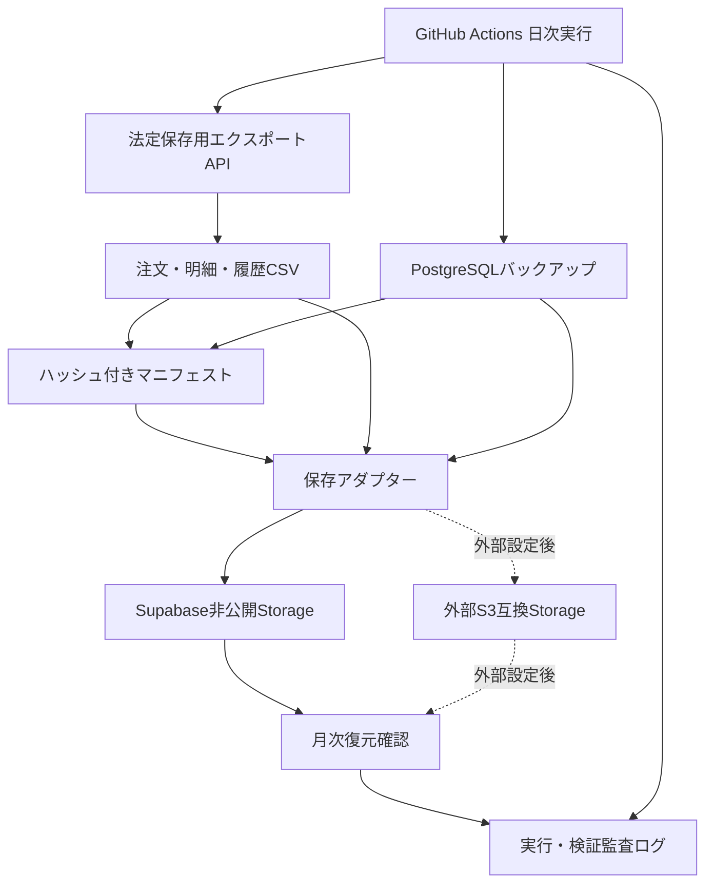

# オンライン注文の電子証憑・法定保存設計

> 対象: オンライン注文、取引管理、Supabase、GitHub Actions

---

## 概要

オンライン注文では証憑ファイルの手動添付を不要とし、注文データベースを電子証憑として保存する。正式適用前に、注文・明細の削除防止、変更履歴、法定検索、表示・出力を整備する。

日次で暦年の全注文をCSVへ出力し、データベースもバックアップする。月次でバックアップを復元確認する。保存先は差し替え可能にし、第一段階ではSupabaseの非公開Storage、外部保存先の導入後はS3互換の非公開オブジェクトストレージにも複製する。

| 項目 | 方針 |
|---|---|
| 事業年度 | 1月1日から12月31日 |
| CSV | 当年全件を毎日スナップショット |
| DBバックアップ | 毎日 |
| 復元確認 | 毎月 |
| 保存期間 | 原則7年。設定により10年 |
| 証憑表示 | 注文データ保存済み。添付不要 |
| 初期保存先 | Supabase非公開Storage |
| 将来の保存先 | 外部S3互換ストレージへ複製 |

---

## 1. 全体アーキテクチャ



### 1.1 責務

- Next.jsは法定保存用の注文、明細、変更履歴を正規化して返す。
- GitHub Actionsはスケジュール、再試行、DBダンプ、保存、復元確認を担当する。
- 保存CLIはCSV生成、ハッシュ計算、マニフェスト生成、アップロードを担当する。
- DBバックアップCLIは`pg_dump`、`pg_restore`、復元後の整合性検証を担当する。
- 保存アダプターはSupabase StorageとS3互換Storageの差異を隠蔽する。

### 1.2 適用段階

1. 削除防止、履歴、検索、出力、日次保存、月次復元確認を実装する。
2. 全検証に成功するまでは、オンライン注文を「保存要件整備中」と表示する。
3. 検証後、「注文データ保存済み（添付不要）」へ切り替える。
4. 外部保存先が決まったらS3互換設定を有効にし、二重保存する。

---

## 2. 注文データの保護

### 2.1 不変項目

注文確定後、次の項目はDBトリガーで更新を拒否する。管理者権限やservice roleによる直接更新も例外にしない。

- 注文ID、Checkout Session ID、Payment Intent ID
- 顧客と配送先の注文時スナップショット
- 通貨、小計、送料、値引き、合計額
- 商品名、単価、数量、明細金額
- 注文日時

### 2.2 更新可能項目

次の業務状態は更新を許可する。

- 注文ステータス
- 返金累計額、返金日時
- 決済状態更新日時
- 配送や処理など、注文時の取引事実を変更しない運用項目

許可された更新でも、変更履歴を必ず記録する。

### 2.3 変更履歴

append-onlyの`order_revisions`を作成し、以下を保存する。

| 列 | 内容 |
|---|---|
| `order_id` | 対象注文 |
| `operation` | 状態更新、返金、訂正などの区分 |
| `before_data` | 変更前スナップショット |
| `after_data` | 変更後スナップショット |
| `changed_fields` | 変更された列 |
| `changed_by` | 管理者などの実行主体 |
| `reason` | 変更理由 |
| `source_event_id` | Stripeイベントなどの外部根拠 |
| `changed_at` | 変更日時 |

履歴テーブルはアプリから更新・削除できないようにする。Stripe Webhook由来の更新にはイベントID、管理操作には管理者IDと理由を記録する。

### 2.4 物理削除禁止

- `orders`と`order_items`の`DELETE`をDBトリガーで拒否する。
- キャンセルと全額返金は状態遷移として保持する。
- 顧客アカウントを削除しても注文は保持する。
- 個人情報の匿名化は、法定保存との調整が必要な別機能とし、今回の自動処理には含めない。

---

## 3. 検索と画面表示

### 3.1 検索条件

注文検索は次に対応する。

- 注文日の日付指定と範囲指定
- 金額の単額指定と範囲指定
- 取引先の氏名またはメール
- 注文ID、Payment Intent ID
- 注文ステータス

### 3.2 証憑状態

オンライン注文には`evidenceStatus: "system_record"`を設定する。

- 証憑列は「注文データ保存済み」と表示する。
- 詳細に「注文DBを電子証憑として保存・定期アーカイブ」と表示する。
- 証憑添付ボタンは表示しない。
- 証憑未添付件数には算入しない。
- 日次アーカイブが24時間以上遅延した場合は「アーカイブ要確認」と表示する。
- 正式適用前は「保存要件整備中」と表示する。

既存の手動CSV出力は「表示中の注文をCSV出力」と明記し、法定保存用の自動出力と区別する。

---

## 4. 日次アーカイブ

### 4.1 出力構造

```text
legal-archive/
  2026/
    daily/2026-08-09/
      orders.csv
      order_items.csv
      order_revisions.csv
      database.dump.gz
      manifest.json
```

CSVはUTF-8、固定列順、固定日時形式とする。改行と引用符を正規化し、表計算ソフトの数式として解釈され得る値を無害化する。

### 4.2 マニフェスト

`manifest.json`には次を記録する。

- スキーマバージョン
- 対象期間と生成日時
- アプリのGitコミット
- 各ファイルのSHA-256、バイト数、行数
- 注文件数、明細件数、履歴件数
- 総額、返金額、純売上の合計
- DBバックアップ方式とPostgreSQLバージョン
- 前回マニフェストのSHA-256
- 保存先ごとの保存結果

前回マニフェストのハッシュを持たせ、日次成果物の連続性を検証可能にする。

### 4.3 原子性と再実行

- 成果物は一時キーへ保存し、全検証成功後に確定キーへ移す。
- 一部だけ成功した成果物を正式な保存済みとして扱わない。
- 同一日、同一実行IDで安全に再実行できるようにする。
- 年度最終版は上書きしない。同一キーが存在する場合は失敗させる。

---

## 5. DBバックアップと復元確認

### 5.1 日次バックアップ

- PostgreSQLのカスタム形式でダンプし、圧縮する。
- バックアップ、CSV、マニフェストに公開URLを設けない。
- GitHub Actionsの通常アーティファクトを法定保存先にしない。
- 秘密値や個人情報をログへ出さない。
- 第一段階はSupabase非公開Storageへ保存する。
- 外部保存先の導入後は、外部保存成功も日次ジョブの成功条件にする。

### 5.2 月次復元確認

最新バックアップを一時PostgreSQLへ復元し、次を検証する。

- ダンプが正常に復元できる。
- 注文、明細、変更履歴テーブルが存在する。
- 外部キー、削除防止トリガー、変更履歴トリガーが存在する。
- DB集計値がマニフェストの件数と金額合計に一致する。
- CSVのSHA-256と行数が一致する。
- 注文と明細に孤立レコードがない。

一時DBとダウンロードファイルは検証終了後に破棄する。監査ログには成否、対象バックアップ、検証項目、実行日時を記録し、個人情報を含めない。

### 5.3 年度確定と保存期間

翌年最初の成功時に前年最終スナップショットを`annual/YYYY/final/`へ固定する。保存期間は原則7年とし、年度単位の設定で10年へ延長できるようにする。

---

## 6. APIとセキュリティ

### 6.1 法定保存用エクスポートAPI

- GitHub Actions専用のAuthorizationヘッダーで認証する。
- 認証値は固定時間比較する。
- 対象年と取得範囲をサーバー側で検証する。
- 管理画面用APIと分離する。
- レート制限と監査ログを適用する。
- ファイルパス、秘密値、不要な個人情報をレスポンスやログへ出さない。

### 6.2 アーカイブ状態API

管理画面へ次だけを返す。

- 最終成功日時
- 対象年
- 有効な保存先の種別
- 最終復元確認日時
- 遅延または失敗状態

### 6.3 保存アダプター

共通インターフェースで次を実装する。

- Supabase非公開Storage
- S3互換非公開Storage

環境変数で有効な保存先を選択する。外部保存先の設定後は二重保存を標準とし、Supabaseと外部の両方へ同じハッシュの成果物を保存する。

---

## 7. エラー処理と運用

- GitHub Actionsの失敗はジョブを失敗状態にし、手動再実行できるようにする。
- 最終成功から24時間を超えた場合、管理画面へ警告する。
- ハッシュ、件数、金額が一致しない成果物は確定保存しない。
- 外部保存先導入後は、外部保存失敗を全体失敗として扱う。
- 復元確認の失敗は日次バックアップ成功と区別して記録する。
- 保存先資格情報の更新方法、失敗時の再実行、年度確定、保存期間を運用規程へ記載する。

---

## 8. テスト設計

実装はテスト駆動開発で進め、各本体変更の前に失敗するテストを追加する。

| 分類 | テストケース |
|---|---|
| DB | 注文・明細を削除できない |
| DB | 不変項目を更新できない |
| DB | 許可された状態更新が成功し、履歴が残る |
| DB | 履歴を更新・削除できない |
| CSV | 固定列順、日時形式、エスケープ、数式インジェクション防止 |
| CSV | 暦年の全注文・明細・履歴を出力する |
| CSV | 返金を含む集計値が一致する |
| マニフェスト | SHA-256、行数、金額合計、前回ハッシュを記録する |
| API | 認証、対象年、権限、ログの秘密情報非出力 |
| 保存 | Supabase保存、S3設定切替、部分失敗時の非確定 |
| UI | オンライン注文を保存済みと表示し、添付操作を隠す |
| UI | オンライン注文を未添付集計に算入しない |
| UI | 日次アーカイブ遅延を警告する |
| 復元 | 実バックアップを復元し、DBとマニフェストを照合する |

最終確認では型チェック、Lint、Jest、関連E2E、Supabase監査、セキュリティ監査、Graphify更新を実行する。

---

## 9. 完了条件

1. 注文と明細を物理削除できない。
2. 注文確定時の取引情報を変更できない。
3. 許可された状態変更がappend-only履歴へ記録される。
4. 日付、金額、取引先、注文ID、Payment Intent IDで検索できる。
5. 当年全件のCSV、マニフェスト、DBバックアップが毎日保存される。
6. 月次復元確認でダンプ、制約、件数、金額、ハッシュの整合を確認できる。
7. オンライン注文が「注文データ保存済み」と表示され、証憑未添付に数えられない。
8. Supabase非公開Storageで運用でき、S3互換Storageへ切り替えまたは複製できる。
9. 外部保存先が未設定であることを管理画面で確認できる。
10. 保存期間、再実行、年度確定、復元確認の運用手順が文書化される。

---

## 10. 対象外

- 外部オブジェクトストレージの契約と資格情報の発行
- 過去に削除済みの注文データの復元
- 顧客個人情報の匿名化ワークフロー
- 税理士または税務署による個別事案の法的確認
