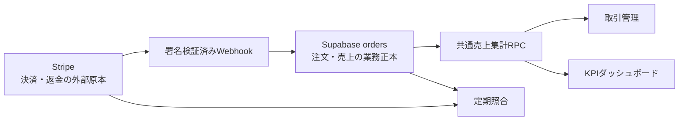
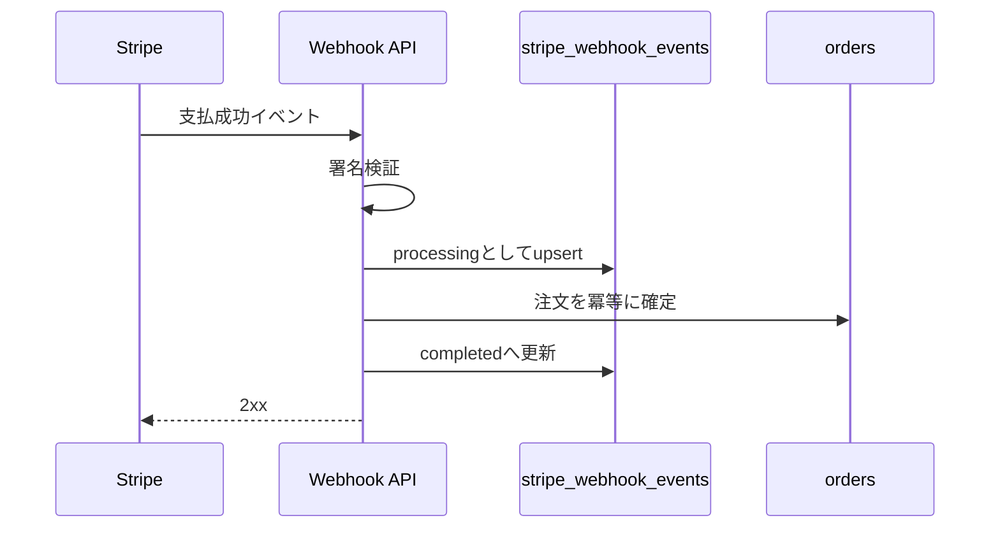

# Stripe注文・売上取引の整合性設計

> 対象: Stripe決済、Supabase注文、取引管理、KPI売上

---

## 概要

Stripeを決済事実の外部原本、Supabaseをアプリ内の業務データ正本とする。取引管理とKPIはStripe APIを直接参照せず、Supabaseの支払済み注文を共通の売上データとして使用する。

今回の調査では、Stripeテストモードにだけ存在する成功決済が3件見つかった。3件は注文として復元せず全額返金し、今後の同期漏れを防ぐためWebhookの再試行制御、返金同期、定期照合、運用設定を修正する。

| 項目 | 方針 |
|---|---|
| 決済状態の外部原本 | Stripe |
| アプリ内の注文・売上正本 | Supabase `orders` |
| 取引管理の注文売上 | 支払済み注文から生成する読み取り専用行 |
| KPI売上 | 取引管理と同じ売上集計RPCを使用 |
| Stripe単独決済 | 自動で注文化せず、不一致として検出 |
| 手動収入 | 注文売上と区別して既存の会計取引へ保存 |

---

## 1. 調査結果

### 1.1 現在のデータ

| データ | 件数 | 金額 |
|---|---:|---:|
| Supabase `orders` | 16件 | ステータス混在 |
| 支払済み注文 | 13件 | 461,540円 |
| 取引管理の手動収入 | 0件 | 0円 |
| Stripe成功決済 | 16件 | 510,339円相当 |
| Stripe単独決済 | 3件 | 25,300円、21,499円、2,000 USD |

### 1.2 Stripe単独決済の分類

| 決済 | 内容 | 原因 | 処理 |
|---|---|---|---|
| 25,300円 | 商品24,800円と送料500円 | 旧Checkout実装でPayment Intentへ注文生成用メタデータが伝播しなかった | テスト取引として全額返金 |
| 21,499円 | 旧コンビニ決済、商品明細なし | Webhook注文生成導入前のテスト | 全額返金。銀行情報入力待ち |
| 2,000 USD | Stripe CLI生成 | Webhook確認用テスト | 全額返金 |

成功済みPayment IntentはStripeから削除できない。全額返金後は履歴として残すが、有効売上および注文同期対象から除外する。

### 1.3 根本原因

1. Stripeテスト環境にWebhookエンドポイントが登録されていない。
2. 旧実装ではCheckout SessionのメタデータがPayment Intentへ伝播せず、`payment_intent.succeeded`から注文を生成できなかった。
3. 現在のWebhookは処理前にイベントを保存し、再送時は保存済みという理由だけで処理を省略する。初回処理が失敗するとStripeの再送でも回復しない。
4. Stripe側で行われた返金を`orders`へ同期するイベント処理がない。
5. 取引管理の収入とKPI売上が別データ経路になっている。

---

## 2. 正本と責務



- Stripeは支払成功、返金、決済失敗の事実を確定する。
- `orders`は商品、顧客、配送、金額、決済参照を保持する。
- 取引管理とKPIは共通RPCから売上を取得する。
- Stripeにだけ存在する決済は、自動で不完全な注文を作らず照合エラーとして通知する。

---

## 3. データモデル

### 3.1 注文の返金情報

`orders`へ次の情報を追加する。

| 列 | 用途 |
|---|---|
| `refunded_amount` | Stripeで確定した累計返金額 |
| `refunded_at` | 全額返金または最新返金の反映日時 |
| `payment_status_updated_at` | Stripe状態を最後に反映した日時 |

売上純額は`total_amount - refunded_amount`とする。部分返金で注文全体を`cancelled`にしない。全額返金時のみ既存仕様との互換性を考慮してキャンセル状態へ遷移する。

### 3.2 Webhookイベント状態

`stripe_webhook_events`へ処理状態を追加する。

| 列 | 用途 |
|---|---|
| `processing_status` | `processing` / `completed` / `failed` |
| `attempt_count` | 処理試行回数 |
| `completed_at` | 正常終了日時 |
| `last_error` | 管理者向けの非機密エラー概要 |

`event.id`は一意に保つが、`completed`の場合だけ重複として省略する。`failed`は再処理し、処理に失敗したリクエストは5xxを返す。

### 3.3 共通売上RPC

共通RPCは、注文売上について次を返す。

- 注文ID、決済ID、注文日
- 売上総額、返金額、売上純額
- 通貨、注文状態、返金状態
- 取引先表示、摘要、支払方法

取引管理はこの結果を注文由来の読み取り専用収入として表示する。会計上の補足情報が必要な場合は、注文IDをキーにした補足テーブルへ保存し、決済金額そのものは編集させない。

---

## 4. データフロー

### 4.1 支払成功



注文確定には既存の`finalize_order_from_checkout_draft`を使用し、Payment Intent IDとCheckout Session IDの一意制約で冪等性を担保する。

### 4.2 返金

- `refund.created`、`refund.updated`、`charge.refunded`の必要なイベントを購読する。
- StripeからPayment Intentの累計返金額を取得し、差分加算ではなく累計値で`orders.refunded_amount`を更新する。
- 部分返金は純売上を減額し、全額返金は純売上を0円にする。
- KPIと取引管理は次回取得時に同じ純売上を表示する。

### 4.3 再試行

- `completed`: 2xxで重複受信を終了する。
- `failed`: 試行回数を増やして再実行する。
- `processing`: ドメイン側の一意制約を利用して安全に再実行する。
- 失敗時にイベント行を削除しない。監査情報として残す。

---

## 5. Stripe照合

照合処理はStripeの支払・返金とSupabase注文をPayment Intent IDで比較する。

| 不一致 | 処理 |
|---|---|
| Stripe成功、注文なし | エラーとして記録し、管理者へ通知 |
| 注文は支払済み、Stripe未成功 | エラーとして記録し、自動で売上計上しない |
| 金額不一致 | エラーとして記録し、自動上書きしない |
| 返金額不一致 | Stripe累計返金額で修復し、監査ログを残す |
| 全額返金済みのテスト決済 | 有効な不一致件数と売上から除外 |

照合は管理APIからの手動実行と、認証済みCronによる定期実行を同じサービス関数へ委譲する。

---

## 6. 運用設定

Stripe Dashboardのテスト環境と本番環境へ、それぞれ環境変数`APP_BASE_URL`で定義した公開オリジンのWebhook URLを登録する。

```text
${APP_BASE_URL}/api/webhook/stripe
```

- テスト用と本番用の署名シークレットを混在させない。
- `APP_BASE_URL`はHTTPSの固定オリジンとし、末尾のスラッシュを除いて設定する。
- 必要イベントだけを購読する。
- デプロイ後にStripe Dashboardで配信成功を確認する。
- ローカル開発はStripe CLI転送を使用し、Dashboard登録の代替としない。

---

## 7. エラー処理とセキュリティ

- Stripe署名検証前にDBを書き換えない。
- 生の秘密鍵、署名値、顧客情報をログへ出さない。
- Webhook処理失敗は5xxを返し、Stripeの再試行を有効にする。
- 管理者向け照合APIは`admin.finance.manage`権限を必須にする。
- Cronは共有シークレットまたは既存のCron認証方式で保護する。
- 金額、通貨、Payment Intent ID、注文IDの整合性をDB更新前に検証する。

---

## 8. テスト計画

| テスト | 期待結果 |
|---|---|
| 支払成功 | 注文が1件だけ確定する |
| 同一Webhookの重複 | 注文とイベント処理が重複しない |
| 初回Webhook処理失敗後の再送 | 2回目で処理が完了する |
| Checkout完了画面を閉じる | Webhookだけで注文が確定する |
| 部分返金 | 純売上だけが減り、注文は全キャンセルにならない |
| 全額返金 | 純売上が0円になる |
| Stripe単独成功決済 | 注文を捏造せず照合エラーになる |
| 取引管理とKPI | 同一期間の売上合計が一致する |
| RLS・権限 | 非管理者は照合・修復を実行できない |

---

## 9. 完了条件

1. Supabaseの支払済み注文13件が取引管理の収入として表示される。
2. 同一期間・同一条件で取引管理とKPIの純売上が一致する。
3. Stripe単独の未返金成功決済が0件になる。
4. コンビニ決済のテスト返金が`requires_action`から`succeeded`へ遷移する。
5. Webhook失敗後の再送で処理が回復する自動テストが通る。
6. 部分返金と全額返金が取引管理・KPIの双方へ反映される。
7. Stripe Dashboardにテスト・本番それぞれのWebhookエンドポイントが登録され、テストイベントが2xxになる。
