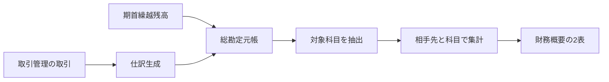

# 借入先・支払先別残高設計

> 対象: ADMIN > ACCOUNTING > 財務概要

---

## 概要

財務概要に「借入・事業主資金」と「その他の支払債務」の2表を追加する。記録開始から選択年度末までの仕訳を相手先・勘定科目別に集計し、受入累計、返済・支払済み累計、残高を確認できるようにする。

| 項目 | 内容 |
|---|---|
| 主目的 | 利益が出て資金余力がある時に、誰へいくら返す必要があるか判断する |
| 集計期間 | 記録開始から選択年度の12月31日まで |
| 集計単位 | 相手先と勘定科目の組み合わせ |
| 情報源 | 取引管理から生成した仕訳および期首繰越残高 |
| 整合性 | 表の残高合計を対象科目の総勘定元帳残高と一致させる |

---

## 1. 対象範囲

### 1.1 借入・事業主資金

| コード | 勘定科目 | 適用形態 | 表示上の扱い |
|---|---|---|---|
| 2110 | 短期借入金 | 共通 | 返済義務のある借入 |
| 2120 | 役員借入金 | 法人 | 返済義務のある役員からの借入 |
| 2510 | 長期借入金 | 共通 | 返済義務のある長期借入 |
| 2520 | 社債 | 法人 | 償還義務のある調達資金 |
| 2920 | 事業主借 | 個人事業主 | 事業主からの資金投入。法的な返済義務額とは区別する |

元入金、資本金、資本準備金は返済対象ではないため含めない。

### 1.2 その他の支払債務

| コード | 勘定科目 |
|---|---|
| 2010 | 支払手形 |
| 2020 | 買掛金 |
| 2030 | 電子記録債務 |
| 2130 | 未払金 |
| 2140 | 未払費用 |
| 2160 | 預り金 |
| 2170 | 仮受金 |
| 2210 | 未払配当金 |
| 2220 | 受入保証金・敷金 |
| 2540 | 長期未払金 |

前受金、前受収益、商品券、税金関連、引当金は、相手先への借入返済・支払判断という目的から外れるため対象外とする。

## 2. 集計ルール

仕訳の貸方を資金の受入または債務の発生、借方を返済、支払または返還として集計する。

| 表示値 | 算出方法 |
|---|---|
| 借入・発生累計 | 対象科目の貸方額合計 |
| 返済・支払済み | 対象科目の借方額合計 |
| 残高 | 期首繰越残高 + 貸方額合計 - 借方額合計 |
| 最終入出金日 | 対象行に含まれる最新仕訳の日付 |

- 集計対象は記録開始から選択年度の12月31日までとする。
- 同じ相手先でも勘定科目が異なる場合は別行にする。
- 残高が0円になった行も返済・支払履歴として表示する。
- 残高が負数になった場合はその値を隠さず表示し、過払いや科目誤りを確認できるようにする。
- 取引先が空の仕訳は「相手先未設定」にまとめる。
- 相手先を特定できない期首繰越残高は、科目ごとに「繰越・相手先未設定」として表示する。
- 「相手先未設定」と「繰越・相手先未設定」は別行にし、取引修正可能な金額と繰越由来の金額を区別する。

## 3. UI設計

財務概要内に、次の順で独立したパネルを配置する。

1. 借入・事業主資金
2. その他の支払債務

### 3.1 借入・事業主資金

| 列 | 内容 |
|---|---|
| 借入先 | 取引先名。未入力時は未設定表示 |
| 区分 | 1.1に列挙した対象勘定科目名 |
| 借入・投入累計 | 貸方計上の累計 |
| 返済・引出済み | 借方計上の累計 |
| 残高 | 期首繰越を含む未決済残高 |
| 最終入出金日 | 最新仕訳日。繰越のみの場合は「—」 |

- 通常の借入科目では残高を返済判断に使う。
- 事業主借では「事業主資金残高」として扱い、「法的な返済義務額ではなく、決算時に元入金へ振り替えられます」と注記する。
- パネル上部に借入・投入累計、返済・引出済み、残高の合計を表示する。

### 3.2 その他の支払債務

| 列 | 内容 |
|---|---|
| 支払先 | 取引先名。未入力時は未設定表示 |
| 区分 | 1.2に列挙した対象勘定科目名 |
| 発生累計 | 貸方計上の累計 |
| 支払・返還済み | 借方計上の累計 |
| 残高 | 期首繰越を含む未決済残高 |
| 最終入出金日 | 最新仕訳日。繰越のみの場合は「—」 |

### 3.3 レスポンシブ・アクセシビリティ

- 表はセマンティックな `table`、`thead`、`tbody` を使い、パネル名を表のアクセシブルネームにする。
- 金額列は右揃え、日付と金額は桁を揃える。
- モバイルではパネル内のみ横スクロールを許可し、ページ全体の横スクロールは発生させない。
- データがない場合は「該当する残高はありません」と表示する。
- 色だけに依存せず、負数には符号と確認を促す文言を表示する。

## 4. 実装構成

- 集計ロジックは `src/lib/finance/` の独立した純粋関数へ置く。
- `CostProfitSection` は既存の仕訳・期首残高を集計関数へ渡し、結果の描画だけを担当する。
- 新しいAPIやデータベーステーブルは追加しない。既存APIが返す累計対象データで不足する相手先・資金側情報は、必要最小限のレスポンス拡張で補う。
- Client Component境界は現状の `CostProfitSection` を維持する。
- ACCOUNTINGデータは既存どおり最新取得とし、新しいキャッシュや無効化処理は追加しない。

## 5. エラー・不完全データ

- 相手先未入力でも集計から除外しない。
- 未知の勘定科目は対象外とし、既存の取引確認機能に委ねる。
- 相手先別残高合計と元帳残高が一致しない場合、差額を表示して帳簿確認を促す。
- API取得失敗時は既存の財務概要エラー表示に従い、前回値を正しい値として見せ続けない。

## 6. テスト

### 6.1 単体テスト

- 複数人・複数科目の借入と返済を相手先・科目別に集計できる。
- 私費で支払った経費を事業主借または役員借入金の受入として集計できる。
- 事業主借を通常の借入と区別して返す。
- その他の支払債務を借入・事業主資金と分離する。
- 期首繰越残高を「繰越・相手先未設定」へ計上する。
- 相手先未入力、完済、過払い、繰越のみを処理できる。
- 各表の残高合計が対象科目の総勘定元帳残高と一致する。

### 6.2 コンポーネントテスト

- 財務概要に2表と各列見出しが表示される。
- 借入累計、返済済み、残高、最終入出金日が表示される。
- 事業主借の説明と空状態が表示される。

### 6.3 回帰確認

- 財務概要、取引管理、帳簿の既存表示と集計を壊さない。
- 390px、768px、1280pxでページ全体の横スクロールが発生しない。

## 7. 完了条件

- 選択年度末時点で、借入先ごとの借入・投入累計、返済・引出済み、残高が確認できる。
- その他の支払債務が借入・事業主資金と分離されている。
- 事業主借を法的な返済義務額と誤認しない表示になっている。
- 相手先未設定や期首繰越を欠落させず、元帳残高と一致する。
- 対象単体テスト、コンポーネントテスト、既存の関連テストが成功する。
