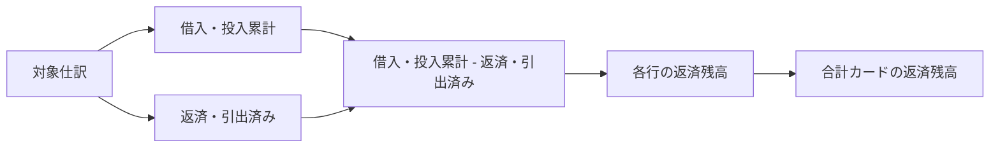

# 借入・事業主資金の返済残高設計

## 概要

ACCOUNTING タブの財務概要にある「借入・事業主資金」について、残額を元帳残高による補正値ではなく、借入・投入累計から返済・引出済みを差し引いた結果として表示する。あわせて、この列と合計カードの表示名を「返済残高」へ変更する。

| 項目 | 内容 |
|------|------|
| 対象 | 財務概要の「借入・事業主資金」パネル |
| 計算式 | 返済残高 = 借入・投入累計 - 返済・引出済み |
| 表示名 | 「残高」から「返済残高」へ変更 |
| 対象外 | 「その他の支払債務」の残高表示と計算 |

## 1. 計算方法

借入・事業主資金の各行は、記録開始から選択年度末までに対象勘定へ計上された貸方額を「借入・投入累計」、借方額を「返済・引出済み」とする。返済残高は次の式だけで算出する。

```text
返済残高 = 借入・投入累計 - 返済・引出済み
```

事業主借を当年度内の増減額へ置き換える処理、および総勘定元帳の正式残高との差額を借入・事業主資金へ補完する処理は、返済残高には適用しない。これにより各行と合計カードは同じ計算規則になる。

負数になった場合も値を隠さず表示し、既存の要確認表示を維持する。

## 2. 表示

「借入・事業主資金」パネルでは、次の2箇所を「返済残高」と表示する。

- パネル上部の合計カード
- 明細表の列見出し

「その他の支払債務」パネルは、従来どおり「残高」と表示し、元帳残高との照合方法も変更しない。

## 3. データフロー



## 4. テスト

- 事業主借を含む借入・事業主資金で、各行の返済残高が借入・投入累計から返済・引出済みを差し引いた値になることを確認する。
- 借入・事業主資金の合計返済残高が、各行の返済残高合計と一致することを確認する。
- 合計カードと表の見出しが「返済残高」になることを確認する。
- その他の支払債務は「残高」の表示と既存計算を維持することを確認する。

## 5. 受入条件

- 借入・事業主資金の返済残高が、常に「借入・投入累計 - 返済・引出済み」と一致する。
- 借入・事業主資金の合計カードと明細表に「返済残高」と表示される。
- その他の支払債務に影響がない。
