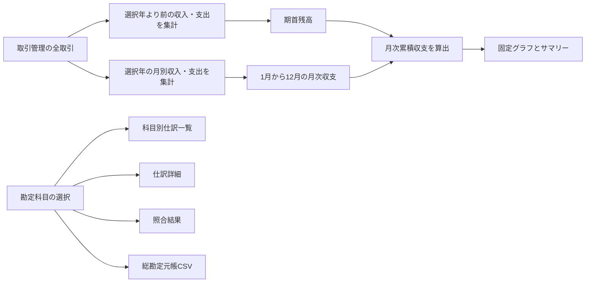

# 仕訳・元帳の月次累積収支推移設計

> 対象: ADMIN > ACCOUNTING > 帳簿 > 仕訳・元帳

---

## 概要

仕訳・元帳画面の「残高推移」を、選択中の勘定科目に連動する科目別残高から、取引管理へ入力した全収入・全支出に基づく固定の「月次累積収支推移」へ変更する。横軸は常に1月から12月とし、前年12月末までの累積収支を当年の期首残高として引き継ぐ。

勘定科目の選択は、科目別の仕訳一覧、仕訳詳細、元帳と試算表の照合結果、総勘定元帳CSVだけに反映する。これにより、事業全体の収支推移を固定した基準として見ながら、科目別の根拠を追跡できる画面にする。

## 1. 画面の目的

仕訳・元帳画面は取引の入力画面ではなく、取引管理へ入力した内容を次の観点で検証・追跡する画面とする。

| 領域 | 目的 |
|---|---|
| 月次累積収支推移 | 事業全体の収入・支出による累積額を年度内で把握する |
| 勘定科目ツリー | 確認対象となる総勘定元帳を選択する |
| 仕訳一覧 | 選択科目の増減理由を時系列で確認する |
| 仕訳詳細 | 相手科目、取引先、証憑、訂正履歴を追跡する |
| 照合結果 | 総勘定元帳と合計残高試算表の不一致を検出する |
| CSV出力 | 帳簿保存、税理士との確認、調査対応に利用する |

## 2. 月次累積収支の算出

### 2.1 対象データ

- 取引管理へ入力された全収入と全支出を対象とする。
- 勘定科目、取引先、決済方法、シーズンタグによる除外は行わない。
- 選択中の暦年より後の取引は算出対象に含めない。
- 論理削除済みの取引など、通常の帳簿生成対象から除外されるデータは含めない。

### 2.2 算式

```text
前年末累積収支 = 選択年の1月1日より前の全収入 - 同期間の全支出
当月収支       = 当月の全収入 - 当月の全支出
各月末累積収支 = 前年末累積収支 + 1月から当月までの当月収支合計
```

- 前年末累積収支を当年の期首残高として引き継ぐ。
- 前年以前に対象取引がない場合だけ期首残高を0円とする。
- 前年以前の取引が訂正された場合は、保存済みスナップショットではなく現在の取引履歴から再計算し、当年期首へ自動反映する。
- 取引がない月も直前月の累積額を維持し、1月から12月まで12点を必ず返す。

### 2.3 表示値

グラフと併せて、少なくとも次の値を表示する。

| 表示 | 算出内容 |
|---|---|
| 期首残高 | 前年12月末までの累積収支 |
| 当年収入 | 選択年の全収入 |
| 当年支出 | 選択年の全支出 |
| 当年末残高 | 期首残高 + 当年収入 - 当年支出 |

## 3. UIと操作

- パネル見出しを「月次累積収支推移」とする。
- 横軸は「1月」から「12月」まで固定する。
- 縦軸は円単位とし、負数も符号を省略せず表示する。
- グラフの系列名は「累積収支」とする。
- 期首残高は補助情報として表示し、科目別残高や現金預金残高ではないことを明記する。
- グラフのアクセシブルネームは「YYYY年の月次累積収支推移」とする。
- 選択年度を変更した場合は、その年度の期首残高と12か月の推移へ更新する。
- 勘定科目を変更しても、グラフ、期首残高、当年収入、当年支出、当年末残高は変化させない。
- 勘定科目の選択では、仕訳一覧、仕訳詳細、照合結果、総勘定元帳CSVだけを切り替える。

## 4. データフロー



固定グラフ用の集計と科目別元帳用の選択状態を分離し、勘定科目選択が事業全体の推移へ伝播しない構造にする。

## 5. 法的・会計上の位置付け

- 仕訳帳は全取引を借方・貸方に仕訳し、総勘定元帳は全取引を勘定科目別に分類して整理計算する法定帳簿として扱う。
- 月次累積収支推移は、全収入と全支出の差を示す管理指標であり、総勘定元帳上の科目残高、現金預金残高、利益、純資産のいずれでもない。
- 誤認防止のため、グラフ付近に「取引管理に入力した全収入・全支出による管理指標」である旨を表示する。
- グラフの変更によって、仕訳帳・総勘定元帳の明細、伝票番号、相手科目、貸借金額、残高、訂正履歴、証憑との関連付けを変更しない。
- 帳簿の保存期間、訂正削除履歴、帳簿間の相互関連性、検索・明瞭な出力などの対応は、グラフとは独立した法定帳簿の要件として維持する。

参考:

- [国税庁: 記帳や帳簿等保存・青色申告](https://www.nta.go.jp/publication/pamph/koho/kurashi/html/01_2.htm)
- [国税庁: 優良な電子帳簿の要件](https://www.nta.go.jp/law/joho-zeikaishaku/sonota/jirei/05.htm)

## 6. エラー・不完全データ

- 取得失敗時は既存のACCOUNTINGエラー表示に従い、前回値を最新値として誤表示しない。
- 対象取引が一件もない場合は、12か月すべて0円として表示する。
- 不正な日付や金額は既存の取引取得・帳簿生成契約に従って除外またはエラーにし、グラフ固有の補正値を作らない。
- 貸借不一致は従来どおり照合結果で表示し、累積収支グラフの値を補正して隠さない。

## 7. テスト方針

### 7.1 集計テスト

- 前年末累積収支が当年の期首残高になる。
- 当年の収入と支出が、勘定科目や決済方法を問わずすべて反映される。
- 取引のない月は前月末残高を維持する。
- 前年以前の取引がない場合は期首残高が0円になる。
- 前年取引の訂正が当年期首と全月の値へ反映される。

### 7.2 コンポーネントテスト

- 1月から12月の固定横軸とサマリー4項目を表示する。
- 勘定科目を変更してもグラフとサマリーが変化しない。
- 勘定科目を変更すると仕訳一覧と照合結果は切り替わる。
- 年度を変更するとグラフとサマリーが切り替わる。
- 管理指標である旨の注記とアクセシブルネームを表示する。

### 7.3 E2Eテスト

- mobile、tablet、desktopでグラフとサマリーを確認する。
- 異なる残高を持つ二つの勘定科目を順に選び、グラフ表示値が同一であることを確認する。
- 科目選択後も仕訳一覧、照合結果、総勘定元帳CSVが選択科目に対応することを確認する。
- 前年と当年の取引を用意し、前年末累積収支が当年期首へ引き継がれることを確認する。
- ページ全体に横スクロールが発生しないことを確認する。

## 8. 対象外

- 取引管理の入力項目や保存方式の変更
- 法定帳簿の算出ロジック変更
- 期首残高の手入力・年度別スナップショット保存
- 月次累積収支を現金預金残高、利益、純資産として扱うこと
- 仕訳・元帳画面での新規取引入力

## 9. 完了条件

- グラフが取引管理の全収入・全支出と前年末累積収支から算出される。
- 横軸が常に1月から12月である。
- 勘定科目クリックでグラフとサマリーが変わらない。
- 年度切替では選択年度に応じてグラフとサマリーが変わる。
- 科目別の仕訳一覧、仕訳詳細、照合結果、総勘定元帳CSVは従来どおり選択科目に追従する。
- 管理指標と法定帳簿の意味がUI上で区別されている。
- 対象単体テスト、コンポーネントテスト、E2Eテストが成功する。
