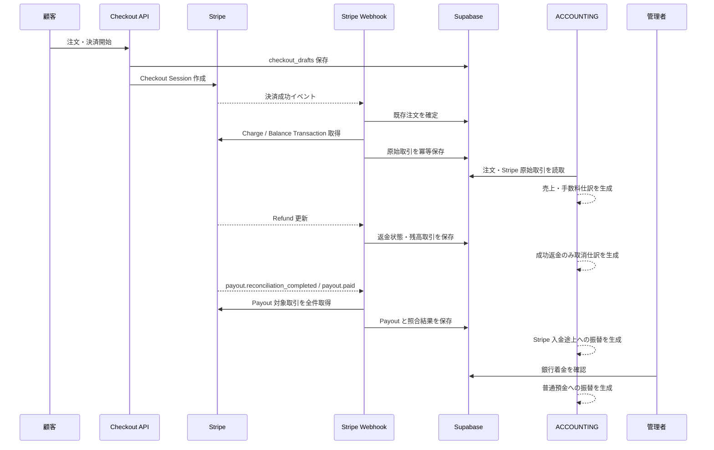

# Stripe 決済・手数料・返金・入金消込設計

> 対象: ACCOUNTING タブ、Stripe Checkout/Webhook、Supabase 注文・会計データ
>
> 決定日: 2026-08-15

---

## 概要

本設計は、Stripe 決済成功時の売上計上から、決済手数料、キャンセル返金、Stripe の自動 Payout、銀行着金確認までを一貫して帳簿へ反映する。

業務上の注文の正本は引き続き Supabase の `orders` とする。Stripe にだけ存在する決済から注文を自動生成しない。Stripe の資金移動は Balance Transaction、Refund、Payout を原始記録として保存し、既存の派生型仕訳・元帳へ読み取り時に変換する。

### 決定事項

| 項目 | 決定 |
| --- | --- |
| 売上認識日 | Stripe 決済成功日 |
| キャンセル時の売上 | 元売上を削除・改変せず、返金成功日に取消仕訳を追加 |
| 決済手数料 | 料率で推定せず Balance Transaction の実額を使用 |
| 返金手数料 | 決済手段・契約による差を実額で記録 |
| Payout | Stripe 支払済みと銀行着金確認を分離 |
| 注文の正本 | Supabase `orders` |
| Stripe 原始記録 | Stripe ID を主キーとして冪等保存 |
| 仕訳の正本 | 原始記録からの決定的な派生。別の仕訳正本テーブルは作らない |
| 本番適用 | マイグレーション作成・検証後、別途明示承認を得て適用 |

---

## 1. 設計自己レビュー結果

### 1.1 元売上の物理削除を採用しない

キャンセル時に元の売上行を削除すると、監査証跡が失われ、返金が翌月・翌年度に発生した場合の期間帰属も壊れる。元売上は決済成功日の記録として保持し、成功した返金を返金日の反対仕訳として追加する。

完全返金後の純売上はゼロになるが、帳簿には売上と取消の両方が残る。部分返金では返金額だけを取り消す。

### 1.2 Payout 支払済みと銀行着金を分離する

`payout.paid` は Stripe が Payout を支払済みにしたことを表すが、システム単独では銀行明細上の着金を保証できない。このため、次の2段階で記録する。

1. `payout.paid`: `Stripe 決済残高` から `Stripe 入金途上` へ振替
2. 銀行明細との手動確認: `Stripe 入金途上` から `普通預金` へ振替

これにより、Stripe から資金が出たが銀行で未確認の状態を資産として明示できる。

### 1.3 仕訳正本テーブルを追加しない

既存システムは取引データから仕訳を生成する構造である。別途 `accounting_journal_sources` を正本として追加すると、注文・Stripe 原始記録・仕訳テーブルの三重管理になる。

Stripe の原始記録のみを永続化し、各原始記録の Stripe ID から安定した仕訳 ID を生成する。元データが同じなら同じ仕訳になるため、Webhook 再送でも二重計上しない。

### 1.4 注文状態と返金状態を混同しない

注文の履行状態と決済返金状態は別概念である。既存互換のため完全返金時には `orders.status = 'cancelled'` を維持するが、会計判定は `stripe_refunds.status = 'succeeded'` を根拠とする。

`orders.refunded_amount` は一覧・KPI 互換用の累計値として残す。帳簿はこの累計値で元売上を減額せず、個々の成功済み返金から取消仕訳を生成する。

### 1.5 手数料を固定計算しない

日本の Stripe 標準料金では、カード等の返金に追加手数料がなくても元の決済手数料は返還されない。コンビニ決済や銀行系決済では返金手数料が発生し、カスタム料金では契約差もある。

そのため、決済金額と固定率から手数料を推定しない。Balance Transaction の `fee`、`net`、`fee_details`、`reporting_category` を保存し、Stripe が確定した実額のみを仕訳化する。

---

## 2. 会計処理

### 2.1 決済成功

10,000 円の決済が成功した場合:

| 借方 | 金額 | 貸方 | 金額 |
| --- | ---: | --- | ---: |
| クレジット売掛金（Stripe 決済残高） | 10,000 | 売上高 | 10,000 |

Stripe Checkout の成功画面への遷移ではなく、署名検証済み Webhook で決済成功を確認した時点を根拠とする。カード等は `payment_intent.succeeded`、遅延決済は `checkout.session.async_payment_succeeded` を処理する。

### 2.2 決済手数料

Balance Transaction が `amount = 10,000`、`fee = 360`、`net = 9,640` の場合:

| 借方 | 金額 | 貸方 | 金額 |
| --- | ---: | --- | ---: |
| 支払手数料 | 360 | クレジット売掛金（Stripe 決済残高） | 360 |

売上は総額、Stripe 残高は手数料控除後の純額となる。

### 2.3 完全返金

10,000 円の返金が成功した場合、返金作成日ではなく Stripe の成功確定日時で次を計上する。

| 借方 | 金額 | 貸方 | 金額 |
| --- | ---: | --- | ---: |
| 売上値引・返品 | 10,000 | クレジット売掛金（Stripe 決済残高） | 10,000 |

返金の Balance Transaction に追加手数料が含まれる場合は、別に次を計上する。取消仕訳日は成功した Refund の Balance Transaction の `created` とし、Webhook受信日やバックフィル実行日にはしない。

| 借方 | 金額 | 貸方 | 金額 |
| --- | ---: | --- | ---: |
| 支払手数料 | 実額 | クレジット売掛金（Stripe 決済残高） | 実額 |

元の決済手数料が返還されない場合、元の支払手数料はそのまま残す。Stripe が手数料を戻した場合に限り、Balance Transaction の実額に基づいて支払手数料の戻入を作る。

### 2.4 部分返金

返金額だけを `売上値引・返品` として計上する。複数回の部分返金は Stripe Refund ID ごとに独立して記録する。累計が注文額に達した場合のみ完全返金と判定する。

### 2.5 返金失敗・要アクション

`pending`、`requires_action`、`failed`、`canceled` の返金は売上取消仕訳を作らない。状態は保存し、`succeeded` への遷移時に一度だけ仕訳対象となる。

失敗後に Stripe が残高を戻す `failure_balance_transaction` も保存する。成功していない返金を一時的に仕訳化しないため、失敗戻入の二重処理を避ける。

### 2.6 Payout 支払済み

自動 Payout 9,640 円が `paid` になった場合:

| 借方 | 金額 | 貸方 | 金額 |
| --- | ---: | --- | ---: |
| Stripe 入金途上 | 9,640 | クレジット売掛金（Stripe 決済残高） | 9,640 |

Payout に含まれる Balance Transaction は Payout ID で全件取得し、ページネーションを完了させる。Payout 金額と対象取引の純額合計が一致しない場合は仕訳対象にせず、要確認とする。

### 2.7 銀行着金確認

管理者が銀行明細と金額・日付を照合して着金確認した場合:

| 借方 | 金額 | 貸方 | 金額 |
| --- | ---: | --- | ---: |
| 普通預金 | 9,640 | Stripe 入金途上 | 9,640 |

着金確認は `admin.finance.manage` 権限、MFA、CSRF 検証を必須とし、確認者・確認日時・銀行着金日を監査ログへ残す。一度確認した Payout の再確認は同じ結果を返し、二重仕訳を生成しない。

---

## 3. データ構造

### 3.1 `stripe_balance_transactions`

Stripe 残高を動かした原始記録を保存する。

| 列 | 型 | 制約・用途 |
| --- | --- | --- |
| `id` | `text` | Stripe Balance Transaction ID、主キー |
| `source_id` | `text` | Charge、Refund、Payout 等の関連 Stripe ID |
| `payment_intent_id` | `text` | 注文との照合用、NULL 可 |
| `order_id` | `uuid` | 既存注文との参照、NULL 可 |
| `payout_id` | `text` | 自動 Payout との関連、NULL 可 |
| `type` | `text` | Stripe の取引種別 |
| `reporting_category` | `text` | 会計分類の主判定に使用 |
| `amount` | `integer` | 総額、最小通貨単位 |
| `fee` | `integer` | 手数料実額 |
| `net` | `integer` | 純額 |
| `currency` | `text` | 小文字 ISO 通貨コード |
| `status` | `text` | `pending` または `available` |
| `available_on` | `timestamptz` | Stripe 残高で利用可能になる日時 |
| `stripe_created_at` | `timestamptz` | Stripe 上の発生日時 |
| `fee_details` | `jsonb` | 手数料内訳 |
| `raw_payload` | `jsonb` | 再検証用原文 |
| `synced_at` | `timestamptz` | 最終同期日時 |

`amount - fee = net` を検査制約とする。Stripe ID は一意であり、金額・通貨・source は初回保存後に変更を許可しない。`status`、`available_on`、`payout_id`、`raw_payload`、`synced_at` は Stripe の最新状態へ更新できる。

### 3.2 `stripe_refunds`

返金ライフサイクルを注文とは独立して保存する。

| 列 | 型 | 制約・用途 |
| --- | --- | --- |
| `id` | `text` | Stripe Refund ID、主キー |
| `payment_intent_id` | `text` | 必須 |
| `charge_id` | `text` | NULL 可 |
| `order_id` | `uuid` | 既存注文参照、必須 |
| `amount` | `integer` | 返金額 |
| `currency` | `text` | 注文通貨と一致 |
| `status` | `text` | Stripe Refund 状態 |
| `reason` | `text` | NULL 可 |
| `balance_transaction_id` | `text` | 成功時の残高取引、NULL 可 |
| `failure_balance_transaction_id` | `text` | 失敗戻入、NULL 可 |
| `stripe_created_at` | `timestamptz` | Stripe 作成日時 |
| `succeeded_at` | `timestamptz` | 成功した Balance Transaction の発生日時 |
| `raw_payload` | `jsonb` | 再検証用原文 |
| `synced_at` | `timestamptz` | 最終同期日時 |

取消仕訳日は `succeeded_at` とする。成功した Refund に Balance Transaction がまだ付与されていない場合は取消仕訳を保留し、定期照合で補完する。既に成功済みの返金を後から取得しても同期実行日へずらさない。

### 3.3 `stripe_payouts`

| 列 | 型 | 制約・用途 |
| --- | --- | --- |
| `id` | `text` | Stripe Payout ID、主キー |
| `amount` | `integer` | Payout 金額 |
| `currency` | `text` | 通貨 |
| `status` | `text` | Stripe Payout 状態 |
| `automatic` | `boolean` | 自動 Payout か |
| `arrival_date` | `date` | Stripe の予定着金日 |
| `stripe_created_at` | `timestamptz` | Stripe 作成日時 |
| `paid_at` | `timestamptz` | Payout の Balance Transaction 発生日時 |
| `reconciliation_status` | `text` | `pending` / `matched` / `mismatch` |
| `reconciled_net` | `integer` | 対象 Balance Transaction の純額合計 |
| `bank_arrival_date` | `date` | 銀行明細上の着金日、NULL 可 |
| `bank_confirmed_at` | `timestamptz` | 着金確認日時、NULL 可 |
| `bank_confirmed_by` | `uuid` | 確認管理者、NULL 可 |
| `raw_payload` | `jsonb` | 再検証用原文 |
| `synced_at` | `timestamptz` | 最終同期日時 |

Payout 金額と対象 Balance Transaction の純額合計が一致した場合のみ `matched` とする。銀行確認は `matched` かつ `paid` の Payout に限定する。

### 3.4 勘定科目

既存の次の科目を利用する。

- `1130 クレジット売掛金`: Stripe 決済残高
- `4010 売上高`
- `4020 売上値引・返品`
- `6280 支払手数料`
- `1040 普通預金`

新たに借方正常残高の流動資産 `1150 Stripe 入金途上` を追加する。決算書区分は `売上債権` ではなく `その他流動資産` とし、銀行着金未確認の Payout のみを残高とする。

---

## 4. システムフロー

### 4.1 Webhook 対象イベント

| イベント | 処理 |
| --- | --- |
| `payment_intent.succeeded` | 注文確定、Charge と Balance Transaction 同期 |
| `checkout.session.async_payment_succeeded` | 遅延決済の注文確定と同期 |
| `refund.created` / `refund.updated` | 返金状態と Balance Transaction 同期 |
| `charge.refunded` | Refund 一覧を再取得して欠落補完 |
| `payout.reconciliation_completed` | Payout 構成取引を全件取得・照合 |
| `payout.paid` | Payout 状態更新、未照合なら構成取引取得 |
| `payout.failed` / `payout.canceled` | 入金途上仕訳を作らず要確認 |

既存の `stripe_webhook_events` によりイベント単位の再送を抑止する。さらに各 Stripe オブジェクト ID の主キー・一意制約により、異なるイベントから同じ原始取引を取得しても重複しない。

### 4.2 定期照合

既存 `/api/cron/stripe-reconcile` を拡張し、次を行う。

1. 既存注文の PaymentIntent に対する返金同期
2. 未取得・未確定の Balance Transaction 再取得
3. 最近の自動 Payout と構成取引の再取得
4. `mismatch`、`pending`、失敗イベントの再検証

Stripe 側にだけ存在する PaymentIntent は報告対象にするが、注文は作成しない。初回導入時には既存 `orders.payment_intent_id` のみを対象とする管理者起動のバックフィルを用意する。

### 4.3 Balance Transaction の投影規則

自動仕訳は `reporting_category` の許可リストに限定する。

| `reporting_category` | 投影 |
| --- | --- |
| `charge` / `payment` | 注文売上と正の `fee` を処理 |
| `refund` / `payment_refund` | 成功返金と正負の `fee` 調整を処理 |
| `stripe_fee` / `stripe_fx_fee` / `tax_fee` | Balance Transaction 自体の符号付き純額を手数料または手数料戻入として処理 |
| `payout` | Stripe 決済残高から Stripe 入金途上への振替 |
| `payout_failure` / `payout_cancel` | Stripe 入金途上から Stripe 決済残高への戻入 |

`fee > 0` は支払手数料、`fee < 0` は支払手数料の戻入とする。同じ費用を埋込 `fee` と独立した `stripe_fee` の両方から計上しないよう、Balance Transaction ID と投影種別の組合せを一意な仕訳キーにする。

許可リスト外の `reporting_category` は保存のみ行い、自動仕訳せず要確認とする。これにより、Dispute、Reserve、通貨換算、Connect 等を誤って通常売上へ混在させない。

---

## 5. アプリケーション境界

### 5.1 Stripe 同期モジュール

Stripe SDK オブジェクトをDB行へ正規化し、保存する。Webhook Route Handler はイベント分岐と監査ログに限定し、Stripe API のページネーション・照合・保存は専用モジュールへ委譲する。

### 5.2 会計投影モジュール

注文、成功返金、Balance Transaction、Payout を受け取り、明示的な借方・貸方を持つ `JournalEntry` を返す。

Payout は既存 `FinanceEntry` の収入・支出モデルでは正しく表現できないため、無理に入出金へ変換せず、Stripe 会計投影から直接 `JournalEntry` を生成して既存 `buildJournal()` の結果へ結合する。

### 5.3 管理 API

銀行着金確認 API は次を満たす。

- `admin.finance.manage` 権限
- MFA 必須
- CSRF 検証
- Payout が `paid` かつ `matched`
- 着金日が有効な日付
- 再実行時に同じ確認結果を返す冪等性
- 監査ログへ Payout ID、金額、着金日、確認者を記録

### 5.4 UI

ACCOUNTING タブに次を追加する。

- Stripe 決済残高
- Stripe 入金途上残高
- 未照合・不一致 Payout 件数
- Payout の金額、予定着金日、状態、銀行確認状態
- `paid` かつ `matched` の Payout に対する「銀行着金を確認」操作

売上一覧では元注文と返金を別行で表示する。完全返金済み注文の純額はゼロと表示するが、元売上行は削除しない。

---

## 6. セキュリティと整合性

- Stripe Webhook は生リクエスト本文と `constructEvent` で署名検証する。
- Stripe シークレット、Webhook シークレット、Supabase service role をクライアントへ公開しない。
- 新規3テーブルは RLS を有効化し、`anon` と `authenticated` の権限を明示的に剥奪する。
- サーバー側 service role のみが原始記録を書き込む。
- 管理画面の読取・銀行確認は既存の管理APIを経由する。
- 金額はすべて最小通貨単位の整数とする。
- 通貨が注文・返金・Payout 間で一致しない場合は仕訳を作らず要確認とする。
- Stripe 原始取引の金額・通貨・source の不一致は上書きせず、同期エラーとして監査ログへ残す。
- Payout の構成取引取得は自動ページネーションで全件完了させる。
- 本番マイグレーションはローカル検証後も自動適用しない。

---

## 7. エラー処理

| 状況 | 処理 |
| --- | --- |
| Stripe API 一時エラー・429 | Webhook を失敗状態にし、5xx で再送対象。定期照合でも補完 |
| Stripe API 不正要求 | 監査ログを残し、無限再試行しない |
| DB 保存失敗 | Webhook イベントを `failed` にして5xx |
| 注文不明の決済 | 注文を作らず不一致レポートへ追加 |
| 返金が注文額を超過 | 保存・仕訳を拒否して要確認 |
| Payout 合計不一致 | `mismatch` として銀行確認不可 |
| Payout 失敗 | 入金途上仕訳を作らない。既に `paid` 投影済みなら `payout_failure` の Balance Transaction 実額で反対仕訳を生成 |
| 銀行確認済み Payout の変更 | 自動上書きせず要確認 |

---

## 8. 既存データ移行

1. 新規テーブルと `1150 Stripe 入金途上` を追加する。
2. 既存注文・返金額・帳簿表示は変更せずデプロイできる状態にする。
3. 既存 `orders.payment_intent_id` を対象に Stripe 原始記録をバックフィルする。
4. 注文ごとに総売上、成功返金合計、手数料、Stripe 残高を検算する。
5. バックフィル済み注文だけ新しい会計投影へ切り替える。
6. 全対象の検算後、累計返金額による旧減額投影を停止する。

切替フラグまたは原始記録の存在判定により、同じ注文へ旧方式と新方式を同時適用しない。バックフィル中も売上が二重計上されないことを必須とする。

---

## 9. テスト方針

### 9.1 単体テスト

- 決済成功で総額売上とStripe決済残高が同額になる。
- Balance Transaction の実額手数料が支払手数料になる。
- 完全返金で元売上を残し、返金日に同額の売上値引・返品が生成される。
- 部分返金と複数返金をRefund IDごとに一度だけ処理する。
- `pending`、`requires_action`、`failed`、`canceled` は取消仕訳を生成しない。
- 返金追加手数料と手数料戻入をBalance Transaction実額どおり処理する。
- Payout `matched` でStripe入金途上へ振り替える。
- Payout `mismatch`、`failed`、`canceled` は振替を生成しない。
- 銀行確認後だけ普通預金へ振り替える。
- 旧方式と新方式が同じ注文へ重複適用されない。

### 9.2 API・Webhookテスト

- 署名不正を400で拒否する。
- 同一イベント再送をスキップする。
- 異なるイベントから同じBalance Transactionを取得しても1行だけ保存する。
- Payout構成取引を複数ページ取得する。
- 一時エラーを5xx、恒久エラーを監査可能な失敗として扱う。
- 銀行確認APIがRBAC、MFA、CSRF、状態条件を検証する。

### 9.3 DB検証

- RLSが3テーブルすべてで有効である。
- `anon`、`authenticated` が直接読み書きできない。
- Stripe IDの主キーと金額整合性制約が有効である。
- 同一Refund・Payoutの重複保存が拒否または冪等更新される。

### 9.4 E2E

- 決済成功後に売上とStripe手数料が帳簿へ表示される。
- 完全返金後に純売上ゼロ、元売上行、取消行が同時に確認できる。
- Payoutが未着金・着金済みで区別される。
- 銀行着金確認後にStripe入金途上が減り、普通預金が増える。
- mobile、tablet、desktopでPayout一覧と確認操作を利用できる。

---

## 10. 受入条件

1. Stripe決済成功時に総額の売上高を一度だけ計上する。
2. Stripe手数料はBalance Transactionの実額と一致する。
3. キャンセル申請だけでは売上を取り消さず、Stripe返金成功時にのみ取り消す。
4. 完全返金後の純売上はゼロになり、元売上と取消履歴が残る。
5. 返金が翌月・翌年度でも返金日に計上される。
6. Payout支払済みと銀行着金済みを区別できる。
7. Stripe決済残高、Stripe入金途上、普通預金の移動が同額で連続する。
8. Webhook再送、定期照合、バックフィルを重ねても二重計上しない。
9. Stripeにだけ存在する決済から注文を作成しない。
10. 既存注文をバックフィル中も旧方式と新方式が重複しない。
11. 新規テーブルをクライアントから直接操作できない。
12. 対象Jest、API、E2E、型検査、Lint、セキュリティ監査が通る。

---

## 11. 対象外

- 発送・引渡時の前受金から売上高への振替
- 銀行APIとの自動明細連携
- Stripe Connect の接続アカウント間送金
- 為替差損益の自動計上
- チャージバック・Dispute の自動仕訳
- 本番DBへの無承認適用

Dispute は通常返金と会計事象・手数料が異なるため、本機能へ混在させず別設計とする。
